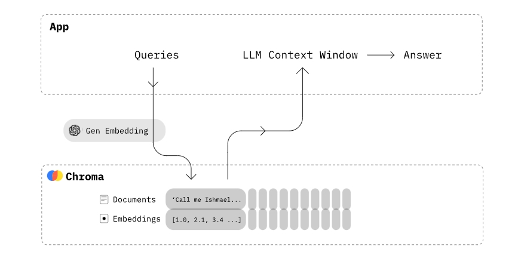
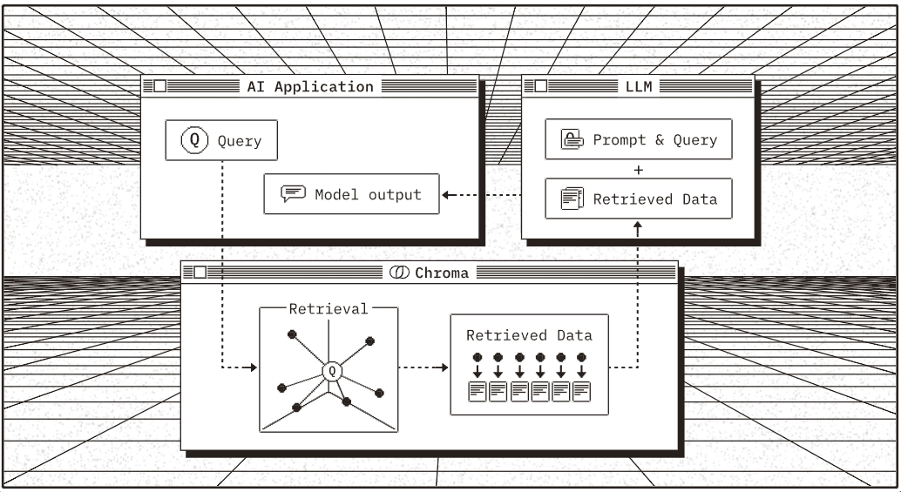

<style>
details {
    border: 1px solid #aaa;
    border-radius: 4px;
    padding: .5em .5em 0;
}
summary {
    font-weight: bold;
    margin: -.5em -.5em 0;
    padding: .5em;
}
details[open] {
    padding: .5em;
}
details[open] summary {
    border-bottom: 1px solid #aaa;
    margin-bottom: .5em;
}
img {
    pointer-events: none;
}
</style>

<details><summary>目录</summary><p>

- [向量数据库简介](#向量数据库简介)
- [向量数据库原理及优势](#向量数据库原理及优势)
- [主流向量数据库](#主流向量数据库)
- [Chroma](#chroma)
    - [Chroma 简介](#chroma-简介)
    - [Chroma 安装](#chroma-安装)
    - [Chroma 使用](#chroma-使用)
    - [Chroma API](#chroma-api)
        - [创建 Chroma Client](#创建-chroma-client)
        - [启动 Client-Server](#启动-client-server)
        - [Collections 操作](#collections-操作)
            - [Creating-Inspecting-Deleting](#creating-inspecting-deleting)
            - [修改距离函数](#修改距离函数)
            - [Add data](#add-data)
            - [Query](#query)
            - [Where](#where)
            - [Updating data](#updating-data)
            - [Deleting data](#deleting-data)
    - [Chorma 部署](#chorma-部署)
        - [Client-Server Mode](#client-server-mode)
        - [Chorma's Thin-Client](#chormas-thin-client)
- [Weaviate](#weaviate)
- [Qdrant](#qdrant)
- [参考](#参考)
</p></details><p></p>

# 向量数据库简介

向量数据库是用于高效计算和管理大量 **向量数据** 的解决方案。
向量数据库是一种专门用于 **存储和检索向量数据(embedding)** 的数据库系统。
它与传统的基于关系模型的数据库不同，它主要关注的是 **向量数据的特性和相似性**。

在向量数据库中，数据被表示为向量形式，每个向量代表一个数据项。
这些向量可以是数字、文本、图像或其他类型的数据。
向量数据库使用高效的 **索引** 和 **查询** 算法来加速向量数据的存储和检索过程。

# 向量数据库原理及优势

向量数据库中的 **数据以向量作为基本单位**，对向量进行 **存储**、**处理** 及 **检索**。
向量数据库通过计算与目标向量的 **余弦距离**、**点积**、**Squared L2** 等获取与目标向量的相似度。
当处理大量甚至海量的向量数据时，向量数据库 **索引** 和 **查询** 算法的效率明显高于传统数据库。

# 主流向量数据库

* [Chroma](https://www.trychroma.com/)：是一个轻量级向量数据库，拥有丰富的功能和简单的 API，
  具有简单、易用、轻量的优点，但功能相对简单且不支持 GPU 加速，适合初学者使用。
* [Weaviate](https://weaviate.io/)：是一个开源向量数据库。
  除了支持 **相似度搜索** 和 **最大边际相关性(MMR，Maximal Marginal Relevance)搜索** 外，
  还可以支持 **结合多种搜索算法（基于词法搜索、向量搜索）的混合搜索**，
  从而搜索提高结果的相关性和准确性。
* [Qdrant](https://qdrant.tech/)：Qdrant 使用 Rust 语言开发，
  有 **极高的检索效率和 RPS(Requests Per Second)**，
  支持 **本地运行**、**部署在本地服务器** 及 **Qdrant 云** 三种部署模式。
  且可以通过为页面内容和元数据制定不同的键来复用数据。

# Chroma

## Chroma 简介

> Chroma is the AI-native open-source vector database. 
> Chroma makes it easy to build LLM apps by making knowledge, 
> facts, and skills pluggable(可插拔) for LLMs.





Chroma gives you the tools to:

* store **embeddings** and their **metadata**
* embed **documents** and **queries**
* search **embeddings**

Chroma prioritizes:

* simplicity and developer productivity
* it also happens to be very quick

## Chroma 安装

```bash
$ pip insall chromadb
```

## Chroma 使用

1. 创建一个 Chroma Client

```python
import chromadb

chroma_client = chormadb.Client()
```

2. 创建一个 collection

> Collections are where you'll store your embeddings, documents, 
> and any additional metadata.

```python
collection = chroma_client.create_collection(name = "my_collection")
```

3. 存储文本文档

```python
collection.add(
    documents = [
        "This is a document about pineapple",
        "This is a document about oranges"
    ],
    ids = ["id1", "id2"],
)
```

4. 查询 collection

> You can query the collection with a list of query texts, 
> and Chroma will return the n most similar results. 

```python
results = collection.query(
    query_texts = ["This is a query document about hawaii"],  # Chroma will embed this for you
    n_results = 2,  # how many results to return
)
print(result)
```

```
{
  'documents': [[
      'This is a document about pineapple',
      'This is a document about oranges'
  ]],
  'ids': [['id1', 'id2']],
  'distances': [[1.0404009819030762, 1.243080496788025]],
  'uris': None,
  'data': None,
  'metadatas': [[None, None]],
  'embeddings': None,
}
```

## Chroma API

### 创建 Chroma Client

```python
import chromadb

client = chromadb.PersistentClient(path = "/path/to/save/to")

# ------------------------------
# useful convenience method
# ------------------------------
# returns a nanosecond heartbeat. 
# Useful for making sure the client remains connected.
client.heartbeat()

# Empties and completely resets the database. 
# ⚠️ This is destructive and not reversible.
client.reset()
```

### 启动 Client-Server

本地启动 Chroma Server:

```bash
$ chroma run --path /db_path
```

本地启动 HTTP client:

```python
import chromadb

chroma_client = chromadb.HttpClient(host = "localhost", port = 8000)
```

本地启动异步(async) HTTP client:

```python
import asyncio
import chromadb

async def main():
    client = await chromadb.AsyncHttpClient()
    collection = await client.create_collection(name = "my_collection")

    await collection.add(
        documents = ["hello world"],
        ids = ["id1"]
    )

asyncio.run(main())
```

### Collections 操作

#### Creating-Inspecting-Deleting

```python
collection = client.create_collection(name="my_collection", embedding_function=emb_fn)
collection = client.get_collection(name="my_collection", embedding_function=emb_fn)
```

```python
# Get a collection object from an existing collection, by name. Will raise an exception if it's not found.
collection = client.get_collection(name="test") 
# Get a collection object from an existing collection, by name. If it doesn't exist, create it.
collection = client.get_or_create_collection(name="test") 
# Delete a collection and all associated embeddings, documents, and metadata. 
⚠# ️ This is destructive and not reversible
client.delete_collection(name="my_collection") 
```

#### 修改距离函数

> Changing distance function

```python
collection = client.create_collection(
    name = "collection_name",
    metadata = {"hnsw:space": "cosine"} # l2 is the default
)
```

#### Add data

```python
collection.add(
    documents = ["lorem ipsum...", "doc2", "doc3", ...],
    metadatas = [
        {"chapter": "3", "verse": "16"}, 
        {"chapter": "3", "verse": "5"}, 
        {"chapter": "29", "verse": "11"}, 
        ...
    ],
    ids = ["id1", "id2", "id3", ...]
)
```

```python
collection.add(
    documents = ["doc1", "doc2", "doc3", ...],
    embeddings = [
        [1.1, 2.3, 3.2], 
        [4.5, 6.9, 4.4], 
        [1.1, 2.3, 3.2], 
        ...
    ],
    metadatas = [
        {"chapter": "3", "verse": "16"}, 
        {"chapter": "3", "verse": "5"}, 
        {"chapter": "29", "verse": "11"}, 
        ...
    ],
    ids = ["id1", "id2", "id3", ...]
)
```

```python
collection.add(
    embeddings = [[1.1, 2.3, 3.2], [4.5, 6.9, 4.4], [1.1, 2.3, 3.2], ...],
    metadatas = [
        {"chapter": "3", "verse": "16"}, 
        {"chapter": "3", "verse": "5"}, 
        {"chapter": "29", "verse": "11"}, 
        ...
    ],
    ids = ["id1", "id2", "id3", ...]
)
```

#### Query

```python
collection.query(
    query_embeddings = [
        [11.1, 12.1, 13.1],
        [1.1, 2.3, 3.2], 
        ...
    ],
    n_results = 10,
    where = {
        "metadata_field": "is_equal_to_this"
    },
    where_document = {
        "$contains": "search_string"
    },
)
```

#### Where

> where filters

* Filtering by **metadata**
* Filtering by **document content**
* Using **logical operators**
* Using **inclusion operators**


#### Updating data

```python
collection.update(
    ids = ["id1", "id2", "id3", ...],
    embeddings = [
        [1.1, 2.3, 3.2], 
        [4.5, 6.9, 4.4], 
        [1.1, 2.3, 3.2], 
        ...
    ],
    metadatas = [
        {"chapter": "3", "verse": "16"}, 
        {"chapter": "3", "verse": "5"}, 
        {"chapter": "29", "verse": "11"}, 
        ...
    ],
    documents = ["doc1", "doc2", "doc3", ...],
)
```

```python
collection.upsert(
    ids = ["id1", "id2", "id3", ...],
    embeddings = [
        [1.1, 2.3, 3.2], 
        [4.5, 6.9, 4.4], 
        [1.1, 2.3, 3.2], 
        ...
    ],
    metadatas = [
        {"chapter": "3", "verse": "16"}, 
        {"chapter": "3", "verse": "5"}, 
        {"chapter": "29", "verse": "11"}, 
        ...
    ],
    documents = ["doc1", "doc2", "doc3", ...],
)
```

#### Deleting data

```python
collection.delete(
    ids = [
        "id1", "id2", "id3", ...
    ],
	where = {"chapter": "20"}
)
```

## Chorma 部署

Chroma Server：

* Client/Server Mode
* Python Thin-Client

容器(Containers)：

* Docker
* Kubernetes

云服务(Cloud Providers)：

* AWS
* GCP
* Azure

### Client-Server Mode

Run Chroma in client/server mode by using CLI:

```bash
$ chroma run --path /db_path
```

Connect to Server using Chroma `HttpClient`：

```python
import chromadb

chroma_client = chromadb.HttpClient(host = 'localhost', port = 8000)
```

异步运行 `AsyncHttpClient`：

```python
import asyncio
import chromadb

async def main():
    client = await chromadb.AsyncHttpClient()
    collection = await client.create_collection(name="my_collection")
    await collection.add(
        documents=["hello world"],
        ids=["id1"]
    )

asyncio.run(main())
```

### Chorma's Thin-Client

```bash
$ pip install chromadb-client
```

```python
import chromadb

# Example setup of the client to connect to your chroma server
client = chromadb.HttpClient(host = 'localhost', port = 8000)

# Or for async usage:
async def main():
    client = await chromadb.AsyncHttpClient(host='localhost', port=8000)
```

# Weaviate

* https://weaviate.io/developers/weaviate

# Qdrant

* https://qdrant.tech/documentation/

# 参考

* [向量及向量知识库](https://github.com/datawhalechina/llm-universe/blob/main/notebook/C3%20%E6%90%AD%E5%BB%BA%E7%9F%A5%E8%AF%86%E5%BA%93/1.%E5%90%91%E9%87%8F%E5%8F%8A%E5%90%91%E9%87%8F%E7%9F%A5%E8%AF%86%E5%BA%93%E4%BB%8B%E7%BB%8D.md)
* [LangChain Components Vectorstores](https://python.langchain.com/docs/integrations/vectorstores/)
