

目录

- [GPT 模型介绍](#gpt-模型介绍)
- [GPT-1](#gpt-1)
    - [无监督预训练](#无监督预训练)
    - [监督微调](#监督微调)
    - [特定任务的输入调整](#特定任务的输入调整)
    - [实验](#实验)
        - [设置](#设置)
        - [数据集](#数据集)
        - [实验结果](#实验结果)
        - [结果分析](#结果分析)
    - [GPT-1 特点](#gpt-1-特点)
    - [GPT-1 与 ELMo 和 BERT 的区别](#gpt-1-与-elmo-和-bert-的区别)
        - [GPT-1 与 ELMo 的区别](#gpt-1-与-elmo-的区别)
        - [GPT-1 与 BERT 的区别](#gpt-1-与-bert-的区别)
    - [GPT-1 总结](#gpt-1-总结)
- [GPT-2](#gpt-2)
    - [GPT-2 模型介绍](#gpt-2-模型介绍)
    - [训练数据](#训练数据)
    - [输入表征](#输入表征)
    - [模型](#模型)
    - [实验](#实验-1)
        - [Language Modeling](#language-modeling)
        - [Children's Book Test](#childrens-book-test)
        - [LAMBADA](#lambada)
        - [Winograd Schema Challenge](#winograd-schema-challenge)
        - [Reading Comprehension](#reading-comprehension)
        - [Summarization](#summarization)
        - [Translation](#translation)
        - [Question Answering](#question-answering)
    - [总结](#总结)
- [参考](#参考)

# GPT 模型介绍

NLP 包含很多类型的任务，包括文本分类、文本匹配等。现在主流的做法是**通过人工标注数据，
针对某个具体场景训练一个模型**，这也使得这种方法在缺乏标注数据的场景下很难奏效。
在这些场景下，往往会有很多未标注数据可以利用起来，在无标注的情况下也能较好的完成相应的任务，
甚至比监督学习的效果更好。之前的词向量的训练就是一个很好的例子，
像 word2vec 这种基本就是在无标注的情况下训练得到的，曾经也是被广泛使用的。

利用无标注文本进行学习仍存在两个待解决的问题：

1. 目前尚不清楚哪种类型的优化目标在学习文本表征方面最有效。
   当下有很多研究在不同的任务中用了不同的优化目标而达到最优；
2. 如何将学习到的文本表征用于下游任务也不明确。
   现有的方法一般是针对下游任务更改模型结构等；

本文提出一种半监督的方法 GPT，用于自然语言理解任务，
GPT 的整体流程结合了**无监督的预训练(Pre-training)**和**有监督的微调(SFT)**。
目标旨在学习到一种通用的表征能够以极小的代价用于各种下游任务。

本质上 GPT 是基于 Transformer 的 Decoder（变体）开发的。

# GPT-1

GPT-1 训练过程整体上分为两步：

1. 在大规模文本数据上学习到一个高容量的语言模型；
2. 在标注数据上进行微调；

这两步训练步骤和 BERT 系列模型类似，
也说明 GPT-1 这个时期在生成时模型解决任务的流程上和 BERT 是一致的。

## 无监督预训练

给定一个无监督 token 序列 `$\mathbf{u} = (u_{1}, u_{2}, \cdots, u_{n})$`，
用一个标准的语言模型目标去极大化似然函数：

`$$L_{1}(\mathbf{u}) = \sum_{i}\log P(u_{i}|u_{i-k}, \cdots, u_{i-1}; \theta)$$`

其中，`$k$` 是上下文划窗的大小，`$\theta$` 为神经网络模型的参数，用 SGD 去更新参数。

GPT-1 所谓的神经网络模型其实就是 Multi-layer Transformer Decoder，
一种对 Transformer 的改进（与原始的 Transformer Decoder 相比，因为只用到 Decoder，
没用到 Encoder，所以把 Decoder 中与 Encoder 相关的 Encoder-Decoder Attention 层删除了，
只保留了 Masked Multi-Head Attention 层和 Feed Forward 层）。
将输入上下文 token 输入进 Multi-head Self-Attention，
然后再接一层 Position-wise FeedForward 去输出一个 token 的分布：

`$$h_{0}=UW_{e} + W_{p}$$`
`$$h_{l} = \text{transformer block}(h_{l-1}), \forall i \in [1, n]$$`
`$$P(u) = \text{softmax}(h_{n}W_{e}^{T})$$`

其中：

* `$U=(u_{-k}, \cdots, u_{-1})$` 是上下文 token 对应的 Embedding 向量
* `$n$` 是 Decoder 的层数
* `$W_{e}$` 是 token Embedding 矩阵
* `$W_{p}$` 是 Position Embedding 矩阵

Decoder 的修改(相较于 Transformer Decoder)：

1. Transformer Decoder：
    - Masked Multi-head Self-Attention
    - Encoder-Decoder Multi-head Self-Attention
    - Feed Forward
2. GPT Decoder：
    - Masked Multi-head Self-Attention
    - Feed Forward

## 监督微调

设标注数据为 `$C$`，每个样本的输入为一个 token 序列：`$x^{1}, x^{2}, \cdots, x^{m}$`，
对应的标签为 `$y$`。

将 token 序列输入到预训练模型中，获取最后一个 Transformer Decoder 的输出 `$h_{l}^{m}$`，
然后将 `$h_{l}^{m}$` 输入到参数为 `$W_{y}$` 的线性输出层去预测 `$y$`：

`$$P(y|x^{1}, \cdots, x^{m}) = \text{Softmax}(h_{l}^{m}W_{y})$$`

接下来就是极大化下列目标函数：

`$$L_{2}(C) = \sum_{(x,y)}\log P(y|x^{1}, \cdots, x^{m})$$`

GPT 的实验中发现，加入语言模型学习目标作为辅助任务，
也就是损失函数中加入 `$L_{1}(u)$` 能带来两点好处：

1. 提升监督模型的泛化能力；
2. 加快收敛。

因此，最终的优化目标如下：

`$$L_{3}(C) = L_{2}(C) + \lambda L_{1}(C)$$`

## 特定任务的输入调整

针对文本分类之类的任务，可以按照上述步骤进行微调。
但是类似于问答、文本蕴含之类的以有序的句子对作为输入的任务，
就需要根据这些特定的任务做一些修改。论文针对不同的任务提出了不同的修改，
将输入数据进行规范化以满足模型要求。具体对应的结构可以看下图：

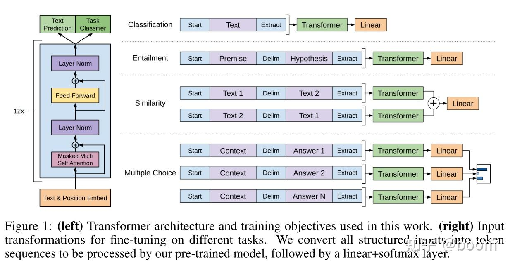

## 实验

### 设置

* 无监督预训练：
    - 数据集 1 为 BooksCorpus dataset，包含了超过 7000 本多领域的书。
      该数据集包含很多长的连续的文本，也使得模型能够学习到长距离的信息；
    - 数据集  2 是 Word Benchmark，和 ElMo 的数据集一样，但在句子层面进行了打乱。
* 模型细节：
    - 结构上，GPT-1 是 12 层的 Decoder-only Transformer with Masked Self-Attention heads；
    - 优化器用的是 Adam。最大学习率是 2.5e-4，基于余弦 schedule 变化的；
    - 编码使用的是 bytepair encoding(BPE)。
* 微调细节
    - 对于大多数任务，学习率是 6.25e-4，batch size 是 32，`$\lambda$` 是 0.5。

### 数据集

下标表明了评估模型的各个任务，及对应的使用的数据集。

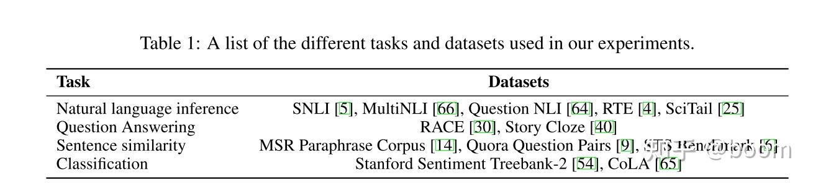

### 实验结果

下表是在自然语言推理 NLI 任务上的表现，可以看出除了在 RTE 这个数据集以为，
其它数据集都能达到 sota。当然这个结果已经比较早了，
GPT-1 毕竟是 18 年的模型，对比的模型现在看来也不是很先进的。

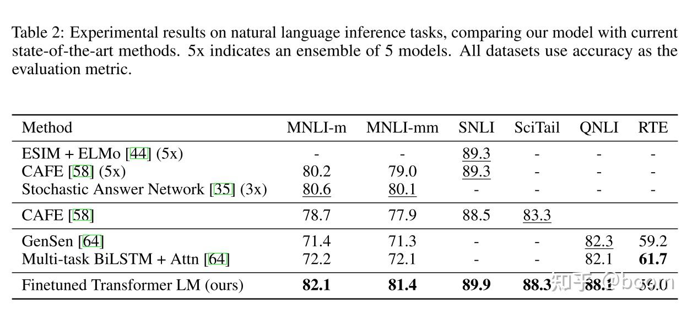

下表是在问答和常识推理任务的表现，均达到最优，也说明的 GPT-1 对 long-range contexts 的学习很不错。

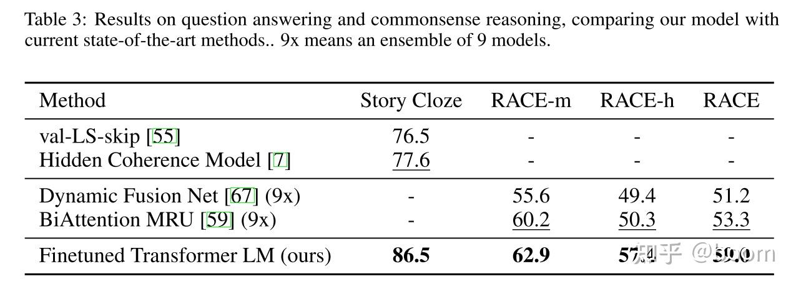

下表是关于语义相似和分类任务的评估：

### 结果分析

1. 层数的影响：
    - 下图左图展现了随着层数的增加，效果的增加。
      说明预训练的每一层都对下游任务带来不同的信息。
2. Zero-shot 的表现
    - 下图右边展示的不用微调，而直接用预训练用于各种任务的结果，
      虚线是 LSTM，实线是 Transformer。比较直接的说明了，
      就预训练而言，Transformer 的迁移能力比 LSTM 好。
3. 消融实验：下标是做的一些消融实验。主要是三个方面，
    - 第一个是针对以语言模型学习目标作为辅助任务来进行训练是否有提升，
      结果是在 QQP 和 NLI 数据集上有帮助，其它的则无，说明针对大规模数据集而言，
      针对小规模数据集则无提升；
    - 针对 Transformer 和 LSTM 的对比，除了 MRPC 以外，Transformer 均更优优势；
    - 针对预训练带来的提升进行的实验，结果现实如果没有预训练，则所有任务表现均下降。

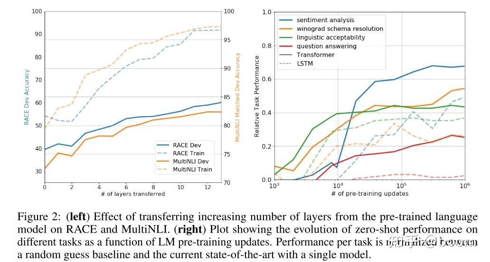

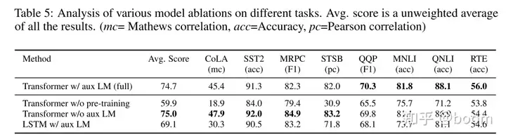

## GPT-1 特点

优点：

特征抽取器使用了强大的 Transformer，能够捕捉到更长的记忆信息，
且较传统的 RNN 更易于并行化。

缺点：

GPT 最大的问题就是传统的语言模型是单向的；

## GPT-1 与 ELMo 和 BERT 的区别

### GPT-1 与 ELMo 的区别

* 模型架构不同
    - ELMo 是浅层的双向 RNN；
    - GPT 是多层的 Transformer Decoder。
* 针对下游任务的处理不同：
    - ELMo 将词嵌入添加到特定任务中，作为附加功能；
    - GPT 则针对所有任务微调相同的基本模型。

### GPT-1 与 BERT 的区别

* 预训练
    - GPT 预训练的方式和传统的语言模型一样，通过上文，预测下一个单词；
    - BERT 会同时利用上下文的信息。
* 模型效果
    - GPT 因为采用了传统语言模型，所以更加适合用于自然语言生成类的任务(NLG)，
      因为这些任务通常是根据当前信息生成下一刻的信息。
    - 而 BERT 更适合用于自然语言理解任务(NLU)。(当然这是之前的说法，
      现在 ChatGPT 出来以后哪个更适合 NLU 任务还真不一定)。
* 模型结构
    - GPT 采用了 Transformer 的 Decoder，而 BERT 采用了 Transformer 的 Encoder；
    - GPT 使用 Decoder 中的 Mask Multi-Head Attention 结构

## GPT-1 总结

GPT-1 是基于 Transformer Decoder 的变体构成的模型，针对各种任务的思路仍然是 Pre-train + fine tune，
在当时和 BERT 的思路一样，都是比较先进的思路。只不过从现在 ChatGPT 的生成式处理思路来看，
其实差距还是挺大的，虽然名字都是 GPT。

fine tune 的思路带来的问题就是针对某一种任务就以某一种结构和相应场景的数据去做，
并不是通用的。

# GPT-2

当下机器学习系统在很多任务中的表现出色主要是来自于其大规模的训练数据集、
大容量模型以及监督学习。但是往往这种系统容易受到数据分布改变的影响。
现有的机器学习系统都是针对特定场景设计的，而不是一种通用的系统。
GPT-2 的目标就是作为一个通用的模型，适用于各种场景，甚至不需要标注数据去训练。

GPT-2 证明了语言模型在没有参数和模型结构修改的情况下，就能够用于各种下游任务。

## GPT-2 模型介绍

GPT-2 模型的核心就是语言模型。
语言建模通常被定义为来自一组例子 `$(x_{1}, x_{2},\cdots, x_{n})$` 的无监督分布估计，
每个例子都包含了一个长度不定的序列 `$(s_{1}, s_{2},\cdots, s_{n})$`。
语言模型有着天然的顺序性，因此能够以条件概率的方式去计算其概率：

`$$p(x) = \sum_{i=1}^{n}p(s_{n}|s_{1},\cdots,s_{n-1})$$`

针对某个任务来说，其目标就是 `$p(\text{output}|\text{input})$`。
通用的语言模型需要在输入相同但任务不同的情况下，
输出不同（即针对相同输入，由于任务种类不一样，对应的输出就不同）。
所以，通用语言模型针对某个任务其目标就是学习 `$p(\text{output}|\text{input})$`，
作者在论文中称为 **Task conditioning**。

实现这种 Task conditioning 有两种方法，一种是模型结构层面（architectural level），
另一种是算法层面的（algorithmic level）。

* 模型结构（architectural level）层面
    - 针对不同的任务构建不同的 Encoder-Decoder 结构，
      这里我认为作者表达的意思就是不同的任务用不同的结构，
      和 GPT-1 类似（尽管 GPT-1 没 Encoder 这个部分）。
* 算法层面（algorithmic level）
    - 主要是利用语言模型的灵活性，将输入、输出、任务类型统一打包成新的输入，
      比如针对英译中的翻译任务，训练输入就是：`(translate to chinese, english text, chinese text)`。

GPT-2 的原文花了很多篇幅去讲的一个点就是，语言模型如何在无监督的情况下进行训练，
并且实现 zero-shot 的多任务推理。

## 训练数据

GPT-2 的思想是尽可能使训练数据大且更加多样化，以此来学习到不同领域的知识，
和之前的做法不同的是不再针对单个领域特定任务进行学习。

通过 Common Crawl 能够获得多种类、大规模的数据集。
但是有不止一个研究发现通过 Common Crawl 获得的数据集往往会存在质量问题，
这一点在 GPT-2 的原始实验中也发现了。因此在 GPT-2 中的做法是，只爬取人工筛选过的 web 数据。
但是人工筛选整个 web 的数据会非常昂贵，作为替代，
GPT-2 通过爬取 Reddit 上所包含的链接（这里是以一种启发式的方法去获取人工筛选的数据，
GPT-2 认为 Reddit 这个社交媒体上挂的链接，可能是人们比较感兴趣或认为有价值的，
因此存在数据质量问题的概率比较小）。

最终 GPT-2 获得的数据集为 "WebText"，包含了 4500 万个链接的文本数据。
经过清洗和各种处理之后包含 800 万个文档，共计 40GB 的文本数据。
另外还去除了维基百科的数据，以防和论文中使用的其它数据集存在重复。

## 输入表征

一个通用的语言模型应该能够处理任何字符，但是现有的语言模型通过包含各种预处理操作：
lower-casing、tokenization、预设词汇表等。这些操作都会限制语言模型能够处理的字符范围。

GPT-2 综合考虑了 OOV 问题和词表过大的问题，使用了 BPE 算法，也能够使模型处理任何字符。

## 模型

GPT-2 的模型结构和 GPT-1 的模型结构类似，都是基于 Transformer 的。
相对于 GPT-1，做的修改有：

1. 调整 Transformer 的 Decoder
    - 将归一化层移动到 block 的输入位置并且在最后一个 Self-Attention 之后加了一层归一化
2. 数据量扩增
    - GPT-1 利用了约 5GB
    - GPT2 利用了 40GB，并且质量更高
3. 词典被扩展到了 50257，context 的维度从 512 提高到了 1024，并且 batch size 采用了 512
4. 去掉了 Fine-tune 部分
    - 使用了完全的无监督训练。这样使得预训练和 Fine-tuning 的结构完全一致
5. 堆叠的层数增加
    - GPT-1 使用的 12 层的 Transformer Decoder
    - GPT-2 分别使用了 24、36、48 层

## 实验

GPT 的几个模型的大小和结构参数见下表。最小的模型对应的原始的 GPT-1(1.17亿参数)，
第二小的对应的是 BERT-large(3.45亿参数)。最大的就是 GPT-2（15亿参数）：

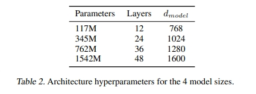

### Language Modeling

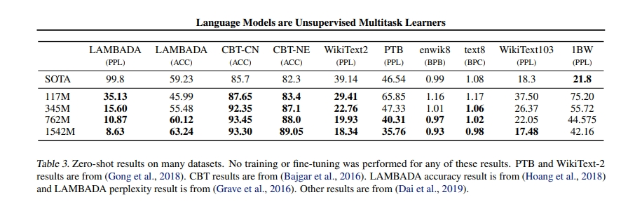

### Children's Book Test

儿童图书测试（CBT）是用来检验语言模型在不同类别的词上的表现，比如命名实体、名词、动词和介词。
主要是以完型填空的形式，让语言模型去预测 10 个选项中哪个最可能是正确的。
GPT-2 的做法是预测每个选项为这个空缺的概率，并取概率最高的为预测选项。效果见下图。

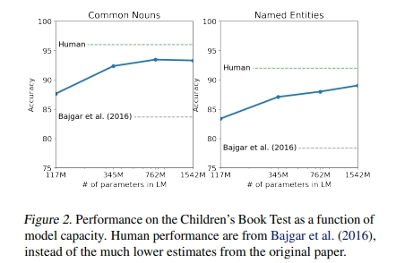

### LAMBADA

LAMBADA 数据集测试模型对文本中长期依赖关系的建模能力。
任务是预测最后一个单词，对于人来说想要预测准确必须了解至少 50 个 token 的 context。
为了在 LAMBADA 上取得成功，计算模型不能仅仅依赖于局部上下文，而必须能够跟踪更广泛的语篇信息。

### Winograd Schema Challenge

Winograd Schema 挑战旨在通过测量模型解决文本中的歧义的能力来衡量其进行常识推理的能力。

任务形式可以参考下图。结果见下图：

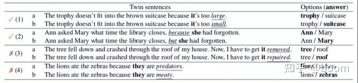

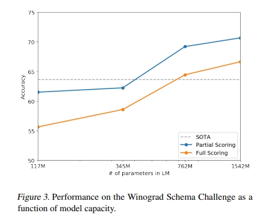

### Reading Comprehension

CoQA 数据集由 7 个不同领域的文档和关于文档的自然语言对话组成，
测试阅读理解能力和模型回答依赖于对话历史的问题的能力。

### Summarization

GPT-2 在 CNN and Daily Mail dataset 执行摘要的能力。为了诱导摘要行为，
作者在文章后面添加了 “TL;DR:”（Too Long; Didn’t Read，用来作为过长文章的摘要标题，
表示这里是内容的简化版或主旨）文本。结果见下表。

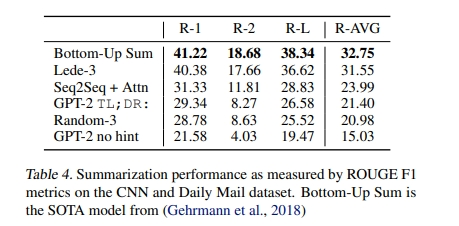

### Translation

主要是针对英语->法语、法语->英语的翻译任务进行测试。

### Question Answering

在 Natural Questions dataset 进行问答能力测试。
下表是 GPT-2 在验证集上最有自信的 30 个回答样本。

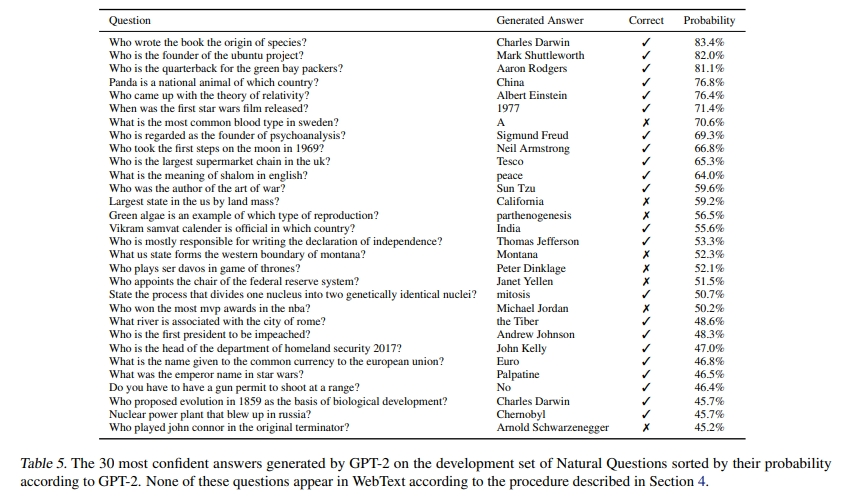

## 总结

GPT-2 终于提出了新的 NLP 范式，
强调通过更多的高质量训练数据训练高容量语言模型从而无监督完成下游多任务。
尝试以一种通用的语言模型的方法，去解决现有的大部分 NLP 任务。
GPT-2 在模型本身上没啥大的变化和创新，但是就适配各种任务的方式来说可以说是一个比较大的突破。

# 参考

* [GPT系列：GPT-1 详解](https://zhuanlan.zhihu.com/p/508053361)
* [GPT系列：GPT-2 详解](https://zhuanlan.zhihu.com/p/511263118)
* [BPE](https://zhuanlan.zhihu.com/p/589086649)
* [GPT-1 Paper: Improving Language Understanding by Generative Pre-Training](https://cdn.openai.com/research-covers/language-unsupervised/language_understanding_paper.pdf)
* [GPT-2 Paper: Language Models are Unsupervised Multitask Learners](https://cdn.openai.com/better-language-models/language_models_are_unsupervised_multitask_learners.pdf)
