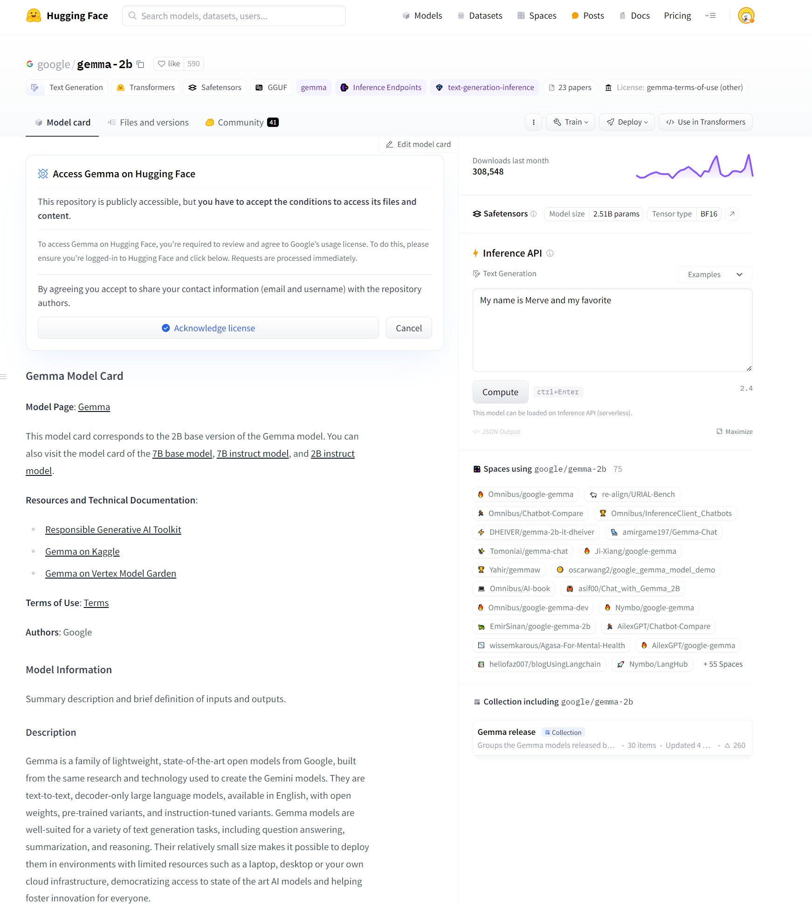

<style>
details {
    border: 1px solid #aaa;
    border-radius: 4px;
    padding: .5em .5em 0;
}
summary {
    font-weight: bold;
    margin: -.5em -.5em 0;
    padding: .5em;
}
details[open] {
    padding: .5em;
}
details[open] summary {
    border-bottom: 1px solid #aaa;
    margin-bottom: .5em;
}
img {
    pointer-events: none;
}
</style>

<details><summary>目录</summary><p>

- [Gemma 模型介绍](#gemma-模型介绍)
    - [Prompt 提示词格式](#prompt-提示词格式)
    - [探索未知领域](#探索未知领域)
    - [与 Google Cloud 集成](#与-google-cloud-集成)
    - [与推理端点集成](#与推理端点集成)
    - [Gemma 指令模型互动对话体验](#gemma-指令模型互动对话体验)
- [使用 Hugging Face Transformers 模型推理](#使用-hugging-face-transformers-模型推理)
    - [JAX 权重](#jax-权重)
- [使用 Hugging Face TRL 进行模型微调](#使用-hugging-face-trl-进行模型微调)
- [Gemma 模型中文指令微调](#gemma-模型中文指令微调)
    - [简介](#简介)
    - [预训练模型和微调数据](#预训练模型和微调数据)
    - [Hugging Face TRL + Colab GPU](#hugging-face-trl--colab-gpu)
        - [加载微调数据](#加载微调数据)
        - [微调数据转换为 OAI messages](#微调数据转换为-oai-messages)
        - [微调数据分割及保存](#微调数据分割及保存)
        - [模型微调](#模型微调)
    - [Keras + Kaggle TPU -\> Hugging Face](#keras--kaggle-tpu---hugging-face)
    - [苹果 MLX 框架](#苹果-mlx-框架)
    - [总结](#总结)
- [参考](#参考)
</p></details><p></p>

> 关键词:
> 
> * 预训练模型
> * 指令调优
> * tokens 处理能力
> * TRL
> * Prompt 提示词格式
> * 零样本任务
> * 少样本任务
> * 顺序微调技术（SFT）
> * 基于人类反馈的强化学习（RLHF）

# Gemma 模型介绍

> Gemma: Google 最新推出开源大语言模型(Google's new open LLM)

2024 年 2 月 22 日，Google 发布了一系列最新的开放式大型语言模型 -- Gemma！
Gemma 是基于 Gemini 技术推出的新型大型语言模型（LLM），Gemma 提供两种规模的模型，
每种规模的模型都包含 <span style='border-bottom:1.5px dashed red;'>基础版本</span> 和 <span style='border-bottom:1.5px dashed red;'>经过指令调优</span> 的版本：

* 7B 参数模型，针对消费级 GPU 和 TPU 设计，确保高效部署和开发；
* 2B 参数模型则适用于 CPU 和移动设备。

所有版本均可在各类消费级硬件上运行，无需数据量化处理，
拥有高达 <span style='border-bottom:1.5px dashed red;'>8K tokens</span> 的处理能力。
在 Hagging Face Hub 上，可以找到这四个公开可访问的模型（包括两个基础模型和两个经过调优的模型）：

* [gemma-7b](https://huggingface.co/google/gemma-7b)：7B 参数的基础模型。
* [gemma-7b-it](https://huggingface.co/google/gemma-7b-it)：7B 参数的指令优化版本。
* [gemma-2b](https://huggingface.co/google/gemma-2b)：2B 参数的基础模型。
* [gemma-2b-it](https://huggingface.co/google/gemma-2b-it)：2B 参数的指令优化版本。

此次发布的亮点包括：

* Hugging Face Hub 上的模型，包括模型说明和授权信息
* Hugging Face Transformers 的集成
* 与 Google Cloud 的深度集成
* 与推理端点 (Inference Endpoints) 的集成
* 使用 Hugging Face TRL 在单个 GPU 上对 Gemma 进行微调的示例

## Prompt 提示词格式

Gemma 的基础模型不限定特定的提示格式。如同其他基础模型，
它们能够根据输入序列生成一个合理的续接内容，
适用于 <span style='border-bottom:1.5px dashed red;'>零样本</span> 或 <span style='border-bottom:1.5px dashed red;'>少样本</span> 的推理任务。
这些模型也为针对特定应用场景的微调提供了坚实的基础。
指令优化版本则采用了一种极其简洁的对话结构：

```xml
<start_of_turn>user
knock knock<end_of_turn>
<start_of_turn>model
who is there<end_of_turn>
<start_of_turn>user
LaMDA<end_of_turn>
<start_of_turn>model
LaMDA who?<end_of_turn>
```

要有效利用这一格式，必须严格按照上述结构进行对话。
我们将演示如何利用 `transformers` 库中提供的聊天模板简化这一过程。

## 探索未知领域

尽管技术报告提供了关于基础模型训练和评估过程的信息，
但关于数据集构成和预处理的具体细节则较为欠缺。
据悉，这些模型是基于来自互联网文档、编程代码和数学文本等多种数据源训练而成，
经过严格筛选，以排除含有敏感信息和不适内容的数据。

对于 Gemma 的指令优化模型，
关于 <span style='border-bottom:1.5px dashed red;'>微调数据集</span> 以及与 <span style='border-bottom:1.5px dashed red;'>顺序微调技术（SFT）</span> 和 <span style='border-bottom:1.5px dashed red;'>基于人类反馈的强化学习（RLHF）</span> 相关的超参数设置，细节同样未公开。

## 与 Google Cloud 集成

可以通过 Vertex AI 或 Google Kubernetes Engine(GKE) 在 Google Cloud 上部署和训练 Gemma，
利用 <span style='border-bottom:1.5px dashed red;'>文本生成推理</span> 和 <span style='border-bottom:1.5px dashed red;'>Transformers</span> 实现。

* 要从 Hugging Face <span style='border-bottom:1.5px dashed red;'>部署 Gemma 模型</span>，
  请访问 `模型页面` 并点击 `部署 -> Google Cloud`。
  这将引导你进入 Google Cloud Console，在那里你可以通过 Vertex AI 或 GKE 一键部署 Gemma。
  文本生成推理为 Gemma 在 Google Cloud 上的部署提供支持，
  你也可以通过 Vertex AI Model Garden 直接访问 Gemma。
* 要在 Hugging Face 上 <span style='border-bottom:1.5px dashed red;'>微调 Gemma 模型</span>，
  请访问 `模型页面` 并点击 `训练 -> Google Cloud`。
  这将引导你进入 Google Cloud Console，在那里你可以在 Vertex AI 或 GKE 上访问笔记本，
  以在这些平台上微调 Gemma。

## 与推理端点集成

可以 <span style='border-bottom:1.5px dashed red;'>在 Hugging Face 的推理端点上部署 Gemma</span>，
该端点使用文本生成推理作为后端。

文本生成推理是由 Hugging Face 开发的可用于生产环境的推理容器，旨在简化大型语言模型的部署。
它支持连续批处理、令牌流式传输、多 GPU 张量并行加速推理，并提供生产就绪的日志记录和跟踪功能。

要部署 Gemma 模型，请访问 Hugging Face Hub `模型页面` 并点击 `部署 -> 推理端点`。
推理端点通过文本生成推理支持 `消息 API`，使你可以通过简单地更换 URL 从其他封闭模型切换到开放模型。

```python
from openai import OpenAI

# initialize the client but point it to TGI
client = OpenAI(
    base_url = "<ENDPOINT_URL>" + "/v1/",  # replace with your endpoint url
    api_key = "<HF_API_TOKEN>",  # replace with your token
)
chat_completion = client.chat.completions.create(
    model="tgi",
    messages = [
        {
            "role": "user", 
            "content": "Why is open-source software important?"
        },
    ],
    stream = True,
    max_tokens = 500
)

# iterate and print stream
for message in chat_completion:
    print(message.choices[0].delta.content, end = "")
```

## Gemma 指令模型互动对话体验

可以在 Hugging Chat 上体验[与 Gemma 指令模型的互动对话](https://hf.co/chat?model=google/gemma-7b-it)！ 

# 使用 Hugging Face Transformers 模型推理

借助 Transformers 的 4.38 版本，你可以轻松地使用 Gemma 模型，
并充分利用 Hugging Face 生态系统内的工具，包括：

* 训练和推理脚本及示例
* 安全文件格式（`safetensors`）
* 集成了诸如 bitsandbytes（4位量化）、PEFT（参数效率微调）和 Flash Attention 2 等工具
* 辅助工具和帮助器，以便使用模型进行生成
* 导出模型以便部署的机制

另外，Gemma 模型支持 `torch.compile()` 与 CUDA 图的结合使用，
在推理时可实现约 4 倍的速度提升！

1. 确保使用的是最新版本的 `transformers`：

```bash
$ pip install -U "transformers==4.38.1" --upgrade
```

2. 以下代码片段展示了如何结合 `transformers` 使用 `gemma-7b-it`。
   运行此代码需大约 18 GB 的 RAM，适用于包括 3090 或 4090 在内的消费级 GPU。

```python
import torch
from transformers import AutoTokenizer, pipline

# ? model load
model = "google/gemma-7b-it"

# tokenizer
tokenizer = AutoTokenizer.from_pretrained(model)

# pipeline
pipeline = pipeline(
    "text-generation",
    model = model,
    model_kwargs = {
        "torch_dtype": torch.bfloat16
    },
    device = "cuda",
)

# TODO
messages = [
    {
        "role": "user",
        "content": "Who are you? Please, answer in pirate-speak.",
    }
]

# prompt
prompt = pipeline.tokenizer.apply_chat_template(
    messages,
    tokenizer = False,
    add_generation_prompt = True,
)

# outputs
outputs = pipeline(
    prompt,
    max_new_tokens = 256,
    add_special_tokens = True,
    do_sample = True,
    temperature = 0.7,
    top_k = 50,
    top_p = 0.95,
)

print(outputs[0]["generated_text"][len(prompt):])
```

```
Avast me, me hearty. I am a pirate of the high seas, ready to pillage and plunder. Prepare for a tale of adventure and booty!
```

简单介绍一下这段代码:

* 代码段展示了如何利用 `bfloat16` 数据类型进行模型推理，该数据类型是所有评估中使用的参考精度。
  如果你的硬件支持，使用 float16 可能会更快。
* 还可以将模型自动量化，以 8 位或 4 位模式加载。以 4 位模式加载模型大约需要 9 GB 的内存，
  使其适用于多种消费级显卡，包括 Google Colab 上的所有 GPU。
  以下是以 4 位加载生成 `pipeline` 的方法：

```python
pipeline = pipeline(
    "text-generation",
    model = model,
    model_kwargs = {
        "torch_dtype": torch.float16,
        "quantization_config": {
            "load_in_4bit": True
        }
    },
    device = "cuda",
)
```

更多关于如何使用 transformers 和模型的详情，请参阅模型卡片。

## JAX 权重

所有 Gemma 模型变种都可以用 PyTorch 或 JAX / Flax 使用。
若要加载 Flax 权重，你需要按照以下方式使用仓库中的 `flax` 修订版本：

```python
import jax.numpy as jnp
from transformers import AutoTokenizer, FlaxGemmaForCausalLM

model_id = "google/gemma-2b"

tokenizer = AutoTokenizer.from_pretrained(model_id)
tokenizer.padding_side = "left"

model, params = FlaxGemmaForCausalLM.from_pretrained(
    model_id,
    dtype = jnp.bfloat16,
    revision = "flax",
    _do_init = False,
)

inputs = tokenizer(
    "Valencia and Málaga are", 
    return_tensors = "np", 
    padding = True,
)
output = model.generate(
    input,
    params = params, 
    max_new_tokens = 20, 
    do_sample = False,
)
output_text = tokenizer.batch_decode(
    output.sequences,
    skip_special_tokens = True,
)
```

```
['Valencia and Málaga are two of the most popular tourist destinations in Spain. Both cities boast a rich history, vibrant culture,']
```

如果你在 TPU 或多个 GPU 设备上运行，可以利用 `jit` 和 `pmap` 来编译和并行执行推理任务。

# 使用 Hugging Face TRL 进行模型微调

在消费级 GPU 上训练大型语言模型既是技术上的挑战，也是计算上的挑战。
本节将介绍 Hugging Face 生态系统中可用的工具，
这些工具可以帮助你高效地在消费级 GPU 上训练 Gemma。

一个微调 Gemma 的示例命令如下。我们利用 <span style='border-bottom:1.5px dashed red;'>4 位量化</span> 和 <span style='border-bottom:1.5px dashed red;'>QLoRA（一种参数效率微调技术）</span> 来减少内存使用，
目标是所有注意力块的线性层。值得注意的是，与密集型 Transformer 不同，
MLP 层（多层感知器层）因其稀疏性不适合与 PEFT（参数效率微调）技术结合使用。

1. 首先，安装 Hugging Face TRL 的最新版本并克隆仓库以获取训练脚本：

```bash
$ pip install -U transformers
$ pip install git+https://github.com/huggingface/trl
$ git clone https://github.com/huggingface/trl
$ cd trl
```

2. 然后运行脚本：

```bash
accelerate launch --config_file examples/accelerate_configs/multi_gpu.yaml --num_processes=1 \
    examples/scripts/sft.py \
    --model_name google/gemma-7b \
    --dataset_name OpenAssistant/oasst_top1_2023-08-25 \
    --per_device_train_batch_size 2 \
    --gradient_accumulation_steps 1 \
    --learning_rate 2e-4 \
    --save_steps 20_000 \
    --use_peft \
    --peft_lora_r 16 --peft_lora_alpha 32 \
    --target_modules q_proj k_proj v_proj o_proj \
    --load_in_4bit
```

在单个 A10G GPU 上，这个训练过程大约需要 9 小时。
通过调整 `--num_processes` 参数为你可用的 GPU 数量，
可以实现并行化训练，从而缩短训练时间。

# Gemma 模型中文指令微调

## 简介

谷歌在 2 月 21 日放出开放权重的 Gemma 系列大模型，包括 2B 和 7B 两个大小，
并且有预训练和指令微调两个版本。
虽然 Gemma 的 <span style='border-bottom:1.5px dashed red;'>预训练数据</span> 里面包含多种语言，
不过在官方的技术报告里，明确指出了做 <span style='border-bottom:1.5px dashed red;'>指令微调</span> 的时候只用了英文。

经过 <span style='border-bottom:1.5px dashed red;'>英文指令微调的 Gemma 模型</span>，
仍然保留一定程度的 <span style='border-bottom:1.5px dashed red;'>指令跟随能力</span>，
可以理解一部分中文指令，但有些时候我们未必希望使用官方的指令微调模型，
而是希望将预训练模型重新进行中文指令微调，来达到我们的要求，
所以在这里我们就分享三个方法来进行 <span style='border-bottom:1.5px dashed red;'>Gemma 的中文指令微调</span>。

## 预训练模型和微调数据

* 预训练模型: 在这里我们统一使用 [gemma-2b](https://hf.co/google/gemma-2b-it) 这个模型。



* 选择了 [Hello-SimpleAI/HC3-Chinese](https://hf.co/datasets/Hello-SimpleAI/HC3-Chinese) 数据集来作为微调数据。
  这个数据集有不同主题的问答，包括问题，人类回答和 ChatGPT 回答，涵盖了金融，百科，法律等等诸多题材，我们只使用 `baike` 这个子集，且不使用 ChatGPT 回答。


## Hugging Face TRL + Colab GPU

Hugging Face 的工程师 Phil Schmid 在 2024 年 1 月底写了 一篇很好的博客，
详细讲解如何用 Hugging Face TRL 库来进行模型微调。其中的代码绝大部分都可以复用，
不过他使用的是 `b-mc2/sql-create-contex` 数据集（用于自然语言生成 SQL 语句），
所以我们只需要将数据这部分换成我们想要的中文指令微调数据即可。

### 加载微调数据

```python
from datasets import load_dataset

# Load dataset from the Hugging Face Hub
dataset_dict = load_dataset("Hello-SimpleAI/HC3-Chinese", name = "baike")
dataset = dataset_dict["train"]
```

### 微调数据转换为 OAI messages

```python
def create_conversation(sample):
    """
    Convert dataset to OAI messages
    """
    system_message = """你是一个知识丰富的人工智能助手，用户将用中文向你提问，你将根据你的知识用中文来如实回答问题"""
    return {
        "message": [
            {"role": "system", "content": system_message},
            {"role": "user", "content": sample["question"]},
            # for whatever reason the dataset uses a list of answers
            {"role": "assistant", "content": sample["human_answers"][0]}, 
        ]
    }

# 测试
print(create_conversation(dataset[0]))

# 数据转换
dataset = dataset.map(
    create_conversation,
    remove_columns = ["id", "chatgpt_answers"],
    batched = False,
)
```

在进行指令微调之前，如果我们测试模型的中文能力：

```
Query:
你是一个知识丰富的人工智能助手，用户将用中文向你提问，你将根据你的知识用中文来如实回答问题
我有一个信息科学相关的问题，请用中文回答，什么是 rm
Generated Answer:
，请 rm，请 rm，请 rm，请 rm，请 rm，请 rm，请 rm，请 rm，请 rm，请 rm，请 rm，请 rm，请 rm，请 rm，请 rm，请 rm，请 rm，请 rm，请 rm，请 rm，请 rm，请 rm，请 rm，请 rm，请 rm，请 rm，请 rm，请 rm，请 rm，请 rm，请 rm，请 rm，请 rm，请 rm，请 rm，请 rm，请 rm，请 rm，请 rm，请 rm，请 rm，请 rm，请 rm，请 rm，请 rm，请 rm，请 rm，请 rm，请 rm，请 rm，请 rm，请 rm，请 rm，请 rm，请 rm，请 rm，请 rm，请 rm，请 rm，请 rm，请 rm，请 rm，请 rm，请 rm，请 rm，请 rm，请 rm，请 rm，请 rm，请 rm，请 rm，请 rm，请 rm，请 rm，请 rm，请 rm，请 rm，请 rm，请 rm，请 rm，请 rm，请 rm，请 rm，请 rm，请 rm，
```

模型很快陷入循环（注意这里使用的不是已经做过指令微调的模型 `gemma-2b-it`，
所以陷入循环是正常的，也正是我们要进行指令微调的原因）。完成我们的微调之后再测试：

### 微调数据分割及保存

```python
# train and test data split
dataset = dataset.train_test_split(test_size = 0.1)

# save datasets to disk
dataset["train"].to_json("train_dataset.json", orient = "records")
dataset["test"].to_json("test_dataset.json", orient = "records")
```

### 模型微调

TRL 库可以自行处理 ChatML 格式，所以我们只需要将提问和人类回答填入模板即可。
之后即可运行 trainer.train() 进行 LoRA 训练。
在免费的 Colab T4 GPU 上大约需要 3.5 小时完成训练（当前设置为 3 个 epoch，可酌情减少）。

```python
trainer.train()
```

这里生成的答案就很合理也没有陷入循环（虽然跟 label，也就是 Origianl answer 不一样，但也是正确答案）。

```
Query:
我有一个信息科学相关的问题，请用中文回答，什么是 rm
Original Answer:
RM 格式是 RealNetworks 公司开发的一种流媒体视频文件格式，可以根据网络数据传输的不同速率制定不同的压缩比率，从而实现低速率的 Internet 上进行视频文件的实时传送和播放。它主要包含 RealAudio、RealVideo 和 RealFlash 三部分。
Generated Answer:
rm 是 remove 的缩写，用于删除指定的目录或文件，语法形式为：rm -r /path/to/file。
```

## Keras + Kaggle TPU -> Hugging Face

> Keras 使用 JAX 后端

这个方法的思路是修改谷歌官方的微调教程，使用 Keras 在 Kaggle TPU 上微调 gemma-2b 模型，
然后将模型转换成 Hugging Face 模型。用于这里使用 TPU v3，速度比 Colab 上的 T4 GPU 快很多。

[官方教程](https://ai.google.dev/gemma/docs/distributed_tuning)使用的是 `IMDB` 数据集，
我们替换为 `Hello-SimpleAI/HC3-Chinese` `baike` 数据集:

```python
import re
import json

# ------------------------------
# 下载和预处理微调数据
# ------------------------------
!wget -O baike.jsonl https://huggingface.co/datasets/Hello-SimpleAI/HC3-Chinese/raw/main/baike.jsonl
data = []
context = "你是一个知识丰富的人工智能助手，用户将用中文向你提问，你将根据你的知识用中文来如实回答问题。\n"
with open("baike.jsonl") as file:
    for line in file:
        features = json.loads(line)        
        template = context + "问题：\n{question}\n答案：\n{human_answers[0]}"
        data.append(template.format(**features))

# ------------------------------
# Manually construct a test case
# ------------------------------
# Already made sure the finetuning dataset contains nothing about zsh
test_prompt = context + "问题：\n我有一个信息科学相关的问题，请用中文回答，什么是 zsh\n答案：\n"

# ------------------------------
# train data
# ------------------------------
# 4616 in total in baike split
train_data = data[:4600]
```

之后进行训练，完成之后将模型转化为 Hugging Face 模型:

```python
# ------------------------------
# Download the conversion script from KerasNLP tools 
# ------------------------------
!wget -nv -nc https://raw.githubusercontent.com/keras-team/keras-nlp/master/tools/gemma/export_gemma_to_hf.py

# ------------------------------
# Run the conversion script 
# ------------------------------
# Note: it uses the PyTorch backend of Keras (hence the KERAS_BACKEND env variable)
!KERAS_BACKEND=torch python export_gemma_to_hf.py \
    --weights_file $FINETUNED_WEIGHTS_PATH \
    --size $MODEL_SIZE \
    --vocab_path $FINETUNED_VOCAB_PATH \
    --output_dir $HUGGINGFACE_MODEL_DIR
```

接下来就可以使用 Hugging Face 去调用微调过的模型:

```python
import transformers

model = transformers.GemmaForCausalLM.from_pretrained(
    HUGGINGFACE_MODEL_DIR,
    local_files_only = True,
    device_map = "auto",  # Library "accelerate" to auto-select GPU
)

tokenizer = transformers.GemmaTokenizer.from_pretrained(
    HUGGINGFACE_MODEL_DIR,
    local_files_only = True,
)

def test_transformers_model(model: transformers.GemmaForCausalLM,
                            tokenizer: transformers.GemmaTokenizer) -> None:   
    inputs = tokenizer([test_prompt], return_tensors="pt").to(model.device)
    outputs = model.generate(**inputs, max_length=200)

    output = tokenizer.decode(outputs[0], skip_special_tokens = True)
    print(f"{output}\n{'- '*40}")

# This run on CPU so it is a bit slow
test_transformers_model(model, tokenizer)
```

对比微调前的输出：

```
'你是一个知识丰富的人工智能助手，用户将用中文向你提问，你将根据你的知识用中文来如实回答问题。\n问题：\n我有一个信息科学相关的问题，请用中文回答，什么是 zsh\n答案：\nzsh 是一个命令行界面（CLI）的 shell，它支持许多命令行工具，包括 bash， fish， ksh， mksh， pdksh， tcsh， zsh， 和 yash。\nzsh 是一个命令行界面（CLI）的 shell，它支持许多命令行工具，包括 bash， fish， ksh， mksh， pdksh， tcsh， zsh， 和 yash。\nzsh 是一个命令行界面（CLI）的 shell，它支持许多命令行工具，包括 bash， fish， ksh， mksh， pdksh， tcsh， zsh， 和 yash。\nzsh 是一个命令行界面（CLI）的 shell，它支持'
```

和微调后的输出：

```
你是一个知识丰富的人工智能助手，用户将用中文向你提问，你将根据你的知识用中文来如实回答问题。
问题：
我有一个信息科学相关的问题，请用中文回答，什么是 zsh
答案：
zsh（Z Shell）是一个POSIX兼容的shell，它在BSD/OS和Linux系统上被广泛使用。 
zsh是Z shell的缩写，Z shell是Unix shell的一种，它继承了Bourne shell的特性，并增加了许多新的特性。 
zsh的特性包括： 
1.支持多级目录 
2.支持命令别名 
3.支持命令补全 
4.支持命令历史 
5.支持命令行参数
```

## 苹果 MLX 框架

* 略

## 总结

这里介绍了三个针对谷歌 gemma-2b 模型进行中文指令微调的简单方法，
这里展示的所有的代码都在 GitHub 上，并且配有有 2 个简短的视频讲解。

当然这里我们使用的数据，模型和算力都是比较小的，
所以完成以后的模型性能肯定不能和最先进的模型相比，
如果有足够资源可以自己去探索收集更多的中文数据，使用 7b 模型，
使用多 GPU/TPU 分布式训练等途径来打造更强大的自由模型。

# 参考

* [Gemma: Google 最新推出开源大语言模型](https://mp.weixin.qq.com/s?__biz=Mzk0MDQyNTY4Mw==&mid=2247490714&idx=1&sn=fd6f17929d52e11efe98b2e254ead7aa&chksm=c2e0b426f5973d3014a0f46c0f1d17aefb045031b2c244aa7081a6e41e38d654cb1023acf68d&scene=21#wechat_redirect)
* [Hugging Chat 体验与 Gemma 指令模型的互动对话](https://hf.co/chat?model=google/gemma-7b-it)
* [快速上手谷歌 Gemma 模型中文指令微调](https://mp.weixin.qq.com/s/jXymgChgWbfj4k9zr2vqmw)
    - [Hello-SimpleAI/HC3-Chinese](https://hf.co/datasets/Hello-SimpleAI/HC3-Chinese)
    - [Gemma 中文指令微调代码](https://github.com/windmaple/Gemma-Chinese-instruction-tuning)
    - Gemma 中文指令微调两个讲解视频：
        - https://www.bilibili.com/video/BV14x4y1C7wi/
        - https://www.bilibili.com/video/BV1YH4y177t9/
* [Phil Schmid 博文链接](https://www.philschmid.de/fine-tune-llms-in-2024-with-trl)
* [Phil Schmid  Gemma 7B + Dolly 数据集的 微调代码](https://hf.co/philschmid/gemma-7b-dolly-chatml)
* Hugging Face 相关库
    - [HF TRL 库](https://hf.co/docs/trl/en/index)
* 数据集
    - [b-mc2/sql-create-contex 数据集](https://hf.co/datasets/b-mc2/sql-create-context)
* 额外资源
    - Hub 上的模型
    - 开放 LLM 排行榜
    - Hugging Chat 上的聊天演示
    - Gemma 官方博客
    - Gemma 产品页面
    - Vertex AI 模型花园链接
    - Google Notebook 教程
* [Google Gemma 2B 微调实战（IT 科技新闻标题生成）](https://mp.weixin.qq.com/s/MX_7kiwhWzPd3REOc_KJaQ)
