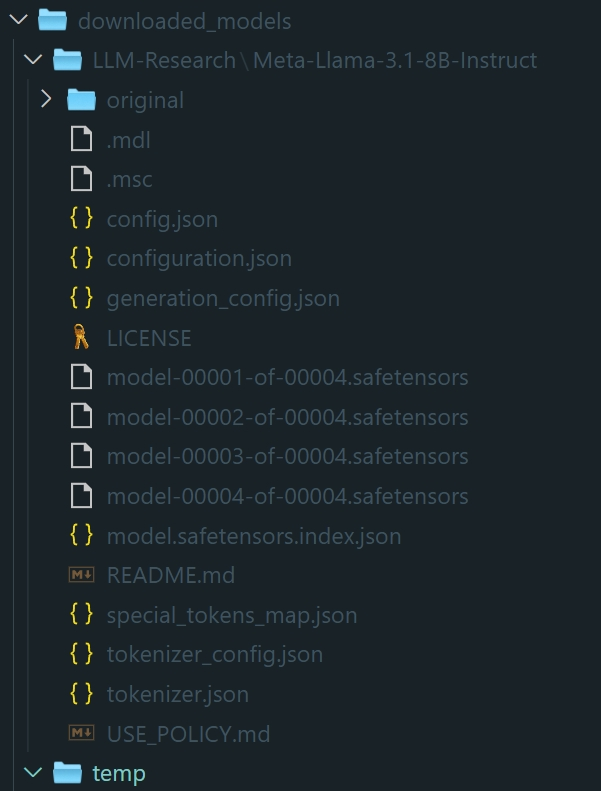
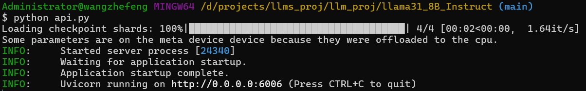
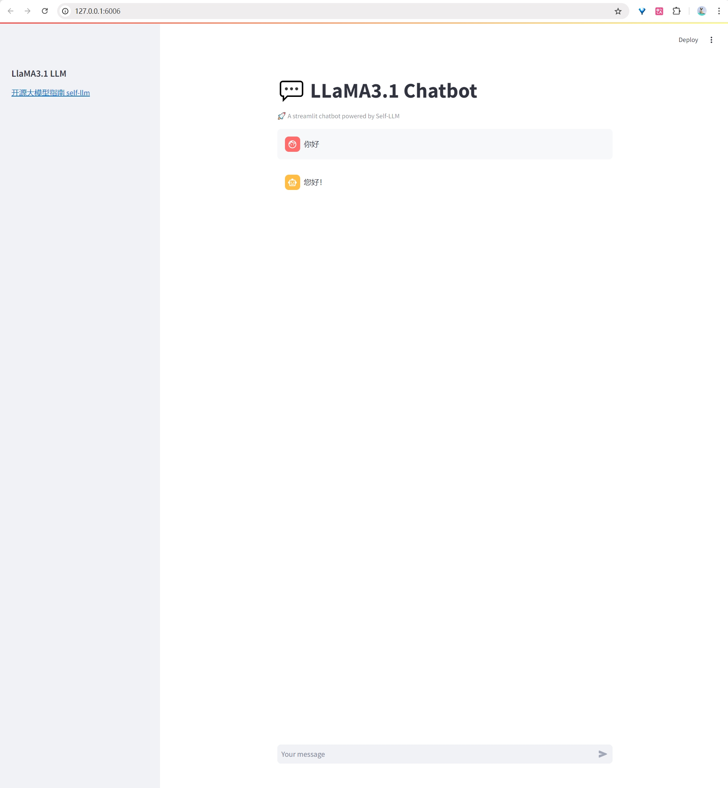

<style>
details {
    border: 1px solid #aaa;
    border-radius: 4px;
    padding: .5em .5em 0;
}
summary {
    font-weight: bold;
    margin: -.5em -.5em 0;
    padding: .5em;
}
details[open] {
    padding: .5em;
}
details[open] summary {
    border-bottom: 1px solid #aaa;
    margin-bottom: .5em;
}
img {
    pointer-events: none;
}
</style>

<details><summary>目录</summary><p>

- [环境](#环境)
    - [本地环境](#本地环境)
    - [云服务器](#云服务器)
- [模型下载](#模型下载)
- [构建 LLM 应用](#构建-llm-应用)
    - [模型构建](#模型构建)
    - [调用模型](#调用模型)
- [LoRA 微调](#lora-微调)
    - [指令集收集](#指令集收集)
        - [指令微调](#指令微调)
        - [指令集](#指令集)
        - [加载指令集](#加载指令集)
    - [加载 tokenizer 和半精度模型](#加载-tokenizer-和半精度模型)
    - [指令集数据格式化](#指令集数据格式化)
    - [创建微调模型](#创建微调模型)
    - [模型微调](#模型微调)
    - [加载微调权重推理](#加载微调权重推理)
    - [完整脚本代码](#完整脚本代码)
- [FastAPI 部署和调用](#fastapi-部署和调用)
    - [构建服务 API](#构建服务-api)
    - [服务 API 调用](#服务-api-调用)
        - [curl 调用](#curl-调用)
        - [requests 调用](#requests-调用)
- [Instruct WebDemo 部署](#instruct-webdemo-部署)
    - [构建应用页面](#构建应用页面)
    - [运行应用](#运行应用)
- [资料](#资料)
</p></details><p></p>

## 环境

### 本地环境

* Ubuntu 22.04
* Python 3.12
* CUDA 12.1
* PyTorch 2.3.0
* Python Libs

    ```bash
    # 升级 pip
    $ pip install --upgrade pip
    # 更换 pypi 源加速库的安装
    $ pip config set global.index-url https://pypi.tuna.tsinghua.edu.cn/simple

    # 安转依赖库
    $ pip install modelscope==1.11.0
    $ pip install langchain==0.2.3
    $ pip install transformers==4.43.1
    $ pip install accelerate==0.33.0
    $ pip install peft==0.11.1
    $ pip install datasets==2.20.0
    $ pip install fastapi==0.111.1
    $ pip install uvicorn==0.30.3
    $ pip install streamlit==1.36.0
    ```

### 云服务器

* [AutoDL 平台 LlaMA3.1 镜像](https://www.codewithgpu.com/i/datawhalechina/self-llm/self-llm-llama3.1)

## 模型下载

Llama-3.1-8B-Instruct 模型大小为 16 GB，下载模型大概需要 12 分钟。

新建 `model_download.py` 脚本如下：

```python
# model_download.py
import os
import torch
from modelscope import snapshot_download, AutoModel, AutoTokenizer

# 模型下载
model_dir = snapshot_download(
    "LLM-Research/Meta-Llama-3.1-8B-Instruct", 
    cache_dir = "/root/autodl-tmp",  # win10: downloaded_models
    revision = "master",
)
```

下载的模型结构：



## 构建 LLM 应用

为便捷构建 LLM 应用，需要基于本地部署的 LLaMA3_1_LLM，自定义一个 `LLM` 类，
将 LLaMA3.1 接入到 LangChain 框架中。完成自定义 LLM 类之后，
可以以完全一致的方式调用 LangChain 的接口，而无需考虑底层模型调用的不一致。

### 模型构建

基于本地部署的 LLaMA3.1 自定义 LLM 类并不复杂，只需从 `langchain.llms.base.LLM` 类继承一个子类，
并重写构造函数与 `_call` 函数即可。

新建 `LLM.py` 脚本如下：

```python
from typing import Any, List, Optional
import torch
from transformers import AutoTokenizer, AutoModelForCausalLM
from langchain.llms.base import LLM
from langchain.callbacks.manager import CallbackManagerForLLMRun


class LLaMA3_1_LLM(LLM):
    """
    基于本地 llama3.1 自定义 LLM 类
    """
    tokenizer: AutoTokenizer = None
    model: AutoModelForCausalLM = None

    def __init__(self, model_name_or_path: str):
        super().__init__()
        print("正在从本地加载模型...")
        # tokenizer
        self.tokenizer = AutoTokenizer.from_pretrained(
            model_name_or_path, 
            use_fast = False
        )
        # model
        self.model = AutoModelForCausalLM.from_pretrained(
            model_name_or_path, 
            torch_dtype = torch.bfloat16, 
            device_map = "auto"
        )
        self.tokenizer.pad_token = self.tokenizer.eos_token
        print("完成本地模型的加载")

    def _call(self, 
              prompt : str, 
              stop: Optional[List[str]] = None,
              run_manager: Optional[CallbackManagerForLLMRun] = None,
              **kwargs: Any):
        messages = [
            {
                "role": "system",
                "content": "You are a helpful assistant.",
            },
            {
                "role": "user",
                "content": prompt,
            }
        ]
        input_ids = self.tokenizer.apply_chat_template(
            messages, 
            tokenize = False, 
            add_generation_prompt = True
        )
        model_inputs = self.tokenizer(
            [input_ids],
            return_tensors = "pt",
        ).to(self.model.device)
        generated_ids = self.model.generate(
            model_inputs.input_ids, 
            max_new_tokens = 512
        )
        generated_ids = [
            output_ids[len(input_ids):] 
            for input_ids, output_ids in zip(model_inputs.input_ids, generated_ids)
        ]
        response = self.tokenizer.batch_decode(
            generated_ids, 
            skip_special_tokens = True
        )[0]
        
        return response

    @property
    def _llm_type(self) -> str:
        return "LLaMA3_1_LLM" 
```

### 调用模型

```python
# 测试代码 main 函数
def main():
    from LLM import LLaMA3_1_LLM

    llm = LLaMA3_1_LLM(model_name_or_path = "D:\projects\llms_proj\llm_proj\downloaded_models\LLM-Research\Meta-Llama-3.1-8B-Instruct")
    print(llm("你好"))

if __name__ == "__main__":
    main()
```

## LoRA 微调

### 指令集收集

#### 指令微调

LLM 微调一般指 **指令微调** 的过程。所谓指令微调，是说使用的微调数据形如：

```json
{
    "instruction": "回答以下用户问题，仅输出答案。",
    "input": "1+1等于几？",
    "output": "2"
}
```

其中：

* `instruction`: 是用户指令，告知模型其需要完成的任务
* `input`: 是用户输入，是完成用户指令所必须的输入内容
* `output`: 是模型应该给出的输出

微调的核心训练目标是让模型具有理解并遵循用户指令的能力。因此，在指令集构建时，
应针对我们的目标任务，针对性构建任务指令集。

#### 指令集

准备微调数据，放在项目 `dataset` 目录下。数据示例如下：

```json
[
    {
        "instruction": "小姐，别的秀女都在求中选，唯有咱们小姐想被撂牌子，菩萨一定记得真真儿的——",
        "input": "",
        "output": "嘘——都说许愿说破是不灵的。"
    },
    {
        "instruction": "这个温太医啊，也是古怪，谁不知太医不得皇命不能为皇族以外的人请脉诊病，他倒好，十天半月便往咱们府里跑。",
        "input": "",
        "output": "你们俩话太多了，我该和温太医要一剂药，好好治治你们。"
    },
    {
        "instruction": "嬛妹妹，刚刚我去府上请脉，听甄伯母说你来这里进香了。",
        "input": "",
        "output": "出来走走，也是散心。"
    },
    ...
]
```

#### 加载指令集

```python
import pandas as pd

# 微调数据地址
tuning_data_path = "D:\projects\llms_proj\llm_proj\dataset\huanhuan.json"

# 加载微调数据加载
tuning_df = pd.read_json(tuning_data_path)
tuning_ds = Dataset.from_pandas(tuning_df)
print(tuning_ds[:3])
```

### 加载 tokenizer 和半精度模型

模型以 **半精度** 形式加载，如果显卡比较新的话，可以用 `torch.bfloat16` 形式加载。
对于自定义的模型一定要指定 `trust_remote_code = True`。

```python
import torch
from transformers import AutoTokenizer, AutoModelForCausalLM

# 加载 LlaMA-3.1-8B-Instruct tokenizer
tokenizer = AutoTokenizer.from_pretrained(
    model_path, 
    use_fast = False,
    trust_remote_code = True
)
tokenizer.pad_token = tokenizer.eos_token

# 加载本地 LlaMA3.1-8B-Instruct 模型
model = AutoModelForCausalLM.from_pretrained(
    model_path,  
    torch_dtype = torch.bfloat16, 
    device_map = "auto",
    # trust_remote_code = True,
)
print(model)
model.enable_input_require_grads()  # 开启梯度检查点
print(model.dtype)
```

### 指令集数据格式化

LoRA 训练的数据是需要经过格式化、编码之后再输入给模型进行训练的。就像 PyTorch 模型训练过程中，
一般需要将输入文本编码为 `input_ids`，将输出文本编码为 `labels`，编码之后的结果都是多维的向量。
下面定义一个预处理函数，这个函数用于对每一个样本，编码其输入、输出文本并返回一个编码后的字典。

```python
from pandas as pd
from datasets import Dataset

def process_func(example):
    """
    数据格式化
    """
    # LlaMA 分词器会将一个中文字切分为多个 token，
    # 因此需要放开一些最大长度，保证数据的完整性
    MAX_LENGTH = 384
    input_ids, attention_mask, labels = [], [], []

    instruction = tokenizer(
        f"<|begin_of_text|><|start_header_id|>system<|end_header_id|>\n\n现在你要扮演皇帝身边的女人--甄嬛<|eot_id|><|start_header_id|>user<|end_header_id|>\n\n{example['instruction'] + example['input']}<|eot_id|><|start_header_id|>assistant<|end_header_id|>\n\n", 
        add_special_tokens = False
    )  # add_special_tokens 不在开头加 special_tokens
    response = tokenizer(
        f"{example["output"]}<|eot_id|>", 
        add_special_tokens = False
    )

    input_ids = instruction["input_ids"] + response["input_ids"] + [tokenizer.pad_token_id]
    attention_mask = instruction["attention_mask"] + response["attention_mask"] + [1]  # 因为 eos token 咱们也是要关注的，所以补充为 1
    labels = [-100] * len(instruction["input_ids"]) + response["input_ids"] + [tokenizer.pad_token_id]

    if len(input_ids) > MAX_LENGTH:
        input_ids = input_ids[:MAX_LENGTH]
        attention_mask = attention_mask[:MAX_LENGTH]
        labels = labels[:MAX_LENGTH] 
    
    return {
        "input_ids": input_ids,
        "attention_mask": attention_mask,
        "label": labels,
    }

# 数据格式化处理
tokenized_id = tuning_ds.map(process_func, remove_columns = tuning_ds.column_names)
print(tokenized_id)
print(tokenizer.decode(tokenized_id[0]["input_ids"]))
print(tokenizer.decode(filter(lambda x: x != -100, tokenized_id[1]["labels"])))
```

LlaMA 3.1 采用的 Prompt Tempalte 格式如下：

```
<|begin_of_text|>
<|start_header_id|>system<|end_header_id|>现在你要扮演皇帝身边的女人--甄嬛<|eot_id|>
<|start_header_id|>user<|end_header_id|>你好呀<|eot_id|>
<|start_header_id|>assistant<|end_header_id|>你好，我是甄嬛，你有什么事情要问我吗？<|eot_id|>
<|start_header_id|>assistant<|end_header_id|>
```

### 创建微调模型

`LoarConfig` 这个类中可以设置很多参数，但主要的参数没多少：

* `task_type`: 模型类型
* `target_modules`: 需要训练的模型层的名字，主要就是 `attention` 部分的层，
  不同的模型对应的层的名字不同，可以传入数组，也可以是字符串，也可以是正则表达式
* `r`: LoRA 的秩
* `lora_alpha`: LoRA alpha

LoRA 的缩放是 `lora_alpha/r`，在这个 `LoraConfig` 中缩放就是 4 倍。

```python
config = LoraConfig(
    task_type = TaskType.CAUSAL_LM,
    target_modules = [
        "q_proj", "k_proj", "v_proj", 
        "o_proj", "gate_proj", 
        "up_proj", "down_proj"
    ],
    inference_mode = False,  # 训练模式
    r = 8,  # LoRA 秩
    lora_alpha = 32,  # LoRA alpha
    lora_dropout = 0.1,  # dropout 比例
)
print(config)

model = get_peft_model(model, config)
print(model.print_trainable_parameters())
```

### 模型微调

介绍一下 `TrainingArguments` 这个类的源码每个参数的具体作用：

* `output_dir`: 模型的输出路径
* `per_device_train_batch_size`: 顾名思义 `batch_size`
* `gradient_accumulation_steps`: 梯度累加，如果显存比较小，
  可以把 `batch_size` 设置小一点，梯度累加增大一些
* `logging_steps`: 多少步，输出一次 `log`
* `num_train_epochs`: 顾名思义 `epoch`
* `gradient_checkpointing`: 梯度检查，这个一旦开启，
  模型就必须执行 `model.enable_input_require_grads()`

```python
# 配置 LoRA 训练参数
args = TrainingArguments(
    output_dir = lora_path,
    per_device_train_batch_size = 4,
    gradient_accumulation_steps = 4,
    logging_steps = 10,
    num_train_epochs = 3,
    save_steps = 100,  # 快速演示设置 10，建议设置为 100
    learning_rate = 1e-4,
    save_on_each_node = True,
    gradient_checkpointing = True,
)

trainer = Trainer(
    model = model,
    args = args,
    train_dataset = tokenized_id,
    data_collator = DataCollatorForSeq2Seq(tokenizer = tokenizer, padding = True),
)
trainer.train()
```

### 加载微调权重推理

训练好之后可以使用如下方式加载 LoRA 权重进行推理。

```python
from torch
from transformers import AutoModelForCausalLM, AutoTokenizer
from peft import PeftModel

# ------------------------------
# 数据、模型、参数地址
# ------------------------------
# 微调数据地址
tuning_data_path = "D:\projects\llms_proj\llm_proj\dataset\huanhuan.json"
# 模型地址
model_path = 'D:\projects\llms_proj\llm_proj\downloaded_models\LLM-Research\Meta-Llama-3.1-8B-Instruct'
# LoRA 输出对应 checkpoint 地址
lora_path = 'D:\projects\llms_proj\llm_proj\output\llama3_1_instruct_lora'

# ------------------------------
# 加载 LoRA 权重推理
# ------------------------------
# 加载 LlaMA-3.1-8B-Instruct tokenizer
tokenizer = AutoTokenizer.from_pretrained(
    model_path, 
    # use_fast = True,
    trust_remote_code = True
)
# 加载本地 LlaMA3.1-8B-Instruct 模型
model = AutoModelForCausalLM.from_pretrained(
    model_path, 
    torch_dtype = torch.bfloat16,
    device_map = "auto",  
    trust_remote_code = True
).eval()

# 加载 loRA 权重
model = PeftModel.from_pretrained(
    model, 
    model_id = os.path.join(lora_path, "checkpoint-100"),
)

# 构建 prompt template
prompt = "你好呀"
messages = [
    {
        "role": "system",
        "content": "假设你是皇帝身边的女人--甄嬛。",
    },
    {
        "role": "user",
        "content": prompt,
    },
]

# 模型推理 
input_ids = tokenizer.apply_chat_template(
    messages, 
    tokenize = False
)
model_inputs = tokenizer(
    [input_ids], 
    return_tensors = "pt"
).to('cuda')
generated_ids = model.generate(
    model_inputs.input_ids, 
    max_new_tokens = 512
)
generated_ids = [
    output_ids[len(input_ids):] 
    for input_ids, output_ids in zip(model_inputs.input_ids, generated_ids)
]
# 输出
response = tokenizer.batch_decode(
    generated_ids, 
    skip_special_tokens = True
)[0]
print(response)

```

### 完整脚本代码

```python
# -*- coding: utf-8 -*-

# ***************************************************
# * File        : LLM_LoRA.py
# * Author      : Zhefeng Wang
# * Email       : wangzhefengr@163.com
# * Date        : 2024-08-16
# * Version     : 0.1.081622
# * Description : description
# * Link        : link
# * Requirement : 相关模块版本需求(例如: numpy >= 2.1.0)
# ***************************************************

# python libraries
import os
import sys
ROOT = os.getcwd()
if str(ROOT) not in sys.path:
    sys.path.append(str(ROOT))

import pandas as pd
import torch
from datasets import Dataset
from transformers import (
    AutoTokenizer, 
    AutoModelForCausalLM, 
    DataCollatorForSeq2Seq, 
    TrainingArguments, 
    Trainer, 
    GenerationConfig
)
from peft import PeftModel, LoraConfig, TaskType, get_peft_model

# global variable
LOGGING_LABEL = __file__.split('/')[-1][:-3]

# ------------------------------
# 数据、模型、参数地址
# ------------------------------
# 微调数据地址
tuning_data_path = "D:\projects\llms_proj\llm_proj\dataset\huanhuan.json"
# 模型地址
model_path = 'D:\projects\llms_proj\llm_proj\downloaded_models\LLM-Research\Meta-Llama-3.1-8B-Instruct'
# LoRA 输出对应 checkpoint 地址
lora_path = 'D:\projects\llms_proj\llm_proj\output\llama3_1_instruct_lora'

# ------------------------------
# 加载本地 LlaMA-3.1-8B-Instruct 模型
# ------------------------------
# 加载 LlaMA-3.1-8B-Instruct tokenizer
tokenizer = AutoTokenizer.from_pretrained(
    model_path, 
    use_fast = False,
    trust_remote_code = True
)
tokenizer.pad_token = tokenizer.eos_token

# 加载本地 LlaMA3.1-8B-Instruct 模型
model = AutoModelForCausalLM.from_pretrained(
    model_path,  
    torch_dtype = torch.bfloat16, 
    device_map = "auto",
    # trust_remote_code = True,
)
print(model)
model.enable_input_require_grads()  # 开启梯度检查点
print(model.dtype)
# ------------------------------
# LoRA 微调数据格式化 
# ------------------------------
def process_func(example, tokenizer):
    """
    数据格式化
    """
    # LlaMA 分词器会将一个中文字切分为多个 token，
    # 因此需要放开一些最大长度，保证数据的完整性
    MAX_LENGTH = 384
    input_ids, attention_mask, labels = [], [], []

    instruction = tokenizer(
        f"<|begin_of_text|><|start_header_id|>system<|end_header_id|>\n\n现在你要扮演皇帝身边的女人--甄嬛<|eot_id|><|start_header_id|>user<|end_header_id|>\n\n{example['instruction'] + example['input']}<|eot_id|><|start_header_id|>assistant<|end_header_id|>\n\n", 
        add_special_tokens = False
    )  # add_special_tokens 不在开头加 special_tokens
    response = tokenizer(
        f"{example["output"]}<|eot_id|>", 
        add_special_tokens = False
    )

    input_ids = instruction["input_ids"] + response["input_ids"] + [tokenizer.pad_token_id]
    attention_mask = instruction["attention_mask"] + response["attention_mask"] + [1]  # 因为 eos token 咱们也是要关注的，所以补充为 1
    labels = [-100] * len(instruction["input_ids"]) + response["input_ids"] + [tokenizer.pad_token_id]

    if len(input_ids) > MAX_LENGTH:
        input_ids = input_ids[:MAX_LENGTH]
        attention_mask = attention_mask[:MAX_LENGTH]
        labels = labels[:MAX_LENGTH] 
    
    return {
        "input_ids": input_ids,
        "attention_mask": attention_mask,
        "label": labels,
    }

# 加载微调数据加载
tuning_df = pd.read_json(tuning_data_path)
tuning_ds = Dataset.from_pandas(tuning_df)
print(tuning_ds[:3])

# 数据格式化处理
tokenized_id = tuning_ds.map(process_func, remove_columns = tuning_ds.column_names)
print(tokenized_id)
print(tokenizer.decode(tokenized_id[0]["input_ids"]))
print(tokenizer.decode(filter(lambda x: x != -100, tokenized_id[1]["labels"])))
# ------------------------------
# LoRA 微调
# ------------------------------
# 定义 LoraConfig
config = LoraConfig(
    task_type = TaskType.CAUSAL_LM,
    target_modules = [
        "q_proj", "k_proj", "v_proj", 
        "o_proj", "gate_proj", 
        "up_proj", "down_proj"
    ],
    inference_mode = False,  # 训练模式
    r = 8,  # LoRA 秩
    lora_alpha = 32,  # LoRA alpha
    lora_dropout = 0.1,  # dropout 比例
)
print(config)

# 创建 Peft 模型
model = get_peft_model(model, config)
print(model.print_trainable_parameters())

# 配置 LoRA 训练参数
args = TrainingArguments(
    output_dir = lora_path,
    per_device_train_batch_size = 4,
    gradient_accumulation_steps = 4,
    logging_steps = 10,
    num_train_epochs = 3,
    save_steps = 100,  # 快速演示设置 10，建议设置为 100
    learning_rate = 1e-4,
    save_on_each_node = True,
    gradient_checkpointing = True,
)

## 使用 Trainer 训练
trainer = Trainer(
    model = model,
    args = args,
    train_dataset = tokenized_id,
    data_collator = DataCollatorForSeq2Seq(tokenizer = tokenizer, padding = True),
)
trainer.train()
# ------------------------------
# 加载 LoRA 权重推理
# ------------------------------
# 加载 LlaMA-3.1-8B-Instruct tokenizer
tokenizer = AutoTokenizer.from_pretrained(
    model_path, 
    # use_fast = True,
    trust_remote_code = True
)
# 加载本地 LlaMA3.1-8B-Instruct 模型
model = AutoModelForCausalLM.from_pretrained(
    model_path, 
    torch_dtype = torch.bfloat16,
    device_map = "auto",  
    trust_remote_code = True
).eval()

# 加载 loRA 权重
model = PeftModel.from_pretrained(
    model, 
    model_id = os.path.join(lora_path, "checkpoint-100"),
)

# 构建 prompt template
prompt = "你好呀"
messages = [
    {
        "role": "system",
        "content": "假设你是皇帝身边的女人--甄嬛。",
    },
    {
        "role": "user",
        "content": prompt,
    },
]

# 模型推理 
input_ids = tokenizer.apply_chat_template(
    messages, 
    tokenize = False
)
model_inputs = tokenizer(
    [input_ids], 
    return_tensors = "pt"
).to('cuda')
generated_ids = model.generate(
    model_inputs.input_ids, 
    max_new_tokens = 512
)
generated_ids = [
    output_ids[len(input_ids):] 
    for input_ids, output_ids in zip(model_inputs.input_ids, generated_ids)
]
# 输出
response = tokenizer.batch_decode(
    generated_ids, 
    skip_special_tokens = True
)[0]
print(response)


# 测试代码 main 函数
def main():
    pass

if __name__ == "__main__":
    main()
```

## FastAPI 部署和调用

### 构建服务 API

1. 新建 `api.py` 脚本如下：

```python
import json
import datetime

import uvicorn
from fastapi import FastAPI, Request
import torch
from transformers import AutoTokenizer, AutoModelForCausalLM

# global variable
LOGGING_LABEL = __file__.split('/')[-1][:-3]

# 设置设备参数
DEVICE = "cuda"  # 使用 CUDA
DEVICE_ID = "0"  # CUDA 设备 ID，如果未设置则为空
CUDA_DEVICE = f"{DEVICE}:{DEVICE_ID}" if DEVICE_ID else DEVICE  # 组合 CUDA 设备信息

# 清理 GPU 内存函数
def torch_gc():
    if torch.cuda.is_available():
        with torch.cuda.device(CUDA_DEVICE):
            torch.cuda.empty_cache()  # 清空 CUDA 缓存
            torch.cuda.ipc_collect()  # 收集 CUDA 内存碎片

# 创建 FastAPI 应用
app = FastAPI()

# 处理 POST 请求的端点
@app.post("/")
async def create_item(request: Request):
    # 声明全局变量以便在函数内部使用模型和分词器
    # global model, tokenizer
    # 加载预训练的分词器和模型
    model_name_or_path = "D:\projects\llms_proj\llm_proj\downloaded_models\LLM-Research\Meta-Llama-3.1-8B-Instruct"
    tokenizer = AutoTokenizer.from_pretrained(
        model_name_or_path, 
        use_fast = False
    )
    model = AutoModelForCausalLM.from_pretrained(
        model_name_or_path, 
        device_map = "auto", 
        torch_dtype = torch.bfloat16
    )

    # 获取 POST 请求的 JSON 数据
    json_post_raw = await request.json()
    # 将 JSON 数据转换为字符串
    json_post = json.dumps(json_post_raw)
    # 将字符串转换为 Python 对象
    json_post_list = json.loads(json_post)
    # 获取请求中的提示
    prompt = json_post_list.get("prompt")

    messages = [
        {
            "role": "system",
            "content": "You are a helpful assistant.",
        },
        {
            "role": "user",
            "content": prompt
        }
    ]
    # 调用模型进行对话生成
    input_ids = tokenizer.apply_chat_template(
        messages, 
        tokenize = False, 
        add_generation_prompt = True
    )
    model_inputs = tokenizer(
        [input_ids],
        return_tensors = "pt",
    ).to(DEVICE)
    generated_ids = model.generate(model_inputs.input_ids, max_new_tokens = 512)
    generated_ids = [
        output_ids[len(input_ids):]
        for input_ids, output_ids in zip(model_inputs.input_ids, generated_ids)
    ]
    response = tokenizer.batch_decode(generated_ids, skip_special_tokens = True)[0]

    # 构建响应 JSON
    now = datetime.datetime.now()
    time = now.strftime("%Y-%m-%d %H:%M:%S")
    answer = {
        "response": response,
        "status": 200,
        "time": time,
    }

    # 构建日志信息
    log = f"[{time}], prompt:{prompt}, response:{repr(response)}"
    print(log)

    # 执行 GPU 内存清理
    torch_gc()

    return answer


# 测试代码 main 函数
def main(): 
    # 启动 FastAPI 应用，在指定端口和主机上启动应用
    # 用 6006 端口可以将 autodl 的端口映射到本地，从而在本地使用 API
    uvicorn.run(app, host = "0.0.0.0", port = 6006, workers = 1)

if __name__ == "__main__":
    main()
```

2. 启动 API 服务

```bash
$ python api.py
```



### 服务 API 调用

#### curl 调用

服务默认部署在 `6006` 端口，通过 POST 方法进行调用，可以使用 `curl` 调用，如下所示：

```bash
$ curl -X POST "http://127.0.0.1:6006" \
    -H 'Content-Type: application/json' \
    -d '{"prompt": "你好"}'
```

```
{"response":"你好！很高兴能为你提供帮助。有什么问题我可以回答或者协助你完成吗？","status":200,"time":"2024-06-07 12:24:31"}
```

#### requests 调用

也可以使用 Python 的 `requests` 库进行调用：

```python
import json
import requests

def get_completion(prompt):
    headers = {
        "Content-Type": "application/jons",
    }
    data = {
        "prompt": prompt,
    }
    response = requests.post(
        url = "http://127.0.0.1:6006", 
        headers = headers, 
        data = json.dumps(data)
    )

    return response.json()["response"]


def main():
    print(get_completion(prompt = "你好"))

if __name__ == "__main__":
    main()
```

```
{"response":"你好！很高兴能为你提供帮助。有什么问题我可以回答或者协助你完成吗？","status":200,"time":"2024-06-07 12:24:31"}
```

## Instruct WebDemo 部署

### 构建应用页面

```python
import torch
from transformers import AutoTokenizer, AutoModelForCausalLM
import streamlit as st

# global variable
LOGGING_LABEL = __file__.split('/')[-1][:-3]


# 在侧边栏中创建一个标题和一个链接
with st.sidebar:
    st.markdown("## LlaMA3.1 LLM")
    "[开源大模型指南 self-llm](https://github.com/datawhalechina/self-llm.git)"


# 创建一个标题和一个副标题
st.title("💬 LLaMA3.1 Chatbot")
st.caption("🚀 A streamlit chatbot powered by Self-LLM")


# 定义一个函数，用于获取模型和 tokenizer
@st.cache_resource
def get_model():
    # 模型路径
    model_name_or_path = "D:\projects\llms_proj\llm_proj\downloaded_models\LLM-Research\Meta-Llama-3.1-8B-Instruct"
    # ------------------------------
    # 加载本地 LlaMA-3.1-8B-Instruct 模型
    # ------------------------------
    # 加载 LlaMA-3.1-8B-Instruct tokenizer
    tokenizer = AutoTokenizer.from_pretrained(
        model_name_or_path, 
        # use_fast = False,
        trust_remote_code = True
    )
    tokenizer.pad_token = tokenizer.eos_token

    # 加载本地 LlaMA3.1-8B-Instruct 模型
    model = AutoModelForCausalLM.from_pretrained(
        model_name_or_path,  
        torch_dtype = torch.bfloat16, 
        # device_map = "auto",
        # trust_remote_code = True,
    ).cuda()

    return tokenizer, model


# 加载 LlaMA3.1 的模型和 tokenizer
tokenizer, model = get_model()


# 如果 session_state 中没有 "messages"，则创建一个包含默认消息的列表
if "messages" not in st.session_state:
    st.session_state["messages"] = []

# 遍历 session_state 中的所有消息，并显示在聊天界面上
for msg in st.session_state.messages:
    st.chat_message(msg["role"]).write(msg["content"])

# 如果用户在聊天输入框中输入了内容，则执行以下操作
if prompt := st.chat_input():
    # 在聊天界面上显示用户的输入
    st.chat_message("user").write(prompt)
    # 将用户输入添加到 session_state 中的 messages 列表中
    st.session_state.messages.append({"role": "user", "content": prompt})
    # 将对话输入模型，获得返回
    input_ids = tokenizer.apply_chat_template(st.session_state["messages"],tokenize=False,add_generation_prompt=True)
    model_inputs = tokenizer([input_ids], return_tensors="pt").to('cuda')
    generated_ids = model.generate(model_inputs.input_ids,max_new_tokens=512)
    generated_ids = [
        output_ids[len(input_ids):] for input_ids, output_ids in zip(model_inputs.input_ids, generated_ids)
    ]
    response = tokenizer.batch_decode(generated_ids, skip_special_tokens=True)[0]
    # 将模型的输出添加到 session_state 中的 messages列表中
    st.session_state.messages.append({"role": "assistant", "content": response})
    # 在聊天界面上显示模型的输出
    st.chat_message("assistant").write(response)
    print(st.session_state)


# 测试代码 main 函数
def main():
    pass

if __name__ == "__main__":
    main()
```

### 运行应用

在终端中运行一下命令，启动 StreamLit 服务：

```bash
$ streamlit run chatBot.py --server.address 127.0.0.1 --server.port 6006
```

运行成功后，在本地浏览器中打开 [http://127.0.0.1:6006](http://127.0.0.1:6006)，
即可查看部署的 WebDemo，如下图所示：



## 资料

* [AutoDL 平台 LlaMA3.1 镜像](https://www.codewithgpu.com/i/datawhalechina/self-llm/self-llm-llama3.1)
