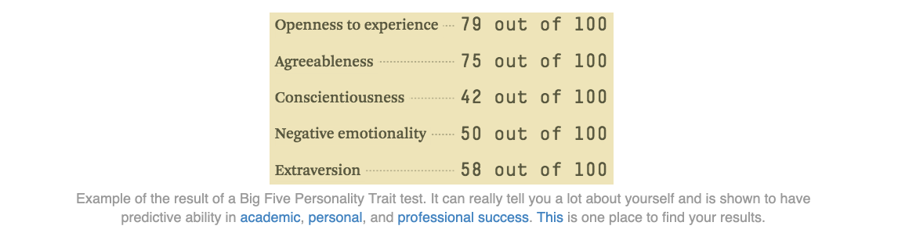
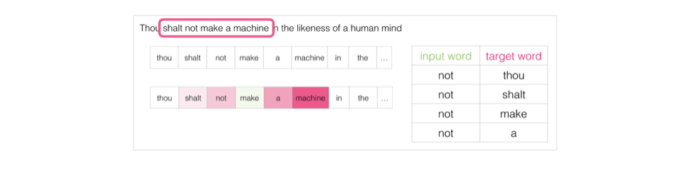
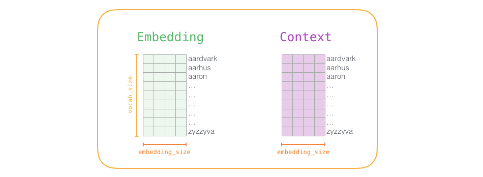

目录

- [Word2Vec 简介](#word2vec-简介)
- [Embeddings](#embeddings)
  - [Personality Embeddings](#personality-embeddings)
  - [Word Embeddings](#word-embeddings)
  - [类比](#类比)
- [语言模型](#语言模型)
  - [语言模型简介](#语言模型简介)
  - [语言模型训练](#语言模型训练)
  - [顾及两头](#顾及两头)
  - [skip-gram](#skip-gram)
    - [CBOW](#cbow)
    - [skip-gram](#skip-gram-1)
  - [重新审视训练过程](#重新审视训练过程)
  - [负例采样](#负例采样)
  - [基于负例采样的 skip-gram](#基于负例采样的-skip-gram)
- [Word2Vec 训练](#word2vec-训练)
  - [训练过程](#训练过程)
  - [窗口大小和负样本数量](#窗口大小和负样本数量)
    - [窗口大小](#窗口大小)
    - [负样本数量](#负样本数量)
- [参考](#参考)

# Word2Vec 简介

嵌入(embedding)是机器学习中最迷人的想法之一。 如果你曾经使用 Siri、Google Assistant、Alexa、Google 翻译，
甚至智能手机键盘进行下一词预测，那么你很有可能从这个已经成为自然语言处理模型核心的想法中受益

在过去的几十年中，嵌入技术用于神经网络模型已有相当大的发展。尤其是最近，其发展包括导致 BERT 和 GPT2 等尖端模型的语境化嵌入

Word2vec  是一种有效创建词嵌入的方法，它自 2013 年以来就一直存在。但除了作为词嵌入的方法之外，
它的一些概念已经被证明可以有效地创建推荐引擎和理解时序数据。在商业的、非语言的任务中。
像 Airbnb、阿里巴巴、Spotify 这样的公司都从 NLP 领域中提取灵感并用于产品中，从而为新型推荐引擎提供支持

在这篇文章中，将讨论嵌入的概念，以及使用 Word2Vec 生成嵌入的机制。从一个例子开始，熟悉使用向量来表示事物。
你是否知道你的个性可以仅被五个数字的列表(向量)表示？

# Embeddings

## Personality Embeddings

> What are you like?

如何用 0 到 100 的范围来表示你是多么内向/外向(其中 0 是最内向的，100 是最外向的)？ 
你有没有做过像 MBTI 那样的人格测试，或者五大人格特质测试？ 如果你还没有，这些测试会问你一系列的问题，
然后在很多维度给你打分，内向/外向就是其中之一

假设我的内向/外向得分为 38/100。 可以用这种方式绘图：

把范围收缩到 -1 到 1:

当你只知道这一条信息的时候，你觉得你有多了解这个人？了解不多。人很复杂，添加另一测试的得分作为新维度

我已经隐藏了正在绘制的人格特征，这样你会渐渐习惯于在不知道每个维度代表什么的情况下，从一个人格的向量表示中获得价值信息

现在可以说这个向量部分地代表了我的人格。当你想要将另外两个人与我进行比较时，这种表示法就有用了。
假设我被公共汽车撞了，我需要被性格相似的人替换，那在下图中，两个人中哪一个更像我？

处理向量时，计算相似度得分的常用方法是余弦相似度：

1 号替身在性格上与我更相似。指向相同方向的向量(长度也起作用)具有更高的余弦相似度

再一次，两个维度还不足以捕获有关不同人群的足够信息。心理学已经研究出了五个主要人格特征(以及大量的子特征)，
所以使用所有五个维度进行比较：

使用五个维度的问题是不能在二维平面绘制整齐小箭头了。这是机器学习中的常见问题，
经常需要在更高维度的空间中思考。但好在余弦相似度仍然有效，它适用于任意维度：

在本节的最后，我希望提出两个中心思想：

1. 可以将人和事物表示为代数向量(这对机器来说很棒！)。
2. 可以很容易地计算出相似的向量之间的相互关系。

## Word Embeddings

通过上文的理解，继续看看训练好的词向量实例(也被称为词嵌入)并探索它们的一些有趣属性

这是一个单词 "king" 的词嵌入(在维基百科上训练的 GloVe 向量)：

这是一个包含 50 个数字的列表。通过观察数值看不出什么，但是稍微给它可视化，
以便比较其它词向量。把所有这些数字放在一行：

根据它们的值对单元格进行颜色编码(如果它们接近2则为红色，接近 0 则为白色，接近 -2 则为蓝色)：

将忽略数字并仅查看颜色以指示单元格的值。现在将 "king" 与其它单词进行比较：

看看 "Man" 和 "Woman" 彼此之间是如何比它们任一一个单词与 "King" 相比更相似的？
这暗示你一些事情。这些向量图示很好的展现了这些单词的信息/含义/关联

这是另一个示例列表(通过垂直扫描列来查找具有相似颜色的列)：

有几个要点需要指出：

1. 所有这些不同的单词都有一条直的红色列。 它们在这个维度上是相似的(虽然不知道每个维度是什么)
2. 你可以看到 "woman" 和 "girl" 在很多地方是相似的，"man" 和 "boy" 也是一样
3. "boy" 和 "girl" 也有彼此相似的地方，但这些地方却与 "woman" 或 "man" 不同。
   这些是否可以总结出一个模糊的 "youth" 概念？可能吧
4. 除了最后一个单词，所有单词都是代表人。 我添加了一个对象 "water" 来显示类别之间的差异
   你可以看到蓝色列一直向下并在 "water" 的词嵌入之前停下了
5. "king" 和 "queen" 彼此之间相似，但它们与其它单词都不同。这些是否可以总结出一个模糊的 "royalty" 概念？

## 类比

展现嵌入奇妙属性的著名例子是类比。可以添加、减去词嵌入并得到有趣的结果。
一个著名例子是公式："king"-"man"+"woman"：

可以像之前一样可视化这个类比：

由 "king-man + woman" 生成的向量并不完全等同于 "queen"，
但 "queen" 是在此集合中包含的 400,000 个字嵌入中最接近它的单词

现在已经看过训练好的词嵌入，接下来更多地了解训练过程。但在开始使用 Word2Vec 之前，
需要看一下词嵌入的父概念：神经语言模型

# 语言模型

## 语言模型简介

如果要举自然语言处理最典型的例子，那应该就是智能手机输入法中的下一单词预测功能。
这是个被数十亿人每天使用上百次的功能

下一单词预测是一个可以通过语言模型实现的任务。语言模型会通过单词列表(比如说两个词)去尝试预测可能紧随其后的单词

在上面这个手机截屏中，可以认为该模型接收到两个绿色单词(thou shalt)并推荐了一组单词("not" 就是其中最有可能被选用的一个)：

可以把这个模型想象为这个黑盒:

但事实上，该模型不会只输出一个单词。实际上，它对所有它知道的单词(模型的词库，可能有几千到几百万个单词)的按可能性打分，
输入法程序会选出其中分数最高的推荐给用户

自然语言模型(请参考 Bengio 2003)在完成训练后，会按如下中所示三步完成预测：

第一步与最相关，因为讨论的就是 Embedding。模型在经过训练之后会生成一个映射单词表所有单词的矩阵。
在进行预测的时候，的算法就是在这个映射矩阵中查询输入的单词，然后计算出预测值:

现在将重点放到模型训练上，来学习一下如何构建这个映射矩阵

## 语言模型训练

相较于大多数其他机器学习模型，语言模型有一个很大有优势，那就是有丰富的文本来训练语言模型。
所有的书籍、文章、维基百科、及各种类型的文本内容都可用。相比之下，
许多其他机器学习的模型开发就需要手工设计数据或者专门采集数据

通过找常出现在每个单词附近的词，就能获得它们的映射关系。机制如下：

1. 先是获取大量文本数据(例如所有维基百科内容)
2. 然后建立一个可以沿文本滑动的窗(例如一个窗里包含三个单词)
3. 利用这样的滑动窗就能为训练模型生成大量样本数据

当这个窗口沿着文本滑动时，就能(真实地)生成一套用于模型训练的数据集。
为了明确理解这个过程，看下滑动窗是如何处理这个短语的:

在一开始的时候，窗口锁定在句子的前三个单词上:

把前两个单词单做特征，第三个单词单做标签，这时就生产了数据集中的第一个样本，
它会被用在后续的语言模型训练中:

接着，将窗口滑动到下一个位置并生产第二个样本:

不用多久，就能得到一个较大的数据集，从数据集中能看到在不同的单词组后面会出现的单词:

在实际应用中，模型往往在滑动窗口时就被训练的。但是我觉得将生成数据集和训练模型分为两个阶段会显得更清晰易懂一些。
除了使用神经网络建模之外，大家还常用一项名为 N-grams 的技术进行模型训练

如果想了解现实产品从使用 N-grams 模型到使用神经模型的转变，
可以看一下 Swiftkey(我最喜欢的安卓输入法)在 2015 年的发表一篇博客，
文中介绍了他们的自然语言模型及该模型与早期 N-grams 模型的对比。我很喜这个例子，
因为这个它能告诉你如何在营销宣讲中把 Embedding 的算法解释清楚

## 顾及两头

根据前面的信息进行填空:

在空白前面，我提供的背景是五个单词(如果事先提及到 "bus")，可以肯定，大多数人都会把 "bus" 填入空白中。
但是如果我再给你一条信息——比如空白后的一个单词，那答案会有变吗？

这下空白处改填的内容完全变了。这时 "red" 这个词最有可能适合这个位置。从这个例子中能学到，
一个单词的前后词语都带信息价值。事实证明，需要考虑两个方向的单词(目标单词的左侧单词与右侧单词)。
那该如何调整训练方式以满足这个要求呢，继续往下看

## skip-gram

### CBOW

不仅要考虑目标单词的前两个单词，还要考虑其后两个单词

如果这么做，实际上构建并训练的模型就如下所示：

上述的这种架构被称为连续词袋(CBOW)，在一篇关于 Word2Vec 的论文中有阐述

### skip-gram

还有另一种架构，它不根据前后文(前后单词)来猜测目标单词，而是推测当前单词可能的前后单词。
设想一下滑动窗在训练数据时如下图所示：

这里粉框颜色深度呈现不同，是因为滑动窗给训练集产生了 4 个独立的样本:

这种方式称为 skip-gram 架构。可以像下图这样将展示滑动窗的内容

这样就为数据集提供了 4 个样本:

然后移动滑动窗到下一个位置:

这样又产生了接下来 4 个样本:

在移动几组位置之后，就能得到一批样本:

## 重新审视训练过程

现在已经从现有的文本中获得了 skip-gram 模型的训练数据集，
接下来看看如何使用它来训练一个能预测相邻词汇的自然语言模型

从数据集中的第一个样本开始。将特征输入到未经训练的模型，让它预测一个可能的相邻单词

该模型会执行三个步骤并输入预测向量(对应于单词表中每个单词的概率)。因为模型未经训练，该阶段的预测肯定是错误的。
但是没关系，知道应该猜出的是哪个单词——这个词就是我训练集数据中的输出标签

目标单词概率为 1，其他所有单词概率为 0，这样数值组成的向量就是"目标向量"

模型的偏差有多少？将两个向量相减，就能得到偏差向量：

现在这一误差向量可以被用于更新模型了，所以在下一轮预测中，如果用 "not" 作为输入，
更有可能得到 "thou" 作为输出了

这其实就是训练的第一步了。接下来继续对数据集内下一份样本进行同样的操作，直到遍历所有的样本。
这就是一轮(epoch)了。再多做几轮(epoch)，得到训练过的模型，于是就可以从中提取嵌入矩阵来用于其他应用了

以上确实有助于理解整个流程，但这依然不是 Word2Vec 真正训练的方法。错过了一些关键的想法

## 负例采样

回想一下这个神经语言模型计算预测值的三个步骤： 

从计算的角度来看，第三步非常昂贵-尤其是当将需要在数据集中为每个训练样本都做一遍(很容易就多达数千万次)。
需要寻找一些提高表现的方法

一种方法是将目标分为两个步骤：

1. 生成高质量的词嵌入(不要担心下一个单词预测)
2. 使用这些高质量的嵌入来训练语言模型(进行下一个单词预测)

在本文中将专注于第 1 步(因为这篇文章专注于嵌入)。要使用高性能模型生成高质量嵌入，
可以改变一下预测相邻单词这一任务：

将其切换到一个提取输入与输出单词的模型，并输出一个表明它们是否是邻居的分数(0 表示"不是邻居"，1 表示"邻居")

这个简单的变换将需要的模型从神经网络改为逻辑回归模型——因此它变得更简单，计算速度更快

这个开关要求切换数据集的结构——标签值现在是一个值为 0 或 1 的新列。它们将全部为 1，
因为添加的所有单词都是邻居

现在的计算速度可谓是神速啦——在几分钟内就能处理数百万个例子。但是还需要解决一个漏洞。
如果所有的例子都是邻居(目标：1)，这个 "天才模型" 可能会被训练得永远返回1——准确性是百分百了，
但它什么东西都学不到，只会产生垃圾嵌入结果

为了解决这个问题，需要在数据集中引入负样本-不是邻居的单词样本。模型需要为这些样本返回 0。
模型必须努力解决这个挑战——而且依然必须保持高速

但是作为输出词填写什么呢？从词汇表中随机抽取单词

这个想法的灵感来自[噪声对比估计](http://proceedings.mlr.press/v9/gutmann10a/gutmann10a.pdf)。
将实际信号(相邻单词的正例)与噪声(随机选择的不是邻居的单词)进行对比。这导致了计算和统计效率的巨大折衷

## 基于负例采样的 skip-gram

> 基于负例采样的 skip-gram，SGNS

现在已经介绍了 Word2Vec 中的两个(一对)核心思想：负例采样、skip-gram

# Word2Vec 训练

现在已经了解了 skip-gram 和负例采样的两个中心思想，可以继续仔细研究实际的 Word2Vec 训练过程了

## 训练过程

在训练过程开始之前，预先处理正在训练模型的文本。在这一步中，确定一下词典的大小，
称之为 vocab_size(比如说 10,000)，以及哪些词被它包含在内

在训练阶段的开始，创建两个矩阵：Embedding 矩阵、Context 矩阵。
这两个矩阵在的词汇表中嵌入了每个单词，所以 vocab_size 是他们的维度之一。
第二个维度是希望每次嵌入的长度(embedding_size=300 是一个常见值，但在前文也看过 50 的例子)

在训练过程开始时，用随机值初始化这些矩阵。然后开始训练过程。
在每个训练步骤中，采取一个相邻的例子及其相关的非相邻例子

来看看的第一组，现在有四个单词：

* 输入单词：`not`
* 输出/上下文单词：
    - `thou`(实际邻居词)
    - `aaron`(负面例子)
    - `taco`(负面例子)

继续查找它们的嵌入，对于输入词，查看 Embedding 矩阵。对于上下文单词，查看 Context 矩阵(即使两个矩阵都在的词汇表中嵌入了每个单词)

然后，计算输入嵌入与每个上下文嵌入的点积。在每种情况下，结果都将是表示输入和上下文嵌入的相似性的数字：

现在需要一种方法将这些分数转化为看起来像概率的东西——需要它们都是正值，
并且 处于 0 到 1 之间。sigmoid 这一逻辑函数转换正适合用来做这样的事情：

现在可以将 sigmoid 操作的输出视为这些示例的模型输出。您可以看到 `taco` 得分最高，`aaron` 最低，
无论是 sigmoid 操作之前还是之后

既然未经训练的模型已做出预测，而且确实拥有真实目标标签来作对比，
那么计算模型预测中的误差吧。为此只需从目标标签中减去 sigmoid 分数

这是“机器学习”的“学习”部分。现在，可以利用这个错误分数来调整 `not`、`thou`、`aaron` 和 `taco` 的嵌入，
使下一次做出这一计算时，结果会更接近目标分数

训练步骤到此结束。从中得到了这一步所使用词语更好一些的嵌入(`not`，`thou`，`aaron` 和 `taco`)。
现在进行下一步(下一个相邻样本及其相关的非相邻样本)，并再次执行相同的过程

当循环遍历整个数据集多次时，嵌入会继续得到改进。然后就可以停止训练过程，
丢弃 Context 矩阵，并使用 Embeddings 矩阵作为下一项任务的已被训练好的嵌入

## 窗口大小和负样本数量

Word2Vec 训练过程中的两个关键超参数是：

* 窗口大小
* 负样本的数量

### 窗口大小

不同的任务适合不同的窗口大小。一种启发式方法是：

* 使用较小的窗口大小(2-15)会得到这样的嵌入：两个嵌入之间的高相似性得分表明这些单词是可互换的(注意，
  如果只查看附近距离很近的单词，反义词通常可以互换——例如，好的和坏的经常出现在类似的语境中)
* 使用较大的窗口大小(15-50，甚至更多)会得到相似性更能指示单词相关性的嵌入

在实际操作中，你通常需要对嵌入过程提供指导以帮助读者得到相似的”语感“。
Gensim 默认窗口大小为 5(除了输入字本身以外还包括输入字之前与之后的两个字)

### 负样本数量

负样本的数量是训练过程的另一个因素。原始论文认为 5-20 个负样本是比较理想的数量。
它还指出，当你拥有足够大的数据集时，2-5 个似乎就已经足够了。Gensim 默认为 5 个负样本

# 参考

* [The Illustrated Word2vec](https://jalammar.github.io/illustrated-word2vec/)
* [图解 Word2vec](https://mp.weixin.qq.com/s?__biz=MjM5MTQzNzU2NA==&mid=2651669277&idx=2&sn=bc8f0590f9e340c1f1359982726c5a30&chksm=bd4c648e8a3bed9817f30c5a512e79fe0cc6fbc58544f97c857c30b120e76508fef37cae49bc&scene=0&xtrack=1#rd)
