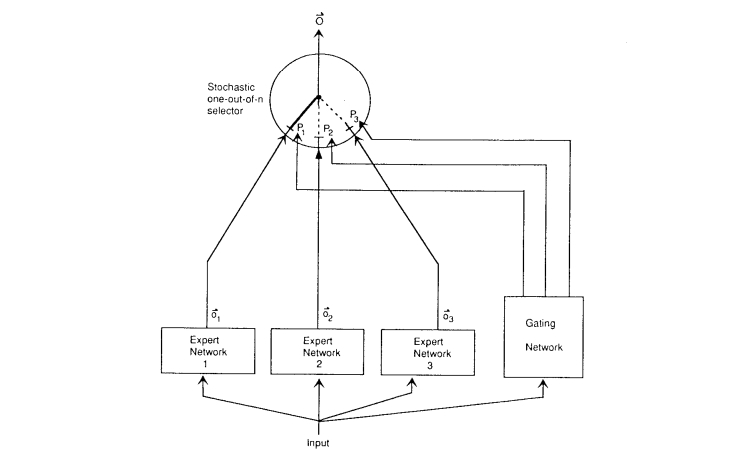

<style>
details {
    border: 1px solid #aaa;
    border-radius: 4px;
    padding: .5em .5em 0;
}
summary {
    font-weight: bold;
    margin: -.5em -.5em 0;
    padding: .5em;
}
details[open] {
    padding: .5em;
}
details[open] summary {
    border-bottom: 1px solid #aaa;
    margin-bottom: .5em;
}
img {
    pointer-events: none;
}
</style>

<details><summary>目录</summary><p>

- [模型概述](#模型概述)
- [分词](#分词)
    - [基于空格的分词](#基于空格的分词)
    - [Byte Pair Encoding](#byte-pair-encoding)
    - [Unigram model](#unigram-model)
- [模型架构](#模型架构)
    - [Encoder-Only 架构](#encoder-only-架构)
    - [Decoder-Only 架构](#decoder-only-架构)
    - [Encoder-Decoder 架构](#encoder-decoder-架构)
- [语言模型理论](#语言模型理论)
    - [基础架构](#基础架构)
    - [RNN](#rnn)
    - [Transformer](#transformer)
        - [Attention](#attention)
        - [残差连接和归一化](#残差连接和归一化)
        - [位置嵌入](#位置嵌入)
    - [GPT-3](#gpt-3)
- [新的模型架构](#新的模型架构)
    - [混合专家模型](#混合专家模型)
    - [基于检索的模型](#基于检索的模型)
</p></details><p></p>


## 模型概述

从形象化的概念理解上来说当前大语言模型(“大” 体现在模型的规模上)的能力，
其可以根据输入需求的语言描述(Prompt)生成符合需求的结果(Completion)，形式可以表达为：

`$$\text{Prompt} \stackrel{\text{model}}{\leadsto} \text{Completion or Model(Prompt)} = \text{Completion}$$`

下面从大语言模型的训练数据(training data)分析开始，首先给出如下的形式描述：

`$$\text{training data} \Rightarrow p(x_{1}, \cdots, x_{L})$$`

接着，讨论大语言模型是如何构建的，包含两个主题：

* 分词(Tokenization)：如何将一个字符串拆分成多个词元(token)
* 模型架构(Model Architecture)：Transformer 架构，这是真正实现大语言模型的建模创新

## 分词

**语言模型 `$p$`** 是建立在 **词元(token)序列** 的上一个概率分布输出的，
其中每个 **词元(token)** 来自某个 **词汇表** `$V$`。比如以下的形式：

```
[the, mouse, ate, the, cheese]
```

**词元(token)** 一般在 NLP（自然语言处理）中来说，通常指的是一个文本序列中的最小单元，
可以是 **单词**、**标点符号**、**数字**、**符号** 或 **其他类型的语言元素**。
通常，对于 NLP 任务，文本序列会被分解为一系列的 tokens，以便进行分析、理解或处理。
在英文中一个 "token" 可以是一个 **单词**，也可以是一个 **标点符号**。
在中文中，通常以 **字** 或 **词** 作为 token（这其中就包含一些字符串分词的差异性）。

**字符串** 和 **词元序列** 的差异性：

* 字符串：字母、符号和空格都是这这个字符串的一部分。
* 词元序列：由多个字符串组成。相当于把一个字符串分割为了多个 **子字符串**，每个子字符串是一个词元。

自然语言并不是以词元序列的形式出现，而是以字符串的形式存在（具体来说，是 Unicode 字符的序列），
比如上面的序列的自然语言为 

```
"the mouse ate the cheese."
```

**分词器将任意字符串转换为词元序列。** 比如：

```
"the mouse ate the cheese." => ["the", "mouse", "ate", "the", "cheese", "."]
```

这里需要注意的是，虽然这部分并不一定是语言建模中最引人注目的部分，
但在确定模型的工作效果方面起着非常重要的作用。
也可以将这个方式理解为 **自然语言** 和 **机器语言** 的一种**隐式的对齐**，
也可能是对于语言模型可能开始接触的时候最困惑的地方，特别是做机器学习相关的人员，
因为日常了解的输入需要是数值的，从而才能在模型中被计算，所以，
如果输入是非数值类型的字符串是怎么处理的呢？

> 为什么说是“隐式的对齐”，这是由于每一个词在模型中，都有一个其确定的词向量。

接下来我们就一步一步来看，研究者们是怎么讲一个字符串文本变成机器能计算的数值的。

### 基于空格的分词

**分词**，其实从字面很好理解，就是把词分开，从而方便对于词进行单独的编码。
对于英文字母来说，由于其天然的主要由 `单词+空格+标点符号` 组成，
最简单的解决方案是使用 `text.split(' ')` 方式进行分词，这种分词方式对于英文这种按照空格，
且每个分词后的单词有语义关系的文本是简单而直接的分词方式。

然而，对于一些语言，如中文，句子中的单词之间没有空格，例如下文的形式：

```
"我今天去了商店。"
```

还有一些语言，比如德语，存在着长的复合词（例如 `Abwasserbehandlungsanlange`）。
即使在英语中，也有连字符词（例如 `father-in-law`）和缩略词（例如 `don't`），它们需要被正确拆分。
例如，Penn Treebank 将 `don't` 拆分为 `do` 和 `n't`，这是一个在语言上基于信息的选择，但不太明显。
因此，仅仅通过空格来划分单词会带来很多问题。

那么，什么样的分词才是好的呢？目前从直觉和工程实践的角度来说：

* 首先，不希望有太多的词元（极端情况：字符或字节），否则序列会变得难以建模。
* 其次，也不希望词元过少，否则单词之间就无法共享参数（例如，`mother-in-law` 和 `father-in-law` 应该完全不同吗？），
  这对于形态丰富的语言尤其是个问题（例如，阿拉伯语、土耳其语等）。
* 每个词元应该是一个在语言或统计上有意义的单位。

### Byte Pair Encoding

> * Byte Pair Encoding 的详细介绍在[这里](https://wangzhefeng.com/note/2024/10/16/llm-byte-pair-encoder/)
> * [BPE Wiki](https://zh.wikipedia.org/wiki/%E5%AD%97%E8%8A%82%E5%AF%B9%E7%BC%96%E7%A0%81)

将字节对编码(Byte Pair Encoding, BPE)算法应用于数据压缩领域，用于生成其中一个最常用的分词器。
BPE 分词器需要通过模型训练数据进行学习，获得需要分词文本的一些频率特征。
学习分词器的过程，直觉上，先将每个字符作为自己的词元，并组合那些经常共同出现的词元。
整个过程可以表示为：

* **Input(输入)**：训练语料库（字符序列）；
* 算法步骤：
    - **Step1**：初始化词汇表 `$V$` 为字符的集合；
    - while(当仍然希望 `$V$` 继续增长时):
        - **Step2**：找到 `$V$` 中共同出现次数最多的元素对 `$x,x'$`；
    - **Step3**：用一个新的符号 `$xx'$` 替换所有 `$x,x'$` 的出现；
    - **Step4**：将 `$xx'$` 添加到 `$V$` 中。

这里举一个例子：

1. Input(输入语料)

```python
I = [["the car", "the cat", "the rat"]]
```

这个输入语料是三个字符串。

2. Step 1

首先，要先构建初始化的词汇表 `$V$`，将所有的字符串按照字符进行切分，得到如下的形式：

```python
[['t', 'h', 'e', '$\space$', 'c', 'a', 'r'],
['t', 'h', 'e', '$\space$', 'c', 'a', 't'],
['t', 'h', 'e', '$\space$', 'r', 'a', 't']]
```

对于着三个切分后的集合求其并集，从而得到了初始的词汇表 `$V$` = `['t', 'h', 'e', ' ', 'c', 'a', 'r', 't']`。

3. Step 2

找到 `$V$` 中共同出现次数最多的元素对 `$x,x'$`：找到 `$V$` 中共同出现次数最多的元素对 `$x,x'$`，
我们发现 `'t'` 和 `'h'` 按照 `'th'` 形式一起出现了三次，`'h'` 和 `'e'` 按照 `'he'` 形式一起出现了三次，
我们可以随机选择其中一组，假设我们选择了 `'th'`。

4. Step 3

用一个新的符号 `$xx'$` 替换所有 `$x,x'$` 的出现：将之前的序列更新如下：(`'th'` 出现了 3 次)

```python
[['th', 'e', '$\sqcup$', 'c', 'a', 'r'], 
['th', 'e', '$\sqcup$', 'c', 'a', 't'],
['th', 'e', '$\sqcup$', 'r', 'a', 't']] 
```

5. Step 4

`$xx'$` 添加到 `$V$` 中：从而得到了一次更新后的词汇表 `$V$` = `['t', 'h', 'e', ' ', 'c', 'a', 'r', 't', 'th']`。

接下来如此往复：

`['the', `$$`, 'c', 'a', 'r']`，`['the', `$$`, 'c', 'a', 't']`，`['the', `$$`, 'r', 'a', 't']`，
`'the'` 出现了 3 次；

`['the', `$$`, 'ca', 'r']`，`['the', `$$`, 'ca', 't']`，`['the', `$$`, 'ra', 't']`，
`'ca'` 出现了 2 次。

Unicode 的问题：

Unicode（统一码）是当前主流的一种编码方式。其中这种编码方式对BPE分词产生了一个问题（尤其是在多语言环境中），
Unicode 字符非常多（共 144,697 个字符）。在训练数据中我们不可能见到所有的字符。为了进一步减少数据的稀疏性，
可以对字节而不是 Unicode 字符运行 [BPE 算法(Wang 等人，2019年)](https://arxiv.org/pdf/1909.03341.pdf)。
以中文为例：

`$$\text{今天} \Rightarrow [x62, x11, 4e, ca]$$`

BPE 算法在这里的作用是为了进一步减少数据的稀疏性。通过对字节级别进行分词，
可以在多语言环境中更好地处理 Unicode 字符的多样性，并减少数据中出现的低频词汇，
提高模型的泛化能力。通过使用字节编码，可以将不同语言中的词汇统一表示为字节序列，
从而更好地处理多语言数据。

### Unigram model

> SentencePiece

与仅仅根据频率进行拆分不同，一个更“有原则”的方法是定义一个目标函数来捕捉一个好的分词的特征，
这种基于目标函数的分词模型可以适应更好分词场景，Unigram model 就是基于这种动机提出的。
现在描述一下 Unigram 模型[(Kudo，2018 年)](https://arxiv.org/pdf/1804.10959.pdf)。

这是 SentencePiece 工具[(Kudo＆Richardson，2018 年)](https://aclanthology.org/D18-2012.pdf) 所支持的一种分词方法，
与 BPE 一起使用。它被用来训练 T5 和 Gopher 模型。给定一个序列 `$x_{1:L}$`，
一个分词器 `$T$` 是 `$p(x_{1:L}) = \prod_{(i,j)\in T}p(x_{i:j})$` 的一个集合。
这里给出一个实例：

* 训练数据（字符串）：`'ababc'`；
* 分词结果 `$T= (1, 2), (3, 4), (5, 5)$`，其中 `$V = ab,c$`
* 似然值：`$p(x_{1:L})= 2/3 \cdot 2 / 3 \cdot 1 / 3 = 4/27$`

在这个例子中，训练数据是字符串 `"ababc"`。分词结果 `$T=(1,2),(3,4),(5,5)$` 表示将字符串拆分成三个子序列： 
`(a,b)`，`(a,b)`，`(c)`。词汇表 `V=ab,c` 表示了训练数据中出现的所有词汇。

似然值 `$p(x_{1:L})$` 是根据 unigram 模型计算得出的概率，表示训练数据的似然度。
在这个例子中，概率的计算为 `$2/3\cdot 2/3 \cdot 1/3=4/27$`。
这个值代表了根据 Unigram 模型，将训练数据分词为所给的分词结果 `$T$` 的概率。

Unigram 模型通过统计每个词汇在训练数据中的出现次数来估计其概率。在这个例子中，
`'ab'` 在训练数据中出现了两次，`'c'` 出现了一次。因此，根据 Unigram 模型的估计， 
`$p(ab)=2/3$`，`$p(c)=1/3$`。通过将各个词汇的概率相乘，
我们可以得到整个训练数据的似然值为 `$4/27$`。

似然值的计算是 Unigram 模型中重要的一部分，它用于评估分词结果的质量。
较高的似然值表示训练数据与分词结果之间的匹配程度较高，这意味着该分词结果较为准确或合理。

**算法流程：**

* 从一个“相当大”的种子词汇表 `$V$` 开始。
* 重复以下步骤：
    - 给定 `$V$`，使用 EM 算法优化 `$p(x)$` 和 `$T$`。
    - 计算每个词汇 `$x \in V$` 的 `$\text{loss}(x)$`，
      衡量如果将 `$x$` 从 `$V$` 中移除，似然值会减少多少。
    - 按照 `$\text{loss}$` 进行排序，并保留 `$V$` 中排名靠前的 80% 的词汇。

这个过程旨在优化词汇表，剔除对似然值贡献较小的词汇，以减少数据的稀疏性，并提高模型的效果。
通过迭代优化和剪枝，词汇表会逐渐演化，保留那些对于似然值有较大贡献的词汇，提升模型的性能。

## 模型架构

**语言模型** 的定位为对 **词元序列** 的概率分布 `$p(x_{1}, \cdots, x_{L})$`，
已经看到这种定义非常优雅且强大（通过提示(Prompt)，
语言模型原则上可以完成任何任务，正如 GPT-3 所示）。
然而，在实践中，对于专门的任务来说，避免生成整个序列的生成模型可能更高效。

上下文向量表征(Contextual Embedding) 作为模型处理的先决条件，
其关键是将词元序列表示为响应的上下文的向量表征：

`$$[\text{the, mouse, ate, the, cheese}] \stackrel{\phi}{\Rightarrow} 
\left[
    \left(\begin{array}{c}1 \\ 0.1\end{array}\right),
    \left(\begin{array}{l}0 \\ 1\end{array}\right),
    \left(\begin{array}{l}1 \\ 1\end{array}\right),
    \left(\begin{array}{c}1 \\ -0.1\end{array}\right),
    \left(\begin{array}{c}0 \\ -1\end{array}\right)
\right]$$`

正如名称所示，词元的上下文向量表征取决于其上下文（周围的单词）。
例如，考虑 `mouse` 的向量表示需要关注到周围某个窗口大小的其他单词。

* 符号表示：将 `$\phi: V^{L} \rightarrow \mathbb{R}^{d\times L}$` 定义为嵌入函数（类似于序列的特征映射，映射为对应的向量表示）；
* 对于词元序列 `$x_{1:L} = [x_{1}, \cdots, x_{L}]$`，`$\phi$` 生成上下文向量表征 `$\phi(x_{1:L})$`。

**常见语言模型的分类：**

对于语言模型来说，最初的起源来自于 Transformer 模型，这个模型是 **编码-解码(Encoder-Decoder)** 的架构。
但是当前对于语言模型的分类，将语言模型分为三个类型：

* 编码端(Encoder-Only)
* 解码端(Decoder-Only)
* 编码-解码端(Encoder-Decoder)

### Encoder-Only 架构

编码端架构的著名的模型如 **BERT**、**RoBERTa** 等。这些语言模型生成上下文向量表征，
但不能直接用于生成文本。可以表示为 `$x_{1:L} \Rightarrow \phi(x_{1:L})$`。
这些上下文向量表征通常用于 **分类任务**，也被称为 **自然语言理解任务(NLU)**，任务形式比较简单。

> 下面以情感分类/自然语言推理任务举例：
> 
> * **情感分析** 输入与输出形式：
> 
> ```
> [[CLS], "他们", "移动", "而", "强大"] => "正面情绪"
> ```
> 
> * **自然语言推理** 输入与输出形式：
> 
> ```
> [[CLS], "所有", "动物", "都", "喜欢", "吃", "饼干", "哦"] => "蕴含"
> ```

Encoder-Only 架构语言模型优缺点：

* 该架构的 **优势** 是：**对于文本的上下文信息有更好的理解**，因此该模型架构才会多用于自然语言理解任务。
  即对于每个 `$x_{i}$`，上下文向量表征可以双向地依赖于左侧上下文 `$(x_{1:i-1})$` 和 右侧上下文 `$(x_{i+1:L})$`。
* **缺点** 在于 **不能自然地生成完整文本，且需要更多的特定训练目标**（如掩码语言建模）。

### Decoder-Only 架构

解码器架构的著名模型就是大名鼎鼎的 GPT 系列模型，这些就是常见的自回归语言模型。
给定一个提示 `$x_{1:i}$`，它们可以生成上下文向量表征，并对下一个词元 `$x_{i+1}$`（以及递归地，
整个完成 `$x_{i+1:L}$`） 生成一个概率分布 `$x_{1:i} \Rightarrow \phi(x_{1:i}), p(x_{i+1}|x_{1:i})$`。
以自动补全任务来说，输入与输出的形式为：

```
[[CLS], "他们", "移动", "而"] => "强大"
```

Decoder-Only 架构语言模型优缺点：

* 与编码端架构比：其 **优点** 为能够自然地生成完成文本，有简单的训练目标（最大似然）；
* **缺点** 也很明显，对于每个 `$x_{i}$`，上下文向量表征只能单向地依赖于左侧上下文 `$(x_{1:i-1})$`。

### Encoder-Decoder 架构

编码-解码端架构就是最初的 **Transformer** 模型，其他的还有如 **BART**、**T5** 等模型。
这些模型在某种程度上结合了两者的优点：它们可以使用双向上下文向量表征来处理输入 `$x_{1:L}$`，
并且可以生成输出 `$y_{1:L}$`。可以公式化为：

`$$x_{1:L} \Rightarrow \phi(x_{1:L}), p(y_{1:L}|\phi(x_{1:L}))$$`

> 以 **表格到文本生成任务** 为例，其输入和输出的可以表示为：
> 
> ```
> ["名称:", "植物", |, "类型:", "花卉", "商店"] => ["花卉", "是", "一", "个", "商店"]
> ```

Encoder-Decoder 架构语言模型优缺点：

* 该模型具有编码端，解码端两个架构的共同的 **优点**，对于每个 `$x_{i}$`，
  上下文向量表征可以双向地依赖于左侧上下文 `$(x_{1:i-1})$` 和右侧上下文 `$(x_{1+1:L})$`，
  可以自由地生成文本数据；
* 缺点就是需要更多的特定训练目标。

## 语言模型理论

### 基础架构

首先，需要将词元序列转换为序列的向量形式。
`EmbedToken` 函数通过在嵌入矩阵 `$E\in \mathbb{R}^{|v|\times d}$` 中查找每个词元所对应的向量，
该向量的具体值是从数据中学习的参数：

`$$\text{def EmbedToken}(x_{1:L}:V^{L}) \rightarrow \mathbb{R}^{d \times L}$$`

* 将序列 `$x_{1:L}$` 中的每个词元 `$x_{i}$` 转换为向量，返回 `$[E_{x_{1}}, \cdots, E_{x_{L}}]$`

上面的词嵌入(Embedding)是传统的词嵌入，向量内容与上下文无关。
这里定义一个抽象的 `SequenceModel` 函数，它接受这些上下文无关的嵌入，
并将它们映射为上下文相关的嵌入。

`$$\text{def SequenceModel}(x_{1:L}:\mathbb{R}^{d\times L}) \rightarrow \mathbb{R}^{d\times L}$$`

* 针对序列 `$x_{1:L}$` 中的每个元素 `$x_{i}$` 进行处理，考虑其他元素；
* 抽象实现：FeedForwardSequenceModel、SequenceRNN、TransformerBlock。

最简单类型的序列模型基于前馈网络（Bengio 等人，2003），应用于固定长度的上下文，
就像 N-Gram 模型一样，函数的实现如下：

`$$\text{def FeedForwardSequenceModel}(x_{1:L}:\mathbb{R}^{d\times L}) \rightarrow \mathbb{R}^{d\times L}$$`

* 通过查看最后 `$n$` 个元素处理序列 `$x_{1:L}$` 中的每个元素 `$x_{i}$`，
  对于每个 `$i=1,\cdots, L$`，计算 `$h_{i}=\text{FeedForward}(x_{i-(n-1)}, \cdots, x_{i})$`，
  返回 `$[h_{1}, \cdots, h_{L}]$`。

### RNN

第一个真正的序列模型是递归神经网络(RNN)，它是一类模型，包括简单的 RNN、LSTM 和 GRU。
基本形式的 RNN 通过递归地计算一系列隐藏状态来进行计算。

`$$\text{def SequenceRNN}(x:\mathbb{R}^{d\times L}) \rightarrow \mathbb{R}^{d\times L}$$`

* 从左到右处理序列 `$x_{1}, \cdots, x_{L}$`，并递归计算向量 `$h_{1}, \cdots, h_{L}$`。
  对于 `$i=1,\cdots, L$`，计算 `$h_{i}=\text{RNN}(h_{i-1}, x_{i})$`，返回 `$[h_{1}, \cdots, h_{L}]$`。

实际完成工作的模块是 RNN，类似于有限状态机，它接收当前状态 `$h$`、新观测值 `$x$`，并返回更新后的状态：

`$$\text{def RNN}(h:\mathbb{R}^{d}, x:\mathbb{R}^{d}) \rightarrow \mathbb{R}^{d}$$`

* 根据新的观测值 `$x$` 更新隐藏状态 `$h$`；
* 抽象实现：SimpleRNN、LSTM、GRU。

有三种方法可以实现 RNN。最早的 RNN 是简单 RNN（Elman，1990），
它将 `$h$` 和 `$x$` 的线性组合通过逐元素非线性函数 `$\sigma$`。
例如，逻辑函数 `$\sigma(z)=(1+e-z)-1$`），
或更现代地 ReLU 函数 `$\sigma(z)=\text{max}(0, z)$` 进行处理。

`$$\text{def SimpleRNN}(h:\mathbb{R}^{d}, x:\mathbb{R}^{d}) \rightarrow \mathbb{R}^{d}$$`

* 通过简单的线性变换和非线性函数根据新的观测值 `$x$` 更新隐藏状态 `$h$`。
  返回 `$\sigma(Uh+Vx+b)$`。

正如定义的 RNN 只依赖于过去，但可以通过向后运行另一个 RNN 来使其依赖于未来两个。
这些模型被 ELMo 和 ULMFiT 使用。

`$$\text{def BidirectionalSequenceRNN}(x_{1:L}:\mathbb{R}^{d\times L}) \rightarrow \mathbb{R}^{2d\times L}$$`

* 同时从左到右和从右到左处理序列；
* 计算从左到右：`$\text{SequenceRNN}(x_{1}, \cdots, x_{L}) \rightarrow [h_{\rightarrow 1}, \cdots, h_{\rightarrow L}]$`；
* 计算从右到左：`$\text{SequenceRNN}(x_{1}, \cdots, x_{L}) \rightarrow [h_{\leftarrow 1}, \cdots, h_{\leftarrow L}]$`；
* 返回 `$[h_{\rightarrow 1}, h_{\leftarrow 1}, \cdots, h_{\rightarrow L}, h_{\leftarrow L}]$`。

### Transformer

Transformer 是真正推动大型语言模型发展的序列模型。

#### Attention

Transformer 的关键是 Attention(注意机制)，
这个机制早在机器翻译中就被开发出来了（Bahdananu 等人，2017）。
可以将注意力视为一个 “软” 查找表，其中有一个查询 `$y$`，
我们希望将其与序列 `$x_{1:L}=[x_{1}, \cdots, x_{L}]$`​ 的每个元素进行匹配。
可以通过线性变换将每个 `$x_{i}$` 视为表示键值对：

`$$(W_{\text{key}}x_{i}):(W_{\text{value}}x_{i})$$`

并通过另一个线性变换形成查询：

`$$W_{\text{query}}y$$`

可以将 Key 和 Query 进行比较，得到一个分数：

`$$\text{score}_{i} = x_{i}^{T}W_{\text{key}}^{T}W_{\text{query}}y, i=1,\cdots,L$$`

这些分数可以进行指数化和归一化，形成关于词元位置 `$1, \cdots, L$` 的概率分布：

`$$[\alpha_{1}, \cdots, \alpha_{L}] = \text{Softmax}([\text{score}_{1}, \cdots, \text{score}_{L}])$$`

然后最终的输出是基于值得加权组合：

`$$\sum_{i=1}^{L}\alpha_{i}(\text{W}_{value}x_{i})$$`

可以用矩阵形式简洁地表示所有这些内容：

`$$\text{def Attention}(x_{1:L}:\mathbb{R}^{d\times L}, y:\mathbb{R}^{d}) \rightarrow \mathbb{R}^{d}:$$`

* 通过将其与每个 `$x_{i}$` 进行比较来处理 `$y$`；
* 返回 `$W_{\text{value}}x_{1:L}\text{Softmax}\Bigg(\frac{x_{1:L}^{T}W_{\text{key}}^{T}W_{\text{query}}y}{\sqrt{d}}\Bigg)$`

可以将注意力看作是具有多个方面（例如，句法、语义）的匹配。为了适应这一点，
我们可以同时使用多个注意力头，并简单地组合它们的输出。

`$$\text{def MultiHeadedAttention}(x_{1:L}:\mathbb{R}^{d\times L}, y:\mathbb{R}^{d}) \rightarrow \mathbb{R}^{d}$$`

* 通过将其与每个 `$x_{i}$` 与 nheads 个方面进行比较，处理 `$y$`；
* 返回 `$W_{\text{output}}[\text{Attention}_{1}(x_{1:L},y), \cdots, \text{Attention}_{\text{nheads}}(x_{1:L},y)]$`。

对于 Self-Attention，将用 `$x_{i}$` 替换 `$y$` 作为查询参数来产生，
其本质上就是将自身的 `$x_{i}$` 对句子的其他上下文内容进行 Attention 的运算：

`$$\text{def SelfAttention}(x_{1:L}:\mathbb{R}^{d\times L}) \rightarrow \mathbb{R}^{d\times L}$$`

自注意力使得所有的词元都可以“相互通信”，而前馈层提供进一步的连接：

`$$\text{def FeedForward}(x_{1:L}:\mathbb{R}^{d\times L}) \rightarrow \mathbb{R}^{d\times L}$$`

* 独立处理每个词元；
* 对于 `$i=1,\cdots,L$`，计算 `$y_{i}=W_{2}\text{max}(W_{1}x_{i}+b_{1}, 0) + b_{2}$`：
* 返回：`$[y_{1}, \cdots, y_{L}]$`。

原则上，可以只需将 FeedForward `$\cdot$` SelfAttention 序列模型迭代 96 次以构建 GPT-3，
但是那样的网络很难优化（同样受到沿深度方向的梯度消失问题的困扰）。因此，必须进行两个手段，
以确保网络可训练。

#### 残差连接和归一化

* 残差连接

计算机视觉中的一个技巧是残差连接(ResNet)。不仅应用某个函数 `$f$`：

`$$f(x_{1:L})$$`

而是添加一个残差（跳跃）连接，以便如果 `$f$` 的梯度消失，梯度仍然可以通过 `$x_{1:L}$` 进行计算：

`$$x_{1:L}+f(x_{1:L})$$`

* 层归一化(Layer Norm)

另一个技巧是层归一化，它接收一个向量并确保其元素不会太大：

`$$\text{def LayerNorm}(x_{1:L}:\mathbb{R}^{d\times L}) \rightarrow \mathbb{R}^{d\times L}$$`

* 使得每个 `$x_{i}$` 即不太大页不太小；

首先顶一个适配器函数，该函数接受一个序列模型 `$f$` 并使其“鲁棒”：

`$$\text{def AddNorm}(f: (\mathbb{R}^{d\times L} \rightarrow \mathbb{R}^{d\times L}), x_{1:L}:\mathbb{R}^{d\times L}):$$`

* 安全地将 `$f$` 应用于 `$x_{1:L}$`；
* 返回：`$\text{LayerNorm}(x_{1:L} + f(x_{1:L}))$`。

最后，可以简洁地定义 Transformer block 如下：

`$$\text{def TransformerBlock}(x_{1:L}:\mathbb{R}^{d\times L}) \rightarrow \mathbb{R}^{d\times L}:$$`

* 处理上下文中地每个元素 `$x_{i}$`；
* 返回 `$\text{AddNorm}(\text{FeedForward}, \text{AddNorm}(\text{SelfAttention}, x_{1:L}))$`。

#### 位置嵌入

最后对目前语言模型的位置嵌入进行讨论。可能已经注意到，根据定义，词元的嵌入不依赖于其在序列中的位置，
因此两个句子中的 `mouse` 将具有相同的嵌入，从而在句子位置的角度忽略了上下文的信息，这是不合理的。

```
[𝗍𝗁𝖾,𝗆𝗈𝗎𝗌𝖾,𝖺𝗍𝖾,𝗍𝗁𝖾,𝖼𝗁𝖾𝖾𝗌𝖾]
[𝗍𝗁𝖾,𝖼𝗁𝖾𝖾𝗌𝖾,𝖺𝗍𝖾,𝗍𝗁𝖾,𝗆𝗈𝗎𝗌𝖾]
```

为了解决这个问题，将位置信息添加到嵌入中：

`$$\text{def EmbedTokenWithPosition}(x_{1:L}:\mathbb{R}^{d\times L})$$`

* 添加位置信息；
* 定义位置嵌入：
    * 偶数维度：`$P_{i, 2j} = \sin(i/10000^{2j/\text{dmodel}})$`
    * 奇数维度：`$P_{i, 2j+1} = \cos(i/10000^{2j/\text{dmodel}})$`
* 返回：`$[x_{1} + P_{1}, \cdots, x_{L}+P_{L}]$`。

上面的函数中，`$i$` 表示句子中词元的位置，`$j$` 表示该词元的向量表示维度位置。

### GPT-3

在所有组件就位后，现在可以简要地定义 GPT-3 架构，只需将 Transformer 块堆叠 96 次即可：

`$$\text{GPT-3}(x_{1:L}) = \text{TransformerBlock}^{96}(\text{EmbedTokenWithPosition}(x_{1:L}))$$`

架构的形状（如何分配 1750 亿个参数）：

* 隐藏状态的维度：`$\text{dmodel}=12288$`
* 中间前馈层的维度：`$\text{dff}=4 \text{dmodel}$`
* 注意头的数量：`$\text{nheads}=96$`
* 上下文长度：`$L=2048$`

这些决策未必是最优的。Levine等人（2020）提供了一些理论上的证明，
表明 GPT-3 的深度太深，这促使了更深但更宽的 Jurassic 架构的训练。

不同版本的 Transformer 之间存在重要但详细的差异：

* 层归一化“后归一化”（原始 Transformer 论文）与“先归一化”（GPT-2），这影响了训练的稳定性（Davis等人，2021）。
* 应用了丢弃（Dropout）以防止过拟合。
* GPT-3 使用了sparse Transformer（稀释 Transformer）来减少参数数量，并与稠密层交错使用。
* 根据 Transformer 的类型（Encdoer-Only, Decoder-Only, Encdoer-Decoder），使用不同的掩码操作。

## 新的模型架构

神经语言模型的核心接口是一个将 token 序列映射到上下文嵌入的编码器：

`$$[\text{the, mouse, ate, the, cheese}] \stackrel{\phi}{\Rightarrow} 
 \left[
 \left(\begin{array}{c}1 \\ 0.1\end{array}\right),
 \left(\begin{array}{l}0 \\ 1\end{array}\right),
 \left(\begin{array}{l}1 \\ 1\end{array}\right),
 \left(\begin{array}{c}1 \\ -0.1\end{array}\right),
 \left(\begin{array}{c}0 \\ -1\end{array}\right)
 \right]$$` 

以 GTP-3 为例，它是一个通过堆叠 96 层 Transformer block，映射 token 序列 `$x_{1:L}$` 的神经语言模型：

`$$\text{GPT-3}(x_{1:L}) = \text{TransformerBlock}^{96}(\text{EmbedTokenWithPosition(x_{1:L})})$$`

其中，每层 TransformerBlock 使用：

* Self-Attention(自注意力层)，允许每个 token 进行交互；
* FeedForward(前馈全连接层)，独立处理每个 token：

`$$\text{TransformerBlock}(x_{1:L}) = \text{AddNorm}(\\
\text{FeedForward}, \\
\text{AddNorm}(\text{SelfAttention}, x_{1:L}))$$`

**先验知识：** 这种稠密的 Transformer 模型架构是目前开发大语言模型的主要范式；
但是，扩展这种模型并非易事，需要数据、模型和流水并行。

**现状：** 模型的规模已经到了极限，随着模型越来越大，它们必须被拆分到更多的机器上，
网络带宽成为了模型训练的瓶颈。

> 下面是一个模型并行示例：
> 
> * GPU1[layer1, layer2]
> * GPU2[layer3, layer4]
> * GPU3[layer5, layer6]

因此，如果要继续扩大规模，需要重新思考如何构建大语言模型。一种思路是，
对于稠密的 Transformer 模型，每个输入使用语言模型的相同（所有）参数（如 GPT-3 的 175B 参数）。
相反，可以让每个输入使用不同（更小的）的参数子集。

下面将讨论两种类型的新模型架构，它们提高了模型的规模上限：

* 混合专家模型：创建一组专家，每个输入只激活一小部分专家。
  类似一个由专家组成的咨询委员会，每个人都有不同的背景（如历史、数学、科学等）；

    ```
    input => expert1 expert2 expert3 expert4 => output
    ```

* 基于检索的模型：给定一个新的输入，有一个原始数据存储库，检索存储库中和它相关的部分，
  并使用它们来预测输出。类似于，如果有人问你一个问题，你会进行网络搜索，
  并阅读搜索得到的文档以得出答案。

    ```
    store|input => relevant data from store => output
    ```

### 混合专家模型

混合专家模型可以追溯到 [Jacobs et al. (1991)](https://www.cs.toronto.edu/~fritz/absps/jjnh91.pdf)：



为了介绍基本思想，假设我们正在解决一个预测问题：

`$$x \in \mathbb{R}^{d} \Rightarrow y \in \mathbb{R}^{d}$$`

从学习前馈（ReLU）神经网络开始：

`$$h_{\theta}(x) = W_{2}\text{max}(W_{1}x, 0)$$`

其中，`$\theta = (W_{1}, W_{2})$` 为参数。

### 基于检索的模型
