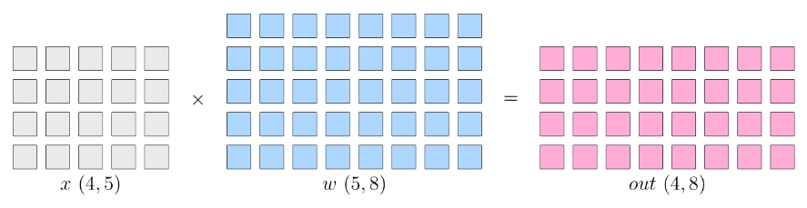
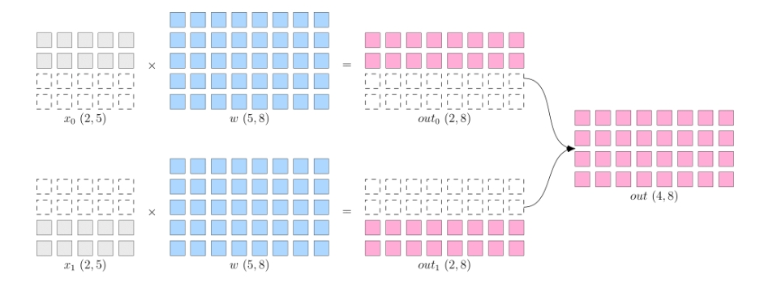
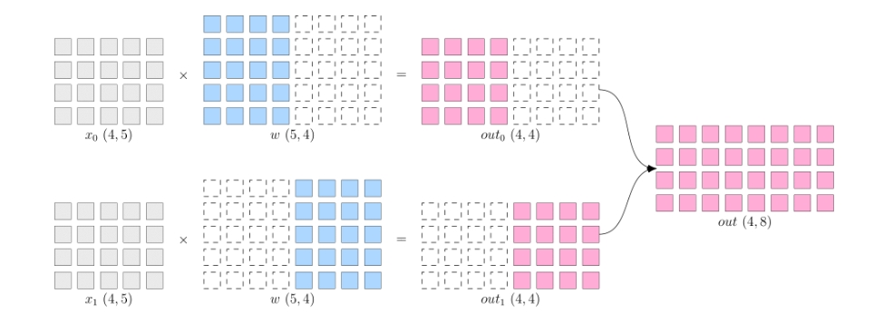
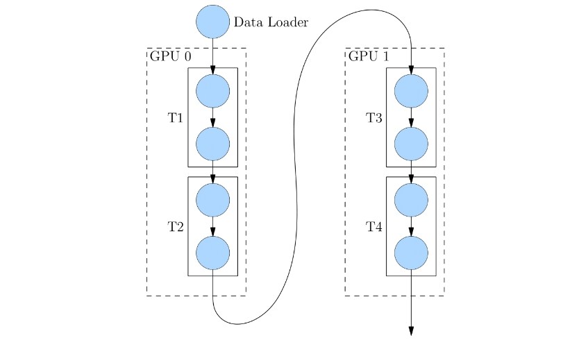
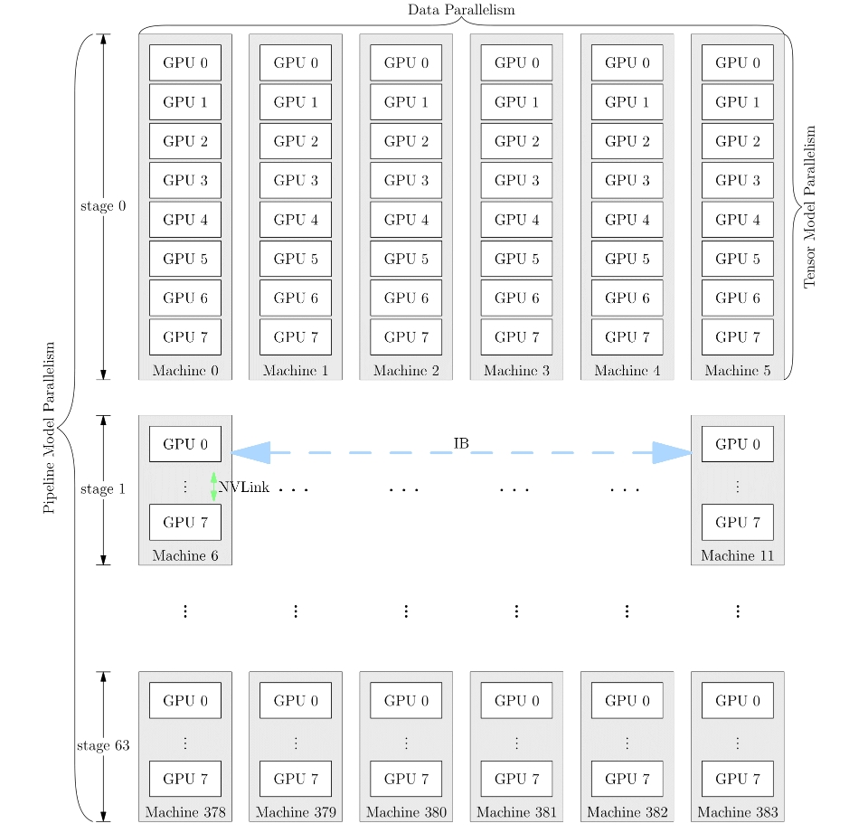

<style>
details {
    border: 1px solid #aaa;
    border-radius: 4px;
    padding: .5em .5em 0;
}
summary {
    font-weight: bold;
    margin: -.5em -.5em 0;
    padding: .5em;
}
details[open] {
    padding: .5em;
}
details[open] summary {
    border-bottom: 1px solid #aaa;
    margin-bottom: .5em;
}
img {
    pointer-events: none;
}
</style>

<details><summary>目录</summary><p>

- [目标函数](#目标函数)
    - [Decoder-only 模型](#decoder-only-模型)
    - [Encoder-only 模型](#encoder-only-模型)
        - [单向到双向](#单向到双向)
        - [BERT](#bert)
        - [RoBERTa](#roberta)
    - [Encoder-Decoder 模型](#encoder-decoder-模型)
        - [BART](#bart)
        - [T5](#t5)
- [优化算法](#优化算法)
    - [SGD](#sgd)
    - [Adam](#adam)
    - [AdaFactor](#adafactor)
    - [混合精度训练](#混合精度训练)
    - [学习率](#学习率)
    - [初始化](#初始化)
- [分布式训练](#分布式训练)
    - [为什么分布式训练越来越流行](#为什么分布式训练越来越流行)
    - [常见的并行策略](#常见的并行策略)
        - [数据并行](#数据并行)
        - [模型并行](#模型并行)
        - [流水并行](#流水并行)
        - [混合并行](#混合并行)
- [参考](#参考)
</p></details><p></p>

# 目标函数

下面研究下面三类语言模型的目标函数：

* Encoder-only 模型：计算双向上下文嵌入(contextual embeddings)
    - 例如，BERT
* Decoder-only 模型：计算单向上下文嵌入(contextual embeddings)，一次生成一个 token
    - 例如，GPT-3
* Encoder-Decoder 模型：编码输入，解码输出
    - 例如，T5

可以使用任何模型（例如，LSTM、Transformers）将 token 序列映射到上下文嵌入(contextual embeddings)中：

`$$\phi: V^{L} \rightarrow \mathbb{R}^{d\times L}$$`

其中：

* `$V$` 为词元集的词汇表；
* `$d$` 为上下文嵌入(Contextual Embedding)的维度
* `$L$` 为词元集的词汇表的 维度

> 例如：
> 
> `$$[\text{the, mouse, ate, the, cheese}]^{5} \stackrel{\phi}{\Rightarrow} 
> \left[
> \left(\begin{array}{c}1 \\ 0.1\end{array}\right),
> \left(\begin{array}{l}0 \\ 1\end{array}\right),
> \left(\begin{array}{l}1 \\ 1\end{array}\right),
> \left(\begin{array}{c}1 \\ -0.1\end{array}\right),
> \left(\begin{array}{c}0 \\ -1\end{array}\right)
> \right]^{2 \times 5}$$`

## Decoder-only 模型

自回归语言模型定义了一个条件分布：

`$$p(x_{i}|x_{1:i-1})$$`

将其定义如下：

* 将 `$x_{1:i-1}$` 映射到上下文嵌入 `$\phi(x_{1:i-1})$`；
* 应用嵌入矩阵 `$E \in \mathbb{R}^{V\times d}$` 来获得每个 token 的得分 `$E \cdot \phi(x_{1:i-1})_{i-1}$`；
* 对其进行指数化和归一化，得到预测 `$x_{i}$` 的分布。简洁地：

    `$$p(x_{i+1}|x_{1:i}) = \text{Softmax}\big(E \cdot \phi(x_{1:i})_{i}\big)$$`

**最大似然函数：**

设 `$\theta$` 是大语言模型的所有参数，设 `$D$` 是由一组序列组成的训练数据。
可以根据最大似然原理，定义以下负对数似然目标函数：

`$$\begin{align}
O(\theta) 
&= -\sum_{x\in D}\log p_{\theta}(x) \\
&= -\sum_{x\in D}\sum_{i=1}^{L}\log p_{\theta}(x_{i}|x_{1:i-1})
\end{align}$$`

有很多的方法可以有效地优化这个目标函数。

## Encoder-only 模型

### 单向到双向

使用上述最大似然可以训练得到 Decoder-only 模型，它会产生（单向）上下文嵌入。
但如果不需要生成，可以提供更强的双向上下文嵌入。

### BERT

**BERT 的目标函数** 包含以下两个部分：

* 掩码语言模型(Masked language modeling)
* 下一句预测(Next sentence prediction)

> 以自然语言推理（预测隐含、矛盾或中性）任务中的序列为例：
> 
> `$$x_{1:L}=[[\text{CLS}], \text{all, animals, breathe}, [\text{SEP}], \text{cats, breathe}]$$`
> 
> 其中有两个特殊的 token：
> 
> * `[CLS]`：包含用于驱动分类任务的嵌入；
> * `[SEP]`：用于告诉模型第一个序列（例如，前提）与第二个序列（例如，假设）的位置。

**BERT 模型定义为：**

`$$\begin{align}
\text{BERT}(x_{1:L})
&=\text{TransformerBlock}^{24}( \\
&\quad\quad \text{EmbedTokenWithPosition}(x_{1:L}) + \\
&\quad\quad \text{SentenceEmbedding}(x_{1:L})\\
&\quad) \in \mathbb{R}^{d\times L}
\end{align}$$`

其中，`$\text{SentenceEmbedding}(x_{1:L})$` 根据序列返回以下两个矢量之一：

* 对于 `$[\text{SEP}]$` 左边的，返回 `$e_{A}\in \mathbb{R}^{d}$`
* 对于 `$[\text{SEP}]$` 右边的，返回 `$e_{B}\in \mathbb{R}^{d}$`


BERT-large 有 `$n_{\text{heads}}=16$` 个 Attention 头，
并且 `$d_{\text{model}}=1024$`，总共 355M 个参数。

**掩码语言模型：**

掩码语言模型的基本思想是通过加噪然后预测来进行训练：

```
[the, [MASK], ate, [MASK], cheese] => [the, mouse, ate, the, cheese]
```

更普遍地说，可以将其视为类似于去噪自动编码器，
其中映射有噪声/不完整版本 `$\tilde{x}_{1:L}$`，​并尝试重建原始 `$x_{1:L}$`。

`$$\tilde{x}_{1:L} \Rightarrow x_{1:L}$$`

* 建模：首先定义模型分布。给定输入 `$\tilde{x}_{1:L}$` 及其上下文嵌入，模型独立地预测每个 token：

    `$$P(x_{i}|\tilde{x}_{1:L}) = \text{Softmax}(E \cdot \phi(\tilde{x}_{1:L})_{i})$$`

* 掩码：定义了一个（随机）噪声函数 `$A(\tilde{x}_{1:L}|x_{1:L})$`：

    `$$\underbrace{x_{1:L}}_{\text{original}} \stackrel{A}{\Rightarrow} \underbrace{\tilde{x}_{1:L}}_{\text{noised}}$$`

    以下是 `$A$` 的定义：

    - 假设 `$I \subset \{1, \cdots, L\}$` 代表所有位置中随机的 15%；
    - 对于每个 `$i \in I$`：
        - 以 0.8 的概率，`$\tilde{x}_{i} \leftarrow [\text{MASK}]$`
        - 以 0.1 的概率，`$\tilde{x}_{i} \leftarrow x_{i}$`
        - 以 0.1 的概率，`$\tilde{x}_{i} \leftarrow \text{random word from} V$`

* 减少分布偏移：如果总是使用 `[MASK]` 来替换 `$I$` 中选定的 token，则：
    - 在训练期间，输入到 BERT 的都是带 `[MASK]` 的序列。
    - 而在测试时，我们会输入没有 `[MASK]` 的句子，这将导致分布发生变化。
      一种启发式的解决方法是在 20% 的时间内(此处指训练的时间)用真实单词替换。

**下一句预测：**

回想一下，BERT 是在拼接好的成对句子上训练的。下一句预测的目标是预测第二句是否跟随第一句。

```
[[CLS], the, mouse, ate, the, cheese, [SEP], it, was, full] => 1
[[CLS], the, mouse, ate, the, cheese, [SEP], hello, world] => 0
```

然后使用 `[CLS]` 的嵌入来做二分类。

**数据集：**

`$D$` 是按如下方式构造的一组样本 `$(x_{1:L}, c)$`：

* 令 `$A$` 是语料库中的一个句子；
* 以 0.5 的概率，`$B$` 是下一句话；
* 以 0.5 的概率，`$B$` 是语料库中的一个随机句子；
* 令 `$x_{1:L} = [[\text{CLS}], A, [\text{SEP}], B]$`；
* 令 `$c$` 表示 `$B$` 是否是下一句。

**训练目标：**

BERT 的训练目标是：

`$$O(\theta) = \sum_{(x_{1:L} c) \in D} \underbrace{E_{I, \tilde{x}_{1:L} \sim A(\cdot|x_{1:L} I)}\Bigg[-\sum_{i \in I}\log p_{\theta}(\tilde{x}_{i}|x_{1:L})\Bigg]}_{\text{masked language modeling}} + \underbrace{-\log p(c|\phi(x_{1:L})_{1})}_{\text{next sentence prediction}}$$`

稍后将讨论训练，这里简要总结一下 BERT：

* BERT（以及 ELMo 和 ULMFiT）表明，一个统一的体系结构（Transformer）可以用于多个分类任务；
* BERT 真正将 NLP 社区转变为 **预训练+微调** 的范式；
* BERT 显示了深度双向上下文嵌入的重要性，尽管通过模型大小和微调策略可能会弥补这一点，
  比如：[p-tuning](https://arxiv.org/pdf/2103.10385)。

### RoBERTa

[RoBERTa](https://arxiv.org/pdf/1907.11692.pdf) 对 BERT 进行了以下改进：

* 删除了下一句预测这一目标函数（发现它没有帮助）；
* 使用更多数据训练（16GB 文本 `$\Rightarrow$` 160GB 文本）；
* 训练时间更长；
* RoBERTa 在各种基准上显著提高了 BERT 的准确性（例如，在 SQuAD 上由 81.8 到 89.4）。

## Encoder-Decoder 模型

回想一下编码器-解码器模型（例如，BART、T5）：

* 首先像 BERT 一样对输入进行双向编码；
* 然后像 GPT-2 一样对输出进行自回归解码。

<!-- 任务示例（表格生成文本）：

```
[name, :, Clowns, |, eatType, :, coffee, shop] => [Clowns, is, a, coffee, shop]
``` -->

### BART

> Bidirectional Auto-Regressive Transformers

BART 是基于 Transformer 的 Encoder-Decoder 模型。

* 使用与 RoBERTa 相同的 Encoder 架构（12 层，隐藏维度 1024）
* 使用与 RoBERTa 相同的数据进行训练（160GB 文本）

BART 使用了以下变换 `$A(\tilde{x}_{1:L}|x_{1:L})$`：


基于 BERT 的实验，最终模型进行以下了变换：

* 掩码文档中 30% 的 token
* 将所有子句打乱

最后，通过微调，BART 在分类和生成任务上都展示了强大的效果。

### T5

> Text-to-Text Transfer Transformer

T5 是另一种基于 Transformer 的 Encoder-Decoder 模型。

预训练任务：给定一段文本，在随机位置将其分割为输入和输出：

```
[the, mouse] => [ate the cheese]
```

论文尝试了许多不同的无监督目标：


并发现 `“i.i.d. noise, replace spans”` 效果最好（尽管许多目标相似）。

论文还将所有经典的 NLP 任务放在一个统一的框架中，称为 “Text-to-Text” 任务：


以分类任务任务为例，不同模型的差异如下：

* BERT 使用 `[CLS]` 的嵌入来预测。
* T5、GPT-2、GPT-3 等（生成模型）将分类任务转换成自然语言生成。

注意：

* 论文对整个 pipline 的许多方面（数据集、模型大小、训练目标等）进行了深入研究。
* 基于这些见解，他们训练了一个 11B 的模型。


# 优化算法

为了简单起见，以自回归语言模型为例：

`$$O(\theta) = -\sum_{x\in D}\log p_{\theta}(x)$$`

## SGD

> 随机梯度下降

最简单的优化算法是用小批量进行随机梯度下降，该算法的步骤如下：

1. 初始化参数 `$\theta$`；
2. 重复以下步骤：
    - 采样小批量 `$B_{t} \in D$`
    - 根据梯度更新参数：

`$$\theta_{t} \leftarrow \theta_{t-1} - \eta \frac{1}{|B_{t}|}\sum_{x\in B_{t}}\nabla_{\theta}(-\log p_{\theta}(x))$$`

优化的关键点包括：

1. 希望参数 `$\theta$` 可以快速收敛；
2. 希望优化在数值上是稳定的；
3. 希望内存高效（尤其是对于大模型）；

这些点往往相互矛盾（例如，通过低精度训练，可以实现快速收敛、减少内存占用，但是会导致训练不稳定）。

因此，可以从几个层次来进行优化：

1. 针对经典优化：二阶方法、约束优化等；
2. 针对机器学习：随机方法、隐式正则化 + 早停法；
3. 针对深度学习：初始化、归一化（更改模型架构）；
4. 针对大语言模型：由于稳定性问题，学习率和一些直觉（例如，二阶方法）仍然有用，
   但要使大语言模型有效训练，还需要克服许多其他独特的挑战。
   不幸的是，其中大部分内容都是特别的，人们对此了解甚少。

## Adam

> Adaptive Moment Estimation

[Adam 算法](https://arxiv.org/pdf/1412.6980)拥有以下两个创新：

1. 引入动量（继续朝同一方向移动）；
2. 参数 `$\theta_{0}$` 的每个维度都有一个自适应（不同）的步长（受二阶方法启发）。

它的步骤如下：

1. 初始化参数 `$\theta_{0}$`
2. 初始化动量 `$m_{0}, v_{0}\leftarrow 0$`
3. 重复以下步骤：
    - 采样小批量 `$B_{t} \subset D$`
    - 按照如下步骤更新参数：
        - 计算梯度

        `$$g_{t} \leftarrow \frac{1}{|B_{t}|}\sum_{x\in B_{t}}\nabla_{\theta}(-\log p_{\theta}(x))$$`

        - 更新一阶/二阶动量

        `$$m_{t} \leftarrow \beta_{1}m_{t-1}+(1-\beta_{1})g_{t}$$`
        `$$b_{t} \leftarrow \beta_{2}v_{t-1}+(1-\beta_{2})g_{t}^{2}$$`

        - 对偏差进行修正

        `$$\hat{m}_{t} \leftarrow m_{t} / (1-\beta_{1}^{t})$$`
        `$$\hat{v}_{t} \leftarrow v_{t} / (1-\beta_{2}^{t})$$`

        - 更新参数

        `$$\theta_{t}\leftarrow \theta_{t-1}-\eta\hat{m}_{t}/(\sqrt{\hat{v}_{t}} + \epsilon)$$`

存储占用分析：Adam 将存储从 2 倍的模型参数 `$(\theta_{t}, g_{t})$` 增加到了 4 倍 `$(\theta_{t}, g_{t}, m_{t}, v_{t})$`。

## AdaFactor

[AdaFactor](https://arxiv.org/pdf/1804.04235.pdf) 是一种为减少存储占用的优化算法。它有如下特点：

* 它不储存 `$m_{t}, v_{t}$` 这样的 `$O(m\times n)$` 矩阵，
  而是存储行和列的和 `$O(m+n)$` 并重构矩阵
* 去除动量
* 被用来训练 T5
* AdaFactor 可能使训练变得困难（见 [Twitter thread](https://twitter.com/_arohan_/status/1468673364889726985?s=20&t=i7E0NN5ytysukMGVWG7lfQ) 和 [blog post](https://blog.ceshine.net/post/adafactor/)）

## 混合精度训练

[混合精度训练](https://arxiv.org/pdf/1710.03740.pdf)是另一种减少存储的方法。


通常来说，默认的精度是：FP32（32 位浮点），其他可选精度为 FP16（16 位浮点），
但问题是任何小于 `$2^{-24}$` 的值都会变为 0。

* 解决方案：将主权重存储在 FP32 中，并在 FP16 中执行其他所有操作。
* 损失缩放：按比例放大损失，以避免梯度数值太小。
* 结果：存储减少了一半。

## 学习率

通常情况下，学习率会随着时间的推移而衰减。对于 Transformer 模型，
实际上需要通过预热（warmup）提高学习率。
[Huang 等 2020](https://www.cs.toronto.edu/~mvolkovs/ICML22020_tfixup.pdf) 表明，
一个潜在的原因是防止层归一化的梯度消失，导致使用 Adam 优化器训练时不稳定。

## 初始化

给定矩阵 `$W\in \mathbb{R}^{m\times n}$`，标准初始化（即，`xavier` 初始化）为 `$W_{ij}\sim N(0, 1/n)$`；

GPT-2 和 GPT-3 通过额外的 `$1/\sqrt{N}$` 缩放权重，其中 `$N$` 是残差层的数量。
T5 将注意力矩阵增加一个 `$1/\sqrt{d}$`([代码](https://github.com/tensorflow/mesh/blob/master/mesh_tensorflow/transformer/attention.py#L459))。

以 GPT-3 为例，使用的参数如下：

* Adam 参数：`$\beta_{1}=0.9, \beta_{2}=0.95, \epsilon=10^{-8}$`；
* 批量小：320 万个 token（约 1500 个序列）；
* 使用梯度剪裁 `$g_{t} \leftarrow g_{t} / \text{min}(1, |g_{2}|)$`；
* 线性学习率预热（前 3.75 亿个 token）；
* 余弦学习率衰减到 10%；
* 逐渐增加批大小；
* 权重衰减设为 0.1。

# 分布式训练

## 为什么分布式训练越来越流行

近年来，深度学习被广泛应用到各个领域，包括计算机视觉、语言理解、语音识别、广告推荐等。
在这些不同的领域中，一个共同的特点就是模型规模越来越大，比如 GPT-3 模型的参数量达到 1750 亿(175B)。
即使用 1024 张 80 GB 的 A100，那么完整训练 GPT-3 的时长都需要 1 个月。

模型规模的扩大，对硬件（算力、内存）的发展提出要求。
然而，因为[内存墙](https://oneflow.org/a/share/jishuboke/75.html)的存在，
单一设备的算力及容量，受限于物理定律，持续提高芯片的集成越来越困难，难以跟上模型扩大的需求。

为了解决算力增速不足的问题，人们考虑用多节点集群进行分布式训练，以提升算力，分布式训练势在必行。

## 常见的并行策略

简单的机器堆叠并不一定会带来算力的增长。
因为神经网络的训练并不是单纯的 “把原来一个设备做的事情，现在分给多个设备各自做”，
它不仅需要多个设备进行计算，还涉及到设备之间的数据传输，只有协调好集群中的计算与通信，
才能做高效的分布式训练。

以矩阵乘法的例子，解释 **数据并行**、**模型并行** 的区别。先了解以下逻辑上的矩阵乘法例子：
假设神经网络中某一层是做矩阵乘法，其中的输入 `$x$` 的形状为 `$4 \times 5$`，
模型参数 `$w$` 的形状为 `$5 \times 8$`，那么，矩阵乘法输出形状为 `$4 \times 8$`。
示意图如下：



* **单机单卡的训练中**，以上矩阵乘法，先计算得到 `$\text{out}$`，并将 `$\text{out}$` 传递给下一层，
  并最终计算得到 `$\text{loss}$`，然后在反向传播过程中，
  得到 `$\frac{\partial\text{loss}}{\partial w}$`，用于更新 `$w$`；
* **分布式训练中**，依据是切分 `$x$` 还是 `$w$` 的不同，分为“数据并行”和“模型并行”策略。

### 数据并行

所谓的数据并行，就是将数据 `$x$` 进行切分，而每个设备上的模型 `$w$` 是完整的、一致的。
如下图所示，`$x$` 被按照第 0 维度平均切分到 2 个设备上，两个设备上都有完整的 `$w$`。
这样，在两台设备上，分别得到的输出，都只是逻辑上输出的一半（形状为 `$2\times 8$`），
将两个设备上的输出拼接到一起，才能得到逻辑上完整的输出。



注意，因为数据被分发到了 2 个设备上，因此反向传播过程，
各自设备上得到的 `$\frac{\partial\text{loss}}{\partial w}$` 会不一样，
如果直接使用各个设备上的梯度更新各自的模型，会造成 2 个设备上的模型不一致，
训练就失去了意义（到底用哪个模型好呢？）。

因此，数据并行策略下，在反向传播过程中，
需要对各个设备上的梯度进行 [AllReduce](https://docs.nvidia.com/deeplearning/nccl/user-guide/docs/usage/collectives.html#allreduce)，
以确保各个设备上的模型始终保持一致。

当数据集较大，模型较小时，由于反向过程中为同步梯度产生的通信代价较小，
此时选择数据并行一般比较有优势，常见的视觉分类模型，如 ResNet50，比较适合采用数据并行。

### 模型并行

当神经网络非常巨大，数据并行同步梯度的代价就会很大，
甚至网络可能巨大到无法存放到单一计算设备中，这时候，
可以采用模型并行策略解决问题。

所谓的模型并行，就是每个设备上的数据是完整的、一致的，而模型 `$w$` 被切分到了各个设备上，
每个设备只拥有模型的一部分，所有计算设备上的模型拼在一起，才是完整的模型。

如下图所示，`$w$` 被按照第 1 维度平均切分到 2 个设备上，两个设备上都有完整的 `$x$`。
两个设备上的输出也需要通过拼接才能得到逻辑上的输出。



模型并行的好处是，省去了多个设备之间的梯度 AllReduce；但是，由于每个设备都需要完整的数据输入，
因此，数据会在多个设备之间进行广播，产生通信代价。比如，上图中的最终得到的 `$\text{out}(4\times 8)$`，
如果它作为下一层网络的输入，那么它就需要被广播发送到两个设备上。

语言模型，如 BERT，常采用模型并行。

### 流水并行

当神经网络过于巨大，无法在一个设备上存放时，除了上述的模型并行的策略外，还可以选择流水并行。
流水并行指将网络切为多个阶段，并分发到不同的计算设备上，各个计算设备之间以“接力”的方式完成训练。

如下图，展示了一个逻辑上的 4 层网络(`T1` 至 `T4`)是如何做流水并行的：
4 层网络被切分到 2 个计算设备上，其中 GPU0 上进行 `T1` 与 `T2` 的运算，
GPU1 上进行 `T3` 与 `T4` 的计算。GPU0 上完成前两层的计算后，
它的输出被当作 GPU1 的输入，继续进行后两层的计算。



### 混合并行

网络的训练中，也可以将多种并行策略混用，以 GPT-3 为例，以下是它训练时的设备并行方案：

它首先被分为 64 个阶段，进行流水并行。每个阶段都运行在 6 台 DGX-A100 主机上。
在 6 台主机之间，进行的是数据并行训练；每台主机有 8 张 GPU 显卡，
同一台机器上的 8 张 GPU 显卡之间是进行模型并行训练。



并行策略的选择影响着训练效率，框架对并行训练的接口支持程度，决定了算法工程师的开发效率。
OneFlow 针对分布式训练所做的系统级设计和创新，为用户轻松上手分布式训练做足了铺垫。

# 参考

* [常见的分布式并行策略](https://docs.oneflow.org/master/parallelism/01_introduction.html)
