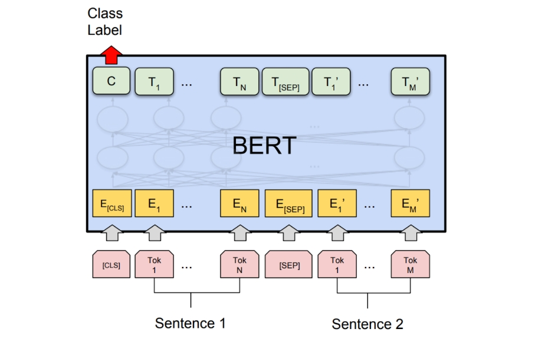
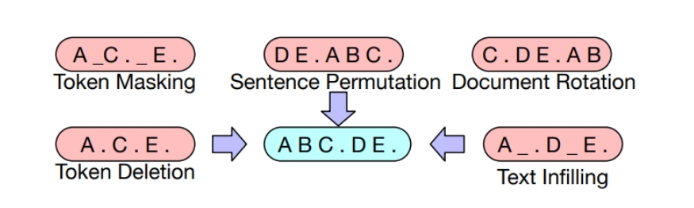
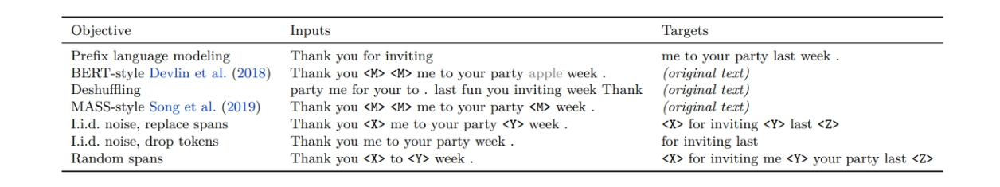
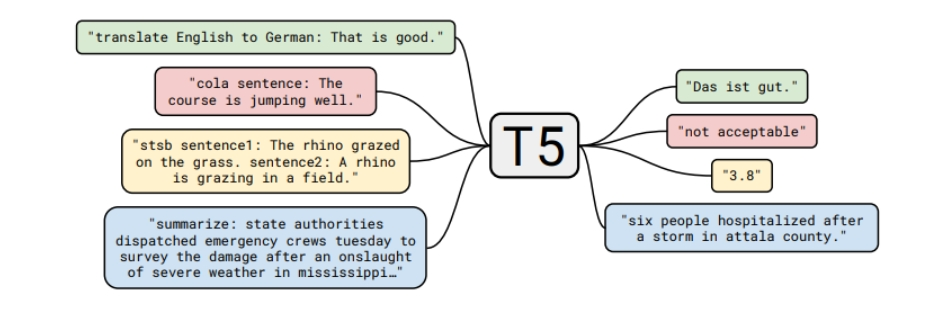
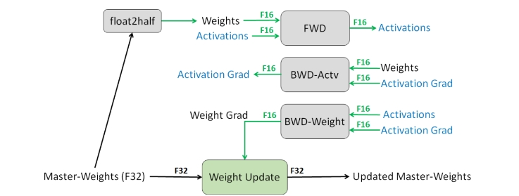
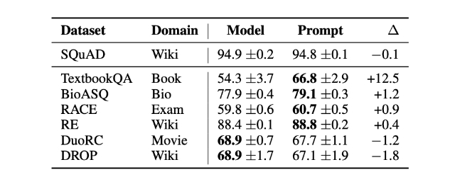

<style>
details {
    border: 1px solid #aaa;
    border-radius: 4px;
    padding: .5em .5em 0;
}
summary {
    font-weight: bold;
    margin: -.5em -.5em 0;
    padding: .5em;
}
details[open] {
    padding: .5em;
}
details[open] summary {
    border-bottom: 1px solid #aaa;
    margin-bottom: .5em;
}
img {
    pointer-events: none;
}
</style>

<details><summary>目录</summary><p>

- [目标函数](#目标函数)
    - [Decoder-only 模型](#decoder-only-模型)
    - [Encoder-only 模型](#encoder-only-模型)
        - [单向到双向](#单向到双向)
        - [BERT](#bert)
        - [RoBERTa](#roberta)
    - [Encoder-Decoder 模型](#encoder-decoder-模型)
        - [BART](#bart)
        - [T5](#t5)
- [优化算法](#优化算法)
    - [SGD](#sgd)
    - [Adam](#adam)
    - [AdaFactor](#adafactor)
    - [混合精度训练](#混合精度训练)
    - [学习率](#学习率)
    - [初始化](#初始化)
- [分布式训练](#分布式训练)
- [Adaptation](#adaptation)
    - [Adaptation 简介](#adaptation-简介)
        - [为什么需要Adaptation](#为什么需要adaptation)
        - [通用的adaptation配置](#通用的adaptation配置)
    - [Adaptation 方法](#adaptation-方法)
        - [Probing](#probing)
        - [Fine-tuning](#fine-tuning)
        - [Lightweight Fine-tuning](#lightweight-fine-tuning)
            - [轻量级微调的变体](#轻量级微调的变体)
            - [Prompt Tuning](#prompt-tuning)
            - [Prefix Tuning](#prefix-tuning)
            - [Adapter Tuning](#adapter-tuning)
            - [Lightweight Fine-tuning的其他性质](#lightweight-fine-tuning的其他性质)
            - [Adaptation 总结](#adaptation-总结)
    - [Adaptation 总结](#adaptation-总结-1)
</p></details><p></p>

# 目标函数

下面研究下面三类语言模型的目标函数：

* Encoder-only 模型：计算双向上下文嵌入(contextual embeddings)
    - 例如，BERT
* Decoder-only 模型：计算单向上下文嵌入(contextual embeddings)，一次生成一个 token
    - 例如，GPT-3
* Encoder-Decoder 模型：编码输入，解码输出
    - 例如，T5

可以使用任何模型（例如，LSTM、Transformers）将 token 序列映射到上下文嵌入(contextual embeddings)中：

`$$\phi: V^{L} \rightarrow \mathbb{R}^{d\times L}$$`

其中：

* `$V$` 为词元集的词汇表；
* `$d$` 为上下文嵌入(Contextual Embedding)的维度
* `$L$` 为词元集的词汇表的 维度

> 例如：
> 
> `$$[\text{the, mouse, ate, the, cheese}]^{5} \stackrel{\phi}{\Rightarrow} 
> \left[
> \left(\begin{array}{c}1 \\ 0.1\end{array}\right),
> \left(\begin{array}{l}0 \\ 1\end{array}\right),
> \left(\begin{array}{l}1 \\ 1\end{array}\right),
> \left(\begin{array}{c}1 \\ -0.1\end{array}\right),
> \left(\begin{array}{c}0 \\ -1\end{array}\right)
> \right]^{2 \times 5}$$`

## Decoder-only 模型

自回归语言模型定义了一个条件分布：

`$$p(x_{i}|x_{1:i-1})$$`

将其定义如下：

* 将 `$x_{1:i-1}$` 映射到上下文嵌入 `$\phi(x_{1:i-1})$`；
* 应用嵌入矩阵 `$E \in \mathbb{R}^{V\times d}$` 来获得每个 token 的得分 `$E \cdot \phi(x_{1:i-1})_{i-1}$`；
* 对其进行指数化和归一化，得到预测 `$x_{i}$` 的分布。简洁地：

    `$$p(x_{i+1}|x_{1:i}) = \text{Softmax}\big(E \cdot \phi(x_{1:i})_{i}\big)$$`

**最大似然函数：**

设 `$\theta$` 是大语言模型的所有参数，设 `$D$` 是由一组序列组成的训练数据。
可以根据最大似然原理，定义以下负对数似然目标函数：

`$$\begin{align}
O(\theta) 
&= -\sum_{x\in D}\log p_{\theta}(x) \\
&= -\sum_{x\in D}\sum_{i=1}^{L}\log p_{\theta}(x_{i}|x_{1:i-1})
\end{align}$$`

有很多的方法可以有效地优化这个目标函数。

## Encoder-only 模型

### 单向到双向

使用上述最大似然可以训练得到 Decoder-only 模型，它会产生（单向）上下文嵌入。
但如果不需要生成，可以提供更强的双向上下文嵌入。

### BERT

**BERT 的目标函数** 包含以下两个部分：

* 掩码语言模型(Masked language modeling)
* 下一句预测(Next sentence prediction)

> 以自然语言推理（预测隐含、矛盾或中性）任务中的序列为例：
> 
> `$$x_{1:L}=[[\text{CLS}], \text{all, animals, breathe}, [\text{SEP}], \text{cats, breathe}]$$`
> 
> 其中有两个特殊的 token：
> 
> * `[CLS]`：包含用于驱动分类任务的嵌入；
> * `[SEP]`：用于告诉模型第一个序列（例如，前提）与第二个序列（例如，假设）的位置。

**BERT 模型定义为：**

`$$\begin{align}
\text{BERT}(x_{1:L})
&=\text{TransformerBlock}^{24}( \\
&\quad\quad \text{EmbedTokenWithPosition}(x_{1:L}) + \\
&\quad\quad \text{SentenceEmbedding}(x_{1:L})\\
&\quad) \in \mathbb{R}^{d\times L}
\end{align}$$`

其中，`$\text{SentenceEmbedding}(x_{1:L})$` 根据序列返回以下两个矢量之一：

* 对于 `$[\text{SEP}]$` 左边的，返回 `$e_{A}\in \mathbb{R}^{d}$`
* 对于 `$[\text{SEP}]$` 右边的，返回 `$e_{B}\in \mathbb{R}^{d}$`



BERT-large 有 `$n_{\text{heads}}=16$` 个 Attention 头，
并且 `$d_{\text{model}}=1024$`，总共 355M 个参数。

**掩码语言模型：**

掩码语言模型的基本思想是通过加噪然后预测来进行训练：

```
[the, [MASK], ate, [MASK], cheese] => [the, mouse, ate, the, cheese]
```

更普遍地说，可以将其视为类似于去噪自动编码器，
其中映射有噪声/不完整版本 `$\tilde{x}_{1:L}$`，​并尝试重建原始 `$x_{1:L}$`。

`$$\tilde{x}_{1:L} \Rightarrow x_{1:L}$$`

* 建模：首先定义模型分布。给定输入 `$\tilde{x}_{1:L}$` 及其上下文嵌入，模型独立地预测每个 token：

    `$$P(x_{i}|\tilde{x}_{1:L}) = \text{Softmax}(E \cdot \phi(\tilde{x}_{1:L})_{i})$$`

* 掩码：定义了一个（随机）噪声函数 `$A(\tilde{x}_{1:L}|x_{1:L})$`：

    `$$\underbrace{x_{1:L}}_{\text{original}} \stackrel{A}{\Rightarrow} \underbrace{\tilde{x}_{1:L}}_{\text{noised}}$$`

    以下是 `$A$` 的定义：

    - 假设 `$I \subset \{1, \cdots, L\}$` 代表所有位置中随机的 15%；
    - 对于每个 `$i \in I$`：
        - 以 0.8 的概率，`$\tilde{x}_{i} \leftarrow [\text{MASK}]$`
        - 以 0.1 的概率，`$\tilde{x}_{i} \leftarrow x_{i}$`
        - 以 0.1 的概率，`$\tilde{x}_{i} \leftarrow \text{random word from} V$`

* 减少分布偏移：如果总是使用 `[MASK]` 来替换 `$I$` 中选定的 token，则：
    - 在训练期间，输入到 BERT 的都是带 `[MASK]` 的序列。
    - 而在测试时，我们会输入没有 `[MASK]` 的句子，这将导致分布发生变化。
      一种启发式的解决方法是在 20% 的时间内(此处指训练的时间)用真实单词替换。

**下一句预测：**

回想一下，BERT 是在拼接好的成对句子上训练的。下一句预测的目标是预测第二句是否跟随第一句。

```
[[CLS], the, mouse, ate, the, cheese, [SEP], it, was, full] => 1
[[CLS], the, mouse, ate, the, cheese, [SEP], hello, world] => 0
```

然后使用 `[CLS]` 的嵌入来做二分类。

**数据集：**

`$D$` 是按如下方式构造的一组样本 `$(x_{1:L}, c)$`：

* 令 `$A$` 是语料库中的一个句子；
* 以 0.5 的概率，`$B$` 是下一句话；
* 以 0.5 的概率，`$B$` 是语料库中的一个随机句子；
* 令 `$x_{1:L} = [[\text{CLS}], A, [\text{SEP}], B]$`；
* 令 `$c$` 表示 `$B$` 是否是下一句。

**训练目标：**

BERT 的训练目标是：

`$$O(\theta) = \sum_{(x_{1:L} c) \in D} \underbrace{E_{I, \tilde{x}_{1:L} \sim A(\cdot|x_{1:L} I)}\Bigg[-\sum_{i \in I}\log p_{\theta}(\tilde{x}_{i}|x_{1:L})\Bigg]}_{\text{masked language modeling}} + \underbrace{-\log p(c|\phi(x_{1:L})_{1})}_{\text{next sentence prediction}}$$`

稍后将讨论训练，这里简要总结一下 BERT：

* BERT（以及 ELMo 和 ULMFiT）表明，一个统一的体系结构（Transformer）可以用于多个分类任务；
* BERT 真正将 NLP 社区转变为 **预训练+微调** 的范式；
* BERT 显示了深度双向上下文嵌入的重要性，尽管通过模型大小和微调策略可能会弥补这一点，
  比如：[p-tuning](https://arxiv.org/pdf/2103.10385)。

### RoBERTa

[RoBERTa](https://arxiv.org/pdf/1907.11692.pdf) 对 BERT 进行了以下改进：

* 删除了下一句预测这一目标函数（发现它没有帮助）；
* 使用更多数据训练（16GB 文本 `$\Rightarrow$` 160GB 文本）；
* 训练时间更长；
* RoBERTa 在各种基准上显著提高了 BERT 的准确性（例如，在 SQuAD 上由 81.8 到 89.4）。

## Encoder-Decoder 模型

回想一下编码器-解码器模型（例如，BART、T5）：

* 首先像 BERT 一样对输入进行双向编码；
* 然后像 GPT-2 一样对输出进行自回归解码。

<!-- 任务示例（表格生成文本）：

```
[name, :, Clowns, |, eatType, :, coffee, shop] => [Clowns, is, a, coffee, shop]
``` -->

### BART

> Bidirectional Auto-Regressive Transformers

BART 是基于 Transformer 的 Encoder-Decoder 模型。

* 使用与 RoBERTa 相同的 Encoder 架构（12 层，隐藏维度 1024）
* 使用与 RoBERTa 相同的数据进行训练（160GB 文本）

BART 使用了以下变换 `$A(\tilde{x}_{1:L}|x_{1:L})$`：



基于 BERT 的实验，最终模型进行以下了变换：

* 掩码文档中 30% 的 token
* 将所有子句打乱

最后，通过微调，BART 在分类和生成任务上都展示了强大的效果。

### T5

> Text-to-Text Transfer Transformer

T5 是另一种基于 Transformer 的 Encoder-Decoder 模型。

预训练任务：给定一段文本，在随机位置将其分割为输入和输出：

```
[the, mouse] => [ate the cheese]
```

论文尝试了许多不同的无监督目标：



并发现 `“i.i.d. noise, replace spans”` 效果最好（尽管许多目标相似）。

论文还将所有经典的 NLP 任务放在一个统一的框架中，称为 “Text-to-Text” 任务：



以分类任务任务为例，不同模型的差异如下：

* BERT 使用 `[CLS]` 的嵌入来预测。
* T5、GPT-2、GPT-3 等（生成模型）将分类任务转换成自然语言生成。

注意：

* 论文对整个 pipline 的许多方面（数据集、模型大小、训练目标等）进行了深入研究。
* 基于这些见解，他们训练了一个 11B 的模型。


# 优化算法

为了简单起见，以自回归语言模型为例：

`$$O(\theta) = -\sum_{x\in D}\log p_{\theta}(x)$$`

## SGD

> 随机梯度下降

最简单的优化算法是用小批量进行随机梯度下降，该算法的步骤如下：

1. 初始化参数 `$\theta$`；
2. 重复以下步骤：
    - 采样小批量 `$B_{t} \in D$`
    - 根据梯度更新参数：

`$$\theta_{t} \leftarrow \theta_{t-1} - \eta \frac{1}{|B_{t}|}\sum_{x\in B_{t}}\nabla_{\theta}(-\log p_{\theta}(x))$$`

优化的关键点包括：

1. 希望参数 `$\theta$` 可以快速收敛；
2. 希望优化在数值上是稳定的；
3. 希望内存高效（尤其是对于大模型）；

这些点往往相互矛盾（例如，通过低精度训练，可以实现快速收敛、减少内存占用，但是会导致训练不稳定）。

因此，可以从几个层次来进行优化：

1. 针对经典优化：二阶方法、约束优化等；
2. 针对机器学习：随机方法、隐式正则化 + 早停法；
3. 针对深度学习：初始化、归一化（更改模型架构）；
4. 针对大语言模型：由于稳定性问题，学习率和一些直觉（例如，二阶方法）仍然有用，
   但要使大语言模型有效训练，还需要克服许多其他独特的挑战。
   不幸的是，其中大部分内容都是特别的，人们对此了解甚少。

## Adam

> Adaptive Moment Estimation

[Adam 算法](https://arxiv.org/pdf/1412.6980)拥有以下两个创新：

1. 引入动量（继续朝同一方向移动）；
2. 参数 `$\theta_{0}$` 的每个维度都有一个自适应（不同）的步长（受二阶方法启发）。

它的步骤如下：

1. 初始化参数 `$\theta_{0}$`
2. 初始化动量 `$m_{0}, v_{0}\leftarrow 0$`
3. 重复以下步骤：
    - 采样小批量 `$B_{t} \subset D$`
    - 按照如下步骤更新参数：
        - 计算梯度

        `$$g_{t} \leftarrow \frac{1}{|B_{t}|}\sum_{x\in B_{t}}\nabla_{\theta}(-\log p_{\theta}(x))$$`

        - 更新一阶/二阶动量

        `$$m_{t} \leftarrow \beta_{1}m_{t-1}+(1-\beta_{1})g_{t}$$`
        `$$b_{t} \leftarrow \beta_{2}v_{t-1}+(1-\beta_{2})g_{t}^{2}$$`

        - 对偏差进行修正

        `$$\hat{m}_{t} \leftarrow m_{t} / (1-\beta_{1}^{t})$$`
        `$$\hat{v}_{t} \leftarrow v_{t} / (1-\beta_{2}^{t})$$`

        - 更新参数

        `$$\theta_{t}\leftarrow \theta_{t-1}-\eta\hat{m}_{t}/(\sqrt{\hat{v}_{t}} + \epsilon)$$`

存储占用分析：Adam 将存储从 2 倍的模型参数 `$(\theta_{t}, g_{t})$` 增加到了 4 倍 `$(\theta_{t}, g_{t}, m_{t}, v_{t})$`。

## AdaFactor

[AdaFactor](https://arxiv.org/pdf/1804.04235.pdf) 是一种为减少存储占用的优化算法。它有如下特点：

* 它不储存 `$m_{t}, v_{t}$` 这样的 `$O(m\times n)$` 矩阵，
  而是存储行和列的和 `$O(m+n)$` 并重构矩阵
* 去除动量
* 被用来训练 T5
* AdaFactor 可能使训练变得困难（见 [Twitter thread](https://twitter.com/_arohan_/status/1468673364889726985?s=20&t=i7E0NN5ytysukMGVWG7lfQ) 和 [blog post](https://blog.ceshine.net/post/adafactor/)）

## 混合精度训练

[混合精度训练](https://arxiv.org/pdf/1710.03740.pdf)是另一种减少存储的方法。



通常来说，默认的精度是：FP32（32 位浮点），其他可选精度为 FP16（16 位浮点），
但问题是任何小于 `$2^{-24}$` 的值都会变为 0。

* 解决方案：将主权重存储在 FP32 中，并在 FP16 中执行其他所有操作。
* 损失缩放：按比例放大损失，以避免梯度数值太小。
* 结果：存储减少了一半。

## 学习率

通常情况下，学习率会随着时间的推移而衰减。对于 Transformer 模型，
实际上需要通过预热（warmup）提高学习率。
[Huang 等 2020](https://www.cs.toronto.edu/~mvolkovs/ICML22020_tfixup.pdf) 表明，
一个潜在的原因是防止层归一化的梯度消失，导致使用 Adam 优化器训练时不稳定。

## 初始化

给定矩阵 `$W\in \mathbb{R}^{m\times n}$`，标准初始化（即，`xavier` 初始化）为 `$W_{ij}\sim N(0, 1/n)$`；

GPT-2 和 GPT-3 通过额外的 `$1/\sqrt{N}$` 缩放权重，其中 `$N$` 是残差层的数量。
T5 将注意力矩阵增加一个 `$1/\sqrt{d}$`([代码](https://github.com/tensorflow/mesh/blob/master/mesh_tensorflow/transformer/attention.py#L459))。

以 GPT-3 为例，使用的参数如下：

* Adam 参数：`$\beta_{1}=0.9, \beta_{2}=0.95, \epsilon=10^{-8}$`；
* 批量小：320 万个 token（约 1500 个序列）；
* 使用梯度剪裁 `$g_{t} \leftarrow g_{t} / \text{min}(1, |g_{2}|)$`；
* 线性学习率预热（前 3.75 亿个 token）；
* 余弦学习率衰减到 10%；
* 逐渐增加批大小；
* 权重衰减设为 0.1。


# 分布式训练


# Adaptation

## Adaptation 简介

使用语言模型（例如在上下文学习中）通过仅给出提示(Prompt)已经能够执行一些任务。
然而，提示方法并不适用于全部的下游任务，如自然语言推理(NLI)、问题回答(QA)、
将网络表格转换为文本、解析电子健康记录(EHR)等。

下游任务与语言模型的训练数据(例如，Pile 数据集）可能在格式和主题上有所不同，
或者需要随时间更新新知识。因此，语言模型需要使用特定于任务的数据或领域知识来针对下游任务进行适配。

### 为什么需要Adaptation

在自动化和人工智能的时代，语言模型已成为一个迅速发展的领域。
这些模型被训练为对各种各样的任务作出响应，但它们真的适合所有的任务吗？
在探讨这一问题之前，我们需要理解语言模型如何被训练，
并明确下游任务与原始训练任务之间可能存在的不同之处。

从语言模型的训练方式来说，语言模型，例如 GPT-3，通常是任务不可知(task-agnostic)的，
这意味着它们在一个广泛的领域内进行训练，而不是针对特定任务。
这种方法的优点在于模型具有广泛的适用性，但也带来了一些挑战。
比如下游任务的多样性，不同的下游任务与语言模型的预训练方式可以非常不同，这可能导致问题。
例如，自然语言推理(NLI)任务与 Pile 数据集上的语言建模任务可能完全不同。

> task-agnostic 这个词组用于描述一种不针对任何特定任务进行优化的方法或模型。
> 在机器学习和人工智能的背景下，task-agnostic 通常指的是一种可以在多个不同任务上运行，
> 而不需要对每个单独任务进行特别调整或训练的方法。例如，
> 一个 task-agnostic 的语言模型在训练时不会专门针对特定任务进行优化，
> 例如情感分析、文本摘要或问题回答。相反，它被设计为能够捕捉到语言的通用特性和结构，
> 以便可以用于许多不同的下游任务。这种方法的优点是灵活性和广泛适用性，
> 因为相同的模型可以用于各种各样的应用。然而，它也可能带来挑战，
> 因为通用模型可能在特定任务上不如专门为该任务训练的模型表现出色。
> 这就引出了如何将 task-agnostic 的模型适应特定任务的需求，
> 以便在不同的应用场景中实现最佳性能。

考虑以下例子：

* **Premise**: I have never seen an apple that is not red.
* **Hypothesis**: I have never seen an apple.
* **Correct output**: Not entailment (the reverse direction would be entailment)

这种格式对模型来说可能并不自然，因为它远离了模型的训练范围。

另外在处理下游任务时，与原始训练任务之间的差异可能造成一些挑战。
这些不同之处可以从以下几个方面进行详细探讨：

* **格式的不同**
    - 自然语言推理（NLI）: 下游任务如 NLI 涉及两个句子的比较以产生单一的二进制输出。
      这与语言模型通常用于生成下一个标记或填充 MASK 标记的任务截然不同。
      例如，NLI 的逻辑推理过程涉及多层次的比较和理解，
      而不仅仅是根据给定的上下文生成下一个可能的词。
    - BERT 训练与 MASK 标记: BERT 训练过程中使用了 MASK 标记，
      而许多下游任务可能并不使用这些标记。
      这种不同可能导致在针对具体任务时需要对模型进行显著的调整。
* **主题转变**
    - 特定领域的需求: 下游任务可能集中在特定的主题或领域上，例如医疗记录分析或法律文档解析。
      这些任务可能涉及专门的术语和知识，与模型的通用训练任务相去甚远。
    - 广泛主题的灵活性: 语言模型可能需要处理各种不同的主题。
      如果下游任务突然聚焦在一个新的或非常独特的领域上，这可能会超出模型的训练范围。
* **时间转变**
    - 新知识的需求: 随着时间的推移，新的信息和知识不断涌现。
      例如，GPT-3 在拜登成为总统之前就已训练完毕，因此可能缺乏有关他总统任期的最新信息。
    - 非公开信息的需求: 有时下游任务可能涉及在训练期间不公开的信息。
      这可能需要更多特定领域的专业知识和调整。

因此可以总结一下 “为什么需要语言模型的Adaptation?”，
下游任务与语言模型的训练任务之间的不同之处非常复杂。
这些差异可以从格式、主题和时间三个方面来探讨，
每个方面都可能涉及许多具体的挑战和需求。通过深入了解这些不同之处，
我们可以更好地理解如何有效地适配语言模型以满足各种下游任务的需求。

### 通用的adaptation配置

下面提供使用预训练语言模型(LM)的参数来适配(adapt)下游任务的一般设置。
下面我将这个过程分为相关且逐渐递进的各个部分：

1. **预训练语言模型（Pre-trained LM）**: 在适配阶段的开始，我们已经有了一个预训练的语言模型，
   用参数 `$\theta_{\text{LM}}$`表示。这个模型被训练来理解和生成语言，但不是特别针对任何特定任务。
2. **下游任务数据集（Downstream Task Dataset）**: 我们获得了一组来自下游任务分布 `$P_{\text{task}}$` 的样本数据。
   这些数据可以是文本分类、情感分析等任务的特定实例，每个样本由输入 `$x$` 和目标输出 `$y$` 组成，
   如：`$\left(x^{(1)}, y^{(1)}\right), \ldots,\left(x^{(n)}, y^{(n)}\right)$`。
3. **适配参数（Adaptation Parameters）**: 为了使预训练的LM适合特定的下游任务，我们需要找到一组参数 `$\gamma$`，
   这组参数可以来自现有参数的子集或引入的新的参数，`$\Gamma$`。这些参数将用于调整模型，以便它在特定任务上的表现更好。
4. **任务损失函数（Task Loss Function）**: 需要定义一个损失函数 `$\ell_{\text{task}}$` 来衡量模型在下游任务上的表现。
   例如，交叉熵损失是一种常见的选择，用于衡量模型预测的概率分布与真实分布之间的差异。
5. **优化问题（Optimization Problem）**: 目标是找到一组适配参数 `$\gamma_{\text{adapt}}$`，
   使得任务损失在整个下游数据集上最小化。数学上，这可以通过以下优化问题表示：
   `$$ \gamma_{\text{adapt}}=\operatorname{argmin}{\gamma \in \Gamma} \frac{1}{n} \sum{i=1}^n \ell_{\text{task}}\left(\gamma, \theta_{\mathrm{LM}}, x_i, y_i\right)$$`

通过这个过程，我们可以取得一组适配参数 `$\gamma_{\text{adapt}}$`，
用于参数化适配后的模型 `$p_{\text{adapt}}$`。这样，我们就可以将通用的、
任务无关的预训练语言模型适配到特定的下游任务上，以实现更好的性能。
这种适配方法将模型的通用性与特定任务的效能结合在一起，既保留了模型的灵活性，
又确保了在特定任务上的高效表现。

## Adaptation 方法

### Probing


### Fine-tuning


### Lightweight Fine-tuning

轻量级微调（Lightweight Fine-Tuning）是一种特殊的微调技术，
旨在结合全面微调的表现力和更节省资源的优点。
轻量级微调试图在不需要为每个任务存储完整语言模型的同时，
保持与全面微调相同的表现力。换句话说，
它希望在减小模型存储需求和计算负担的同时，仍然实现出色的性能。

#### 轻量级微调的变体

轻量级微调有许多变体，其中一些主要的方法包括：

* [提示调整(Prompt Tuning)](https://arxiv.org/pdf/2104.08691.pdf)：
  通过微调模型的输入 prompt 提示来优化模型的表现。提示调整可以被视为一种更灵活的微调方法，
  允许用户通过调整输入提示来导向模型的输出，而不是直接修改模型参数。
* [前缀调整(Prefix Tuning)](https://arxiv.org/pdf/2101.00190.pdf)：与提示调整类似，
  前缀调整也集中在输入部分。它通过添加特定前缀来调整模型的行为，从而对特定任务进行定制。
* [适配器调整(Adapter Tuning)](https://arxiv.org/pdf/1902.00751.pdf)：
  适配器调整是通过在模型的隐藏层之间插入可训练的“适配器”模块来微调模型的一种方法。
  这些适配器模块允许模型在不改变原始预训练参数的情况下进行微调，从而降低了存储和计算的需求。

#### Prompt Tuning

提示调整（Prompt Tuning）是一种特殊的微调技术，主要用于文本分类任务。
Prompt Tuning 的灵感来源于推理为基础的自适应提示设计/工程。
与传统的微调方法不同，提示调整专注于优化输入提示，而不是改变模型的内部参数。

Prompt Tuning 通过在输入前添加 `$k$` 个可学习的、连续的标记嵌入（定义为 `$Γ$`）来工作。
因此，新的输入长度现在为 `$L^{′} = L + k$`，其中 `$L$` 是原始输入的长度。
这些额外的标记嵌入通过在带标签的任务数据上进行训练来学习。

与此同时，整个预训练的语言模型被冻结，这意味着模型的主体部分不会在微调过程中发生改变。
随着冻结语言模型的规模增加，提示调整的性能变得越来越有竞争力，
甚至可以与全面微调（也称为“模型调整”）相媲美。这表明，即使在不改变预训练参数的情况下，
也可以通过调整输入提示来获得出色的性能。

提示调整涉及不同的初始化策略，如：

* 随机词汇词嵌入（Embedding of random vocab words）：选择随机的词汇作为嵌入。
* 类标签词嵌入（Embedding of class label words）：使用与分类标签相关的词汇进行嵌入。
* 随机初始化（Random init）：这种方法通常效果不佳，不推荐使用。

需要提一下，[P-Tuning v2](https://arxiv.org/pdf/2110.07602.pdf) 这篇工作是提示调整的全层版本。
所有层级的参数对文本分类和生成任务都有助益。

总的来说，Prompt Tuning 是一种创新的轻量级微调方法，通过在输入上添加可学习的嵌入，
而不是改变整个模型的结构来实现任务特定的优化。这不仅减少了计算和存储的需求，
而且还允许使用较大的冻结模型来实现与全面微调相当的性能。
在文本分类等任务中，提示调整提供了一种灵活和高效的解决方案。


#### Prefix Tuning

前缀调整（Prefix Tuning）是一种特别设计用于语言生成任务的微调方法，
已在 BART 和 GPT-2 模型上进行了开发。以下是对 Prefix Tuning 的详细解释：

Prefix Tuning 通过在输入的开始处添加k个位置，并在每个注意力层连接额外的可学习权重，
作为键（keys）和值（values）来实现。这些附加的权重允许模型在微调过程中学习特定任务的上下文和结构。
虽然 Prefix Tuning 与 Prompt Tuning 在某些方面有相似之处（例如，都涉及微调输入），
但两者之间存在重要区别。比如与 Pompt Tuning 不同，Prefix Tuning 不仅添加可学习的输入，
还在每个注意力层中添加可学习的权重。这些权重可以更好地捕获任务特定的依赖关系和上下文信息。

前缀调整使用了一个广义的注意力操作定义，该操作接收 3 个参数：键（`$K$`）、值（`$V$`）和查询（`$Q$`），
分别具有维度 `$\mathbb{R}^{d×L^′}$`、`$\mathbb{R}^{d×L^′}$` 和 `$\mathbb{R}^{d×L}$`。定义如下：

`$$\text{Attn-op}(Q, K, V)=V \text{Softmax}\Big(\frac{K^{T}Q}{\sqrt{d}}\Big)$$`

对于 Self-Attention，我们设置 `$L^{'}=L$`，并定义 `$K = W_{\text{key}}x_{1:L}$`，
`$V=W_{\text{value}}x_{1:L}$`，`$Q=W_{\text{query}}x_{1:L}$`，其中 `$W_{\text{key}}$`、
`$W_{\text{value}}$`、`$W_{\text{query}}$` 是学习到的权重矩阵。

对于注意力头 `$i$`，Prefix Tuning 通过将可学习的权重 `$P(i){\text{key}}$`，
`$P(i){\text{value}} \in \mathbb{R}^{d \times k}$` 与键和值连接，
计算具有较大的 `$L' = L + k$` 的注意力。这一计算由 He 等人在 2022 年提出：

`$$K_{\text{prefix}} = [P(i)_{\text{key}}, K]$$`
`$$V_{\text{prefix}} = [P(i){\text{value}}, V] $$`
`$$\text{head}_{i} = \text{Attn-op}(Q,K{\text{prefix}},V{\text{prefix}})$$`

其中，`$Q = W_{\text{query}}x_{1:L}$`，与常规自注意力一样。

所有层级的可训练参数可以增强模型的性能，允许模型在更细粒度上进行优化。

总的来说，前缀调整通过在注意力机制的键和值部分添加可学习的权重，
为模型提供了一种强大的微调手段。这种方法允许模型更好地捕捉任务特定的模式，
并与提示调整等其他技术相辅相成，提供了一种灵活和强大的任务特定优化手段。

#### Adapter Tuning

Adapter Tuning（适配器调整）是一种微调技术，
通过在每个（冻结的）Transformer 层之间添加新的学习 “bottleneck” 层（称为适配器）来实现。

Adapter Tuning 通常是操作于序列中每个元素 `$x \in \mathbb{R}^d$` 的 2 层残差网络。
适配器的计算定义如下：

`$$\text{Adapter}(x) = x + W_{\text{up}}\sigma(W_{\text{down}}x)$$`

其中，`$W_{\text{down}} \in \mathbb{R}^{r \times d}$` 和 `$W_{\text{up}} \in \mathbb{R}^{d \times r}$` 是学习到的权重，
它们将 `$x$` 投影到一个瓶颈维度 `$r$`，然后再投影回维度 `$d$`。
符号 `$\sigma$`表示一个非线性激活函数。
结果 `$\text{Adapter}(x)$` 是一个在 `$\mathbb{R}^d$` 中与 `$x$` 具有相同维度的向量。

总之，适配器调整提供了一种灵活的微调方法，允许在不改变原始 Transformer 层的情况下，
通过引入新的可学习层来调整模型。这种方法与提示调整和前缀调整等技术相结合，
为自然语言处理任务提供了一种高效、可扩展的解决方案。
适配器的设计使其可以在不牺牲整体模型结构的情况下，增强特定任务的性能。

#### Lightweight Fine-tuning的其他性质

* Lightweight Fine-tuning 的表达能力相当复杂，因为它与特定的预训练语言模型(LM)紧密相连。
  如果预训练 LM 的权重为 0，则 Pormpt/Prefix Tuning 将不起作用。
* 以上提到的 Promt/Prefix/Adapter Tuning 提供了一种实现个性化模型的方法。
  假设我们想为 N 个用户部署个性化模型，通过 Prefix Tuning，
  我们可以存储 N 个前缀，每个用户一个。然后，在一个小批量内，
  通过在每个输入之前附加相应的用户特定前缀，可以并行运行每个用户的个性化模型。
  这种方法实现了用户特定的调整，同时有效地利用了并行处理能力。
* Lightweight Fine-tuning 方法的鲁棒性得到了提升，这些方法倾向于在与全面微调相比，
  改善分布外(out-of-distribution，OOD)的性能，例如在不同主题或领域的文本上的表现。
  例如，[Prompt Tuning 方法提高了 OOD 的准确性](https://arxiv.org/pdf/2104.08691.pdf)：
  与在 SQuAD 上训练并在领域外的 MRQA 2019 任务上测试的全面微调（模型调整）相比，
  Prompt Tuning 方法在 F1 结果上表现得更好。



* Prefix Tuning 有助于提高模型在领域外（OOD）的准确性，例如在 XSUM 摘要任务中，
  其中模型在新闻文章上进行微调，并在体育（新闻到体育）或在 {世界，英国，商业} 文章上进行训练，
  并在{健康，科技}文章上进行测试（在新闻内部）。XSUM 任务中使用的评估指标是 ROUGE-L，
  这是一种基于与参考摘要匹配的长度 L 子序列的自动评估指标。
  值得注意的是，当测试数据集不是领域外分布时，Prefix Tuning 的准确性通常略低于模型的全量微调。


#### Adaptation 总结

* 冻结（灰色）：整个/大部分语言模型
* 优化（蓝色，根据任务变化）：少量额外参数（参数的<1%）
* 方法：提示调整、前缀调整、适配器调整，以及其他方法：
    - [LoRA](https://arxiv.org/pdf/2106.09685.pdf)
    - [BitFit](https://arxiv.org/pdf/2106.10199.pdf)


## Adaptation 总结

Adaptation 将大型语言模型适配到各种不同的下游任务中，这些任务可能与语言建模有很大不同。

1. **探测法(Probing)**：探测法在冻结的语言模型之上训练一个特定任务的预测头，
   将语言模型视为良好的表示提取器。冻结语言模型倾向于限制该方法的表现能力。
2. **微调(Fine-tuning)**：微调将大型语言模型参数视为下游任务的进一步训练的初始化，
   这比探测更具表现力，但也更昂贵，因为我们必须为每个下游任务保存整个模型。
3. **轻量级微调(Lightweight Fine-tuning)**：轻量级微调在微调和探测之间取得了平衡，
   只优化少量参数（小于模型的 1%），但它优化了模型的高杠杆部分，因此仍然非常具有表现力。


通过上述方法，可以更灵活地应对各种不同的下游任务，既实现了对特定任务的精确适配，
又在一定程度上控制了计算和存储的成本，从而在实际应用中取得更好的性能和效率。
