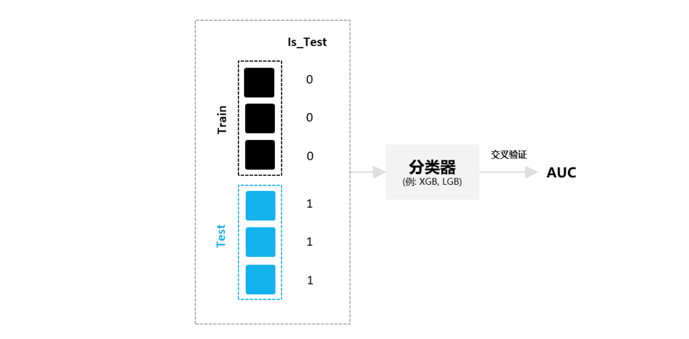
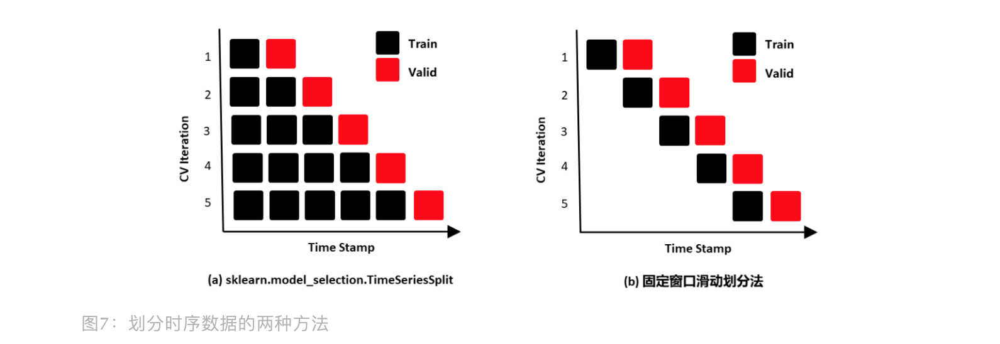

<style>
details {
    border: 1px solid #aaa;
    border-radius: 4px;
    padding: .5em .5em 0;
}
summary {
    font-weight: bold;
    margin: -.5em -.5em 0;
    padding: .5em;
}
details[open] {
    padding: .5em;
}
details[open] summary {
    border-bottom: 1px solid #aaa;
    margin-bottom: .5em;
}
</style>


<details><summary>目录</summary><p>

- [简介](#简介)
- [发生原因](#发生原因)
- [判断方法](#判断方法)
  - [核密度估计分布图](#核密度估计分布图)
  - [KS 检验](#ks-检验)
  - [对抗验证](#对抗验证)
  - [缺失值情况](#缺失值情况)
  - [类别特征分布](#类别特征分布)
    - [交集和占比情况](#交集和占比情况)
    - [KL 散度](#kl-散度)
  - [多变量数据分布不一致](#多变量数据分布不一致)
    - [多变量的衍生变量](#多变量的衍生变量)
  - [基于模型的对抗验证](#基于模型的对抗验证)
- [解决方法](#解决方法)
  - [构造合适的验证集](#构造合适的验证集)
    - [人工划分验证集](#人工划分验证集)
    - [选择和测试集最相似的样本作为验证集](#选择和测试集最相似的样本作为验证集)
    - [有权重的交叉验证](#有权重的交叉验证)
  - [删除分布不一致的特征](#删除分布不一致的特征)
  - [修正分布不一致的特征输入](#修正分布不一致的特征输入)
  - [修正分布不一致的预测输出](#修正分布不一致的预测输出)
  - [伪标签](#伪标签)
  - [其他](#其他)
- [参考](#参考)
</p></details><p></p>

# 简介

机器学习建模的一个非常重要的假设，就是要保证训练数据的分布和测试集样本的分布是相似的，亦或来自同一分布

`$$(X_{train}, Y_{train}), (X_{test}, Y_{test}) \quad \underset{\sim}{iid} \quad F(X, Y)$$`

如果测试数据的分布跟训练数据不一致，那么训练得到的模型的效果就很难知晓。
这也是数据竞赛中为什么开始就要先对训练集测试集分布的进行探索的一大重要原因

目前 90% 以上的数据竞赛都是会同时给出训练集和测试集数据，
这种情况下，如果数据的分布不一致，那么模型的预估将大打折扣。
尤其是重要特征的分布不一致的情况下，更会造成严重的线下线上不一致的情况。
该问题在 kaggle 的很多比赛中也是受到非常大关注的，
例如在 kaggle 的 PLAsTicc Astronomical Classification 竞赛中，
很多朋友发现自己模型的线下效果极好，但是线上效果却极差无比，而这其中最大的原因是什么呢？

训练集和测试集的分布不一致造成的，而且是重要特征的分布不一致造成的。
那么如何快速地定位训练集和测试集合的分布不一致呢？本文介绍几种实战中最为常用的技巧

# 发生原因

训练集和测试集分布不一致也被称作数据集偏移(Dataset Shift)。
西班牙格拉纳达大学 Francisco Herrera 教授在他 PPT 里提到数据集偏移有三种类型：

* 协变量偏移(Covariate Shift)
    - 独立变量的偏移，指训练集和测试集的输入服从不同分布，但背后是服从同一个函数关系，如下图所示
    
* 先验概率偏移(Prior Probability Shift)
    - 目标变量的偏移
* 概念偏移(Concept Shift)
    - 独立变量和目标变量之间关系的偏移

最常见的有两种原因：

* 样本选择偏差(Sample Selection Bias)
    - 训练集是通过有偏方法得到的，例如非均匀选择(Non-uniform Selection)，导致训练集无法很好表征的真实样本空间
* 环境不平稳(Non-stationary Environments)
    - 当训练集数据的采集环境跟测试集不一致时会出现该问题，一般是由于时间或空间的改变引起的

在分类任务上，有时候官方随机划分数据集，没有考虑类别平衡问题，例如: 训练集类别A数据量远多于类别 B，而测试集相反，
这类样本选择偏差问题会导致训练好的模型在测试集上鲁棒性很差，因为训练集没有很好覆盖整个样本空间。此外，除了目标变量，
输入特征也可能出现样本选择偏差问题，比如要预测泰坦尼克号乘客存活率，而训练集输入特征里“性别”下更多是男性，
而测试集里“性别”更多是女性，这样也会导致模型在测试集上表现差

聊完样本选择偏移，聊下环境不平稳带来的数据偏移，我想最常见是在时序比赛里了吧，用历史时序数据预测未来时序，
未来突发事件很可能带来时序的不稳定表现，这便带来了分布差异。环境因素不仅限于时间和空间，还有数据采集设备、标注人员等

# 判断方法

## 核密度估计分布图

> KDE，核密度估计

当我们一想到要对比训练集和测试集的分布，便是画概率密度函数直方图，但直方图看分布有两点缺陷：
受 bin 宽度影响大和不平滑，因此多数人会偏向于使用核密度估计图(Kernel Density Estimation, KDE)，
KDE 是非参数检验，用于估计分布未知的密度函数，相比于直方图，它受 bin 影响更小，绘图呈现更平滑，易于对比数据分布


这里在略微细讲下 KDE，我们先看 KDE 函数:

`$$\hat{f}_{h}(x) = \frac{1}{nh}\sum_{i=1}^{n}K(\frac{x-x_{i}}{h})$$`

其中：

* `$x_{1}, x_{2}, \ldots, x_{n}$` 是来自未知分布的样本
* `$n$` 是样本总数
* `$K(\cdot)$` 是核函数
* `$h$` 是带宽(bandwidth)

核函数定义一个用于生成 PDF(概率分布函数 Probability Distribution Function, PDF)的曲线，
不同于将值放入离散 bins 内，核函数对每个样本值都创建一个独立的概率密度曲线，然后加总这些平滑曲线，
最终得到一个平滑连续的概率分布曲线，如下图所示:


言归正传，对比训练集和测试集特征分布时，可以用 `seaborn.kdeplot()` 进行绘图可视化，样例图和代码如下:


```python
import numpy as np
import seaborn as sns
import matplotlib.pyplot as plt

# 创建样例特征
train_mean, train_cov = [0, 2], [(1, .5), (.5, 1)]
test_mean, test_cov = [0, .5], [(1, 1), (.6, 1)]
train_feat, _ = np.random.multivariate_normal(train_mean, train_cov, size=50).T
test_feat, _ = np.random.multivariate_normal(test_mean, test_cov, size=50).T

# 绘KDE对比分布
sns.kdeplot(train_feat, shade = True, color='r', label = 'train')
sns.kdeplot(test_feat, shade = True, color='b', label = 'test')
plt.xlabel('Feature')
plt.legend()
plt.show()
```

## KS 检验

KDE 是 使用 PDF 来对比，而 KS 检验是基于 CDF(累计分布函数 Cumulative Distribution Function, CDF) 来检验两个数据分布是否一致，
它也是非参数检验方法(即不知道数据分布情况)。两条不同数据集下的 CDF 曲线，它们最大垂直差值可用作描述分布差异(见下图中的 D)：


调用 `scipy.stats.ks_2samp()` 可轻松得到 KS 的统计值(最大垂直差)和假设检验下的 p 值：

```python
from scipy import stats

stats.ks_2samp(train_feat, test_feat)
```

```
KstestResult(statistic=0.2, pvalue=0.2719135601522248)
```

若 KS 统计值小且 p 值大，则我们可以接受 KS 检验的原假设 H0，即两个数据分布一致。
上面样例数据的统计值较低，p 值大于 10% 但不是很高，因此反映分布略微不一致。
注意: p值<0.01，强烈建议拒绝原假设 H0，p 值越大，越倾向于原假设 H0 成立

## 对抗验证

对抗验证是个很有趣的方法，它的思路是：构建一个分类器去分类训练集和测试集，如果模型能清楚分类，
说明训练集和测试集存在明显区别(即分布不一致)，否则反之。具体步骤如下:

1. 训练集和测试集合并，同时新增标签 `Is_Test` 去标记训练集样本为 0，测试集样本为 1
2. 构建分类器(例如 LGB, XGB 等)去训练混合后的数据集(可采用交叉验证的方式)，拟合目标标签 `Is_Test`
3. 输出交叉验证中最优的 AUC 分数。AUC 越大(越接近 1)，越说明训练集和测试集分布不一致



## 缺失值情况

有些字段在训练集中都很正常，但是在测试集合中缺失极为严重，甚至99%以上的数据都缺失了。
这种时候最简单的策略就是直接将训练集中的字段直接进行删除。这么做虽然线下的验证效果会变差，
但是线上线下的效果会变得更为稳定

## 类别特征分布

### 交集和占比情况

类别特征在许多竞赛中也是出现次数最为频繁的，而关于类别特征，
需要重点检查的就是训练集和测试集合中元素的差异。最需要检测的就是：

* 在测试集合中的类别是否在训练集合中都存在？

```python
len(set(test["feature"]) - set(train["feature"]))
```

* 在测试集中出现的类别而未在训练集中出现的比例是多少？(Overlap 的比例)

```python
len(set(test["feature"]) - set(train["feature"])) / len(set(train["feature"]))
```

* 在测试集中出现的类别而未在训练集中出现的占总类别个数的比例是多少？(Overlap 的比例)

```python
len(set(test["feature"]) - set(train["feature"])) / len(set(test["feature"]) + set(train["feature"]))
```

### KL 散度

KL 散度经常被用于衡量两个概率分布的匹配程度的指标，两个分布差异越大，KL 散度越大


## 多变量数据分布不一致

多变量不同于单变量的观察，因为多变量没法直接看出来，但还是有一些非常通用的手段，
将其划分为两大类：

* 基于衍生变量的观测探索
* 基于模型的对抗验证策略

### 多变量的衍生变量

该方法和自己做特征类似，先对特征进行演化，常采用下面的策略：

```python
train.groupby(feature)[feature2].agg(stas)
test.groupby(feature)[feature2].agg(stas)
```

然后基于演化之后的特征再进行细致的研究观察，此处可以直接使用单变量观测时候的技巧即可

## 基于模型的对抗验证

该方法是目前为止最为通用的策略，其思路也非常简单：

1. 将训练集的数据全部打标签为 1，将测试集的数据全部打标签为 0
2. 将训练集和测试集的数据合并，然后进行 N 折交叉验证
3. 如果交叉验证的 AUC 接近 0.5，那么说明训练集和测试集的分布是类似的；
   如果 AUC 非常大，例如大于 0.9，那么我们就认为训练集和测试集的分布是存在较大差异的
  
基于模型寻找分布差异最大的特征：

通过训练好的模型，可以直接输出各个模型的特征重要性，
排在最前面的特征就是造成训练集和测试集合分布不一致的重要因素。
所以很容易就找到训练集和测试集合分布差异大的特征

虽然通过模型的方式得到了各个特征的重要性，但是要注意的是，
这些特征仅仅只是训练集和测试集能分开的重要信息，
此外并不能说明太多，例如最简单的，对训练集和测试集加入 index 信息

```python
train["index"] = list(range(train.shape[0]))
test["index"] = list(range(test.shape[0]) + train.shape[0])
```

这样就可以得到 AUC=1.0 的结果，但是也会发现加入这些到模型中其实线上和线下的 gap 很多时候并不是非常大，
大家是不是好奇为什么了？明明分布差异那么大，但是却影响不大。其实这个也很容易解释，
如果该特征在真实训练的时候并不是强特征，而仅仅只是在对抗训练中是强特征，这最终的影响其实就很小了。
所以在很多时候，在遇到线上分数和线下验证分数严重不一致的时候，还需要判断模型训练中强特在对抗训练中的重要性

* 如果二者都很重要，那么大概率会出现不一致现象
* 如果在目标模型训练中是弱特征，在对抗训练中是强特，那么不一定会出现线上线下不一致的现象

所以要想真的做好这块，需要多次细心的验证

# 解决方法

## 构造合适的验证集

当出现训练集和测试集分布不一致的，我们可以试图去构建跟测试集分布近似相同的验证集，
保证线下验证跟线上测试分数不会抖动，这样我们就能得到稳定的基准。
Qiuyan918 在基于对抗验证的基础上，提出了三种构造合适的验证集的办法：

* 人工划分验证集
* 选择和测试集最相似的样本作为验证集
* 有权重的交叉验证

### 人工划分验证集

以时间序列举例，因为一般测试集也会是未来数据，所以我们也要保证训练集是历史数据，
而划分出的验证集是未来数据，不然会发生“时间穿越”的数据泄露问题，
导致模型过拟合(例如用未来预测历史数据)，这个时候就有两种验证划分方式可参考使用：

* TimeSeriesSplit：sklearn 提供的 `TimeSeriesSplit`
* 固定窗口滑动划分法：固定时间窗口，不断在数据集上滑动，获得训练集和验证集。(个人推荐这种)



除了时间序列数据，其它数据集的验证集划分都要遵循一个原则，即尽可能符合测试集的数据模式

### 选择和测试集最相似的样本作为验证集

前面在讲对抗验证时，我们有训练出一个分类器去分类训练集和测试集，
那么自然我们也能预测出训练集属于测试集的概率(即训练集在 `Is_Test` 标签下预测概率)，
我们对训练集的预测概率进行降序排列，选择概率最大的前 20% 样本划分作为验证集，
这样我们就能从原始数据集中，得到分布跟测试集接近的一个验证集了，具体样例代码详见。
之后，我们还可以评估划分好的验证集跟测试集的分布状况，评估方法：将验证集和测试集做对抗验证，
若 AUC 越小，说明划分出的验证集和测试集分布越接近(即分类器越分不清验证集和测试集)


### 有权重的交叉验证

如果我们对训练集里分布更偏向于测试集分布的样本更大的样本权重，给与测试集分布不太一致的训练集样本更小权重，
也能一定程度上帮助我们线下得到不易抖动的评估分数。

在 lightgbm 库的 `Dataset` 初始化参数中，便提供了样本加权的参数 `weight`。
对抗验证的分类器预测训练集的 `Is_Test` 概率作为权重即可

## 删除分布不一致的特征

如果我们遇到分布不一致且不太重要的特征，我们可以选择直接删去这种特征。该方法在各大比赛中十分常见。
例如: 在2018年蚂蚁金服风险大脑-支付风险识别比赛中，亚军团队根据特征在训练集和测试集上的表现，
去除分布差异较大的特征

虽然个人建议的是删除分布不一致但不太重要的特征，但有时避免不了碰到分布不一致但又很重要的特征，
这时候其实就需要自行 trade off 特征分布和特征重要性的关系了

## 修正分布不一致的特征输入

当我们对比观察训练集和测试集的 KDE 时，若发现对数据做数学运算(例如加减乘除)或对增删样本就能修正分布，
使得分布接近一致，那么我们可以试试。比如，蚂蚁金服比赛里，亚军团队发现"用户交易请求"特征在训练集中包含 0、1 和 -1，
而测试集只有 1 和 0 样本，因此他们对训练集删去了特征值为 -1 的样本，减少该特征在训练集和测试集的差异

## 修正分布不一致的预测输出

除了对输入特征进行分布检查，我们也可以检查目标特征的分布，看是否存在可修正的空间。
这种案例很少见，因为正常情况下，你看不到测试集的目标特征值。在“AI Earth”人工智能创新挑战赛里，
我们有提到官方提供两类数据集作为训练集，分别是 CMIP 模拟数据和 SODA 真实数据，然后测试集又是 SODA 真实数据，
其中前排参赛者 YueTan 就将 CMIP 和 SODA 的目标特征分布画在一起，然后发现 SODA 的值更集中，
且整体分布偏右一些，所以对用 CMIP 训练得到的预测值加了一个小的常数，修正 CMIP 下模型的预测输出，使得它分布更偏向于 SODA 分布


## 伪标签

伪标签是半监督方法，利用未标注数据加入训练，我们先看看伪标签的思路，
再讨论为什么它可能在一定程度上对分布不一致的数据集有帮助。伪标签最常见的方法是：

* 使用有标注的训练集训练模型 M
* 然后用模型 M 预测未标注的测试集
* 选取测试集中预测置信度高的样本加入训练集中
* 使用标注样本和高置信度的预测样本训练模型 M
* 预测测试集，输出预测结果

TripleLift 知乎主提供的入门版伪标签思路图如下所示，建议有兴趣的朋友阅读他原文，
他还提供了进阶版和创新版的伪标签技术，值得借鉴学习


由上图我们可以看到，模型的训练引入了部分测试集的样本，这样相当于引入了部分测试集的分布。但需要注意：

1. 相比于前面的方法，伪标签通常没有表现的很好，因为它引入的是置信度高的测试集样本，
   这些样本很可能跟训练集分布接近一致，所以才会预测概率高。因此引入的测试集分布也没有很不同，
   所以使用时常发生过拟合的情况
2. 注意引入的是高置信度样本，如果引入低置信度样本，会带来很大的噪声。
   另外，高置信度样本也不建议选取过多加入训练集，这也是为了避免模型过拟合
3. 伪标签适用于图像领域更多些，表格型比赛建议最后没办法再考虑该方法，
   因为本人使用过该方法，涨分的可能性都不是很高(也可能是我没用好)

## 其他

在写文章的时候，我查知乎发现有个问答《训练集和测试集的分布差距太大有好的处理方法吗？》下，
知乎主纳米酱提到:"特征数值差距不大，特征相关性差距也不大，但是目标数值差距过大，这个好办，
改变任务设置共同的中间目标，比如你说的目标值是否可以采取相对值，增长率，夏普等，而非绝对值"。
这种更改预测目标的方法，可能是发现更改预测目标后，新的预测目标值分布会变得相对一致，
所以才考虑该方法的。但实际中，我没碰过这种情境，但还是提出来让大家参考学习下

# 参考

* [训练集测试集分布不一致性探索](https://mp.weixin.qq.com/s?__biz=Mzk0NDE5Nzg1Ng==&mid=2247492564&idx=1&sn=269f32f313dcfad888fdb76d8cfab2cc&chksm=c32afa5bf45d734d91d16303b91385acac38b880fbf1397805fdb9684bbfb646edaacb68d12c&scene=21#wechat_redirect)
* [训练/测试集分布不一致解法总结](https://mp.weixin.qq.com/s?__biz=MzUyNzA1OTcxNg==&mid=2247486183&idx=1&sn=956c7cd2b989cf557f9e8fe6f9f9b8db&chksm=fa04148ccd739d9abf5a96bba34a00df381c7a28fda4433afff513eb06a04ab2a11ca5538421&scene=178&cur_album_id=1577157748566310916#rd)
