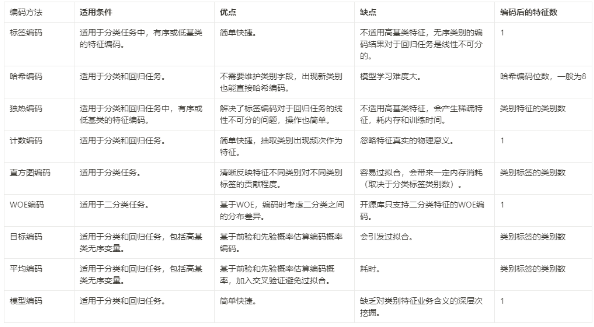
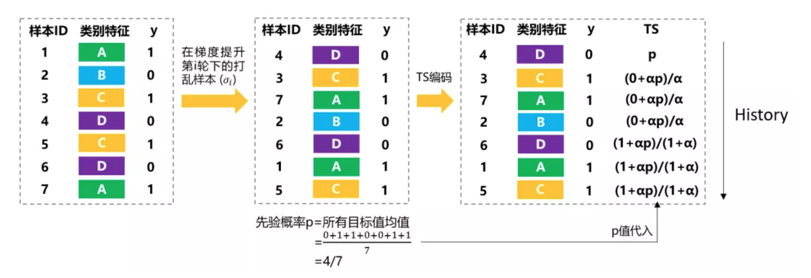

<style>
details {
    border: 1px solid #aaa;
    border-radius: 4px;
    padding: .5em .5em 0;
}
summary {
    font-weight: bold;
    margin: -.5em -.5em 0;
    padding: .5em;
}
details[open] {
    padding: .5em;
}
details[open] summary {
    border-bottom: 1px solid #aaa;
    margin-bottom: .5em;
}
</style>

<details><summary>目录</summary><p>

- [类别特征编码介绍](#类别特征编码介绍)
- [无序类别特征](#无序类别特征)
  - [标签编码](#标签编码)
    - [LabelEncoder](#labelencoder)
  - [哈希编码](#哈希编码)
    - [HashingEncoder](#hashingencoder)
  - [独热编码](#独热编码)
    - [get\_dummies](#get_dummies)
  - [计数编码](#计数编码)
    - [CountEncoder](#countencoder)
  - [直方图编码](#直方图编码)
  - [WOE 编码](#woe-编码)
  - [Target 编码](#target-编码)
    - [Leave-One-Out Mean-Target 编码](#leave-one-out-mean-target-编码)
    - [K-fold Mean-Target 编码](#k-fold-mean-target-编码)
    - [Bayesian Target 编码](#bayesian-target-编码)
  - [平均编码](#平均编码)
  - [模型编码](#模型编码)
    - [LightGBM GS 编码](#lightgbm-gs-编码)
    - [CatBoost Ordered TS 编码](#catboost-ordered-ts-编码)
- [有序类别特征](#有序类别特征)
  - [有序字典编码](#有序字典编码)
  - [序号编码](#序号编码)
  - [虚拟编码](#虚拟编码)
  - [效果编码](#效果编码)
  - [特征散列化](#特征散列化)
  - [Nonlinear PCA](#nonlinear-pca)
  - [Helmert Contrast](#helmert-contrast)
  - [Sum Contrast](#sum-contrast)
  - [Polynomial Contrast](#polynomial-contrast)
  - [Backward Difference Contrast](#backward-difference-contrast)
- [分箱计数](#分箱计数)
- [特征组合](#特征组合)
- [参考](#参考)
</p></details><p></p>

# 类别特征编码介绍

类别型特征原始输入通常是字符串形式, 除了基于决策树模型的少数模型能够直接处理字符串形式的输入, 
其他模型需要将类别型特征转换为数值型特征

在很多表格类的问题中，高基数的特征类别处理一直是一个困扰着很多人的问题，究竟哪一种操作是最好的，
很难说，不同的数据集有不同的特性，可能某一种数据转化操作这 A 数据集上取得了提升，
但在 B 数据集上就不行了，但是知道的技巧越多，我们能取得提升的概率往往也会越大。
此处我们会介绍几种常见的处理类别特征的方法。按照不同的划分标准，类别型特征可以分为：

* 按照类别是否有序
    - 无序类别特征
    - 有序类别特征
* 按照类别数量
    - 高基数类
    - 低基数类

总结来说，关于类别特征，有以下心得：



1. 统计类编码常常不适用于小样本，因为统计意义不明显
2. 当训练集和测试集分布不一致时，统计类编码往往会有预测偏移问题，所以一般会考虑结合交叉验证
3. 编码后特征数变多的编码方法，不适用于高基类的特征，会带来稀疏性和训练成本
4. 没有完美的编码方法，但感觉标签编码、平均编码、WOE 编码和模型编码比较常用

# 无序类别特征

## 标签编码

> Label Encoder 标签编码

无序的类别变量，在很多时候是以字符串形式的出现的，例如：颜色：红色，绿色，黑色...；
形状：三角形，正方形，圆形...。梯度提升树模型是无法对此类特征进行处理的，直接将其输入到模型就会报错

标签编码就是简单地赋予不同类别以不同的数字标签，属于硬编码。优点是简单直白，
网上很多说适用于有序类别型特征，不过如果是分类任务且类别不多的情况下，
LightGBM 只要指定 `categorical_feature` 也能有较好的表现。
但不建议用在高基类特征上，而且标签编码后的自然数对于回归任务来说是线性不可分的

### LabelEncoder

Python 中提供了 `sklearn.preprocessing.LabelEncoder` 编码方法，
`LabelEncoder` 可以将类型为 `object` 的变量转变为数值形式。
`LabelEncoder` 默认会先将 `object` 类型的变量进行排序，
然后按照大小顺序进行 `$0, 1, 2, \ldots, N-1$` 的编码，
此处 `$N$` 为该特征中不同变量的个数

```python
from sklearn import preprocessing

# data
df = pd.DataFrame({
    "color": ["red", "blue", "black", "green"]
})

# 编码
le = preprocessing.LabelEncoder()
df["color_labelencode"] = le.fit_transform(df["color"].values)

df
```

```
    color	color_labelencode
0	red	    3
1	blue	1
2	black	0
3	green	2
```

## 哈希编码

> Hash Encoder 哈希编码
> * Binary Encoder，二进制编码

哈希编码是使用二进制对标签编码做哈希映射。好处在于哈希编码器不需要维持类别字典，
若后续出现训练集未出现的类别，哈希编码也能适用。但按位分开哈希编码，模型学习相对比较困难

> 二进制编码主要分为两步，先用序号编码给每个类别赋予一个类别 ID， 
  然后将类别 ID 对应的二进制编码作为结果 
> 二进制编码本质上是利用二进制对 ID 进行哈希映射，最终得到 0/1 特征向量， 
  且维数少于 One-Hot Encoding, 节省了存储空间

### HashingEncoder

```python
# !pip install category_encoders

import category_encoders as ce

# data
df = pd.DataFrame({
    'gender': [2, 1, 1]
})

# hash encoder
ce_encoder = ce.HashingEncoder(cols = ['gender']).fit(df)
x_trans = ce_encoder.transform(df)

x_trans
```

```
col_0  col_1  col_2  col_3  col_4  col_5  col_6  col_7
0      0      0      0      0      1      0      0      0
1      0      0      0      1      0      0      0      0
2      0      0      0      1      0      0      0      0
```

## 独热编码

> One-Hot Encoding，独热编码

独热编码采用 N 位状态寄存器来对 N 个状态进行编码，简单来说就是利用 0 和 1 表示类别状态对每个类别使用二进制编码，
它转换后的变量叫哑变量（dummy variables），其中 1 代表某个输入属于该类别，以表示特定行是否属于该类别

* 缺点：它处理不好高基数特征，基类越大会带来过很多列的稀疏特征，消耗内存和训练时间
* 优点：
    - 独热编码能很好解决标签编码对于回归任务中线性不可分的问题
    - 很多时候对高基数的类别特征直接进行 One-Hot 编码的效果往往可能不如直接 `LabelEncoder` 来的好。
      但是当我们的类别变量中有一些变量是人为构造的，加入了很多噪音，这个时候将其展开，
      那么模型可以更加快的找到那些非构建的类别

### get_dummies

```python
from sklearn import preprocessing

df = pd.DataFrame({
    "color": ["red", "blue", "black", "green"]
})

# 编码
x_dummies = pd.get_dummies(df["color"].values)
```

## 计数编码

> * Count Encoder，计数编码
> * Frequency Encoder， 频次编码

计数编码通过计算特征变量中每个值的出现次数来表示该特征的信息。
频度统计对于低频具有归一化作用，能够使类别特征中低频的特征数据的共性被挖掘出来

计数编码也叫频次编码。就是用分类特征下不同类别的样本数去编码类别。
清晰地反映了类别在数据集中的出现次数，缺点是忽略类别的物理意义，
比如说两个类别出现频次相当，但是在业务意义上，模型的重要性也许不一样

计数编码是数据竞赛中使用最为广泛的技术，在 90% 以上的数据建模的问题中都可以带来提升。
因为在很多的时候，频率的信息与我们的目标变量往往存在有一定关联，例如：

* 在音乐推荐问题中，对于乐曲进行计数编码可以反映该乐曲的热度，而热度高的乐曲往往更受大家的欢迎
* 在购物推荐问题中，对于商品进行计数编码可以反映该商品的热度，而热度高的商品大家也更乐于购买
* 微软设备被攻击概率问题中，预测设备受攻击的概率，那么设备安装的软件是非常重要的信息，
  此时安装软件的计数编码可以反映该软件的流行度，越流行的产品的受众越多，
  那么黑客往往会倾向对此类产品进行攻击，这样黑客往往可以获得更多的利益

### CountEncoder

示例 1:

```python
import pandas as pd

# data
df = pd.DataFrame({
    '区域' : ['西安', '太原', '西安', '太原', '郑州', '太原'], 
    '10月份销售' : [
        '0.477468', '0.195046', '0.015964', 
        '0.259654', '0.856412', '0.259644'
    ],
    '9月份销售' : [
        '0.347705', '0.151220', '0.895599', 
        '0236547', '0.569841', '0.254784'
    ]
})

# 统计
df_counts = df['区域'].value_counts().reset_index()
df_counts.columns = ['区域', '区域频度统计']
print(df_count)
```

```
   区域  区域频度统计
0  太原       3
1  西安       2
2  郑州       1
```

```python
df = df.merge(df_counts, on = ['区域'], how = 'left')
print(df)
```

```
   区域    10月份销售     9月份销售  区域频度统计
0  西安  0.477468  0.347705       2
1  太原  0.195046  0.151220       3
2  西安  0.015964  0.895599       2
3  太原  0.259654   0236547       3
4  郑州  0.856412  0.569841       1
5  太原  0.259644  0.254784       3
```

示例 2：

```python
df = pd.DataFrame({
    'color': [
        'red', 'red', 'red', 'blue', 'blue', 
        'black', 'green', 'green', 'green'
    ]
})
df['color_cnt'] = df['color'].map(df['color'].value_counts())
df
```

```
    color	color_cnt
0   red	    3
1   red	    3
2   red	    3
3   blue    2
4   blue    2
5   black   1
6   green   3
7   green   3
8   green   3
```

示例 3：

```python
import pandas as pd
import category_encoders as ce

# data
df = pd.DataFrame({
    "cat_feat": ["A", "B", "B", "A", "B", "A"]
})

# encoder
count_encoder = ce.count.CountEncoder(cols = ["cat_feat"]).fit(df)
df_trans = count_encoder.transform(df)
df_trans
```

## 直方图编码

> Bin Encoder：直方图编码

## WOE 编码

> Weight of Evidence：证据权重

证据权重(Weight of Evidence, 简称 WoE)是另一种关于分类自变量和因变量之间关系的方案. 
WoE 源自信用评分领域, 曾用于区分用户是违约拖欠还是已经偿还贷款. 
证据权重的数学定义是优势比的自然对数, 即: 

`$$ln (% of non events / % of events)$$`

WoE 越高, 事件发生的可能性就越大. 「Non-events」是不属于某个类的百分比.
使用证据权重与因变量建立单调关系, 并在逻辑尺度上确保类别, 这对于逻辑回归来说很自然. 
WoE 是另一个衡量指标「Information Value」的关键组成部分. 
该指标用来衡量特征如何为预测提供信息. 

这些方法都是有监督编码器, 或者是考虑目标变量的编码方法, 
因此在预测任务中通常是更有效的编码器. 
但是, 当需要执行无监督分析时, 这些方法并不一定适用. 


## Target 编码

> 目标编码

Target 编码是 2006 年提出的一种结合标签进行编码的技术，它将类别特征替换为从标签衍生而来的特征，
这可以更直接地表示分类变量和目标变量之间的关系，在类别特征为高基数的时候非常有效。
该技术在非常多的数据竞赛中都取得了非常好的效果，但特别需要注意过拟合的问题。
在 kaggle 竞赛中成功的案例有 owen zhang 的 Leave-One-Out Mean-Target 编码，
和莫斯科 GM 的基于 K-fold 的 Mean-Target 编码


但这种编码方法也有一些缺点：

* 首先, 它使模型更难学习均值编码变量和另一个变量之间的关系, 仅基于列与目标的关系就在列中绘制相似性
* 而最主要的是，这种编码方法对目标变量非常敏感，这会影响模型提取编码信息的能力

由于该类别的每个值都被相同的数值替换，因此模型可能会过拟合其见过的编码值(例如将 0.8 与完全不同的值相关联, 而不是 0.79)，
这是把连续尺度上的值视为严重重复的类的结果。因此，需要仔细监控 y 变量，以防出现异常值。要实现这个目的，
就要使用 `category_encoders` 库。由于目标编码器是一种有监督方法，所以它同时需要 X 和 y 训练集 

### Leave-One-Out Mean-Target 编码

Leave-One-Out Mean-Target 编码的思路相对简单，每次编码时，不考虑当前样本的情况，
用其它样本对应的标签的均值作为编码，而测试集则用全部训练集样本的均值进行编码，案例如下：


| Split | UserID | Y | Mean(Y)       |
|-------|--------|---|---------------|
| Train | A1     | 0 | 2 / 3 = 0.667 |
| Train | A1     | 1 | 1 / 3 = 0.333 |
| Train | A1     | 1 | 1 / 3 = 0.333 |
| Train | A1     | 0 | 2 / 3 = 0.667 |
| Test  | A1     | - | 2 / 4 = 0.5   |
| Test  | A1     | - | 2 / 4 = 0.5   |
| Test  | A2     | 0 | ...           |
| ...   | ..     | . | ...           |

```python
import pandas as pd
from sklearn import preprocessing
from category_encoders.leave_one_out import LeaveOneOutEncoder as looe

# train and test data
df_train = pd.DataFrame({
    "color": [
        "red", "red", "red", "red", 
        "red", "red", "black", "black"
    ],
    'label': [1, 0, 1, 1, 0, 1, 1, 0]
})
df_test = pd.DataFrame({
    "color": ["red", "red", "black"]
})

# leave one out mean-target encoder
loo = LeaveOneOutEncoder()
loo.fit_transform(df_train["color"], df_train["label"])
loo.transform(df_test["color"])
```

```
    color
0	0.6
1	0.8
2	0.6
3	0.6
4	0.8
5	0.6
6	0.0
7	1.0


    color
0	0.666667
1	0.666667
2	0.500000
```

### K-fold Mean-Target 编码

K-fold Mean-Target 编码的基本思想来源于 Mean Target 编码。
K-fold Mean-Target 编码的训练步骤如下：

1. 先将训练集划分为 K 折
2. 在对第 A 折的样本进行编码时，删除 K 折中 A 折，并用剩余的数据计算如下公式

`$$Mean_A = mean(Y)$$`

3. 然后利用上面计算得到的值对第 A 折进行编码
4. 最后，依次对所有折进行编码即可

首先我们先理解一下上面的公式，最原始的 Mean-target 编码是非常容易导致过拟合的，
这其中过拟合的最大的原因之一在于对于一些特征列中出现次数很少的值过拟合了，
比如某些值只有 1 个或者 2 到 3 个，但是这些样本对应的标签全部是 1，怎么办，
他们的编码值就应该是 1，但是很明显这些值的统计意义不大，大家可以通过伯努利分布去计算概率来理解。
而如果我们直接给他们编码了，就会误导模型的学习。那么我们该怎么办呢？老办法，加正则！

于是我们就有了上面的计算式子，式子是值出现的次数，是它对应的概率，是全局的均值，
那么当为 0 同时比较小的时候， 就会有大概率出现过拟合的现象，此时我们调大就可以缓解这一点，
所以很多时候都需要不断地去调整的值

```python
from sklearn import base
from category_encoders.target_encoder import TargetEncoder
from sklearn.model_selection import KFold

# data
df = pd.DataFrame({
    'Feature': [
        'A', 'B', 'B', 'B', 'B', 'A', 'B', 
        'A', 'A', 'B', 'A', 'A', 'B', 'A',
        'A', 'B', 'B', 'B', 'A', 'A'],
    'Target': [
        1, 0, 0, 1, 1, 1, 0, 
        0, 0, 0, 1, 0, 1, 0, 
        1, 0, 0, 0, 1, 1
    ]
})


class KFoldTargetEncoderTrain(base.BaseEstimator, base.TransformerMixin):

    def __init__(self, colnames, targetName, n_fold = 5, verbosity = True, discardOriginal_col = False):
        self.colnames = colnames
        self.targetName = targetName
        self.n_fold = n_fold
        self.verbosity = verbosity
        self.discardOriginal_col = discardOriginal_col

    def fit(self, X, y = None):
        return self

    def transform(self, X):
        assert(type(self.targetName) == str)
        assert(type(self.colnames) == str)
        assert(self.colnames in X.columns)
        assert(self.targetName in X.columns)

        mean_of_target = X[self.targetName].mean()
        kf = KFold(n_splits = self.n_fold, shuffle = False, random_state = 2019)

        col_mean_name = self.colnames + '_' + 'Kfold_Target_Enc'
        X[col_mean_name] = np.nan

        for tr_ind, val_ind in kf.split(X):
            X_tr, X_val = X.iloc[tr_ind], X.iloc[val_ind] 
            X.loc[X.index[val_ind], col_mean_name] = X_val[self.colnames].map(
                X_tr.groupby(self.colnames)[self.targetName].mean()
            )

        X[col_mean_name].fillna(mean_of_target, inplace = True)

        if self.verbosity:
            encoded_feature = X[col_mean_name].values
            print('Correlation between the new feature, {} and, {} is {}.'.format(
                col_mean_name,
                self.targetName,
                np.corrcoef(X[self.targetName].values, encoded_feature)[0][1]
            ))

        if self.discardOriginal_col:
            X = X.drop(self.targetName, axis = 1)
            
        return X
    

class KFoldTargetEncoderTest(base.BaseEstimator, base.TransformerMixin):
    
    def __init__(self, train, colNames, encodedName):
        self.train = train
        self.colNames = colNames
        self.encodedName = encodedName
        
    def fit(self, X, y = None):
        return self

    def transform(self, X):
        mean = self.train[[self.colNames,self.encodedName]].groupby(self.colNames).mean().reset_index() 
        dd = {}
        for index, row in mean.iterrows():
            dd[row[self.colNames]] = row[self.encodedName]
        
        X[self.encodedName] = X[self.colNames]
        X = X.replace({self.encodedName: dd})

        return X
```

训练集编码：

```python
targetc   = KFoldTargetEncoderTrain('Feature','Target',n_fold=5)
new_train = targetc.fit_transform(df)
new_train
```

```
    Feature	Target	Feature_Kfold_Target_Enc
0   A       1       0.555556
1   B       0       0.285714
2   B       0       0.285714
3   B       1       0.285714
4   B       1       0.250000
5   A       1       0.625000
6   B       0       0.250000
7   A       0       0.625000
8   A       0       0.714286
9   B       0       0.333333
10  A       1       0.714286
11  A       0       0.714286
12  B       1       0.250000
13  A       0       0.625000
14  A       1       0.625000
15  B       0       0.250000
16  B       0       0.375000
17  B       0       0.375000
18  A       1       0.500000
19  A       1       0.500000
```

测试集编码：

```python
test_targetc = KFoldTargetEncoderTest(
    new_train, 
    'Feature', 
    'Feature_Kfold_Target_Enc'
)
new_test = test_targetc.fit_transform(test)
```

### Bayesian Target 编码

> 贝叶斯目标编码 Bayesian Target Encoding

贝叶斯目标编码(Bayesian Target Encoding)是一种使用目标作为编码方法的数学方法. 
仅使用均值可能是一种欺骗性度量标准, 因此贝叶斯目标编码试图结合目标变量分布的其他统计度量. 
例如其方差或偏度(称为高阶矩「higher moments」). 然后通过贝叶斯模型合并这些分布的属性, 
从而产生一种编码, 该编码更清楚类别目标分布的各个方面, 但是结果的可解释性比较差

## 平均编码

> Mean Encoder：平均编码

平均编码是基于目标编码的改进版。它的 2 点改动如下：

1. 权重公式：其实没有本质上的区别，可自行修改函数内的参数
2. 由于目标编码使用了标签，为了缓解编码带来模型过拟合问题，平均编码加入了 K-fold 编码思路，
   若分为 5 折，则用 1-4 折先 fit 后，再 transform 第 5 折，依次类推，将类别特征分 5 次编码出来。
   坏处是耗时

## 模型编码

目前 GBDT 模型中，只有 LightGBM 和 CatBoost 自带类别编码

### LightGBM GS 编码

LightGBM 的类别编码采用的是 GS(Gradient Statistics)编码。
主要思路是将类别特征转为累积值 `$\frac{sum(gradient)}{hessian}$` (一阶偏导数之和/二阶偏导数之和)再进行直方图特征排序。
使用起来也很简单，定义 LightGBM 数据集时，指定 `categorical_feature` 即可

据官方文档介绍，LightGBM 的 GS 编码比独热编码快大概 8 倍速度。而且文档里也建议，
当类别变量为高基类时，哪怕是简单忽略类别含义或把它嵌入到低维数值空间里，
只要将特征转为数值型，一般会表现的比较好。就个人使用来讲，我一般会对无序类别型变量进行模型编码，
有序类别型变量直接按顺序标签编码即可

虽然 LightGBM 用 GS 编码类别特征看起来挺厉害的，但是存在两个问题：

* 计算时间长：因为每轮都要为每个类别值进行 GS 计算
* 内存消耗大：对于每次分裂，都存储给定类别特征下，它不同样本划分到不同叶节点的索引信息

### CatBoost Ordered TS 编码

CatBoost 使用 Ordered TS 编码，既利用了 TS 省空间和速度的优势，也使用 Ordered 的方式缓解预测偏移问题



# 有序类别特征

有序类别特征，故名思意，就是有相对顺序的类别特征。例如：

* 年龄段特征："1-10, 11-20, 21-30, 31-40" 等年龄段
* 评分特征："high, medium, low"

有序类别特征和无序的类别特征有些许区别，例如：标签编码等，
如果我们直接按照原先的标签编码进行转化就会丢失特征相对大小的信息，
这对于梯度提升树模型会带来负向的效果，因为序列信息可能和标签有着强烈的相关性，
比如回购的问题，有 “high, medium, low” 三种评分，用户购物之后如果给商品打了 “high“，
那么他大概率还会回购，但是如果打了 “low”，那么大概率是不会回购了，
传统的标签编码就直接丢失了这种信息，那么相较于无序类别特征的编码，有哪些变化呢？

* 标签编码 -> 字典编码
* 独热编码 -> ~~很少不用~~
* 计数编码、Target 编码、WOE 编码、人工编码使用方式不变

## 有序字典编码


## 序号编码

> Ordinal Encoding

序号编码通常用于处理类别间具有大小关系的特征, 序号编码会按照大小关系对类别型特征赋予一个数值 ID

## 虚拟编码

* 虚拟编码在进行表示时只使用 k-1 个自由度, 除去了额外的自由度, 
  没有被使用的那个特征通过一个全零向量表示, 它称为参照类
* 使用虚拟编码的模型结果比使用 One-Hot Encoding 的模型结果更具解释性
* 虚拟编码的缺点是不太容易处理缺失数据, 因为全零向量已经映射为参照类了

## 效果编码

* 效果编码与虚拟编码非常相似, 区别在于参照类是用全部由 -1 组成的向量表示的
* 效果编码的优点是全由-1组成的向量是个密集向量, 计算和存储的成本都比较高

## 特征散列化

散列函数是一种确定性函数, 它可以将一个可能无界的整数映射到一个有限的整数范围 `$\[1, m\]$` 中, 
因为输入域可能大于输出范围, 所以可能有多个值被映射为同样的输出, 这称为碰撞

均匀散列函数可以确保将大致相同数量的数值映射到 m 个分箱中

* 如果模型中涉及特征向量和系数的内积运算, 那么就可以使用特征散列化
* 特征散列化的一个缺点是散列后的特征失去了可解释性, 只是初始特征的某种聚合

## Nonlinear PCA

非线性 PCA(Nonlinear PCA)是一种使用分类量化来处理分类变量的主成分分析(PCA)方法。
它会找到对类别来说的最佳数值，从而使常规 PCA 的性能(可解释方差)最大化 

## Helmert Contrast

## Sum Contrast

## Polynomial Contrast

## Backward Difference Contrast

# 分箱计数

# 特征组合

为了提高复杂关系的拟合能力，在特征工程中经常把一阶离散特征两两组合，构成高阶组合特征。
并不是所有的特征组合都有意义，可以使用基于决策树的特征组合方法寻找组合特征，
决策树中每一条从根节点到叶节点的路径都可以看成是一种特征组合的方式

# 参考

* [频度统计](https://mp.weixin.qq.com/s/yQoaia_jJQsIdBGIe78PQw)
* [类别型特征的编码方法总结](https://mp.weixin.qq.com/s/emw05TSwjd-szqgirbpk9A)
* [特征工程--类别特征篇](https://mp.weixin.qq.com/s?__biz=Mzk0NDE5Nzg1Ng==&mid=2247494138&idx=1&sn=633fe6f67187f3cb46c9ff36a2108417&chksm=c32af075f45d7963858cf135e9f0f5065e0a48ad6b193aac682801b39be28757b099d09089ee&cur_album_id=1701045138849906691&scene=189#wechat_redirect)
* [K-Fold Target Encoding](https://medium.com/@pouryaayria/k-fold-target-encoding-dfe9a594874b)

