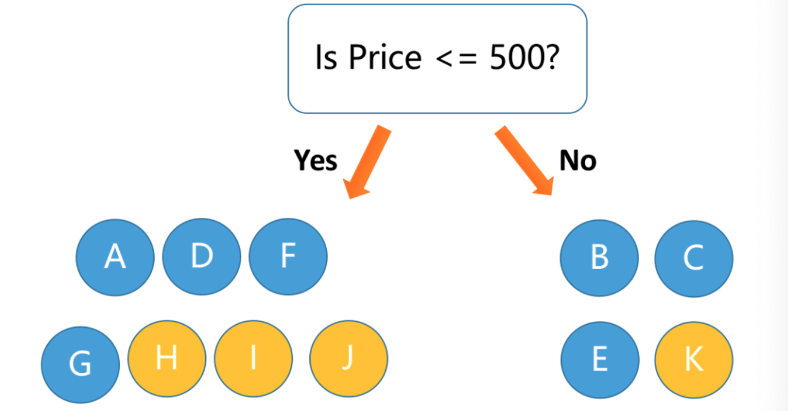

<style>
details {
    border: 1px solid #aaa;
    border-radius: 4px;
    padding: .5em .5em 0;
}
summary {
    font-weight: bold;
    margin: -.5em -.5em 0;
    padding: .5em;
}
details[open] {
    padding: .5em;
}
details[open] summary {
    border-bottom: 1px solid #aaa;
    margin-bottom: .5em;
}
img {
    pointer-events: none;
}
</style>

<details><summary>目录</summary><p>

- [特征缩放](#特征缩放)
  - [标准化](#标准化)
  - [非线性转换](#非线性转换)
  - [归一化](#归一化)
  - [最大最小化](#最大最小化)
  - [Max-Abs Scaling](#max-abs-scaling)
  - [稳健缩放](#稳健缩放)
- [特征变换](#特征变换)
  - [均匀分布](#均匀分布)
    - [API](#api)
  - [指数变换](#指数变换)
    - [指数变换](#指数变换-1)
    - [一般指数变换](#一般指数变换)
    - [对数变换](#对数变换)
    - [平方根变换](#平方根变换)
  - [Yeo-Johnson 转换](#yeo-johnson-转换)
    - [API](#api-1)
  - [Box-Cox 转换](#box-cox-转换)
    - [API](#api-2)
  - [反余切变换](#反余切变换)
  - [双曲正切变换](#双曲正切变换)
  - [傅里叶变换](#傅里叶变换)
  - [高斯变换](#高斯变换)
  - [偏度校正变换](#偏度校正变换)
  - [特征组合变换](#特征组合变换)
  - [基于核的特征变换](#基于核的特征变换)
- [特征离散化](#特征离散化)
  - [特征离散化介绍](#特征离散化介绍)
  - [特征离散化的好处](#特征离散化的好处)
  - [等宽离散化](#等宽离散化)
  - [等频离散化](#等频离散化)
  - [基于聚类的离散化](#基于聚类的离散化)
  - [基于决策树的离散化](#基于决策树的离散化)
  - [自适应离散化](#自适应离散化)
  - [基于二值化的离散化](#基于二值化的离散化)
  - [基于核密度估计的离散化](#基于核密度估计的离散化)
  - [基于多项式拟合的离散化](#基于多项式拟合的离散化)
  - [计数特征分箱](#计数特征分箱)
    - [固定宽度分箱](#固定宽度分箱)
    - [分位数分箱](#分位数分箱)
- [特征编码](#特征编码)
  - [小数点后的数值](#小数点后的数值)
  - [特殊数字](#特殊数字)
  - [数值符号](#数值符号)
- [树模型特征工程](#树模型特征工程)
  - [树模型数据吸收方式](#树模型数据吸收方式)
  - [树模型特征工程](#树模型特征工程-1)
    - [高基数类别数据](#高基数类别数据)
    - [交叉信息挖掘](#交叉信息挖掘)
    - [局部上下文信息特征](#局部上下文信息特征)
- [参考](#参考)
</p></details><p></p>


通过特征提取，能得到未经处理的特征，这时的特征可能有以下问题：

* 特征尺度
    - 异常值
    - 不属于同一量纲
        - 即特征的规格不一样，不能够放在一起比较。无量纲化可以解决这一问题
        - 常见的无量纲化方法有标准化和区间缩放法。标准化的前提是特征值服从正态分布，
          标准化后，其转换成标准正态分布。区间缩放法利用了边界值信息，
          将特征的取值区间缩放到某个特点的范围
* 信息冗余
    - 对于某些定量特征，其包含的有效信息为区间划分，例如学习成绩，
      假若只关心“及格”或不“及格”，那么需要将定量的考分，
      转换成 “1” 和 “0” 表示及格和未及格。二值化可以解决这一问题
* 定性特征不能直接使用
    - 某些机器学习算法和模型只能接受定量特征的输入，那么需要将定性特征转换为定量特征。
      最简单的方式是为每一种定性值指定一个定量值，但是这种方式过于灵活，增加了调参的工作
* 存在缺失值
    - 缺失值需要补充
* 信息利用率低：
    - 不同的机器学习算法和模型对数据中信息的利用是不同的，在线性模型中，
      使用对定性特征哑编码可以达到非线性的效果。类似地，对定量变量多项式化，
      或者进行其他的转换，都能达到非线性的效果
* 特征分布
    - 偏态分布

# 特征缩放

> 特征缩放也叫规范化、或正规化，即：Normalizaiton

特征缩放是指将输入特征按比例缩放到一个合适的范围内，以便更好地训练模型。
特征缩放总是将特征除以一个常数(缩放常数)，因此不会改变单特征的分布，
只有数据尺度发生了变化。特征缩放应该仅仅用于特征值，而不是标签值，
因为标签值通常是我们需要预测的值，而规范化可能会改变标签的含义

对数值型特征的特征做缩放可以将特征都统一到一个大致相同的数值区间内，带来的好处有：

* 避免模型受到特征值的量级差异影响
* 可以提高模型的收敛速度、精度、稳定性

通常特征缩放包含以下技术：

* 标准化(Standardization)和中心化(Centeration)：将特征缩放到均值为 0，标准差为 1 的分布中。
  标准化适用于特征值呈正态分布的情况
* 归一化(Normalization)：将特征缩放到 `[0,1]` 的范围内。归一化适用于特征值的分布不受限制的情况
* 最大最小化(Min-Max Scaling)：将特征缩放到一个最小值和最大值之间。最大最小化适用于特征值的分布受限于一定范围内的情况
* Max-Abs Scaling：
* 对数缩放(Log Scaling)：将特征取对数，使其符合正态分布，从而实现标准化
* 非线性规范化(Non-linear Normalization)：通过某些函数转换特征，例如对数转换、平方根转换等
* 小数定标归一化(Decimal Scaling Normalization)：通过将所有特征除以一个常数值，将特征缩放到[-1,1]范围内。常数值通常是特征值中的最大值

什么样的特征需要特征缩放：

* 当一组输入特征的尺度相差很大，并且模型对于特征的尺度很敏感，
  就需要进行特征缩放，从而消除数据特征之间量纲的影响，
  使得不同的特征之间具有可比性
    - 如果模型是输入特征的平滑函数，那么模型对输入的的尺度是非常敏感的
* 通过梯度下降法求解的模型通常需要进行特征缩放
    - 线性回归
    - 逻辑回归
    - 支持向量机
    - 应用正则化方法的模型
    - 神经网络
* 使用欧式距离的方法，比如：k-means 聚类、最近邻方法、径向基核函数，
  通常需要对特征进行标准化，以便将输出控制在期望的范围内

## 标准化

> Standard Scaling，标准化也称为方差缩放、零均值归一化、Z-Score Normalization

标准化和中心化是常用的特征工程技术，它们可以对数据进行预处理，
使得机器学习算法更容易处理数据，并且提高算法的性能和效果

标准化（Normalization）是一种将数据缩放到相同范围的技术，它通常是将特征缩放到均值为 0，
标准差为 1 的标准正态分布中。标准化可以使用 z-score 公式完成：

`$$ x' = \frac{x - \mu}{\sigma} $$`

其中：

* `$x$` 表示原始数据
* `$\mu$` 表示该特征的均值
* `$\sigma$` 表示该特征的标准差
* `$x'$` 表示标准化后的数据

标准化的好处是可以去除不同特征间的量纲差异，
避免某个特征在模型中占据主导地位，从而提高模型的准确性

中心化（Centering）是一种将数据移到以 0 为中心的技术，
它通常是将每个特征向量的均值减去该特征的均值。中心化可以使用以下公式完成：

`$$ x' = x - \mu $$`

其中

* `$x$` 表示原始数据
* `$\mu$` 表示该特征的均值
* `$x'$` 表示中心化后的数据

中心化的好处是可以使得特征矩阵的行之间不再存在偏差，因此提高了算法的鲁棒性和可靠性


```python
from sklearn.preprocessing import StandardScaler

ss = StandardScaler(with_mean = True, with_std = True)
featureScaled = ss.fit_transform(feature)
```

## 非线性转换


## 归一化

> L1 或 L2 归一化

简单来说，标准化是依照特征矩阵的列处理数据，其通过求 z-score 的方法，将样本的特征值转换到同一量纲下。
归一化是依照特征矩阵的行处理数据，其目的在于样本向量在点乘运算或其他核函数计算相似性时，拥有统一的标准，
也就是说都转化为“单位向量”。归一化就是将特征除以一个归一化常数, 比如: `$l2$`, `$l1$` 范数,
使得特征的范数为为常数

规则为 L1 的归一化公式如下：

`$$y = \frac{x}{\sum_{i}^{M}|x_{i}|}$$`

规则为 L2 的归一化公式如下：

`$$y = \frac{x}{\sqrt{\sum_{i}^{M}x_{i}^{2}}}$$`


```python
from sklearn.preprocessing import Normalize

norm = Normalizer()
df_norm = norm.fit_transform(df)
```

## 最大最小化

> Min-Max Scaling

Min-Max Scaling 将特征缩放到一个最小值和最大值之间。最大最小化适用于特征值的分布受限于一定范围内的情况。
通过对原始特征进行线性变换, 将特征值压缩(或扩展)到 `$[0, 1]$` 区间中, 
实现对原始特征的等比缩放。特征中所有观测值的和为 1

`$$x_{transformed} = \frac{x - min(x)}{max(x) - min(x)}$$`

```python
from sklearn.preprocessing import MinMaxScaler

mms = MinMaxScaler()
featureScaled = mms.fit_transform(feature)
```

## Max-Abs Scaling

Max-Abs Scaling 是一种常用的机器学习中的特征缩放（Feature Scaling）技术之一，
它可以将数据按照特定的比例缩放到指定的范围内，以便于机器学习算法更好地处理数据

Max-Abs Scaling 的原理很简单，就是通过对每个特征的数值除以该特征中的最大值（取绝对值后的最大值），
从而将特征缩放到 `$[-1,1]$` 的范围内。具体来说，对于一个特征向量 `$X=(x_1,x_2,...,x_n)$`，
假设它的最大值为 `$max(|X|)$`，则经过 Max-Abs Scaling 后的特征向量 `$X'$` 为：

`$$ X'_i = \frac{X_i}{max(|X|)} $$`

其中

* `$X_i$` 表示原特征向量 `$X$` 中的第 `$i$` 个元素
* `$X'_i$` 表示经过 Max-Abs Scaling 后的特征向量中的第 `$i$` 个元素

相比于其他特征缩放技术，Max-Abs Scaling 的优势在于，它能够保持特征向量中每个特征的相对大小关系，
并且不会对数据分布造成影响，因此适用于不同特征取值范围较大的情况，如图像处理和自然语言处理等领域。
在使用机器学习算法之前，对数据进行 Max-Abs Scaling 可以提高模型的性能和鲁棒性

```python
from sklearn.preprocessing import MaxAbsScaler

mas = MaxAbsScaler()
featureScaled = mas.fit_transform(feature)
```

## 稳健缩放

对于包含异常值的特征, 标准化的效果不好, 可以使用稳健的特征缩放技术对特征进行缩放


```python
from sklearn.preprocessing import RobustScaler

rs = RobustScaler(
    with_centering = True,
    with_scaling = True,
    quantile_range = (25.0, 75.0),
    copy = True
)
transform_data = rs.fit_transform(data)
```

<p align='right'><a href='#top'><返回顶端></a></p>

# 特征变换

## 均匀分布

将特征转换为 `$[0, 1]$` 区间的均匀分布

### API

```python
from sklearn.preprocessing import QuantileTransformer

qt = QuantileTransformer(random_state = 0)
featureScaled = qt.fit_transform()
```

## 指数变换

### 指数变换

指数变换是一种常用的数据预处理技术，其基本思想是对原始数据进行指数运算，
以改变原始数据的分布形态，使其更适合应用于机器学习算法

指数变换是一种将数据值提高到某个指数的变换方法，常用于处理正数数据。
指数变换是个变换族, 对数变换只是指数变换的一个特例, 它们都是方差稳定变换。
指数变换可以改变变量的分布, 使得方差不再依赖于均值。
平方根变换和对数变换都可以简单地推广为 Box-Cox 变换

在指数变换中，常用的函数包括自然指数函数 `$e^{x}$` 和自然对数函数 `$\log(x)$`。
指数变换的一般形式为：

`$$y = f(x)$$`

其中：

* `$f$` 表示指数变换函数，可以是 `$\exp$` 函数或 `$\log$` 函数。
  在不同的情况下，可以采用不同的指数变换函数来达到更好的效果

常用的指数变换：

* 一般指数变换
* 对数变换
* 平方根变换
* Box-Cox 变换

指数变换在机器学习中的应用十分广泛，主要有以下几个方面：

* 数据平滑：指数变换可以将具有噪声或震荡的数据变得更加平滑，有助于提高模型的精度和稳定性
* 线性化：指数变换可以将具有指数增长或指数下降趋势的数据变成线性关系，有利于进行回归或分类建模
* 数据缩放：指数变换可以将数据缩放到一个合适的范围内，防止出现过拟合或欠拟合的情况
* 分布转换：指数变换可以改变数据的分布形态，使其更符合模型假设或更容易进行建模。
  例如，对于正态分布的数据可以采用 `$\log$` 变换，将其变成服从均匀分布的数据

需要注意的是，指数变换也存在一些局限性，例如：

* 数据分布不均衡：对于极度不均衡的数据分布，指数变换可能会失效，因为变换后的数据仍然保持不均衡的性质
* 数据取值范围：在进行指数变换时，需要注意数据的取值范围，避免出现负数或无穷大的情况
* 模型选择：不同的机器学习算法对指数变换的敏感程度不同，需要根据具体情况进行选择和优化

### 一般指数变换

在指数变换中，常用的函数包括自然指数函数 `$e^{x}$`：

`$$y = e^{x}$$`

```python
from numpy as np
from sklearn.preprocessing import FunctionTransformer

# 基于单变元函数的数据变换可以使用一个统一的方式完成
# 使用 preproccessing 库的 FunctionTransformer 对数据进行对数函数转换的代码如下
FunctionTransformer(exp).fit_transform(iris.data)
```

### 对数变换

对数变换可以将原始数据中的大数值压缩到一个更小的范围内，对小数值的范围进行扩展。
并使得数据更加符合正态分布，以便更好地进行建模和分析。
对数变换通常用于处理数据中包含的大量非负实数，如收入、房价等。
对于具有重尾分布的正数值的处理, 对数变换是一个非常强大的工具

* 与正态分布相比, 重尾分布的概率质量更多地位于尾部
* 对数变换压缩了分布高端的尾部, 使之成为较短的尾部, 并将低端扩展为更长的头部, 即: 经过对数变换后, 
  直方图在重尾的集中趋势被减弱了, 在 `$x$` 轴上的分布更均匀了一些

> * `$log_{a}x$`:
>      - 将 `$(0, 1)$` 这个小区间中的数映射到包含全部负数的区间: `$(-\infty, 0)$`
> * `$log_{10}x$`:
>     - 将 `$[0, 10]$` 这个区间中的数映射到 `$[0, 1]$`
>     - 将 `$[10, 100]$` 这个区间中的数映射到 `$[1, 2]$`
>     - ...

对数变换的公式如下：

`$$y = \log_{10}(x + 1)$$`

其中：

* `$x$` 是原始数据
* `$y$` 是变换后的数据

APIs:

```python
from numpy as np

np.log1p(x)
np.log10(x + 1)


from sklearn.preprocessing import FunctionTransformer

# 基于单变元函数的数据变换可以使用一个统一的方式完成
# 使用 preproccessing 库的 FunctionTransformer 对数据进行对数函数转换的代码如下
FunctionTransformer(exp).fit_transform(iris.data)
```

### 平方根变换

平方根变换可以将原始数据中的大值缩小，同时将小值放大，以便更好地展现数据的变化趋势。
平方根变换通常用于处理计数数据或频率数据。平方根变换的公式如下：

`$$y = \sqrt{x}$$`

其中：

* `$x$` 是原始数据
* `$y$` 是变换后的数据

## Yeo-Johnson 转换

Yeo-Johnson 变换是一种用于对偏态分布数据进行转换的特征变换方法，
它可以将任何类型的数据（包括负数和零）映射到一个正态分布中。Yeo-Johnson 变换的公式如下：

`$$y = \begin{cases} (\left|x\right|+1)^{\lambda}-1, & x<0, \lambda \neq 0 \\ 
ln(\left|x\right|+1), & x=0, \lambda \neq 0 \\ 
x^{\lambda}, & x>0, \lambda \neq 0 \\ 
\dfrac{1}{\sqrt[n]{n}\sum_{i=1}^n\ln(x_i)}, & \lambda=0, \prod_{i=1}^n x_i > 0 \\ 
-\dfrac{1}{\sqrt[n]{n}\sum_{i=1}^n\ln(-x_i)}, & \lambda=0, \prod_{i=1}^n x_i < 0 \end{cases}$$`

`$$\begin{split}y =
\begin{cases}
[(x_{i} + 1)^{\lambda} - 1] / \lambda & \text{if } \lambda \neq 0, x_{i} \geq 0, \\\\
\ln{(x_{i}) + 1} & \text{if } \lambda = 0, x_{i} \geq 0 \\\\
-[(- x_{i} + 1)^{2 - \lambda} - 1] / (2 - \lambda) & \text{if } \lambda \neq 2, x_{i} < 0, \\\\
-\ln (- x_{i} + 1) & \text{if } \lambda = 2, x_{i} < 0
\end{cases}\end{split}$$`

其中：

* `$x$` 是原始数据
* `$\lambda$` 是一个可调参数
* `$y$` 是变换后的数据

当 `$\lambda=0$` 时，Yeo-Johnson 变换可以处理含有非正数数据的数据集。
Yeo-Johnson 变换的优点在于它不需要数据满足特定的分布条件，同时也可以处理偏态分布的数据

### API

```python
from sklearn.preprocessing import PowerTransformer

pt = PowerTransformer(method = "yeo-johnson", standardize = False)
featureTrans = pt.fit_transform(feature)
```

## Box-Cox 转换

Box-Cox 变换是一种广义的幂变换方法，可以根据数据的分布情况自动选择变换参数，
以便更好地将数据转换为正态分布。Box-Cox 变换通常用于处理非正态分布的数据，
可以将数据进行线性化处理，以便更好地进行建模和分析

Box-Cox 变换的公式如下：

`$$y = \begin{cases} 
\frac{(x^\lambda-1)}{\lambda}, & \lambda \neq 0 \\ ln(x), & \lambda = 0 
\end{cases}$$`

其中：

* `$\lambda$` 是变换参数
* `$x$` 是原始数据
* `$y$` 是变换后的数据

### API

```python
from sklearn.preprocessing import PowerTransformer

pt = PowerTransformer(method = "box-cox", standardize = False)
featureTrans = pt.fit_transform(feature)
```

```python
from scipy.stats import boxcox

# 对数变换
rc_log = boxcox(df["feature"], lmbda = 0)

# Box-Cox: 默认情况下, Scipy 在实现 Box-Cox 变换时
# 会找出使得输出最接近于正态分布的 lambda 参数
rc_boxcox = boxcox(df["feature"])
```

对比特征的分布与正态分布可以使用概率图(probplot)，它用于比较特征的实际分布与理论分布, 
它本质上是一种表示实测分位数和理论分位数的关系的散点图

```python
from scipy import stats
from scipy.stats import probplot

probplot(df["feature"], dist = stats.norn, plot = ax)
```

## 反余切变换

反余切变换可以将原始数据中的正弦和余弦变换为角度，通常用于处理周期性数据

反余切变换的公式如下：

`$$y = \tan^{-1}(x)$$`

其中：

* `$x$` 是原始数据
* `$y$` 是变换后的数据

## 双曲正切变换

双曲正切变换可以将原始数据缩放到 `$[-1, 1]$`，通常用于处理输入数据的范围

双曲正切变换的公式如下：

`$$y = \frac{e^{x}-e^{-x}}{e^{x}+e^{-x}}$$`

其中：

* `$x$` 是原始数据
* `$y$` 是变换后的数据

## 傅里叶变换

傅里叶变换是一种将时间域的信号转换为频率域的信号的方法，常用于处理信号和图像数据。
傅里叶变换可以将原始数据分解为一系列频率分量，以便更好地分析和建模数据

傅里叶变换的公式如下：

`$$F(u)=\int_{-\infty}^{\infty}f(x)e^{-i2\pi ux}dx$$`

其中：

* `$f(x)$` 是原始数据
* `$F(u)$` 是变换后的数据

在实际应用中，特征变换的选择应该根据数据类型、数据分布和建模需求等因素综合考虑，
选择最适合的变换方法以提高模型性能和预测准确率

## 高斯变换

高斯变换是一种将数据映射到高斯分布的变换方法，通常用于处理偏态分布数据

高斯变换的公式如下：

`$$y = \frac{x-\mu}{\sigma}$$`

其中：

* `$x$` 是原始数据
* `$\mu$` 是原始数据的均值
* `$\sigma$` 是原始数据的标准差
* `$y$` 是变换后的数据

## 偏度校正变换

偏度校正变换是一种用于校正偏度数据的变换方法，通常用于处理偏态分布数据

偏度校正变换的公式如下：

`$$y = \sqrt[n]{x}$$`

其中：

* `$x$` 是原始数据
* `$n$` 是自由度参数
* `$y$` 是变换后的数据

## 特征组合变换

特征组合变换是一种将多个特征组合起来形成新的特征的变换方法，
通常用于提取更丰富的特征信息

特征组合变换的公式如下：

`$$y = f(x_1,x_2,...,x_n)$$`

其中：

* `$x_1,x_2,...,x_n$` 是原始特征
* `$f$` 是某种函数

## 基于核的特征变换

基于核的特征变换是一种将原始特征映射到高维特征空间的变换方法，通常用于处理非线性问题

基于核的特征变换的公式如下：

`$$y = \phi(x)$$`

其中：

* `$x$` 是原始特征
* `$\phi$` 是核函数

<p align='right'><a href='#top'><返回顶端></a></p>

# 特征离散化

## 特征离散化介绍

特征离散化是一种将连续型特征转换成离散型特征的技术。在机器学习任务中，
特征离散化通常是为了将连续型特征转换成离散型特征，以适应一些算法的需求，
例如决策树和朴素贝叶斯分类器等。在进行特征离散化时，需要将特征值划分成不同的离散区间，
通常使用以下方法：

* 等宽离散化：将特征值划分成相同宽度的区间。例如，将年龄分为 18-25 岁、25-32 岁、32-40 岁等几个区间
* 等频离散化：将特征值划分成相同数量的区间，每个区间内包含相同数量的样本。例如，将收入分为 5 个区间，每个区间内包含相同数量的样本
* 基于聚类的离散化：使用聚类算法将特征值聚为几个簇，然后将簇作为离散化后的特征值。
  例如，对于身高和体重等连续型特征，可以使用 k-means 算法将它们聚为 3-5 个簇
* 基于信息增益的离散化：使用决策树算法，按照信息增益选择最优的离散化点。
  例如，对于某个连续型特征，可以使用决策树算法寻找最佳的分割点，并将该点作为离散化的界限
* 自适应离散化：自适应离散化是一种基于经验的离散化技术，其主要思想是根据数据的特点进行自适应的离散化

特征离散化的好处在于可以减少特征空间的维度，简化模型的复杂度，避免过拟合的问题。
另外，离散化后的特征更加符合人类的思考方式，易于解释和理解

需要注意的是，在进行特征离散化时，需要考虑离散化的区间数量、划分方式和区间宽度等因素，
这些因素可能会影响到模型的准确性和性能。因此，需要根据具体情况灵活选择离散化的方式和参数

## 特征离散化的好处

在工业界，很少直接将连续值作为逻辑回归模型的特征输入，而是将连续特征离散化为一系列 0、1 特征交给逻辑回归模型，
这样做的优势有以下几点：

1. 离散特征的增加和减少都很容易，易于模型的快速迭代
2. 稀疏向量内积乘法运算速度快，计算结果方便存储，容易扩展
3. 离散化后的特征对异常数据有很强的鲁棒性：比如一个特征是年龄 >30 是 1，否则 0。
   如果特征没有离散化，一个异常数据“年龄300岁”会给模型造成很大的干扰
4. 逻辑回归属于广义线性模型，表达能力受限；单变量离散化为 N 个后，每个变量有单独的权重，
   相当于为模型引入了非线性，能够提升模型表达能力，加大拟合
5. 离散化后可以进行特征交叉，由 M+N 个变量变为 M*N 个变量，进一步引入非线性，提升表达能力
6. 特征离散化后，模型会更稳定，比如如果对用户年龄离散化，20-30 作为一个区间，
   不会因为一个用户年龄长了一岁就变成一个完全不同的人。当然处于区间相邻处的样本会刚好相反，
   所以怎么划分区间是门学问
7. 特征离散化以后，起到了简化了逻辑回归模型的作用，降低了模型过拟合的风险
  
李沐曾经说过：模型是使用离散特征还是连续特征，其实是一个“海量离散特征+简单模型” 同 “少量连续特征+复杂模型”的权衡。
既可以离散化用线性模型，也可以用连续特征加深度学习。就看是喜欢折腾特征还是折腾模型了。
通常来说，前者容易，而且可以 n 个人一起并行做，有成功经验；后者目前看很赞，能走多远还须拭目以待

## 等宽离散化

等宽离散化是将特征值划分成相同宽度的区间，是一种简单且常用的离散化方法。其主要步骤包括：

1. 首先，将特征值按照大小排序
2. 其次，将特征值分成若干个相同宽度的区间，每个区间的宽度为 `(max-min)/n`，
   其中 `max` 和 `min` 分别为特征值的最大值和最小值，`n` 为划分的区间数量

等宽离散化的优点在于简单易行，不需要太多的参数调整。但其缺点也比较明显，
对于特征值的分布不均匀的情况，可能会导致某些区间内只有很少的样本，
导致离散化后的特征不具有很好的代表性

## 等频离散化

等频离散化是将特征值划分成相同数量的区间，每个区间内包含相同数量的样本。其主要步骤包括：

1. 首先，将特征值按照大小排序
2. 其次，将特征值分成若干个区间，每个区间内包含相同数量的样本，即每个区间内样本数量为 `N/n`，
   其中 `N` 为总样本数量，`n` 为划分的区间数量

等频离散化的优点在于能够解决等宽离散化中的不均匀分布的问题，对于不同的数据集表现也比较稳定。
但其缺点也比较明显，容易受到异常值的影响，使得离散化后的特征过于敏感

## 基于聚类的离散化

基于聚类的离散化是一种常用的特征离散化方法，它将连续的特征值划分成若干个离散的取值，
可以将连续变量转化为分类变量，以适用于某些分类模型

该方法的基本思想是将连续的特征值分成若干个互不重叠的区间，每个区间可以被视为一种离散的取值，
然后将原始的连续变量替换为所属的区间编号。划分区间的方法一般采用聚类算法，例如K-Means、层次聚类等。
具体实现过程如下：

1. 对原始的连续变量进行标准化或归一化处理，使得不同特征值具有相似的尺度
2. 使用聚类算法对标准化或归一化后的数据进行聚类，将数据划分成若干个簇
3. 对于每个簇，将其数据范围作为该簇的离散取值范围
4. 将原始的连续变量替换为所属的簇编号，从而得到离散化后的变量

需要注意的是，在选择聚类算法时，需要根据实际问题选择适当的算法和簇数，
以保证离散化后的特征能够反映出原始数据的重要特征，并对模型性能有所提升

基于聚类的离散化方法可以应用于各种类型的数据，包括连续型、离散型和类别型数据等。
在实际应用中，需要根据实际问题选择合适的特征离散化方法，并结合模型选择和调参等方法进行模型优化

## 基于决策树的离散化

>  基于信息熵的离散化：
> 1. 首先，计算特征的信息熵
> 2. 其次，将特征值按照大小排序，使用信息熵对特征进行分裂，得到若干个簇，每个簇作为离散化后的特征值

基于决策树的离散化是使用决策树算法对特征进行分裂，然后将分裂点作为离散化后的特征值。其主要步骤包括：

1. 首先，使用决策树算法对特征进行分裂，得到一棵决策树
2. 其次，将每个分裂点作为一个离散化后的特征值

基于决策树的离散化的优点在于能够发现非线性关系和交互效应，并且不需要对决策树算法进行参数调整。
但其缺点在于决策树算法对噪声敏感，并且离散化后的特征可能会失去一部分信息

## 自适应离散化

自适应离散化是一种基于经验的离散化技术，其主要思想是根据数据的特点进行自适应的离散化。其主要步骤包括：

1. 首先，计算特征的基本统计量，例如均值和标准差等
2. 其次，根据经验规则对特征进行分裂，得到若干个簇，每个簇作为离散化后的特征值

自适应离散化的优点在于简单易行，不需要对算法进行参数调整，并且对于不同的数据集表现也比较稳定。
但其缺点在于需要对经验规则进行调整，并且离散化后的特征可能会失去一部分信息

## 基于二值化的离散化

> 计数特征二值化-尺度

基于二值化的离散化是将特征转换为二值特征，其值为 0 或 1。其主要步骤包括：

1. 首先，选择一个阈值
2. 然后将特征值大于等于阈值的样本设置为 1，其余的样本设置为 0

基于二值化的离散化的优点在于简单易行，并且对于稀疏数据效果较好。
但其缺点在于需要选取一个合适的阈值，并且离散化后的特征可能会失去一部分信息

以下是一些比较常用的场景：

* 当数据被大量且快速地生成时很有可能包含一些极端值, 这时就应该检查数据的尺度, 
  确定是应该保留数据的原始数值形式, 还是应该将他们转换为二值数据, 
  或者进行粗粒度的分箱操作

```python
from sklearn.preprocessing import Binarizer

bined = Binarizer(threshod = 1, copy = True)
transformed_data = bined.fit_transform(data)
```

## 基于核密度估计的离散化

基于核密度估计的离散化是将特征按照密度分布进行离散化。其主要步骤包括：

1. 首先，使用核密度估计算法对特征进行密度估计
2. 然后将特征值按照密度大小排序，得到若干个簇，每个簇作为离散化后的特征值

基于核密度估计的离散化的优点在于能够发现密度分布之间的关系，并且对噪声具有一定的鲁棒性。
但其缺点在于需要对核密度估计算法进行参数调整，并且离散化后的特征可能会失去一部分信息

## 基于多项式拟合的离散化

基于多项式拟合的离散化是将特征按照多项式曲线进行离散化。其主要步骤包括：

1. 首先，使用多项式拟合算法对特征进行拟合
2. 然后将特征值按照拟合曲线的大小排序，得到若干个簇，每个簇作为离散化后的特征值

基于多项式拟合的离散化的优点在于能够发现多项式关系，并且对噪声具有一定的鲁棒性。
但其缺点在于需要对多项式拟合算法进行参数调整，并且离散化后的特征可能会失去一部分信息。

## 计数特征分箱

计数特征分箱技术是一种特征工程技术，用于将连续型特征转换为离散型特征。
它的基本思想是将连续型特征划分为若干个桶，并将每个桶中的特征值出现的次数作为该桶的特征值

具体而言，计数特征分箱技术包含以下几个步骤：

1. 对连续型特征进行排序。首先，需要对连续型特征的取值进行排序，以便将其划分为若干个桶
2. 划分桶。划分桶的方式可以有很多种，一般可以根据实际情况来选择。
   例如，可以按照特征值的等距或等频进行划分，也可以使用聚类等方法将数据划分为若干个桶
3. 计算每个桶中特征值出现的次数。对于每个桶，需要计算其中特征值出现的次数，即该桶的频率。
   通常情况下，可以将特征值出现的次数除以总的样本数来计算频率。
4. 将频率作为特征值。最后，可以将每个桶的频率作为该桶的特征值，即将连续型特征转换为离散型特征

为了对数据进行区间量化, 必须确定每个分箱的宽度: 

* 固定宽度分箱
* 自适应分箱
* 分位数分箱

```python
from sklearn.preprocessing import KBinsDiscretizer

kbins1 = KBinsDiscretizer(
    n_bins = 5, 
    encode = "onehot", 
    strategy = "quantile"
)
kbins2 = KBinsDiscretizer(
    n_bins = 5, 
    encode = "onehot-dense", 
    strategy = "uniform"
)
kbins3 = KBinsDiscretizer(
    n_bins = 5, 
    encode = "ordinal", 
    strategy = "kmeans"
)
transformed_data = kbins1.fit_transform(data)
```

### 固定宽度分箱

通过固定宽度, 每个分箱中会包含一个具体范围内的数值. 这些范围可以人工定制, 
也可以通过自动分段来生成, 它们可以是线性的, 也可以是指数性的
   
- 线性
    - 要将计数值映射到分箱, 只需要计数值除以分箱的宽度, 然后取整数部分
- 指数
    - 当数值横跨多个数量级时, 最好按照10的幂(或任何常数的幂)来进行分组. 
      要将计数值映射到分箱, 需要取计数值的对数. 

APIs:

```python
np.floor_divide(X, 10)
np.floor(np.log10(X))
```

Examples:

```python
import numpy as np

# 固定宽度
small_counts = np.random.randint(0, 100, 20)
new_small_counts = np.floor_divide(small_counts, 10)
print(new_small_counts)


# 指数宽度
large_counts = [296, 8286, 64011, 80, 3, 725, 867, 2215, 7689, 
                11495, 91897, 44, 28, 7917, 926, 122, 22222]
new_large_counts = np.floor(np.log10(large_counts))
print(new_large_counts)
```

### 分位数分箱

* 如果计数数值中有比较大的缺口, 就会产生很多没有任何数据的空箱子；
* 可以根据数据的分布特点, 利用分布的分位数进行自适应的箱体定位
    - 分位数是可以将数据划分为相等的若干份的数的值

APIs:

```python
pd.qcut()
```

Examples:

```python
import numpy as np
import pandas as pd
large_counts = pd.Series([
    296, 8286, 64011, 80, 3, 725, 867, 2215, 7689, 
    11495, 91897, 44, 28, 7917, 926, 122, 22222
])
new_large_counts = pd.qcut(large_counts, 4, labels = False)
```

<p align='right'><a href='#top'><返回顶端></a></p>

# 特征编码

有序类别特征在编码之后可以认为是数值特征的一种特例。所以有序类别特征转化之后所采用的各种编码技巧，
在数值特征同样适用，例如 Frequency 编码难道也可以在数值特征处适用。
比如说，用户消费，对用户的消费进行 Frequency 编码，发现某些数值的出现的次数特别多，
例如 100 出现多次，该信息可能反映的就是用户经常去消费某类商品，
这在没有其它额外辅助信息的情况是非常有帮助的

## 小数点后的数值

很多数值特征是带有小数点的，而小数点之后的位数有些时候也能反映诸多信息，
比如：

* 小数点之后的长度可能就潜藏一些有意思的信息，对其长度进行统计则非常有意义

## 特殊数字

可以单独做个二元特征来表示该笔转账是否为特殊转账

* 举个非常典型的案例，就是使用微信红包、微信转账等信息预测二人关系，
  这些特殊的数值中，我们就可以很好地预测出二人之间的关系很不一般，
  可能是情人，关于这些特殊数字的统计信息就能很好地反映此类信息
    - `520`
    - `1314`

```python
import pandas as pd

# data
df = pd.DataFrame()
df['transaction'] = [100, 20, 1314, 520, 10, 520, 30]

# 编码
df['is_special']  = df['transaction'].apply(lambda x: 1 if x in [520,1314] else 0)
print(df)
```

## 数值符号

其实数值的符号一般就两个，`"+"`和 `"-"`，最常见的就是银行卡里面的支出和收入。
`"+"` 的次数就是收入的次数；`"-"` 的次数就是支出的信息；
这些信息一般在和用户的 ID 等特征进行组合使用，发挥的价值可能会更大，
这样我们就可以得到用户的支出次数和收入的次数等

<p align='right'><a href='#top'><返回顶端></a></p>

# 树模型特征工程

特征工程和模型是一个完整的整体，特征工程的目的是为了辅助模型进行更好的学习，
因为目前还没有一个模型可以直接对所有类型的数据进行充分的学习，
所以对于模型学习不佳的地方或者难以学好的地方，我们需要通过特征工程的方式对数据进行转化，
然后再将转化后的数据输入模型使模型可以得到更好的学习，从而拿到更好的效果

先分析梯度提升树对于数据的吸收方式，探讨梯度提升树模型学习不好的地方，
之后我们再阐述各类特征如何通过特征工程的方式转化为树模型更易吸收的形式，
从而拿到更好的效果

## 树模型数据吸收方式

树模型每次分裂的时候都会贪心地寻找一个最佳的分割点，依据寻找到的最佳分割点将数据一分为二。
然后再从所有的特征中继续贪心地寻找下一个分割点，继续以最佳分割点位中心，
按照大于小于该值的情况进行分割，依此类推

也就是说，梯度提升树模型可以近似认为是一种贪心的二叉树模型

## 树模型特征工程

从梯度提升树模型对于数据的吸收方式中，我们发现梯度提升树对于下面几种情况是做得不够好

### 高基数类别数据

什么是高基数类别特征呢？一个类别特征中不同的值的个数较大的时候，
我们认为该类别特征是高基数的特征

一般可以通过下面的方式来计算基数：

```python
df["feature"].nunique()
# or
len(set(df["feature"].unique()))
```

当类别特征的基数较大，树模型很难在较短的几次分裂过程中将数据完美的分割开，
我们知道树模型是基于贪心的策略，只要其中有一次分割的位置不好，
那么对于后续的分割就会产生一些不良的影响，
这也是为什么很多梯度提升树模型在碰到高基数的类别特征的时候效果效果不佳的原因

举个极端的例子，我们现在有 500 个不同的数，如果是奇数，对应的标签就是1，
如果是偶数，对应的标签就是0，目前做下面两个实验：

* 直接训练，验证；
* 采用常用的特征工程技巧，Mean-target 编码，再验证

```python
import lightgbm as lgb
import pandas as pd
import numpy as np
import matplotlib.pyplot as plt
import seaborn as sns
from sklearn.metrics import roc_auc_score
from sklearn.model_selection import train_test_split,KFold


# data
df = pd.DataFrame()
feature = np.array(np.random.randint(1, 500, size = [10000]))
label = feature % 2
df['f'] = feature
df['y'] = label
X_train, X_test, y_train, y_test = train_test_split(
    df['f'].values, 
    df['y'].values, 
    test_size = 0.33
)

# 交叉验证
kf = KFold(n_splits = 5)
# Mean-Target encode
tr_target_encode = np.zeros(X_train.shape[0])
te_target_encode = np.zeros(X_test.shape[0])
for tr_ind, val_ind in kf.split(X_train, y_train):
    df_tmp = pd.DataFrame({
        'f': X_train, 
        'y': y_train
    })
    dic = df_tmp.groupby('f')['y'].mean().to_dict() 
    tr_target_encode[val_ind] = [dic[v] for v in X_train[val_ind]]
    te_target_encode = [te_target_encode[i] + dic[v] / 5.0 for i, v in enumerate(X_test)]
 
tr_target_encode = np.array(tr_target_encode)
te_target_encode = np.array(te_target_encode)

# 模型训练
model = lgb.LGBMClassifier(
    n_estimators = 1000, 
    learning_rate = 0.05
)
model.fit(
    X_train.reshape(-1,1),
    y_train, 
    eval_set = (X_test.reshape(-1,1), y_test), 
    eval_metric ='auc',
    early_stopping_rounds = 50, 
    verbose = 200
)

# 模型验证
model = lgb.LGBMClassifier(
    n_estimators = 1000, 
    learning_rate = 0.05
)
model.fit(
    np.concatenate([
        X_train.reshape(-1, 1), 
        tr_target_encode.reshape(-1, 1)
    ], axis = 1),
    y_train, 
    eval_set = (
        np.concatenate([
            X_test.reshape(-1, 1), 
            te_target_encode.reshape(-1, 1)
        ], axis = 1), 
        y_test
    ), 
    eval_metric = 'auc', 
    early_stopping_rounds = 50, 
    verbose = 200
)
```

从上面的实验中，我们发现对于相对高基数的特征，直接放入模型是很难找到最优的分割，
最终往往导致模型陷入次优的状态。而通过简单的特征工程，我们不仅可以得到更好的效果，
而且往往还能加速模型的收敛

### 交叉信息挖掘

此处我们所谓的交叉信息就是特征之间的交叉关系，举例来说，用户 ID 是单个特征，商店 ID 也是单个特征，
那么用户和商品的组合就是二阶组合特征。因为梯度提升树模型，每次都只会对单个特征进行分割，
进而再对下一个特征进行分割，所以如果两个特征的交叉存在极强的信息，那么梯度提升树模型是很难挖掘出此类信息的

举个例子：我们有一些交易数据，如果平均每个用户的交易额度是大于某个 550，就是好用户；反之就是一般用户

```python
df = pd.DataFrame()
uids = ['u1'] * 4 + ['u2'] * 3 + ['u3'] * 4
price = [400, 2000, 650, 150, 1000, 500, 300, 500, 200, 300, 1000]
isGood = [0] * 7 + [1] * 4

df['UID']   = uids
df['Price'] = price
df['isGood'] = isGood
df['MeanPrice'] = df.groupby('UID')['Price'].transform('mean').values
```


如果我们只用用户 UID 进行分割，我们发现三次也可以全部分对，但是数据集合中，
我们的用户很多，这么做又会出现和高基数类别数据类似的问题。如果我们使用 Price 进行分割，
我们发现没法直接分割开，从而会出现下面这种的分割情况：



而如果我们基于用户ID和用户消费的价格求均值，再进行分割，我们就可以很快地将二者完美的分割开：


也就是说，我们直接基于用户的ID对用户的消费价格求均值得到的特征完美的帮助了我们的模型。
这是一个简单的例子，还有非常多的情况树模型都没法挖掘，这些我们会在后续特征工程部分进行详细地展开

### 局部上下文信息特征

同样的原因，因为梯度提升树模型每次都是贪心的按照大于，小于等于某个值进行分割，
而如果该特征上下之间存在某些关系，同时这些关系影响非常大的话，梯度提升树模型也是极难捕捉到的。
例如在某个波动曲线中，如果下一时刻与上一时刻的差值大于某个阈值，
这个时候表示出了故障，而其它时候则正常，这种情况梯度提升树模型可能完全不知道该如何去区分


如果我们按照原始的 feature 去进行划分，模型可能会将大于 800 的值预测位 1，如下图所示：


对于剩下的 `200` 那个却极难划分。而如果我们进行上下文的特征抽取，
即用下一阶段的值减去上一阶段的值并取绝对值，那么我们就可以得到下面所示的结果，
模型很快就可以得到充分的学习并拿到很好的效果：


<p align='right'><a href='#top'><返回顶端></a></p>

# 参考

* [为什么要做特征工程](https://mp.weixin.qq.com/s?__biz=Mzk0NDE5Nzg1Ng==&mid=2247494087&idx=1&sn=21787939263293e1471df7da29de4c0a&chksm=c32af048f45d795e55c08d882228ea5b733797568e15e54d8c00649adfa84a9c8b2843077d91&scene=21#wechat_redirect)

<p align='right'><a href='#top'><返回顶端></a></p>

