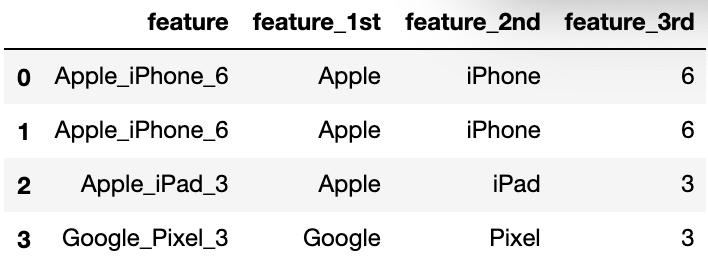

<style>
details {
    border: 1px solid #aaa;
    border-radius: 4px;
    padding: .5em .5em 0;
}
summary {
    font-weight: bold;
    margin: -.5em -.5em 0;
    padding: .5em;
}
details[open] {
    padding: .5em;
}
details[open] summary {
    border-bottom: 1px solid #aaa;
    margin-bottom: .5em;
}
</style>

<details><summary>目录</summary><p>

- [TODO](#todo)
- [文本特征](#文本特征)
  - [expansion 编码](#expansion-编码)
    - [示例](#示例)
  - [consolidation 编码](#consolidation-编码)
  - [文本长度特征](#文本长度特征)
    - [段落的个数](#段落的个数)
    - [句子的个数](#句子的个数)
    - [单词的个数](#单词的个数)
    - [字母个数](#字母个数)
    - [平均每个段落的句子个数](#平均每个段落的句子个数)
    - [平均每个段落的单词个数](#平均每个段落的单词个数)
    - [平均每个段落的字母个数](#平均每个段落的字母个数)
    - [平均每个句子的单词个数](#平均每个句子的单词个数)
    - [平均每个句子的字母个数](#平均每个句子的字母个数)
    - [平均每个单词的长度](#平均每个单词的长度)
  - [标点符号特征](#标点符号特征)
    - [标点符号的个数](#标点符号的个数)
    - [特殊标点符号的个数](#特殊标点符号的个数)
    - [其它](#其它)
  - [词汇属性特征](#词汇属性特征)
  - [特殊词汇特征](#特殊词汇特征)
  - [词频特征](#词频特征)
    - [CountVectorizer](#countvectorizer)
  - [TF-IDF 特征](#tf-idf-特征)
    - [TfidfVectorizer](#tfidfvectorizer)
  - [LDA 特征](#lda-特征)
    - [LatentDirichletAllocation](#latentdirichletallocation)
- [文本数据特征提取及处理](#文本数据特征提取及处理)
  - [词袋](#词袋)
  - [n-gram](#n-gram)
  - [主题模型](#主题模型)
  - [词嵌入模型](#词嵌入模型)
- [特征过滤](#特征过滤)
  - [使用过滤获取清洁特征](#使用过滤获取清洁特征)
    - [停用词](#停用词)
    - [基于频率的过滤](#基于频率的过滤)
- [参考](#参考)
</p></details><p></p>

# TODO

* [NLP问题15种数据增强方法汇总！](NLP问题15种数据增强方法汇总)
* [使用 Scikit-Learn 提取文本特征](https://www.biaodianfu.com/sklearn-feature-extraction-text.html)

# 文本特征

文本特征和类别特征会有一些简单的交集，一些简单的文本特征可以直接当做类别特征处理，例如：

* 花的颜色：red，blue，yellow 等等
* 名字：Mr jack，Mr smith，Mrs will，Mr phil 等等

对这些特征可以直接进行 Label 编码然后采用类别特征的技巧对其进行特征工程。
除了把文本特征当做类别特征处理，我们在做文本相关的特征工程时，
需要注意非常多的细节，相较于Label编码，就是如何防止文本内的信息丢失问题。
文本特征的处理涉及到非常多的NLP技术，此处我们主要介绍一些经常需要注意的地方以及一些技巧，
关于最新的方法，可以跟进最新的 NLP 相关技术

针对梯度提升树模型对文本特征进行特征工程，我们需要充分挖掘 Label 编码丢失的信息，
例如上面的名字特征，内部存在非常强的规律，Mr 等信息，这些信息反映了性别相关的信息，
如果直接进行 Label 编码就会丢失此类信息，所以我们可以通过文本技巧对其进行挖掘

## expansion 编码

expansion 编码类似于一种带有业务信息的聚类信息，
可以加速树模型的搜索速度，也是非常非常不错的特征

expansion 编码常常出现在一些复杂的字符串中，例如一些带有版本信息的字符串，
很多版本号的信息中涵盖了时间以及编号等信息，我们需要将其拆分开，形成多个新的特征列。
例如下面的例子



### 示例

```python
import pandas as pd

df = pd.DataFrame()
df["feature"] = [
    "Apple_iPhone_6",
    "Apple_iPhone_6",
    "Apple_iPad_3",
    "Google_Pixel_3",
]
df["feature_1st"] = df["feature"].apply(lambda x: x.split("_")[0])
df["feature_2nd"] = df["feature"].apply(lambda x: x.split("_")[1])
df["feature_3rd"] = df["feature"].apply(lambda x: x.split("_")[2])
df
```

```
          feature feature_1st feature_2nd feature_3rd
0  Apple_iPhone_6       Apple      iPhone           6
1  Apple_iPhone_6       Apple      iPhone           6
2    Apple_iPad_3       Apple        iPad           3
3  Google_Pixel_3      Google       Pixel           3
```

## consolidation 编码

consolidation 编码常常出现在一些特殊的字符串中，例如：

* 一些带有地址的字符串，字符串会给出详细的信息，例如：`xx市xx县xx村xx号`，
  可以将 `xx市` 抽取出来作为一个全新的特征
* 很多产品，例如手机、Pad 等，可以单独抽象为 `苹果`、`三星` 等公司的信息

consolidation 编码和 expansion 编码类似，也是一种带有业务信息的聚类信息，
可以加速树模型的搜索速度，也是一类非常不错的特征

## 文本长度特征

文本的长度特征可以按照文本的段落、句子、单此、字母四种粒度进行枚举式的构建，
这些特征可以反映文本的段落结构，在很多问题中都是非常重要的信息。例如：判断文本的类型，
判断文本是小说还是论文还是其他，此时文本的长度特征就是非常强的特征

### 段落的个数

顾名思义就是文本中段落的个数

### 句子的个数

文本中句子的个数，可以通过计算句号、感叹号等次数来统计

### 单词的个数

文本中单此的个数，可以直接通过将标点符号转化为空格，然后计算空格个数的方式来计算

### 字母个数

删除所有的标点之后直接统计所有字母的个数

### 平均每个段落的句子个数

`$$平均每个段落的句子个数 = \frac{句子的个数}{段落的个数}$$`

### 平均每个段落的单词个数

`$$平均每个段落的句子个数 = \frac{单词的个数}{段落的个数}$$`

### 平均每个段落的字母个数

`$$平均每个段落的句子个数 = \frac{文本字母个数}{段落的个数}$$`

### 平均每个句子的单词个数

`$$平均每个句子的单词个数 = \frac{单词的个数}{句子的个数}$$`

### 平均每个句子的字母个数

`$$平均每个句子的字母个数 = \frac{文本字母个数}{句子的个数}$$`

### 平均每个单词的长度

`$$平均每个单词的长度 = \frac{文本字母个数}{文本单词个数}$$`

## 标点符号特征

标点符号也蕴藏着非常重要的信息，例如在情感分类的问题中，
感叹号等信息往往意味着非常强烈的情感表达，对于最终模型的预测可以带来非常大的帮助

### 标点符号的个数

直接计算标点符号出现的次数

### 特殊标点符号的个数

统计文本中一些重要的标点符号出现的次数，例如：

* 情感分类问题中，感叹号出现的次数，问号出现的次数等
* 在病毒预测问题中，异常符号出现的次数

### 其它

此处需要额外注意一点，就是一些奇异的标点符号，例如连续多个感叹号，
`!!!` 或者连续多个问号 `？？？`，这种符号的情感表示更为强烈，
所以很多时候也需要特别注意

## 词汇属性特征

每个词都有其所属的属性，词汇属性特征很多时候能帮助模型带来效果上的微弱提升，
可以作为一类补充信息

* prep：preposition 的缩写。介系词、前置词
* pron：pronoun 的缩写。代名词
* n：noun 的缩写。名词
* v：verb 的缩写。动词，兼指及物动词和不及物动词

## 特殊词汇特征

标点符号能从侧面反映文本的情感强烈程度等信息，在情感分类、文本分类中有很重要的作用。
当然与同时，特殊词汇的特征则更为重要，可以选择直接分分别(每一类情感表示一类)统计每个类别中词汇的出现次数

| 编号 | 情感大类 | 情感类 | 例词                       |
|-----|---------|-------|---------------------------|
| 1   | 乐      | 快乐   | 喜悦、欢喜、笑眯眯、欢天喜地   |
| 2   |         | 安心   | 踏实、宽心、定心丸、问心无愧  |
| 3   | 好      | 尊敬   | 恭敬、敬爱、毕恭毕敬、肃然起敬 |
| 4   |         | 赞扬   | 英俊、优秀、通情达理、实事求是 |
| 5   |         | 相信   | 信任、信赖、可靠、毋庸置疑    |
| 6   |         | 喜爱   | 倾慕、宝贝、一见钟情、爱不释手 |
| 7   | 怒      | 愤怒   | 气愤、恼火、大发雷霆、七窍生烟 |
| 8   | 哀      | 悲伤   | 忧伤、悲苦、心如刀割,悲痛欲绝  |
| 9   |         | 失望   | 憾事、绝望、灰心丧气、心灰意冷 |
| 10  |         | 愧疚   | 内疚、忏悔、过意不去、问心有愧 |
| 11  |         | 思     | 相思、思念、牵肠挂肚、朝思暮想 |
| 12  | 惧      | 慌     | 慌张、心慌、不知所措、手忙脚乱 |
| 13  |         | 恐惧   | 胆怯、害怕、担惊受怕、胆颤心惊 |
| 14  |         | 羞     | 害羞、害臊、面红耳赤、无地自容 |
| 15  | 恶      | 烦闷   | 憋闷、烦躁、心烦意乱、自寻烦恼 |
| 16  |         | 憎恶   | 反感、可耻、恨之入骨、深恶痛绝 |
| 17  |         | 贬责   | 呆板、虚荣、杂乱无章、心狠手辣 |
| 18  |         |  妒忌  | 眼红、吃醋、醋坛子、嫉贤妒能 |
| 19  |         | 怀疑   | 多心、生疑、将信将疑、疑神疑鬼 |
| 20  | 惊      | 惊奇   | 奇怪、奇迹、大吃一惊、瞠目结舌 |

## 词频特征

上面是一些简单的文本特征，还有一些文本信息会相对复杂一些，例如是句子等文本。
这个时候我们就需要一些常用的文本工具了，而最为常见的就是词频统计特征，该特征较为简单，
就是统计文本中每个词出现的次数，因为每个文本一般都是由单词所组成的，
而每个单词出现的次数在一定程度上又可以从侧面反映该文章的内容，
例如在谋篇文章中，"love" 这个词出现的比较多，也就是说 "love" 对应的词频比较大，
则我们可以猜测该文章很大可能属于情感类的文章。所以在处理文本类的信息时，
词频特征是非常重要的信息之一

词频特征简单易于理解，能够从宏观的角度捕获文本的信息。相较于直接 Label 编码可以能提取更多有用的信息特征，
从而带来效果上的提升，但是词频特征往往会受到停止词汇的影响(stop words)，
例如 "the,a" 出现次数往往较多，这在聚类的时候如果选用了错误的聚类距离，例如 l2 距离等，
则往往难以获得较好的聚类效果，所以需要细心的进行停止词汇的删选。
受文本大小的影响，如果文章比较长，则词汇较多，文本较短，词汇则会较少等问题

### CountVectorizer

```python
from sklearn.feature_extraction.text import CountVectorizer

# 初始化，并引入停止词汇
vectorizer = CountVectorizer(stop_words = set([
    "the", "six", "less", "being", "indeed", "over", "move", 
    "anyway", "four", "not", "own", "through", "yourselves"
]))

df = pd.DataFrame()
df['text'] = [
    "The sky is blue.", 
    "The sun is bright.",
    "The sun in the sky is bright.", 
    "We can see the shining sun, the bright sun."
]
 
# 获取词汇
vectorizer.fit_transform(df['text']).todense()
```

```
matrix([[1, 0, 0, 0, 1, 0, 0, 1, 0, 0],
        [0, 1, 0, 0, 1, 0, 0, 0, 1, 0],
        [0, 1, 0, 1, 1, 0, 0, 1, 1, 0],
        [0, 1, 1, 0, 0, 1, 1, 0, 2, 1]])
```

文本的字典：

```python
vectorizer.vocabulary_
```

```
{'sky': 7,
 'is': 4,
 'blue': 0,
 'sun': 8,
 'bright': 1,
 'in': 3,
 'we': 9,
 'can': 2,
 'see': 5,
 'shining': 6}
```

## TF-IDF 特征

TF-IDF 特征是词频特征的一个扩展延伸，词频特征可以从宏观的方面表示文本的信息，
但在词频方法因为将频繁的词汇的作用放大了，例如常见的 "I",'the" 等；
将稀有的词汇，例如 "garden"，"tiger" 的作用缩减了，而这些单词却有着极为重要的信息量，
所以词频特征往往很难捕获一些出现次数较少但是又非常有效的信息。
而 TF-IDF 特征可以很好地缓解此类问题的方法。
TF-IDF 从全局（所有文件）和局部（单个文件）的角度来解决上述问题，
TF-IDF 可以更好地给出某个单词对于某个文件的重要性

TD-IDF 忽略了文章的内容，词汇之间的联系，虽然可以通过 N-Gram 的方式进行缓解，
但其实依然没有从本质上解决该问题

### TfidfVectorizer

```python
from sklearn.feature_extraction.text import TfidfVectorizer

tfidf_model = TfidfVectorizer()
# 获取词汇
tfidf_matrix = tfidf_model.fit_transform(df['text']).todense()
tfidf_matrix
```

```
matrix([[0.65919112, 0.        , 0.        , 0.        , 0.42075315,
         0.        , 0.        , 0.51971385, 0.        , 0.34399327,
         0.        ],
        [0.        , 0.52210862, 0.        , 0.        , 0.52210862,
         0.        , 0.        , 0.        , 0.52210862, 0.42685801,
         0.        ],
        [0.        , 0.3218464 , 0.        , 0.50423458, 0.3218464 ,
         0.        , 0.        , 0.39754433, 0.3218464 , 0.52626104,
         0.        ],
        [0.        , 0.23910199, 0.37459947, 0.        , 0.        ,
         0.37459947, 0.37459947, 0.        , 0.47820398, 0.39096309,
         0.37459947]])
```

文本字典：

```python
tfidf_model.vocabulary_
```

```
{'the': 9,
 'sky': 7,
 'is': 4,
 'blue': 0,
 'sun': 8,
 'bright': 1,
 'in': 3,
 'we': 10,
 'can': 2,
 'see': 5,
 'shining': 6}
```

```python
tfidf_model.idf_
```

```
array([1.91629073, 1.22314355, 1.91629073, 1.91629073, 1.22314355,
       1.91629073, 1.91629073, 1.51082562, 1.22314355, 1.        ,
       1.91629073])
```

## LDA 特征

基于词频的特征和基于TFIDF的特征都是向量形式的，
因而我们可以采用基于向量抽取特征的方式对其抽取新特征，而最为典型的就是主题模型。
主题模型的思想是围绕从以主题表示的文档语料库中提取关键主题或概念的过程为中心。
每个主题都可以表示为一个包或从文档语料库收集单词/术语。
这些术语共同表示特定的主题、主题或概念，
每个主题都可以通过这些术语所传达的语义意义与其他主题进行区分。
这些概念可以从简单的事实和陈述到观点和观点。
主题模型在总结大量文本文档来提取和描述关键概念方面非常有用。
它们还可以从捕获数据中潜在模式的文本数据中提取特征


因为主题模型涉及的数学等概念较多，此处我们仅仅介绍其使用方案，
有兴趣的朋友可以去阅读论文等资料

一般我们会在 TF-IDF 或者词频等矩阵上使用 LDA，
最终我们得到的结果也可以拆解为下面两个核心部分：

* document-topic 矩阵，这将是我们需要的特征矩阵你在找什么。
* 一个topic-term矩阵，它帮助我们查看语料库中的潜在主题。
  此处我们使用上面的TDIDF矩阵并设置主题为2个进行试验

### LatentDirichletAllocation

```python
from sklearn.decomposition import LatentDirichletAllocation

lda       = LatentDirichletAllocation(n_components=2, max_iter=10000, random_state=0)
dt_matrix = lda.fit_transform(tfidf_matrix)
features  = pd.DataFrame(dt_matrix, columns=['T1', 'T2'])
features
```

```
          T1          T2
0   0.798663	0.201337
1	0.813139	0.186861
2	0.827378	0.172622
3	0.797794	0.202206
```

查看主题以及对应的每个词的贡献：

```python
tt_matrix = lda.components_
vocab = tfidf_model.get_feature_names()
for topic_weights in tt_matrix:
    topic = [(token, weight) for token, weight in zip(vocab, topic_weights)]
    topic = sorted(topic, key = lambda x: -x[1])
    topic = [item for item in topic if item[1] > 0.2]
    print(topic)
    print() 
```

```
[
    ('the', 2.1446092537000254), 
    ('sun', 1.7781565358915534), 
    ('is', 1.7250615399950295), 
    ('bright', 1.5425619519080085), 
    ('sky', 1.3771748032988098), 
    ('blue', 1.116020185537514), 
    ('in', 0.9734645258594571), 
    ('can', 0.828463031801155), 
    ('see', 0.828463031801155), 
    ('shining', 0.828463031801155), 
    ('we', 0.828463031801155)
]

[
    ('can', 0.5461364394229279), 
    ('see', 0.5461364394229279), 
    ('shining', 0.5461364394229279), 
    ('we', 0.5461364394229279), 
    ('sun', 0.5440024650128295), 
    ('the', 0.5434661558382532), 
    ('blue', 0.5431709323301609), 
    ('bright', 0.5404950589213404), 
    ('sky', 0.5400833776748659), 
    ('is', 0.539646632403921), 
    ('in', 0.5307700509960934)
]
```

# 文本数据特征提取及处理

* 特征提取
    - 词袋模型(bag-of-words)
        - 单词数量的统计列表
* 特征缩放
    - tf-idf(term frequency-inverse document frequency)
* 主题模型(topic model)
* 词嵌入模型(word embeding)
    - Word2Vec
        - CBOW(Continues Bags of Words)
        - Skip-gram

对于文本数据, 可以从一个单词数量的统计列表开始, 称为词袋(bag-of-words).
对于像文本分类这样的简单任务来说, 单词数量统计通常就够用了. 
这种技术还可以用于信息提取, 它的目标是提取出一组与查询文本相关的文档. 
这两种任务都可以凭借单词级别的特征圆满完成, 
因为特定词是否存在于文档中这个指标可以很好的标识文档的主题内容. 

## 词袋

1. 在词袋特征化中, 一篇文本文档被转换为一个计数向量, 这个计数向量包含 `词汇表` 中所有可能出现的单词
2. 词袋将一个文本文档转换为一个扁平向量之所以说这个向量是"扁平的”, 是因为它不包含原始文本中的任何结构, 
   原始文本是一个单词序列, 但词袋中没有任何序列, 它只记录每个单词在文本中出现的次数. 
   因此向量中单词的顺序根本不重要, 只要它在数据集的所有文档之间保持一致即可
3. 词袋也不表示任何单词层次, 在词袋中, 每个单词都是平等的元素
4. 在词袋表示中, 重要的是特征空间中的数据分布.在词袋向量中, 
   每个单词都是向量的一个维度. 如果词汇表中有 n 个单词, 
   那么一篇文档就是 n 维空间中的一个点
5. 词袋的缺点是, 将句子分解为单词会破坏语义

## n-gram

1. n 元词袋(bag-of-n-grams)是词袋的一种自然扩展, n-gram(n元词)是由n个标记(token)组成的序列. 1-gram
   就是一个单词(word), 又称为一元词(unigram). 经过分词(tokenization)之后, 计数机制会将单独标记转换为单词计数, 或将有重叠的序列作为
   n-gram 进行计数. 
2. n-gram 能够更多地保留文本的初始序列结构, 因此 n
   元词袋表示法可以表达更丰富的信息
3. 然而, 并不是没有代价, 理论上, 有k个不同的单词, 就会有 :math:`k^{2}`
   个不同的
   2-gram(二元词), 实际上, 没有这么多, 因为并不是每个单词都可以跟在另一个单词后面
4. n-gram(n > 1)一般来说也会比单词多得多, 这意味着 n
   元词袋是一个更大也更稀疏的特征空间, 也意味着 n
   元词袋需要更强的计算、存储、建模能力. n
   越大, 能表示的信息越丰富, 相应的成本也会越高

```python
import pandas
import json
from sklearn.feature_extraction.text import CountVectorizer

js = []
with open("yelp_academic_dataset_review.json") as f:
    for i in range(10000):
        js.append(json.loads(f.readline()))

review_df = pd.DataFrame(js)
```

## 主题模型

- 主题模型用于从文本库中发现有代表性的主题(得到每个主题上面词的分布特性), 并且能够计算出每篇文章的主题分布

## 词嵌入模型


# 特征过滤

## 使用过滤获取清洁特征

### 停用词

* 停用词
    - 中文停用词
        - 网上找
    - 英文停用词
        - NLTK
* 分词
    - 中文分词
    - 英文分词
        - 不能省略撇号
        - 单词为小写

### 基于频率的过滤


# 参考

* [20大文本特征](https://mp.weixin.qq.com/s?__biz=Mzg4MzU1NjQ2Mw==&mid=2247501415&idx=2&sn=ff28c65163179f9ccce31ab4ded3f374&chksm=cf472f67f830a671844c1729baf01e84b3be6f053cf92256637ffe5ecf53098b27b4d8993249&scene=21#wechat_redirect)

