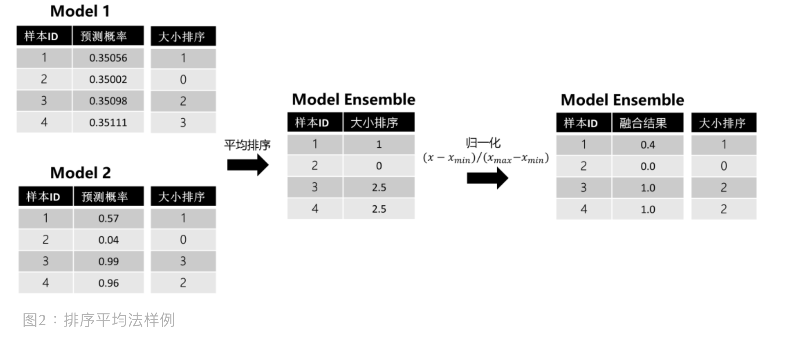

<style>
details {
    border: 1px solid #aaa;
    border-radius: 4px;
    padding: .5em .5em 0;
}
summary {
    font-weight: bold;
    margin: -.5em -.5em 0;
    padding: .5em;
}
details[open] {
    padding: .5em;
}
details[open] summary {
    border-bottom: 1px solid #aaa;
    margin-bottom: .5em;
}
</style>

<details><summary>目录</summary><p>

- [模型融合介绍](#模型融合介绍)
  - [模型融合简介](#模型融合简介)
  - [模型融合有点](#模型融合有点)
  - [模型融合对象](#模型融合对象)
  - [模型融合方法](#模型融合方法)
- [异质模型融合方法](#异质模型融合方法)
  - [Voting](#voting)
    - [Python API](#python-api)
  - [Averaging](#averaging)
    - [算术平均法](#算术平均法)
    - [几何平均法](#几何平均法)
    - [加权平均法](#加权平均法)
  - [排序法](#排序法)
  - [Stacking](#stacking)
    - [单层 Stacking](#单层-stacking)
    - [多层 Stacking](#多层-stacking)
    - [其他技术与 Stacking 结合](#其他技术与-stacking-结合)
    - [Python API](#python-api-1)
  - [Blending](#blending)
- [同质模型融合方法](#同质模型融合方法)
  - [Bagging](#bagging)
    - [Python API](#python-api-2)
  - [Boosting](#boosting)
    - [Python API](#python-api-3)
- [模型融合工具](#模型融合工具)
  - [StackNet](#stacknet)
    - [介绍](#介绍)
    - [工作原理](#工作原理)
    - [两种形式](#两种形式)
    - [示例](#示例)
    - [参考](#参考)
- [参考](#参考-1)
</p></details><p></p>

# 模型融合介绍

## 模型融合简介

模型融合(Model Fusion，Model Ensemble)是机器学习中一种常见的技术，
通过结合多个模型的预测结果来提高总体预测的准确率。模型融合的思路是，
先训练多个不同的模型(如不同的算法或不同的超参数)，然后将这些模型的预测结果结合起来

## 模型融合有点

模型融合的好处是能够结合多个模型的优点，提高模型的稳定性和准确性，得到的结果可能比单个模型的预测更加精确

模型融合常常是在数据量较大，模型泛化能力不足时使用。但是，模型融合并不能保证在所有情况下都能得到最优结果，
它的有效性取决于具体的应用场景和所选模型的性能，因此需要根据具体的问题和数据进行评估和选择最合适的模型融合方法

另外，模型融合也可以用于处理高方差（high variance）和高偏差（high bias）的模型。
如果模型具有高方差，则说明模型对训练数据的泛化能力不足，结果容易受训练数据噪声的影响，
而且预测结果很不稳定；如果模型具有高偏差，则说明模型在数据上过于简单，缺乏对数据复杂性的把握，
预测结果容易存在偏差。在模型融合中，我们可以通过结合具有不同方差/偏差特点的模型来降低整体方差/偏差。
例如，我们可以将一个具有高方差的模型和一个具有高偏差的模型结合起来，以获得更加平衡的模型

综上，模型融合有以下优点：

* 增加模型的性能，使得模型预测更加精确
* 降低方差，提高模型稳定性
* 减少过拟合

## 模型融合对象

在讲模型融合方法前，先了解下融合对象，融的是什么？是不同的个体学习器 (Individual Leaner)。
"一个世界从来不是由某个单独个体简单构成的，而是由具有不同属性的个体共同构成的"。对于个体学习器来说，
它们的不同体现在：

* 不同训练数据：数据集使用比例、预处理方法 (缺失值填补、特征工程等)
* 不同模型结构：RF、XGBoost、LightGBM、CatBoost、CNN、LSTM 等
* 不同超参
    - 随机种子数
    - 权重初始化
    - 收敛相关参数
        - 学习率
        - batch size
        - epoch
        - 早停步数
    - 损失函数
    - 子采样比例

## 模型融合方法

模型融合看起来很赞，很多比赛选手也热衷于在比赛后期去找使用不同模型的队友进行模型融合，但真实工业中，
还是 Less is better。例如：在 2006 年，Netflix 组织的第一场数据科学竞赛，
队伍 Korbell 以 8.43% 的提升获得了第一进步奖，为此，他们融合了 107 个算法且耗时 2000 小时。
由于融合带来的复杂度，最后 Netflix 并没有将他们方案完全应用在产品中。
现在很多比赛平台也声明禁止选手过多堆砌模型，特别是很多比赛已经开始将预测时间加入分数评估中。
对于我们来说，模型融合是一种提升分数的有力技巧，但还是建议平衡好整个解决方案的准确率和效率

常用的模型融合方法有：

* 投票法(Voting)
* 平均法(Averaging)
    - 算术平均
    - 几何平均
    - 加权平均
* 排序法(Sorting)
* Stacking
* Blending

# 异质模型融合方法

> 集成学习 (Ensemble Learning) 通过构建并结合多个学习器来完成学习任务，
> 有时也被称作多分类器系统 (Multi-classifier System)、基于委员会的学习 (Committee-based Learning)等
> 
> 《机器学习》- 周志华

所以说，模型集成不是只有同质学习器的集成 (例如 Boosting 和 Bagging) 才称作模型集成，
还有异质学习器的集成也是模型集成。虽然我觉得称作”模型集成“也没错，但为了避嫌，这边都统一称作“模型融合"。
本文不细讲关于同质学习器集成的内容了 (即 Boosting 和 Bagging)，这里主要是基于的内容主线，
分享异质学习器的一些融合手段

## Voting

> Voting，投票法

Voting 适用于分类任务，对多个学习器的预测结果进行投票，即少数服从多数

投票法有两种：

* 普通投票法
* 加权投票法
    - 加权的权重可以人工主观设置或者根据模型评估分数来设置权重
        - 比如：权值可以用排序的方法确定。举个例子，比如 A、B、C 三种基本模型，对模型效果进行排名，
          假设排名分别是 1，2，3，那么给这三个模型赋予的权值分别是 3/6、2/6、1/6

另外一种角度看，有两种类型的投票用于汇总基础预测

* 硬投票
    - 硬投票选择投票数最高的预测作为最终预测
    
* 软投票
    - 软投票将每个模型中每个类的概率结合起来，选择概率最高的类作为最终预测
    

投票需要 3 个及 3 个以上的模型，同时建议要保证模型的多样性，有时候对同质模型们使用投票法并不能取得较好的表现，
这是因为同质模型得到的结果之间可能具有较强的相关性，从而会导致多数人把少数人的好想法给压下去了。
为了避免这个问题，可以参考在 2014 年 KDD Cup 上 Marios Michailid 的做法，
他对所有结果文件计算 Pearson 系数，最后选取其中相关性小的模型结果进行投票，分数获得了提升

### Python API

```python
from sklearn.ensemble import VotingClassifier
# base models
from sklearn.tree import DecisionTreeClassifier
from sklearn.linear_model import LogisticRegression
from sklearn.naive_bayes import GaussianNB
from sklearn.neighbors import KNeighborsClassifier
from sklearn.svm import SVC

ensemble_voting = VotingClassifier(
    estimators = [
        ('dtc', DecisionTreeClassifier(random_state = 42)),
        ('lr', LogisticRegression()),
        ('gnb', GaussianNB()),
        ('knn', KNeighborsClassifier()),
        ('svc', SVC())
    ],
    voting = 'hard'
)
ensemble_voting.fit(X_train, y_train)
```

## Averaging

> Averaging，平均法

适用于回归、分类 (针对概率) 任务，对多个学习器的预测结果进行平均。
平均法的好处在于平滑结果，从而减少过拟合。常见的平均法有三种：算术平均法、几何平均法和加权平均法

假设我们有 `$n$` 个模型的预测结果 `$\hat{y}_{i}, i=1,2,\ldots, n$`，则三类平均计算方式如下：

### 算术平均法

`$$\bar{\hat{y}} = \frac{1}{n}(\hat{y}_{1} + \hat{y}_{2} + \ldots + \hat{y}_{n})$$`

### 几何平均法

`$$\bar{\hat{y}} = \sqrt[n]{\hat{y}_{1} \times \hat{y}_{2} \times \ldots \times \hat{y}_{n}}$$`

### 加权平均法

`$$\bar{\hat{y}} = \frac{\omega_{1}\hat{y}_{1} + \omega_{2}\hat{y}_{2} + \ldots + \omega_{n}\hat{y}_{n}}{\omega_{1} + \omega_{2} + \ldots + \omega_{n}}$$`

## 排序法

> Sorting，排序法

如果模型评估标准是排序或者阈值相关（例如 AUC），简单使用平均法并不见得都能取得较好的结果

举个例子：


上图能发现，模型 1 几乎没有给模型 2 带来大的影响，因为像这种波动小的模型做融合，对最终结果造成的影响不大

为了解决这个问题，可以考虑使用排序平均法。在使用中，碰到 AUC，很多都会采用这种方法进行模型融合。
比如在招商银行的 “消费金融场景下的用户购买预测” 的冠军方案中便针对赛题方的 AUC 评分标准， 
采用了基于排序的模型融合方法。排序法的具体步骤如下：

1. 对预测结果进行排序
2. 对排序序号进行平均
3. 对平均排序序号进行归一化

这里还是用上面的例子帮助理解，通过平均排序和归一化，能发现波动小的模型 1 给最终的模型融合带来了影响：



在使用排序法的时候，有个地方需要注意：排序是针对测试集预测结果来做的，
但如果在工业界使用，很多时候会有新样本进来要预测，此时该怎么办呢？
针对新样本，其实有两种处理方式：

* 重新排序：将新样本放入原测试集中，重新排序，一旦数据量大，时间复杂度会增加。
* 参考历史排序：先将历史测试集的预测结果和排序结果保存，新样本进来后，
  在历史测试集中找到与新样本预测值最近的值，然后取其排序号赋予新样本。
  之后平均排序，使用历史最大最小值进行归一化操作即可

## Stacking

### 单层 Stacking

单层 Stacking 是指在基学习器上只堆叠一层元学习器，这也是最常见的 Stacking 结构，示意图如下所示：


上图中的基学习器可以是同质或异质的模型，而元学习器在传统做法中是选用逻辑回归模型，
当然也能使用非线性模型作为元学习器，例如 GBDT, KNN, NN, RF 等。
比如在 ”天池零基础入门金融风控-贷款违约预测“ 一赛中，
TOP6 的方案使用了 LightGBM、CatBoost 和 XGBoost 作为基学习器，
然后利用 Pearson 相关系数分析模型结果差异性，选取差异较大的结果文件，
再输入第二层元学习器 RF 进一步融合结果。如果我们有 4 个特征的数据集和 3 个基学习器，
单层 Stacking(5-Fold)的训练和预测的具体细节是怎样的呢？请见下图：


单层 Stacking 在基学习器和元学习器上可灵活选用自己喜欢的模型，甚至说能暴力去做（量力而行）：


除此之外，Stacking 在特征上也可以玩出一些花样，其中有的文章便介绍了两种单层 Stacking 上的特征交互方法：

* Feature-weighted Linear Stacking (FWLS)：Still 等人在论文中提出了该方法。
  基学习器们的预测结果叫元特征，因为它们是用于训练元学习器。FWLS 提出可以在元学习器前，
  对元特征进行特征交互，交互对象可以是元特征本身，也可以是原始特征（即：元特征\*元特征 或 元特征\*原始特征）
* Quadratic Linear Stacking of Models：它采用的特征交互模式是：元特征\*元特征 + 元特征\*原始特征

### 多层 Stacking

这个是听说的，即增加多层元学习器，但我也没用过。大概结构示意图如下：


### 其他技术与 Stacking 结合

Stacking 可以与无监督学习方法结合。例如：使用 t-SNE 将数据降维到 2 或 3 维，然后用非线性元学习器来融合。
案例可参考 Kaggle 的 “Otto Group Product Classification Challenge” 中，Mike Kim 提出的方法

### Python API

```python
from sklearn.neighbors import KNeighborsClassifier
from sklearn.tree import DecisionTreeClassifier
from sklearn.svm import SVC
from sklearn.linear_model import LogisticRegression
from sklearn.ensemble import StackingClassifier

base_learners = [
    ('l1', KNeighborsClassifier()),
    ('l2', DecisionTreeClassifier()),
    ('l3',SVC(gamma = 2, C = 1)))
]
model = StackingClassifier(
    estimators = base_learners, 
    final_estimator = LogisticRegression(),
    cv = 5
)
model.fit(X_train, y_train)
```

## Blending

思考下 Stacking，基学习器和元学习器本质上都是用同一训练集训练的 (虽然输入的 `$x$` 不一样，但标签 `$y$` 一样)，
这就会造成信息泄露，从而导致元学习器过拟合我们的数据集

为了避免这种问题，Blending 方法被提出了，它的想法是：对原始数据集先划分出一个较小的留出集，
比如 10% 训练集被当做留出集，那么 Blending 用 90% 的数据做基学习器的训练，而 10% 留出集用作训练元学习器，
这样基学习器和元学习是用不同数据集来训练的

Blending 的示意图如下所示：


上图的红框是区分 Stacking 的关键。相比于 Stacking，Blending 能有效防止信息泄露，但也正因为如此，
元学习器只用了较小部分的数据集进行训练，且容易对留出集过拟合。如果数据量有限，个人更偏好于 Stacking

# 同质模型融合方法

## Bagging

Bagging 是采用几个弱机器学习模型，并将它们的预测聚合在一起，以产生最佳的预测。
它基于 bootstrap aggregation, bootstrap 是一种使用替换方法从集合中抽取随机样本的抽样技术。
aggregation 则是利用将几个预测结合起来产生最终预测的过程

Bagging 就是采用有放回的方式进行抽样, 用抽样的样本建立子模型, 对子模型进行训练, 
这个过程重复, 最后进行融合

大概分为这样两步: 

* 1.重复 k 次
    - 有放回地重复抽样建模
    - 训练子模型
* 2.模型融合
    - 分类问题: Voting
    - 回归问题: Average

Bagging 通常有两种类型：决策树的集合(称为随机森林)和决策树以外的模型的集合。
两者的工作原理相似，都使用聚合方法生成最终预测，唯一的区别是它们所基于的模型

随机森林是利用 Bagging 的最著名和最常用的模型之一。它由大量的决策树组成，这些决策树作为一个整体运行。
它使用 Bagging 和特征随机性的概念来创建每棵独立的树。每棵决策树都是从数据中随机抽取样本进行训练。
在随机森林中，我们最终得到的树不仅接受不同数据集的训练，而且使用不同的特征来预测结果

### Python API

在 sklearn 中，有一个 `BaggingClassifier` 类，用于创建除决策树以外的模型

随机森林：

```python
# bagging ensemble of same classifiers (Decision Trees)
from sklearn.ensemble import RandomForestClassifier  

classifier = RandomForestClassifier(
    n_estimators = 10, 
    criterion = "entropy"
)  
classifier.fit(x_train, y_train)
```

决策树以外的模型的集合：

```python
# bagging ensemble of different classifiers
from sklearn.ensemble import BaggingClassifier
from sklearn.svm import SVC

clf = BaggingClassifier(
    base_estimator = SVC(),
    n_estimators = 10, 
    random_state = 0)
clf.fit(X_train,y_train)
```

## Boosting

Bagging 算法可以并行处理，而 Boosting 的思想是一种迭代的方法， 
每一次训练的时候都更加关心分类错误的样例，给这些分类错误的样例增加更大的权重， 
下一次迭代的目标就是能够更容易辨别出上一轮分类错误的样例，
最终将这些弱分类器进行加权相加，同样地, 基于 Boosting 思想的有 AdaBoost、GBDT 等

### Python API

```python
from sklearn.tree import DecisionTreeClassifier
from sklearn.ensemble import AdaBoostClassifier

dt = DecisionTreeClassifier(max_depth = 2, random_state = 0)
adc = AdaBoostClassifier(base_estimator = dt, n_estimators = 7, learning_rate = 0.1, random_state = 0)
adc.fit(x_train, y_train)
```

# 模型融合工具

## StackNet

### 介绍

早期的数据竞赛中，不夸张的说 Stacking 技术可以帮助我们在排行榜上提升 50+ 的名次，
而其中最为著名的就是 kaggle 全球 Top3 的 kaz-Anova 开发的 [StackNet](https://github.com/kaz-Anova/StackNet)，
StackNet 是一个计算、可扩展和分析框架，它早期是采用 Java 软件实现的，
使用 StackNet 拿下的金牌数也不下于 100 枚

StackNet 类似于前馈神经网络，与前馈神经网络不同，网络不是通过反向传播进行训练，
而是一次迭代构建一层（使用叠加泛化），每个层都以最终目标作为其目标

StackNet（通常）会比它在每个第一层中包含的最好的单一模型要好，
但是，它的最终性能仍然依赖于强大和不同的的单一模型的混合，
以便从元建模方法中获得最佳效果

### 工作原理

在一般的神经网络中，我们给定一些输入数据，神经网络通常应用感知器和激活函数，
如 ReLU、Sigmoid、tanh 或其他函数对其操作然后输入到下一层。
StackNet 模型则假设此函数可以采用任何有监督机器学习算法的形式来表示，
只需要将其输出反馈到下一层即可。此处的算法可以是分类器、回归器或任何产生输出的估计器。
对于分类问题，要为响应变量的任意数量的唯一类别创建输出预测分数，
最后一层中的所有选定算法的输出维度必须等于这些唯一类别的数。如果存在多个此类分类器，
则结果是所有这些输出预测的缩放平均值

### 两种形式


1. 传统模式
    - 最为传统的 Stacking 模式
2. Restacking 模式
    - 假设每一层都使用以前的神经元激活以及所有以前的层神经元(包括输入层)。这种模式背后的直觉来自：
      更高级别的算法已经从输入数据中提取信息，但重新扫描输入空间可能会产生新的信息，
      这些信息在第一次扫描时并不明显

### 示例

```python
from sklearn.ensemble import RandomForestClassifier
from sklearn.ensemble import ExtraTreesClassifier
from sklearn.ensemble import GradientBoostingClassifier
from sklearn.linear_model import LogisticRegression
from pystacknet.pystacknet import StackNetClassifier

models = [ 
    # First level
    [
        RandomForestClassifier(
            n_estimators = 100, 
            criterion = "entropy", 
            max_depth = 5, 
            max_features = 0.5, 
            random_state = 1
        ),
        ExtraTreesClassifier (
            n_estimators = 100, 
            criterion = "entropy", 
            max_depth = 5, 
            max_features = 0.5, 
            random_state = 1
        ),
        GradientBoostingClassifier(
            n_estimators = 100, 
            learning_rate = 0.1, 
            max_depth = 5, 
            max_features = 0.5, 
            random_state = 1
        ),
        LogisticRegression(random_state = 1)
    ],
    # Second level
    [
        RandomForestClassifier(
            n_estimators = 200, 
            criterion = "entropy", 
            max_depth = 5, 
            max_features = 0.5, 
            random_state = 1
        )
    ]
]

model = StackNetClassifier(
    models, 
    metric = "auc", 
    folds = 4,
    restacking = False,
    use_retraining = True, 
    use_proba = True, 
    random_state = 12345,
    n_jobs = 1, 
    verbose = 1
)

model.fit(x, y)
preds = model.predict_proba(x_test) 
```

### 参考

* https://github.com/kaz-Anova/StackNet
* https://medium.com/kaggle-blog
* https://github.com/h2oai/pystacknet

# 参考

* [模型融合方法概述](https://zhuanlan.zhihu.com/p/25836678)
* [《KAGGLE ENSEMBLING GUIDE》](https://mlwave.com/kaggle-ensembling-guide/)
* [招商银行的消费金融场景下的用户购买预测的冠军方案](https://github.com/sunwantong/China-Merchants-Bank-credit-card-Cente-User-purchase-forecast)
* [Sill, J., Takács, G., Mackey, L., & Lin, D. (2009). Feature-weighted linear stacking. arXiv preprint arXiv:0911.0460.]()
* [T-SNE+Stacking](https://www.kaggle.com/c/otto-group-product-classification-challenge/discussion/14295)
* [Netflix Recommendations: Beyond the 5 stars (Part 1)](https://netflixtechblog.com/netflix-recommendations-beyond-the-5-stars-part-1-55838468f429)
* [模型融合方法总结](https://mp.weixin.qq.com/s?__biz=MzUyNzA1OTcxNg==&mid=2247486027&idx=1&sn=ae0f4ebedeb87feabb318be13790f200&chksm=fa041420cd739d3671d7ad359b5a2bc432b9b9881bc31e558b660b0ef15734ab3251dae8e7b3&scene=178&cur_album_id=1577157748566310916#rd)
* [DoubleEnsemble-专治硬样本的神奇集成技术](https://mp.weixin.qq.com/s?__biz=Mzk0NDE5Nzg1Ng==&mid=2247497960&idx=2&sn=ed068cc49e0fb4858e0eb6758c3b6d06&chksm=c32ae167f45d687110d6c72b3bd76918a56756743919db8adc7ebbdc367092f27fc38abfe8f8&cur_album_id=1698941448517173254&scene=189#wechat_redirect)

