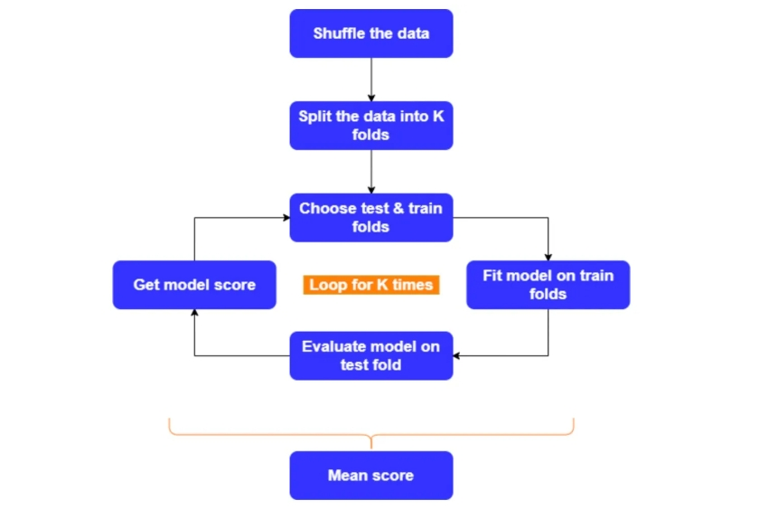
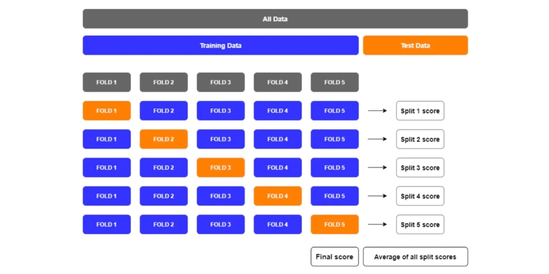
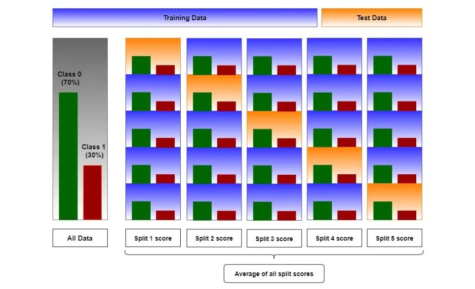
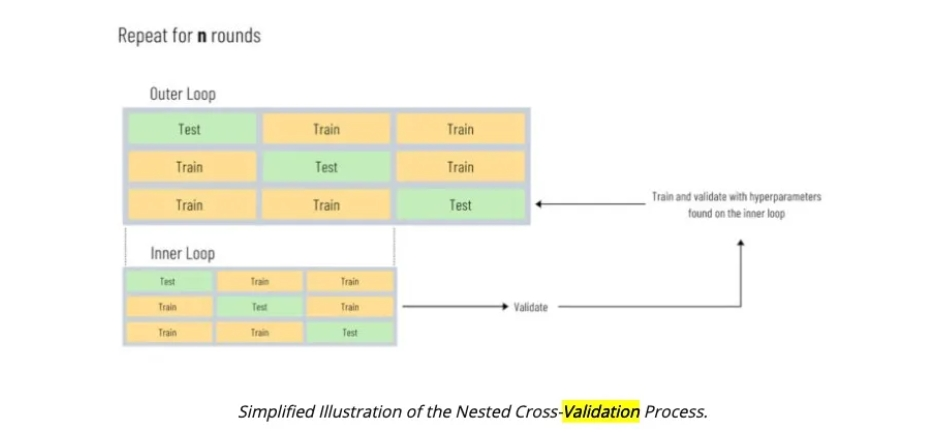

<style>
details {
    border: 1px solid #aaa;
    border-radius: 4px;
    padding: .5em .5em 0;
}
summary {
    font-weight: bold;
    margin: -.5em -.5em 0;
    padding: .5em;
}
details[open] {
    padding: .5em;
}
details[open] summary {
    border-bottom: 1px solid #aaa;
    margin-bottom: .5em;
}
img {
    pointer-events: none;
}
</style>

<details><summary>目录</summary><p>

- [模型验证介绍](#模型验证介绍)
- [模型验证方法](#模型验证方法)
    - [训练集验证集分割验证](#训练集验证集分割验证)
        - [随机划分](#随机划分)
        - [分层划分](#分层划分)
    - [交叉验证](#交叉验证)
        - [Hold Out 交叉验证](#hold-out-交叉验证)
        - [随机 K-Fold CV](#随机-k-fold-cv)
        - [分层 K-Fold CV](#分层-k-fold-cv)
        - [分组 K-Fold CV](#分组-k-fold-cv)
        - [分层分组 K-Fold CV](#分层分组-k-fold-cv)
        - [Repeated K-Fold CV](#repeated-k-fold-cv)
        - [Nested K-Fold CV](#nested-k-fold-cv)
- [模型验证工具](#模型验证工具)
    - [evidently](#evidently)
        - [安装](#安装)
        - [使用-数据统计](#使用-数据统计)
        - [使用-机器学习](#使用-机器学习)
    - [deepchecks](#deepchecks)
        - [安装](#安装-1)
        - [使用](#使用)
    - [TFDV](#tfdv)
        - [安装](#安装-2)
        - [使用](#使用-1)
- [参考](#参考)
</p></details><p></p>

# 模型验证介绍

机器学习模型项目不是一次性的，它是一个持续的过程。
如果存在任何异常，则需要对生产中的模型进行持续监控。

在数据集进行数据探索分析，做完样本的初步筛选，并对样本进行重新组织之后（如有必要）。
接下来需要做的就是线下验证策略的设定。验证集设计的合理与否，
对于整个项目都会带来非常大的影响，如果模型线下验证结果和线上的结果不一致，
将会导致无法继续进行后续的实验，就像是在摸奖一样。

注意：此处所说的不一致，指的是线下结果有一定幅度的提升，但线上却下降了的情况；
如果线下提升幅度不是非常大，但是线上下降了可能是因为波动的原因，可以认为是合理的。

此外，一个鲁棒的验证策略，还可以帮助我们更好地调整我们模型的参数，
验证各种框架以及特征的重要性等等。

# 模型验证方法

## 训练集验证集分割验证

### 随机划分

**简介：**

随机的训练集验证集切分是最为简单也是最为常见的验证策略。它的步骤也很简单：

1. 将训练集合按照一定比例随机切分为新的训练集和验证集；
2. 使用新的验证集进行训练并在验证集上进行验证；

**使用场景：**

简单的训练集和验证集划分策略目前经常会出现在一些数据集较大的问题同时时间因素影响不大的情况下，
因为数据集较大的原因，验证一次的时间消耗较大，同时我们认为较大数据集的验证结果是相对可靠的，
所以简单的训练集和验证集的划分就可以满足我们的需求。
当然在早期一些小的数据集上有的朋友也会采用训练集验证集的划分策略，但是这个时候，
我们需要将验证集的数据多划分一些，以保证验证结果相对置信。

* 如果我们的训练集合非常大，比如有上亿条记录，采用 80:20 的比例进行划分即可；
  当然 70:30 和 90:10 也都是可以的；
* 如果我们的训练集合一般，比如只有 20000 条数据，
  那么采用 70:30 左右的比例进行划分会较为合适点；
  
尽可能往验证集上多划分一些数据，不过这个时候我们会更加倾向于使用接下来讲的 K 折交叉验证。
上面的比例只是一个参考，没有明确的计算公式说哪个比例会更好，需要大家自己实践来判断。

**使用示例：**

```python
# 将数据集划分为训练集和验证集合
from sklearn.datasets import make_blobs
from sklearn.model_selection import train_test_split

# 构建数据集
X, y = make_blobs(n_samples=100000)

# 数据集划分
val_ratio = 0.2
X_train, X_test, y_train, y_test = train_test_split(X, y, test_size = val_ratio)
print(X_train.shape, X_test.shape, y_train.shape, y_test.shape) 
```

### 分层划分

**简介：**

分层划分主要常见于分类问题，有些分类问题的每个类标签的示例数并不均衡。
分层划分的步骤和随机的类似，最好将数据集拆分为训练集和验证集，
以便在每个类中保留与在原始数据集中观察到的差不多比例的样本。

* 将训练集合按照一定比例分层划分为新的训练集和验证集；
* 使用新的验证集进行训练并在验证集上进行验证；

**使用场景：**

分层划分常见于类别标签不平衡的分类问题中，采用分层划分的策略，
可以保证训练集和验证集合的样本的标签分布类似。

**使用示例：**

```python
# split imbalanced dataset into train and test sets without stratification
from collections import Counter
from sklearn.datasets import make_classification
from sklearn.model_selection import train_test_split

# 构建数据集
X, y = make_classification(n_samples=1000, weights=[0.95], flip_y=0, random_state=1)
print(Counter(y))

# 训练集验证集划分
X_train, X_test, y_train, y_test = train_test_split(X, y, test_size=0.50, random_state=1)
print('label distribution in train: ',Counter(y_train))
print('label distribution in test: ',Counter(y_test))

# 训练集验证集分层划分
X_train, X_test, y_train, y_test = train_test_split(X, y, test_size=0.50, random_state=1, stratify=y)
print('label distribution in train: ',Counter(y_train)) 
print('label distribution in test: ',Counter(y_test)) 
```

## 交叉验证

交叉验证是保证模型有效的方法，同时也是防止模型过拟合的方法。

### Hold Out 交叉验证

### 随机 K-Fold CV

**简介：**

简单的随机划分或者单次分层划分在我们数据集非常大，
验证一次需要耗费较大量的计算代价和时间成本的时候较为常用。
但是当我们的数据集并不是非常大时候，验证一次的成本也没有那么高的时候，
为了保证模型的验证是靠谱的，大家最为常见的就是K折交叉验证。它的步骤如下：

1. 对数据集进行 shuffle 打乱顺序；
2. 将数据分成 K 折。K=5 或 10 适用于大多数情况；
3. 保留一折用于验证，使用剩下的其它折数据进行模型的训练；
4. 在训练集合上训练模型，在验证集上评估模型，并记录该 Fold 的结果；
5. 现在对所有其它的 Fold 重复该过程，每次选择单折作为验证的数据集；
6. 对于每一次迭代，我们的模型都会在不同的数据集上进行训练和测试；
7. 最后我们将每一次的分数相加，采用最终的平均分作为我们的验证结果；



下面是一个五折交叉验证的可视化图例：



**使用场景：**

K 折交叉验证在很多的数据竞赛中都是非常常见的，当我们的数据量并不是非常大，
验证一次的时间代价也相对较小，同时数据集受时间等影响也非常小的时候，
我们就考虑采用 K 折交叉验证。从实践经验中，我们也发现：
K 折交叉验证不仅可以给我们带来一个更加靠谱的线下效果，与此同时，
通过K折验证我们可以得到K个训练好的模型，
采用 K 个模型分别对测试集进行预测并取均值或者中位数等作为最终预测结果带来的预测效果往往也会更好更稳定。

**使用示例：**

```python
import pandas as pd
import numpy as np
from sklearn.model_selection import KFold, cross_val_score  
# We will use this 'kf'(KFold splitting stratergy) object as input to cross_val_score() method

K = 5
kf =KFold(n_splits=K, shuffle=True, random_state=42) 
for train_index, test_index in kf.split(X, y):
    print(f'Fold:{cnt}, Train set: {len(train_index)}, Val set:{len(test_index)}')
    X_tr, X_val,y_tr,y_val = X[train_index],X[test_index], y[train_index],y[test_index]
    ...
```

### 分层 K-Fold CV

**简介：**

简单的K折验证是最为常见的策略，但和随机划分处介绍的一样，
我们希望我们每折中都可以有准确的数据分布。

* 在回归问题的情况下：我们选择折，使每折中的平均值大致相等；
* 在分类问题的情况下，每折被选择具有相同比例的分类标签。

分层 K 折叠在分类问题中更有用，在分类问题中，每折中具有相同百分比的标签非常重要。



**使用场景：**

分层 K 折验证常见于类别标签不平衡的分类问题中，在有些情况也会出现在一些回归问题。
使用案例和训练集验证集的分层划分是类似的，此处不再阐述。

**使用示例：**

```python

```

### 分组 K-Fold CV

**简介：**

随机 K 折交叉验证以及基于分层的 K 折验证已经适用于90%的时序影响较小的问题，
但仍然存在一些问题。例如，如果我们的训练集和测试集是不同组的内容，
此处组我们指的是需要预测的问题的主体，例如我们的问题是：

* 我们的训练集合是关于10万用户的历史逾期贷款记录（每个月产出一条记录）；
* 我们需要预测另外1万个未出现在训练集合中的用户对应的记录是否会出现逾期贷款的问题。

此时我们的组就是用户的 ID 列表。再比如：

* 我们从多个病人身上收集医疗相关的数据，从每个病人身上采集了多个样本。
  我们的数据很可能取决于个别群体。在我们的案例中，每个样本对应的患者id就是它的组识识符。
  我们希望知道，基于这些收集到的数据训练得到的模型是否可以很好地推广到不可见的另外一个群体。
  为了衡量这一点，我们需要确保验证时每一折的所有样本都来是训练折中未出现的组。

此时我们的组就是患者的ID列表。关于分组K折验证的步骤可以分为：

1. 判定需要进行分组的 ID；
2. 基于分组的 ID 进行随机 K 折验证；

**使用场景：**

分组的 K 折交叉验证常常被用于判断基于某个特定组的数据训练得到的模型是否具有很好的泛化性，
能够在未见过的组上取得很好的效果。

* 如果测试集和训练集合中的组存在较大的差异，
  这个时候对这些测试集数据采用分组训练预测往往能带来更加稳定的效果。
* 如果测试集和训练集合中的组存在的差异较小，简单的K折交叉验证即可。

**使用示例：**

```python
kf = GroupKFold(5)
grp_id = '' 
group = X[grp_id].copy()
for fold, (trn_idx, val_idx) in enumerate(kf.split(X, y, group)):
    print(f'Training fold {fold + 1}') 
    X_tr, X_val,y_tr,y_val = X[trn_idx],X[val_idx], y[trn_idx],y[val_idx]
```

### 分层分组 K-Fold CV

**简介：**

从上面的介绍中，我们知道了分组和分层的使用场景。
所以自然也就出现了分层分组的 K 折验证，典型的两个竞赛案例如下：

* PetFinder.my Adoption Prediction
* SIIM-ISIC Melanoma Classification

**使用场景：**

分层分组的 K 折验证代码目前还未嵌入在 sklearn 工具包中，
但是已经有很多朋友写过，下面摘取 kaggle 一个高赞的代码，供参考。

**使用示例：**

```python
'''
    摘自：https://www.kaggle.com/jakubwasikowski/stratified-group-k-fold-cross-validation
'''

import random
import numpy as np
import pandas as pd
from collections import Counter, defaultdict
def stratified_group_k_fold(X, y, groups, k, seed=None):
    labels_num = np.max(y) + 1
    y_counts_per_group = defaultdict(lambda: np.zeros(labels_num))
    y_distr = Counter()
    for label, g in zip(y, groups):
        y_counts_per_group[g][label] += 1
        y_distr[label] += 1

    y_counts_per_fold = defaultdict(lambda: np.zeros(labels_num))
    groups_per_fold = defaultdict(set)

    def eval_y_counts_per_fold(y_counts, fold):
        y_counts_per_fold[fold] += y_counts
        std_per_label = []
        for label in range(labels_num):
            label_std = np.std([y_counts_per_fold[i][label] / y_distr[label] for i in range(k)])
            std_per_label.append(label_std)
        y_counts_per_fold[fold] -= y_counts
        return np.mean(std_per_label)
    
    groups_and_y_counts = list(y_counts_per_group.items())
    random.Random(seed).shuffle(groups_and_y_counts)

    for g, y_counts in sorted(groups_and_y_counts, key=lambda x: -np.std(x[1])):
        best_fold = None
        min_eval = None
        for i in range(k):
            fold_eval = eval_y_counts_per_fold(y_counts, i)
            if min_eval is None or fold_eval < min_eval:
                min_eval = fold_eval
                best_fold = i
        y_counts_per_fold[best_fold] += y_counts
        groups_per_fold[best_fold].add(g)

    all_groups = set(groups)
    for i in range(k):
        train_groups = all_groups - groups_per_fold[i]
        test_groups = groups_per_fold[i]

        train_indices = [i for i, g in enumerate(groups) if g in train_groups]
        test_indices = [i for i, g in enumerate(groups) if g in test_groups]

        yield train_indices, test_indices
```

### Repeated K-Fold CV

**简介：**

K 折交叉验证将有限的训练数据集合划分为 K 个不重叠的折。
K 折中的每一折会被依次作为验证集，而所有其他折则会被合并作为新的训练数据集。
在 K 个保持验证集上对 K 个模型进行了拟合和评估，同时将最终的均值作为我们的评估结果。
这在实践中，其实我们大部分时候都是可以接受的，但也会发现下面的一个现象：

* 相同的特征，相同的K折验证，不同的随机种子，两次的验证结果分数相差的还挺多。

有些朋友会说K折交叉验证的结果是有较大噪音的，有的时候为了方便比较，
我们往往会固定住随机种子，但是有的时候由于使用的机器和操作系统等的缘故，
还会导致没法比较。那么如何缓解此类问题呢？最简单的：那就再多做几次验证！

于是就有了 Repeated K 折交叉验证。它的步骤也非常简单：

1. 设置重复的验证的次数 M；
2. 对于每一次验证，我们选用不同的随机种子进行 K 折验证；
3. 将 M 次的验证结果取均值作为最终的验证结果。

注意：此处我们必须在同一数据集上执行K折交叉验证，在每次的每次重复中，
同一个数据集被拆分为不同折。

**使用场景：**

Repeated K 折交叉验证可以很好地提升我们模型预估结果的置信度，
一般常常使用在那些数据集相对不是非常大的情况下。
因为这个时候，模型每次验证消耗的时间相对较短，计算资源的消耗也相对较小。
和 K 折交叉验证类似，Repeated 的 K 折交叉验证很容易并行化，
其中每折或每个重复交叉验证过程可以在不同的内核或不同的机器上执行。

**使用示例：**

案例 1：5 折验证重复 5 次。

```python
repeats_time = 5
K            = 5 
cv = RepeatedKFold(n_splits=K, n_repeats=repeats_time, random_state=1) 
```

案例 2：观测每次 K 折效果的波动情况

```python
'''
    摘自：https://machinelearningmastery.com/repeated-k-fold-cross-validation-with-python/
'''
# compare the number of repeats for repeated k-fold cross-validation
from scipy.stats import sem
from numpy import mean
from numpy import std
from sklearn.datasets import make_classification
from sklearn.model_selection import RepeatedKFold
from sklearn.model_selection import cross_val_score
from sklearn.linear_model import LogisticRegression
from matplotlib import pyplot

# evaluate a model with a given number of repeats
def evaluate_model(X, y, repeats):
    # prepare the cross-validation procedure
    cv = RepeatedKFold(n_splits=10, n_repeats=repeats, random_state=1)
    # create model
    model = LogisticRegression()
    # evaluate model
    scores = cross_val_score(model, X, y, scoring='accuracy', cv=cv, n_jobs=-1)
    return scores

# create dataset
X, y = make_classification(n_samples=1000, n_features=20, n_informative=15, n_redundant=5, random_state=1)
# configurations to test
repeats = range(1,16)
results = list()
for r in repeats:
    # evaluate using a given number of repeats
    scores = evaluate_model(X, y, r)
    # summarize
    print('>%d mean=%.4f se=%.3f' % (r, mean(scores), sem(scores)))
    # store
    results.append(scores)
# plot the results
pyplot.boxplot(results, labels=[str(r) for r in repeats], showmeans=True)
pyplot.show()

'''
>1 mean=0.8680 se=0.011
>2 mean=0.8675 se=0.008
>3 mean=0.8673 se=0.006
>4 mean=0.8670 se=0.006
>5 mean=0.8658 se=0.005
>6 mean=0.8655 se=0.004
>7 mean=0.8651 se=0.004
>8 mean=0.8651 se=0.004
>9 mean=0.8656 se=0.003
>10 mean=0.8658 se=0.003
>11 mean=0.8655 se=0.003
>12 mean=0.8654 se=0.003
>13 mean=0.8652 se=0.003
>14 mean=0.8651 se=0.003
>15 mean=0.8653 se=0.003 
'''
```
### Nested K-Fold CV

**简介：**

传统的 K 折交叉验证已经被广泛使用，大家在使用K折验证方案的时候经常会基于某一折进行调参，
比如寻找最优的停止轮数，也就是说，我们每一折的验证结果都是在特定条件下相对最优的，
但在实践问题中，我们不可能基于测试集得到最好的停止轮数的，
这就会导致我们对模型效果的评估过于乐观。也就是说：K 折交叉验证存在轻微的过拟合。

这在训练集和验证集随机划分的时候更加严重。那么我们该怎么做呢？
Nested K 折交叉验证就是用来缓解该问题的。

**使用场景：**

Nested K 折交叉验证将模型的超参调优作为模型的一部分，为了防止模型过拟合的问题，
我们不再直接在验证的那一折上进行调参等操作，我们按照下面的步骤进行：

1. 基于特定的问题，我们将数据集进行特定的 K 折划分(随机/分层/分组...)，
   `$D_{1}, D_{2}, \cdots, D_{K}$`;
2. 在第 L 轮中，我们选用 `$D_{L}$` 为验证集，其它折的数据集进行拼接得到我们新的训练集合；
3. 基于新的训练集合，我们采用 `$K_{inner}$` 折交叉进行超参数的调优，
   我们基于最优的参数重新训练得到我们的模型；
4. 使用重新训练得到的模型对我们的验证集进行预测，然后进行评估；



这么做，我们在整个流程中只在最后一次对其进行预测，所以得到的验证结果会更加靠谱。我们也可以这么去理解，

* 内部的交叉验证用来进行模型选择以及参数调优；
* 外部的交叉验证用来进行效果评估。

适用于 K 折交叉验证的问题在 Repeated K 折交叉的问题中都是适用的。

**使用示例：**

案例 1：Nested K 折交叉验证

```python
'''
    该案例摘自：https://machinelearningmastery.com/nested-cross-validation-for-machine-learning-with-python/
''' 
from numpy import mean
from numpy import std
from sklearn.datasets import make_classification
from sklearn.model_selection import KFold
from sklearn.model_selection import GridSearchCV
from sklearn.ensemble import RandomForestClassifier
from sklearn.metrics import accuracy_score
# 构建训练集合
X, y = make_classification(n_samples=1000, n_features=20, random_state=1, n_informative=10, n_redundant=10)
# 1.外层K折交叉验证
cv_outer = KFold(n_splits=10, shuffle=True, random_state=1)

outer_results = list()
for train_ix, test_ix in cv_outer.split(X):
    # 第一层分割
    X_train, X_test = X[train_ix, :], X[test_ix, :]
    y_train, y_test = y[train_ix], y[test_ix]
    # 2. 内部交叉验证
    cv_inner = KFold(n_splits=3, shuffle=True, random_state=1) 
    model = RandomForestClassifier(random_state=1) 
    space = dict()
    space['n_estimators'] = [10, 100, 500]
    space['max_features'] = [2, 4, 6] 
    search = GridSearchCV(model, space, scoring='accuracy', cv=cv_inner, refit=True)
    result = search.fit(X_train, y_train)
    # 获取最好的模型
    best_model = result.best_estimator_ 
    yhat = best_model.predict(X_test)
    # 模型
    acc = accuracy_score(y_test, yhat)
    # store the result
    outer_results.append(acc)
    # report progress
    print('>acc=%.3f, est=%.3f, cfg=%s' % (acc, result.best_score_, result.best_params_))
# summarize the estimated performance of the model
print('Accuracy: %.3f (%.3f)' % (mean(outer_results), std(outer_results)))
```

案例 2：使用现有的库

```python
from nested_cv import NestedCV
from sklearn.ensemble import RandomForestRegressor

param_grid = {
     'max_depth': [3, None],
     'n_estimators': [10]
}

NCV = NestedCV(model=RandomForestRegressor(), params_grid=param_grid,
               outer_cv=5, inner_cv=5, n_jobs = -1,
               cv_options={'sqrt_of_score':True, 
                           'recursive_feature_elimination':True, 
                           'rfe_n_features':2})
NCV.fit(X=X,y=y)
NCV.outer_scores
```

# 模型验证工具

## evidently

Evidently 是一个用于分析和监控机器学习模型的开源 Python 包。开发该软件包的目的是建立一个易于监控的机器学习仪表盘，
并检测数据中的漂移。它是专门为生产而设计的，所以在有数据管道的情况下使用它会更好。然而，即使在开发阶段，仍然可以使用它

### 安装

```bash
$ pip install evidently
```

### 使用-数据统计

```python
import pandas as pd
from evidently.dashboard import Dashboard
from evidently.tabs import DataDriftTab
```

可以尝试检测数据集中发生的数据漂移。数据漂移是指参考数据或之前时间线中的数据与当前数据在统计上存在差异的现象

```python
train = pd.read_csv("churn-bigml-80.csv")
test = pd.read_csv("churn-bigml-20.csv")
train.drop(["State", "International plan", "Voice mail plan"], axis = 1, inplace = True)
test.drop(["State", "International plan", "Voice mail plan"], axis = 1, inplace = True)
train["Churn"] = train["Churn"].apply(lambda x: 1 if x == True else 0)
test["Churn"] = test["Churn"].apply(lambda x: 1 if x == True else 0)
```

数据准备好后，将构建仪表板来检测任何漂移。显然需要我们独立导入每个标签；对于数据漂移，我们将使用 `DataFloftTab`：

```python
data_drift_report = Dashboard(tabs = [DataDriftTab()])
data_drift_report.calculate(train, test, column_mapping = None)
data_drift_report.save("reports/my_report.html")
```

有一个监视器仪表板。我们可以在这个仪表板中看到每个特征分布和数据漂移的统计测试。
在我们的样本中，训练数据和测试数据之间没有显示任何漂移，这意味着所有数据分布都是相似的

### 使用-机器学习

可以用来创建一个机器学习分类仪表板来监控机器学习的健康状况。例如，让我们使用之前的数据训练一个分类模型

```python
from sklearn.neighbors import KNeighborsClassifier

# data
X_train = train.drop('Churn', axis =1)
X_test = test.drop('Churn', axis =1)
y_train = train['Churn']
y_test = test['Churn']

# model
model = KNeighborsClassifier(n_neighbors=5)
model.fit(X_train, y_train)
```

在拟合模型之后，我们需要实际结果和预测结果。我们还需要训练和测试数据集完好无损

```python
train_predictions = model.predict(X_train)
test_predictions = model.predict(X_test)
X_train['target'] = y_train
X_train['prediction'] = train_predictions
X_test['target'] = y_test
X_test['prediction'] = test_predictions
```

监视器还需要映射使用的列。在本例中，将使用中的 `ColumnMapping` 进行设置：

```python
from evidently.pipeline.column_mapping import ColumnMapping


churn_column_mapping = ColumnMapping()
churn_column_mapping.target = 'target'
churn_column_mapping.prediction = 'prediction'
churn_column_mapping.numerical_features = train.drop('Churn', axis = 1).columns
```

所有准备工作完成后，设置分类器监视器仪表板：

```python
from evidently.tabs.base_tab import Verbose
from evidently.tabs import ClassificationPerformanceTab


churn_model_performance_dashboard = Dashboard(
    tabs = [
        ClassificationPerformanceTab(verbose_level = Verbose.FULL)
    ]
)
churn_model_performance_dashboard.calculate(
    X_train, 
    X_test, 
    column_mapping = churn_column_mapping
)
churn_model_performance_dashboard.save("reports/classification_churn.html")
```


如上面所示，我们可以监控机器学习模型指标和每个特征的预测，可以知道在接收新数据时是否存在差异

## deepchecks

deepchecks 是一个 Python 工具包，只需用几行代码就可以验证机器学习模型。
许多 API 可用于检测数据漂移、标签漂移、列车测试比较、评估模型等。
deepchecks 非常适合在研究阶段和模型投产前使用

deepchecks 完整报告包含许多信息，例如混淆矩阵、简单模型比较、混合数据类型、数据漂移等。
检查机器学习模型所需的所有信息都可以在单个代码运行中获得

### 安装

```bash
$ pip isntall deepchecks
```

### 使用

```python
import pandas as pd

from deepchecks.datasets.classification import iris
from deepchecks import Dataset
from deepchecks.suites import full_suite

from sklearn.ensemble import RandomForestClassifier
```

加载数据，拆分训练、测试数据，并加载机器学习模型:

```python
# data
df_train, df_test = iris.load_data(
    data_format = "Dataframe", 
    as_train_test = True
)
label_col = "target"

# model
rf_clf = iris.load_fitted_model()
```

如果 Deepchecks 将 pandas 数据帧转换为 deepchecks 数据集对象，数据会更好处理：

```python
ds_train = Dataset(df_train, label = label_col, cat_features = [])
ds_test = Dataset(df_test, label = label_col, cat_features = [])
```

进行数据验证：

```python
suite = full_suite()
suite.run(
    train_dataset = ds_train, 
    test_dataset = ds_test, 
    model = rf_clf
)
```

## TFDV

> tensorflow-data-validation

TFDV(TensorFlow Data Validation) 是 TensorFlow 开发人员开发的用于管理数据质量问题的 python 包。
它用于自动描述数据统计、推断数据模式以及检测传入数据中的任何异常

### 安装

```bash
$ pip install tesnsorflow-data-validation
```

### 使用

```python
import tensorflow_data_validation as tfdv
```

加载数据：

```python
stats = tfdv.generate_statistics_from_csv(
    data_location = "churn-bigml-80.csv"
)
```

可以将统计对象的统计信息可视化：

```python
tfdv.visualize_statistics(stats)
```

TFDV 包不仅限于生成统计可视化，还有助于检测传入数据中的任何变化。
为此，需要推断原始或参考数据模式：

```python
schema = tfdv.infeer_schema(stats)
tfdv.display_schema(schema)
```

该模式将用于针对任何传入数据进行验证，如果传入数据没有在模式中推断出任何列或类别，
那么 TFDV 将通知异常的存在。将使用以下代码和测试数据来实现这一点：

```python
new_csv_stats = tfdv.generate_statistics_from_csv(
    data_location = "churn-bigml-0.csv"
)
anomalies = tfdv.validate_statistics(
    statistics = new_csv_stats, 
    schema = schema
)
tfdv.display_anomalies(anomalies)
```

# 参考

* [机器学习模型验证](https://mp.weixin.qq.com/s?__biz=MzA3MTM5MDYyMA==&mid=2656763105&idx=1&sn=2c481069a1d2849b1f816075ba122df9&chksm=84801812b3f79104a6ec6f26db92dc452342ebcce6fcb6ff2928d966d9ea90d182baed1a2b52&scene=132#wechat_redirect)
* [交叉验证常见的6个错误](https://mp.weixin.qq.com/s/OirhNWfpz-mRJpSb_CwIXA)
* [综述论文：机器学习中的模型评价、模型选择与算法选择](https://mp.weixin.qq.com/s/F7mgeYGzTxO6jFeIbqHbqw)
* [Kaggle竞赛如何保证线上线下一致性？](https://mp.weixin.qq.com/s?__biz=Mzk0NDE5Nzg1Ng==&mid=2247493351&idx=1&sn=d4144b64da66d4bc91ed0716596476ce&chksm=c32aff68f45d767e7392de9fc12814a229130d6ca0c41764ba1fbcb437a909a7560a22d9cd09&scene=21#wechat_redirect)
