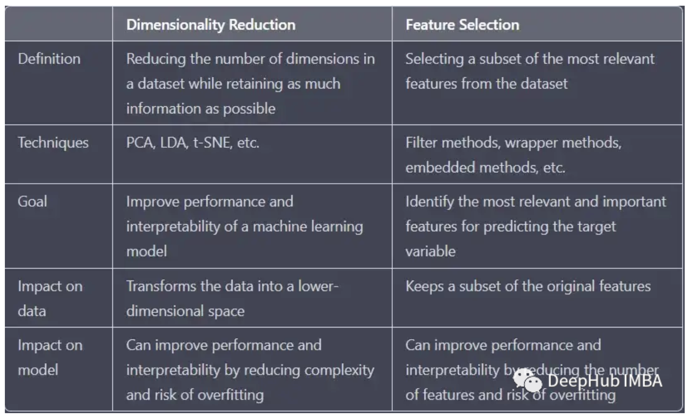
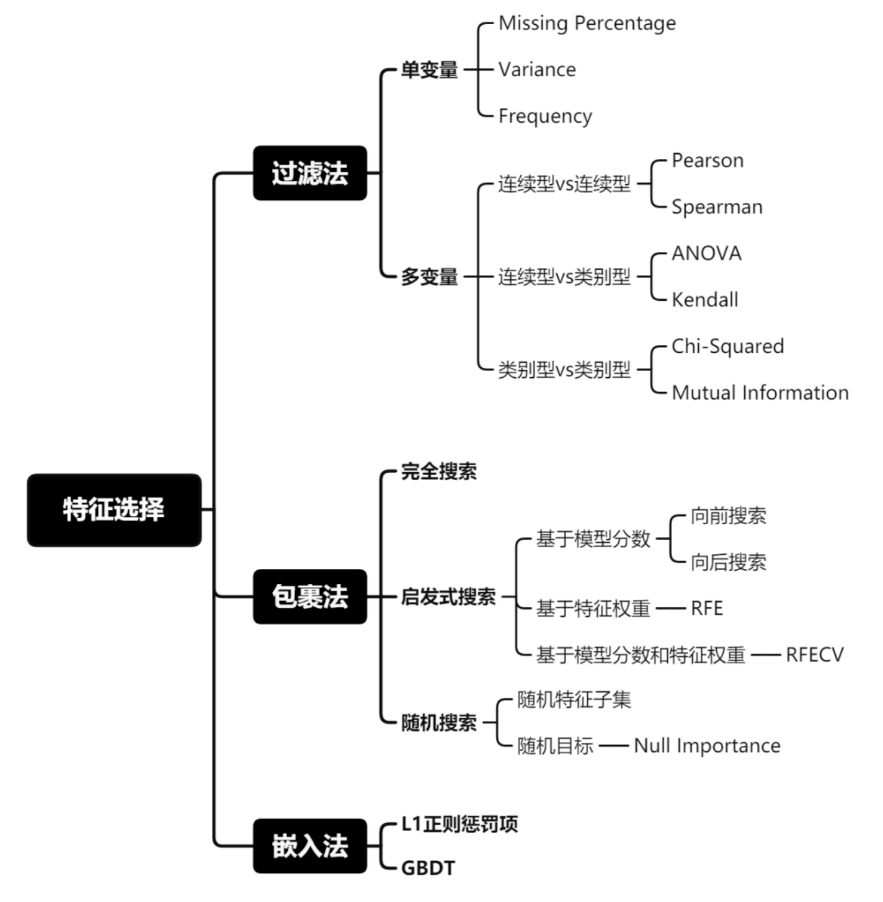
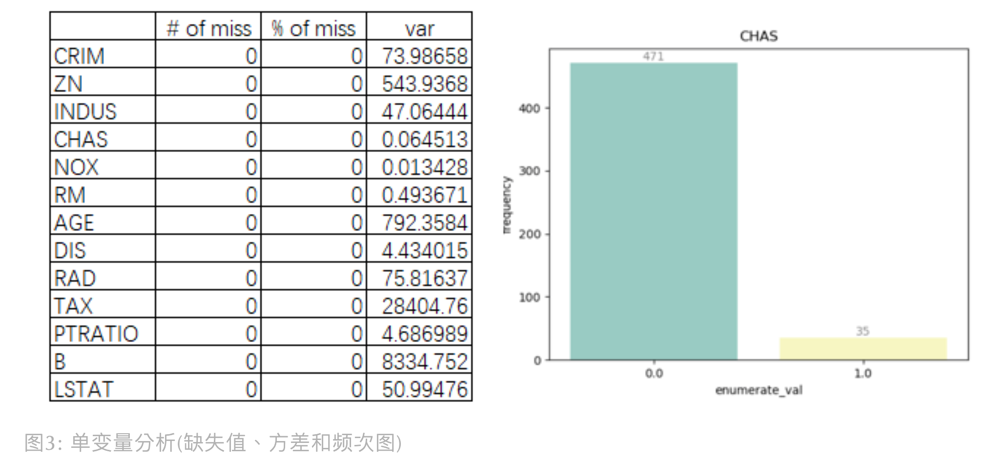
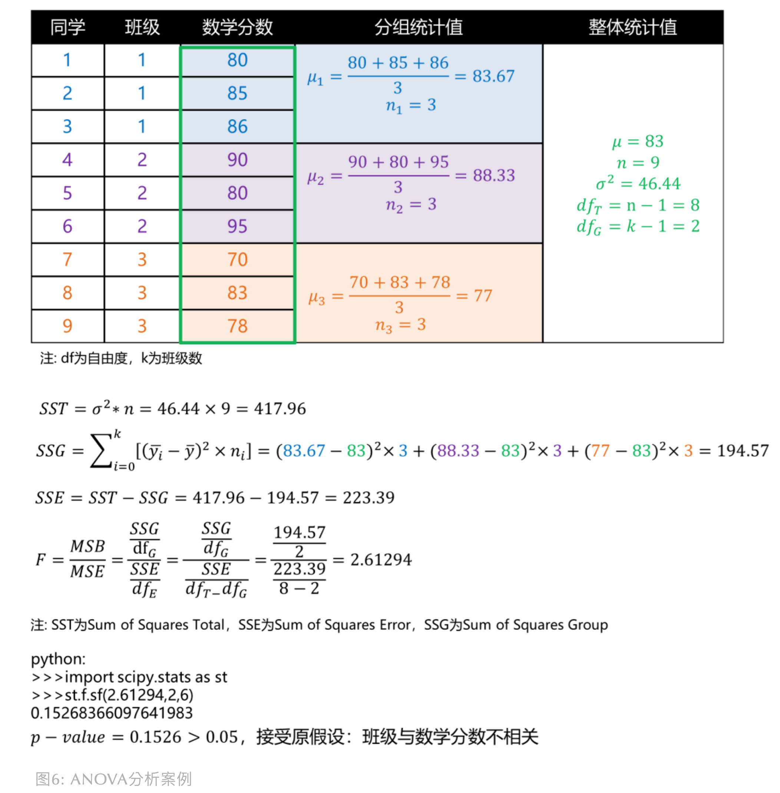
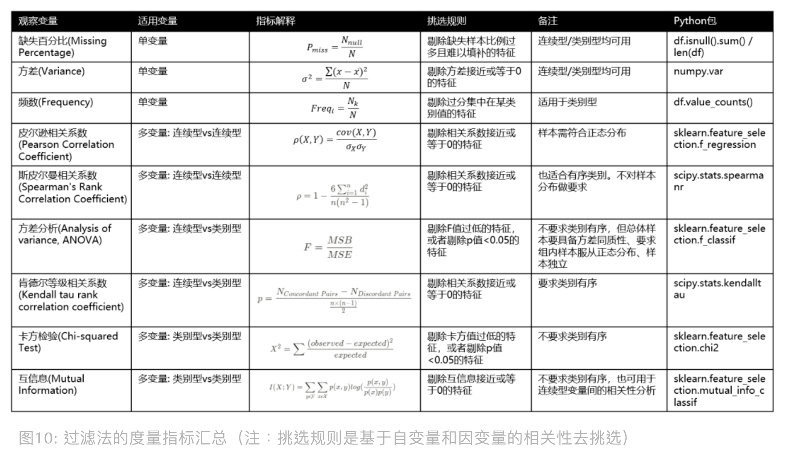
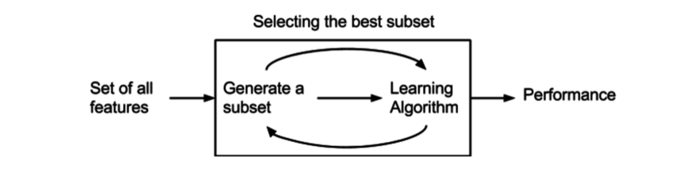
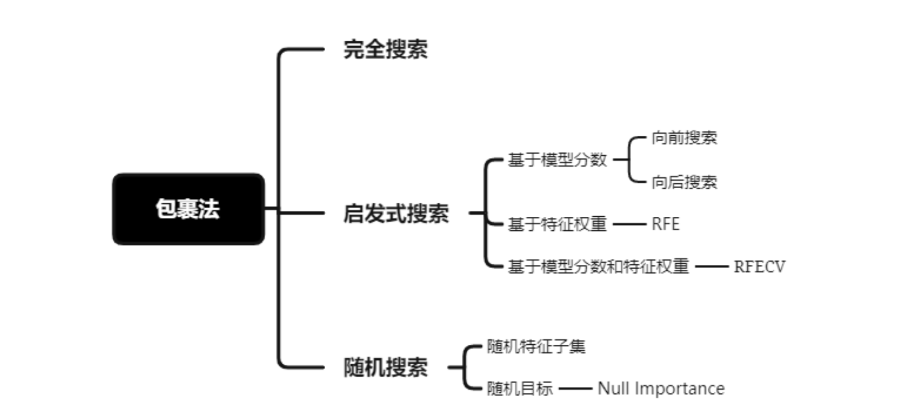
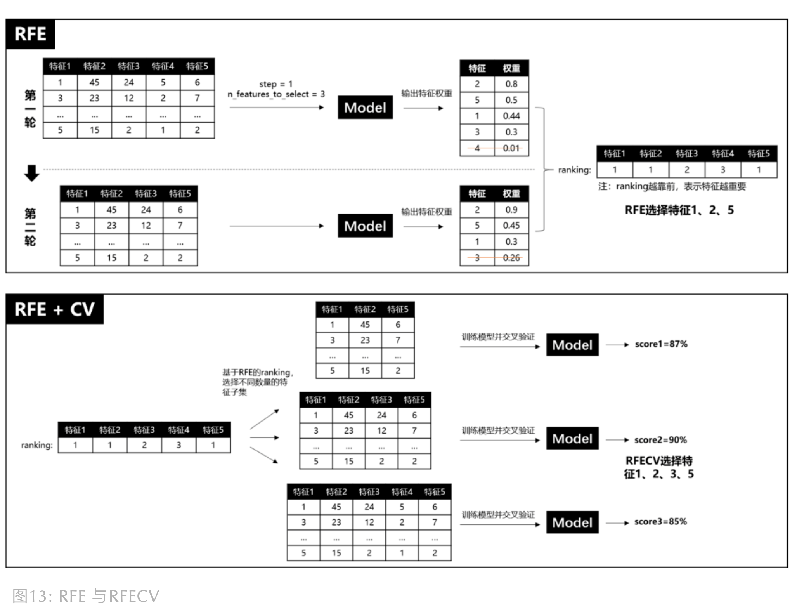
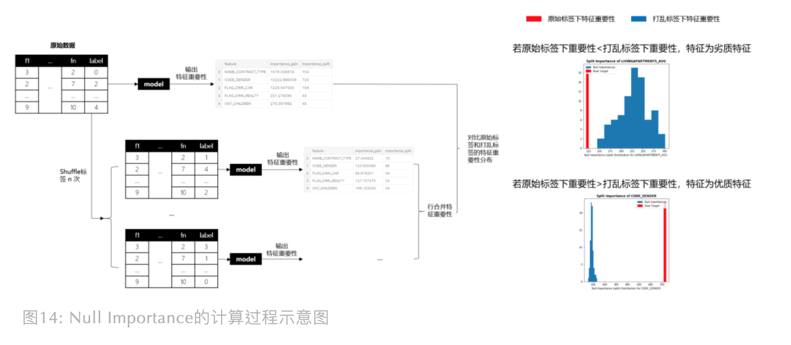
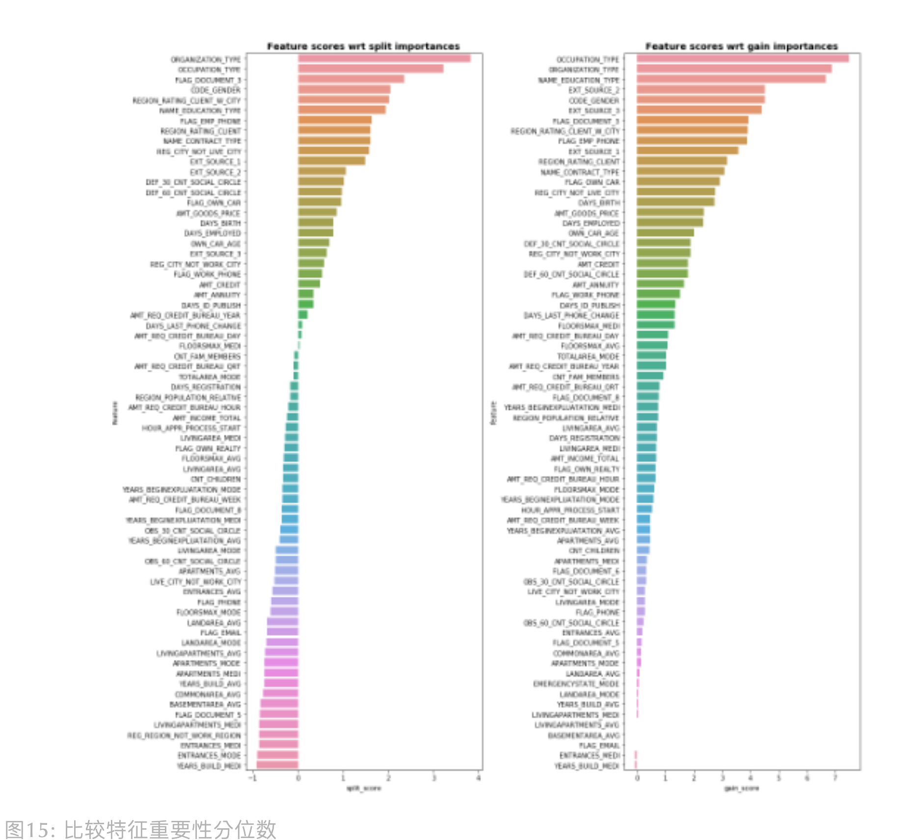

<style>
details {
    border: 1px solid #aaa;
    border-radius: 4px;
    padding: .5em .5em 0;
}
summary {
    font-weight: bold;
    margin: -.5em -.5em 0;
    padding: .5em;
}
details[open] {
    padding: .5em;
}
details[open] summary {
    border-bottom: 1px solid #aaa;
    margin-bottom: .5em;
}
</style>

<details><summary>目录</summary><p>

- [降维和特征选择](#降维和特征选择)
- [特征选择简介](#特征选择简介)
  - [特征选择介绍](#特征选择介绍)
  - [特征选择方法](#特征选择方法)
- [过滤法](#过滤法)
  - [单变量](#单变量)
    - [缺失百分比](#缺失百分比)
    - [方差选择法](#方差选择法)
    - [频数](#频数)
  - [多变量](#多变量)
    - [连续型 vs 连续型](#连续型-vs-连续型)
      - [Pearson 相关系数法](#pearson-相关系数法)
      - [Spearman 相关系数](#spearman-相关系数)
    - [连续型 vs 类别型](#连续型-vs-类别型)
      - [方差分析](#方差分析)
      - [Kendall 等级相关系数](#kendall-等级相关系数)
    - [类别型 vs 类别型](#类别型-vs-类别型)
      - [卡方检验](#卡方检验)
      - [互信息](#互信息)
  - [过滤法总结](#过滤法总结)
- [打包法](#打包法)
  - [完全搜索](#完全搜索)
  - [启发式搜索](#启发式搜索)
    - [向前向后搜索](#向前向后搜索)
    - [递归特征消除](#递归特征消除)
  - [随机搜索](#随机搜索)
    - [随机特征子集](#随机特征子集)
    - [Null Importance](#null-importance)
- [嵌入式方法](#嵌入式方法)
  - [基于正则化](#基于正则化)
  - [基于树模型](#基于树模型)
- [特征重要性评估](#特征重要性评估)
  - [随机森林](#随机森林)
- [参考](#参考)
</p></details><p></p>

# 降维和特征选择

在机器学习中，特征降维和特征选择是两个常见的概念。特征降维和特征选择的目的都是使数据的特征维数降低，
但实际上两者的区别是很大，它们的本质是完全不同的

特征选择从数据集中选择最重要特征的子集，特征选择不会改变原始特征的含义和数值，只是对原始特征进行筛选。
而降维将数据转换为低维空间，会改变原始特征中特征的含义和数值，可以理解为低维的特征映射。
这两种策略都可以用来提高机器学习模型的性能和可解释性，但它们的运作方式是截然不同的



在回归问题中，当输入(数据)变量的维度比较高时(比如：输入变量维度高于样本的个数)，
如果我们继续使用像 LSE(最小二乘方法)等简单方法时就会产生很多问题

在高维问题中产生的最重要的两个问题是：

* 多重共线性 (Multicollinearity)
    - 一些输入变量会高度相关
    - 当输入变量维度高于样本的个数时，最小二乘估计将不是唯一的
* 过拟合 (Overfitting)
    - 模型在训练过程中将训练数据(少数样本)的一些特性学习到模型中而作为所有数据(总体)的共性，
      以至于使得模型在训练数据外的其他数据样本上的效果很差

当我们使用数据训练模型的时候，很重要的一点就是要在过拟合与欠拟合之间达到一个平衡。防止过拟合的一种方法就是对模型的复杂度进行约束。
模型中用到的解释变量的个数是模型复杂度的一种体现。控制解释变量个数有很多方法，例如变量选择 (feature selection)，
即用 filter 或 wrapper 方法提取解释变量的最佳子集。或是进行变量构造 (feature construction)，也称为将维技术，
即将原始变量进行某种映射或转换，如主成分方法和因子分析。变量选择的方法是比较“硬”的方法，变量要么进入模型，要么不进入模型，
只有 0-1 两种选择。但也有“软”的方法，也就是 Regularization 类方法

解决高维问题的方法或措施：

* 变量选择 (Variable selection)
    - 最优子集选择 (Best subset selection)
    - 逐步选择 (stepwise selection)
* 正则化 (Regularization)
    - Ridge
    - LASSO
    - SCAD
    - elastic net
* 降维 (Dimension reduction techniques)
    - 主成分分析(回归) (Principal component regression)
    - 因子分析 (Factor analysis)
    - 偏最小二乘 (Partial least squares)

# 特征选择简介


## 特征选择介绍

在数据集中选择一个特征子集用于机器学习模型的过程被称为特征选择。
特征选择的目的是发现对预测目标变量最相关和最重要的特征，
可以精简掉无用的特征，以降低最终模型的复杂性，它的最终目的是得到一个简约模型，
在不降低预测准确率或对预测准确率影响不大的情况下提高计算速度

在处理结构型数据时，特征工程中的特征选择是很重要的一个环节，
特征选择是选择对模型重要的特征。它的好处在于:

* 改进的模型可解释性：通过 减少模型中的特征数量，可以更容易地掌握和解释变量和模型预测之间的关系
* 降低过拟合的危险：减少模型复杂度，避免过拟合。当一个模型包含太多特征时，
  它更有可能过拟合，这意味着它在训练数据上表现良好，但在新的未知数据上表现不佳。
  通过选择最相关特征的子集，可以帮助限制过拟合的风险
* 改进模型性能：通过从模型中删除不相关或多余的特征，如果选择对的特征子集，模型准确率可能会提升，可以提高模型的性能和准确性

通常来说，从两个方面考虑来选择特征：

* 特征是否发散
    - 如果一个特征不发散，例如方差接近于 0，也就是说样本在这个特征上基本上没有差异，
      这个特征对于样本的区分并没有什么用
* 特征与目标的相关性
    - 这点比较显见，与目标相关性高的特征，应当优选选择。
      除方差法外，其他方法均从相关性考虑

## 特征选择方法

根据特征选择的形式可以将特征选择方法分为三种：

* Filter：过滤法
    - 按照发散性或者相关性对各个特征进行评分，设定阈值或者待选择阈值的个数，选择特征
* Wrapper：包装法
    - 根据目标函数（通常是预测效果评分），每次选择若干特征，或者排除若干特征
* Embedded：嵌入法
    - 先使用某些机器学习的算法和模型进行训练，得到各个特征的权值系数，
      根据系数从大到小选择特征。类似于 Filter 方法，但是是通过训练来确定特征的优劣

可以使用 `sklearn` 中的 `feature_selection` 库来进行特征选择



在进行特征选择时，建议过滤法、包裹法和嵌入法都尝试使用，前期的特征过滤有利于减轻模型的学习负担。
当然最高级的特征选择还是基于业务知识的人工挑选，以上方法挑选出的特征也建议多思考为什么这个特征对模型有帮助，
以及挑选的优质特征有没有更进一步深入挖掘的可能

# 过滤法

> Filter，过滤法

过滤法: 选择特征时不管模型，该方法基于特征的通用表现去选择，比如: 目标相关性、自相关性和发散性等。
对特征进行预处理, 除去那些不太可能对模型有用处的特征。一般通过计算特征与相应变量之间的相关性或互信息, 
然后过滤掉那些在某个阈值之下的特征

* 优点：特征选择计算开销小，且能有效避免过拟合
* 缺点：没考虑针对后续要使用的学习器去选择特征子集，可能无法为模型选择出正确的特征，减弱学习器拟合能力


## 单变量

### 缺失百分比

> Missing Percentage

缺失样本比例过多且难以填补的特征，建议剔除该变量

### 方差选择法

> Variance

使用方差选择法，先要计算各个特征的方差，然后根据阈值，选择方差大于阈值的特征。
若某连续型变量的方差接近于 0，说明其特征值趋向于单一值的状态，对模型帮助不大，建议剔除该变量

可以使用 `sklearn.feature_selection` 库的 `VarianceThreshold` 类来选择特征：

```python
from sklearn.feature_selection import VarianceThreshold

# 方差选择法，返回值为特征选择后的数据，参数 threshold 为方差的阈值
VarianceThreshold(threshold = 3).fit_transform(df.data)
```

### 频数

> Frequency

若某类别型变量的枚举值样本量占比分布集中在单一某枚举值上，建议剔除该变量

```python
# load Boston dataset
import pandas as pd
import numpy as np
import seaborn as sns
import matplotlib.pyplot as plt
from sklearn.datasets import load_boston


boston = load_boston()
df = pd.DataFrame(boston.data, columns = boston.feature_names)

# Missing Percentage + Variance
stat_df = pd.DataFrame({
    '# of miss': df.isnull().sum(),
    '% of miss': df.isnull().sum() / len(df) * 100,
    'var': df.var()
})

# Frequency
cat_name = 'CHAS'
chas = df[cat_name].value_counts().sort_index()
cat_df = pd.DataFrame({
    'enumerate_val': list(chas.index), 
    'frequency':list(chas.values)
})
sns.barplot(x = "enumerate_val", y = "frequency", data = cat_df, palette = "Set3")

for x, y in zip(range(len(cat_df)), cat_df.frequency):
    plt.text(x, y, '%d'%y, ha = 'center', va = 'bottom', color = 'grey')
plt.title(cat_name)
plt.show()
```



## 多变量

研究多变量之间的关系时，主要从两种关系出发:

* 自变量与自变量之间的相关性
    - 相关性越高，会引发多重共线性问题，进而导致模型稳定性变差，
      样本微小扰动都会带来大的参数变化，建议在具有共线性的特征中选择一个即可，其余剔除
* 自变量和因变量之间的相关性
    - 相关性越高，说明特征对模型预测目标更重要，建议保留

由于变量分连续型变量和类别型变量，所以在研究变量间关系时，也要选用不同的方法

### 连续型 vs 连续型

#### Pearson 相关系数法

> Pearson Correlation Coefficient，皮尔逊相关系数

Pearson 相关系数是两个变量的协方差除以两变量的标准差乘机。
协方差能反映两个随机变量的相关程度（协方差大于 0 的时候表示两者正相关，小于 0 的时候表示两者负相关），
而除以标准差后，Pearson 的值范围为 `[-1,1]`。当两个变量的线性关系增强时，相关系数趋于 1 或 -1，
正负号指向正负相关关系

`$$\begin{align}
\rho(X, Y) &= \frac{cov(X, Y)}{\rho_{X}\rho_{Y}} \\
&= \frac{\frac{\sum_{i=1}^{n}(X_{i} - \bar{X})(Y_{i} - \bar{Y})}{n-1}}{\sqrt{\frac{\sum_{i=1}^{n}(X_{i} - \mu_{X})^{2}}{n-1}}\sqrt{\frac{\sum_{i=1}^{n}(Y_{i} - \mu_{Y})^{2}}{n-1}}} \\
&= \frac{E[(X - \mu_{X})(Y - \mu_{Y})]}{\sqrt{\sum_{i=1}^{n}(X_{i} - \mu_{X})^{2}}\sqrt{\sum_{i=1}^{n}(Y_{i} - \mu_{Y})^{2}}}
\end{align}$$`

#### Spearman 相关系数

> Spearman's Rank Correlation Coefficient，斯皮尔曼相关系数

Pearson 相关系数是建立在变量符合正态分布的基础上，而 Spearman 相关系数不假设变量服从何种分布，
它是基于等级(rank)的概念去计算变量间的相关性。如果变量是顺序变量(Ordinal Feature)，
推荐使用 Spearman 相关系数

`$$\rho = 1- \frac{6\sum_{i=1}^{n}d_{i}^{2}}{n(n^{2} - 1)}$$`

其中：

* `$d$` 为两个变量的等级差值
* `$n$` 为等级个数

同样地，相关系数趋于 1 或 -1，正负号指向正负相关关系

这里举个例子会更好理解，假设我们要探究连续型变量 `$X$` 和 `$Y$` 的 Spearman 相关系数，
计算过程如下：


### 连续型 vs 类别型

#### 方差分析

> Analysis of variance, ANOVA

ANOVA 的目的是检验不同组下的平均数是否存在显著差异

举个例子，我们要判断 1，2 和 3 班的同学的数学平均分是否有显著区别？我们能得到，班级为类别型变量，
数学分数为连续型变量，如果班级与数学分数有相关性，比如 1 班同学数学会更好些，
则说明不同班的数学平均分有显著区别。为了验证班级与数学分数的相关性，
ANOVA 会先建立零假设：`$H0: \mu_{1}=\mu_{2}=\mu_{3}$` (三个班的数学分数没有显著区别)，
它的验证方式是看组间方差(Mean Squared Between, MSB)是否大于组内方差(Mean Squared Error, MSE)，
如果组间方差 > 组内方差，说明存在至少一个分布相对于其他分布较远，则可以考虑拒绝零假设

`$$F = \frac{MSB}{MSE}$$`

基于纽约 Johnny 哥在知乎 “什么是 ANOVA” 的回答，我们举例来试着计算下：



注意，ANOVA 分析前需要满足 3 个假设: 每组样本具备方差同质性、组内样本服从正态分布，样本间需要独立

#### Kendall 等级相关系数

假设我们要评价学历与工资的相关性，Kendall系数会对按学历对样本排序，若排序后，学历和工资排名相同，则Kendall系数为1，两变量正相关。若学历和工资完全相反，则系数为-1，完全负相关。而如果学历和工资完全独立，系数为0。Kendall系数计算公式如下：

`$$p=\frac{N_{Concordant Pairs} - N_{Discordant Pairs}}{\frac{n(n-1)}{2}}}$$`

其中：

* `$N_{Concordant Pairs}$` 为同序对
* `$N_{Discordant Pairs}$` 为异序对
* `$\frac{n(n-1)}{2}}$` 为总对数

举例展示下计算过程：


### 类别型 vs 类别型

#### 卡方检验

> Chi-squared Test

卡方检验可用于检验两个类别型变量之间的相关性。它建立的零假设是：两变量之间不相关。


卡方值 `$X^{2}$` 的计算公式如下：

`$$X^{2} = \sum\frac{(observed - expected)^{2}}{expected}$$`

其中：

* `$observed$` 是实际值
* `$expected$` 是理论值

卡方值的目的是衡量理论和实际的差异程度，卡方值高，说明两变量之间具有相关性的可能性更大

如果我们研究运动的人是否会受伤，计算过程如下：


#### 互信息

互信息是衡量变量之间相互依赖程度，它的计算公式如下：

`$$I(X, Y) = \underset{y \in Y}{\sum}\underset{x \in X}{\sum}p(x, y)log(\frac{p(x,y)}{p(x)p(y)})$$`

它可以转为熵的表现形式，其中 `$H(X|Y)$` 和 `$H(Y|X)$` 是条件熵，`$H(X,Y)$` 是联合熵。
当 `$X$` 与 `$Y$` 独立时，`$p(x,y)=p(x)p(y)$`，则互信息为 0。当两个变量完全相同时，
互信息最大，因此互信息越大，变量相关性越强。此外，互信息是正数且具有对称性(即 `$I(X;Y)=I(Y;X)$`)


## 过滤法总结

总结以上内容：



我们可以按需使用上面的指标去观察变量间的相关性，然后人工挑选特征。另外，
也能使用 scikit-learn 里的特征选择库 sklearn.feature_selection，
这里我以 SelectKBest (选择 Top K 个最高得分的特征)为例：

```python

# load Boston dataset
import pandas as pd
import numpy as np
from sklearn.datasets import load_boston
from sklearn.feature_selection import SelectKBest
from sklearn.feature_selection import f_regression

boston = load_boston()
df = pd.DataFrame(boston.data, columns = boston.feature_names)
target = pd.DataFrame(boston.target, columns=['MEDV'])
print('X.shape:', df.shape)

# select feature by person coefficient
X = np.array(df)
Y = np.array(target)
skb = SelectKBest(score_func=f_regression, k=5)
skb.fit(X, Y.ravel())
print('选择的特征有:', [boston.feature_names[i] for i in skb.get_support(indices = True)])
X_selected = skb.transform(X)
print('X_selected.shape:', X_selected.shape)
```

# 打包法

> Wrapper，打包法/包装法/包裹法：试验特征的各个子集



包裹法: 将要使用的学习器的性能作为特征子集的评价准则，目的是为给的学习器选择 “量身定做” 的特征子集

* 优点: 特征选择比过滤法更具针对性，对模型性能有好处。
* 缺点: 计算开销更大。

包裹法有如下三类搜索方法:



实际使用中，推荐 RFECV 和 Null Importance，因为他们既考虑了特征权重也考虑了模型表现

> 变量选择方法的原则：
> 
> * 一个好的模型拥有小的测试误差(test error)
>     * 预测准确
>     * 低残差
> 
> 变量选择中估计测试误差(test error)的准则：
> 
> * Mallow’s Cp
>     - Cp adds a penalty as number of variables (flexibility) increases. Choose the lowest Cp
>     
> `$$Cp=\frac{1}{n}(RSS+2p\sigma^{2})$$`
> 
> * AIC
>     - Similar to Cp, but can be generalized to non-linear models. Choose the lowest AIC.
> 
> `$$AIC=2n(p−loglik)$$`
> 
> 
> * BIC
>     - Proportional to AIC, but penalizes flexibility more heavily. Choose the lowest BIC.
> 
> `$$BIC = −2\cdot loglik + plog(n)$$`
> 
> 
> * Adjusted R2
>     - Adds penalty to R2 for unnecessary variables. 
>       Popular, but not as statistically well-founded as Cp, AIC and BIC. 
>       Choose the highest Adjusted R2
> 
> `$$R^{2}=1−\frac{\frac{RSS}{n−p−1}}{\frac{TSS}{n−1}}$$`


## 完全搜索

遍历所有可能组合的特征子集，然后输入模型，选择最佳模型分数的特征子集。不推荐使用，计算开销过大

* 最优子集选择 (best subset selection)
    - Find the prediction error for every possible subset of variables. 
      Use the subset with the lowest test error.

## 启发式搜索

启发式搜索是利用启发式信息不断缩小搜索空间的方法。在特征选择中，模型分数或特征权重可作为启发式信息

### 向前向后搜索

向前搜索是先从空集开始，每轮只加入一个特征，然后训练模型，若模型评估分数提高，
则保留该轮加入的特征，否则丢弃。反之，向后特征是做减法，先从全特征集开始，
每轮减去一个特征，若模型表现减低，则保留特征，否则弃之

* 逐步选择(stepwise section)
    - 向后逐步选择 (Backwards selection)
        - Start with every variable in the model. 
          Then delete the variable who’s omission improves the test error the most. 
          Continue until you cannot improve the test error.
    - 向前逐步选择 (Forward selection)
        - Start with no variables in the model. 
          Then add the variable that improves the test error the most. 
          Continue until you cannot improve the test error.
    - 向前向后逐步选择(Backwards Forward selection)

### 递归特征消除

递归特征消除简称 RFE(Recursive Feature Elimination)，RFE 是使用一个基模型进行多轮训练，
每轮训练后，消除若干低权值(例特征权重系数或者特征重要性)的特征，再基于新的特征集进行下一轮训练。
RFE 使用时，要提前限定最后选择的特征数(n_features_to_select)，这个超参很难保证一次就设置合理，
因为设高了，容易特征冗余，设低了，可能会过滤掉相对重要的特征。而且 RFE 只是单纯基于特征权重去选择，
没有考虑模型表现，因此 RFECV 出现了，REFCV 是 REF + CV(交叉验证)，
它的运行机制是：先使用REF获取各个特征的 ranking，然后再基于 ranking，
依次选择 [min_features_to_select, len(feature)] 个特征数量的特征子集进行模型训练和交叉验证，
最后选择平均分最高的特征子集

递归消除特征法使用一个基模型来进行多轮训练，每轮训练后，
消除若干权值系数的特征，再基于新的特征集进行下一轮训练



可以使用 `sklearn.feature_selection` 库的 `RFE` 类来选择特征：

```python
from sklearn.feature_selection import RFE
from sklearn.linear_model import LogisticRegression

# 递归特征消除法，返回特征选择后的数据
# 参数estimator为基模型
# 参数 n_features_to_select 为选择的特征个数
RFE(
    estimator = LogsiticRegression(), 
    n_features_to_select = 2
).fit_transform(
    iris.data, 
    iris.target
)
```

```python
### 生成数据
from sklearn.datasets import make_classification
X, y = make_classification(n_samples=1000,         # 样本个数
                           n_features=25,          # 特征个数
                           n_informative=3,        # 有效特征个数
                           n_redundant=2,          # 冗余特征个数（有效特征的随机组合）
                           n_repeated=0,           # 重复特征个数（有效特征和冗余特征的随机组合）
                           n_classes=8,            # 样本类别
                           n_clusters_per_class=1, # 簇的个数
                           random_state=0)

### 特征选择
# RFE
from sklearn.svm import SVC
svc = SVC(kernel="linear")

from sklearn.feature_selection import RFE
rfe = RFE(estimator = svc,           # 基分类器
          n_features_to_select = 2,  # 选择特征个数
          step = 1,                  # 每次迭代移除的特征个数 
          verbose = 0                # 显示中间过程
          ).fit(X,y)
X_RFE = rfe.transform(X)
print("RFE特征选择结果——————————————————————————————————————————————————")
print("有效特征个数 : %d" % rfe.n_features_)
print("全部特征等级 : %s" % list(rfe.ranking_))

# RFECV
from sklearn.svm import SVC
svc = SVC(kernel="linear")

from sklearn.model_selection import StratifiedKFold
from sklearn.feature_selection import RFECV
rfecv = RFECV(estimator=svc,          # 学习器
              min_features_to_select=2, # 最小选择的特征数量
              step=1,                 # 移除特征个数
              cv=StratifiedKFold(2),  # 交叉验证次数
              scoring='accuracy',     # 学习器的评价标准
              verbose = 0,
              n_jobs = 1
              ).fit(X, y)
X_RFECV = rfecv.transform(X)
print("RFECV特征选择结果——————————————————————————————————————————————————")
print("有效特征个数 : %d" % rfecv.n_features_)
print("全部特征等级 : %s" % list(rfecv.ranking_))
```

## 随机搜索

### 随机特征子集

随机选择多个特征子集，然后分别评估模型表现，选择评估分数高的特征子集

### Null Importance

3 年前 Kaggle GM Olivier 提出 Null Importance 特征挑选法，最近看完代码，觉得真妙。
它成功找出“见风使舵”的特征并剔除了它们，什么是“见风使舵”的特征呢？
多见于标识性强或充满噪声的特征，举个例子，如果我们把 userID 作为特征加入模型，
预测不同 userID 属于哪类消费人群，一个过拟合的模型，
可以会学到 userID 到消费人群的直接映射关系(相当于模型直接记住了这个userID是什么消费人群)，
那如果我假装把标签打乱，搞个假标签去重新训练预测，我们会发现模型会把 userID 又直接映射到打乱的标签上，
最后真假标签下，userID “见风使舵”地让都自己变成了最重要的特征。我们怎么找出这类特征呢？
Olivier 的想法很简单：真正强健、稳定且重要的特征一定是在真标签下特征很重要，
但一旦标签打乱，这些优质特征的重要性就会变差。相反地，如果某特征在原始标签下表现一般，
但打乱标签后，居然重要性上升，明显就不靠谱，这类“见风使舵”的特征就得剔除掉

Null Importance的计算过程大致如下:

1. 在原始数据集运行模型获取特征重要性
2. shuffle 多次标签，每次 shuffle 后获取假标签下的特征重要性
3. 计算真假标签下的特征重要性差异，并基于差异，筛选特征



在上图我们能知道 Null Importance 的大致运行流程，但这里补充些细节，
其中，重要性你可以选择 importance_gain 或者 importance_split。
另外，如上图所示，如果我们要比较原始标签和打乱标签下的特征重要性，Olivier 提供了两种比较方法：

第一种：分位数比较

`$$Feature Score = log(10^{-10} + \frac{Importance_{real label}}{1 + percentile(Importance_{shuffle label}, 75)})$$`

`$10^{-10}$` 和 `$1$` 为了避免 `$log(0)$` 和分母为 0 的情况。输出样例如下：



第二种：次数占比比较

`$$Feature Score = \frac{\sum() < percentile(importance_{real label}, 25)}{n_{importance_{shuffle label}}}$$`

正常来说，单个特征只有 1 个 `$Importance_{real label}$`，之所以作者要求 25 分位数，
是考虑到如果使用时，我们也对原始特征反复训练生成多组特征重要性，所以才就加了 25 分位数。输出样例如下：


由上可知，第二种方法得到的特征分数是在 0-100 范围内，因此 Olivier 选择在第二种方法上，
采用不同阈值去筛选特征，然后评估模型表现。推荐阅读 Olivier 的开源代码，简单易懂

# 嵌入式方法

> Embedded，嵌入法


嵌入法：特征选择被嵌入进学习器训练过程中。不像包裹法，特性选择与学习器训练过程有明显的区分。
嵌入式方法将特征选择作为模型训练过程的一部分

嵌入法的优缺点：

* 优点: 比包裹法更省时省力，把特征选择交给模型去学习
* 缺点: 增加模型训练负担

常见的嵌入法有 LASSO 的 L1 正则惩罚项、随机森林构建子树时会选择特征子集。
嵌入法的应用比较单调，`sklearn` 有提供 `SelectFromModel`，可以直接调用模型挑选特征。

* L1 正则化可以添加到任意线性模型的训练目标中，L1 正则化鼓励模型使用更少的特征，所以也称为稀疏性约束
    - LASSO
* 特征选择是决策树与生俱来的功能, 因为它在每个训练阶段都要选择一个特征来对树进行分割
    - 决策树
    - GBM
    - XGBoost
    - LightGBM
    - CatBoost
    - RandomForest

参考样例代码如下：

```python
from sklearn.datasets import load_iris
from sklearn.feature_selection import SelectFromModel
from sklearn.linear_model import LogisticRegression
from sklearn.ensemble import GradientBoostingClassifier

iris = load_iris()

# 将待 L1 惩罚项的逻辑回归作为基模型的特征选择
selected_data_lr = SelectFromModel(
    LogisticRegression(
        penalty = 'l1', 
        C = 0.1, 
        solver = 'liblinear'
    ), 
    max_features = 3
).fit_transform(iris.data, iris.target)

# 将 GBDT 作为基模型的特征选择
selected_data_gbdt = SelectFromModel(
    GradientBoostingClassifier(), 
    max_features = 3
).fit_transform(iris.data, iris.target)

print(iris.data.shape)
print(selected_data_lr.shape)
print(selected_data_gbdt.shape)
```

## 基于正则化

使用带惩罚项的基模型，除了筛选出特征外，同时也进行了降维

使用 `sklearn.feature_selection` 库的 `SelectFromModel` 类结合带 L1 惩罚项的逻辑回归模型：

```python
from sklearn.feature_selection import SelectFromModel
from sklearn.linear_model import LogisticRegression

SelectFromModel(
    LogisticRegression(penalty = "l1", C = 0.1)
).fit_transform(iris.data, iris.target)
```

L1 惩罚项降维的原理在于保留多个对目标值具有同等相关性的特征中的一个，所以没选到的特征不代表不重要。
所以可结合 L2 惩罚项来优化，具体操作为：若一个特征在 L1 中的权值为 1，
选择在 L2 中权值差别不大且在 L1 中权值为 0 的特征构成同类集合，
将这一集合中的特征平分 L1 中的权值，故需要构建一个新的逻辑回归模型

```python
from sklearn.linear_model import LogisticRegression 

class LR(LogisticRegression): 

    def __init__(self, 
                 threshold = 0.01, 
                 dual = False, 
                 tol = 1e-4, 
                 C = 1.0,
                 fit_intercept = True, 
                 intercept_scaling = 1, 
                 class_weight = None,
                 random_state = None, 
                 solver = 'liblinear', 
                 max_iter = 100,
                 multi_class = 'ovr', 
                 verbose = 0, 
                 warm_start = False, 
                 n_jobs = 1):
        # 权值相近的阈值
        self.threshold = threshold 
        LogisticRegression.__init__(
            self, 
            penalty='l1', 
            dual = dual, 
            tol = tol, 
            C = C, 
            fit_intercept = fit_intercept, 
            intercept_scaling = intercept_scaling, 
            class_weight = class_weight, 
            random_state = random_state, 
            solver = solver, 
            max_iter = max_iter, 
            multi_class = multi_class, 
            verbose = verbose, 
            warm_start = warm_start, 
            n_jobs = n_jobs
        ) 
        # 使用同样的参数创建 L2 逻辑回归
        self.l2 = LogisticRegression(
            penalty = 'l2', 
            dual = dual, 
            tol = tol, 
            C = C, 
            fit_intercept = fit_intercept, 
            intercept_scaling = intercept_scaling, 
            class_weight = class_weight, 
            random_state = random_state, 
            solver = solver, 
            max_iter = max_iter, 
            multi_class = multi_class, 
            verbose = verbose, 
            warm_start = warm_start, 
            n_jobs = n_jobs
        ) 

    def fit(self, X, y, sample_weight = None): 
        # 训练 L1 逻辑回归
        super(LR, self).fit(X, y, sample_weight = sample_weight)
        self.coef_old_ = self.coef_.copy() 
        # 训练 L2 逻辑回归
        self.l2.fit(X, y, sample_weight = sample_weight) 

        cntOfRow, cntOfCol = self.coef_.shape 
        # 权值系数矩阵的行数对应目标值的种类数目
        for i in range(cntOfRow):
            for j in range(cntOfCol): 
                coef = self.coef_[i][j] 
                # L1 逻辑回归的权值系数不为 0
                if coef != 0: 
                    idx = [j] 
                    # 对应在 L2 逻辑回归中的权值系数
                    coef1 = self.l2.coef_[i][j] 
                    for k in range(cntOfCol): 
                        coef2 = self.l2.coef_[i][k] 
                        # 在 L2 逻辑回归中，权值系数之差小于设定的阈值，且在 L1 中对应的权值为0
                        if abs(coef1-coef2) < self.threshold and j != k and self.coef_[i][k] == 0: 
                            idx.append(k) 
                    # 计算这一类特征的权值系数均值
                    mean = coef / len(idx) 
                    self.coef_[i][idx] = mean 
        return self
```

使用 `sklearn.feature_selection` 库的 `SelectFromModel` 类结合带 L1 以及 L2 惩罚项的逻辑回归模型，
来选择特征的代码如下：

```python
from sklearn.feature_selection import SelectFromModel

# 带 L1 和 L2 惩罚项的逻辑回归作为基模型的特征选择
# 参数 threshold 为权值系数之差的阈值
SelectFromModel(LR(threshold = 0.5, C = 0.1)).fit_transform(iris.data, iris.target)
```

## 基于树模型

树模型中 GBDT 也可用来作为基模型进行特征选择

使用 `sklearn.feature_selection` 库的 `SelectFromModel` 类结合 GBDT 模型

```python
from sklearn.feature_selection import SelectFromModel
from sklearn.ensemble import GradientBoostingClassifier

SelectFromModel(
    GradientBoostingClassifier()
).fit_transform(
    iris.data, 
    iris.target
)
```

# 特征重要性评估

## 随机森林

```python
import numpy as np
import pandas as pd
try:
    from sklearn.cross_validation import train_test_split
except:
    from sklearn.model_selection import train_test_split
from sklearn.ensemble import RandomForestClassifier

# data
data_url = 'http://archive.ics.uci.edu/ml/machine-learning-databases/wine/wine.data'
df = pd.read_csv(data_url, header = None)
df.columns = [
    'Class label', 'Alcohol', 'Malic acid', 'Ash', 
    'Alcalinity of ash', 'Magnesium', 'Total phenols', 
    'Flavanoids', 'Nonflavanoid phenols', 'Proanthocyanins', 
    'Color intensity', 'Hue', 'OD280/OD315 of diluted wines', 'Proline'
]

# data split
x, y = df.iloc[:, 1:].values, df.iloc[:, 0].values
x_train, x_test, y_train, y_test = train_test_split(x, y, test_size = 0.3, random_state = 0)
feat_labels = df.columns[1:]

# model
rf_clf = RandomForestClassifier(
    n_estimators = 10000,
    random_state = 0,
    n_jobs = -1,
)
rf_clf.fit(x_train, y_train)

importances = rf_clf.feature_importances_
indices = np.argsort(importances)[::-1]
for f in range(x_train.shape[1]):
    print("%2d) %-*s %f" % (f + 1, 30, feat_labels[indices[f]], importances[indices[f]]))

# features selection
threshold = 0.15
x_selected = x_train[:, importances > threshold]
print(x_selected.shape)
```

# 参考

* [利用随机森林评估特征重要性原理与应用](https://mp.weixin.qq.com/s/2O9k0FSY15aHRSZ8D6B5Gg)
* [用机器学习神器sklearn做特征工程](https://mp.weixin.qq.com/s/AwjEfC2wLhUF9Ecgt0kocw)
* [通常使用哑编码的方式将定性特征转换为定量特征](http://www.ats.ucla.edu/stat/mult_pkg/faq/general/dummy.html)
* [L1惩罚项降维的原理在于保留多个对目标值具有同等相关性的特征中的一个](http://www.zhihu.com/question/28641663/answer/41653367)
* [PCA是为了让映射后的样本具有最大的发散性；而LDA是为了让映射后的样本有最好的分类性能](http://www.cnblogs.com/LeftNotEasy/archive/2011/01/08/lda-and-pca-machine-learning.html)
* [《使用 sklearn 优雅地进行数据挖掘》](http://www.cnblogs.com/jasonfreak/p/5448462.html)
* [What is dummy coding?](http://www.ats.ucla.edu/stat/mult_pkg/faq/general/dummy.htm)
* [卡方检验](http://wiki.mbalib.com/wiki/%E5%8D%A1%E6%96%B9%E6%A3%80%E9%AA%8C)
* [结合 Scikit-learn 介绍几种常用的特征选择方法](http://dataunion.org/14072.html)
* [机器学习中有哪些特征选择的工程方法](http://www.zhihu.com/question/28641663/answer/41653367)
* [线性判别分析和主成分分析](http://www.cnblogs.com/LeftNotEasy/archive/2011/01/08/lda-and-pca-machine-learning.html)
* [特征选择方法总结](https://mp.weixin.qq.com/s?__biz=MzUyNzA1OTcxNg==&mid=2247486395&idx=1&sn=df2f5838314fb89d4f7eca03b5339a2a&chksm=fa0415d0cd739cc6a01bd0f9ece6a8d4a3285b61bbee39d66acbff1f9579f43f3281bfcc4914&scene=178&cur_album_id=1577157748566310916#rd)
* [Introduction to Feature Selection methods with an example (or how to select the right variables?](https://www.analyticsvidhya.com/blog/2016/12/introduction-to-feature-selection-methods-with-an-example-or-how-to-select-the-right-variables/#:~:text=The%20main%20differences%20between%20the,training%20a%20model%20on%20it)
* [Feature selection](https://en.wikipedia.org/wiki/Feature_selection#Main_principles)
* [关于多重共线性](https://zhuanlan.zhihu.com/p/96793075)
* [如何理解皮尔逊相关系数](https://www.zhihu.com/question/19734616)
* [对方差分析（ANOVA）的直观解释及计算](https://zhuanlan.zhihu.com/p/57896471)
* [什么是 ANOVA](https://www.zhihu.com/question/320487814)
* [互信息](https://baike.sogou.com/v363043.htm?fromTitle=互信息)
* [【特征选择】包裹式特征选择法](https://www.cnblogs.com/wanglei5205/p/8977467.html)
* [Feature Selection with Null Importances](https://www.kaggle.com/ogrellier/feature-selection-with-null-importances/notebook)
* [sklearn.feature_selection.SelectFromModel](https://scikit-learn.org/stable/modules/generated/sklearn.feature_selection.SelectFromModel.html)
* [特征选择方法总结](https://mp.weixin.qq.com/s?__biz=MzUyNzA1OTcxNg==&mid=2247486395&idx=1&sn=df2f5838314fb89d4f7eca03b5339a2a&chksm=fa0415d0cd739cc6a01bd0f9ece6a8d4a3285b61bbee39d66acbff1f9579f43f3281bfcc4914&scene=178&cur_album_id=1577157748566310916#rd)

