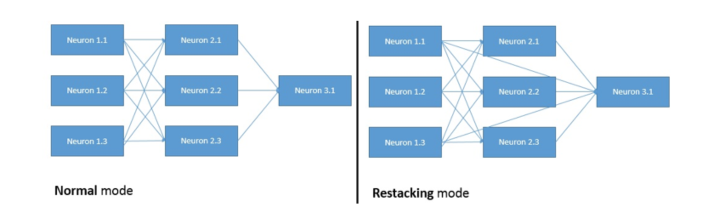

<style>
details {
    border: 1px solid #aaa;
    border-radius: 4px;
    padding: .5em .5em 0;
}
summary {
    font-weight: bold;
    margin: -.5em -.5em 0;
    padding: .5em;
}
details[open] {
    padding: .5em;
}
details[open] summary {
    border-bottom: 1px solid #aaa;
    margin-bottom: .5em;
}
</style>

<details><summary>目录</summary><p>

- [模型融合介绍](#模型融合介绍)
  - [Voting](#voting)
  - [Averaging](#averaging)
  - [Bagging](#bagging)
  - [Boosting](#boosting)
  - [Stacking](#stacking)
- [模型融合工具](#模型融合工具)
  - [StackNet](#stacknet)
    - [介绍](#介绍)
    - [工作原理](#工作原理)
    - [两种形式](#两种形式)
    - [示例](#示例)
    - [参考](#参考)
- [参考](#参考-1)
</p></details><p></p>

# 模型融合介绍

模型融合(Model Fusion, Model Ensemble)是机器学习中一种常见的技术，是通过结合多个模型的预测来提高总体预测的准确率。
模型融合的思路是，在训练多个不同的模型(如不同的算法或不同的超参数)，然后将这些模型的预测结果结合起来，
通常使用 Voting、Bagging、Boosting、Stacking、加权平均（weighted average）的方法。
这样做的好处是能够结合多个模型的优点，提高模型的稳定性和准确性，得到的结果可能比单个模型的预测更加精确

常用的模型融合方法有：

* 简单平均(Averaging)：将多个模型的预测结果简单地求平均值
* 加权平均(Weight Averaging)：将多个模型的预测结果进行加权平均，以调整不同模型的贡献
* 投票(Voting)：对于多个模型的预测结果，采用投票的方式得出最终的预测结果
* 模型集成(Bagging、Boosting)通过基于不同模型的学习结果，构建一个新的复合模型
* 线性融合(Linear)：使用一个线性模型，将多个模型的预测结果作为特征，训练一个新模型得到最终的预测结果。
* 计算权重融合：为每个模型计算一个权重，将其预测结果与权重结合起来，得到最终的预测结果

以上只是模型融合的常见方法，实际应用中还有其他的融合方法。
需要注意的是，模型融合并不一定总是比单个模型更好，
它的有效性取决于具体的应用场景和所选模型的性能

模型融合常常是在数据量较大，模型泛化能力不足时使用。
但是，模型融合并不能保证在所有情况下都能得到最优结果，
因此需要根据具体的问题和数据进行评估和选择最合适的模型融合方法

另外，模型融合也可以用于处理高方差（high variance）和高偏差（high bias）的模型。
如果模型具有高方差，则说明模型对训练数据的泛化能力不足，结果容易受训练数据噪声的影响，
而且预测结果很不稳定；如果模型具有高偏差，则说明模型在数据上过于简单，缺乏对数据复杂性的把握，
预测结果容易存在偏差

在模型融合中，我们可以通过结合具有不同方差/偏差特点的模型来降低整体方差/偏差。
例如，我们可以将一个具有高方差的模型和一个具有高偏差的模型结合起来，以获得更加平衡的模型

总而言之，模型融合是一种在机器学习中非常有效的技术，可以提高模型的稳定性和准确性。
但是，它并不适用于所有的问题，因此需要根据具体情况进行适当的评估和选择

## Voting

有 3 个基础模型, 那么就采取投票制的方法, 投票多者确定为最终的分类 

## Averaging

对于回归问题, 一个简单直接的思路是取平均. 稍稍改进的方法是进行加权平均. 

权值可以用排序的方法确定, 举个例子, 比如 A、B、C 三种基本模型, 对模型效果进行排名, 
假设排名分别是 1, 2, 3, 那么给这三个模型赋予的权值分别是 3/6、2/6、1/6
这两种方法看似简单, 其实后面的高级算法也可以说是基于此而产生的, Bagging 或者 
Boosting 都是一种把许多弱分类器这样融合成强分类器的思想 

## Bagging

Bagging 就是采用有放回的方式进行抽样, 用抽样的样本建立子模型, 对子模型进行训练, 
这个过程重复, 最后进行融合. 大概分为这样两步: 

* 1.重复 k 次
    - 有放回地重复抽样建模
    - 训练子模型
* 2.模型融合
    - 分类问题: Voting
    - 回归问题: Average

Bagging 算法不用自己实现, 随机森林就是基于 Bagging 算法的一个典型例子, 采用的基分类器是决策树 

## Boosting

Bagging 算法可以并行处理，而 Boosting 的思想是一种迭代的方法， 
每一次训练的时候都更加关心分类错误的样例，给这些分类错误的样例增加更大的权重， 
下一次迭代的目标就是能够更容易辨别出上一轮分类错误的样例，
最终将这些弱分类器进行加权相加，同样地, 基于 Boosting 思想的有 AdaBoost、GBDT 等

## Stacking


# 模型融合工具

## StackNet

### 介绍

早期的数据竞赛中，不夸张的说 Stacking 技术可以帮助我们在排行榜上提升 50+ 的名次，
而其中最为著名的就是 kaggle 全球 Top3 的 kaz-Anova 开发的 [StackNet](https://github.com/kaz-Anova/StackNet)，
StackNet 是一个计算、可扩展和分析框架，它早期是采用 Java 软件实现的，
使用 StackNet 拿下的金牌数也不下于 100 枚

StackNet 类似于前馈神经网络，与前馈神经网络不同，网络不是通过反向传播进行训练，
而是一次迭代构建一层（使用叠加泛化），每个层都以最终目标作为其目标

StackNet（通常）会比它在每个第一层中包含的最好的单一模型要好，
但是，它的最终性能仍然依赖于强大和不同的的单一模型的混合，
以便从元建模方法中获得最佳效果

### 工作原理

在一般的神经网络中，我们给定一些输入数据，神经网络通常应用感知器和激活函数，
如 ReLU、Sigmoid、tanh 或其他函数对其操作然后输入到下一层。
StackNet 模型则假设此函数可以采用任何有监督机器学习算法的形式来表示，
只需要将其输出反馈到下一层即可。此处的算法可以是分类器、回归器或任何产生输出的估计器。
对于分类问题，要为响应变量的任意数量的唯一类别创建输出预测分数，
最后一层中的所有选定算法的输出维度必须等于这些唯一类别的数。如果存在多个此类分类器，
则结果是所有这些输出预测的缩放平均值

### 两种形式



1. 传统模式
    - 最为传统的 Stacking 模式
2. Restacking 模式
    - 假设每一层都使用以前的神经元激活以及所有以前的层神经元(包括输入层)。这种模式背后的直觉来自：
      更高级别的算法已经从输入数据中提取信息，但重新扫描输入空间可能会产生新的信息，
      这些信息在第一次扫描时并不明显

### 示例

```python
from sklearn.ensemble import RandomForestClassifier
from sklearn.ensemble import ExtraTreesClassifier
from sklearn.ensemble import GradientBoostingClassifier
from sklearn.linear_model import LogisticRegression
from pystacknet.pystacknet import StackNetClassifier

models = [ 
    # First level
    [
        RandomForestClassifier(
            n_estimators = 100, 
            criterion = "entropy", 
            max_depth = 5, 
            max_features = 0.5, 
            random_state = 1
        ),
        ExtraTreesClassifier (
            n_estimators = 100, 
            criterion = "entropy", 
            max_depth = 5, 
            max_features = 0.5, 
            random_state = 1
        ),
        GradientBoostingClassifier(
            n_estimators = 100, 
            learning_rate = 0.1, 
            max_depth = 5, 
            max_features = 0.5, 
            random_state = 1
        ),
        LogisticRegression(random_state = 1)
    ],
    # Second level
    [
        RandomForestClassifier(
            n_estimators = 200, 
            criterion = "entropy", 
            max_depth = 5, 
            max_features = 0.5, 
            random_state = 1
        )
    ]
]

model = StackNetClassifier(
    models, 
    metric = "auc", 
    folds = 4,
    restacking = False,
    use_retraining = True, 
    use_proba = True, 
    random_state = 12345,
    n_jobs = 1, 
    verbose = 1
)

model.fit(x, y)
preds = model.predict_proba(x_test) 
```

### 参考

* https://github.com/kaz-Anova/StackNet
* https://medium.com/kaggle-blog
* https://github.com/h2oai/pystacknet


# 参考

* [模型融合方法概述](https://zhuanlan.zhihu.com/p/25836678)

