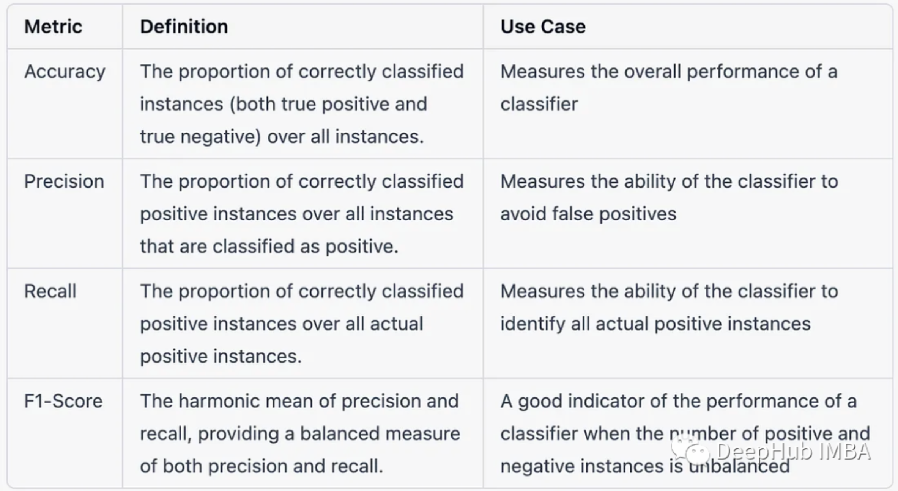
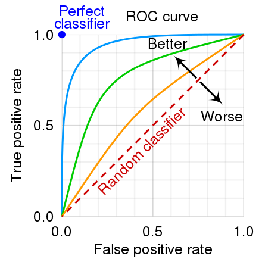

<style>
details {
    border: 1px solid #aaa;
    border-radius: 4px;
    padding: .5em .5em 0;
}
summary {
    font-weight: bold;
    margin: -.5em -.5em 0;
    padding: .5em;
}
details[open] {
    padding: .5em;
}
details[open] summary {
    border-bottom: 1px solid #aaa;
    margin-bottom: .5em;
}
</style>

<details><summary>目录</summary><p>

- [评价指标常见问题](#评价指标常见问题)
  - [在机器学习的背景下解释精度和召回率之间的区别](#在机器学习的背景下解释精度和召回率之间的区别)
  - [绍以下模型评估中精度和召回率之间的权衡](#绍以下模型评估中精度和召回率之间的权衡)
  - [介绍一下用 F1 score 吗](#介绍一下用-f1-score-吗)
  - [如何为给定的问题选择合适的评估指标](#如何为给定的问题选择合适的评估指标)
  - [解释在模型评估中使用 ROC 曲线的原因](#解释在模型评估中使用-roc-曲线的原因)
  - [如何确定二元分类模型的最佳阈值](#如何确定二元分类模型的最佳阈值)
  - [如何评估聚类模型的性能](#如何评估聚类模型的性能)
  - [多类分类问题的背景下各种指标之间的区别](#多类分类问题的背景下各种指标之间的区别)
  - [如何评估推荐系统的性能](#如何评估推荐系统的性能)
  - [在评估模型性能时如何处理不平衡的数据集](#在评估模型性能时如何处理不平衡的数据集)
  - [在样本数据不均匀的情况下使用 ROC 更好还是 PRC 更好](#在样本数据不均匀的情况下使用-roc-更好还是-prc-更好)
- [二分类](#二分类)
  - [混淆矩阵](#混淆矩阵)
    - [confusion\_matrix](#confusion_matrix)
  - [错误率](#错误率)
    - [error rate](#error-rate)
  - [准确率](#准确率)
    - [accuracy\_score](#accuracy_score)
  - [查准率和查全率以及 F1](#查准率和查全率以及-f1)
    - [查准率](#查准率)
    - [查全率](#查全率)
    - [F1](#f1)
    - [举例](#举例)
    - [Python API](#python-api)
  - [Precision Recall Rate](#precision-recall-rate)
  - [Log Loss](#log-loss)
    - [log\_loss](#log_loss)
  - [混淆矩阵 以及 ROC 和 AUC](#混淆矩阵-以及-roc-和-auc)
    - [ROC](#roc)
    - [AUC](#auc)
  - [Normalized Gini Coefficient](#normalized-gini-coefficient)
- [多分类](#多分类)
  - [Categorization Accuracy](#categorization-accuracy)
  - [Multi Class Log Loss](#multi-class-log-loss)
  - [MAP-Mean Average Precision](#map-mean-average-precision)
  - [Mean F1](#mean-f1)
  - [Average Jaccard Index](#average-jaccard-index)
- [回归](#回归)
  - [MBE](#mbe)
  - [MAE](#mae)
  - [MSE](#mse)
  - [RMSE](#rmse)
  - [RSE](#rse)
  - [NRMSE](#nrmse)
  - [RRMSE](#rrmse)
  - [RAE](#rae)
  - [RMSLE](#rmsle)
  - [MAPE](#mape)
  - [Huber Loss](#huber-loss)
  - [Log Cosh Loss](#log-cosh-loss)
  - [Quantile Loss](#quantile-loss)
- [时间序列预测](#时间序列预测)
  - [MAPE](#mape-1)
  - [WMAPE](#wmape)
  - [SMAPE](#smape)
- [聚类](#聚类)
  - [聚类指标简介](#聚类指标简介)
    - [设置聚类性能度量的目的](#设置聚类性能度量的目的)
    - [什么样的聚类结果比较好](#什么样的聚类结果比较好)
    - [聚类性能度量指标](#聚类性能度量指标)
  - [外部指标](#外部指标)
    - [Rand Index](#rand-index)
    - [Adjusted Rand Score](#adjusted-rand-score)
    - [Jaccard Coefficient](#jaccard-coefficient)
    - [Fowlkes-Mallows scores](#fowlkes-mallows-scores)
  - [内部指标](#内部指标)
    - [Davies-Bouldin Index](#davies-bouldin-index)
    - [Dunn Index](#dunn-index)
    - [Silhouette Coefficient](#silhouette-coefficient)
    - [Calinski-Harabasz Index](#calinski-harabasz-index)
  - [其他](#其他)
    - [Homogeneity 和 Completeness](#homogeneity-和-completeness)
    - [V-Measure](#v-measure)
    - [Mutual Information based scores](#mutual-information-based-scores)
    - [Normalized Mutual Information Score](#normalized-mutual-information-score)
    - [Adjusted Mutual Information Score](#adjusted-mutual-information-score)
    - [Contingency Matrix](#contingency-matrix)
    - [Pair Confusion Matrix](#pair-confusion-matrix)
- [推荐系统](#推荐系统)
- [排序](#排序)
- [参考](#参考)
</p></details><p></p>

在机器学习或者深度学习领域，我们在为待解决的问题生成预测模型后，
需要对这个模型对未知数据的泛化性能进行评估，
性能度量方法就是评估模型泛化能力的评价标准


# 评价指标常见问题

## 在机器学习的背景下解释精度和召回率之间的区别

在机器学习模型中，精度和召回率是两个常用的评估指标。
精度是衡量模型在所有正预测中做出的真正正预测的数量，
表示模型避免假阳性预测的能力，其数学表达式为：

`$$Precision = \frac{TP}{TP+FP}$$`

召回率是衡量模型在数据集中所有实际正实例中做出的真正预测的数量。
召回率表示模型正确识别所有正实例的能力，其数学表达式为：

`$$Recall = \frac{TP}{TP+FN}$$`

精确性和召回率都是重要的评估指标，但两者之间的权衡取决于要解决的具体问题的要求。
例如：
* 在医学诊断中，召回率可能更重要，因为它对识别一种疾病的所有病例至关重要，
  即使这会导致更高的假阳性率
* 在欺诈检测中，精确度可能更重要，因为避免虚假指控至关重要，即使这会导致更高的假阴性率

## 绍以下模型评估中精度和召回率之间的权衡

模型评估中精度和召回率之间的权衡是指正确识别正面实例(召回率)和正确识别仅正面实例(召回率)之间的权衡。
精度高意味着假阳性的数量低，而召回率高意味着假阴性的数量低。对于给定的模型，
通常不可能同时最大化精度和召回率。为了进行这种权衡，需要考虑问题的特定目标和需求，
并选择与它们相一致的评估度量

## 介绍一下用 F1 score 吗

F1 score 是机器学习中常用的评估指标，用于平衡精度和召回率。
精确度衡量的是模型所做的所有正面预测中正观察的比例，
而召回率衡量的是所有实际正观察中正预测的比例。
F1 score 是精度和召回率的调和平均值，通常用作总结二元分类器性能的单一指标

`$$F1 = \frac{2 * (Precision * Recall)}{Precision + Recall}$$`

在模型必须在精度和召回率之间做出权衡的情况下，F1 score 比单独使用精度或召回率提供了更细致的性能评估。
例如，在假阳性预测比假阴性预测成本更高的情况下，优化精度可能更重要，而在假阴性预测成本更高的情况下，
可能会优先考虑召回。F1 score 可用于评估模型在这些场景下的性能，
并就如何调整其阈值或其他参数来优化性能给出相应的数据支持

## 如何为给定的问题选择合适的评估指标

为给定的问题选择适当的评估是模型开发过程的一个关键方面。
在选择指标时，考虑问题的性质和分析的目标是很重要的。需要考虑的一些常见因素包括：

* 问题类型：是二元分类问题、多类分类问题、回归问题还是其他问题
* 业务目标：分析的最终目标是什么，需要什么样的性能？例如，如果目标是最小化假阴性，召回率将是一个比精度更重要的指标
* 数据集特征：类是平衡的还是不平衡的？数据集是大还是小？
* 数据质量：数据的质量如何，数据集中存在多少噪声？

基于这些因素，可以选择一个评估指标，如 Accuracy、F1-score、AUC-ROC、Precision-Recall、均方误差等。
但是一般都会使用多个评估指标来获得对模型性能的完整理解

## 解释在模型评估中使用 ROC 曲线的原因

ROC 曲线是二元分类模型性能的图形表示，该模型绘制真阳性率(TPR)与假阳性率(FPR)。
它有助于评估模型的敏感性(真阳性)和特异性(真阴性)之间的权衡，
并广泛用于评估基于二元分类结果(如是或否、通过或失败等)进行预测的模型


ROC 曲线通过比较模型的预测结果和实际结果来衡量模型的性能。
一个好的模型在 ROC 曲线下有很大的面积，这意味着它能够准确地区分正类和负类。
ROC AUC(Area Under the Curve，曲线下面积) 用于比较不同模型的性能，
特别是在类别不平衡时评估模型性能的好方法

## 如何确定二元分类模型的最佳阈值

二元分类模型的最佳阈值是通过找到在精度和召回率之间平衡的阈值来确定的。
这可以通过使用评估指标来实现，例如 F1 score，它平衡了准确性和召回率，
或者使用 ROC 曲线，它绘制了各种阈值的真阳性率和假阳性率

最佳阈值通常选择 ROC 曲线上最接近左上角的点，因为这样可以最大化真阳性率，
同时最小化假阳性率

在实践中，最佳阈值还可能取决于问题的具体目标以及与假阳性和假阴性相关的成本

## 如何评估聚类模型的性能

聚类模型的性能可以使用许多指标进行评估。一些常见的指标包括：

* Silhouette 分数：它衡量观察到自己的簇与其他簇相比的相似性。
  分数范围从 -1 到 1，值越接近 1 表示聚类结构越强
* Calinski-Harabasz 指数：它衡量的是簇间方差与簇内方差的比值。较高的值表示更好的聚类解决方案
* Davies-Bouldin 指数：它衡量每个簇与其最相似的簇之间的平均相似性。较小的值表示更好的聚类解决方案
* Adjusted Rand 指数：它测量真实类标签和预测聚类标签之间的相似性，并根据概率进行调整。
  较高的值表示更好的聚类解决方案
* 混淆矩阵：它可以通过将预测的聚类与真实的类进行比较来评估聚类模型的准确性

## 多类分类问题的背景下各种指标之间的区别



## 如何评估推荐系统的性能

评估推荐系统的性能包括衡量系统向用户推荐相关项目的有效性和效率。一些常用的用于评估推荐系统性能的指标包括:

* Precision：与用户相关的推荐项目的比例
* Recall：系统推荐相关项目的比例
* F1-Score：精密度和召回率的调和平均值
* Mean Average Precision (MAP)：一个推荐系统的整体用户的平均精度的度量
* Normalized Discounted Cumulative Gain (NDCG)：衡量推荐项目的等级加权相关性
* Root Mean Square Error (RMSE)：对一组项目的预测评分和实际评分之间的差异进行测量

## 在评估模型性能时如何处理不平衡的数据集

为了在模型评估中处理不平衡的数据集，可以使用以下几种技术:

* 重新采样数据集：对少数类进行过采样或对多数类进行过采样，以平衡类分布
* 使用不同的评估指标：诸如精度、召回率、F1-score 和 ROC 曲线下面积(AUC-ROC)等指标对类别不平衡很敏感，
  可以更好地理解模型在不平衡数据集上的性能
* 使用代价敏感学习：为不同类型的错误分类分配成本，例如为假阴性分配比假阳性更高的成本，
  以使模型对少数类别更敏感
* 使用集成方法：通过组合多个模型的结果，可以使用 bagging、
  boosting 和 stacking 等技术来提高模型在不平衡数据集上的性能
* 混合方法：上述技术的组合可用于处理模型评估中的不平衡数据集

## 在样本数据不均匀的情况下使用 ROC 更好还是 PRC 更好

> 虽然 ROC 适用于评估分类器的整体性能，但是对于类别不均衡的数据，ROC 曲线往往会过于“乐观”，因此还是 PR 曲线更好

我们知道，ROC 表示了 TPR(True Positive Rate)和 FPR(False Positive Rate)之间的关系。
TPR 是在正样本的基础上计算的，FPR 是在负样本的基础上计算的，因此即使正负样本的比例不均衡，
计算结果并不会改变。我们只需要注意保证样本的绝对数量不能太低，让 TPR 和 FPR 统计意义上有意义

与之相对的，精度召回曲线的情况恰恰相反，尽管召回率只在正样本基础上计算，
精度准确率需要同时测量正和负样本，因此精确度的测量取决于数据中的正负之比

ROC 曲线由于兼顾正例与负例，所以适用于评估分类器的整体性能，相比而言 PR 曲线完全聚焦于正例

一种常见的认为 ROC 适用不均衡数据集的错误观点是，反正 TPR 和 FPR 的计算方式都是比值，因此数据是否均衡并不重要

* 首先运用极限思想，在二分类问题中假设 A 类数据占据了 99.99%，那么分类器只需要预测所有数据为 A 类即可。这显然不合理
* 其次对于多分类问题，ROC 也会因为“负类”的概念出现问题。即使你的数据在各个类别里是均匀分布的，
  对于 negative class，也就是所有的不是你目标的类别，也必定会被过度代表，
  而 Precision Recall 曲线可以很好地解决这个问题

那么 ROC 曲线适合被应用在什么地方呢？

ROC 曲线主要不是为了显示出阈值是多少，而是关于模型在使用某个阈值时特征空间中数据的分离程度。
对于一个鲁棒的分类器，TPR 提升的速度应该远远地高于 FPR 提升的速度(凹函数)。
因此可以根据具体的应用，在曲线上找到最优的点，得到相对应的 precision 和 recall 等指标，
去调整模型的阈值，从而得到一个符合具体应用的模型

因此数据中如果存在不同的类别分布，且想要比较分类器的性能且剔除类别分布改变的影响，
则 ROC 曲线比较适合；反之，如果想测试相同类别分布下对分类器的性能的影响，则 PR 曲线比较适合

最后我们得到一个有点反直觉的结论：

* ROC 曲线选用的两个指标不依赖数据中具体的类别分布，因此不适合被应用于数据分布极度不均的任务中

# 二分类

## 混淆矩阵

混淆矩阵：


混淆矩阵及其相关指标：


### confusion_matrix

* sklearn.confusion_matrix

```python
from sklearn.metrics import confusion_matrix
from sklearn.metrics import classification_report
```

## 错误率

> * Error Rate：错误率
> * 错误率是分类错误的样本数占样本总数的比例

定义：

`$$E(f; D)=\frac{1}{N}\sum_{i=1}^{N}I(f(x_{i}) \neq y_{i})$$`

`$$ErrorRate(\hat{y}_{i}, y_{i})=\frac{1}{N}\sum_{i=1}^{N}I(\hat{y}_{i} \neq y_{i})$$`

`$$ErrorRate = \frac{FP+FN}{TP+FP+FN+TN}$$`

其中：

* `$I(\cdot)$` 为示性函数
* `$N$` 为测试样本个数
* `$y_{i} \in \{0, 1\}$` 表示样本 `$i$` 对应的真实标签
* `$\hat{y}_{i}\in \{0, 1\}$` 表示样本 `$i$` 对应的预测结果

### error rate 

```python

```

## 准确率

> * Accuracy：准确率
> * 精度则为分类正确的样本数占样本总数的比例

定义：

`$$E(f; D)=\frac{1}{N}\sum_{i=1}^{N}I\Big(f(x_{i}) = y_{i}\Big)$$`

`$$Accuracy(\hat{y}_{i}, y_{i}) = \frac{1}{N}\sum_{i=1}^{N}I(\hat{y}_{i} = y_{i})$$`

`$$Accuracy = \frac{TP+TN}{TP+FP+FN+TN}$$`

其中：

* `$I(\cdot)$` 为示性函数
* `$N$` 为测试样本个数
* `$y_{i} \in \{0, 1\}$` 表示样本 `$i$` 对应的真实标签
* `$\hat{y}_{i}\in \{0, 1\}$` 表示样本 `$i$` 对应的预测结果

针对准确率问题，目前常采用的损失函数为 Binary Log Loss/Binary Cross Entropy，其数学形式如下：

`$$LogLoss = -\frac{1}{N}\sum_{i=1}^{N}\Big(y_{i}log p_{i} + (1 - y_{i})log(1 - p_{i})\Big)$$`

其中：

* `$p_{i}$` 为模型对第 `$i$` 个样本的预测概率

### accuracy_score

```python
from sklearn.metric import accuracy_score
```

## 查准率和查全率以及 F1

> * Precision：查准率、精度
> * Recall：查全率、召回率
> * F1：F1 Measure / F1 Score

错误率和精度并不能满足所有任务中的需求。如在信息检索中，
经常会关心“检索出的信息中有多少比例是用户感兴趣的”(Precision)、
“用户感兴趣的信息中有多少被检索出来了”(Recall)。
需要查准率(Precision)和查全率(Recall)来进行此类需求的性能度量

二分类问题中，将样例根据真实类别与分类器预测类别的组合，
可以分为真正例(true positive)、假正例(false positive)、
真反例(true negative)和假反例(false negative)四种情形，
即 TP、FP、TN、FN，显然有 TP + FP + TN + FN = 样例总数

### 查准率

> 查准率，Precision

根据混淆矩阵，查准率 Precision 的定义为：

`$$Precision = \frac{TP}{TP + FP}$$`

查准率是对于自己模型的预测而言的，它表示在所有预测的正例中预测正确的比例，即真正例的比例。
想提高查准率，可以只对自己有信心预测正确的样本进行预测，假如模型预测出一个正例而且为真正例，
其查准率为 100%，而预测 10 个正例其中有 9 个真正例，其查准率则为 90%。
所以有句话怎么说的来着？多说多错，少说少错，不说不错。当然，这里只是体现一下思想

在信息检索中，查准率也可以看成是检索出来的条目(文档、网页)有多少是准确的(准确的定义为所关心的正好被检索出来)

`$$Precision = \frac{某类被正确分类的关系实例个数}{被判定为某类的关系实例总数}$$`

### 查全率

根据混淆矩阵，查准率 Recall 的定义为：

`$$Recall = \frac{TP}{TP + FN}$$`

查全率是对于真实答案而言的，它表示预测出的真正例覆盖了多少原样本的正例。
体现了“宁可错杀千人，不可放过一个”的思想，就算是找遍全天下所有人，也要把目标找出来。
把目标名单里所有人都找到，就成功了(查全率高)，而不在乎找错了多少人

在信息检索中，查全率也可以看成是所有准确的条目有多少被检索出来了：

`$$Recall = \frac{某类被正确分类的关系实例个数}{测试集中某类的关系实例总数}$$`

### F1

可以看出，查准率和查全率其实是矛盾的。想提高查准率就要谨慎判断每一个抓到的人是不是该杀的目标，
杀错一个就会降低查准率；而想提高查全率就要把每一个抓到的疑似目标都杀掉，
这样虽然可能会误杀很多人但是放过目标的概率会比较低。所以为了平衡查准率和查全率，
提出​ `$F1$` 度量，其是基于查准率与查全率的调和平均定义的

`$$\frac{1}{F1} = \frac{1}{2} \cdot (\frac{1}{Precision} + \frac{1}{Recall})$$`

转换为：

`$$F1 = \frac{2 \times Precision \times Recall}{Precision + Recall} = \frac{2 \times TP}{样例总数 + TP - TN}$$`

在特定的应用场景中，对查准率和查全率的重视程度会有所不同。
如商品推荐系统中，为尽可能少打扰用户，更希望推荐内容是用户感兴趣的，
此时查准率比较重要；而在逃犯信息检索系统中，更希望尽可能少漏点逃犯，
此时查全率更重要。由此我们引入​ `$F1$` 度量的一般形式 `$F_{\alpha}$`​ 

`$$F_{\alpha} = \frac{(\alpha^{2}+1)Precision \times Recall}{(\alpha^{2} \times Precision) + Recall}$$`

其中：

* `$\alpha, \alpha>0$` 度量了查全率(Recall)对查准率(Precision)的相对重要性
* `$\alpha = 1$` 时为标准 `$F1$`
* `$\alpha > 1$` 时查全率(Recall)有更大的影响
* `$0 < \alpha < 1$` 时查准率(Precision)有更大的影响

### 举例

举个例子，某池塘有 1400 条鲤鱼，300 只虾，300 只鳖。
现在以捕鲤鱼为目的，撒一大网，逮着 700 条鲤鱼，200 只虾，100 只鳖，
那么 Precision, recall, F1 分别如下：

`$$Precision = \frac{700}{700 + 200 + 100}=70\%$$`

`$$Recall = \frac{700}{1400} = 50\%$$`

`$$F1 = \frac{2 \times 70\% \times 50\%}{70\% + 50\%} = 58.3\%$$`

不妨看看如果把池子里的所有的鲤鱼、虾和鳖都一网打尽，这些指标又有何变化：

`$$Precision = \frac{1400}{1400 + 300 + 300}=70\%$$`

`$$Recall = \frac{1400}{1400} = 100\%$$`

`$$F1 = \frac{2 \times 70\% \times 100\%}{70\% + 100\%} = 82.35\%$$`

由此可见，查准率(Precision)是评估捕获的成果(被判定为关心的类别样本)中目标成果(关心的类别样本)所占的比例；
召回率(Recall)就是从关注领域(关心的类别样本)中，召回目标类别(被判定为关心的类别中关心的类别)的比例；
F1 值则综合这两者指标的评估指标，用于综合反映整体领域的指标

和准确率指标优化类似，此处使用 Binary Cross Entropy 进行优化即可，
不同之处在于，在得到最终的预测概率之后，需要通过一些策略寻找最优阈值

还有的时候会对损失函数进行加权优化；例如标签为 1 的样本的权重就设置大一些等

### Python API

```python
from sklearn.metrics import roc_auc_score
```

## Precision Recall Rate

* TODO

## Log Loss

Log Loss 也称为逻辑回归损失或交叉熵损失。它基本上定义在概率估计上，
并测量分类模型的性能，其中输入是介于 0 和 1 之间的概率值

通过精确区分，可以更清楚地理解它。准确度是我们模型中预测的计数（预测值=实际值），
而对数损失是预测的不确定性量，基于它与实际标签的差异。借助对数损失值，
可以更准确地了解模型的性能

`$$LogLoss = -\frac{1}{N}\sum_{i=1}^{N}\Big(y_{i}log p_{i} + (1 - y_{i})log(1 - p_{i})\Big)$$`

其中：

* `$p_{i}$` 为模型对第 `$i$` 个样本的预测概率

因为 Logloss 是可以直接进行优化的函数，一般我们会直接基于 LogLoss 函数进行优化

### log_loss

```python
from sklearn.metrics import log_loss
```

## 混淆矩阵 以及 ROC 和 AUC

二分类问题中，很多分类器​会生成一个预测概率，然后将预测概率与分类阈值(threshold)进行比较，
若大于阈值则分为正类，否则为反类。若分类阈值为 0.5，预测概率结果在 `$[0, 1]$`，
然后将这个值与 0.5 进行比较，若大于 0.5 判为正例，否则判为反例。

### ROC


根据预测结果，可以将样本进行排序，将模型认为最可能是正例的样本(预测概率最高)排在最前面，
模型认为最不可能是正例的样本排在最后，这样一来，分类过程就可以看作某个截断点将样本一分为二，
前一部分为正例，后一部分为反例。排序本身质量的好坏基本体现了模型泛化性能的好坏，
ROC 曲线就是从这个角度出发来研究学习器泛化性能的。

ROC 全称为“受试者工作特征”(Receiver Operating Characteristic)，把排好顺序的样本逐个作为正例进行预测，
每次预测得到两个值：真正例率(True Positive Rate, TPR)、假正例率(False Positive Rate, FPR)，
分别定义如下：

`$$TPR = \frac{TP}{TP + FN}$$`

`$$FPR = \frac{FP}{TN + FP}$$`

然后以​ FPR 为横坐标，​ TPR 为纵坐标，得到当前情况的坐标点，直至最后，
然后将所有的点连线就得到了​ ROC 曲线

> 下面详细描述一下​曲线的画法：现有 20 个样本，正例 10 个，反例 10 个，正例用 `$P$` 表示，反例用 `$​N$` 表示，
> 模型预测出每个样本为正例的概率，然后从高到低进行排序，如下：
> 
> `$P1, P2, P3, N1, P4, N2, P5, P6, P7, N3, N4, N5, P8, N6, P9, N7, N8, N9, P10, N10$`
> 
> 需要从上面 20 个样本得到 22 个坐标点
> 
> * 第一个是 `$(0, 0)$`，即将分类的阈值设为最大，这样所有的样例均预测为反例，TPR 和 FPR 均为 0
> * 然后将分类阈值依次设为每个样例的预测值，即 `$P1$` 为正例，其他为反例，
>   此时​，​，所以第二个坐标为 `$(0, \frac{1}{10})$`
> * 依次向后，得到坐标点 `$(0, \frac{2}{10})$`、`$(0, \frac{3}{10})$`、`$(\frac{1}{10}, \frac{3}{10})$`、
>   `$(\frac{1}{10}, \frac{4}{10})$`...
> * 第 22 个坐标为 `$(1,1)$` ，即所有样本均预测为正例：`$TPR = 1$`，`$FPR = 1$`

理论上来讲，无限个样本可以绘出圆滑的 ROC 曲线，而现实中通常是利用有限个样本来绘制 ROC 曲线，
生成的是有棱角的近似曲线

将之前得到坐标点的方法进行归纳：有​ `$m^{+}$` 个正例和​ `$m^{-}$` 个反例，
按预测为正例的概率大小排好序后，设前一个标记点坐标为 `$(x, y)$`，若当前为真正例，
则坐标为​ `$(x, y + \frac{1}{m^{+}})$`；若当前为假例，则坐标为 `$(x+\frac{1}{m^{-}}, y)$`



直观理解，随机猜测的​ ROC 曲线应该是 `$y = x$` 直线。若 ROC 曲线在此直线上面，
即向上走得比向右走得“快”，真正例率大于假正例率，说明模型比随机猜测好，
大部分正例都排在反例的前面，预测模型较好。若有新的​ ROC 曲线可以完全包括之前的 ROC 曲线，
则新模型的性能要优于原来的模型。如果两个​ ROC 曲线有交叉部分，
我们就需要计算​曲线下的面积大小来判断哪个模型的性能优越了

### AUC

ROC 曲线下的面积被称为​ AUC(Area Under ROC Curve)，
它可以通过相邻两个坐标点与 `$x$`​ 轴形成的矩形或梯形的面积累加得到。
之所以存在梯形，是因为如果有几个预测概率相同的正反样例，
把哪个排前面哪个排后面都不太好，就用其形成的矩形的对角线来表示这几个正反样例的 ROC 曲线

所以可以用如下公式来计算​ AUC，矩形也是一种特殊的梯形，
所以直接用梯形求和公式来计算两个坐标点与 `$x$`轴形成的面积。`$x_{i} - x_{i-1}$` 是梯形的高，
​`$y_{i-1}$` 和 `$y_{i}$` ​分别为梯形的上底和下底

`$$AUC = \sum_{i = 2}^{m}\frac{(x_{i} - x_{i-1})\times (y_{i} + y_{i-1})}{2}$$`

​ 
AUC 值其实是一个概率值，当随机挑选出一个正样本和负样本对，
当前的分类算法根据计算得到的 Score 值将这个正样本排在负样本前面的概率就是 AUC 值， 
AUC 值越大，当前分类算法越有可能将正样本排在负样本前面，从而能够更好地分类。
最理想的情况就是所有的正样本全部在负样本前面，这样就可以以其分界线作为阈值将正负样本完全分开，
这是最好的模型情况，`$AUC = 1$`

有一点需要特别声明，​AUC 只能用来做二分类模型的性能度量，而且当正负样本不均衡时效果不理想。
生成坐标时向上走一步​ `$\frac{1}{m^{+}}$`，向右走一步 `$\frac{1}{m^{-}}$`，
若​ `$m^{+}$` 与​ `$m^{-}$` 相差比较大，比如​ `$m^{+}$` 远大于 `$m^{-}$`，
则​ ROC 曲线向上走得要比向右走得快，更有可能被判断为性能好的模型，
但其实只是因为正负样本不均衡造成的

AUC 的数值都不会大于 1。又由于 ROC 曲线一般都处于 `$y=x$` 这条直线的上方，
所以 AUC 的取值范围在 0.5 和 1 之间。AUC 越接近 1.0，检测方法真实性越高。
等于 0.5 时，一般就无太多应用价值了


最为常见的还是基于 LogLoss 函数的优化

## Normalized Gini Coefficient

`$$Gini = 2 \times AUC - 1$$`

```python
from sklearn.metrics import roc_auc_score
import numpy as np 


def gini(actual, pred, cmpcol = 0, sortcol = 1):
    assert (len(actual) == len(pred))
    all = np.asarray(np.c_[actual, pred, np.arange(len(actual))], dtype=np.float)
    all = all[np.lexsort((all[:, 2], -1 * all[:, 1]))]
    totalLosses = all[:, 0].sum()
    giniSum = all[:, 0].cumsum().sum() / totalLosses

    giniSum -= (len(actual) + 1) / 2.
    return giniSum / len(actual)


def gini_normalized(actual, pred):
    return gini(actual, pred) / gini(actual, actual)

p = np.array([0.9, 0.3, 0.8, 0.75, 0.65, 0.6, 0.78, 0.7, 0.05, 0.4, 0.4, 0.05, 0.5, 0.1, 0.1]) 
y = np.array([1, 1, 1, 1, 1, 1, 0, 0, 0, 0, 0, 0, 0, 0, 0])

2 * roc_auc_score(y_score = p, y_true = y) - 1
gini_normalized(actual = y, pred = p)
```

# 多分类

## Categorization Accuracy

> Categorization Accuracy，分类准确率

定义：

`$$logloss = -\frac{1}{N}\sum_{i=1}^{N}I(y_{i} = p_{i})$$`

其中：

* `$N$` 为测试样本的个数
* `$y_{i}$` 为第 `$i$` 个样本的类别标签
* `$p_{i}$` 为预测的第 `$i$` 个样本的类别


`$$Loss = -\frac{1}{N}\sum_{i=1}^{N}\sum_{j=1}^{K} y_{i,k}log(p_{i,k})$$`

其中：

* `$y_{i,k}$` 表示第 `$i$` 个样本标签为 `$k$` 的情况，
  如果标签为 `$k$` 则是 1，反之为 0
* `$p_{i,k}$` 表示模型预测第 `$i$` 个样本属于 `$k$` 的概率

## Multi Class Log Loss

定义：

`$$logloss = -\frac{1}{N}\sum_{i=1}^{N}\sum_{i=1}^{N}\sum_{i=1}^{M}y_{i,j}log(p_{i,j})$$`

其中：

* `$N$` 为测试样本的个数
* `$M$` 为类标签的个数

针对准确率问题，目前常采用的损失函数为 Multiclass Log Loss，其数学形式如下：

`$$logloss = -\frac{1}{N}\sum_{i=1}^{N}\sum_{i=1}^{N}\sum_{i=1}^{M}y_{i,j}log(p_{i,j})$$`

其中：

* `$N$` 为测试样本的个数
* `$M$` 为类标签的个数

## MAP-Mean Average Precision

定义：

`$$MAP = \frac{1}{|U|}\sum_{u=1}^{|U|}\frac{1}{min(A, m)}\sum_{k=1}^{min(n, A)}P(k)$$`

其中：

* `$|U|$` 为用户的个数
* `$P(k)$` 为在截止点 `$k$` 处的精度(Precision)
* `$n$` 是预测物品的数量
* `$M$` 是给定用户购买物品的数量，如果 `$M=0$`，则精度定义为 0

使用 Sigmoid Cross Entropy，注意与其它常用的多分类损失函数的区别

## Mean F1

定义：

`$F1 = \frac{2pr}{p+r}$`

其中：

* `$p = \frac{tp}{tp+fp}$`
* `$r = \frac{tp}{tp+fn}$`

Mean Square Loss

## Average Jaccard Index

两个区域 A 和 B 的 Jaccard Index 可以表示为：

`$$Jaccard = \frac{TP}{TP + FP + FN} = \frac{A \cap B}{A \cup B} = \frac{|A \cap B|}{|A| + |B| - |A \cap B|}$$`

其中：

* `$TP$` 表示 True Positive 的面积
* `$FP$` 表示 False Positive 的面积
* `$FN$` 表示 False Negative 的面积

Sigmoid

# 回归

## MBE

> Mean Bias Error，MBE，平均偏差误差

MBE 是测量过程高估或低估参数值的趋势。偏差只有一个方向，可以是正的，也可以是负的。
正偏差意味着数据的误差被高估，负偏差意味着误差被低估。MBE 是预测值与实际值之差的平均值。
该评估指标量化了总体偏差并捕获了预测中的平均偏差。它几乎与 MAE 相似，
唯一的区别是这里没有取绝对值。这个评估指标应该小心处理，因为正负误差可以相互抵消

`$$MBE = \frac{1}{n}\sum_{i=1}^{n}(y_{i} - \hat{y}_{i})$$`

优点：

* 想检查模型的方向（即是否存在正偏差或负偏差）并纠正模型偏差，MBE 是一个很好的衡量标准

缺点：

* 就幅度而言，这不是一个好的衡量标准，因为误差往往会相互补偿
* 它的可靠性不高，因为有时高个体错误会产生低 MBE
* 作为一种评估指标，它在一个方向上可能始终是错误的

API：

```python
def mean_bias_error(true, pred):
    bias_error = true - pred
    mbe_loss = np.mean(np.sum(bias_erro) / ture.size)

    return mbe_loss
```

## MAE

> Mean Absolute Error

MAE(Mean Absolute Error，平均绝对误差) 也称为 L1 损失函数。
是最简单的损失函数之一，也是一种易于理解的评价指标。
它是通过取预测值和实际值之间的绝对差值并在整个数据集中取平均值来计算的。
从数学上讲，它是绝对误差的算术平均值。MAE 仅测量误差的大小，不关心它们的方向。
MAE 越低，模型的准确性就越高

`$$MAE = \frac{1}{n}\sum_{i=1}^{n}|y_{i} - \hat{y}_{i}|$$`

优点：

* 由于采用了绝对值，因此所有误差都以相同的比例加权
* 如果训练数据有异常值，MAE 不会惩罚由异常值引起的高错误
* 它提供了模型执行情况的平均度量

缺点：

* 有时来自异常值的大错误最终被视为与低错误相同
* 在零处不可微分。许多优化算法倾向于使用微分来找到评估指标中参数的最佳值。在 MAE 中计算梯度可能具有挑战性。

API：

```python
def mean_absolute_error(true, pred):
    abs_error = np.abs(true - pred)
    sum_abs_error = np.sum(abs_error)
    mae_loss = sum_abs_error / true_.size
    
    return mae_loss
```

## MSE

> Mean Square Error，MSE，均方误差或 L2 损失

MSE 也称为 L2 损失，MSE 通过将预测值和实际值之间的差平方并在整个数据集中对其进行平均来计算误差。
MSE 也称为二次损失，因为惩罚与误差不成正比，而是与误差的平方成正比。平方误差为异常值赋予更高的权重，
从而为小误差产生平滑的梯度

MSE 永远不会是负数，因为误差是平方的。误差值范围从零到无穷大。
MSE 随着误差的增加呈指数增长。一个好的模型的 MSE 值接近于零

`$$E(f; D) = \frac{1}{n}\sum_{i=1}^{n}\Big(f(x_{i}) - y_{i}\Big)^{2}$$`

`$$MSE = \frac{1}{n}\sum_{i=1}^{n}\Big(\hat{y}_{i} - y_{i}\Big)^{2}$$`

优点：

* MSE 会得到一个只有一个全局最小值的梯度下降
* 对于小的误差，它可以有效地收敛到最小值。没有局部最小值
* MSE 通过对模型进行平方来惩罚具有巨大错误的模型

缺点：

* 对异常值的敏感性通过对它们进行平方来放大高误差
* MSE 会受到异常值的影响，会寻找在整体水平上表现足够好的模型

回归问题的性能度量方法与其常用的损失函数一样，都是均方误差。
MSE 是可以直接优化的函数，所以直接默认选用平方损失函数进行优化即可，
很多工具包里面也称之为 L2 损失

API：

```python
def mean_squared_error(true, pred):
    squared_error = np.square(true - pred)
    sum_squared_error = np.sum(squared_error)
    mse_loss = sum_squared_error / true.size

    return mse_error
```

## RMSE

> Root Mean Square Error，RMSE，均方根误差

RMSE 是通过取 MSE 的平方根来计算的。RMSE 也称为均方根偏差。
它测量误差的平均幅度，并关注与实际值的偏差。RMSE 值为零表示模型具有完美拟合。
RMSE 越低，模型及其预测就越好

`$$RMSE = \sqrt{\frac{1}{n}\sum_{i=1}^{n}\Big(\hat{y}_{i} - y_{i}\Big)^{2}}$$`

优点：

* 易于理解
* 计算方便

缺点：

* 建议去除异常值才能使其正常运行
* 会受到数据样本大小的影响

API：

```python
def root_mean_squared_error(true, pred):
    squared_error = np.square(true - pred)
    sum_squared_error = np.sum(squared_error)
    rmse_loss = np.sqrt(sum_squared_error / true.size)

    return rmse_loss
```

## RSE

> Relative Squared Error，RSE，相对平方误差

RSE 需要使用均方误差并将其除以实际数据与数据平均值之间的差异的平方

`$$RSE = \frac{\sum_{i=1}^{n}(y_{i} - \hat{y}_{i})^{2}}{\sum_{i=1}^{n}(y_{i} - \bar{y})^{2}}$$`

其中：

* `$\bar{y} = \frac{1}{n}\sum_{i=1}^{n}y_{i}$`

优点：

* 对预测的平均值和规模不敏感

API：

```python
def relative_squared_error(true, pred):
    true_mean = np.mean(true)
    squared_error_sum = np.sum(np.square(true - pred))
    squared_error_den = np.sum(np.square(true - true_mean))
    rse_loss = squared_error_num / squared_error_den

    return rse_loss
```

## NRMSE

> Normalized Root Mean Squared Error，NRMSE，归一化 RMSE

归一化 RMSE 通常通过除以一个标量值来计算，它可以有不同的方式。
有时选择四分位数范围可能是最好的选择，因为其他方法容易出现异常值。
当您想要比较不同因变量的模型或修改因变量时，NRMSE 是一个很好的度量。
它克服了尺度依赖性，简化了不同尺度模型甚至数据集之间的比较

* RMSE / maximum value in the series
* RMSE / mean
* RMSE / difference between the maximum and the minimum values (if mean is zero)
* RMSE / standard deviation
* RMSE / interquartile range

API：

```python
def normalized_root_mean_squared_error(true, pred):
    squared_error = np.square((true - pred))
    sum_squared_error = np.sum(squared_error)
    rmse = np.sqrt(sum_squared_error / true.size)
    nrmse_loss = rmse/np.std(pred)

    return nrmse_loss
```

## RRMSE

> Relative Root Mean Squared Error，RRMSE，相对 RMSE

RRMSE 是 RMSE 的无量纲形式，是由均方根值归一化的均方根误差，其中每个残差都根据实际值进行缩放

`$$RRMSE = \sqrt{\frac{\frac{1}{n}\sum_{i=1}^{n}(y_{i} - \hat{y}_{i})^{2}}{\sum_{i=1}^{n}(\hat{y}_{i})^{2}}}$$`

* Excellent when RRMSE < 10%
* Good when RRMSE is between 10% and 20%
* Fair when RRMSE is between 20% and 30%
* Poor when RRMSE > 30%

API：

```python
def relative_root_mean_squared_error(true, pred):
    num = np.sum(np.square(true - pred))
    den = np.sum(np.square(pred))
    squared_error = num/den
    rrmse_loss = np.sqrt(squared_error)

    return rrmse_loss
```

## RAE

> Relative Absolute Error，RAE，相对绝对误差

RAE 是通过将总绝对误差除以实际值与平均值之间的绝对差来计算的。
RAE 以比率表示，范围值在 `$[0, 1]$`。一个好的模型将具有接近于零的值，
其中零是最佳值

`$$RAE = \frac{\sum_{i=1}^{n}|y_{i} - \hat{y}_{i}|}{\sum_{i=1}^{n}|y_{i} - \bar{y}|}$$`

其中：

* `$\bar{y} = \frac{1}{n}\sum_{i=1}^{n}y_{i}$`

优点：

* RAE 可用于比较以不同单位测量误差的模型
* RAE 是可靠的，因为它可以防止异常值

API：

```python
def relative_absolute_error(true, pred):
    true_mean = np.mean(true)
    squared_error_num = np.sum(np.abs(true - pred))
    squared_error_den = np.sum(np.abs(true - true_mean))
    rae_loss = squared_error_num / squared_error_den

    return rae_loss
```


```python
def relative_absolute_error(true, pred):
    true_mean = np.mean(ture)
    squared_error_num = np.sum(np.abs(true - pred))
    squared_error_den = np.sum(np.abs(true - true_mean))
    rae_loss = squared_error_num / squared_error_den
    
    return rae_loss
```

## RMSLE

> Root Mean Squared Logarithmic Error，RMSLE，均方根对数误差

均方根对数误差是通过将 log 应用于实际值和预测值然后取它们的差异来计算的。
RMSLE 对于小误差和大误差被均匀处理的异常值是稳健的。如果预测值小于实际值，
则对模型进行更多的惩罚，而如果预测值大于实际值，则对模型进行较少的惩罚

`$$RMSLE = \sqrt{(log(y_{i} + 1) - log(\hat{y}_{i} + 1))^{2}}$$`

优点：

* 不依赖于比例，并且适用于各种比例。
* 它不受大异常值的影响。
* 它只考虑实际值和预测值之间的相对误差

API：

```python
def root_mean_squared_log_error(true, pred):
    square_error = np.square((np.log(true + 1) - np.log(pred + 1)))
    mean_square_log_error = np.mean(square_error)
    rmsle_loss = np.sqrt(mean_square_log_error)
    return rmsle_loss
```

## MAPE

> Mean Absolute Percentage Error，MAPE，平均绝对百分比误差

MAPE 是通过将实际值与预测值之间的差值除以实际值来计算的。
MAPE 随着误差的增加而线性增加。MAPE 越小，模型性能越小

`$$MAPE = \frac{1}{n}\sum_{i=1}^{n}\frac{|y_{i}-\hat{y}_{i}|}{y_{i}} \times 100 \%$$`

优点：

* MAPE 与变量的规模无关，因为它的误差估计是以百分比为单位的
* 所有错误都在一个共同的尺度上标准化，很容易理解
* MAPE 避免了正值和负值相互抵消的问题

缺点：

* 分母值为零时，面临着“除以零”的问题
* MAPE 对数值较小的误差比对数值大的误差错误的惩罚更多
* 因为使用除法运算，对于相同的误差，实际值的变化将导致损失的差异

API：

```python
def mean_absolute_percentage_error(true, pred):
    abs_error = (np.abs(true - pred)) / true
    sum_abs_error = np.sum(abs_error)
    mape_loss = (sum_abs_error / true.size) * 100

    return mape_loss
```

## Huber Loss

Huber损失是线性和二次评分方法的组合。它有一个超参数 delta，可以根据数据进行调整。
对于高于 `$\delta$` 的值，损失将是线性的（L1 损失），对于低于 `$\delta$` 的值，损失将是二次的（L2 损失）。
它平衡并结合了 MAE（平均绝对误差）和 MSE（均方误差）的良好特性

`$$L_{\delta} = \begin{cases}
\frac{1}{2}(y - f(x))^{2}，|y-f(x)| \leq \delta \\
\delta|y - f(x)| - \frac{1}{2}\delta^{2}，otherwise\end{cases}$$`

优点：

* 它在零处是可微的
* 由于 `$\delta$` 以上的线性度，异常值得到了正确处理
* 可以调整超参数delta以最大限度地提高模型准确性

缺点：

* 为了最大限度地提高模型精度，需要优化delta，这是一个迭代过程
* 它只能微分一次

API：

```python
def huber_loss(true, pred, delta):
    huber_mse = 0.5 * np.square(true - pred)
    huber_mae = delta * (np.abs(true - pred) - 0.5 * (np.square(delta)))

    return np.where(np.abs(true - pred) <= delta, huber_mse, huber_mae)
```

## Log Cosh Loss

Log cosh 计算误差的双曲余弦的对数。这个函数比二次损失更平滑。
它像 MSE 一样工作，但不受大预测误差的影响

`$$LogCosh = \sum_{i=1}^{n}log(cosh(\hat{y}_{i} - y_{i}))$$`

优点：

* 同时处处可二次微分
* 比 Huber需要更少的计算

缺点：

* 适应性较差，因为它遵循固定的比例
* 与 Huber loss 相比，推导更复杂，需要深入研究

```python
def huber_loss(true, pred, delta):
    diff = np.cosh(pred - delta)
    diff = np.log(diff)
    return diff.mean()
```

## Quantile Loss

分位数回归损失函数用于预测分位数。分位数是确定组中有多少值低于或高于某个限制的值。
它跨预测变量（自变量）的值估计响应变量（因变量）的条件中位数或分位数

# 时间序列预测

在指标方面，作为一个回归问题，可以使用 MAE，MSE 等方式来计算。
但这类 metric 受到具体预测数值区间范围不同，
展现出来的具体误差值区间也会波动很大。比如预测销量可能是几万到百万，
而预测车流量可能是几十到几百的范围，那么这两者预测问题的 MAE 可能就差距很大，
很难做多个任务间的横向比较。所以实际问题中，
经常会使用对数值量纲不敏感的一些 metric，尤其是 SMAPE 和 WMAPE 这两种

这类误差计算方法在各类不同的问题上都会落在 0~1 的区间范围内，
方便来进行跨序列的横向比较，十分方便。在实际项目中还会经常发现，
很多真实世界的时序预测目标，如销量，客流等，
都会形成一个类似 tweedie 或 poisson 分布的情况。
如果用 WMAPE 作为指标，模型优化目标基本可以等价为 MAE(优化目标为中位数)，
则整体的预测就会比平均值小(偏保守)。在很多业务问题中，
预测偏少跟预测偏多造成的影响是不同的，所以实际在做优化时，
可能还会考察整体的预测偏差(总量偏大或偏小)，
进而使用一些非对称 loss 来进行具体的优化

## MAPE


## WMAPE

`$$WMAPE = \frac{\sum_{t=1}^{n}|A_{t} - F_{t}|}{\sum_{t=1}^{n}|A_{t}|}$$`


## SMAPE


# 聚类

> 聚类性能度量亦称聚类"有效性指标"(validity index)

## 聚类指标简介

### 设置聚类性能度量的目的

对聚类结果，通过某种性能度量来评估其好坏。若明确了最终将要使用的性能度量，
则可直接将其作为聚类过程的优化目标，从而更好地得到符合要求的聚类结果

### 什么样的聚类结果比较好

* "簇内相似度"(intra-cluster similarity)高
* "蔟间相似度"(inter-cluster similarity)低

### 聚类性能度量指标

* "外部指标"(external index)：将聚类结果与某个"参考模型"(reference model)进行比较
    - 度量指标的结果值均在 `$[0,1]$` 区间，值越大越好
* "内部指标"(internal index)：直接考察聚类结果而不利用任何参考模型

## 外部指标

对数据集 `$D = \{x_1, x_2, \ldots, x_n\}$`, 
假定通过聚类给出的簇划分为 `$C=\{C_{1}, C_{2}, \ldots, C_{k}\}$`, 
参考模型给出的簇划分为 `$C^{*}=\{C_{1}^{*}, C_{2}^{*}\, \ldots, C_{k}^{*}\}$`. 

相应地, 令 `$\lambda$` 与 `$\lambda^{*}$` 分别表示与 `$C$` 和 `$C^{*}$` 对应的簇标记向量, 
将样本两两配对考虑, 定义: 

`$$a=|SS|, SS=\{(x_{i}, x_{j}) | \lambda_{i}=\lambda_{j}, \lambda_{i}^{*}=\lambda_{j}^{*}, i<j\}$$`
`$$b=|SD|, SD=\{(x_{i}, x_{j}) | \lambda_{i}=\lambda_{j}, \lambda_{i}^{*} \neq \lambda_{j}^{*}, i<j\}$$`
`$$c=|DS|, DS=\{(x_{i}, x_{j}) | \lambda_{i} \neq \lambda_{j}, \lambda_{i}^{*}=\lambda_{j}^{*}, i<j\}$$`
`$$d=|DD|, DD=\{(x_{i}, x_{j}) | \lambda_{i} \neq \lambda_{j}, \lambda_{i}^{*} \neq \lambda_{j}^{*}, i<j\}$$`

其中: 

* 集合 `$SS$` 包含了在 `$C$` 中隶属于相同簇且在 `$C^{*}$` 中也隶属于相同簇的样本对；
* 集合 `$SD$` 包含了在 `$C$` 中隶属于相同簇但在 `$C^{*}$` 中隶属于不同簇的样本对；
* 集合 `$DS$` 包含了在 `$C$` 中隶属于不同簇但在 `$C^{*}$` 中隶属于相同簇的样本对；
* 集合 `$DD$` 包含了在 `$C$` 中隶属于不同簇且在 `$C^{*}$` 中也隶属于不同簇的样本对；

这样, 由于每个样本对 `$(x_{i}, x_{j})(i<j)$` 仅能出现在一个集合中, 因此有: 

`$$a+b+c+d=n(n-1)/2$$`

### Rand Index

> Rand 指数(Rand Index 简称 RI)

Rand Index 是一种衡量聚类算法性能的指标。它衡量的是聚类算法将数据点分配到聚类中的准确程度。
Rand Index 的范围为 `$[0, 1]$`，如果 Rand Index 为 1 表示两个聚类完全仙童，接近 0 表示两个聚类有很大的不同。

`$$RI = \frac{a + b}{nC_{2}}$$`

`$$RI=\frac{2(a+d)}{n(n-1)}$$`

其中：

* `$a$`：在真实标签中处于同一簇中的样本对数，在预测聚类中处于同一簇中的样本对数
* `$b$`：真实聚类和预测聚类中处于不同聚类的样本对的数目

API：

```python
def rand_index_score(y_true, y_pred):
 
     # Initialize variables
     a, b = 0,0
     
     # Compute variables
     for i in range(len(y_true)):
         for j in range(i+1, len(y_true)):
             if y_true[i] == y_true[j] and y_pred[i] == y_pred[j]:
                 a += 1
             elif y_true[i] != y_true[j] and y_pred[i] != y_pred[j]:
                 b += 1
     #combinations
     combinations = comb(len(y_true),2)
     
     # Compute Rand Index
     rand_index = (a + b) / combinations
     print(a)
     print(b)
     
     return rand_index
 
 #Call the function and print result:
 print(rand_index_score(df['cluster_id'], km_labels))
```

```python
from sklearn import metrics

metrics.rand_score(df["cluster_id"], model_labels)

 # Build a dataframe:
 data = {
    'Model': ["KM", "AP", "AC", "MS", "BKM", "DBSCAN", "OPTICS", "BIRCH"],
    'Rand_Index':[0.99, 0.93,1, 0.99, 0.94, 0.91, 0.95,1]
}
Rand_Index = pd.DataFrame(data)
 
# Make the plot
y_pos = np.arange(len(Rand_Index['Model']))
 
plt.stem(Rand_Index['Rand_Index'])
plt.xticks(y_pos, Rand_Index['Model'])
plt.show()
```

### Adjusted Rand Score

Adjusted Rand Score（调整兰德指数）是一种用于衡量聚类算法性能的指标，它是 Rand Index 的一种调整形式，
可以用于评估将样本点分为多个簇的聚类算法。它考虑了机会的概率，取值范围为 `$[-1,1]$`，
其中值越接近1表示聚类结果越准确，值越接近0表示聚类结果与随机结果相当，值越接近-1表示聚类结果与真实类别完全相反

`$$Adj\_RI = \frac{(RI - Expected RI)}{max(RI) - Expected RI}$$`


API：

```python
from sklearn import metrics

metrics.adjusted_rand_score(df["cluster_id"], model_label)

# 可视化
data = {
    'Model': ["KM", "AP", "AC", "MS", "BKM", "DBSCAN", "OPTICS", "BIRCH"],
    'Adj_Rand_Score':[0.97, 0.81,0.98, 0.97, 0.82, 0.74, 0.48, 0.92]
}
Adj_Rand_Score = pd.DataFrame(data)

# Make the plot
y_pos = np.arange(len(Adj_Rand_Score['Model']))

plt.bar(y_pos,Adj_Rand_Score['Adj_Rand_Score'])
plt.xticks(y_pos, Adj_Rand_Score['Model'])
plt.show()
```

### Jaccard Coefficient

> Jaccard 系数(Jaccard Coefficient 简称 JC)

`$$JC=\frac{a}{a+b+c}$$`

### Fowlkes-Mallows scores

> FM 指数(Fowlkes and Mallows Index 简称 JMI)

Fowlkes-Mallows 分数是这个是最容易理解的，它主要基于数据的真实标签和聚类结果的交集、
联合集以及簇内和簇间点对数的比值来计算。由以下公式得到


`$$FMI=\sqrt{\frac{a}{a+b} \cdot \frac{a}{a+c}}$$`

`$$FMI = \frac{TP}{\sqrt{(TP + FP)(TP + FN)}}$$`

API：

```python
def fowlkes_mallows_score(labels_true, labels_pred):

    n = len(labels_true)
    tp, fp, tn, fn = 0, 0, 0, 0

    for i in range(n):
        for j in range(i + 1, n):
            if labels_true[i] == labels_true[j] and labels_pred[i] == labels_pred[j]:
                tp += 1
            elif labels_true[i] != labels_true[j] and labels_pred[i] == labels_pred[j]:
                fp += 1
            elif labels_true[i] == labels_true[j] and labels_pred[i] != labels_pred[j]:
                fn += 1
            else:
                tn += 1

    FM_score = tp / np.sqrt((tp + fp) * (tp + fn))

    return FM_score

FM_score = fowlkes_mallows_score(y_true, km_labels)
print('Fowlkes Mallows Score is: ', FM_score)
```

```python
from sklearn import metrics

metrics.fowlkes_mallows_score(df["cluster_id"], model_labels)
```


## 内部指标

根据聚类结果的簇划分 `$C=\{C_{1}, C_{2}, \ldots, C_{k}\}$` ,定义: 

* 簇 `$C$` 内样本间的平均距离 

`$$avg(C)=\frac{2}{|C|(|C|-1)}\sum_{1<i<j<|C|}dist(x_{i}, x_{j})$$`

* 簇 `$C$` 内样本间的最远距离 

`$$diam(C)=max_{1<i<j<|C|}dist(x_{i}, x_{j})$$`

* 簇 `$C_{i}$` 与簇 `$C_{j}$` 最近样本间的距离 

`$$d_{min}(C_{i}, C_{j})=min_{1<i<j<|C|}dist(x_{i}, x_{j}$$`

* 簇 `$C_{i}$` 与簇 `$C_{j}$` 中心点间的距离 

`$$d_{cen}(C_{i}, C_{j})=dist(\mu_{i}, \mu_{j})$$`

其中: 

* `$dist(,)$` 是两个样本之间的距离
* `$\mu$` 是簇 `$C$` 的中心点 `$\mu=\frac{1}{|C|}\sum_{1<i<|C|}x_{i}$`

### Davies-Bouldin Index

> DB 指数(Davies-Bouldin Index 简称 DBI)

DB 指数主要基于簇内的紧密程度和簇间的分离程度来计算。DB 指数的取值范围是 `$[0, +\infty]$`，
值越小表示聚类结果越好

`$$DB = \frac{1}{k}\sum_{i=1}^{k}\underset{i \neq j}{\max}R_{ij}$$`

`$$R_{ij} = \frac{s_{i} + s_{j}}{d_{ij}}$$`

> `$$DBI=\frac{1}{k}\sum^{k}_{i=1}\underset{j \neq i}{max}\bigg(\frac{avg(C_{i})+avg(C_{j})}{d_{cen(\mu_{i}, \mu_{j})]}}\bigg)$$`

API：

```python
def euclidean_distance(x, y):
    return np.sqrt(np.sum((x - y) ** 2))

def davies_bouldin(X, labels):
    n_clusters = len(np.bincount(labels))
    cluster_k = [X[labels == k] for k in range(n_clusters)]
    centroids = [np.mean(k, axis=0) for k in cluster_k]
    
    db_indices = []
    for i, k_i in enumerate(cluster_k):
        s_i = np.mean([np.linalg.norm(x - centroids[i]) for x in k_i])
        R = []
        for j, k_j in enumerate(cluster_k):
            if j != i:
                s_j = np.mean([np.linalg.norm(x - centroids[j]) for x in k_j])
                dist = np.linalg.norm(centroids[i] - centroids[j])
                R.append((s_i + s_j) / dist)
        db_indices.append(np.max(R))
    return np.mean(db_indices)

DB_Index = davies_bouldin(X, km_labels)
print(DB_Index)
```

```python
from sklearn import metrics

metrics.davies_bouldin_score(X, model_labels)
```


### Dunn Index

> Dunn 指数(Dunn Index 简称 DI)

`$$DI=\underset{1 \leqslant i \leqslant k}{min}\bigg\{\underset{j \neq i}{min}\bigg(\frac{d_{min}(C_{i}, C_{j})}{max_{1 eqslant l \leqslant k}diam(C_{l})}\bigg)\bigg\}$$`

* DI 的值越大越好

### Silhouette Coefficient

轮廓分数使用同一聚类中的点之间的距离，以及下一个临近聚类中的点与所有其他点之间的距离来评估模型的表现。
它主要基于样本点与其所属簇内和最近邻簇之间的距离、相似性和紧密度等因素来计算。数值越高，模型性能越好。
一般公式为

`$$s = \frac{b-a}{max(a, b)}$$`

其中：

* `$a$` 为样本与同类中所有其他点之间的平均距离
* `$b$` 为样本与下一个最近聚类中所有其他点之间的平均距离

API：

```python
n_samples = len(X)
cluster_labels = np.unique(km_labels)

n_clusters = len(cluster_labels)
silhouette_vals = np.zeros(n_samples)


for i in range(n_samples):
    a_i = np.mean([np.linalg.norm(X[i] - X[j]) for j in range(n_samples) if km_labels[j] == km_labels[i] and j != i])
    b_i = np.min([np.mean([np.linalg.norm(X[i] - X[j]) for j in range(n_samples) if km_labels[j] == k]) for k in cluster_labels if k != km_labels[i]])
    silhouette_vals[i] = (b_i - a_i) / max(a_i, b_i)

silhouette_score = np.mean(silhouette_vals)
print(silhouette_score)
```

```python
from sklearn import metrics

metrics.silhouette_score(X, model_labels)
```

### Calinski-Harabasz Index

Calinski-Harabasz Index（也称 Variance Ratio Criterion）是一种用于衡量聚类算法性能的指标，
它主要基于簇内和簇间方差之间的比值来计算。Calinski-Harabasz Index 的取值范围为 `$[0, +\infty)$`，
值越大表示聚类结果越好

`$$s = \frac{tr(B_{k})}{tr(W_{k})} \times \frac{n_{E} - k}{k-1}$$`

其中：`$tr(B)$` 和 `$tr(W)$` 分别表示簇间协方差矩阵和簇内协方差矩阵的迹

Calinski-Harabasz Index 也可以用于确定聚类的最优簇数。通过计算不同簇数下的 Calinski-Harabasz Index，
可以选择使得 Calinski-Harabasz Index 最大的簇数作为最终的聚类结果

API：

```python
def calinski_harabasz_score(X, labels):
    n_samples, _ = X.shape
    n_labels = len(np.unique(labels))
    if n_labels == 1:
        return np.nan
    mean = np.mean(X, axis=0)
    extra_disp, intra_disp = 0., 0.
    for k in range(n_labels):
        cluster_k = X[labels == k]
        mean_k = np.mean(cluster_k, axis=0)
        extra_disp += cluster_k.shape[0] * np.sum((mean_k - mean) ** 2)
        intra_disp += np.sum((cluster_k - mean_k) ** 2)
    chs = (extra_disp / (n_labels - 1)) / (intra_disp / (n_samples - n_labels))
    return chs

CHS = calinski_harabasz_score(X, km_labels)
print(CHS)
```


```python
from sklearn import metrics

metrics.calinski_harabasz_score(X, model_labels)
```

## 其他

### Homogeneity 和 Completeness

Homogeneity Score 和 Completeness Score 是两个用于评估聚类结果的指标，
它们可以用于衡量聚类算法对数据的划分是否“同质”（即簇内只包含同一类别的样本点），
以及是否“完整”（即同一类别的样本点是否被划分到同一个簇中）。
该指标的取值范围也为 `$[0,1]$`，值越大表示聚类结果越好。需要注意的是，
该指标对簇的数量较为敏感，因此在使用时需要结合实际问题进行调参

同质性和完整性是给定公式的两个相关度量：

`$$h = 1 - \frac{H(C|K)}{H(C)}$$`

`$$c = 1 - \frac{H(K|C)}{K}$$`

为了获得同质性和完整性，我们需要找到真实标签的熵(H)和预测标签的熵(H)，
以及给定预测标签的真实标签的条件联合熵(CJH)，以及给定真实标签的预测标签的 CJH

```python
def entropy(arr):
    #Find unique values and their counts:
    unique, counts = np.unique(arr, return_counts=True)
    #Get the probability for each cluster (unique value):
    p = counts / len(arr)
    #Apply entropy formula:
    entropy = -np.sum(p * np.log2(p))
    return entropy

entropy_y_true = entropy(y_true)
entropy_km_labels = entropy(km_labels)

print('Entropy for y_true: ', entropy_y_true)
print('Entropy for km_labels: ', entropy_km_labels)
```

计算联合熵：

```python
import numpy as np
from collections import Counter
import math

def conditional_entropy(X, Y):
    #Build a 2D-numpy array with true clusters and predicted clusters:
    XY = np.column_stack((X, Y))

    #Count the number of observations in X and Y with the same values:
    xy_counts = Counter(map(tuple, XY))

    #Get the joint probability:
    joint_prob = np.array(list(xy_counts.values())) / len(XY)

    #Get conditional probability:
    y_counts = Counter(Y)
    conditional_prob = np.zeros_like(joint_prob)
    for i, (x, y) in enumerate(xy_counts.keys()):
        conditional_prob[i] = xy_counts[(x, y)] / y_counts[y]

    #Get conditional entropy:
    conditional_entropy = -np.sum(joint_prob * np.log2(conditional_prob + 1e-10))

    return conditional_entropy

joint_entropy_y_true = conditional_entropy(y_true, km_labels)
print('Joint entropy for y_true given km_labels is: ', joint_entropy_y_true)

joint_entropy_km_labels = conditional_entropy(km_labels, y_true)
print('Joint entropy for km_labels given y_true is: ', joint_entropy_km_labels)
```

现在可以计算同质性和完整性值：

```python
homogeneity = 1 - (joint_entropy_y_true / entropy_y_true)
print('homogeneity: ', homogeneity)

completeness = 1 - (joint_entropy_km_labels / entropy_km_labels)
print('Completeness: ', completeness)
```

sklearn API：

```python
from sklearn import metrics

metrics.homogeneity_score(df["cluster_id"], model_label)
metrics.completeness_score(df["cluster_id"], model_label)
```

### V-Measure

V-Measure 是一种综合考虑同质性和完整性的评估指标，可以用于衡量聚类算法对数据的划分质量。
V-Measure 的取值范围为 `$[0,1]$`，值越大表示聚类结果越好

`$$\upsilon = \frac{(1 + \beta) \times homogeneity \times completeness}{\beta \times homogeneity + completeness}$$`

API：

```python
beta = 1
v_measure = ((1 + beta) * homogeneity * completeness) / (beta * homogeneity+completeness)
print('V-Measure is:', v_measure)
```

```python
from sklearn import metrics

metrics.v_measure_score(y_true, km_labels)
```

### Mutual Information based scores

基于互信息的分数（Mutual Information-based Score）是一种用于衡量聚类算法性能的指标，
它衡量的是聚类结果与真实标签之间的相似性。基于互信息的分数可以用于评估将样本点分为多个簇的聚类算法

基于互信息的分数的取值范围为 `$[0,1]$`，其中值越接近1表示聚类结果越准确，值越接近 0 表示聚类结果与随机结果相当，
值越小表示聚类结果与真实类别之间的差异越大。基于互信息的分数是一种相对指标，它的取值受到真实类别数量的影响。
当真实类别数量很大时，基于互信息的分数可能会受到偏差

`$$MI(U, V) = \sum_{i=1}^{|U|}\sum_{j=1}^{|V|}\frac{|U_{i} \cap V_{j}|}{N}log\frac{N|U_{i} \cap V_{j}|}{|U_{i}||V_{j}|}$$`

API：

```python
from sklearn import metrics

metrics.mutual_info_score(df["cluster_id"], model_label)
```

### Normalized Mutual Information Score

Normalized Mutual Information Score（标准化互信息分数）是基于互信息的分数的一种标准化形式，
可以用于评估将样本点分为多个簇的聚类算法。它知识将互信息分数进行了标准化，
在 0(表示没有互信息)和 1(表示完全相关)之间进行缩放。为了标准化上一步中得到的结果，
我们只需要做一点额外的工作：

```python
h_true = -np.sum(px * np.log(px))
h_pred = -np.sum(py * np.log(py))

nmi = mi / ((h_true + h_pred) / 2)
```

与基于互信息的分数相比，标准化互信息分数更加稳健，不受真实类别数量的影响。

```python
from sklearn import metrics

metrics.normalized_mutual_info_score(df["cluster_id"], model_label)
```

### Adjusted Mutual Information Score

Adjusted Mutual Information Score（调整互信息分数）是一种用于衡量聚类算法性能的指标，
它是基于互信息的分数的一种调整形式，AMI不受标签数值的影响，即使标签重新排序，也会产生相同的分数。
公式如下所示，其中 `$E$` 代表预期:

`$$AMI(U, V) = \frac{MI(U, V) - E(MI(U, V))}{avg(H(U), H(V)) - E(MI(U, V))}$$`

API：

```python
from sklearn import metrics

metrics.adjusted_mutual_info_score(df["cluster_id"], model_label)
```

### Contingency Matrix

### Pair Confusion Matrix

# 推荐系统

# 排序


# 参考

* [准确率(Precision)、召回率(Recall)、F值(F-Measure)的简要说明](https://blog.csdn.net/huacha__/article/details/80329707?spm=1001.2014.3001.5502)
* [损失函数softmax_cross_entropy、binary_cross_entropy、sigmoid_cross_entropy之间的区别与联系](https://blog.csdn.net/sjyttkl/article/details/103958639)
* https://github.com/nagadomi/kaggle-coupon-purchase-prediction
* https://github.com/viig99/stackexchange-transfer-learning
* https://deepsense.io/deep-learning-for-satellite-imagery-via-image-segmentation/
* https://arxiv.org/pdf/1505.04597.pdf
* https://github.com/toshi-k/kaggle-satellite-imagery-feature-detection
* [多分类相关指标优化​](https://mp.weixin.qq.com/s?__biz=Mzk0NDE5Nzg1Ng==&mid=2247492485&idx=1&sn=440c944d690f4df4dd4279aea07d2cfc&chksm=c32afa0af45d731cf4af9bc6dd848dcd38d724c57cd9bacad16dd8d5db19b925ac7ea3ae4d89&scene=21#wechat_redirect)
* [Intuitive Explanation of the Gini Coefficient](https://theblog.github.io/post/gini-coefficient-intuitive-explanation/)
* [Optimizing probabilities for best MCC](https://www.kaggle.com/cpmpml/optimizing-probabilities-for-best-mcc)
* [Choosing the correct error metric: MAPE vs. sMAPE](https://towardsdatascience.com/choosing-the-correct-error-metric-mape-vs-smape-5328dec53fac)
* [What is the different MAE, MAPE, MSE, and RMSE](https://www.kaggle.com/learn-forum/52081)
* [mape和smape，基于mae的回归评价指标](https://zhuanlan.zhihu.com/p/259662864)
* [Model Fit Metrics](https://www.kaggle.com/residentmario/model-fit-metrics)
* [精确率、召回率、F1 值、ROC、AUC 各自的优缺点是什么](https://www.zhihu.com/question/30643044/answer/224360465)
* [ROC曲线](https://blog.csdn.net/VictoriaW/article/details/77863395)
* [12种回归评价指标](https://mp.weixin.qq.com/s/q-lktuRnzyqe6t0XlVJKkQ)
* [10个聚类算法的评价指标](https://mp.weixin.qq.com/s/mGZx80fEQIl7D9ib1Nvx6A)
