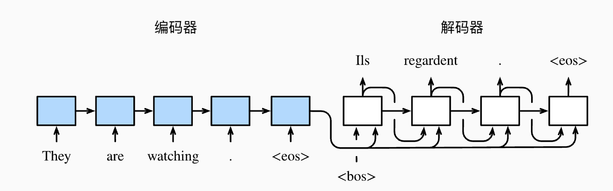

目录

- [encoder-decoder、seq2seq 简介](#encoder-decoderseq2seq-简介)
- [编码器](#编码器)
- [解码器](#解码器)
- [训练模型](#训练模型)
- [总结](#总结)
- [参考文献](#参考文献)

# encoder-decoder、seq2seq 简介

自然语言处理的很多应用中, 输入和输出都可以是不定长序列. 当输入和输出都是不定长序列时, 
我们可以使用 **编码器—解码器(encoder-decoder)** 或者 **seq2seq** 模型。
这两个模型本质上都用到了两个循环神经网络, 分别叫做 **编码器** 和 **解码器**。
    
- 编码器用来分析输入序列
- 解码器用来生成输出序列

以机器翻译为例, 输入可以是一段不定长的英语文本序列, 输出可以是一段不定长的法语文本序列, 例如

- 英语输入:“They”、“are”、“watching”、“.”
- 法语输出:“Ils”、“regardent”、“.”

上图描述了使用编码器—解码器将上述英语句子翻译成法语句子的一种方法:

- 序列表示特殊符号
    - 在训练数据集中, 可以在每个句子后附上特殊符号 `<eos>` (end of sequence)以表示序列的终止
    - 解码器在最初时间步的输入用到了一个表示序列开始的特殊符号 `<bos>` (beginning of sequence)
- 编码器
    - 编码器每个时间步的输入依次为:**英语句子中的单词、标点、特殊符号“<eos>”**
    - 使用编码器在最终时间步的隐藏状态作为输入句子的表征或编码信息
- 解码器
    - 解码器在各个时间步中使用输入句子的编码信息和上个时间步的输出以及隐藏状态作为输入 
    - 希望解码器在各个时间步能正确依次输出翻译后的:**法语单词、标点和特殊符号“<eos>”**

# 编码器

编码器的作用是把一个不定长的输入序列变换为一个定长的背景变量 `$c`, 并在该背景变量中编码输入序列信息。
编码器可以使用神经网络。

让我们考虑批量大小为 1 的时序数据样本。假设输入序列是 `$x_1, \cdots, x_T`, 例如 `$x_i$`  是输入句子中的第 `$i` 个词。

在时间步 `$t$`, 循环神经网络将输入 `$x_t` 的特征向量 `$\boldsymbol{x}_t` 和上个时间步的隐藏状态 `$\boldsymbol{h}_{t-1}$` 
变换为当前时间步的隐藏状态 `$\boldsymbol{h}_t`。我们可以用函数 `$f` 表达循环神经网络隐藏层的变换:

- `$\boldsymbol{h}_t = f(\boldsymbol{x}_t, \boldsymbol{h}_{t-1}).` 

接下来, 编码器通过自定义函数 `$q`  将各个时间步的隐藏状态变换为背景变量:

- `$\boldsymbol{c} = q(\boldsymbol{h}_1, \ldots, \boldsymbol{h}_T)$` 

例如, 当选择 `$q(\boldsymbol{h}_1, \ldots, \boldsymbol{h}_T) = \boldsymbol{h}_T`  时, 
背景变量是输入序列最终时间步的隐藏状态 `$h_T`.

以上描述的编码器是一个单向的循环神经网络, 每个时间步的隐藏状态只取决于该时间步及之前的输入子序列。
我们也可以使用双向循环神经网络构造编码器。在这种情况下, 编码器每个时间步的隐藏状态同时取决于该时间
步之前和之后的子序列(包括当前时间步的输入), 并编码了整个序列的信息。

# 解码器

编码器输出的背景变量 `$c` 编码了整个输入序列 `$x_1, \cdots, x_T` 的信息。

给定训练样本中的输出序列 `$y_1, y_2, \ldots, y_{T'}$`, 对每个时间步 `$t'`, 
解码器输出 `$y_t'`  的条件概率将基于之前的输出序列 `$y_1, y_2, \ldots, y_{t'-1}$` 和背景变量 `$c`, 
即 `$P(y_{t^\prime} \mid y_1, \ldots, y_{t^\prime-1}, \boldsymbol{c})$`。

为此, 我们可以使用另一个循环神经网络作为解码器。在输出序列的时间步 `$t'`, 
解码器将上一时间步的输出 `$y_t′−1` 以及背景变量 `$c` 作为输入, 
并将它们与上一时间步的隐藏状态 `$s_t′−1` 变换为当前时间步的隐藏状态 `$s_t′`。
因此, 我们可以用函数 `$g` 表达解码器隐藏层的变换:

- `$\boldsymbol{s}_{t^\prime} = g(y_{t^\prime-1}, \boldsymbol{c}, \boldsymbol{s}_{t^\prime-1}).` 

有了解码器的隐藏状态后, 我们可以使用自定义的输出层和 softmax 运算来计算 `$P(y_{t^\prime} \mid y_1, \ldots, y_{t^\prime-1}, \boldsymbol{c})$`, 
例如, 基于当前时间步的解码器隐藏状态 `$\boldsymbol{s}_{t^\prime}$`、上一时间步的输出 `$y_{t^\prime-1}$` 以及
背景变量 `$c` 来计算当前时间步输出 `$y_{t^\prime}$` 的概率分布。

# 训练模型

根据最大似然估计, 我们可以最大化输出序列基于输入序列的条件概率

`$$\begin{split}\begin{aligned}
P(y_1, \ldots, y_{T'} \mid x_1, \ldots, x_T)
&= \prod_{t'=1}^{T'} P(y_{t'} \mid y_1, \ldots, y_{t'-1}, x_1, \ldots, x_T)\\
&= \prod_{t'=1}^{T'} P(y_{t'} \mid y_1, \ldots, y_{t'-1}, \boldsymbol{c}),
\end{aligned}\end{split}$$` 

并得到该输出序列的损失

`$$- \log P(y_1, \ldots, y_{T'} \mid x_1, \ldots, x_T) = -\sum_{t'=1}^{T'} \log P(y_{t'} \mid y_1, \ldots, y_{t'-1}, \boldsymbol{c}).$$` 

在模型训练中, 所有输出序列损失的均值通常作为需要最小化的损失函数。在上面图所描述的模型预测中, 
我们需要将解码器在上一个时间步的输出作为当前时间步的输入。与此不同, 在训练中我们也可以将标签
序列(训练集的真实输出序列)在上一个时间步的标签作为解码器在当前时间步的输入。这叫作强制教学(teacher forcing)。

# 总结

- 编码器-解码器(seq2seq)可以输入并输出不定长的序列
- 编码器—解码器使用了两个循环神经网络
- 在编码器—解码器的训练中, 可以采用强制教学

# 参考文献

- [1] Cho, K., Van Merriënboer, B., Gulcehre, C., Bahdanau, D., Bougares, F., Schwenk, H., & Bengio, Y. (2014). Learning phrase representations using RNN encoder-decoder for statistical machine translation. arXiv preprint arXiv:1406.1078.
- [2] Sutskever, I., Vinyals, O., & Le, Q. V. (2014). Sequence to sequence learning with neural networks. In Advances in neural information processing systems (pp. 3104-3112).