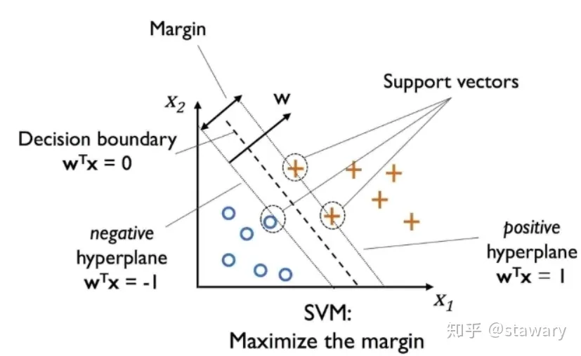
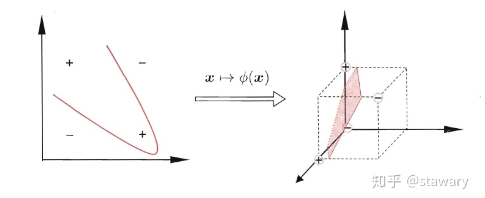

目录

- [SVM 模型概览](#svm-模型概览)
  - [SVM 介绍](#svm-介绍)
  - [SVM 优缺点](#svm-优缺点)
- [SVM 理论](#svm-理论)
  - [硬间隔](#硬间隔)
    - [超平面](#超平面)
    - [点到超平面的距离](#点到超平面的距离)
    - [超平面分类](#超平面分类)
    - [支持向量](#支持向量)
  - [拉格朗日函数](#拉格朗日函数)
  - [对偶问题](#对偶问题)
  - [SMO 算法](#smo-算法)
  - [软间隔](#软间隔)
  - [核函数](#核函数)
- [函数间隔与几何间隔](#函数间隔与几何间隔)
  - [函数间隔](#函数间隔)
  - [几何间隔](#几何间隔)
- [线性分类器](#线性分类器)
  - [线性可分性](#线性可分性)
  - [感知机](#感知机)
    - [感知机模型](#感知机模型)
    - [感知机模型学习](#感知机模型学习)
  - [Logistic 回归](#logistic-回归)
  - [支持向量机](#支持向量机)
- [参考](#参考)

# SVM 模型概览

## SVM 介绍

支持向量机是 90 年代中期发展起来的基于统计学习理论的一种有监督机器学习方法，
通过寻求结构化风险最小来提高学习器的泛化能力，实现经验风险和置信范围的最小化，
从而达到在统计样本量较少的情况下，也能获得良好的统计规律性 

对于一个分类问题，给定样本集​，的目的是在样本空间中找到一个划分超平面，可以将两种类别的样本分开。
事实上可能存在好几个超平面可以将正负样本分开，对于上图中不同的划分超平面，
从直观上来看应该用“中间”那个作为划分超平面，因为它距离两个类别最近的点距离差不多相等，
对于样本的局部扰动“容忍性”最高

所谓支持向量机, 顾名思义, 分为两个部分了解: 

* 支持向量: 支持或支撑平面上把两类类别划分开来的超平面的向量点
* 机(machine，机器): 一个算法

## SVM 优缺点

* 适用于高维数据
* 不同的核函数

# SVM 理论

## 硬间隔

> 如何来确定上文提到的距离两个类别最近的点的距离？

### 超平面

首先先来定义一下划分超平面：

`$$\mathbf{w}^{T}\mathbf{x}+b=0$$`

其中：

* `$\mathbf{w} = (\omega_{1}, \omega_{2}, \ldots, \omega_{d})$` 为法向量，决定了超平面的方向
* `$b$` 为偏移项，表示超平面与坐标原点之间的距离

### 点到超平面的距离

> 点到平面的距离解释：
> 
> 
> 给定平面 `$Ax + By + Cz + D = 0$`，求平面外一点到平面的距离 `$d$`：
> 任意取平面上一点 `$P(x, y,z)$`，连接两点 `$P, Q$`，
> 过 `$P$` 做平面的法向量 `$\vec n=(A, B, C)$`，
> 可以看到点 `$Q$` 到平面的距离正好是向量 `$\overrightarrow{PQ}$` 在法向量 `$\vec n$` 上的投影长度。
> 所以有：
> `$$\begin{align}
> d &=||\overrightarrow{PQ}|| \cdot \cos \theta \\
>   &= \frac{||\vec{n}||}{||\vec{n}||} \cdot ||\overrightarrow{PQ}||\cdot \cos \theta  \\
>   &= \frac{\overrightarrow{PQ}\cdot \vec{n}}{||\vec{n}||}
> \end{align}$$`
> 由上面的分析可知，点到平面的距离公式为向量与法向量的点积除以法向量的模

将划分超平面记为 `$(\mathbf{w}, b)$`，则样本空间任意点 `$x$` 到超平面的距离为：

`$$\gamma = \frac{|\mathbf{w}^{T}\mathbf{x} + b|}{||\mathbf{w}||}$$`

### 超平面分类

假设超平面可以将样本正确分类，我们可以得到：

`$$\begin{cases}
\mathbf{w}^{T}\mathbf{x}_{i} + b \geq +1, y_{i} = +1 \\
\mathbf{w}^{T}\mathbf{x}_{i} + b \leq +1, y_{i} = -1 \\
\end{cases}$$`

注意上式中的 `$\geq +1$`，若是超平面 `$(\mathbf{w}', b')$` 可以将样本正确分类且距离超平面最近的样本距离为 `$d$`，
则有 `$\mathbf{w} = \frac{1}{d}\mathbf{w}'$`，`$b=\frac{1}{d}b'$`，使得：

`$$\begin{cases}
d\mathbf{w}^{T}\mathbf{x}_{i} + db \geq +d, y_{i} = +1 \\
d\mathbf{w}^{T}\mathbf{x}_{i} + db \leq +d, y_{i} = -1 \\
\end{cases}$$`

两边约去 `$d$` 总能得到上面的式子

### 支持向量

距离超平面最近的点使得上式中的等号成立，它们被称为“支持向量”(Support vectors)，
不同种类的支持向量到超平面的距离之和称为“间隔”(Margin)，有：

`$$Margin = \frac{2}{||\mathbf{w}||}$$`

分类的目标就是要找到这样的 `$\mathbf{w}$` 使得划分超平面具有最大间隔，
可以等价于最小化 `$\frac{1}{2}||\mathbf{w}||^{2}$`，
于是得到需要求得的目标函数和约束条件

`$$\underset{\omega, b}{min}\frac{1}{2}||\mathbf{w}||^{2}$$`

`$$s.t. \quad y_{i}(\mathbf{w}_{i}^{T}x_{i} + b) \geq 1, i = 1, 2, \ldots, m$$`

## 拉格朗日函数

原始问题是一个凸二次规划问题，将这个问题一般化：

`$$\underset{x \in R^{n}}{min}f(x)$$`

`$$s.t. \quad\begin{cases}
c_{i}(x) \leq 0, i=1,2,\ldots, k \\
h_{j}(x) = 0, j = 1, 2, \ldots, l
\end{cases}$$`

对每条约束添加拉格朗日乘子，上式写成拉格朗日函数为：

`$$L(x, \alpha, \beta) = f(x) + \sum_{i=1}^{k}\alpha_{i}c_{i} + \sum_{j=1}^{l}\beta_{j}h_{j}(x)$$`

上式将对 `$x$` 有限制条件的 `$f(x)$` 的最优化问题转转化为对 `$x$`、`$\alpha$`、`$\beta$` 没有限制条件的极值问题，
其中 `$\alpha_{i}$`，`$\beta_{i}$` 是拉格朗日乘子，且有 `$\alpha_{i} \geq 0$`

对于拉格朗日函数，问题求解变为：

`$$\begin{align}
\theta_{p}(x) &= \underset{\alpha,\beta, \alpha_{i} \geq 0}{max}L(x, \alpha, \beta) \\
&= \underset{\alpha, \beta, \alpha_{i} \geq 0}{max}\Big(f(x) + \sum_{i=1}^{k}\alpha_{i}c_{i}(x) + \sum_{j=1}^{l}\beta_{j}h_{j}(x)\Big)
\end{align}$$`

我们来对这个函数深入解析：

1. 如果有 `$x$` 不满足原始约束条件，既有 `$c_{i}(x) \geq 0$` 或 `$h_{j} \neq 0$`。
   由于有​ `$\alpha_{i} \geq 0$`，可取 `$\alpha_{i} = +\infty$`，
   `$\beta_{j}h_{j}(x) = +\infty$`，此时 `$\theta_{p}(x) \rightarrow +\infty$` 
2. 如果全部​都满足原始条件约束，即有​ `$c_{i}(x)\leq 0$`、`$h_{j}=0$`、`$\alpha_{i} \geq 0$`，
   此时有 `$\sum_{j=1}^{l}\beta_{j}h_{j}(x) = 0$`，`$\sum_{i=1}^{k}\alpha_{i}c_{i} \leq 0$`，
   要使 `$\theta_{p}(x)$` 最大，那么就有 `$\sum_{i=1}^{k}\alpha_{i}c_{i}(x) = 0$`，
   此时 `$\theta_{p}(x) = f(x)$`。注意：`$max$` 函数的参数是 `$\alpha$`、`$\beta$`，此时把 `$x$` 看做常数，
   所以 `$f(x)$` 也是常数，`$max f(x)$` 自然就是 `$f(x)$` 本身了
3. 所以原最小化问题​ `$\underset{\omega, b}{min}f(x)$` 可以变为 `$\underset{\omega, b}{min}\theta_{p}(x)$`，
   然后可以推出原问题的目标函数为 
   
`$$\underset{x}{min}\underset{\alpha, \beta, \alpha \geq 0}{max}L(x, \alpha, \beta)$$`

至此，我们将 SVM 要求得最大间隔的凸二次规划问题转变成了拉格朗日函数求解问题

## 对偶问题

得到了上述的拉格朗日函数，就要考虑如何求解了

通常情况下我们求最小化问题比较方便，即求导为 0 即可，于是我们将上述拉格朗日函数转为求其对偶问题，
即将 `$min$`、`$max$` 求解顺序对调，变为 `$max$`、`$min$`​。有一个显而易见的结论，
即对一个序列先找极小值，然后在所有极小值中找到一个最大值 `$a$`​；对一个序列先找极大值，
然后在所有极大值中找到一个最小值​ `$b$`。 `$a \leq b$` 是明显成立的。因此有：

`$$\underset{\alpha, \beta, \alpha_{i} \geq 0}{max}\underset{x}{min}L(\mathbf{x}, \alpha, \beta) \leq \underset{x}{min}\underset{\alpha, \beta, \alpha_{i} \geq 0}{max}L(\mathbf{x}, \alpha, \beta)$$`

可以看到对偶问题外层的优化目标参数是拉格朗日参数，然后通过求得的拉格朗日参数，
间接得到我们最终要求的超平面的参数​ `$\mathbf{x}$`。而原始问题外层的优化目标参数直接是​ `$\mathbf{x}$`，
无法直接去优化得到这个参数，因为还存在着其他未知的拉格朗日参数。
（注意：此处的参数​ `$\mathbf{x}$` 而非​ `$\mathbf{w}$`，
是因为最开始将 `$\frac{1}{2}||\mathbf{w}||^{2}$` ​抽象成了​ `$f(\mathbf{x})$`）

我们开始回到求解 SVM 优化目标的问题上，先最小化​ `$L(\mathbf{w}, b, \alpha)$`：

`$$L(\mathbf{w}, b, \alpha) = \frac{1}{2}||\mathbf{w}||^{2}+\sum_{i=1}^{m}\alpha_{i}(1-y_{i}(\mathbf{w}^{T}x_{i} + b))$$`

此式中 `$\mathbf{w}$`、`$\mathbf{x}$` ​与线性回归中一样，为 `nub_features` 维的向量， 
`$m$` 为样本个数，对每个样本有一个​ `$\alpha_{i}$`，
即​ `$\alpha=(\alpha_{1}, \alpha_{2}, \ldots, \alpha_{m})$`

令 `$L(\mathbf{w}, b, \alpha)$` 对 `$\mathbf{w}$` 和 `$b$` 的偏导为 0，有：

`$$\begin{align}
\frac{\partial L(\mathbf{w}, b, \alpha)}{\partial \mathbf{w}} 
&= \frac{\partial}{\partial \mathbf{w}}\Bigg[\frac{1}{2}||\mathbf{w}||^{2}+\sum_{i=1}^{m}(\alpha_{i} - \alpha_{i} y_{i} \mathbf{w}^{T}\mathbf{x}_{i} + \alpha_{i}b)\Bigg] \\
&= \mathbf{w} + \sum_{i=1}^{m}(0 - \alpha_{i}y_{i}\mathbf{x}_{i} + 0) \\
&= \mathbf{w} - \sum_{i=1}^{m}\alpha_{i}y_{i}\mathbf{x}_{i} \\
&= 0
\end{align}$$`

所以有：

`$$\mathbf{w} = \sum_{i=1}^{m}\alpha_{i}y_{i}\mathbf{x}_{i}$$`

同理对 `$b$` 求偏导，可得：

`$$\sum_{i=1}^{m}\alpha_{i}y_{i} = 0$$`

## SMO 算法

那上面的 ​
 是如何求解得到的呢？这里我们采用Platt在1998年专门针对SVM的对偶问题求解设计的算法SMO(Sequential Minimal Optimization)。它的主要思想是每次挑选出两个变量 
 ​和​ 
 ，固定其他的 
 ​参数，由此问题就变成了类似于二次方程求最大值的问题 。其大致为重复一下步骤：

选出​ 
 中“最不好”的两个参数 
、
 、​
固定这两个参数以外的其他​ 
 ，求解​ 
 来更新 
、
 ​。
选取的 
、
 ​只要有一个不满足KKT条件，目标函数就会在迭代会减小。而KKT条件的违背程度越大，则更新变量后目标函数值减小的幅度越大。

那我们应该如何选取这两个参数 
 ​和​ 
 呢？

先选出违反KKT条件最严重的样本，以其参数作为第一个参数
采用启发式的思考方式，选择与第一个样本间隔最大的样本，其参数作为第二个参数。直观的解释是，与对两个相似的参数进行更新相比，两个参数有很大的差别，更新会使目标函数变化更大。

## 软间隔

以上的推导形式都是建立在样本数据线性可分的基础上，如果样本数据中线性不可分（你中有我，我中有你），
应该如何处理呢？这里我们引入软间隔（Soft Margin），意味着，允许支持向量机在一定程度上出错

## 核函数

软间隔解决的实际上是允许模型忽略某些异常点来进行划分的问题，即在绝大部分样本都能被正确分类的情况下，
某几个样本无法被划分超平面分开，我们不认为应该考虑它来重新修改模型，而是认为给出的样本是被错误分类的

那如果大部分样本都线性不可分怎么办？完全的你中有我，我中有你。

此时引入核函数，简单来说就是将低维空间的样本映射到高维空间。
以“异或”问题为例，二维情况下无论如何都不能将正负样本线性分开，
但映射到三维后就可以用一个平面将样本分开

由 Cover 定理可证，同一份样本数据在越高维的空间中越有可能线性可分。
若设 `$d$` 维空间中 `$N$` 个点线性可分的概率为​ `$p(d, N)$`，那么就有：

`$$p(d, N)=\frac{2\sum_{i=0}^{m}C_{N-1}^{i}}{2^{N}}=\begin{cases}
\frac{\sum_{i=1}^{d}C_{N-1}^{i}}{2^{N-1}}, \quad N > d + 1 \\
1, \quad \quad \quad \quad N \leq d + 1
\end{cases}$$`

# 函数间隔与几何间隔

> * 函数间隔，Function Margin
> * 几何间隔，Geometric Margin

一般而言, 一个数据点距离超平面(`$\omega^{T}x+b =0$`)的远近可以表示为分类预测的确信或准确程度

在超平面 `$\omega^{T}x+b$` 确定的情况下，`$|\omega^{T}x+b|$` 能够相对表示点 `$x$` 距离超平面的远近；
而 `$\omega^{T}x+b$` 的符号与类别标记 `$y$` 的符号是否一致表示分类是否正确，
可以用指标量 `$y\cdot (\omega^{T}x+b)$` 的正负性来判定或表示分类的正确性和确信度

## 函数间隔

> Function Margin

函数间隔: 

`$$\hat{\gamma}=y\cdot (\omega^{T}x+b)=yf(x)$$`

超平面 `$\omega^{T}x+b$` 关于训练数据 `$T$` 的函数间隔为超平面 `$\omega^{T}x+b$` 
关于 `$T$` 中所有样本点 `$(x_i, y_i)$` 的函数间隔的最小值: 

`$$\hat{\gamma}=\min\hat{\gamma}_{i}, i = 1, 2,..., n$$`

上面定义的函数间隔虽然可以表示分类预测的正确性和确信度，但在选择分类超平面时，只有函数间隔是不够的。
如果成比例的改变 `$\omega$` 和 `$b$`，比如将他们改变为 `$2\omega$` 和 `$2b$`，
虽然此时超平面没有改变, 但是函数间隔的值 `$yf(x)$` 却变成了原来的 4 倍

解决防范: 可以对法向量 `$\omega$` 加一些约束条件，使其表面上看起来规范化

## 几何间隔

> Geometric Margin

# 线性分类器

## 线性可分性

给定一个数据集

`$$T = \{(x_1,y_1),(x_2, y_2),...,(x_n, y_n)\}$$`

其中: 

- `$x_i\in R^{n}$`
- `$y_i \in \{0, 1\}$`
- `$i=1,2, ..., n$`

如果存在某个超平面 `$S$`:

`$$\omega^{T}x+b=0$$`

能够将数据集的正实例(`$y=1$`)和负实例(`$y=0$`)完全正确地分到超平面的两侧，
即对所有的 `$y_{i}=1$` 的实例 `$i$`，有 `$\omega^{T}x+b>0$`；
对所有的 `$y_i=0$` 的实例 `$i$`，有 `$\omega^{T}x+b<0$`，
则称数据集 `$T$` 为线性可分数据集, 否则称为线性不可分

一个二分类线性分类器就是要在 `$R^n$` 特征空间中找到一个超平面 `$S$`，其方程可以表示为：

`$$\omega^{T}x+b = 0$$`

这个超平面将特征空间划分为两个部分, 位于两部分的点分别被分为两类

## 感知机

### 感知机模型

感知机就是一个二分类线性分类器，其目的是从特征学习出一个分类模型 `$f(\cdot)$`：

`$$y=f(z), y \in \{0, 1\}$$`

感知机模型是将特征变量的线性组合作为自变量：

`$$z=\omega^{T}x + b$$`

由于自变量 `$x$` 取值的范围是 `$[-\infty, +\infty]$`，
因此需要使用阶跃函数(Step 函数)将线性模型 `$z=\omega^{T}x + b$` 映射到集合 `$\{0, 1\}$` 上

阶跃函数(step function) `$f(\cdot)$` 如下：

`$$f(z) = \begin{cases}
1 & & z \geq 0 \\
0 & & z < 0
\end{cases}$$`

感知机模型的目标就是从数据中学习得到 `$\omega, b$`，
使得正例 `$y=1$` 的特征 `$\omega^{T}x+b$` 远大于 `$0$`，
负例 `$y=0$` 的特征 `$\omega^{T}x + b$` 远小于 `$0$`

### 感知机模型学习

感知机的学习就是寻找一个超平面能够将特征空间中的两个类别的数据分开，
即确定感知机模型参数 `$\omega, b$`, 所以需要定义学习的损失函数并将损失函数最小化

1. 定义学习损失函数

`$$L(\omega, b)=-\frac{1}{||\omega||}\sum_{x_i \in M}y_i(\omega^{T} x_i + b) \\
=-\sum_{x_i \in M}y_i(\omega^{T} x_i + b)$$`

其中: 

* 集合 `$M$` 是超平面 `$S$` 的误分类点集合

损失函数的意义是：误分类点到超平面的 `$S$` 的距离总和

2. 感知机学习算法

> 随机梯度下降算法(Stochastic gradient descent)

最优化问题: 

`$$\omega, b= argmin L(\omega, b)=-\sum_{x_i \in M}y_i(\omega^{T} x_i + b)$$`

算法: 

1. 选取初始值: `$\omega_0, b_0$`
2. 在训练数据中选取数据点 `$(x_i, y_i)$`
3. 如果 `$y_i(\omega\cdot x_i + b)<0$`
    - `$\omega \gets \omega + \eta y_i x_i$`
    - `$b \gets b + \eta y_i$`
4. 重新选取数据点，直到训练集中没有误分类点

## Logistic 回归

Logistic Regression 的目的是从特征学习出一个 0/1 分类模型 `$f(\cdot)$`：

`$$y = f(z), y \in \{0, 1\}$$`

Logistic Regression 模型是将特征变量的线性组合作为自变量: 

`$$z=\omega^{T}x + b$$`

由于自变量 `$x$` 取值的范围是 `$[-\infty, +\infty]$`，
因此需要使用 Logistic 函数(Sigmoid 函数)将自变量 `$z=\omega^{T}x + b$` 映射到范围 `$[0, 1]$` 上。
映射后的值被认为是 `$y=1$` 的概率。假设: 

`$$h_{\omega,b}(x)=\sigma(\omega^{T}x + b)$$`

其中：

* `$\sigma(z)$` 是 Sigmoid 函数 

`$$\sigma(z)=\frac{1}{1+e^{-z}}$$`

因此 Logistic Regression 模型的形式为： 

`$$\begin{cases}
P(y=1|x, \omega) = h_{\omega, b}(x) =\sigma(\omega^{T}x+b) \\ 
P(y=0|x, \omega) = 1 - h_{\omega, b}(x) =1-\sigma(\omega^{T}x+b) 
\end{cases}$$`

当要判别一个新来的数据点 `$x_{test}$` 属于哪个类别时, 
只需要求解 `$h_{\omega, b}(x_{test}) = \sigma(\omega^{T}x_{test} + b)$`: 

`$$ y_{test}=\left\{
\begin{array}{rcl}
1    &      & h_{\omega,b}(x_{test}) \geq 0.5 & \Leftrightarrow & \omega^{T}x_{test}+b \geq 0\\
0    &      & h_{\omega,b}(x_{test}) < 0.5 & \Leftrightarrow & \omega^{T}x_{test}+b < 0\\
\end{array} \right.$$`

Logistic Regression 的目标就是从数据中学习得到 `$\omega, b$`, 
使得正例 `$y=1$` 的特征 `$\omega^{T}x+b$` 远大于 `$0$`, 
负例 `$y=0$` 的特征 `$\omega^{T}x + b$` 远小于 `$0$`. 

## 支持向量机

在支持向量机中, 将符号进行变换: 

假设: 

`$$h_{\omega,b}(x)=\sigma(\omega^{T}x + b)$$`

这里，只需考虑 `$\omega^{T}x + b$` 的正负问题，而不关心 `$\sigma(\cdot)$` 的形式。
因此将 `$\sigma(\cdot)$` 进行简化，将其简单地映射到 `$[-1, 1]$` 上：

`$$\sigma(z)=\left\{
\begin{array}{rcl}
1     &      & z \geq 0\\
-1    &      & z < 0\\
\end{array} \right. $$`

# 参考

* [支持向量机与对偶问题](https://zhuanlan.zhihu.com/p/39592364)

