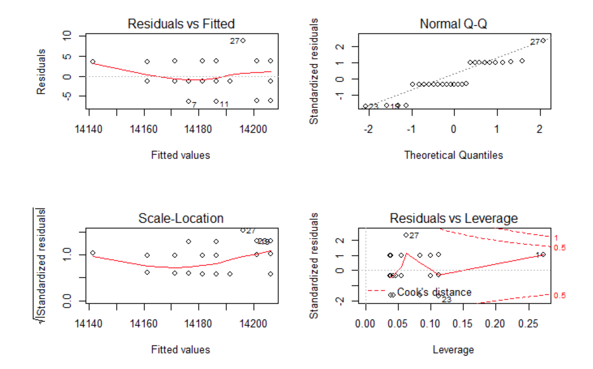

目录

- [回归分析](#回归分析)
  - [回归分析介绍](#回归分析介绍)
  - [回归分析步骤](#回归分析步骤)
  - [模型选择](#模型选择)
    - [模型比较](#模型比较)
    - [变量选择](#变量选择)
  - [模型泛化能力评价](#模型泛化能力评价)
- [简单线性回归](#简单线性回归)
  - [简单线性回归介绍](#简单线性回归介绍)
  - [建立回归模型](#建立回归模型)
  - [回归参数估计](#回归参数估计)
  - [回归方程的显著性检验](#回归方程的显著性检验)
  - [残差分析和异常点检测](#残差分析和异常点检测)
  - [模型预测](#模型预测)
- [多元线性回归](#多元线性回归)
- [岭回归](#岭回归)
- [LASSO](#lasso)
- [弹性网回归](#弹性网回归)
- [偏最小二乘回归](#偏最小二乘回归)
- [判别性分析](#判别性分析)
- [QDA](#qda)

# 回归分析

## 回归分析介绍

回归分析属于统计学的基本模型，回归分析(Regression Analysis)是用来确定两个或两个以上变量间关系的一种统计分析方法

在回归分析中，变量有两类：因变量和自变量。因变量通常是指实际问题中所关心的指标，用 `$Y$` 表示。
而自变量是影响因变量取值的一个变量，用 `$X$` 表示，如果有多个自变量则表示为 `$X_{1},X_{2},\ldots,X_{p}$`

## 回归分析步骤

1. 确定因变量 `$Y$` 与自变量 `$X_{1},X_{2},\ldots,X_{p}$` 之间的定量关系表达式，即回归方程
2. 对回归方程进行置信度进行检验
3. 判断自变量 `$X_{n}(n=1,2,\ldots,m)$` 对因变量 `$Y$` 的影响
4. 利用回归方程进行预测

## 模型选择

### 模型比较

考虑模型预测精度（模型尽可能地拟合数据）和模型简洁度（一个简单且能复制的模型）的调和

### 变量选择

* 嵌入法
    - 逐步回归(stepwise method)
    - 向前逐步回归(forward stepwise)
    - 向后逐步回归(backward stepwise)
    - 向前向后逐步回归(stepwise stepwise)
    - 全子集回归(all-subsets regression)
* 降维
    - 主成分分析
    - 回归正则化
        - LASSO 等

## 模型泛化能力评价

* 交叉验证

# 简单线性回归

## 简单线性回归介绍

简单线性回归分析是处理两个变量之间关系的最简单模型，是两个变量之间的线性相关关系

如果回归分析中，只包括一个自变量 `$X$` 和一个因变量 `$Y$` 时，且它们的关系是线性的，
那么这种回归分析称为一元线性回归分析，也称为简单线性回归

## 建立回归模型

如果从散点图上发现数据点基本排列在一条直线附近，那么可以假设 `$X$` 和 `$Y$` 的关系是线性的。
下面建立以 `$X$` 为自变量，以 `$Y$` 为因变量的一元线性模型：可以用公式表式为：

`$$Y=\alpha+\beta X+\epsilon$$`

其中：

* `$Y$` 因变量
* `$X$` 自变量
* `$\alpha$` 截距项
* `$\beta$` 自变量系数
* `$\alpha+\beta X$` 表示 `$Y$` 随 `$X$` 的变化而变化的线性部分
* `$\epsilon$` 为残差或随机误差，是其他一切不确定因素影响的总和，其值不可观测。假设 `$\epsilon$` 是服从均值为0方差为σ2
的正态分布, 记作 `$\epsilon \sim N(0,\sigma^{2})$`

对于上面的公式, 称函数 `$f(X)$` 为一元线性回归函数:

`$$f(X)=\alpha+\beta X$$`

* `$\alpha$` 为回归常数
* `$\beta$` 为回归系数
* `$X$` 为回归自变量或回归因子
* `$Y$` 为回归因变量或响应变量

如果 `$(X_{i},Y_{i}), i=1,2,\ldots,n$` 是 `$(X,Y)$` 的一组观测值，则一元线性回归模型可表示为:

`$$Y_{i}=\alpha+\beta X+\epsilon_{i},i=1,2,…,n$$`

其中

* `$E(\epsilon_{i})=0$`
* `$var(\epsilon_{i})=\sigma^{2}$`
* `$i=1,2,\ldots,n$`

## 回归参数估计

简单线性回归模型的参数估计采用最小二乘法

估计出回归参数后，就可以根据回归参数估计得到 `$Y$` 和 `$X$` 的一条线性关系直线，称为拟合回归线

## 回归方程的显著性检验

拟合回归直线是用数据拟合出来的，是一个近似的值。可以看到有些点在线上，
有些点不在线上。要评价这条回归线拟合的好坏，我们就需要对回归模型进行显著性检验

从回归参数的公式可知，在计算过程中并不一定要知道 `$Y$` 和 `$X$` 是否有线性相关的关系。
如果不存相关关系，那么回归方程就没有任何意义了，如果 `$Y$` 和 `$X$` 是有相关关系的，
即 `$Y$` 会随着 `$X$` 的变化而线性变化，这个时候一元线性回归方程才有意义。
所以，我们需要用假设检验的方法，来验证相关性的有效性

通常会采用三种显著性检验的方法：

* `$t$` 检验：`$t$` 检验是检验模型某个自变量 `$X_{i}$` 对于 `$Y$` 的显著性，
  即检验：原假设为 `$X_{i}$` 的回归系数为 0。通常用 P-value 判断显著性，
  小于 `$\alpha=0.01$` 或更小时说明这个自变量 `$X_{i}$` 与 `$Y$` 相关关系显著
* `$F$` 检验：`$F$` 检验用于对所有的自变量 `$X$` 在整体上看对于 `$Y$` 的线性显著性，
  即检验：原假设为 `$X_{i},i=1,\ldots,p$` 的回归系数全部为 0。也是用 P-value 判断显著性，
  小于 `$\alpha = 0.01$` 或更小时说明整体上自变量 `$X$` 与 `$Y$` 相关关系显著
* `$R^{2}$` (R 方)相关系数检验：用来判断回归方程的拟合程度，`$R^{2}$` 的取值在 `$[0,1]$` 之间，
  越接近 1 说明模型对训练数据的拟合程度越好

## 残差分析和异常点检测

在得到的回归模型进行显著性检验后，还要在做残差分析(因变量估计值和实际值之间的差)，
检验模型的正确性，残差必须服从正态分布 `$\epsilon \sim N(0,\sigma^{2})$`。
所以需要计算数据残差，并进行正态分布检验

1. 计算残差
2. 对残差进行 Shapiro-Wilk 正态分布检验，W 接近 1，p-value>0.05，证明数据集符合正态分布。
   并生成评价拟合模型拟合情况的四幅诊断图

举例如下：

* 图 1：残差和拟合值对比图
    - 对残差和拟合值作图，横坐标是拟合值，纵坐标是残差。残差和拟合值之间，数据点均匀分布在 `$y=0$` 两侧，
      呈现出随机的分布，红色线呈现出一条平稳的曲线并没有明显的形状特征，说明残差数据表现非常好
* 图 2：残差 QQ 图
    - 残差 QQ 图，用来描述残差是否符合正态分布。图中的数据点按对角直线排列，趋于一条直线，
      并被对角直接穿过，直观上符合正态分布。对于近似服从正态分布的标准化残差，应该有 95% 的样本点落在 `$[-2,2]$` 区间内
* 图3：标准化残差平方根和拟合值对比图
    - 对标准化残差平方根和拟合值作图，横坐标是拟合值，纵坐标是标准化后的残差平方根。
      与残差和拟合值对比图(图1)的判断方法类似，数据随机分布，红色线呈现出一条平稳的曲线，无明显的形状特征
* 图 4：标准残差和杠杆值对比图
    - 对标准化残差和杠杆值作图，虚线表示的 cooks 距离等高线，通常用 Cook 距离度量的回归影响点。
      本图中没有出现红色的等高线，则说明数据中没有特别影响回归结果的异常点

看到上面 4 幅图，每幅图上都有一些点被特别的标记出来了，这些点是可能存在的异常值点，
如果要对模型进行优化，我们可以从这些来入手。但终于本次残差分析的结果已经很好了，
所以对于异常点的优化，可能并不能明显的提升模型的效果

## 模型预测

通过上面的建模，获得了一元线性回归方程的公式，就可以对数据进行预测了

对给定 `$X=x_{0}$` 时，计算出 `$y_{0}=\alpha+\beta x_{0}$` 的值，并计算出置信度为 `$1-\alpha$` 的预测区间

当 `$X=x_{0}$`，`$Y=y_{0}$` 时，置信度为 `$1-\alpha$` 的预测区间为 `$[\hat{y}_{0} - l, \hat{y} + l]$`，
其中：

`$$l = t_{\alpha}(n-2)\hat{\sigma}\sqrt{1+\frac{1}{n}+\frac{(x-x_{0})^{2}}{S_{xx}}}$$`

即：

`$$P(\hat{y} - l < y_{0} < \hat{y} + l)=\alpha$$`

计算预测值 `$y_{0}$`，和相应的预测区间

# 多元线性回归

# 岭回归

# LASSO

# 弹性网回归

# 偏最小二乘回归

# 判别性分析

> LDA

# QDA

