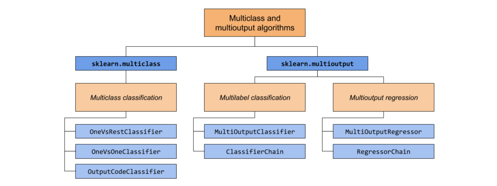
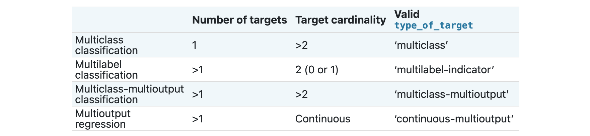

<style>
details {
    border: 1px solid #aaa;
    border-radius: 4px;
    padding: .5em .5em 0;
}
summary {
    font-weight: bold;
    margin: -.5em -.5em 0;
    padding: .5em;
}
details[open] {
    padding: .5em;
}
details[open] summary {
    border-bottom: 1px solid #aaa;
    margin-bottom: .5em;
}
img {
    pointer-events: none;
}
</style>

<details><summary>目录</summary><p>

- [Multiclass 分类](#multiclass-分类)
  - [目标变量格式](#目标变量格式)
  - [OneVsRestClassifier](#onevsrestclassifier)
  - [OneVsOneClassifier](#onevsoneclassifier)
  - [OutputCodeClassifier](#outputcodeclassifier)
- [Multilabel 分类](#multilabel-分类)
- [Multiclass-Multioutput 分类](#multiclass-multioutput-分类)
- [Multioutput 回归](#multioutput-回归)
  - [目标变量格式](#目标变量格式-1)
  - [MultiOutputRegressor](#multioutputregressor)
  - [RegressorChain](#regressorchain)
- [参考](#参考)
</p></details><p></p>





# Multiclass 分类

> Multiclass classification is a classification task with more than two classes. 
> Each sample can only be labeled as one class.

## 目标变量格式

* 包含多个离散值的一维向量

```python
import numpy as np

y = np.array(["apple", "pear", "apple", "orange"])
```

* 形状为 `$(n\_samples, n\_classes)$` 的二元矩阵

```python
import numpy as np
from sklearn.preprocessing import LabelBinarizer
from scipy import sparse

y = np.array(["apple", "pear", "apple", "orange"])

# dense binary matrix
y_dense = LabelBinarizer().fit_transform(y)
y_dense

# sparse binary matrix
y_sparse = sparse.csr_matrix(y_dense)
y_sparse
```

```
 [[1 0 0]
  [0 0 1]
  [1 0 0]
  [0 1 0]]

(0, 0)        1
(1, 2)        1
(2, 0)        1
(3, 1)        1
```

## OneVsRestClassifier

> one-vs-rest，one-vs-all

```python
from sklearn import datasets
from sklearn.multiclass import OneVsRestClassifier
from sklearn.svm import LinearSVC

X, y = datasets.load_iris(return_X_y = True)
svc = LinearSVC(random_state = 0)
OVR = OneVsRestClassifier(svc).fit(X, y).predict(X)
```

## OneVsOneClassifier

```python
from sklearn import datasets
from sklearn.multiclass import OneVsOneClassifier
from sklearn.svm import LinearSVC

X, y = datasets.load_iris(return_X_y = True)
svc = LinearSVC(random_state = 0)
OVO = OneVsOneClassifier(svc).fit(X, y).predict(X)
```


## OutputCodeClassifier


# Multilabel 分类

> Multilabel classification


# Multiclass-Multioutput 分类

> Multiclass-Multioutput classification


# Multioutput 回归

> Multioutput regression


## 目标变量格式

```python
import numpy as np

y = np.array(
    [[31.4, 94],
     [40.5, 109],
     [25.0, 30]]
)
```

## MultiOutputRegressor

```python
from sklearn.datasets import make_regression
from sklearn.multioutput import MultiOutputRegressor
from sklearn.ensemble import GradientBoostingRegressor

X, y = make_regression(n_samples = 10, n_targets = 3, random_state = 1)

gbr = GradientBoostingRegressor(random_state = 0)
MOR = MultiOutputRegressor(gbr).fit(X, y).predict(X)
```

## RegressorChain


# 参考

* [Multiclass and multioutput algorithms](https://scikit-learn.org/stable/modules/multiclass.html#multiclass-classification)
