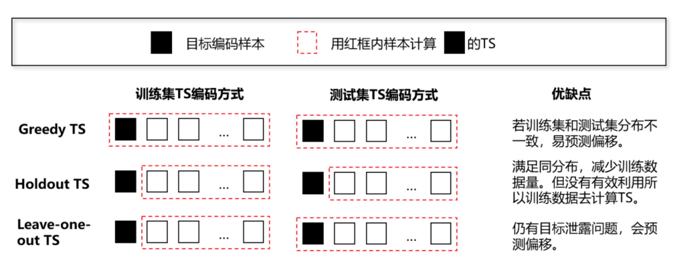
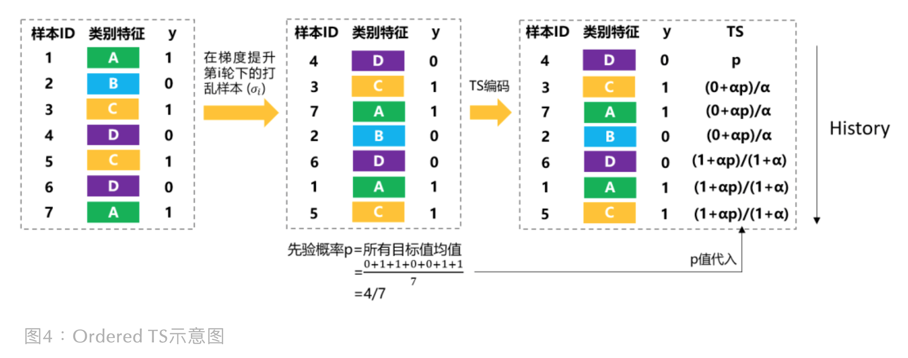
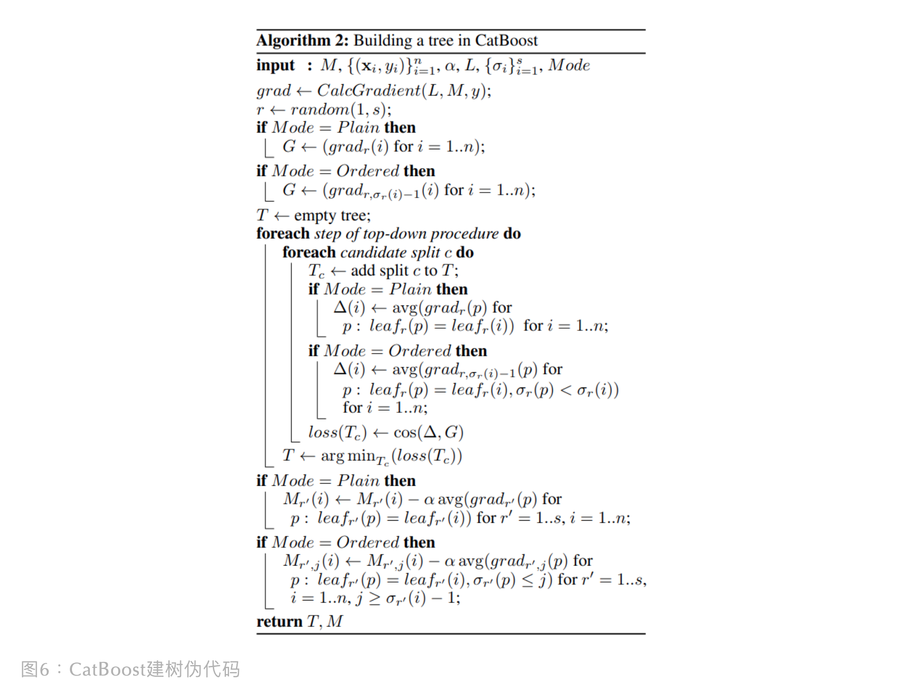

目录

- [CatBoost 简介](#catboost-简介)
  - [CatBoost 特点](#catboost-特点)
  - [CatBoost vs LightGBM](#catboost-vs-lightgbm)
- [CatBoost 优化策略](#catboost-优化策略)
- [预测漂移](#预测漂移)
  - [类别特征编码中的预测偏移](#类别特征编码中的预测偏移)
  - [梯度提升方法中的预测偏移](#梯度提升方法中的预测偏移)
  - [CatBoost 优化原理](#catboost-优化原理)
- [类别特征处理策略](#类别特征处理策略)
  - [低基数类别特征](#低基数类别特征)
  - [高基数类别特征](#高基数类别特征)
  - [目标变量编码](#目标变量编码)
    - [均值编码](#均值编码)
    - [平滑均值编码](#平滑均值编码)
    - [其他均值编码](#其他均值编码)
- [Ordered TS](#ordered-ts)
- [Ordered Boosting](#ordered-boosting)
- [特征组合](#特征组合)
- [参考](#参考)

# CatBoost 简介

> CatBoost，Categorical Boosting

CatBoost 由俄罗斯公司 Yandex 设计，并于 2017 年在 Github 上开源。在 2017 年刚刚开源的时候，
CatBoost 的效果并不理想，而且因为 CatBoost 在 CPU 上训练很慢，并不是很受大家的欢迎。
但随着 CatBoost 开始支持 GPU 训练，模型训练速度得到了大大提升，
后来大家发现其经常在类别特征较多的竞赛中可以取得非常不错的效果而越加受欢迎。
CatBoost 的名称由 Category 和 Boosting 组成，从名称我们也可以看出，
CatBoost 在类别特征方面的处理进行了升级处理。当然除此之外，
CatBoost 还解决了梯度偏差（Gradient Bias）以及预测偏移（Prediction shift）的问题，
进一步提升了模型的效果和泛化能力

## CatBoost 特点

> CatBoost is a fast, scalabel, high performance open-scource gradient
> boosting on decision trees library;
> 
> 1. Greate quality without parameter tuning
>     - Reduce time spent on parameter tuning, because CatBoost provides great results with default parameters;
> 2. Categorical features support(支持类别性特征, 不需要将类别型特征转换为数字类型)
>     - Improve your training results with CastBoost that allows you to use non-numeric factors, 
>       instead of having to pre-process your data or spend time and effort turning it to numbers.
> 3. Fast and scalable GPU version
>     - Train your model on a fast implementation of gradient-boosting algorithm for GPU.
>      Use a multi-card configuration for large datasets;
> 4. Imporved accuracy
>     - Reduce overfitting when constructing your models with a novel gradient-boosting scheme;
> 5. Fast prediction
>    - Apply your trained model quickly and efficiently even to latency-critical task using CatBoost's models applier;

## CatBoost vs LightGBM

CatBoost 与 XGBoost、LightGBM 相比，又有哪些不一样的地方呢？此处我们将其归纳为下面几点：

* CatBoost 对类别特征的处理进行了进一步的细化与升级，无需对类别特征进行明显的预处理，
  CatBoost 可以自动将类别特征处理为数值型特征
* CatBoost 可以自动化寻找类别特征的组合，利用特征之间的关系，极大地丰富特征的维度
* CatBoost 采用 Ordered Boosting 的方法对抗训练集中的噪声点，避免梯度估计的偏差，
  更好地解决了预测偏移的问题；尤其是在小数据集上，CatBoost 的效果更加稳定

# CatBoost 优化策略

# 预测漂移

> 预测偏移，Prediction Shift

在 GBDT 类模型中，弱学习器模型均在同一完整训练集上训练，然后不断提升成强学习器，
但如果训练集和测试集存在分布不一致，模型就会过拟合训练集而在测试集上表现不好（即预测偏移到训练集上），
预测偏移也算是目标泄露（Target Leakage）的一种

预测偏移发生在两个地方：类别特征编码、梯度提升方法

## 类别特征编码中的预测偏移

对于类别特征的编码，不同的模型采用了不同的方案：

1. GBDT：直接把类别型当作连续型数据对待
2. XGBoost：建议提前对类别特征 One-hot 编码后再输入模型
3. LightGBM：在每步梯度提升下，将类别特征转为 GS(梯度统计，Gradient Statistics)

> 虽然 LightGBM 用 GS 编码类别特征看起来挺厉害的，但是存在两个问题：
> 
> * 计算时间长：因为每轮都要为每个类别值进行 GS 计算
> * 内存消耗大：对于每次分裂，都存储给定类别特征下，它不同样本划分到不同叶节点的索引信息
> 
> 为了克服以上问题，LightGBM 将长尾特征聚集到一类，但也因此丢失了部分信息。
> 对此，CatBoost 作者认为，LightGBM 的 GS 没有 TS 好，因为 TS 省空间且速度快，
> 每个类别存一个数就好了。但 TS 不是完美的，因为它存在预测偏移。
> 这很明显，因为 TS 是依赖训练集的目标标签进行类别特征编码（算是目标泄露），
> 如果训练集和测试集分布差异过大，那么类别编码就会偏移向训练集，导致模型的通用性差

预测偏移是怎么发生在 TS 类别特征编码 (也称目标编码Target Encoding) 过程当中？
现在，举个具体的例子，看下预测偏移是怎么影响模型通用性。
假设特征 `$k$`（类别为 `$k$`）为类别型且它的值都是独特的(unique)。
那么如果 TS 编码就会发生严重的目标泄露，如下图所示：

有几种方法可以避免条件偏移 (Conditional shift)。其中一个通用的想法是为 `$x^{(k)}$` 计算其 TS 时，
用除去 `$x^{(k)}$` 后的样本集 `$D^{(k)}$` 去计算：

`$$\hat{x}^{(k)}_{i} = \frac{\sum_{x_{j} \in D^{(k)}}\mathbb{I}_{\{x_{j}^{(k)} = x_{i}^{(k)}\}}\cdot y_{j} + \alpha p}{\sum_{x_{j} \in D^{(k)}}\mathbb{I}_{\{x_{j}^{(k)} = x_{i}^{(k)}\}} + \alpha}$$`

其中：

* `$k$` 表示类别为 `$k$`
* `$i$` 表示第 `$i$` 个样本
* `$j$` 表示第 `$j$` 个样本
* `$p$` 为先验概率，为数据集所有目标值的均值
* `$\alpha$` 为控制先验参与编码的权重
* `$D^{(k)} \subset D_{\{x^{(k)}\}}$`

## 梯度提升方法中的预测偏移

已经知道 TS 因目标泄露带来预测偏移。那接下来看下 GBDT 类模型中，它们梯度提升方法里的预测偏移是在哪发生的

先简单回顾下 GBDT 的梯度提升方法。假设上一轮获得强学习器 `$F^{t-1}$`，
那么当前第 `$t$` 轮下的强学习器为：`$F^{t}=F^{t-1} + \alpha h^{t}$`。
`$h^{t}$` 为第 `$t$` 轮的弱学习器，`$\alpha$` 为学习率。`$h^{t}$` 目标是使损失函数最小化：

`$$h^{t} = \underset{h\in H}{argmin}L(F^{t-1}+h) = \underset{h \in H}{argmin}L(y, F^{t-1}(x) + h(x))$$`

最小化问题可通过牛顿法或梯度下降求解。在梯度下降中，GBDT 是用损失函数的负梯度去帮助拟合，负梯度如下：

`$$g^{t}(x, y) := -\frac{\partial L(y, s)}{\partial s}\Big|_{s = F^{t-1}(x)}$$`

GBDT 当前轮的弱学习器是拟合上一轮的负梯度值，因此 `$h^{t}$` 可以为：

`$$h^{t} = \underset{h \in H}{argmin}\mathbb{E}(-g^{t}(x,y) - h(x))^{2}$$`

如果训练集和测试集分布不一致，那么用训练集得到的梯度值分布就跟测试集的梯度值分布不一致，
那么便会有预测偏移，最终影响了模型的通用性

## CatBoost 优化原理

CatBoost 针对类别特征 TS 编码时发生的预测偏移采用了 Ordered TS 方法，
针对梯度提升方法中的偏移采用 Ordered Boosting 方法

# 类别特征处理策略

类别特征是非常难以处理的一类特征，对其处理的好坏对模型的效果影响巨大。
那么 CatBoost 是如何处理此类数据呢？

## 低基数类别特征

> 低基数特征，low-cardinality features

当类别特征的基数较低的时候，也就意味着模型在对其进行分割时，只需要少许的几次分割就可以全部处理完。
在很多模型中，直接对此类特征进行 Label Encode 之后输入模型即可。
当然也可以对其进行 One-Hot 编码转化为数值型的特征，即先将低基数的类别特征进行 One-Hot 预处理，
然后对其进行训练，而 CatBoost 就是采用此类策略

## 高基数类别特征

> 高基数特征：high-cardinality features

如果某个类别型特征基数比较高，即该特征的所有值去重后构成的集合元素个数比较多。
如果直接让树模型进行训练学习，需要进行非常多次的分割才能处理完，而因为树模型是采用贪心的学习策略，
所以只要中间有一步分割不合理，很容易带来次优的结果。而如果我们采用 One-Hot 编码，又往往会带来维度灾难

> 办法就是：对类别特征进行编码或者转化

例如：可以直接将每个类别出现的次数作为新的特征，对于树模型来说，这就类似于先依据频数进行聚类，
然后再用数模型进行寻优，这种策略在很多实践中都取得了不错都效果

CatBoost 采用的策略也是类似的，它采用了目标变量统计（Target Statistics）的策略，
很多时候也称之为目标编码（Target Encoding），即使用目标变量估算每个类别的期望值。
有的时候，还可以通过对编码之后的特征进行阈值设置，例如：基于对数损失、基尼系数或者均方差等，
得到对训练集而言将类别一分为二的划分当中相对较优的那个

## 目标变量编码

> 目标变量编码，Target Statistics，或 Target Encoding

### 均值编码

在处理类别特征的时候，最简单的就是直接用类别对应的目标变量的均值来替换原来的类别值。
下面详细进行说明：

一个有效且高效处理类别型特征 `$k$`（类别为 `$k$`）的方法是用一个 TS 编码的数值型变量 `$\hat{x}^{(k)}_{i}$`，
来替代第 `$i$` 个训练样本的类别 `$x^{(k)}_{i}$`。通常来说，
TS 是基于类别的目标变量 `$y$` 的期望来进行估算：`$\hat{x}^{(k)}_{i} \approx \mathbb{E}(y|x^{(k)} = x^{(k)}_{i})$`。
直白来说，`$\hat{x}^{(k)}_{i}$` 是 TS 编码值，`$\mathbb{E}(y|x^{(k)} = x^{(k)}_{i})$` 是基于目标变量 `$y$` 的估算函数。
估算函数最直接方式就是采用训练集中相同类别的 `$x_{i}^{(k)}$` 样本的目标变量 `$y$` 的平均值

数学公式如下：

`$$\hat{x}^{(k)}_{i} \approx \mathbb{E}(y|x^{(k)} = x^{(k)}_{i}) = \frac{\sum_{j=1}^{n}\mathbb{I}_{\{x_{j}^{(k)} = x_{i}^{(k)}\}}\cdot y_{j}}{\sum_{j=1}^{n}\mathbb{I}_{\{x_{j}^{(k)} = x_{i}^{(k)}\}}}$$`

其中：

* `$k$` 表示类别为 `$k$`
* `$i$` 表示第 `$i$` 个样本
* `$j$` 表示第 `$j$` 个样本

但是这么做的话，会有下面的几个缺陷：

* 模型会很容易过拟合，尤其是当类别特征与标签相关性并不是非常强的时候
* 当类别特征的基数较小的时候，统计的均值噪音信息较大
* 每个类别含有更多的信息，直接取均值的话会丢失非常多的信息

### 平滑均值编码

均值编码估算方式在低基类别上有噪声，因此常常会加先验概率 `$p$` 进行平滑

`$$\hat{x}^{(k)}_{i} = \frac{\sum_{j=1}^{n}\mathbb{I}_{\{x_{j}^{(k)} = x_{i}^{(k)}\}}\cdot y_{j} + \alpha p}{\sum_{j=1}^{n}\mathbb{I}_{\{x_{j}^{(k)} = x_{i}^{(k)}\}} + \alpha}$$`

其中：

* `$k$` 表示类别为 `$k$`
* `$i$` 表示第 `$i$` 个样本
* `$j$` 表示第 `$j$` 个样本
* `$p$` 为先验概率，为数据集所有目标值的均值
* `$\alpha$` 为控制先验参与编码的权重

这么做可以缓解类别频次较小带来的均值不可靠的信息，但是依然还面临着下面的几个问题：

* 模型会很容易过拟合，目标变量的泄漏(Target Leakage)导致条件转移(Conditional Shift)，
  即在训练集和测试集中的的分布差异大
* 每个类别含有更多的信息，直接取均值的话会丢失非常多的信息

> 举个极端的例子，假设第 `$k$` 个特征是类别型特征，它对应的值是唯一的，
> 对于每个类别特征值 A 有 `$P(y = 1|x^{(k)} = A) = 0.5$`，那么在训练集合中有：
> 
> `$$\hat{x}_{i}^{(k)} = \frac{y^{(k)} + \alpha p}{1 + \alpha}$$`
> 
> 所以只需要在 `$t = \frac{0.5 + \alpha p}{1 + \alpha}$` 处进行一次分割，
> 就可以将训练样本全部分割开。但是在测试集中，所有的值都是 `$p$`，
> 所以模型会对所有 `$p < t$` 的值预测为 0，导致最终的模型准确率很差
> 
> 在上面的例子中有：
> 
> `$$\mathbb{E}(\hat{x}^{(k)}|y = \upsilon) = \mathbb{E}(\hat{x}^{(k)}|y^{(k)} = \upsilon)$$`
> 其中是第个训练样本。不同之处在于，对于训练集，
> 我们是按照下面的形式进行计算的 `$\mathbb{E}(\bar{x}^{i} | y_{k}) = \frac{y_{k} + \alpha p}{1+\alpha}$`；
> 对于测试集 `$\mathbb{E}(\bar{x}^{i} | y) = p$`

### 其他均值编码

为了避免目标变量的泄漏，防止条件转移，可以通过下面的方式进行计算：

`$$`

该策略对应的常见方案有以下三种：

* Hold-out TS
    - 将训练集合划分为 N 个部分，比如 `$N=2$`，`$D = \bar{D}_{0}\cup \bar{D}_{1}$` 我们令并对中的数据依据上面的式子计算TS，对也一样。该方法可以大大降低训练的数据以及计算TS的时间复杂度。
* Leave-one-out TS
    - 不建议使用，因为它并不能很好地防止目标泄露（target leakage）
* Ordered TS
    - 这是一个更加高效的策略。它依赖于排序的准则，每个样本的TS值仅依赖于观察到的历史。为了使这个想法适应标准的离线设置，我们引入了一个人工“时间”，也就是对训练样本进行随机扰动，对于每个样本，我们使用所有的"history"计算TS,即:

# Ordered TS

之前在背景里有讲 Greedy TS 的编码思路，但其实还有其它 TS 编码方式。
这里，根据论文整理了下 Greedy TS、Holdout TS 和 Leave-one-out TS 的编码思路对比图如下：

通过上图发现，常见的 TS 的编码方式没有平衡好 ”充分利用数据集“ 和 ”避免目标泄露“。
CatBoost 作者受到在线学习算法 (即随时间变化不断获取训练集) 的启发，
提出了 Ordered TS。Ordered TS 是基于排序原则，对于每个样本的 TS 编码计算是依赖于可观测的样本。
为了使这个想法符合标准线下设定，作者人为构造了”时间“。具体步骤如下：

1. 随机打乱训练集，获取一个随机排列顺序 `$\sigma$`
2. 在训练集中，用 `$x^{(k)}$` 的”历史“样本去计算样本 `$x^{(k)}$` 的 TS，即训练集用 `$D^{(k)}=\{x_{j}: \sigma(j) < \sigma(k)\}$` 
3. 在测试集中，用全测试集数据去计算 `$x^{(k)}$` 的 TS

该方法既充分利用了数据集，又避免了目标泄露。注意如果只用一个随机排列顺序，
那么最早进行 TS 编码的样本会比后面才 TS 编码的样本具有更高方差 (即先编码比后编码更欠拟合)，
因此，CatBoost 在不同梯度提升轮数中采用不同的排列顺序去计算 TS，这样模型的方差会变低，利于拟合

Ordered TS 的计算样例图：

如上图所示，如果对打乱顺序后 `ID` 为 `6` 的样本进行 TS 编码，
会先将样本 `4`、`3`、`7`、`2` 作为历史样本，然后使用它们去计算样本 `6` 的 TS 编码，
由于只有样本 `4` 和样本 `6` 为同类特征， 而样本 `6` 不参与自身的 TS 计算，
所以最后样本 `6` 的 TS 为 `$\frac{1+\alpha p}{1+\alpha}$`。
注意：上图展示的是训练集的 TS 编码过程，而测试集 TS 编码是用全测试集进行计算的

# Ordered Boosting

假设有无限的训练数据，可以轻松构建一个算法。每步提升中，独立采样一个新数据 `$D_{t}$`，
然后对新采样的数据集应用现有模型，便可获得无偏残差 (Unshifted Residuals)。
但现实中，带标注的数据是有限的。如果我们用 I 颗树学习一个模型，
为了使残差 `$r^{I-1}(x^{(k)}, y^{(k)})$` 不偏移，需要训练模型 `$F^{I-1}$` 时不用样本 `$x^{(k)}$`。
因为需要计算所有样本各自的无偏残差，所以训练模型 `$F^{I-1}$` 不用任何样本才行。
第一样看上去，不可能吧，怎么可能模型训练不使用样本？但是，可以搞一堆模型，
然后每个模型用不同的样本去训练。听起来有点迷糊，我们先看一张图

上图展示了传统提升和排序提升中残差计算的对比：

* 传统残差计算法：第 `$t$` 轮的输入残差可通过上一轮 `$t-1$` 的模型预测值与样本真实值做差得到。
  而因为残差计算中的模型 `$M^{t-1}$` 是用全部数据集训练的，所以容易预测偏移
* 排序提升残差计算法：CatBoost 基于排序提升原则去计算残差，
  例如样本 4 的残差计算是用前 3 个样本训练得到的模型预测值与样本真实值做差，
  这样的话，样本 4 的残差计算没有让样本4自身参与进去，这样可以避免了预测偏移，
  因为得到的是无偏残差

看起来排序提升残差计算法更好，但它需要留意以下几点：

1. 计算残差需要 `$n$` 个不同模型。所以 CatBoost 中，
   作者在 CatBoost 的梯度提升算法中做了些修改，详见后续伪代码部分
2. TS 计算与残差计算所用样本顺序是一样的，即 `$\sigma_{cat} = \sigma_{boost}$`，
   才能保证预测不偏移
3. 同理 Ordered TS，单用一个顺序 `$\sigma$` 会增加最终模型的方差，
   所以每次提升都采用不同的  ，以避免模型欠拟合。

CatBoost 有两种提升模式：Ordered 和 Plain，后者是标准 GBDT 算法搭配 Ordered TS，
前者是 Ordered TS + Ordered Boosting。前面讲了 Ordered Boosting 下的残差计算方式，
现在我们正式来看下 CatBoost 是怎么建树的。CatBoost 是用对称树(Oblivious Decision Tree)作为弱学习器，
对称意味着树同一层都使用相同分裂标准。对称树是平衡的，不易过拟合，且能显著加速测试执行时间。具体伪代码如下所示：

首先，CatBoost 对训练集生成 `$s+1$` 个独立随机排列序列。
序列 `$\sigma_{1}, \ldots, \sigma_{s}$` 用于评估树分裂情况，
以帮助定义树结构。`$\sigma_{0}$` 用于为给定树选择叶子节点值 `$b_{j}$`。
在 Orderd Boosting 模式中，我们维持一个模型 `$M_{r,j}$`，
它是学习序列 `$\sigma_{r}$` 里前 `$j$` 个样本的模型，
然后对第 `$i$` 个样本预测。在算法迭代 `$$` 轮下，
我们从 `$\{\sigma_{1}, \ldots, \sigma_{s}\}$` 中随机选一个序列 `$\sigma_{r}$`，
并基于此构建一棵树 `$T_{t}$`。

* 首先，对于类别型数据，TS 编码在序列 `$\sigma_{r}$` 下完成
* 然后，该序列继续影响树的学习。即基于 `$M_{r, j(i)}$`，
  我们计算对应得梯度 `$grad_{r}j(i) = \frac{\partial L(y_{i}, s)}{\partial s}|_{s = M_{r}j(i)}$`。
* 之后，当构建树时，我们使用余弦相似度 `$cos(\cdot, \cdot)$` 估计梯度 `$G$`

其中，对每个样本 `$i$`，我们取梯度 `$grad_{r,\sigma(i)-1}(i)$` (该梯度只基于序列 `$\sigma_{r}$` 的历史样本计算)。
在每轮评估候选分裂点时，第 `$i$` 个样本的叶子节点值 `$\bigtriangleup(i)$` 是与样本 `$i$` 同属相同叶子节点 `$leaf_{r}(i)$` 的历史样本 `$p$` 的梯度值 `$grad_{r, \sigma(i) - 1}$` 求均值所得。注意：`$leaf_{r}(i)$` 是依赖于序列 `$\sigma_{r}$`，
因为 `$\sigma_{r}$` 会影响样本 `$i$` 的 Ordered TS 值。当树结构 `$T_{t}$` (即分类特征顺序)确定了，
我们会用它提升所有模型 `$M'_{r, j}$`。作者强调：所有模型 `$M$` 都是共用一个相同树结构 `$T_{t}$`，
但是根据 `$r'$` 和 `$j$` 设置不同叶子节点值应用在不同 `$M'_{r,j}$` 的。具体过程如图6所示。

Plain Boosting 模式跟标准 GBDT 流程类似，但如果出现类别特征，
他会对应 `$\sigma_{1}, \ldots, \sigma_{s}$` 个序列，维持 `$s$` 个模型 `$M_{r}$`  

# 特征组合

在数据建模中，组合特征是至关重要的，好的组合特征可以为模型带来巨大的提升。
例如在商品点击预估问题中，单独的用户信息和商品信息并不能很好地反映用户和商品之间的交叉关系，
但是二者的组合就可以很好地反映用户对于某个商品的喜爱程度

CatBoost 模型就实现了类别特征的自动化组合，并希望借此更好地捕获数据中的高阶数据信息。
CatBoost 捕捉高阶依赖的类别特征组合成额外的类别特征，例如广告点击预测中的用户 ID 和广告话题。
特征组合随数据集的类别特征数量增加呈指数型增长，这不太好。所以 CatBoost 使用贪婪策略构建特征组合，
即：

> 对一个树的每个分裂点，CatBoost 会组合所有现有树中已被历史分裂使用过的类别特征 (和它们的组合)，
> 然后将组合快速地转化为 Target Statistics

从 CatBoost 对于类别特征的处理方式来看，发现相较于原始的很多梯度提升树模型 CatBoost 会:

* 计算每个类别特征的频次以及对应的 Target Statistics 等信息
* CatBoost 在每次分割时会进行贪心的特征组合
    - 例如，在选择第一个节点时，会先考虑单个节点，在生成第二个节点时，考虑那个单节点和其它类别特征的组合，
      然后选择其中最好的，即贪心地进行类别特征的交叉组合

# 参考

* [类别变量杀手 CatBoost](https://mp.weixin.qq.com/s?__biz=Mzk0NDE5Nzg1Ng==&mid=2247494038&idx=2&sn=936c63d7f3eb8ad9dccc04e65395655d&chksm=c32af019f45d790fade45a8ce74c8d6ca8f35a60ab8e82c594c9ab2ab923eefa99d096697e2f&scene=21#wechat_redirect)
* [务实基础-CatBoost](https://mp.weixin.qq.com/s?__biz=MzUyNzA1OTcxNg==&mid=2247485769&idx=1&sn=93d8bdf347e1daeeb205ffbb54cd34f1&chksm=fa041722cd739e34fa385b7cd7fc55c5d440dbc16a69d656974a25077f525b57669ac957da89&scene=21#wechat_redirect)
* [CatBoost GitHub](https://github.com/catboost/catboost)
* [CatBoost Doc](https://catboost.ai/)
* [CatBoost Paper](https://arxiv.org/pdf/1706.09516.pdf)
