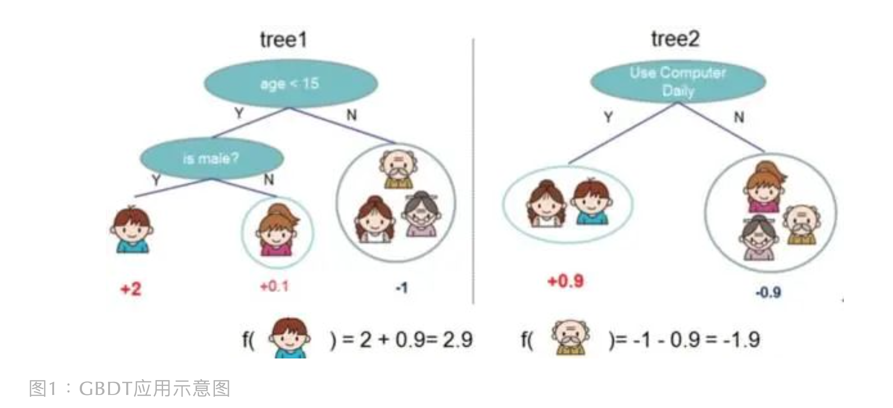
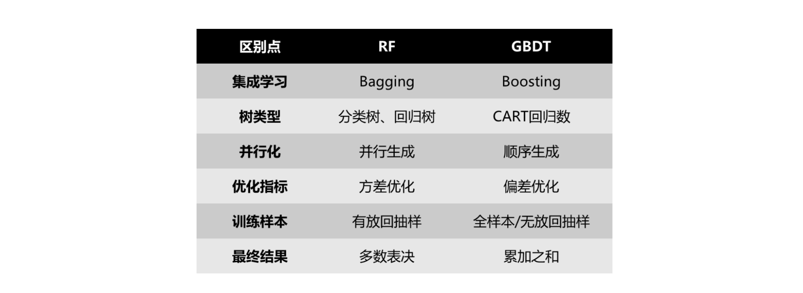
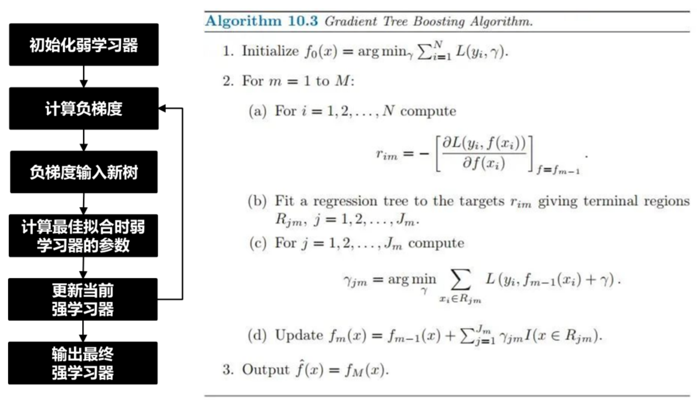

目录

- [GBDT 简介](#gbdt-简介)
  - [GBDT 特点](#gbdt-特点)
  - [GBDT vs RandomForest](#gbdt-vs-randomforest)
  - [GBDT 优缺点](#gbdt-优缺点)
- [GBM 模型原理](#gbm-模型原理)
  - [函数估计问题](#函数估计问题)
  - [加性模型](#加性模型)
  - [前向分步加性模型](#前向分步加性模型)
  - [最速下降法](#最速下降法)
  - [模型应用](#模型应用)
- [GBDT 模型原理](#gbdt-模型原理)
  - [GBDT 弱学习器](#gbdt-弱学习器)
    - [GBDT 的弱学习期限定使用 CART 决策树](#gbdt-的弱学习期限定使用-cart-决策树)
    - [CART 决策树计算基尼指数](#cart-决策树计算基尼指数)
    - [GBDT 用回归树不用分类树](#gbdt-用回归树不用分类树)
  - [GBDT 模型框架](#gbdt-模型框架)
    - [初始化一个弱学习器](#初始化一个弱学习器)
    - [迭代训练](#迭代训练)
    - [输出最终学习器 GBDT](#输出最终学习器-gbdt)
    - [负梯度和残差的关系](#负梯度和残差的关系)
- [GBDT 模型](#gbdt-模型)
  - [GBDT 回归](#gbdt-回归)
  - [GBDT 分类](#gbdt-分类)
  - [二分类](#二分类)
  - [多分类](#多分类)
- [GBDT 正则化](#gbdt-正则化)
  - [学习率和树数量的平衡](#学习率和树数量的平衡)
  - [子采样比例](#子采样比例)
  - [决策树常用正则化手段](#决策树常用正则化手段)
- [参考](#参考)

# GBDT 简介

## GBDT 特点

集成学习 Boosting 一族将多个弱学习器(或称基学习器)提升为强学习器，
像 AdaBoost、GBDT 等都属于“加性模型”(Additive Model)，即基学习器的线性组合

1997年 Freund 和 Schapire 提出的 AdaBoost 先从初始训练集训练出一个基学习器，
然后基于基学习器的在这一轮的表现，在下一轮训练中给预测错的训练样本更大权重值，
以达到逐步减少在训练集的预测错误率。这种训练机制像不像做一套卷子，有些重难点题做不出来，
那下次又给你做同样的卷子，但不同的是：之前你做错的重难点题占有很大的分值比重，
这样你会将更多重心放在了这些难题上，从而提高你的学习表现

那除了这种方式，还有没有其他方法攻克考题上的重难点？有，就是死磕到底，找到这题错在哪，
基于此错误继续去做这道题，直到做对为止。这跟 GBDT 的工作机制就很像了，
它是先产生一个弱学习器(CART 回归树模型)，训练后得到输入样本的残差，然后再产生一个弱学习器，
基于上一轮残差进行训练，不断迭代，最后加权结合所有弱学习器得到强学习器

GBDT 的一个应用示意图如下（某样本预测值 = 它在不同弱学习器所在叶子节点输出值的累加值）：

## GBDT vs RandomForest

## GBDT 优缺点

* TODO

# GBM 模型原理

随着 Breiman 对 AdaBoost 算法的突破性理解和解释的提出，
Friedman，Hastie 和 Tibshirani 将提升算法解释为在统计学框架下的拟合加性模型(Additive Model) 的函数估计问题。
并且，Friedman 将提升算法扩展为一种利用类似最速下降法优化方法，
在具体的损失函数梯度方向上逐步拟合基学习器的梯度提升器算法(Gradient Boosting Machine)，
也称为梯度提升模型算法(Gradient Boosting Modeling)。从而将提升算法扩展到许多应用上，
同时也产生了一系列具体的梯度提升算法, 例如:

* 对于回归问题，利用损失函数为平方误差损失函数 `$L(y, f) = (y-f)^{2}$` 时产生的 L2Boost 算法
* 对于分类问题，应用对数似然损失函数 `$L(y, f) = log(1+e^{-yf})$` 得到了 LogitBoost 算法
* 选择指数损失函数 `$L(y, f)=e^{-yf}$`，将会得到 AdaBoost 算法

## 函数估计问题

假设在一个函数估计问题中，存在：

* 一个随机响应变量 `$y$`
* 一组随机解释变量 `$\mathbf{x}=\{x_{1}, \ldots, x_{d} \}$`，其中 `$d$` 是解释变量的个数

给定训练数据集 `$\{(\mathbf{x}_{i}, y_{i}), i=1, 2, \ldots, N \}$`，为变量 `$(\mathbf{x}, y)$` 的观测值。
函数估计问题的目标就是利用解释变量 `$\mathbf{x}$` 和响应变量 `$y$` 观测值的联合分布，
通过最小化一个特殊的损失函数 `$L(y, f(\mathbf{x}))$` 的期望值得到一个估计或近似函数 `$f(\mathbf{x})$`，
函数 `$f(\mathbf{x})$` 的作用就是将解释变量 `$\mathbf{x}$` 映射到响应变量 `$y$`：

`$$f^{*}=\arg\underset{f}{\min}E_{y, \mathbf{x}}[L(y, f(\mathbf{x}))]$$`

其中损失函数 `$L(y, f(\mathbf{x}))$` 是为了评估响应变量 `$y$` 与其函数估计值 `$f(\mathbf{x})$` 的接近程度.
实际应用中存在很多常用的损失函数:

* 用来解决回归问题的
    - 平方误差损失函数 `$L(y, f)=(y-f)^{2}$`，其中 `$y \in \mathbf{R}$`
    - 绝对误差损失函数 `$L(y, f)=|y-f|$`，其中 `$y \in \mathbf{R}$`
* 用来解决二分类问题的
    - 负二项对数似然损失 `$L(y, f)=log(1+e^{-2yf})$`，其中 `$y \in \{-1, 1\}$`

## 加性模型

梯度提升模型(GBM) 是一种对 "加性(additive") 扩展模型的拟合方法，
在这里 "加性(additive)" 扩展模型是指由一簇 "基函数(base function)" 扩展成的函数空间中的函数组合。
而这里的 "基函数" 相当于基分类器 `$G_{m}(\mathbf{x}) \in \{-1, 1\}$`。
因此函数估计问题中关于响应变量 `$y$` 的估计函数 `$f(\mathbf{x})$` 可以表示为一种参数化的 "加性" 扩展形式：

`$$f(\mathbf{x}; \{\beta_{m},\gamma_{m}\}_{1}^{M}) = \sum_{m=1}^{M}\beta_{m}b(\mathbf{x};\gamma_{m}).$$`

其中:

* `$\{\beta_{m}, \gamma_{m}\}_{1}^{M}$` 是估计函数 `$f(\cdot)$` 的参数集合
* 函数 `$b(\mathbf{x};\gamma_{m}), m=1, 2, \ldots, M$` 通常是关于解释变量 `$\mathbf{x}$` 的简单学习器函数
    - 例如 `$b(\mathbf{x}; \gamma_{m})$` 可以是一个简单的回归树函数，
      其中参数 `$\gamma_{m}$` 是回归树中的分裂变量及分裂位置值

给定训练数据 `$\{(\mathbf{x}_{i}, y_{i}), i=1,2,\ldots, N\}$`，将上面的加性模型代入函数估计问题中有

`$$\underset{\{\beta_{m}, \gamma_{m}\}^{M}_{m=1}}{\min}E_{y,\mathbf{x}}\Big[L\Big(y_{i}, \sum_{m=1}^{M}\beta_{m}b(\mathbf{x}_{i};\gamma_{m})\Big)\Big],$$`

即

`$$\underset{\{\beta_{m}, \gamma_{m}\}_{m=1}^{M}}{\min}\sum_{i=1}^{N} L\Big(y_{i}, \sum_{m=1}^{M} \beta_{m} b(\mathbf{x}_{i}; \gamma_{m})\Big),$$`

因此，方程中的函数估计问题就变成了一个参数估计问题

## 前向分步加性模型

在梯度提升模型(GBM) 中，对于上面的估计问题作者希望利用前向分步加性模型(Forward Stagewise Additive Modeling) 算法进行求解, 
前项分步加性模型算法如下：

> 1. 初始化 `$f_{0}(\mathbf{x})=0$`
> 2. 进行迭代，`$m=1, 2, \ldots, M$`，计算
> 
> `$$(\beta_{m}, \gamma_{m})=\underset{\beta, \gamma}{\arg\min}\sum_{i=1}^{N}L\Big(y_{i}, f_{m-1}(\mathbf{x}_{i})+\beta_{m} b(\mathbf{x}_{i}; \gamma_{m})\Big).$$`
> 
> 3. 更新估计函数
> 
> `$$f_{m}(\mathbf{x})=f_{m-1}(\mathbf{x})+\beta_{m}b(\mathbf{x};\gamma_{m}).$$`

在机器学习中, 上面的方程被称为提升(boosting)，函数 `$b(\mathbf{x};\gamma)$` 被称为弱分类器(weak learner)，
或者基学习器(base learner)，并且一般是一个分类树

## 最速下降法

然而，对于具体的损失函数 `$L(y, f(\mathbf{x}))$` 和基学习器函数 `$b(\mathbf{x}; \gamma)$`，
前向分步加性模型很难得到最优解。作者在这里采用了一种类似最速下降法来解决前向分步加性模型算法中的估计问题。
因为在前向分步加性模型的方程中，如果给定估计函数 `$f_{m-1}(\mathbf{x})$`，
则 `$\beta_{m}b(\mathbf{x};\gamma_{m})$` 可以看成是最速下降算法中求解最优解 `$f_{M}^{*}(\mathbf{x})$` 的最优的贪婪迭代项。
因此，应用最速下降法，将估计函数 `$f(\mathbf{x})$` 的数值最解 `$f_{M}^{*} (\mathbf{x})$` 表示为下面的形式：

`$$f_{M}^{*}(\mathbf{x})=\sum_{m=0}^{M}h_{m}(\mathbf{x}),$$`

其中：

* `$f_{0}(\mathbf{x})=h_{0}(\mathbf{x})$` 是一个初始化的猜测值，
   `$h_{m}(\mathbf{x}), m=1, 2, \ldots, M$` 是最速下降算法中定义的连续增量函数。
   最速下降法定义上面的增量函数 `$h_{m}(\mathbf{x}), m=1, 2, \ldots, M$` 如下所示

`$$h_{m}(\mathbf{x})=-\eta _{m}g_{m}(\mathbf{x}),$$`

其中：

`$$\begin{align}
g_m (\mathbf{x}) &= \Bigg[\frac{\partial E_{y, \mathbf{x}}[L(y, f(\mathbf{x}))]}{\partial f(\mathbf{x})}\Bigg]_{f(\mathbf{x})=f_{m-1}(\mathbf{x})} \\ 
                 &= E_{y, \mathbf{x}}\Bigg[\frac{\partial L(y, f(\mathbf{x}))}{\partial f(\mathbf{x})}\Bigg]_{f(\mathbf{x})=f_{m-1}(\mathbf{x})}
\end{align}$$`

其中：

* `$g_{m} (\mathbf{x} ) \in R^{N}$` 为损失函数 `$L(y, f(\mathbf{x}))$` 在 `$f(\mathbf{x})=f_{m-1}(\mathbf{x})$` 处的梯度向量。
  并且

`$$f_{m-1}(\mathbf{x})=\sum^{m-1}_{i=0}f_{i}(\mathbf{x}),$$`

* 步长: `$\eta_{m}, m=1,2,\ldots, M$` 可以通过线性搜索算法得到

`$$\eta_{m}=\arg\underset{\eta}{\min}E_{y,\mathbf{x}}L\Big(y_{i}, f_{m-1}(\mathbf{x})-\eta g_{m}(\mathbf{x})\Big)$$`

上面的过程重复迭代, 直到满足算法设定的停止条件.
此时最速下降算法的函数更新形式为

`$$f_{m}(\mathbf{x}) = f_{m-1}(\mathbf{x})-\eta g_{m}(\mathbf{x}).$$`

可以看出, 最速下降法是一种十分贪婪的数值优化策略,
因为算法中负梯度 `$g_{m}$` 是函数空间 `$R^{N}$` 中,
损失函数 `$L(y, f)$` ~ `$f=f_{m-1}$` 处下降最快的局部方向.

如果在训练数据上最小化损失函数 `$L(y,f(\mathbf{x}))$` 是最终的目标, 那么最速下降法会是一种很好的解决方法. 
因为 `$g_{m}(\mathbf{x})$` 对于任何可导的损失函数 `$L(y, f(\mathbf{x}))$` 都是比较容易求得的.
然而, 最速下降法中计算得到的 `$g_{m}(\mathbf{x})$` 只是在训练数据上定义的,
而梯度提升算法的目的却是将最终的模型泛化到除了训练数据之外的未知数据上.
这样训练出的梯度提升算法才具有泛化能力.

因此, 梯度提升模型算法通过利用一个基本的学习器模型算法将负梯度向量进行拟合,
得到了负梯度向量值 `$-g_{m}(\mathbf{x}_{i}), i=1,2,\ldots, N$` 的近似估计向量, 
即和产生了一个在前项分步模型算法中的基学习器.
然后将这个近似估计向量应用在最速下降算法中代替负梯度向量, 从而使得提升算法拥有泛化能力.
下面是利用平方误差损失拟合负梯度向量估计值的表达式

`$$a_{m}=\arg\underset{a}{\min}\sum_{i=1}^{N}[-g_{m}(\mathbf{x}_{i})-b(\mathbf{x}_{i}; a)]^{2},$$`

当然实际应用中也可以使用其他的一些基学习器模型来进行拟合.
比较常用的有决策树模型拟合一棵树模型.
而基学习器的权重系数仍然使用最速下降算法中的线性搜索算法得到

`$$\eta_{m}=\arg\underset{\eta}{\min}\sum_{i=1}^{N}L(y_{i}, f_{m-1}(\mathbf{x}_{i})+\eta b(\mathbf{x}_{i}; a_{m}))$$`

然后, 将估计近似函数进行更新

`$$f_{m}(\mathbf{x})=f_{m-1}(\mathbf{x})+\eta_{m}b(\mathbf{x}, a_{m})$$`

一般的梯度提升算法的伪代码如下:

> 1. 令 `$m=0$`，初始化 `$\hat{f}_{0}(\cdot)$` 为一个常数值. 通常的选择为:
>    `$$\hat{f}_{0}(\cdot) \equiv \arg \underset{c}{\min}\frac{1}{N}\sum_{i=1}^{n}L(y_{i}, c)$$`
>    或者为 
>    `$$\hat{f}_{0} \equiv 0$$`
> 2. 增加 `$m=1$`. 计算负梯度 `$-\frac{\partial L}{\partial f}$`，并且计算负梯度在 `$\hat{f}_{m-1}(\mathbf{x}_{i})$` 处的值:
>    `$$U_{i}=-\frac{\partial}{\partial f}L(y_{i}, f)\Bigg|_{f=\hat{f}_{m-1}(\mathbf{x}_{i})}, i=1, \ldots, N;$$`
> 3. 将负梯度向量 `$(U_{1}, \ldots, U_{N})$` 通过一个基本的学习模型(例如: 回归)拟合到预测变量的观测值向量 `$\mathbf{x}_{1}, \ldots, \mathbf{x}_{N}$`:
>    `$$(\mathbf{x}_{i}, U_{i})^{N}_{i=1} \rightarrow \hat{b}_{m}(\cdot)$$`
> 4. 更新估计函数:
>    `$$\hat{f}_{m}(\cdot)=\hat{f}_{m-1}(\cdot)+\eta_{m} \cdot \hat{b}_{m}(\cdot)$$`
> 其中 `$0 \leqslant \eta_{m} \leqslant 1$` 是一个步长因子;
> 5. 重复第二步到第四步直到 `$m=M$`;
> 6. 输出训练得到的学习器 `$f_{M}(\cdot)$`

## 模型应用

在上一节, 我们已经给出了梯度提升模型算法的详细推导及其一般性算法伪代码. 可以看出, 在梯度提升算法中, 
算法在第2 步中对一个具体的损失函数 `$L(y, f(\mathbf{x}))$` 求负梯度向量 `$U_{i}, i=1,2,\ldots, N$`,
而在第 3 步则利用一个具体的基学习器模型算法, 
对数据预测变量观测值和负梯度向量 `$U_{i}, i=1,2,\ldots, N$` 进行拟合产生负梯度向量 `$U_{i}, i=1,2,\ldots, N$` 的近似估计. 
因此, 在梯度提升模型算法中, 应用不同的损失函数 `$L(y,f(\mathbf{x}))$` 和不同的基学习器模型算法可以得到不同的提升算法模型.

对于损失函数的选择, 只要损失函数 `$L(\cdot, \cdot)$` 满足对于它的第二个参数变量是光滑且凸的, 
就可以应用到梯度提升算法的第 2 步中. 这一小节, 具体讨论梯度提升算法的一些特殊应用算法.

* GBDT
    - 损失函数：
    - 基学习器：CART 决策树
* L2Boost
    - 用在 `$L_{2}$`Boost 算法中的平方误差损失函数 

    `$$L(y, f) = (y - f)^{2}/2$$`

    - 基学习器：CART 决策树
* LogitBoost
    - 用在 LogitBoost 算法中的对数似然损失函数   

    `$$L(y, f) = log_{2}(1+exp(-2yf))$$`

    - 基学习器:
* QBC
    - 用在分位数提升分类(QBC) 算法中基于分位数回归模型产生的损失函数 

    `$$L(y, f) = [y-(1-\tau)]K(f/h)$$`

    - 其中：`$K(\cdot)$` 是一个标准正态分布的累积分布函数，`$h$` 是一个给定的大于零的常数
    - 基学习器：

# GBDT 模型原理

## GBDT 弱学习器

决策树是 IF-THEN 结构，它学习的关键在于如何选择最优划分属性。
西瓜书提到：“随着划分过程不断进行，我们希望决策树的分支结点所包含的样本尽可能属于同一类别，
即结点的“纯度”(Purity)越来越高”。衡量纯度的指标有多种，因此对应有不同类型的决策树算法，
例如：

* ID3 决策树
    - 以信息增益 Information Gain 作为属性划分标准
* C4.5 决策树
    - 以增益率 Gain Ratio 选择最优划分属性
* CART 决策树
    * 使用基尼指数 Gini Index 来选择划分属性

### GBDT 的弱学习期限定使用 CART 决策树

原因如下所示（ 具体细节不展开)：

* ID3 决策树只支持类别变量，而 C4.5 和 CART 支持连续型和类别型变量
* C4.5 适用于小样本，CART 适用于大样本

### CART 决策树计算基尼指数

假设当前数据集 `$D$` 中第 `$k$` 类样本所占比例为 `$p_{k}，k=1, 2, \ldots, |y|$`，则基尼指数为：

`$$Gini(D) = 1 - \sum_{k=1}^{|y|}p_{k}^{2}$$`

`$Gini(D)$` 反映了从数据集 `$D$` 随机抽取两个样本其类别标记不一致的程度，`$Gini(D)$` 越小，
数据集 `$D$` 的纯度越高。基于此，属性 `$a$` 的基尼指数定位为：

`$$Gini\_index(D, a) = \sum_{v=1}^{V}\frac{|D^{v}|}{|D|}Gini(D^{v})$$`

假设属性 `$a$` 有 `$V$` 个可能的取值 `$\{a^{1}, a^{2}, \ldots, a^{V}\}$`，
则 `$D^{v}$` 是指第 `$v$` 个分支结点包含 `$D$` 中所有在属性 `$a$` 上取值为 `$a^{v}$` 的样本。
`$\frac{|D|}{|D^{V}|}$` 是给分支结点赋予权重，获得样本数更多的结点，影响更大

举个具体计算基尼指数的例子，假如按照“芯片为高通骁龙 865 和非高通骁龙 865 进行机型档位划分”：

数据：

| 手机 | 芯片 |  机型档位 |
|----|----|----|
| 手机 A | 高通骁龙 865| 旗舰机 |
| 手机 B | 高通骁龙 765| 中端机 |
| 手机 C | 高通骁龙 865| 旗舰机 |
| 手机 D | 高通骁龙 865| 中端机 |
| 手机 E | 天玑 700| 低端机 |

* 当芯片为高通骁龙 865 时，有旗舰机 2 个，中端机 1 个：

`$$Gini = 1-[(\frac{2}{3})^{2} + (\frac{1}{3})^{2}] = \frac{4}{9}$$`

* 当芯片非高通骁龙 865 时，有中端机 1 个，低端机 1 个：

`$$Gini = 1-[(\frac{2}{3})^{2} + (\frac{1}{3})^{2}] = \frac{4}{9}$$`

* 最后，特征”芯片”下数据集的基尼指数是：

`$$Gini = 1-[(\frac{2}{3})^{2} + (\frac{1}{3})^{2}] = \frac{4}{9}$$`

### GBDT 用回归树不用分类树

因为 GBDT 要计算残差，且预测结果是通过累加所有树结果得到的。
因此分类树没法产生连续型结果满足 GBDT 的需求

## GBDT 模型框架

GBDT 的伪代码如上图所示，假设有个样本集 `$\{x_{i}, y_{i}\}_{1}^{N}$`，
想用 `$M$` 个弱学习器加性组合成 GBDT 强学习器，得按以下步骤进行实现：

### 初始化一个弱学习器

初始化一个弱学习器 `$f_{0}(x)$`。它使损失函数 `$L(y_{i}, \gamma)$`最小化，具体如下：

`$$f_{0}(x) = \underset{\gamma}{argmin}\sum_{i=1}^{N}L(y_{i}, \gamma)$$`

这里 `$\gamma$` 是什么呢？请接着看下去，假设这里损失函数为平方损失，则对 `$\gamma$` 求导：

`$$\sum_{i=1}^{N}\frac{\partial(y_{i}, \gamma)}{\partial \gamma} = \sum_{i=1}^{N}\frac{\partial(\frac{1}{2}(y_{i} - \gamma)^{2})}{\partial}=\sum_{i=1}^{N}(\gamma - y_{i})$$`

由于这里的损失函数为凸函数，所以只要令上面这个导数为 0 即可，那么可以求得：

`$$\gamma = \frac{1}{N}\sum_{i=1}^{N}y_{i}$$`

因此，`$\gamma$` 是所有训练样本标签值的均值，它是一个常数，所以弱学习器 `$f_{0}(x)$` 就只有一个根节点

`$$f_{0}(x)=\gamma$$`

注意：`$\gamma$` 因损失函数不同而不同

### 迭代训练

迭代训练 `$m = 1, 2, \ldots, M$` 棵树：

1. 对每个样本 `$i = 1, 2, \ldots, N$`，计算负梯度：

`$$\gamma_{im}=-\Bigg[\frac{\partial L(y_{i}, f(x_{i}))}{\partial f(x_{i})}\Bigg]_{f=f_{m-1}}$$`

2. 将上步得到的负梯度 `$\gamma_{im}$` 作为新样本值，
   将新数据 `$(x_{i}, \gamma_{im}), i = 1, 2, \ldots, N$` 作为下颗树的训练数据，
   拟合得到新树，新树上的叶子节点区域为 `$R_{jm}, j = 1, 2, \ldots, J_{m}$`，
   其中 `$J_{m}$`为叶子结点的个数
3. 对每个叶子节点 `$j = 1, 2, \ldots, J_{m}$`，计算最佳拟合（即使损失函数最小，拟合叶子节点最好的输出值）：

`$$\gamma_{jm} = \underset{\gamma}{argmin}\underset{x_{i} \in R_{jm}}{\sum}L(y_{i}, f_{m-1}(x_{i} + \gamma))$$`

4. 更新强学习器：

`$$f_{m}(x) = f_{m-1}(x)+\sum_{j=1}^{J}\gamma_{jm}I(x \in R_{jm})$$`

`$\sum_{j=1}^{J}\gamma_{jm}I(x \in R_{jm})$` 是 CART 回归树模型的表达式，
其中 `$J$` 是指数据集被划分为 `$J$` 个单元（即叶子节点），
`$\gamma_{jm}$` 是第 `$m$` 轮迭代训练下，CART 树第 `$j$` 个单元的输出值。
而 `$I(x \in R_{jm})$` 是指示函数，若 `$x \in R_{jm}$`，则 `$I=1$`，否则 `$I=0$`。
这里第 `$m$` 轮下的强学习器等于第 `$m-1$` 轮下的强学习器加上第 `$m$` 轮的弱学习器

### 输出最终学习器 GBDT

输出最终学习器 GBDT：

`$$\hat{f}(x)=f_{M}(x)=f_{0}(x)+\sum_{m=1}^{M}\sum_{j=1}^{J}\gamma_{jm}I(x \in R_{jm})$$`

上述公式展示的就是一系列弱学习器累加后得到强学习器的结果

### 负梯度和残差的关系

负梯度是函数下降最快的方向，也是 GBDT 目标函数下降最快的方向，
所以，用负梯度去拟合模型。而残差只是一个负梯度的特例，当损失函数为均方损失时，
负梯度刚好是残差（这点在上面 "对 `$\gamma$` 求导" 处有做假设展示）

# GBDT 模型

## GBDT 回归

上面 ”GBDT 通用框架” 就是以平方损失为损失函数的一种 GBDT 回归模型学习过程，
不同损失函数导致使用的负梯度不同，因此也就产生了不同的 GBDT 回归算法，
总结了下 GBDT 回归模型所用的损失和负梯度如下：

这里特别说下 Huber 损失，它对于中间附近的点(`$|y-f(x)|\leq\delta$`)采用均方误差，
对远离中心的异常点(`$|y-f(x)|>\delta$`)，采用绝对损失。
边界点 `$\delta$` 的值受绝对损失函数而不是平方误差损失控制，
定义了这些被认为是“离群点”的残差值。总的来说，Huber 结合了均方差和绝对损失，
在抵抗长尾误差分布和异常值的同时，还保持了对正态分布误差的高效率。
它和分位数损失一样，适用于稳健回归，用于减少异常点对损失函数的影响

## GBDT 分类

由于分类有二分类和多分类任务，所以 GBDT 分类有所区别，这里分开对它们进行展开解释

## 二分类

上面讲到过，GBDT 本质上就是一系列弱学习期之和：

`$$f_{M}(x) = \sum_{m=1}^{M}T_{m}(x)$$`

而 GBDT 分类跟逻辑回归的思路是类似的，将 `$f_{M}(x)$` 的作为下列函数的输入，
便可以得到类别概率值：

`$$P = \hat{y} = \frac{1}{1+e^{-f_{M}(x)}}$$`

假设样本独立且同分布，极大似然估计(即选取合适的参数使被选取的样本在总体中出现的可能性最大)的损失函数为：

`$$L = \prod_{i=1}^{N}P_{i}^{y_{i}}\times (1-P_{i})^{1-y_{i}}$$`

为了方便对损失函数求导，会加入对数，求最大对数似然估计：

`$$L=ln L = \sum_{i=1}^{N}\Big(y_{i} \times ln P_{i} + (1-y_{i}) \times ln(1-P_{i})\Big)$$`

上面的损失函数并非最终的函数，而是最大似然估计函数（数值越大越好），由于损失函数应该使越小越好，
所以要对上面的 `$L$` 取相反数，同时为了得到平均到每个样本的损失值，要除以样本数 `$N$`，
这样得到了最终的损失函数：

`$$\begin{cases}L &=-\frac{1}{N}\sum_{i=1}^{N} (y_{i} \times lnP_{i} + (1-y_{i}) \times ln(1 - P_{i})) \\
&=-\frac{1}{N}\sum_{i=1}^{N} (y_{i} \times ln\frac{1}{1+e^{-f_{M}(x_{i})}} + (1-y_{i}) \times ln(1 - \frac{1}{1+e^{-f_{M}(x_{i})}}))\end{cases}$$`

对损失函数计算负梯度：

`$$\begin{cases}-\frac{\partial L}{\partial f_{M}} 
&=-\Bigg(\frac{1}{1+e^{-f_{M}(x_{i})}}- y_{i}\Bigg)\\ 
&= y_{i}-\hat{y}_{t}\end{cases}$$`

由此看来，GBDT 负梯度即为残差，表示真实概率和预测概率的差值。接下来计算过程跟着 GBDT 通用框架进行就好了

## 多分类

GBDT 多分类原理跟 Softmax 一样的，假设我们有 `$k$` 个类别，
将 `$f_{M}(x)$` 作为以下函数的输入，便可以类别 `$q$` 对应的概率值：

`$$P(y=1|x)=\hat{y}_{q}=\frac{e_{q}^{f_{M}(x)}}{\sum_{i=1}^{k}e_{i}^{f_{M}(x_{i})}}$$`

其损失函数为：

`$$L=-\sum_{i=0}^{N}y_{i}\times ln(P(y_{i}|x)) = \sum_{i=0}^{N}y_{i} \times ln(\frac{e_{q}^{f_{M}(x_{i})}}{\sum_{i=1}^{k}e_{i}^{f_{M}(x_{i})}})$$`

多类别任务下，只有一个类别是 1，其余为 0，假设这不为 0 的一类为 `$q$`，
我们对它 Softmax 的损失函数求负梯度得：

`$$-\frac{\partial L}{\partial f_{M,q}}=y_{q} - \frac{e_{q}^{f_{M}(x)}}{\sum_{i=1}^{k}e_{i}^{f_{M}(x)}} = y_{q} - \hat{y}_{q}$$`

跟二分类一样，本质上负梯度就是真实概率和预测概率的插值

# GBDT 正则化

GBDT 采用了三种正则化手段

## 学习率和树数量的平衡

我们前面得到，第 `$m$` 轮下的强学习器等于第 `$m-1$` 轮下的强学习器加上第 `$m$` 轮的弱学习器，如下：

`$$f_{m}(x)=f_{m-1}(x) + T_{m}(x)$$`

GBDT 原论文提到，树数量越多，越容易过拟合，所以限制树数量可以避免过拟合，但历史研究又给出：
通过收缩 (即学习率 `$\gamma$` 减少) 实现的正则化比通过限制项 (即树数量 `$M$` 减少) 实现的正则化效果更好。
这是什么意思呢？请先看下面的公式：

`$$f_{m}(x) = f_{m-1}(x) + \gamma T_{m}(x)$$`

该公式加入了学习率 `$\gamma$`，这里跟神经网络的学习率相反，如果我们学习率下降，
每个树的贡献就会减低，反而还实现了正则化，但如果我们放开训练(即不固定树数量)，
只减低学习率的话，GBDT 还是会过拟合，因为产生了更多的树。因此，GBDT 作者建议，
我们要实现 `$v-M$` 之间的权衡，理想的应该是在正则效果合适下，学习率降低的同时，
也能尽可能保证树数量少些。这里当然也有出于对计算资源的考虑，增加 `$M$` 会带来计算开销

## 子采样比例

子采样是将原数据集中抽样一定的样本去拟合 GBDT。与随机森林不同的是，GBDT 采样不放回抽样，
因为 GBDT 串行训练要求所有弱学习器使用同一套样本集，不然在不同抽样样本空间计算的残差，缺乏一致性

## 决策树常用正则化手段

这块的参数都涉及到弱学习器树本身的正则化，例如：决策树最大深度、划分所需最少样本数、
叶子节点最少样本数、叶子节点最小样本权重、最大叶子节点数、节点划分最小不纯度等

# 参考

* [Friedman, J. H. (2001). Greedy function approximation: a gradient boosting machine. Annals of statistics, 1189-1232.]()
* [《机器学习》- 周志华著]()
* [《The Elements of Statistical Learning》- Trevor Hastie, Robert Tibshirani, and Jerome Friedman著]()
* [《GBDT的原理、公式推导和应用》 - 刘启林的机器学习笔记]()
* [《梯度提升树(GBDT)原理小结》- 刘建平Pinard]()
* [sklearn.ensemble.GradientBoostingRegressor]()
* [优雅的 GBDT](https://mp.weixin.qq.com/s?__biz=Mzk0NDE5Nzg1Ng==&mid=2247493908&idx=2&sn=3d8ece0c272084f97bae5384752b8c6e&chksm=c32af09bf45d798d9238e37c556f6bbe3958a1d54978e31786b4c19b5794db6efe6cd0a56e2e&scene=21#wechat_redirect)
* [务实基础-梯度提升树 GBDT](https://mp.weixin.qq.com/s?__biz=MzUyNzA1OTcxNg==&mid=2247485098&idx=1&sn=17be0f5a09eb44dab1839c5df1e79a72&chksm=fa0418c1cd7391d75d8fcc5e7fe63c58c18f3fe5d0144b81e8151401720b145df1d6962b0d36&cur_album_id=1577157748566310916&scene=189#wechat_redirect)

