

目录

- [LightGBM 简介](#lightgbm-简介)
  - [LightGBM 特点](#lightgbm-特点)
  - [LightGBM vs XGBoost](#lightgbm-vs-xgboost)
- [LightGBM 优化策略](#lightgbm-优化策略)
- [Histogram 算法](#histogram-算法)
  - [寻找最佳分裂点](#寻找最佳分裂点)
    - [XGBoost 预排序算法](#xgboost-预排序算法)
    - [LightGBM 直方图算法](#lightgbm-直方图算法)
  - [直方图差加速](#直方图差加速)
  - [直方图算法缺点](#直方图算法缺点)
- [GOSS 算法](#goss-算法)
- [EFB 算法](#efb-算法)
  - [捆哪些特征](#捆哪些特征)
  - [怎么捆在一起](#怎么捆在一起)
- [Leaf-wise 树生长策略](#leaf-wise-树生长策略)
- [支持类别特征](#支持类别特征)
- [LightGBM 工程优化](#lightgbm-工程优化)
  - [高效并行](#高效并行)
    - [特征并行](#特征并行)
    - [数据并行](#数据并行)
    - [投票并行](#投票并行)
  - [增加 Cache 命中率](#增加-cache-命中率)
- [参考](#参考)

# LightGBM 简介

## LightGBM 特点

> LightGBM is a gradient boosting framework that uses tree based learning algorithms. 
> It is designed to be distributed and efficient with the following advantages:
> 
> * Faster training speed and higher efficiency.
> * Lower memory usage.
> * Better accuracy.
> * Support of parallel and GPU learning.
> * Capable of handling large-scale data.

## LightGBM vs XGBoost

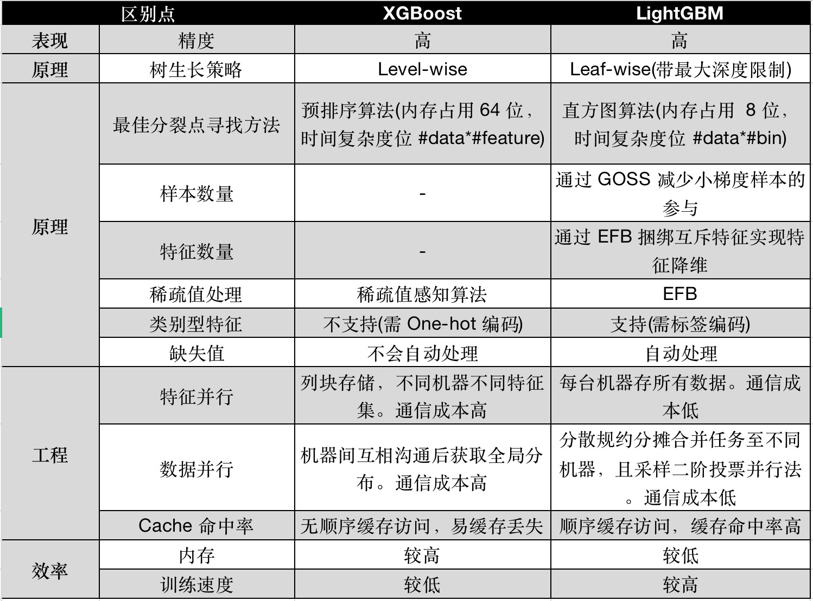

# LightGBM 优化策略

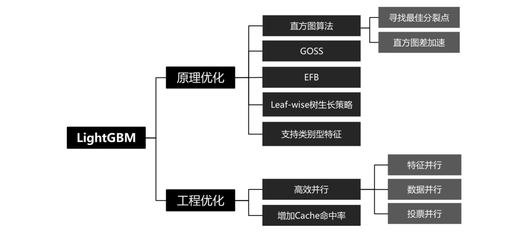

LightGBM 在 XGBoost 上主要有几方面的优化：

> 由于 XGBoost 采用的基模型是二叉树，因此生产每片叶子需要分裂一次。
> 而每次分裂，都要遍历素有特征上所有候选分裂点位，
> 计算按照这些候选分裂点分裂后的全部样本的目标函数增益，
> 找到最大的那个增益赌赢的特征和候选分裂点位，从而生产一片新叶子
> 
> XGBoost 模型训练的总体的复杂度可以粗略估计为:
> 
> `$$训练复杂度 = 树的棵树 \times 每棵树上叶子的数量 \times 生成每片叶子的复杂度$$`
> 
> 生成一片叶子的复杂度可以粗略估计为:
> 
> `$$生成一片叶子的复杂度 = 特征数量 \times 候选分裂点数量 \times 样本的数量$$`
> 
> 通过引入 Histogram、GOSS、EFB 这三个算法，LightGBM 生成的一片叶子需要的复杂度大大降低，
> 从而极大节约了时间。LightGBM 和 XGBoost 的关系可以用一个简单公式来说明：
> 
> `$$LightGBM = XGBoost + Histogram + GOSS + EFB$$`

1. Histogram 算法: 直方图算法
    - 主要作用就是减少候选分裂点数量，另外还将特征由浮点数转换为 0~255 位的整数进行存储，从而极大节了内存存储
    - 寻找最佳分裂点
    - 直方图差加速
1. GOSS 算法：基于梯度的单边采样算法，作用是减少样本的数量
2. EFB 算法：互斥特征捆绑算法，作用是减少特征的数量
3. Leaf-wise 树生长策略优化
4. 支持类别型特征

# Histogram 算法

## 寻找最佳分裂点

在 GBDT 中，找到树最佳分裂点有两种方法：

* 预排序算法 (Pre-sorted Algorithm)
* 直方图算法 (Histogram-based Algorithm)

直方图算法是替代 XGBoost 的预排序算法的

### XGBoost 预排序算法

预排序算法的基本思路是：

1. 首先，将样本按照特征取值排序
2. 然后遍历所有可能分裂点计算分裂增益，最后取分裂增益最大的点，作为最优分裂点

这种方法就是 XGBoost 论文中提到的贪心算法，该算法的候选分裂点数量与样本数量成正比

XGBoost 也提出了一种近似算法，是使用特征值的分位数作为候选分裂点，可本质上也是一种预排序算法。
该类方法在训练速度和内存消耗上表现较差，因为需要保存排序后特征值的位置索引

### LightGBM 直方图算法

直方图算法的基本思路是：

1. 首先通过将连续特征值离散化到固定数量(如 255 个)的 bin 上，使得候选点位为常数个 `$(\#bin - 1)$`
2. 然后用这些箱子构建特征直方图
3. 之后模型基于特征直方图寻找最佳分裂点

构建直方图的时间复杂度是 `$O(\#sample \times \#feature)$`，
但寻找最佳分裂点的时间复杂度为 `$O(\#bin \times \#feature)$`。
模型训练速度会因此而提高，而且因为不需要存储排序索引，内存压力也变小了

LightGBM 采用的就是直方图算法 (现在 XGBoost 开源代码也支持直方图算法)，伪代码如下图所示：

## 直方图差加速

Histogram 算法还能够作直方图差加速。当节点分裂成两个时，
右边叶子节点的直方图等于其父节点的直方图减去左边叶子节点的直方图，
从而大大减少构建直方图的计算量

这块知识点并没有在原论文上提及，但在 MSRA 发布的文章(见参考)有进行补充。
直方图做差是指：

> 一个叶子的直方图可以由它的父亲节点的直方图与它兄弟的直方图做差得到。
> 通常构造直方图，需要遍历该叶子上的所有数据，但直方图做差仅需遍历直方图的 k 个桶。
> 利用这个方法，LightGBM 可以在构造一个叶子的直方图后，
> 可以用非常微小的代价得到它兄弟叶子的直方图，在速度上可以提升一倍

示意图如下所示：

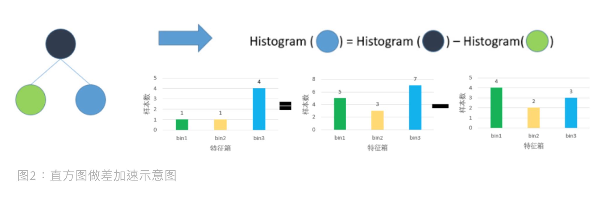

下面，总结了下直方图算法的优点

* 内存消耗减少
    - 预排序算法处理完特征后占用内存 = 排序位置索引(32位整型)+ 特征值(32位浮点型)= 64 位
    - 直方图占用内存 = 特征箱 bins(8位整型)= 8 位
* 计算开销减少
    - 预排序算法时间复杂度：`$O(\#sample \times \#feature)$`
    - 直方图算法时间复杂度：`$O(\#bin \times \#feature)$`

## 直方图算法缺点

但直方图算法也有缺点。GBDT 在使用预排序算法，会忽略零值特征，从而减少训练开销。
但使用直方图算法的 GBDT 没有优化稀疏值问题，
原因是更新特征箱值(Feature Bin Values)需要遍历所有数(包括零值)。
不过其实有办法使直方图克服稀疏值数据带来的训练开销。
这办法就是作者接下来提出的两个重要技巧：GOSS 和 EFB

# GOSS 算法

> GOSS 算法，Gradient-based One-Side Sampling，基于梯度的单边采样算法

在 AdaBoost 中，样本权重指示了数据样本的重要性，而在 GBDT 上并没有样本权重这一说，
可作者发现：在 GBDT 中，梯度对于每个样本是个很有用的信息，它可以用来帮助采样。
为什么这么说呢？让我们打个比方，如果某样本得到的一个小的梯度值，那么说明该样本的训练误差也小，
模型在该样本上表现得就很好，那这些小梯度的样本其实是不是不用参与训练了？
就好像准备考试时刷题不刷简单题，这样可以吗？不可以！因为如果真的直接剔除它们，
数据分布会改变，从而损害模型的准确率

为了处理这个问题，作者提出了 GOSS，它保留所有大梯度的样本，然后对小梯度样本采用随机采样，
这样就能缓解数据分布缺陷的同时也减少了训练量。就是说，难题我都要刷，简单题我随机抽着刷即可

GOSS 的运行机制如下：

1. 基于样本的梯度绝对值进行降序排序对应的样本
2. 对 Top `$a \times 100\%$` 个大梯度样本保留下来，得到样本子集 A
3. 对剩下 `$(1-a) \times 100\%$` 的小梯度样本们，随机采样出 `$b\times 100\%$` 个样本
4. 在计算信息增益时，对抽样的小梯度样本数据乘 `$\frac{1-a}{b}$`（这是为了关注训练不足的数据而不去过多改变原始数据分布）

GOSS 算法伪代码如下所示：

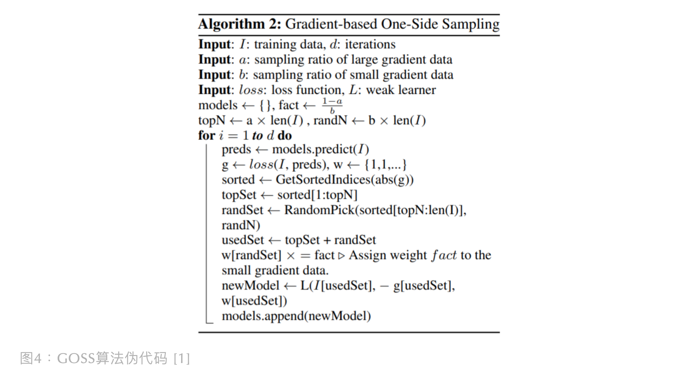

# EFB 算法

> EFB(Exclusive Feature Bunding)，互斥特征绑定算法

EFB 算法可以有效减少用于构建直方图的特征数量，从而降低计算复杂度，尤其是特征中包含大量稀疏特征的时候

在许多应用场景下，数据集中会有大量的稀疏特征，这些稀疏特征大部分样本都取值为 0，只有少数样本取值非 0。
通常可以认为这些稀疏特征是互斥的，即它们几乎不会同时取非零值。利用这种特性，可以通过对某些特征的取值重新编码，
将多个这样互斥的特征捆绑称为一个新的特征。有趣的是，对于类别特征，如果转换成 One-hot 编码，
则这些 One-hot 编码后的多个特征相互之间是互斥的，从而可以被捆绑成为一个特征

对于指定为类别特征的特征，LightGBM 可以直接将每个类别取值和一个 bin 关联，
从而自动地处理它们，而无需预处理成 One-hot 编码

我们都知道，高维数据经常是稀疏的。在一个稀疏特征空间中，许多特征是相互排斥的（即它们同时出现非零值），
这些特征是富含信息的，所以我们可以安心地将互斥特征捆绑到进一个特征。LightGBM 的作者针对特征空间的稀疏性，
设计了这种接近无损的方法去降低特征维度，被称作互斥特征捆绑(Exclusive Feature Bundling, EFB)。
通过 EFB，我们将直方图构建的复杂度从 `$O(\#sample \times \#feature)$` 降低到 `$O(\#sample \times \#bundle)$`。
由于捆绑后的特征数 `$\#bundle$` 远小于原始特征数 `$\#feature$`，GBDT 训练速度被加快了，而且还不会伤害到模型准确性。

但 EFB 需要解决两个问题：

1. 捆哪些特征？
2. 怎么捆在一起？

## 捆哪些特征

其实在上面我们说过了，我们想要捆互斥特征，而找到可捆在一起的互斥特征集可以把它类比成图着色问题(Graph Coloring Problem)去做。
给定一个无向图 `$G = (V, E)$`，其中V为顶点集合，E 为边集合，图着色问题即为将 V 分为 K 个颜色组，
每个组形成一个独立集，即其中没有相邻的顶点。其优化版本是希望获得最小的 K 值。回到 EFB，
EFB 便是把特征比作顶点 V，用边连接不同 V，边的权重为冲突值（是两个特征上不同时为 0 的样本数，
即冲突值越高，特征互斥性越高），然后我们通过图着色问题的解决方法将冲突值高的特征绑在一起 (即特征包内顶点V都是相同颜色)

图着色问题是个 NP-hard 的问题，即不可能在多项式时间内获取到精确解决方案，
只能采取近似算法。具体的步骤如下：

1. 构建一个加权无向图，权重是特征之间的冲突值；
2. 基于图中特征顶点的度，对特征进行降序；
3. 最后，顺序遍历每个特征，如果该特征被放置在某个已存在的 bundle 里且放置后新 bundle 冲突值小于(最大冲突阈值，它相对小时，能平衡好准确率和效率)，
   则可计入该特征至此 bundle，否则，创建个新 bundle 放入特征

上述算法步骤带来的时间复杂度是 `$O(\#feature^{2})$`，特征维度不大情况下，可以接受该时间复杂度，
但如果有百万级特征数就不行了。对此，作者提出一种更有效的排序策略而不用构建图：
因为非零值往往有更高冲突的可能，所以对非零值个数排序，替换了算法里度排序的部分。
EFB 算法特征捆绑的伪代码如下图所示：

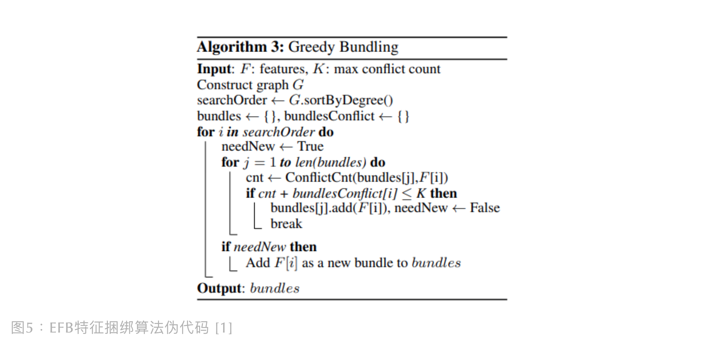

## 怎么捆在一起

上面我们找到了哪些特征适合捆捆在一起，但怎么捆呢？因为不同特征下的值有不同的量纲，
比如：特征A的值范围为 `$[0, 10)$`，特征 B 的值范围为 `$[0, 20)$`，
将特征 A 和特征 B 的直方图加起来捆绑一起后，bundle 的值范围变为 `$[0, 20)$`，
但是我们无法从中辨别哪些是特征 A，哪些是特征 B。这样对模型是不利的，
因为模型这样就没法根据 bundle 直方图的值范围去很好区分特征，对树生成会带来误差。
对于该问题的解决办法就是加偏移量，如果我们对特征B加偏移量 10，特征 B 的值范围变为 `$[10, 30)$`，
合并后的 bundle 值范围变为 `$[0, 30)$`。为了更好的理解这一过程，我画了如下示意图：

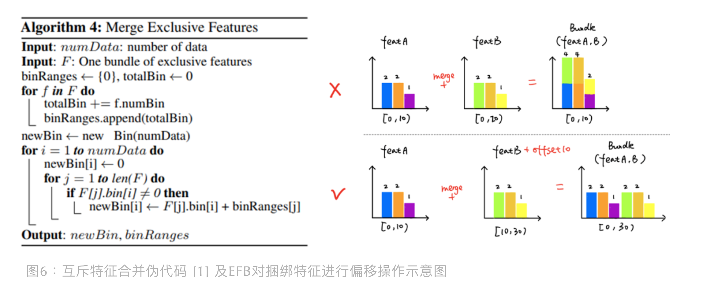

总结来说，EFB是通过特征捆绑使许多互斥特征变为更少的稠密特征，从而避免稀疏特征值带来的不必要开销

# Leaf-wise 树生长策略

不同于 XGBoost 使用 Level-wise 的树生长策略，LightGBM 使用的是 Leaf-wise 的生长策略

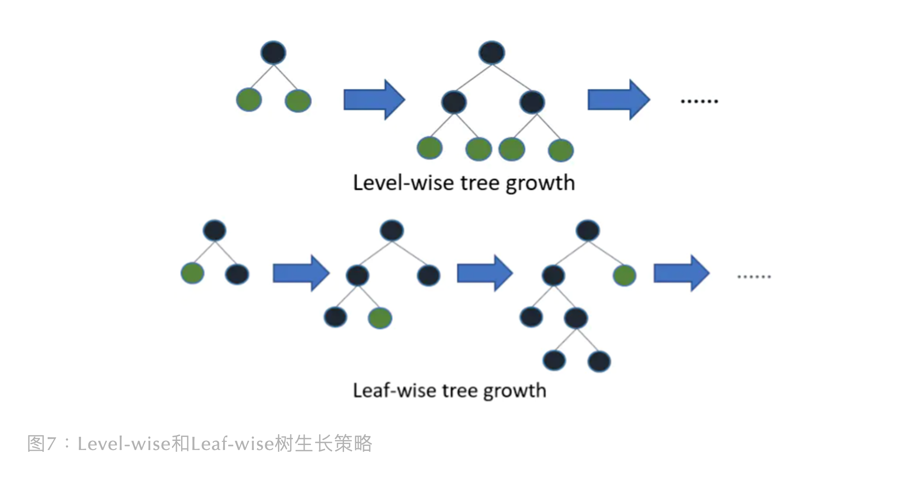

Level-wise 树会产生很多分裂增益低的叶子节点，虽然这使模型不易过拟合，但是增加了不必要的搜索和分裂

而 Leaf-wise 生长策略是从分裂增益大的叶子节点不断向下生长，
这样减少系统开销的同时，还提高了模型精度。当然，这容易使模型过拟合，
不过 LightGBM 的 GOSS 和 EFB 都能防止过拟合。同时，也能设置下树最大生长深度，避免过度拟合。

总而言之，LightGBM 使用 Leaf-wise 生长策略是为了节省了系统开销，且保证模型精度不被损失太多，是个不错的做法

# 支持类别特征

XGBoost 还有一个缺点就是处理不好类别型数据，虽然采用 One-hot 编码是个解决方案，但会带来额外开销。
并且 One-hot 稀疏特征的分裂下的子树泛化性差

但 LightGBM 不一样，它能直接支持类别型特征，直接输入类别型特征，不需要独热编码了。
它对类别型特征的支持，加快了 8 倍速度，并且保证了精度。LightGBM 采用了 many-vs-many 的分裂方式，
示意图如下所示：

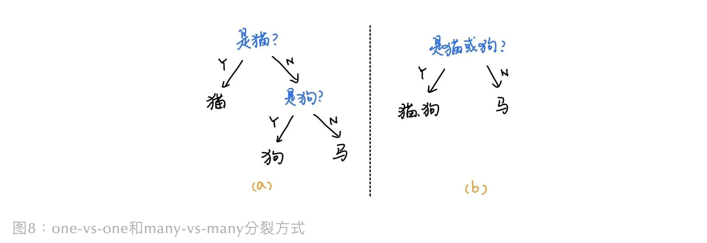

上图(a)是 one-vs-one 分裂方式，是基于独热编码输入进行分裂的。
但图(b)是 many-vs-many 分裂方式，可以基于标签编码(Label Encoding)的数据直接进行分裂，
且该方法留给模型的学习空间更大，不易过拟合。另外，LightGBM 在类别型特征直方图也有做一些调整，
即每个 bin 是一个类别，然后计算每个类别特征的 `数量` 和 `求和值` 去求均值，
之后基于每个类别的均值做排序，最后按照排序后的类别特征直方图依次寻找最优分裂点。示意图如下：

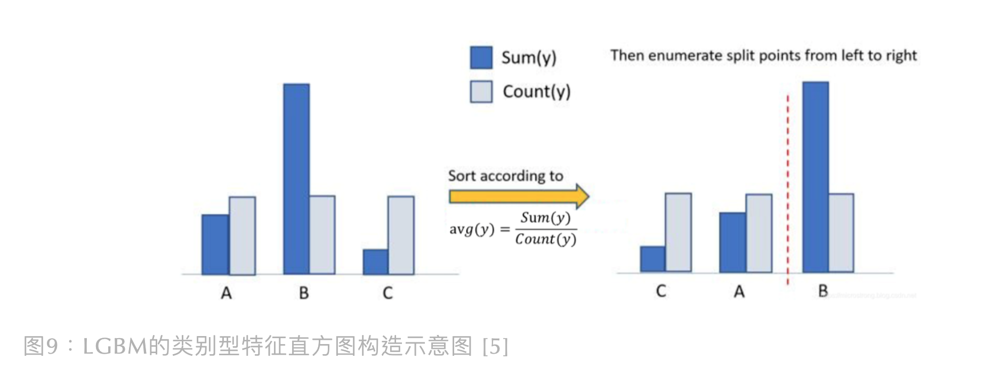

注意：此方法基于类别均值做排序，会容易过拟合，所以 LightGBM 内部对该方法还增加了约束和正则化，
这里不做展开细讲

# LightGBM 工程优化

## 高效并行

LGBM 为了加速训练，有采取 GPU 运算或一些并行训练方法。
LGBM 原班人马对 LGBM 使用的并行训练思路也发表了一篇论文《A Communication-efficient Parallel Algorithm for Decision Tree》，
有兴趣深究的可以阅读该论文。简单来说，LGBM 支持三种并行方式：特征并行、数据并行和投票并行

### 特征并行

之前的文章有说过，XGBoost 通过块存储，实现特征并行，这样就能在不同特征集合上分别找最优分割点，
然后在机器间同步最优分割点。这种垂直分区虽然是很有效，但找到最佳分裂点后，需要将划分结果通信给其它机器，
以进行下一步数据重分区 (the re-pratition of the data)，这个过程会带来非常高的通信损失（跟数据量成正比）。
所以分区过程不是并行的，这拖慢了算法。但LGBM采取的特征并行方式不一样，它是在每台机器上保存所有训练数据，
这样得到最佳划分方案后，不需要去告知其它机器，便能在本地执行重分区，从而减少了通信损失，它的流程示意图如下所示：

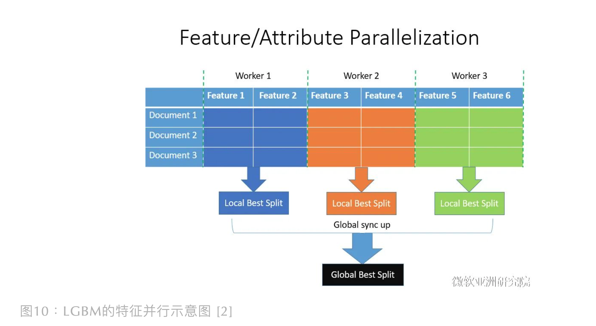

### 数据并行

传统数据并行思路是将训练数据水平划分后，分配给不同机器，然后机器之间相互沟通各自的本地直方图，
以获取全局特征分布去识别最佳分裂属性和分裂点位置。这一过程中存在非常大的通信损失，
且通信损失跟特征数及直方图大小成正比。LGBM为了解决这个问题，
在数据并行中使用分散规约 (Reduce scatter) 把直方图合并的任务分摊到不同的机器，
降低通信和计算，并利用直方图做差，进一步减少了一半的通信量

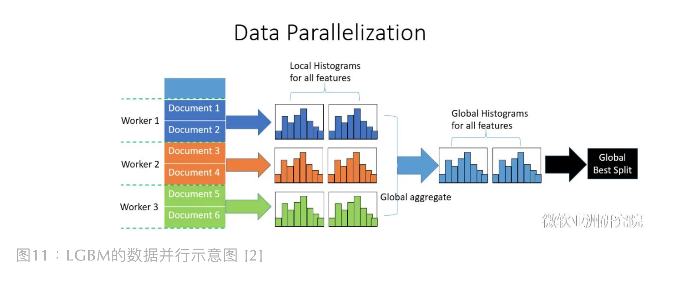

### 投票并行

投票并行主要是针对数据并行进行优化的，采用投票并行的树也被称作：
并行投票决策树 (Parallel Voting Decision Tree, PV-tree)。
它能在通信有效性和准确性之间达到更好的平衡。它跟传统数据并行决策树最大的区别在于：
传统并行树只相信全局集成得到的直方图信息，而PV-tree利用了每个机器上本地统计信息，
它通过一个二阶投票过程，显著地减少了通信损失，具体步骤如下：

1. 本地投票(Local Voting)：每个机器，我们根据本地数据得到的分数 (例如回归的风险衰减量和分裂的信息增益) 先选择出Top-k个特征；
2. 全局投票(Global Voting)：对上一步本地投票得到的候选特征进行多数投票法，选出全局Top-2k个特征；
3. 最佳特征识别 (Best Attribute Identification)：使用全局Top-2k个特征构建全局分布，
   然后基于全局分布的分数，识别出最佳划分特征和其分裂点位置。

PV-tree 不需要对所有特征进行通信，所以通信损失低。基于投票的数据并行流程图如下所示：

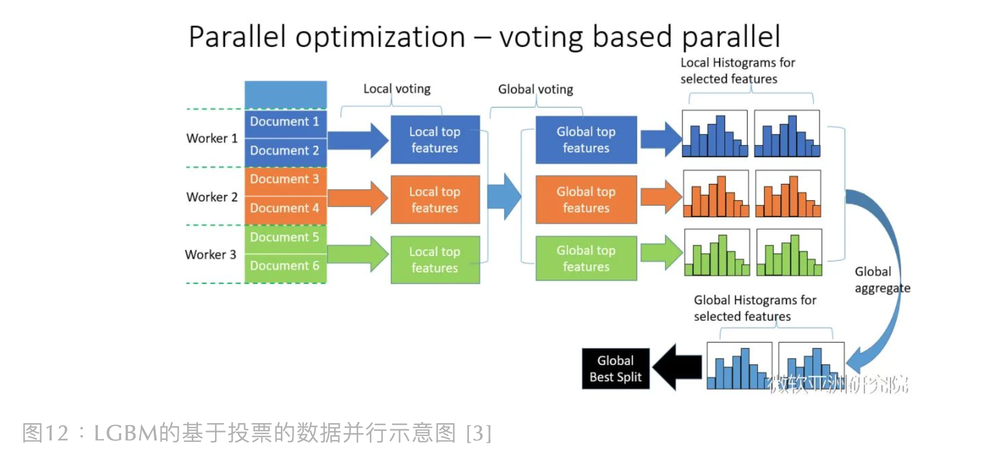

## 增加 Cache 命中率

像 XGBoost 使用的 pre-sorted 算法会造成 Cache-miss 问题，因为它的缓存访问是无顺序的(Randomly)。
如下图所示，不同特征会以不同顺序访问其对应的梯度，分配样本到不同叶子节点时，
我们需要将不同行索引对应到相应的叶子节点，这里的访问也是不按顺序的。因此造成了 Cache 命中率低

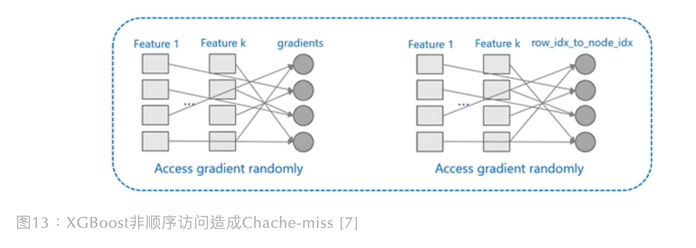

但 LGBM 的缓存访问是顺序的，更容易增加 Cache 命中率。这里有两个原因：

1. 只要对梯度重排序一次后，直方图特征和对应梯度之间便是顺序映射的
2. 不需要存储行索引到叶子索引(row_idx_to_node_idx)的数组，实现了连续访问

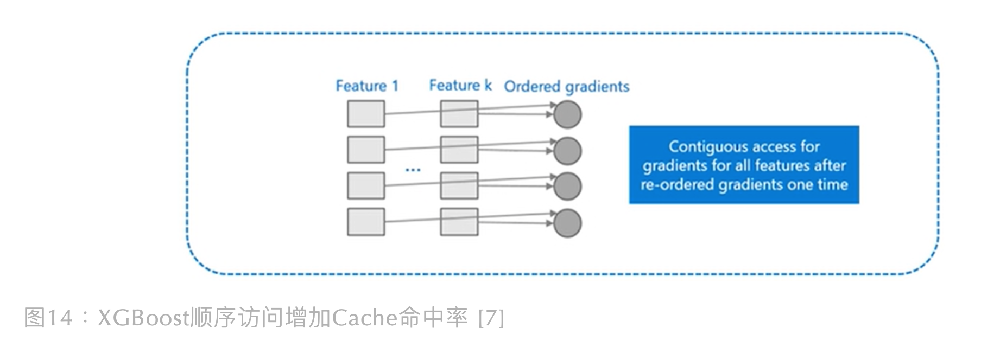

# 参考

* [Lightgbm: A highly efficient gradient boosting decision tree](https://papers.nips.cc/paper/6907-lightgbm-a-highly-efficient-gradient-boosting-decision-tree.pdf)
* [LightGBM GitHub](https://github.com/Microsoft/LightGBM)
* [LightGBM Doc](https://lightgbm.readthedocs.io/en/latest/)
* [Python Guide](https://github.com/microsoft/LightGBM/tree/master/examples/python-guide)
* [LightGBM 中文文档](https://lightgbm.apachecn.org/#/)
* [微软亚洲研究院：《开源|LightGBM：三天内收获 GitHub 1000 星》]()
* [百度百科：《图着色问题》]()
* [知乎：白话机器学习《算法理论+实战之 LightGBM 算法》]()
* [Microstrong：《深入理解 LightGBM》]()
* [A communication-efficient parallel algorithm for decision tree]()
* [微软亚洲研究院：《如何玩转 LightGBM》- 腾讯视频]()
* [狂野上分的 LightGBM](https://mp.weixin.qq.com/s?__biz=Mzk0NDE5Nzg1Ng==&mid=2247494009&idx=1&sn=cd18b6138c85f466fa2c031dd29b2e48&chksm=c32af0f6f45d79e09b840b366d5e7b34a84b6a4619de2f9f3a1cacc2751bcc0567237851f01a&scene=21#wechat_redirect)
* [务实基础-LightGBM](https://mp.weixin.qq.com/s?__biz=MzUyNzA1OTcxNg==&mid=2247485561&idx=1&sn=877a955ac5f4c77ccf2fce6deba5a5d0&chksm=fa041612cd739f04f13a69e5e4f0236b1eb610149446101226597ff9d1daa84ff1ccc7787384&cur_album_id=1577157748566310916&scene=189#wechat_redirect)
* [Kaggle神器LightGBM最全解读](https://mp.weixin.qq.com/s/64xfT9WIgF3yEExpSxyshQ)
* [LightGBM](https://blog.csdn.net/wuzhongqiang/article/details/105350579)
* [LightGBM——提升机器算法（图解+理论+安装方法+python代码）](https://mp.weixin.qq.com/s/12W4oN3qiAOx8J1OzLvkYw)
* [LightGBM——提升机器算法](https://blog.csdn.net/huacha__/article/details/81057150#%E7%94%A8python%E5%AE%9E%E7%8E%B0LightGBM%E7%AE%97%E6%B3%95)
