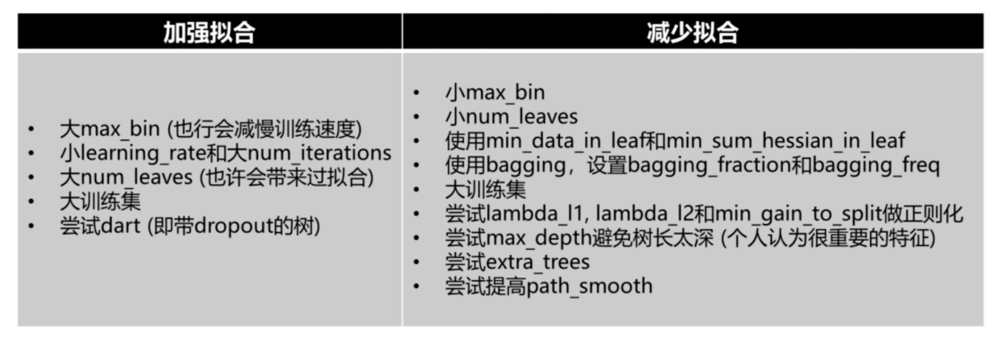

<style>
details {
    border: 1px solid #aaa;
    border-radius: 4px;
    padding: .5em .5em 0;
}
summary {
    font-weight: bold;
    margin: -.5em -.5em 0;
    padding: .5em;
}
details[open] {
    padding: .5em;
}
details[open] summary {
    border-bottom: 1px solid #aaa;
    margin-bottom: .5em;
}
</style>

<details><summary>目录</summary><p>

- [LightGBM 参数](#lightgbm-参数)
  - [Booster 参数](#booster-参数)
  - [LightGBM 调参技巧](#lightgbm-调参技巧)
- [LightGBM API](#lightgbm-api)
  - [LightGBM 安装](#lightgbm-安装)
  - [核心数据结构](#核心数据结构)
    - [数据接口](#数据接口)
    - [加载 LibSVM(zero-based) 文本文件、LightGBM 二进制文件](#加载-libsvmzero-based-文本文件lightgbm-二进制文件)
    - [加载 Numpy 2 维数组](#加载-numpy-2-维数组)
    - [加载 scipy.sparse.csr\_matrix 数组](#加载-scipysparsecsr_matrix-数组)
    - [保存数据为 LightGBM 二进制文件](#保存数据为-lightgbm-二进制文件)
    - [创建验证数据](#创建验证数据)
    - [在数据加载时标识特征名称和类别特征](#在数据加载时标识特征名称和类别特征)
    - [有效利用内存空间](#有效利用内存空间)
  - [Training API](#training-api)
  - [Scikit-learn API](#scikit-learn-api)
  - [Callbacks](#callbacks)
  - [Plotting](#plotting)
</p></details><p></p>


# LightGBM 参数

* 参数设置方式: 
    - 命令行参数
    - 参数配置文件
    - Python 参数字典
* 参数类型:
    - 核心参数
    - 学习控制参数
    - IO 参数
    - 目标参数
    - 度量参数
    - 网络参数
    - GPU 参数
    - 模型参数
    - 其他参数

## Booster 参数

```python
param = {
   'num_levels': 31,
   'num_trees': 100,
   'objective': 'binary',
   'metirc': ['auc', 'binary_logloss']
}
```

## LightGBM 调参技巧



* 人工调参
* 提高速度
   - Use bagging by setting `bagging_fraction` and `bagging_freq`
   - Use feature sub-sampling by setting `feature_fraction`
   - Use small `max_bin`
   - Use `save_binary` to speed up data loading in future learning
   - Use parallel learning, refer to Parallel Learning Guide
* 提高准确率
    - Use large `max_bin` (may be slower)
    - Use small learning_rate with large num_iterations
    - Use large num_leaves (may cause over-fitting)
    - Use bigger training data
    - Try `dart`
* 处理过拟合
    - Use small `max_bin`
    - Use small `num_leaves`
    - Use `min_data_in_leaf` and `min_sum_hessian_in_leaf`
    - Use bagging by set `bagging_fraction` and `bagging_freq`
    - Use feature sub-sampling by set `feature_fraction`
    - Use bigger training data
    - Try `lambda_l1`, `lambda_l2` and `min_gain_to_split` for regularization
    - Try `max_depth` to avoid growing deep tree
    - Try `extra_trees`
    - Try increasing `path_smooth`

# LightGBM API

## LightGBM 安装

```bash
# 默认版本
$ pip install lightgbm

# MPI 版本
$ pip install lightgbm --install-option=--mpi

# GPU 版本
$ pip install lightgbm --install-option=--gpu
```

## 核心数据结构

- `Dataset(data, label, reference, weight, ...)`
- `Booster(params, train_set, model_file, ...)`

### 数据接口

* LibSVM(zero-based), TSV, CSV, TXT 文本文件
* Numpy 2 维数组
* pandas DataFrame
* H2O DataTable’s Frame
* SciPy sparse matrix
* LightGBM 二进制文件

> 数据保存在 `lightgbm.Dataset` 对象中

### 加载 LibSVM(zero-based) 文本文件、LightGBM 二进制文件

```python
import lightgbm as lgb

# csv
train_csv_data = lgb.Dataset('train.csv')

# tsv
train_tsv_data = lgb.Dataset('train.tsv')

# libsvm
train_svm_data = lgb.Dataset('train.svm')

# lightgbm bin
train_bin_data = lgb.Dataset('train.bin')
```

### 加载 Numpy 2 维数组

```python
import liggtgbm as lgb

data = np.random.rand(500, 10)
label = np.random.randint(2, size = 500)
train_array = lgb.Dataset(data, label = label)
```

### 加载 scipy.sparse.csr_matrix 数组

```python
import lightgbm as lgb
import scipy

csr = scipy.sparse.csr_matirx((dat, (row, col)))
train_sparse = lgb.Dataset(csr)
```

### 保存数据为 LightGBM 二进制文件

```python
import lightgbm as lgb

train_data = lgb.Dataset("train.svm.txt")
train_data.save_binary('train.bin')
```

> 将数据保存为 LightGBM 二进制文件会使数据加载更快

### 创建验证数据

```python
import lightgbm as lgb

# 训练数据
train_data = lgb.Dataset("train.csv")

# 验证数据
validation_data = train_data.create_vaild('validation.svm')
# or
validation_data = lgb.Dataset('validation.svm', reference = train_data)
```

> 在 LightGBM 中, 验证数据应该与训练数据一致(格式)

### 在数据加载时标识特征名称和类别特征

```python
import numpy as np
import lightgbm as lgb

data = np.random.rand(500, 10)
label = np.random.randint(2, size = 500)
train_array = lgb.Dataset(data, label = label)
w = np.random.rand(500, 1)

train_data = lgb.Dataset(data, 
                        label = label, 
                        feature_name = ['c1', 'c2', 'c3'], 
                        categorical_feature = ['c3'],
                        weight = w,
                        free_raw_data = True)
# or
train_data.set_weight(w)

train_data.set_init_score()

train_data.set_group()
```

### 有效利用内存空间

The Dataset object in LightGBM is very memory-efficient, 
it only needs to save discrete bins. However, Numpy/Array/Pandas object is memory expensive. 
If you are concerned about your memory consumption, you can save memory by:

- 1.Set `free_raw_data=True` (default is `True`) when constructing the Dataset
- 2.Explicitly set `raw_data=None` after the Dataset has been constructed
- Call `gc`


## Training API

- `train(params, train_set, num_boost_round, ...)`
- `cv(params, train_ste, num_boost_round, ...)`

## Scikit-learn API

- `LGBMModel(boosting\ *type, num*\ leaves, ...)`
- `LGBMClassifier(boosting\ *type, num*\ leaves, ...)`
- `LGBMRegressor(boosting\ *type, num*\ leaves, ...)`
- `LGBMRanker(boosting\ *type, num*\ leaves, ...)`


```python
lightgbm.LGBMClassifier(boosting_type = "gbdt", # gbdt, dart, goss, rf
                       num_leaves = 31, 
                       max_depth = -1, 
                       learning_rate = 0.1,
                       n_estimators = 100,
                       subsample_for_bin = 200000,
                       objective = None, 
                       class_weight = None,
                       min_split_gain = 0.0,
                       min_child_weight = 0.001, 
                       min_child_samples = 20,
                       subsample = 1.0,
                       subsample_freq = 0,
                       colsample_bytree = 1.0,
                       reg_alpha = 0.0,
                       reg_lambda = 0.0,
                       random_state = None,
                       n_jobs = -1, 
                       silent = True,
                       importance_type = "split",
                       **kwargs)

lgbc.fit(X, y,
        sample, 
        weight = None, 
        init_score = None,
        eval_set = None,
        eval_names = None, 
        eval_sample_weight = None,
        eval_class_weight = None,
        eval_init_score = None,
        eval_metric = None,
        early_stopping_rounds = None,
        verbose = True,
        feature_name = "auto",
        categorical_feature = "auto",
        callbacks = None)

lgbc.predict(X, 
            raw_score = False,
            num_iteration = None,
            pred_leaf = False,
            pred_contrib = False,
            **kwargs)

lgbc.predict_proba(X, 
                  raw_score = False,
                  num_iteration = None,
                  pred_leaf = False,
                  pred_contrib = False,
                  **kwargs)
```

```python
lightgbm.LGBMRegressor(boosting_type = "gbdt",
                      num_leaves = 31,
                      max_depth = -1,
                      learning_rate = 0.1,
                      n_estimators = 100,
                      subsample_for_bin = 200000,
                      objective = None,
                      class_weight = None,
                      min_split_gain = 0.0,
                      min_child_weight = 0.001,
                      min_child_samples = 20,
                      subsample = 1.0,
                      subsample_freq = 0,
                      colsample_bytree = 1.0,
                      reg_alpha = 0.0,
                      reg_lambda = 0.0,
                      random_state = None,
                      n_jobs = -1,
                      silent = True,
                      importance_type = "split",
                      **kwargs)

lgbr.fit(X, y, sample_weight = None,
        init_score = None, 
        eval_set = None,
        eval_names = None,
        eval_sample_weight = None,
        eval_init_score = None,
        eval_metric = None,
        early_stopping_rounds = None,
        verbose = True,
        feature_name = "auto",
        categorical_feature = "auto",
        callbacks = None)

lgbr.predict(X, 
            raw_score = False, 
            num_iteration = None, 
            pred_leaf = False,
            pred_contrib = False,
            **kwargs)
```

## Callbacks

- `early_stopping(stopping_round, ...)`
- `print_evaluation(period, show_stdv)`
- `record_evaluation(eval_result)`
- `reset_parameter(**kwargs)`

```python
early_stopping(stopping_round, ...)
print_evaluation(period, show_stdv)
record_evaluation(eval_result)
reset_parameter(**kwargs)
```

## Plotting

- `plot_importance(booster, ax, height, xlim, ...)`
- `plot_split_value_histogram(booster, feature)`
- `plot_metric(booster, metric, ...)`
- `plot_tree(booster, ax, tree_index, ...)`
- `create_tree_digraph(booster, tree_index, ...)`

```python
plot_importance(booster, ax, height, xlim, ...)
plot_split_value_histogram(booster, feature)
plot_metric(booster, ax, tree, index, ...)
plot_tree(booster, ax, tree_index, ...)
create_tree_digraph(booster, tree_index, ...)
```