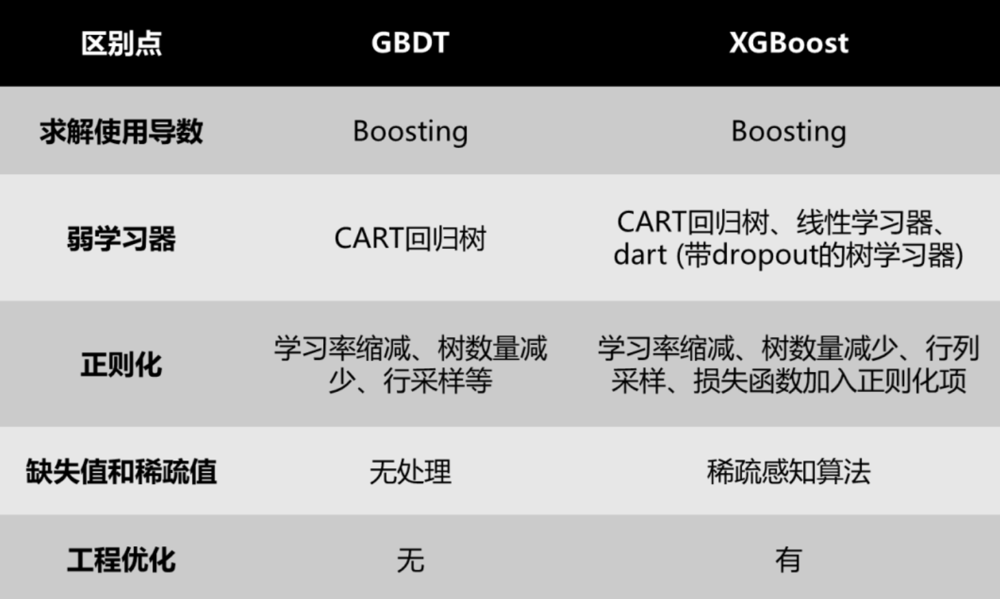
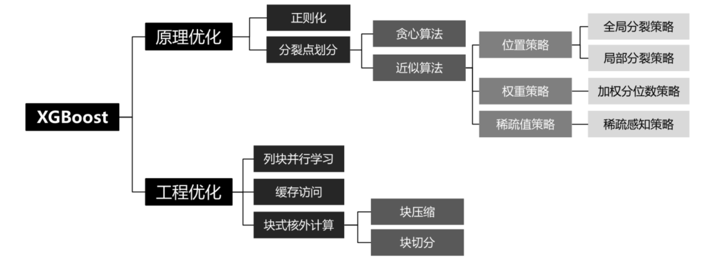
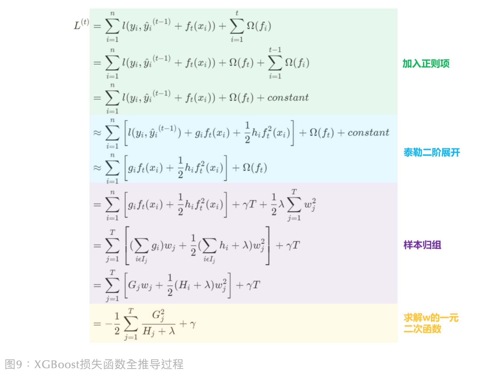
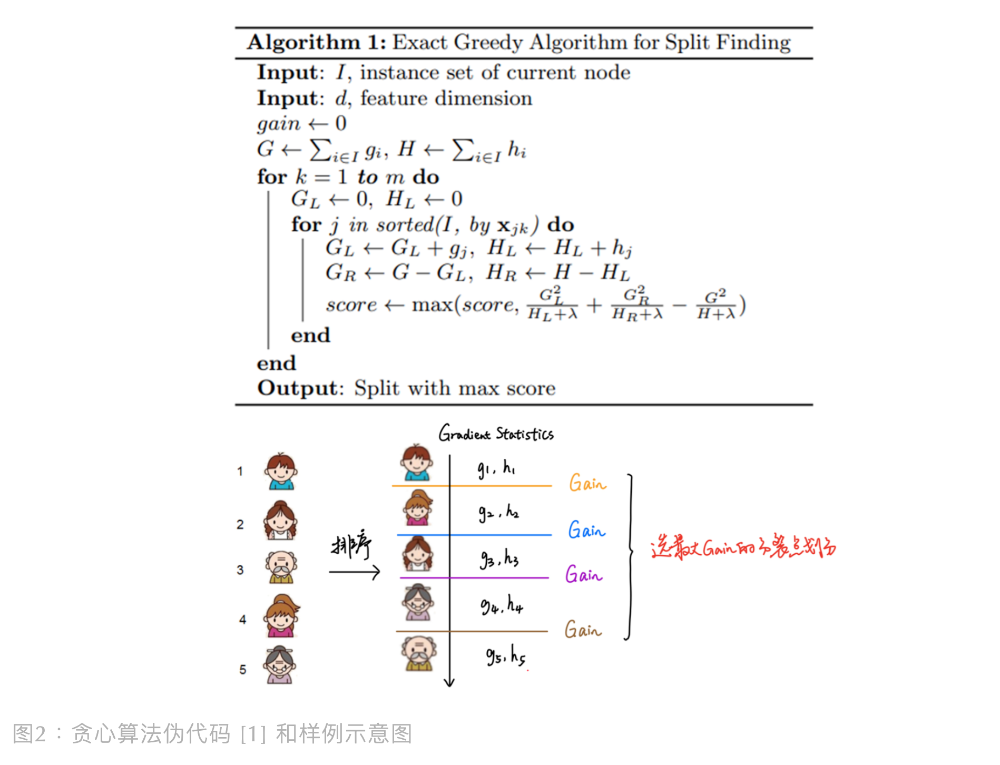
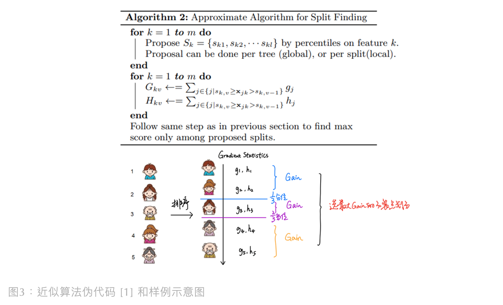
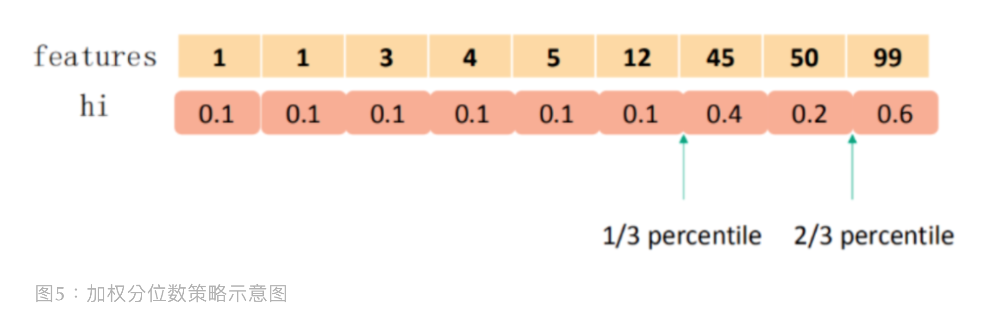
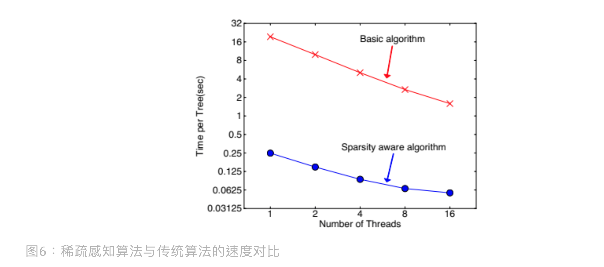
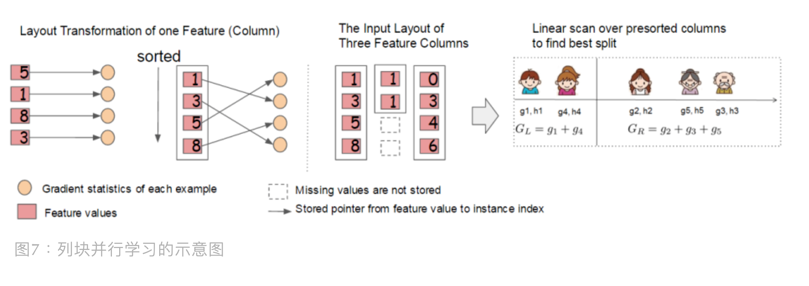

目录

- [XGBoost 简介](#xgboost-简介)
  - [XGBoost 特点](#xgboost-特点)
  - [XGBoost vs GBDT](#xgboost-vs-gbdt)
  - [XGBoost 优缺点](#xgboost-优缺点)
    - [优点](#优点)
    - [缺点](#缺点)
- [XGBoost 模型目标函数](#xgboost-模型目标函数)
  - [目标函数](#目标函数)
  - [优化原理](#优化原理)
- [XGBoost 模型正则化](#xgboost-模型正则化)
  - [损失函数正则化](#损失函数正则化)
    - [加入正则项](#加入正则项)
    - [泰勒二阶展开](#泰勒二阶展开)
    - [样本归组](#样本归组)
    - [求解一元二次函数](#求解一元二次函数)
  - [缩减树权重](#缩减树权重)
  - [列采样](#列采样)
- [XGBoost 树节点分裂策略](#xgboost-树节点分裂策略)
  - [贪心算法](#贪心算法)
  - [近似算法](#近似算法)
    - [位置策略](#位置策略)
    - [权重策略](#权重策略)
    - [稀疏值策略](#稀疏值策略)
- [XGBoost 工程优化](#xgboost-工程优化)
  - [列块并行学习](#列块并行学习)
  - [缓存访问](#缓存访问)
  - [块式核外计算](#块式核外计算)
- [参考](#参考)

# XGBoost 简介

> XGBoost，eXtreme Gradient Boosting

> XGBoost is an optimized distributed gradient boosting library designed to be highly efficient, 
> flexible and portable. It implements machine learning algorithms under the Gradient Boosting framework. 
> XGBoost provides a parallel tree boosting (also known as GBDT, GBM) that solve many data science problems in a fast and accurate way. 
> The same code runs on major distributed environment (Hadoop, SGE, MPI) and can solve problems beyond billions of examples.

## XGBoost 特点

弱学习器：

* 传统的 GBDT 以 CART 作为基函数(base learner, base classifier, base function)，
  而 XGBoost 除了可以使用 CART，还支持线性学习器（linear classifier, linear regression, logistic regression）
* 基于预排序(pre-sorted)算法构建决策树
    - 算法基本原理
        - 首先，对所有特征都按照特征的数值进行排序
        - 其次，在遍历分割点的时候用 `$O(\#data)$` 的代价找到一个特征上的最好分割点
        - 最后，找到一个特征的分割点后，将数据分裂成左右子节点
    - 优缺点
        - 优点：精确地找到分割点
        - 缺点：内存消耗大，时间消耗大，对缓存（Cache）优化不友好

梯度：

* 传统的 GBDT 在优化时只用到一阶导数信息(负梯度)，
  XGBoost 则对损失函数进行了二阶泰勒展开，同时用到一阶和二阶导数 
* XGBoost 支持自定义损失函数，只要函数可一阶和二阶求导

## XGBoost vs GBDT

GBDT 基于负梯度（"残差"）优化偏差的训练方式容易使模型过拟合，
虽然 GBDT 在学习率、树数量、子采样比例和决策树结构参数上有做正则化去避免过拟合，
但是有没有其他更好的正则化手段呢？

另外，GBDT 的串行训练方式造成的计算开销大，能从其它地方优化，从而加快模型训练吗？
答案是有，2016 年陈天奇发表了 XGBoost，他在 GBDT 的基础上，优化了算法原理和工程实现，
但本质上它跟 GBDT 一样都是加性模型

## XGBoost 优缺点

> XGBoost 的缺点也是 LightGBM 的出发点

### 优点

* 高效（Highly Efficient）
    - 并行化的 GBM(Parallel Processing)
* 灵活性强 （Highly Flexible）
    - 不仅支持 CART 树作为弱学习器，还支持其他线性分类器如逻辑回归
* 可扩展性强（Highly Portable）
    - 自定义损失函数等
* 正则化的 GBM(Regularization)：控制模型过拟合问题
    - 在损失函数上加入正则化项（抑制叶子节点数量和叶子节点权重）、缩减、列采样等
* 预测精度比 GBDT 高：采用二阶泰勒展开
* 针对缺失值和稀疏值有较好的处理手段，自动分配分裂方向
    - 能够处理缺失数据
    - 为稀疏数据设计的决策树训练方法 
* 工程落地性好，支持特征粒度上的并行。因为使用了一系列工程优化方法
    - 列块存储，列块并行学习，还有使用近似算法减少计算量
    - 缓存访问：设计高效核外计算, 进行 Cache-aware 数据块处理
    - 块式核外计算

### 缺点

* XGBoost 还是跟 GBDT 一样，处理不好类别型数据
    - 一旦类别型特征出现，XGBoost 把类别型特征当作数值型特征处理，用 Label Encoding 会增加模型学习难度，
      但陈天奇在项目问答模块回答道：“当类别数量小 (比如10-100) 时，可以考虑 One-hot Encoding。”，
      而如果类别数过大，个人觉得 One-hot 编码的风险会很大，因为带来了很大稀疏性，这会导致两种结果：
        - (1) 增加内存和时间开销
        - (2) 稀疏特征的分裂下的子树泛化性差，易拟合
* 存在内存开销，需要存储梯度统计值和索引指针
* 每轮迭代时, 都需要遍历整个训练数据集多次
    - 如果把整个训练数据装进内存则会限制训练数据的大小
    - 如果不装进内存, 反复地读写训练数据又会消耗非常大的时间
* 预排序方法(Pre-sorted)
    - 首先，空间消耗大。这样的算法需要保存数据的特征值，还保存了特征排序的结果(例如排序后的索引，为了后续快速地计算分割点)，
      这里需要消耗训练数据两倍的内存 
    - 其次，时间上也有较大的开销。在遍历每一个分割点的时候，都需要进行分裂增益的计算，消耗的代价大
* 对 Cache 优化不友好
    - 在预排序后，特征对梯度的访问是一种随机访问，并且不同的特征访问的顺序不一样，
      无法对 Cache 进行优化
    - 同时，在每一层长树的时候，需要随机访问一个行索引到叶子索引的数组，
      并且不同特征访问的顺序也不一样，也会造成较大的 Cache Miss

# XGBoost 模型目标函数

## 目标函数

模型的目标函数：

`$$\begin{align}L &= \sum_{i=1}^{n} l(y_i, \hat{y_i}) + \sum_{k=1}^{K} \Omega(f_{k})\end{align}$$`

其中：

* `$L$`：目标函数
* `$l(\cdot)$`：经验损失(误差)函数。通常是凸函数，用于刻画预测值 `$\hat{y_i}$` 和真实值 `$y_i$` 之间的差异，即模型对训练数据的拟合程度
    - `$y_{i}$`：第 `$i$` 个样本的目标变量观测值，即样本的真实观测值
    - `$\hat{y}_{i}=\sum_{k=1}^{K}f_{k}(x_{i}), f_{k} \in F$`：第 `$i$` 个样本的模型输出预测值
        - 回归：预测得分
        - 分类：预测概率
        - 排序：排序得分
    - `$n$`：样本数量
* `$\Omega(\cdot)$`：模型的正则化项。用于降低模型的复杂度，减轻过拟合。包含以下内容：
    - 决策树的叶子节点数量
    - 决策树的树深度
    - 决策树的叶节点权重得分的 L1，L2 正则
* `$f_{k}$`：第 `$k$` 个基学习器
    - `$K$`：基学习器的数量

模型目标就是找到一组学习器，使得损失函数 `$L$` 最小:

`$$\underset{f}{\min} L = \min \Bigg[\sum_{i=1}^{n} l(y_i, \hat{y_i}) + \sum_{k=1}^{K} \Omega(f_k)\Bigg]$$`

这个模型目标函数是由经验(样本)损失函数、模型复杂度惩罚项(正则项)组成

## 优化原理

# XGBoost 模型正则化

XGBoost 的正则化手段有三个：在损失函数内加入正则项、缩减树权重、列采样

## 损失函数正则化

为了得到 XGBoost 的最终损失函数，要进行以下四个步骤：

### 加入正则项

在损失函数上加正则项是很常见的一种避免过拟合手段，根据 GBM(Gradient Boosting Modeling)思想，
假设第 `$t$` 棵树可以表示为：

`$$\hat{y}_{i}^{(t)}=\sum_{k=1}^{t}f_{k}(x_{i})=\hat{y}_{i}^{(t-1)}+f_{t}(x_{i})$$`

那么，可以假设第 `$t$` 轮迭代的目标函数为: 

`$$\begin{align}
L^{(t)} &= \sum_{i=1}^{n} l(y_{i}, \hat{y}_{i}) + \sum_{i=1}^{t} \Omega(f_{i}) \\
        &= \sum_{i=1}^{n} l\bigg(y_{i}, \hat{y}_{i}^{(t-1)} + f_{t}(x_{i}) \bigg) + \Omega(f_{t}) + \sum_{i=1}^{t-1}\Omega(f_{i})
\end{align}$$`

`$$\Omega(f)=\gamma T + \frac{1}{2}\lambda ||\omega||^{2}$$`

其中:

* `$y_{i}$`：第 `$i$` 个样本的目标变量观测值，即样本的真实观测值
* `$\hat{y}_{i}^{(t-1)}$`：前 `$t-1$` 轮学习器累加后给出第 `$t-1$` 轮的预测值
* `$f_{t}(x_{i})$`：第 `$t$` 轮弱学习器给出的预测值
* `$\sum_{i=1}^{t}\Omega(f_{i})$` 是 `$t$` 个弱学习器的复杂度之和，避免模型过拟合
    - 复杂度有两部分组成：
        - 叶子节点数量 `$T$`：叶子节点少，模型复杂度低
        - 叶子节点权重 `$\omega$`：叶子权重低，有利于避免模型过拟合
    - `$\gamma$` 和 `$\lambda$` 分别是叶子节点和叶子节点权重的正则化系数
        - 系数越大，抑制效果越强。此外，这里对 `$\omega$` 进行 L2 范式正则化（会缩减权重但不会调整到 0）

由于在计算第 `$t$` 轮时，已确认前 `$t-1$` 轮的树，
因此前 `$t-1$` 轮的复杂度之和 `$\sum_{i=1}^{t-1} \Omega(f_{i})$` 也是已知的数 (即可以常量表示)

> Additive Training Boosting 核心思想是，在已经训练好了 `$t-1$` 棵树后不再调整前 `$t-1$` 棵树，
> 即第 `$t$` 轮迭代的目标函数不对前 `$t-1$` 轮迭代的结果进行修改

所以可以将损失函数内的复杂度项进一步推导如下：

`$$\begin{align}
L^{(t)} &= \sum_{i=1}^{n} l(y_{i}, \hat{y}_{i}) + \sum_{i=1}^{t} \Omega(f_{i}) \\
        &= \sum_{i=1}^{n} l\bigg(y_{i}, \hat{y}_{i}^{(t-1)} + f_{t}(x_{i}) \bigg) + \Omega(f_{t}) + \sum_{i=1}^{t-1}\Omega(f_{i}) \qquad (1) \\
        &= \sum_{i=1}^{n} l\bigg(y_{i}, \hat{y}_{i}^{(t-1)} + f_{t}(x_{i}) \bigg) + \Omega(f_{t}) + constant
\end{align}$$`

`$$\Omega(f)=\gamma T + \frac{1}{2}\lambda ||\omega||^{2}$$`

### 泰勒二阶展开

为了方便模型求解，上面损失函数还不够简单直接，需要进行进一步求解

> 但在此先了解下泰勒公式，它对我们后续求解目标函数有很大的帮助。
> 泰勒公式是用函数在某一点的各阶导数值做系数构建一个多项式来近似表达这个函数，
> 举个例子：
> 
> 函数 `$f(x)$` 在 `$\Delta x$` 处的二阶泰勒展开式: 
> `$$f(x + \Delta x) \approx f(x) + f' (x)\Delta x + \frac{1}{2}f''(x)\Delta x^2$$`
> 其中 `$\Delta x$` 是个无穷小量，所以才会说，泰勒公式是一种近似表达函数的方法

如果把上面的公式 (2) 和泰勒二阶展开式放在一起看，
会发现其实可以将 `$x$` 对应前 `$t-1$` 轮学习器累加得到的预测值 `$\hat{y}_{i}^{(t-1)}$`，
`$\Delta x$` 对应第 `$t$` 轮弱学习器的预测值 `$f_{t}(x_{i})$`。
则目标函数 `$l\big(y_i, \hat{y_i}^{(t-1)} + f_t (x_i)\big)$` 在 `$\hat{y_i}^{(t-1)}$` 处的二阶泰勒展开式: 

`$$l\big(y_i, \hat{y_i}^{(t-1)} + f_t (x_i)\big) = l(y_i, \hat{y_i}^{(t - 1)}) + \frac{\partial l(y_i, \hat{y_i}^{(t - 1)})}{\partial \hat{y_i}^{(t - 1)}} f_{t}(x_i) + \frac{1}{2} \frac{{\partial ^{2}} l(y_i, \hat{y_i}^{(t - 1)}) } {\partial \big(\hat{y_i}^{(t - 1)}\big)^{2}} f_{t}^2(x_{i})$$`

记一阶导数为

`$$g_i = \frac{\partial l(y_i, \hat{y_i}^{(t - 1)})}{\partial \hat{y_i}^{(t - 1)}}$$`

记二阶导数为

`$$h_i = \frac{{\partial ^{2}} l(y_i, \hat{y_i}^{(t - 1)})}{\partial \big(\hat{y_i}^{(t - 1)}\big)^{2}}$$` 

可以得到

`$$l\big(y_{i}, \hat{y}_{i}^{(t-1)} + f_t(x_i)\big) = l(y_i, \hat{y}_{i}^{(t - 1)}) + g_i f_t(x_i) + \frac{1}{2} h_i f_t^2 (x_i)$$`

对目标函数 `$L^{(t)}$` 在 `$\hat{y_i}^{(t-1)}$` 处进行二阶泰勒展开，
可以加速优化过程，得到目标函数的近似: 

`$$\begin{align}
L^{(t)} &= \sum_{i=1}^{n} l(y_{i}, \hat{y}_{i}) + \sum_{i=1}^{t} \Omega(f_{i}) \\
        &= \sum_{i=1}^{n} l\bigg(y_{i}, \hat{y}_{i}^{(t-1)} + f_{t}(x_{i}) \bigg) + \Omega(f_{t}) + \sum_{i=1}^{t-1}\Omega(f_{i}) \\
&= \sum_{i=1}^{n} l\bigg(y_{i}, \hat{y}_{i}^{(t-1)} + f_{t}(x_{i}) \bigg) + \Omega(f_{t}) + constant \\
& \approx \sum_{i=1}^{n} \bigg[l(y_i, \hat{y_i}^{(t-1)}) + g_i f_t (x_i) + \frac{1}{2} h_i f_t^2 (x_i)\bigg]+ \Omega(f_t) + constant
\end{align}$$`

上面的目标函数 `$L^{(t)}$` 中，由于前 `$t-1$` 棵树已知，则第一项 `$l(y_i, \hat{y_i}^{(t-1)})$` 也为常数项，
以及 `$constant$` 为常数项，在优化问题中可直接删除，因此模型损失函数可以简化为：

`$$\begin{align}
L^{(t)} &= \sum_{i=1}^{n} l(y_{i}, \hat{y}_{i}) + \sum_{i=1}^{t} \Omega(f_{i}) \\
        &= \sum_{i=1}^{n} l\bigg(y_{i}, \hat{y}_{i}^{(t-1)} + f_{t}(x_{i}) \bigg) + \Omega(f_{t}) + \sum_{i=1}^{t-1}\Omega(f_{i}) \\
&= \sum_{i=1}^{n} l\bigg(y_{i}, \hat{y}_{i}^{(t-1)} + f_{t}(x_{i}) \bigg) + \Omega(f_{t}) + constant \\
& \approx \sum_{i=1}^{n} \bigg[l(y_i, \hat{y_i}^{(t-1)}) + g_i f_t (x_i) + \frac{1}{2} h_i f_t^2 (x_i)\bigg]+ \Omega(f_t) + constant \\
&= \sum_{i=1}^{n} \bigg[g_{i}f_{t}(x_i) + \frac{1}{2}h_{i}f_{t}^{2}(x_i) \bigg]  + \Omega (f_t)
\end{align}$$`

其中：

`$$\Omega(f)=\gamma T + \frac{1}{2}\lambda ||\omega||^{2}$$`

`$$g_i = \frac{\partial l(y_i, \hat{y_i}^{(t - 1)})}{\partial \hat{y_i}^{(t - 1)}}$$`

`$$h_i = \frac{{\partial ^{2}} l(y_i, \hat{y_i}^{(t - 1)})}{\partial \big(\hat{y_i}^{(t - 1)}\big)^{2}}$$`

注意 `$g_{i}$` 和 `$h_{i}$` 分别为损失函数 `$l(y_{i}, \hat{y}_{i}^{(t-1)})$` 的一阶和二阶导数，
损失函数有很多种，例如平方损失、平方对数损失、Hinge 损失等

### 样本归组

之前的损失函数都是遍历各个样本 `$(i=1,\ldots,n)$` 计算损失，
但实际上样本最后都落在叶子节点上 (样本归组)，一个叶子节点包含一个样本集，
那我们可以遍历每个叶子节点，透过每个叶子节点内样本集去计算导数。
假设待训练的第 `$t$` 棵树有 `$T$` 个叶子节点，第 `$j$` 个叶子节点内有样本集 `$x_{i}$`，
那可以定义 `$I_{j} = \{i|q(x_{i})=j\}$` 为叶子节点 `$j$` 下的样本集，
`$q(x_{i})$` 可以根据样本 `$x_{i}$` 得到对应的叶子节点位置索引

> 叶子节点的输出向量(叶子节点权重得分向量)表示为：
> 
> `$$\omega = [\omega_{1}, \omega_{2}, \ldots, \omega_{T}]$$`
> 
> 假设样本 `$x \in R^{d}$` 到叶子节点的索引值 `$\{1, 2, \ldots, T\}$` 的映射表示为：
> 
> `$$q(x): R^d \rightarrow \{1, 2, \ldots, T\}$$`
> 
> 通过叶子节点的权重得分、叶子节点位置索引(树结构)定义第 `$t$` 棵树：
> 
> `$$f_t(x) = \omega_{q(x)}, \omega \in R^{T}, q(x): R^d \rightarrow \{1, 2, \ldots, T\}$$`
> 
> 其中：
> 
> * `$\omega$`：叶子节点权重得分向量
> * `$q(\cdot)$`：叶子节点的索引值，树结构
> * `$T$`：叶节点数量
> * `$x$`：样本向量
> * `$d$`：样本特征数量
> * `$t$`：模型的迭代轮数，构建的第 `$t$` 棵树
> 
> 定义正则项(可以使其他形式)：
> 
> `$$\Omega(f_t)=\gamma T + \frac{1}{2}\lambda\sum_{j=1}^{T}\omega_j^2$$`
> 
> 其中：
> 
> * `$T$`：叶节点数量
> * `$\omega_j^2$`：叶子节点权重得分向量的 L2 范数
> * `$\gamma$`：叶节点数量的正则化参数 
> * `$\lambda$`：叶子节点权重得分向量的正则化参数

样本归组后，将正则项 `$\Omega(f_t)$` 展开，损失函数如下: 

`$$\begin{align}
L^{(t)} &= \sum_{i=1}^{n} l(y_{i}, \hat{y}_{i}) + \sum_{i=1}^{t} \Omega(f_{i}) \\
        &= \sum_{i=1}^{n} l\bigg(y_{i}, \hat{y}_{i}^{(t-1)} + f_{t}(x_{i}) \bigg) + \Omega(f_{t}) + \sum_{i=1}^{t-1}\Omega(f_{i}) \\
&= \sum_{i=1}^{n} l\bigg(y_{i}, \hat{y}_{i}^{(t-1)} + f_{t}(x_{i}) \bigg) + \Omega(f_{t}) + constant \\
&\approx \sum_{i=1}^{n} \bigg[l(y_i, \hat{y_i}^{(t-1)}) + g_i f_t (x_i) + \frac{1}{2} h_i f_t^2 (x_i)\bigg]+ \Omega(f_t) + constant \\
&\approx \sum_{i=1}^{n} \bigg[g_{i}f_{t}(x_i) + \frac{1}{2}h_{i}f_{t}^{2}(x_i) \bigg]  + \Omega (f_t) \\
&= \sum_{i=1}^{n} \bigg[ g_{i} \omega_{q(x_{i})} + \frac{1}{2} h_{i} \omega_{q(x_{i})}^{2}\bigg] + \gamma T + \frac{1}{2} \lambda \sum_{j=1}^{T} w_{j}^{2} \\
&= \sum_{j=1}^{T} \bigg[ (\sum_{i \in I_{j} } g_{i}) \omega_{j} + \frac{1}{2} (\sum_{i \in I_{j}} h_{i}  + \lambda) \omega_{j}^{2} \bigg] + \gamma T\end{align}$$`

记 `$G_{j}=\underset{i \in I_{j}}{\sum}g_{i}$`，`$H_{j}=\underset{i \in I_{j}}{\sum} h_{i}$`，
它们分别是叶子节点 `$j$` 下各样本一阶导数之和和二阶导数之和，它们是前 `$t-1$` 步得到的结果，
所以为已知的常数，因此最终的目标函数为：

`$$\begin{align}
L^{(t)} &= \sum_{i=1}^{n} l(y_{i}, \hat{y}_{i}) + \sum_{i=1}^{t} \Omega(f_{i}) \\
        &= \sum_{i=1}^{n} l\bigg(y_{i}, \hat{y}_{i}^{(t-1)} + f_{t}(x_{i}) \bigg) + \Omega(f_{t}) + \sum_{i=1}^{t-1}\Omega(f_{i}) \\
&= \sum_{i=1}^{n} l\bigg(y_{i}, \hat{y}_{i}^{(t-1)} + f_{t}(x_{i}) \bigg) + \Omega(f_{t}) + constant \\
&\approx \sum_{i=1}^{n} \bigg[l(y_i, \hat{y_i}^{(t-1)}) + g_i f_t (x_i) + \frac{1}{2} h_i f_t^2 (x_i)\bigg]+ \Omega(f_t) + constant \\
&\approx \sum_{i=1}^{n} \bigg[g_{i}f_{t}(x_i) + \frac{1}{2}h_{i}f_{t}^{2}(x_i) \bigg]  + \Omega (f_t) \\
&= \sum_{i=1}^{n} \bigg[ g_{i} \omega_{q(x_{i})} + \frac{1}{2} h_{i} \omega_{q(x_{i})}^{2}\bigg] + \gamma T + \frac{1}{2} \lambda \sum_{j=1}^{T} w_{j}^{2} \\
&= \sum_{j=1}^{T} \bigg[ (\sum_{i \in I_{j} } g_{i}) \omega_{j} + \frac{1}{2} (\sum_{i \in I_{j}} h_{i}  + \lambda) \omega_{j}^{2} \bigg] + \gamma T \\
&= \sum_{j = 1}^{T} \bigg[G_{j} \omega_{j} + \frac{1}{2} (H_{j}  + \lambda ) \omega_{j}^2 \bigg]  + \gamma T
\end{align}$$`

### 求解一元二次函数

对下面的目标函数进行优化求解:

`$$\underset{[\omega_{1}, \omega_{2}, \ldots, \omega_{T}]}{argmin} L^{(t)} = \underset{[\omega_{1}, \omega_{2}, \ldots, \omega_{T}]}{argmin} \bigg( \sum_{j = 1}^{T} \bigg[G_{j} \omega_{j} + \frac{1}{2} (H_{j}  + \lambda ) \omega_{j}^2 \bigg]  + \gamma T \bigg)$$`

> 易知，上述目标函数是一个累加的二次函数形式 `$f(x)=ax + bx^{2} +c$`，
> 根据二次函数求解法则，顶点坐标为：`$(-\frac{b}{2a}, \frac{4ac-b^{2}}{4a})$`，
> 那么其最小值的解析解形式 `$x=-\frac{b}{2a}$`。
> 
> 对上面的目标函数而言，`$\omega_{j}$` 相当于 `$x$`，
> `$\frac{1}{2}(H_{i} + \lambda)$` 对应 `$a$`，`$G_{j}$` 对应 `$b$`。
> 要对目标函数求最小值，只要把 `$\omega$` 当作一元二次方程中的 `$x$`，求其顶点值即可，具体如下

对于固定的树结构 `$q(x)$`，对目标函数关于 `$\omega_j$` 求导等于 0，
得到目标函数的解析解 `$\omega_{j}^{\star}$`，即目标函数的最优参数：

`$$w_{j}^{\star} = -\frac{b}{2a} = -\frac{G_{j}}{2 \times \frac{1}{2}(H_{j} + \lambda)} = -\frac{G_{j}}{H_{j} + \lambda}$$`

将上面得到的解析解带入目标函数: 

`$$\begin{align}
\tilde{L}^{(t)}_{min}
&=\underset{[\omega_{1}, \omega_{2}, \ldots, \omega_{T}]}{min} \bigg( \sum_{j = 1}^{T} \bigg[G_{j} \omega_{j} + \frac{1}{2} (H_{j}  + \lambda ) \omega_{j}^2 \bigg]  + \gamma T \bigg) \\
&=-\frac{1}{2}\sum_{j=1}^{T}\frac{G_{j}^2}{H_{j}+\lambda} + \gamma T
\end{align}$$`

上式可以作为分裂节点的打分，形式上很像 CART 树纯度打分的计算，区别在于它是从目标函数中推导而得。
这里的 `$\tilde{L}^{(t)}_{min}$` 代表了当指定一个树结构时，
在目标函数上最多减少多少，这里叫做 **结构分数(structure score)**，
这个分数越小，代表这个树的结构越好

终于，成功推导完损失函数，现在来看下一个具体的例子，假设有颗树，叶子节点数量为 3（即 `$T=3$`），
则如下所示：

## 缩减树权重

> 缩减(Shrinkage)树权重

在 GBDT 有通过减少学习率去限制模型过度学习，XGBoost 的缩减也是一样的，
学习率是加在弱学习器上的权重系数，学习率越低，模型越不容易过拟合

## 列采样

> Columns Subsampling

GBDT 是行采样，但 XGBoost 不仅支持行采样，还支持跟随机森林的列采样（即特征子采样）。
根据使用反馈，列采样比传统行采样更易避免模型过拟合，同时采样还会加快并行算法的计算

# XGBoost 树节点分裂策略

之前假设是已知前 `$t-1$` 棵树，因此现在来探讨怎么生成树。
根据决策树的生成策略，在每次分裂节点的时候需要考虑能使得损失函数减小最快的节点，
也就是分裂后损失函数的结构分数减去分裂前损失函数的结构分数，称之为增益(Gain)。
Gain 越大，越能说明分裂后目标函数值减少越多

在“原理优化上”除了正则化，作者还对分裂点划分进行了优化，我们都知道，
树学习的一个关键问题是通过分裂增益去找到最优分裂点（即判断给定树节点该如何分裂），
作者在论文给出了两种分裂点划分算法：贪心算法和近似算法。但在了解这两个算法前，
先学习下分裂增益是怎么算的

实践中，很难去穷举每一棵树进行打分，再选出最好的。通常采用贪心的方式，逐层选择最佳的分裂节点。
假设我们从一个树节点出发，`$I$` 是它的样本集，`$I_{L}$` 和 `$I_{R}$` 为分裂后的左右节点上的样本集，
记 `$I=I_{L} \cup I_{R}$`。那么它的分裂增益为：

`$$分裂增益 = 分裂前损失 - (左分裂损失 + 右分裂损失)$$`

分裂增益越大，分裂效果越好。即我们希望分裂后损失比分裂前损失越小越好。
每次尝试对已有叶节点进行一次分割, 分割的规则如下，即选择此节点分裂的增益为：

`$$\begin{align}
Gain &=L - (L_{R} + L_{R}) \\
&= \frac{1}{2}\Bigg[\frac{G_{L}^{2}}{H_{L} + \lambda} + \frac{G_{R}^{2}}{H_{R} + \lambda} - \frac{G^{2}}{H + \lambda}\Bigg] - \gamma \\
&= \frac{1}{2}\Bigg[\frac{G_{L}^{2}}{H_{L} + \lambda} + \frac{G_{R}^{2}}{H_{R} + \lambda} - \frac{(G_{L} + G_{R})^{2}}{H_{L} + H_{R} + \lambda}\Bigg] - \gamma \\
&= \frac{1}{2}\Bigg[\frac{(\sum_{i \in I_{L}} g_{i})^{2}}{\sum_{i \in I_{L}}h_{i} + \lambda} + \frac{(\sum_{i \in I_{R}} g_{i})^{2}}{\sum_{i \in I_{R}}h_{i}+ \lambda} - \frac{(\sum_{i \in I}g_{i})^{2}}{\sum_{i\in I}h_{i} + \lambda}\Bigg] - \gamma \\
&= \frac{1}{2}\Bigg[\frac{(\sum_{i \in I_{L}} g_{i})^{2}}{\sum_{i \in I_{L}}h_{i} + \lambda} + \frac{(\sum_{i \in I_{R}} g_{i})^{2}}{\sum_{i \in I_{R}}h_{i}+ \lambda} - \frac{\big(\sum_{i \in I_{L}}g_{i} + \sum_{i \in I_{L}}g_{i}\big)^{2}}{\sum_{i\in I_{L}}h_{i} + \sum_{i\in I_{R}}h_{i} + \lambda}\Bigg] - \gamma \\
\end{align}$$`

其中: 

* `$\frac{G_{L}^{2}}{H_{L} + \lambda}$`：左子树分数
* `$\frac{G_{R}^{2}}{H_{R} + \lambda}$`：右子树分数
* `$\frac{(G_{L} + G_{R})^{2}}{H_{L} + H_{R} + \lambda}$`：不分割可以得到的分数
* `$\gamma$`：假如新的子节点引入的复杂度代价

对树的每次扩展，都要枚举所有可能的分割方案，并且对于某次分割，
都要计算每个特征值左边和右边的一阶和二阶导数和，从而计算这次分割的增益 `$Gain$`

对于上面的分割增益 `$Gain$`，要判断分割每次分割对应的 `$Gain$` 的大小，并且进行优化，取最小的 `$Gain$`，
直到当新引入一个分割带来的增益小于某个阈值时，就去掉这个分割。这里的优化，相当于对树进行剪枝

## 贪心算法

> Exact Greedy Algorithm for split finding

在决策树(CART)里面，使用的是精确贪心算法(Basic Exact Greedy Algorithm)，
具体步骤如下：

1. 首先是对该特征下所有样本值进行值排序（耗时耗内存巨大）
2. 然后依次针对每个样本计算它的导数统计值（即 `$g_{i}$` 和 `$h_{i}$`）
3. 再头到尾挨个计算所有可分割点下的分裂增益
4. 最后以分裂增益最高的分割点进行划分，即比较每一个点的 Gini 指数，找出变化最大的节点

当特征是连续特征时，对连续值离散化，取两点的平均值为分割节点。
可以看到，这里的排序算法需要花费大量的时间，因为要遍历整个样本所有特征，而且还要排序

XGBoost 原论文给出的贪心算法伪代码和样例示意图如下：

## 近似算法

> Approximate Algorithm for split finding

贪心算法很强大，但当数据无法整个放入内存时，它就不行了，在分布式设定下也一样不行。
在 XGBoost 里面提出了省空间、省时间的近似算法(Approximate Algorithm)。
该算法首先根据特征分布的百分位数(percentiles)提出候选分裂点，这样就不用全量扫描了，扫描分位数就行了。
将连续特征映射到由这些候选点分割的桶中，汇总统计信息并根据汇总的信息在提案中找到最佳解决方案

对于某个特征 `$x_{k}$`，近似算法首先根据特征分布的分位数找到特征切割点的候选集合：
`$S_{k}=\{S_{k_{1}}, S_{k_{2}}, \ldots, S_{k_{l}} \}$`，
然后将特征 `$x_{k}$` 的值根据集合 `$S_{k}$` 将样本进行分桶，
接着对每个桶内的样本统计值 `$G$`、`$H$` 进行累加，
记为分界点 `$v$` 的统计量，`$v$` 满足 `$\{{\bf{x}}_{kj}=s_{kv}\}$`。 
最后在分界点集合上调用上面的贪心算法进行贪心查找，得到的结果为最佳分裂点的近似。
近似算法伪代码和样例示意图如下：

此外，近似算法还针对提出候选划分点这个问题上，从位置、权重、稀疏值三大方面下进行策略优化

### 位置策略

现在有个问题：我们在提出分位数候选分裂点时，是在学习树之前就提出它们，后面就沿用一套。
还是每次分裂完，再在分裂后的结点样本集中再重新计算分位数点呢？
对此，XGBoost 针对在哪统计分位数点，提出了以下两种位置策略：

* Global 全局分裂策略：一开始就提出各特征下的特征值分位数点，后续每次分裂都去扫描它们看在哪分裂会好些
* Local 局部分裂策略：每次分裂完，就在新分裂结点下的样本集中重新提出分位数点，然后再扫描以确定最佳分裂位置

结合上图，我们可以得到以下结论：

* 扫描分位数 (近似算法) 不输于 扫描全量样本 (贪心算法)，而且近似算法对内存和运行时间友好
* 同一分位数规则下，Local 策略比 Global 策略好，但前者计算多，相较耗时间
* Global 策略如果提出更多分位数候选点 (即相对浮点精度 eps小），可以媲美提出少候选点 (即 eps 大) 的 Local 策略

### 权重策略

XGBoost 不是简单直接按特征值分布进行分位，而是采用加权分位数策略(Weighted Quantile Sketch)。
因为作者觉得不同样本不应该给予相同的权重，不然就相当于在数据随机子集里求解，没法逼近最优解。
那 XGBoost 是以什么作为权重呢？是以二阶导数  作为权重赋值在对于样本的特征值上，再进行分位数划分。
加权示意图如下：

* Q：为什么用二阶导数  作为权重呢？
* A：这与目标函数相关，我们先对目标函数做个转换先（在此感谢 Microstrong 的推导过程）

`$$\begin{align}
L^{(t)} &= \sum_{i=1}^{n}\Bigg[g_{i}f_{t}(x_{i}) + \frac{1}{2}h_{i}f_{t}^{2}(x_{i})\Bigg] + \Omega(f_{t}) \\
        &= \sum_{i=1}^{n}\frac{1}{2}h_{i} \Bigg[\frac{2g_{i}f_{t}(x_{i})}{h_{i}} + f_{t}^{2}(x_{i})\Bigg] + \Omega(f_{t}) \\
        &= \sum_{i=1}^{n}\frac{1}{2}h_{i} \Bigg[\frac{2g_{i}f_{t}(x_{i})}{h_{i}} + f_{t}^{2}(x_{i}) + (\frac{g_{i}}{h_{i}})^{2} - (\frac{g_{i}}{h_{i}})^{2}\Bigg] + \Omega(f_{t}) - \sum_{i=1}^{n}\frac{1}{2}\frac{g_{i}^{2}}{h_{i}}\\
        &= \sum_{i=1}^{n}\frac{1}{2}h_{i} \Bigg[f_{t}(x_{i}) - (-\frac{g_{i}}{h_{i}})\Bigg]^{2} + \Omega(f_{t}) - \sum_{i=1}^{n}\frac{1}{2}\frac{g_{i}^{2}}{h_{i}}\\
        &= \sum_{i=1}^{n}\frac{1}{2}h_{i} \Bigg[f_{t}(x_{i}) - (-\frac{g_{i}}{h_{i}})\Bigg]^{2} + \Omega(f_{t}) - constant \\
\end{align}$$`

`$-\frac{g_{i}^{2}}{h_{i}}$` 是用上一轮损失函数求导得到的，
上述转换后的损失函数像不像以 `$-\frac{g_{i}^{2}}{h_{i}}$` 为标签的加权平方损失，
而权重即为 `$\frac{h_{i}}{2}$`，所以作者才会想用二阶导数 `$h_{i}$` 作为权重

### 稀疏值策略

在现实世界中，输入常为稀疏值，有很多可能原因：数据缺失、统计上常见 0 输入，特征工程中的独热编码等。
所以对模型来说，感知数据稀疏性很重要。为了实现稀疏性感知，作者提出为每个树节点加一条默认方向，
当在稀疏矩阵x中的值出现“缺失”，这个实例会被自动划分到该默认方向上。该稀疏值策略如下：

* 先针对非“缺失”值进行特征值扫描决定分裂点
* 再针对“缺失”值进行扫描，分别计算左右分支后的增益，选择增益最大的作为最优分配方向

根据作者实验发现，带有稀疏感知策略的算法速度快了 50 倍：

细心的朋友可能注意到我上面描述“缺失”时带了双引号，
这是因为原论文在阐述稀疏感知分裂方案 (Sparsity-aware Split Finding) 上，
提到的 “Missing Value” 并不完全等同于严格意义上的缺失值 (即 `np.nan`)，
而是指稀疏矩阵中的 0 值和 `np.nan` 值。
陈天奇在 XGBoost 开源项目问答区下“What are the ways of treatng missing values in XGBoost?” 有如下的回答：

> tqchen: xgboost naturally accepts sparse feature format, 
> you can directly feed data in as sparse matrix, 
> and only contains non-missing value. i.e. 
> features that are not presented in the sparse feature matrix are treated as 'missing'. 
> XGBoost will handle it internally and you do not need to do anything on it.

翻译过来大致意思是：“不在稀疏矩阵上出现的特征值会被认作“缺失值”。
如果我们有很多稀疏特征且稀疏特征里存在空值，我们可以直接填补空值为 0，
然后将稀疏数据转为稀疏矩阵格式输入到模型中即可。
所以我们可以把这个稀疏感知算法看做是针对缺失值和稀疏值数据的算法优化

# XGBoost 工程优化

前面花了大量篇幅讲解了作者在"原理优化"上的工作，我们现在来看下“工程优化”，
个人觉得这是论文的亮点之一，毕竟陈天奇的研究方向是大规模机器学习，
而且这也是 XGBoost 在工业界受欢迎的原因，就因为工程优化做的好。
作者在"工程优化"上主要有三点：列块并行学习、缓存访问和块式核外计算

## 列块并行学习

在上面近似算法中，我们知道要提前对特征进行值排序，才能进行扫描找最佳分裂点。
但排序是很耗时的，比如像Local局部分裂策略，我们如果每次分裂完又重新排序，这就耗时了。
所以为了减少时间开销，我们在 XGBoostx 训练前就先对特征进行值排序，
然后将排序好的特征值和对应样本的位置指针保存至块中 (Block)。
块中的数据是以稀疏矩阵 (即 Compressed Sparse Columns, CSC) 格式保存的，
使得后续扫描都能重复使用。由于一个块里放一列，所以这对并行化和列采样都有帮助

## 缓存访问

在我们扫描排序好的特征值时，我们需要基于对应位置指针找到一阶和二阶导数，
但这不是连续内存空间访问，所以可能会造成CPU缓存丢失，从而使分裂点寻找的过程变慢了。
对此，XGBoost 提出缓存预加载算法 (Cache-aware Prefetching Algorithm)，
为每个线程分配一个内部缓存区，将导数数据放在里面，然后以小批次的方式进行累加操作，
这样将不连续的读写尽可能变得连续。这种方法，对于贪心算法来说，提速2倍。
但对于近似算法，要注意平衡块大小，因为块太小会导致低效并行化，块太大会导致缓存丢失。
实验显示，每个块 `$2^{16}$` 个样本可以达到较好的平衡

## 块式核外计算

一般来说，我们是把数据主要加载至CPU内存中，把待加载数据放在硬盘中，等 CPU 运算完再读取硬盘数据，
可 CPU 和硬盘的 IO 不同，前者更快，后者更慢。为了在这块提速，
作者提出两个核外 (out-of-core) 计算技巧：

* 块压缩 (Block Compression)：采用列压缩，然后用一个独立线程对待加载入CPU的数据进行解压。这样减少了读取压力。
* 块分区 (Block Sharding)：将数据分区至多个硬盘中，另外给每个硬盘都分配个线程预加载，这增加了磁盘读取的吞吐

# 参考

* [Xgboost: A scalable tree boosting system]()
* [GitHub-Python-Package]()
* [GitHub-R-Package]()
* [GitHub-Microsoft]()
* [Doc](https://xgboost.readthedocs.io/en/latest/get_started.html)
* [Python 示例]()
* [《深入理解XGBoost》- Microstrong]()
* [陈天奇在项目问答模块](https://github.com/dmlc/xgboost/issues/21)
* [comment:re sklearn -- integer encoding vs 1-hot (py)](https://github.com/szilard/benchm-ml/issues/1)
* [务实基础-XGBoost](https://mp.weixin.qq.com/s?__biz=MzUyNzA1OTcxNg==&mid=2247485425&idx=1&sn=36b23b224ceb8e5595730042fc7797a8&chksm=fa04199acd73908c0498b323b7edb8b3ce52b17964edc2462cb842ff6fefe3fdc0b5cadd91ba&cur_album_id=1577157748566310916&scene=189#wechat_redirect)
* [狂野的 XGBoost](https://mp.weixin.qq.com/s?__biz=Mzk0NDE5Nzg1Ng==&mid=2247493978&idx=1&sn=886ccc43cfe28251e6175ffb6ad9b512&chksm=c32af0d5f45d79c38f1084a638a2de071e43c3b90908c8f998b8eb0787d17b727d7cdf1b9619&scene=21#wechat_redirect)

