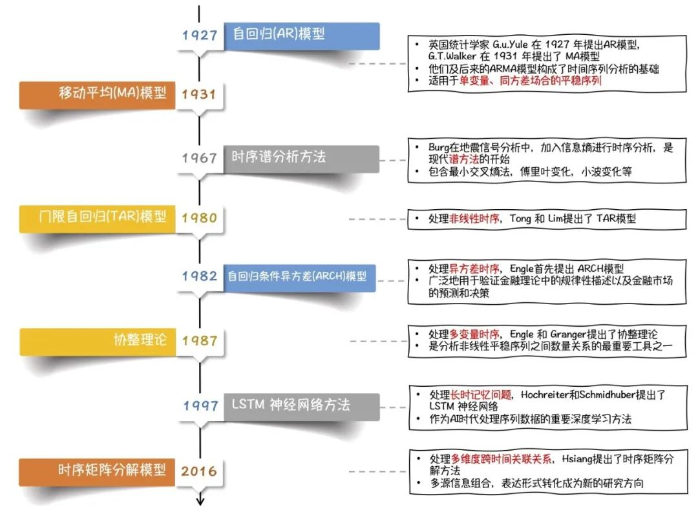
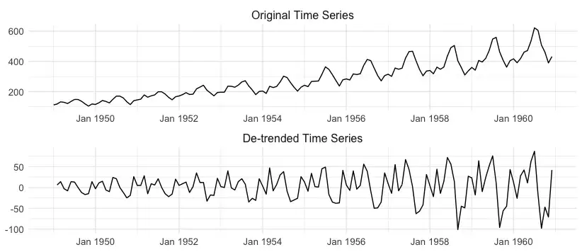
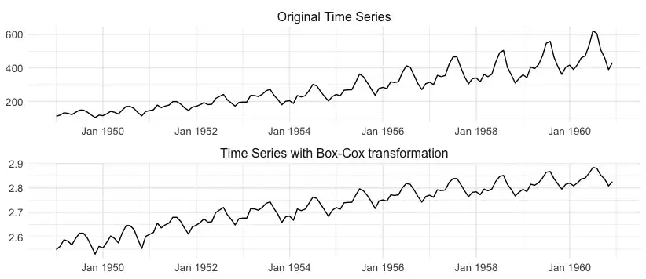
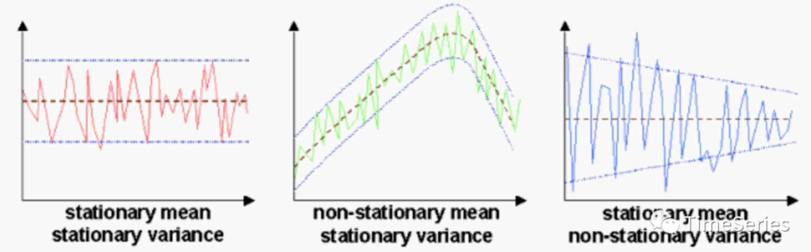

<style>
details {
    border: 1px solid #aaa;
    border-radius: 4px;
    padding: .5em .5em 0;
}
summary {
    font-weight: bold;
    margin: -.5em -.5em 0;
    padding: .5em;
}
details[open] {
    padding: .5em;
}
details[open] summary {
    border-bottom: 1px solid #aaa;
    margin-bottom: .5em;
}
</style>

<details><summary>目录</summary><p>

- [时间序列介绍](#时间序列介绍)
  - [时间序列发展历程](#时间序列发展历程)
  - [时间序列的定义](#时间序列的定义)
    - [定义](#定义)
    - [类型](#类型)
  - [时间序列的研究领域](#时间序列的研究领域)
    - [时间序列预测](#时间序列预测)
    - [时间序列异常检测](#时间序列异常检测)
    - [时间序列分类](#时间序列分类)
    - [生存分析](#生存分析)
    - [时间序列模式识别](#时间序列模式识别)
  - [时间序列数据信息](#时间序列数据信息)
    - [趋势 Trend](#趋势-trend)
    - [季节性和周期性模式 Seasonality and Cyclic Patterns](#季节性和周期性模式-seasonality-and-cyclic-patterns)
    - [残差 Residuals](#残差-residuals)
    - [平稳性 Stationarity](#平稳性-stationarity)
    - [自相关 Autocorrelation](#自相关-autocorrelation)
    - [异方差性 Heteroskedasticity](#异方差性-heteroskedasticity)
    - [规律性和间歇性 Regularity and Intermittency](#规律性和间歇性-regularity-and-intermittency)
    - [频率 Frequency](#频率-frequency)
    - [自反性 Reflexivity](#自反性-reflexivity)
    - [异常值 Outliers](#异常值-outliers)
    - [Regimes and Change Detection](#regimes-and-change-detection)
    - [维度 Dimensionality](#维度-dimensionality)
    - [X 轴和 Y 轴](#x-轴和-y-轴)
    - [起点和终点](#起点和终点)
    - [极值](#极值)
    - [转折点](#转折点)
    - [波动性](#波动性)
    - [数据与参考线对比](#数据与参考线对比)
- [时间序列平稳性](#时间序列平稳性)
  - [时间序列平稳性](#时间序列平稳性-1)
    - [严平稳](#严平稳)
    - [宽平稳](#宽平稳)
    - [严平稳与宽平稳的关系](#严平稳与宽平稳的关系)
  - [平稳时间序列](#平稳时间序列)
    - [白噪声](#白噪声)
    - [非白噪声](#非白噪声)
  - [非平稳时间序列](#非平稳时间序列)
    - [股票收盘价](#股票收盘价)
    - [随机游走](#随机游走)
    - [带漂移项的随机游走](#带漂移项的随机游走)
  - [时间序列平稳性理解](#时间序列平稳性理解)
    - [时间序列随机变量的分布](#时间序列随机变量的分布)
    - [严平稳](#严平稳-1)
    - [宽平稳](#宽平稳-1)
- [时间序列平稳性检验](#时间序列平稳性检验)
  - [图形分析方法](#图形分析方法)
    - [可视化数据](#可视化数据)
    - [可视化统计特征](#可视化统计特征)
      - [自相关系数的计算](#自相关系数的计算)
      - [自相关系数和偏相关系数计算](#自相关系数和偏相关系数计算)
  - [简单统计方法](#简单统计方法)
  - [假设检验方法](#假设检验方法)
    - [确定趋势](#确定趋势)
    - [随机趋势](#随机趋势)
    - [d 阶单整](#d-阶单整)
    - [单位根](#单位根)
- [时间序列平稳性转换](#时间序列平稳性转换)
  - [时间序列平稳性转换的目的](#时间序列平稳性转换的目的)
  - [时间序列白噪声检验](#时间序列白噪声检验)
    - [自相关图](#自相关图)
    - [Box-Pierce 检验](#box-pierce-检验)
      - [Barlett 定理](#barlett-定理)
      - [假设条件](#假设条件)
      - [检验统计量](#检验统计量)
      - [判断准则](#判断准则)
      - [示例](#示例)
    - [Ljung-Box 检验](#ljung-box-检验)
      - [假设条件](#假设条件-1)
      - [检验统计量](#检验统计量-1)
      - [判断准则](#判断准则-1)
      - [白噪声检验示例](#白噪声检验示例)
      - [非白噪声检验示例](#非白噪声检验示例)
- [时间序列分析-baseline](#时间序列分析-baseline)
  - [baseline 特点](#baseline-特点)
  - [baseline 数据](#baseline-数据)
    - [数据读取](#数据读取)
    - [数据查看](#数据查看)
  - [baseline 模型](#baseline-模型)
    - [数据转换](#数据转换)
    - [建立训练集和测试集](#建立训练集和测试集)
    - [算法](#算法)
    - [预测并评估预测结果](#预测并评估预测结果)
    - [预测结果可视化](#预测结果可视化)
- [一些经验与思考](#一些经验与思考)
- [参考资料](#参考资料)
</p></details><p></p>

# 时间序列介绍

## 时间序列发展历程

最早的时间序列分析可以追溯到 7000 年前的古埃及。古埃及人把尼罗河涨落的情况逐天记录下来，
从而构成一个时间序列。对这个时间序列长期的观察使他们发现尼罗河的涨落非常有规律，
由于掌握了涨落的规律，古埃及的农业迅速发展

一般认为现代时间序列分析起源于英国统计学家 G.u.Yule 在 1927 年提出的 AR(自回归)模型。
G.T.Walker 在 1931 年提出了 MA(移动平均)模型，
AR 模型、MA 模型与后来的 ARMA 模型，构成了时间序列分析的基础，至今仍被大量应用。
这些模型主要应用于单变量、同方差场合的平稳序列

随着时间序列分析理论的发展，人们越来越关心多变量、异方差、非线性的时间序列。
Engle 和 Granger 提出了协整理论及其方法，为多维非平稳序列的建模提供了一种途径；
Engle 首先提出 ARCH(自回归条件异方差)模型用于处理异方差的情形；
Tong 和 Lim 提出了 TAR(门限自回归)模型处理非线性时序等等。
这些方法都在往后的发展中不断革新，应用广泛，
例如很多方法被广泛地用于验证金融理论中的规律性描述以及金融市场的预测和决策

时间序列分析方法的另一个突破是在谱分析方面。给定一个时间序列样本，
通过傅里叶变换可以把时域上的数据变换到频域，即为经典谱分析方法。
Burg 在他从事的地震信号的分析与处理中提出最大熵谱，其把信息熵的概念融入信号处理中，
有时又称为时序谱分析方法，是现代谱分析的开始

随着时间序列分析的理论与应用这两方面的深入研究，时序分析应用的范围日益扩大。
目前，深度神经网络兴起，越来越多的方法采用 LSTM 进行长时序列建模与分析。
这种无参数化的方法更自动的抽取时序特征以更好的适应下游的任务。
跨时间跨维度关联分析促使矩阵方法的繁荣，寻求多源时序关联分析，
以及更结构化的时序信息表示成为现在新的研究方向



## 时间序列的定义

### 定义

时间序列(Time Series) 是一组按照时间发生先后顺序进行排列的数据点序列. 
通常一组时间序列的时间间隔为一恒定值(如 1s, 5s, 1min, 1h, 1d 等). 
因此时间序列亦可作为离散时间数据进行分析处理

按照时间的顺序把随机事件变化发展的过程记录下来就构成了一个时间序列。
在统计研究中，常用按时间顺序排列的一组随机变量 `$\{\ldots, X_{1}, X_{2}, \ldots, X_{t}, \ldots\}$` 来表示一个随机事件的序列，
间记为 `$\{X_{t}, t \in T\}$`。
用 `$\{x_{1}, x_{2}, \ldots, x_{N}\}$` 或 `$\{x_{t}, t = 1, 2, \ldots, N\}$` 表示该随机序列的 `$N$` 个有序观测值。
经常认为这些观测值序列是来自一个时间序列随机过程的有限样本，这个过程从无限远的过去开始并将持续到不确定的未来：


时间序列的每个元素都被认为是一个具有概率分布的随机变量，
这里 `$x_{1}$` 可以认为是一个随机变量的一个取值，
`$x_{2}$` 等也均是具有某种分布的随机变量的一个取值(每个变量的分布可能相同也可能不同)

比如这里有一个时间序列数据 `$\{1, 3, 5, 7, 2, 6, 9\}$`，更准确的叫法应该是一个观测值序列。
虽说这里 `$t_{t}$` 时刻只有一个取值 `$1$`，`$t_{2}$` 时刻也只有一个取值 `$3$`，
但不防认为 `$t_{1}$` 时刻对应的是一个变量 `$X_{1}$`，`$t_{2}$` 时刻对应的也是一个变量 `$X_{2}$`，
变量 `$X_{1}, X_{2}$` 可能有多个取值的同时也有它们自己的概率分布，
只是在这一次的观测中分别取值 `$1$` 和 `$3$` 而已


假如序列中每个元素的分布具有共同的参数，比如每个 `$x_{t}$` 的方差 `$Var(x_{t})$` 相同，
并且每对相邻元素之间的协方差 `$Cov(x_{t}, x_{t-1})$` 也相同。
如果对于任意 `$t \in [1, N]$`，`$x_{t}$` 的分布都相同，
则认为序列是平稳的


### 类型

在实际场景中, 不同的业务通常会对应不同类型的时间序列模式, 
一般可以划分为几种类型: 趋势性、周期性、随机性、综合性

下图中展示了几种常见的时间序列的类型: 


## 时间序列的研究领域

学术界对时间序列的研究，主体分为时序表示、时序预测、模式识别、异常检测、关联分析等几大类

### 时间序列预测

时间序列预测 Time Series Forecasting:

> 预测表示预测时间序列即将发生的观测值的数值的过程。这是一个具有挑战性的问题，
  因为它是一个外推过程，并且在估计中存在很大的不确定性。
  模型依赖于从过去的数据中得出的假设，而这些假设通常不成立

* 确定性预测
    - 提前预测许多值
* 不确定性预测(概率预测)
    - 预测特定值(点估计)有助于减少未来的不确定性。
      但是，提供合理值的区间更利于做出最佳决策。
      或者，在二元事件的情况下，事件发生的概率。
      例如，“明天有 80% 的机会下雨”这句话比简单地说“明天会下雨”更有信息量
* 极值预测
    - 能源负载峰值对于高效管理电网非常重要

时空预测 Spatio-temporal Forecasting:

> 类似于时间序列预测，但针对多个位置或轨迹

* 可以使用支持 GPS 的传感器沿多个位置捕获时间序列。
  例如，几个浮标站被放置在沿海岸测量海洋状况的不同固定位置。
  使用时空数据，目标是预测每个位置的未来值
* 时空数据背后的主要挑战之一与其带来的额外依赖性有关。
  给定位置的观测值不仅与该位置的先前观测值相关，而且与其邻居的观测值相关。
  时空依赖性的适当建模对于获得准确可靠的预测至关重要
* 有时传感器并不固定在某些位置，例如出租车车队中的 GPS 设备。
  有了这些数据，目标可以是使用历史轨迹来预测正在进行或即将到来的旅行的持续时间

超出概率预测 Exceedance Probability Forecasting:

> 预测即将到来的值是否会超过预定义的阈值


* 超出概率是一个预测问题，其目标是估计时间序列在预定义的未来时期内超过预定义阈值的概率。
  此任务在极值(分布的尾部)高度相关的领域中很重要
* 实际应用是通货膨胀率预测。如果通货膨胀率很可能超过给定百分比，
  则可能会促使中央银行提高利率。另一个例子是自然灾害，例如洪水或地震
* 通常，超出预测是二元分类问题，旨在预测超过阈值的概率。然而，非二元问题也可以根据不同的阈值来定义。
  例如，股票市场交易员可能对根据价格变动预测买入、卖出或持有信号感兴趣。
  就预测价格回报而言超过正阈值可用作买入信号；相反(预测价格回报低于负阈值)可以代表卖出触发器。
  如果未达到任何阈值，则交易者应保持当前的持有

### 时间序列异常检测

> 时间序列异常检测，Time Series Anomaly Detection，
  或 Activity Monitoring 用来及时检测需要采取行动的罕见但具有破坏性的事件

有时我们对预测感兴趣，而不是时间序列的一般行为(例如，在下一次观察中它是上升还是下降，以及各自的幅度)，
而是感兴趣的特定和罕见事件。针对此类场景的预测任务是时间序列异常检测，也称为活动监控

时间序列异常检测背后的主要目标是及时检测有趣但罕见的事件，
这些事件可能在特定应用领域具有破坏性. 这对于决策至关重要，
因为它使专业人员能够采取适当的行动来防止这些事件或减轻其后果。
因此，从机器学习的角度来看，预测模型的输出是二进制的，表示感兴趣的事件是否发生

关于活动监控有两个主要挑战。第一个隐含在及时这个词中。
该表达式意味着在发出有关即将发生的感兴趣事件的警报点与事件发生或开始的点之间存在适当的警告期。
这个时间间隔对专业人员来说至关重要，因此他们可以评估情况并决定行动方案。
第二个挑战是感兴趣的事件很少见。因此，学习这些事件背后的概念代表了一个不平衡的学习问题

这个任务有点类似于上面描述的超越预测(超越概率预测)。但是，两者之间存在重要差异。
超出预测通常(但不一定)与个别时间序列有关。另一方面，时间序列异常检测通常涉及随着时间的推移监视多个实体，
这些实体可能会或可能不会经历感兴趣的事件。此外，在时间序列异常检测中，
事件是任意定义的，并不特定于超过特定阈值，尽管可能是这种情况

### 时间序列分类

> 时间序列分类 Time Series Classification 用来将时间序列分类为预定义的类

时间序列分类是将类别分配给时间序列的过程。这个问题类似于传统的分类，但属性是按时间排序的

时间序列分类与上述经典时间序列预测任务有两个重要区别: 

* 首先，它代表分类任务，而预测通常是回归问题
* 其次，在时间序列分类中，每个观察值都是独立于其他时间序列的独立时间序列(通常是单变量和数字)。
  在预测的情况下，每个观察值都是更大时间序列的子序列，并且观察值之间存在一定程度的依赖性

有时目标是在不牺牲性能的情况下尽早对时间序列进行分类，这代表了早期的时间序列分类任务。
每次测量可能代价高昂，或者尽快采取行动可能很重要。这导致了权衡，因为更少的观察通常会导致更差的性能

### 生存分析

> 生存分析 Survival Analysis 用来预测感兴趣事件发生的时间

关于生存分析的文章如下：

* [生存分析（一）生存分析方法，你听说过几种？](https://mp.weixin.qq.com/s/XhJu7gf7culpg_Jm3SyL8A)
* [生存分析（二）中位生存时间和中位随访时间](https://mp.weixin.qq.com/s/XotdvhLa0-nA3T01MdA-ww)
* [生存分析（三）log-rank检验在什么情况下失效？](https://mp.weixin.qq.com/s/Y1kiLLMxC2m8rznPuE1lIQ)
* [生存分析（四）我们的生命，能否如指数分布般平稳？](https://mp.weixin.qq.com/s/MVACRInTAbiHlpE8y5XmBg)
* [生存分析（五）实用的（却又被忽略的）Weibull回归](https://mp.weixin.qq.com/s/7J_bEYpRsmLN8tS8G4h4BQ)
* [生存分析（六）如何判断你的生存数据能否用cox回归——等比例风险假定判断](https://mp.weixin.qq.com/s/aYE9KC5-0RSW1mmMuQrCxA)
* [生存分析（七）什么是时依协变量（兼谈分层Cox回归）](https://mp.weixin.qq.com/s/NaAtnAQ9x3-fVCKrsYc69g)

生存分析背后的目标是预测感兴趣事件发生的时间。
这个问题通常与随着时间的推移观察到一组实体(例如人、设备)的领域有关。
示例应用程序包括犯罪学(预测再犯的时间)、
工程可靠性(预测设备故障的时间)或客户管理(预测客户流失的时间)。

生存分析问题的主要挑战是观察经常被审查——关于某些实体的信息仅部分可用。
这可能是因为实体可能在事件发生之前停止被观察

### 时间序列模式识别

还有其他时间序列任务，其主要目标是知识发现。这些本质上不是预测性的，但仍然非常相关。
它们提供有关时间序列的重要信息，并可用作预测任务的子任务。
该类问题旨在对时间序列各种形式的信息进行处理和分析，
以对事物或现象进行描述、辨认、分类和解释的过程

时间序列聚类(Time Series Clustering):

* 在时间序列中，聚类表示找到彼此相似但不同于其他时间序列组的时间序列组的过程。
  聚类可用于查找完整时间序列的组(全序列聚类)或查找较大时间序列中的子序列组(子序列聚类)

摘要(Summarisation)：

* 有时时间序列非常长，难以处理。因此，通常会进行摘要以降低其维度，同时仍保留基本结构

主题发现(Motif Discovery)：

* 在时间序列中，主题代表重复出现的模式——时间序列的子序列，随着时间的推移大致重复

时间序列表示：

* 该类问题旨在抽取时序数据的特征，以某些特定的形式进行表达，是时间序列研究的基础问题。
  常见的有统计特征(最大最小值、均值、分位数，方差等指标)，熵特征等。
  近年来的针对序列数据的深度学习神经网络，也是通过记忆参数对时序进行表示学习的一种方法
* [时序转化为图用于可解释可推理的异常检测](https://mp.weixin.qq.com/s?__biz=Mzg3NDUwNTM3MA==&mid=2247483863&idx=1&sn=db7a9e15385c8f34bba86b442c5f5f67&chksm=cecef422f9b97d34b9968291a332157524cb9a789452a06673e703b6891971206f0ca58f2178&scene=21#wechat_redirect)

时间序列关联分析：

* 该类问题多出现在多维时间序列中，旨在发现不同时序之间的相似点或关联点，
  或同时序不同时间位置的关联点。常见的有周期分析，季节分析，波形联动分析，时间关联性等问题

## 时间序列数据信息

### 趋势 Trend

趋势是时间序列的基本组成部分之一。它表示数据均值的长期变化，如图 1 所示。
此图显示了一个示例时间序列，表示一家航空公司随时间变化的每月乘客数量。
时间序列的平均水平随时间增加，代表明显的上升趋势

一些学习算法难以处理时间序列的趋势分量。因此，通常建议将其删除以获得时间序列的最佳建模。
您可以使用差分运算来执行此操作。差分只是意味着取当前观察值与前一个观察值之间的差值。
图 2 为差分去除趋势后的航空旅客时间序列；在此过程之后，系列的平均水平变得稳定




### 季节性和周期性模式 Seasonality and Cyclic Patterns

如果时间序列在固定时期（例如每个月）经历有规律且可预测的变化，则它具有季节性成分。
航空旅客时间序列显示出每月的季节性，这从反复振荡中可以明显看出

与趋势类似，季节性成分也打破了平稳性，通常建议将其删除。
也可以通过差分来做到这一点，但不是从当前观察值中减去先前值，而是从同一季节中减去先前观察值

季节性差异减轻了可预测的波动，这也稳定了序列的平均水平。
去除季节性成分后，时间序列称为 季节性调整的(seasonal adjusted)

除了季节性影响之外，时间序列还可以通过其他没有固定周期的可预测振荡来表征。
这种类型的变化是一种循环模式。循环模式的典型例子是经济周期，其中经济经历增长期和衰退期

### 残差 Residuals

从时间序列中去除上述三个成分（趋势、季节性、循环模式）后，
剩下的部分称为不规则成分或残差。下图显示了一个示例。
残差不能用任何趋势、季节性或周期性行为来解释，
但仍然会对时间序列的动态产生影响


### 平稳性 Stationarity

趋势或季节性等因素打破了时间序列的平稳性。
如果时间序列的属性不依赖于观察数据的时间，则时间序列是平稳的

更正式地说，如果均值或方差没有系统性变化，
并且周期性变化已被移除，则时间序列被认为是平稳的

许多时间序列技术在时间序列是平稳的假设下工作。
如果不是，则使用差分等操作使其平稳

### 自相关 Autocorrelation

时间序列的概念意味着在某种程度上依赖于历史数据——我们今天观察到的东西取决于过去发生的事情。
时间序列的自相关根据每个观察值与其过去值的相关性来量化这种依赖性。
此属性提供有关该系列的重要结构信息。如果一个时间序列在所有滞后上都显示出低自相关性，
则它被称为白噪声

### 异方差性 Heteroskedasticity

如果时间序列的方差不是恒定的并且随时间变化，则称时间序列是异方差的，而不是同方差的。
在航空旅客示例中，很明显数据的可变性随时间增加。这种方差变化与数据平均水平的变化同时发生是很常见的——对于更高的平均值，
方差通常更高。异方差性在数据建模过程中提出了一个问题，并且有一些方法可以解决它。
幂变换，例如取对数，或者更一般地说，Box-Cox 变换，通常用于稳定方差。下图显示了将 Box-Cox 方法应用于时间序列的示例



### 规律性和间歇性 Regularity and Intermittency

时间序列通常以有规律的时间间隔收集，例如，每天或每小时。这些被称为规则时间序列，
大多数时间序列方法都在规则假设下工作。然而，有许多应用程序的时间序列本质上是不规则的。
例如自然灾害（如地震）或特定零售产品的销售，这些事件以不规则的时间间隔发生

通常对时间序列的不规则性进行插值处理，使序列具有规律性。例如，
与产品销售相关的时间序列可以转换为某个时期的销售计数（例如每小时产品销售）。
此插值过程可能会导致稀疏或间歇的时间序列，其中有多个观测值以常数零作为值（例如，在给定的小时内没有产品销售）。
这种间歇性是库存计划时间序列预测中的一个常见障碍，其中某些产品销售不频繁

### 频率 Frequency

时间序列的采样频率表示收集它的规律性，例如每天或每月。
具有不同频率的时间序列带来不同的挑战。
]对于更高频率的时间序列，季节性成分可能更难捕获。
每日或次日时间序列通常包含多个季节性模式，捕捉起来并非易事

使用低频时间序列在季节性方面更简单。但是，可能还有其他问题需要考虑。
相对于高频数据集，低频数据集通常包含较小的样本量。经典的时间序列模型，
例如 ARIMA 或指数平滑，可以很好地处理这个问题，因为它们的参数数量很少。
具有更多参数的学习算法可能容易过度拟合

### 自反性 Reflexivity

如果预测影响事件的展开，则时间序列是自反的。自反时间序列的经典示例是股票市场数据。
预测股价上涨会吸引投资者，从而创造需求并推动股价上涨。然后预测是自我实现的。
另一方面，由于投资者的恐慌，对市场崩盘的预测本身可能会导致市场崩盘。
还有自我挫败的反身系统，其中预测给定事件会降低它的可能性。

自反性可能会导致意想不到的后果。从业者应该确定它如何在他们的时间序列中出现，
并以某种方式将响应纳入他们的预测系统

### 异常值 Outliers

离群值或异常是与其他观察结果有显着偏差的罕见事件。这些实例对于所有类型的数据都是通用的，
而不仅仅是时间序列。尽管如此，在时间序列中，由于观察之间的时间依赖性，异常值构成了额外的挑战

时间序列异常值可能仅出现在单个实例中（点异常值），或跨越多个时间步长（子序列异常值）。
在搜索异常时考虑上下文通常很重要。例如，0º 的温度在冬天可能很常见，但在夏天却异常

处理异常值的最合适方法取决于它们的性质。由于错误的数据收集或传感器故障，可能会出现异常值。
这种异常值代表不需要的数据，这些数据不遵循生成观察值的分布。然而，时间序列异常值本身就是感兴趣的事件。
这方面的例子包括股市崩盘或欺诈检测，其目标是预测或减轻这些罕见事件的影响

### Regimes and Change Detection

当时间序列的分布发生变化时，就会发生变化点，也称为概念漂移。
变化可以重复发生；一个时间序列可能具有不同的制度或概念，
并且数据分布在这些制度中发生变化。机制转换模型是解决此类问题的常用方法

变化也可以是永久性的。这些被称为结构中断。这些变化对学习算法提出了挑战，
学习算法必须能够检测到它们并及时做出相应调整

重要的是不要将变化检测与异常值检测混淆。
第一个是关于检测管理时间序列的制度的变化。
当制度改变时，观测值的分布也会相应改变。另一方面，
离群值表示明显偏离典型行为的观察（或观察的子序列），
其中典型行为的特征在于当前的潜在制度

### 维度 Dimensionality

维度表示变量数。因此，这些时间序列被称为单变量。
然而，有时时间序列包含额外的维度，
因此被称为多元时间序列。在对时间序列的特定目标变量建模时，
多元时间序列中的附加变量可以用作解释变量

### X 轴和 Y 轴

任何图表观察都要从图表元素开始，时间序列图也不会例外。
通过观察两个坐标轴，能知道以下信息，但也别忘了其他图表元素：

* 数据的时间范围有多长
* 数据颗粒度有多细(小时、天、周、月等)
* 指标的大小如何(最大值、最小值、单位等)

### 起点和终点

观察时间序列的起点和终点，在不观察细节的情况下，就能大体知道总体趋势是怎么走的。
比如：如果起点与终点数值差不多，那么知道，不管中间指标变化多么波澜壮阔，
至少一头一尾说明忙活了很长时间后指标是在原地踏步

### 极值

极值就是序列中比较大的值和比较小的值，当然包括最大值和最小值。
极值的观察是确定数据阶段的重要依据

### 转折点

转折点往往有两类:

* 一类是绝对数值的转折点，一般就是指最大值和最小值
* 另一类是波动信息的转折点。例如:
    - 在该点前后的波动幅度差别显著
    - 在该点前后波动周期有差别
    - 在该点前后数据的正负值出现变化等

### 波动性

在某些阶段，数值波动剧烈；某些阶段则平稳。这也是在观察中需要注意的信息。
从统计学的角度分析，方差大的阶段，往往涵盖的信息较多，需要更加关注

### 数据与参考线对比

参考线有许多，例如均值线、均值加减标准差线、KPI 目标线、移动平均线等。
每种参考线都有分析意义，但需要注意顺序，建议先对比均值线，然后是移动平均线，
之后才是各种自定义的参考线


# 时间序列平稳性

> 时间序列分析中的许多方法，如 ARMA、ARIMA、Granger 因果检验等时序预测和分析方法，
> 都需要时间序列具备平稳性。那么什么是时间序列的平稳性呢？
> 什么序列是平稳时间序列，什么序列又是非平稳时间序列？

## 时间序列平稳性

时间序列的平稳性是指在一组时间数据看起来平坦，
各阶统计特性，如：均值、方差、协方差等不随时间时间的变化而变化。
其数学定义又分为严平稳和宽平稳

### 严平稳

给定随机过程 `$X(t), t \in T$`，如果对任意 `$n \geq 1$`，
`$t_{1}, t_{2}, \ldots, t_{n} \in T$` 和实数 `$\tau$`，
当 `$t_{1+\tau}, t_{2+\tau}, \ldots, t_{n+\tau}$` 时，
随机变量 `$(X(t_{1}), X(t_{2}), \ldots, X(t_{n}))$` 与 
`$(X(t_{1+\tau}), X(t_{2+\tau}), \ldots, X(t_{n+\tau}))$` 有相同的联合分布函数。
即 

`$$F_{t_{1}, t_{2}, \ldots, t_{n}}(x_{1}, x_{2}, \ldots, x_{m})=F_{t_{1+\tau}, t_{2+\tau}, \ldots, t_{n+\tau}}(x_{1}, x_{2}, \ldots, x_{m})$$`

则称随机过程 `$X_{t}, t \in T$` 是严平稳过程

简单点来说严平稳是一种条件比较苛刻的平稳性定义，
它认为只有当序列所有的统计性质都不会随着时间的推移而发生变化时，该序列才能被认为平稳

### 宽平稳

假定某个时间序列是由某一随机过程生成的，如果满足下列条件：

1. 均值 `$E(X_{t}) = \mu$` 是与时间 `$t$` 无关的常数
2. 方差 `$Var(X_{t}) = \sigma^{2}$` 是与时间无关的常数
3. 协方差 `$Cov(X_{t}, X_{t+k}) = \gamma_{k}$` 是只与时间间隔 `$k$` 有关，与时间 `$t$` 无关的常数

则该时间序列是宽平稳的，该随机过程是平稳随机过程

平稳性的定义在不同文章中描述略有不同，但它们的意思都是一样的。
比如一些定义中会强调二阶矩存在，而当前的这个定义中没有强调，
原因在于均值、方差为常数既已表示一阶矩、二阶矩存在

宽平稳序列具有均值、方差和自相关结构不随时间变化的特性。
简单理解就是一个看起来平坦的序列，没有趋势，随时间变化的方差不变，
随时间变化的自相关结构不变，也没有定期波动(季节性)


### 严平稳与宽平稳的关系

严平稳比宽平稳的要求更严格，但两者并没有包含关系

* 通常情况下，低阶矩存在的严平稳能推出宽平稳成立，而宽平稳序列不能反推严平稳成立
* 即便严平稳也不一定宽平稳。不存在低阶矩的严平稳序列不满足宽平稳条件，
  例如服从柯西分布的严平稳序列就不是宽平稳序列(柯西分布的一阶矩、二阶矩都不存在)
* 当序列服从多元正态分布时，宽平稳可以推出严平稳。
  因为正态过程的概率密度是由均值函数和自相关函数完全确定的，
  宽平稳则均值函数和自相关函数不随时间的推移而变化，
  那么正态过程的概率密度函数也就不会随时间的推移而变化，
  所以说一个宽平稳的正态过程必定是严平稳的


> * 宽平稳，因其定义，又叫二阶平稳，或者协方差平稳
> * 平稳序列，一般是指宽平稳序列，也称弱平稳序列
> * 严平稳序列，也可以叫做强平稳序列

## 平稳时间序列

### 白噪声

一种最简单的平稳时间序列就是白噪声，白噪声时间序列是具有零均值、同方差的独立同分布序列，
记作 `$\{\varepsilon_{t}\}$`。当 `$\varepsilon_{t}$` 服从均值为 0 的正态分布时，
称 `$\{\varepsilon_{t}\}$` 为高斯白噪声或正态白噪声

对于任意 `$t \in T$`，`$X_{t}$` 均值相同、方差相同，独立则协方差为 0，所以白噪声序列是平稳的

```python
import numpy as np
import matplotlib.pyplot as plt

# 白噪声序列
white_noise = np.random.standard_normal(size = 1000)

# plot
plt.figure(figsize = (12, 6))
plt.plot(white_noise)
plt.show()
```


当一个序列为白噪声时，表示序列前后没有任何相关关系。过去的行为对将来的发展没有丝毫影响，
从统计分析的角度而言，已没有任何分析建模的价值。未来的趋势亦无法预测，
因为白噪声的取值是完全随机的。此时未来预测为均值就是残差最小的选择。
**只有当序列平稳且非白噪声时，应用 ARMA 等分析方法才有意义**

通常在对时间序列建模之后，还会对残差序列进行白噪声检验，
如果残差序列是白噪声，那么就说明原序列中所有有价值的信息已经被模型所提取，
如果非白噪声就要检查模型的合理性了


### 非白噪声

平稳时间序列可不止白噪声，生活中也会有平稳的时间序列，但却是很少。
很多序列是可以经过简单处理后变为平稳的非白噪声序列

```python
# 我国06年以来的季度GDP数据季节差分后，就可以认为是一个平稳的时间序列
import numpy as np
import pandas as pd
import akshare as ak
import matplotlib.pyplot as plt
import matplotlib as mpl

font_name = ["Arial Unicode MS"]
mpl.rcParams["font.sans-serif"] = font_name
mpl.rcParams["axes.unicode_minus"] = False


# data
df = ak.macro_china_gdp()
df = df.set_index("季度")
df.index = pd.to_datetime(df.index)
print(df.head())
print(df.shape)

# 原始数据
gdp = df["国内生产总值-绝对值"][::-1].astype("float")
print(gdp)
# 差分
gdp_diff = gdp.diff(4)
print(gdp_diff)

plt.figure(figsize = (12, 6))
gdp_diff.plot()
plt.show()

```


## 非平稳时间序列

大多数时间序列都是非平稳的，一般可以通过差分、取对数等方法转化成平稳时间序列，
若不成就不能使用平稳时间序列分析方法了。虽说还有各种非平稳时间序列的分析方法，
预测好坏看各家本领，但终归不如平稳时间序列分析来的省心

### 股票收盘价

比如一些股票的收盘价数据就是非平稳的。下图是 2019～2021 年来伊份的每日收盘价数据，
整体看上去走势无明显规律，且不同时段波动不一，就可以认为是一个非平稳的时间序列。
若平稳且不是白噪声多好啊

```python
import pandas as pd
import akshare as ak
from matplotlib.pyplot as plt

# data
df = ak.stock_zh_a_hist(
    symbol = "603777",
    start_date = "20190101",
    end_date = "20210616",
)
df = df.set_index("日期")
df.index = pd.to_datetime(df.index)
close = df["收盘"].astype(float)
close = close[::-1]

# plot
plt.figure(figszie = (12, 6))
plt.plot(close)
plt.show()
```


### 随机游走

有一类特殊的非平稳时间序列叫随机游走，很简单，也很有意思。
一个简单随机游走过程定义为：

`$$y_{t} = y_{t-1} + \epsilon_{t}$$`

其中:

* `$\epsilon_{t}$` 是均值为 0 的白噪声

```python
import numpy as np
import matplotlib.pyplot as plt

y = np.random.standard_normal(size = 1000)
y = np.cumsum(y)

plt.figure(figsize = (12, 6))
plt.plot(y)
plt.show()
```


```python
import numpy as np
import matplotlib.pyplot as plt

np.random.seed(5)

def random_walk():
    steps = np.random.standard_normal(size = 1000)
    steps[0] = 0
    walk = np.cumsum(steps)

    return walk

plt.figure(figsize = (12, 6))
plt.plot(random_walk())
plt.plot(random_walk())
plt.show()
```


金融领域中有个概念叫有效市场假说，就认为股票的价格是随机游走的，
也就是说我们刚刚举的那个上证指数的例子就是随机游走的。
以上随机游走的示例图和之前的股价数据走势图比较一下，是不是有点那么个意思

一个随机游走过程对过去发生的信息具有完美的记忆，如醉汉走路，
每一步都是在上一步的位置上胡乱的走，故而能够积累起点以来的每一步信息。
初起离家，偶有归时，不知所终。均值为零，方差无限大

生活中还有一个现象和随机游走有关，叫“久赌必输”。每次赌博时输赢总是不确定的(假设胜率50%，胜负五五开)，
每次赌博的输赢作为一个随机变量，可以认为是步长，手里的钱数会随着每次输赢而变化，
故而赌博时手中的钱服从随机游走模型。手中累积的钱数走势就像上图中的曲线，但却不会一直延展下去。
当曲线触碰到下届时(手中的钱输光时)，游戏也就结束了；
或当曲线触碰到上界时(庄家的钱没有了，贪心到赢钱停不下来要一直赢下去)，
游戏同样也会结束。庄家的钱无限多，则必然是赌徒输光。庄家的钱再少，也比赌徒的本金多的多。
所以上界不知在哪，下界却很清晰，曲线游走到上界的概率几乎为零，输光的终归是赌徒，更别提胜率往往不足 50%

### 带漂移项的随机游走

带漂移的随机游走，就是随机游走中加入一个常数，如此而已：

`$$y_{t} = c + y_{t-1} + \epsilon_{t}$$`

其中：

* `$c$` 是常数，称作位移项或漂移项

漂移项使得随机游走序列产生了长期趋势，长期趋势的斜率对应漂移项，
漂移项为正，则有增长趋势，漂移项为负，则有下降趋势

```python
import numpy as np
import matploblib.pyplot as plt

np.random.seed(123)

y = np.random.standard_normal(size = 1000)
y1 = np.cumsum(0.2 + y)
y2 = np.cumsum(-0.2 + y)
l1 = np.cumsum(0.2 * np.ones(len(y1)))
l2 = np.cumsum(-0.2 * np.ones(len(y2)))

plt.figure(figsize = (12, 6))
plt.plot(y1)
plt.plot(y2)
plt.plot(l1)
plt.plot(l2)
plt.show()
```


无论是简单随机游走，还是带漂移项的随机游走，都可以通过差分的方式转换为纯随机的平稳时间序列--白噪声

随机游走的一阶差分即为白噪声：

`$$y_{t} - y_{t-1} = \epsilon_{t}$$`

带漂移项的随机游走一阶差分为白噪声加上常数：

`$$y_{t} - y_{t-1} = c + \epsilon_{t}$$`

所以说随机游走过程和白噪声一样也是无法预测的，既然无法根据历史走势预测未来趋势，
那是否能够从其他维度信息中解释历史时序中的取值，从而能够用同样的逻辑预测未来的值，
只有实践才能知道

## 时间序列平稳性理解

为什么这么多方法都要强调时间序列的平稳性？要求平稳性的最终目标无非就是希望能够更好更准确的预测未来。
非平稳时间序列太过杂乱无章，有的甚至完全无规律可循，而平稳时间序列本身存在某种分布规律，
前后具有一定自相关性且能够延续下去，进而可以利用这些信息帮助预测未来。
那时间序列的平稳性具体又是如何帮助预测未来的，平稳性又如何怎么理解呢？

### 时间序列随机变量的分布

时间序列 `$\{\ldots, X_{1}, X_{2}, \ldots, X_{t}, \ldots\}$` 中每个时刻 `$t$` 都可以认为是一个随机变量，
它们都有自己的分布。时间不能倒流，时刻 `$t$` 的取值也不能进行反复观测，
因而每个随机变量 `$X_{t}$` 就只有一个观测值。这样一来，每个分布也就只有一个观测值，
数目太少，无法研究分布的性质。但是通过平稳性，从不同时刻的分布之间发现内在关联，
可以缓解由于样本容量少导致的估计精度低的问题

先做一个无理假设，假设时间序列中的每个随机变量的分布相同(随机变量的分布不随时间 `$t$` 的变化而变化)，
那么对于这个分布我也可以说得到了 `$N$` 个观测值。有了多个观测值之后，就可以统计这个分布的特性了。
如此一来 `$X_{N+1}$` 的具体分布也就知道了

### 严平稳

其实强平稳定义更甚，要求任意连续 `$k, k \in [1, N]$` 个随机变量的联合分布不变，
即联合分布只与随机变量的个数有关，不随时间的推移而变化。序列中每个随机变量的分布相同不一定是严平稳。
但若序列中每个随机变量独立同分布的话，则这个序列一定是严平稳序列，而且还是白噪声

虽然根据历史数据知道了 `$X_{N+1}$` 数据分布情况，其实也就只能知道均值、方差这些个统计特征，
但是具体 `$t_{N+1}$` 时刻的取值还是无法确定

现实中的时间序列数据，我们无法知道这些随机变量的分布到底长什么样子。我们观测得到的数据，
只是服从某种未知分布的随机变量的一种取值。既然连单个随机变量的分布都难以求出，
就更不用说求由一堆随机变量组成的多维随机向量的联合分布有多困难了。
所以说严平稳终归太过于理想化，实际上很难检验一个时间序列的严平稳性

### 宽平稳

那我们就放宽些条件，不在局限于严平稳，着眼于宽平稳：

1. 均值 `$E(X_{t}) = \mu$` 是与时间 `$t$` 无关的常数
2. 方差 `$Var(X_{t}) = \sigma^{2}$` 是与时间无关的常数
3. 协方差 `$Cov(X_{t}, X_{t+k}) = \gamma_{k}$` 是只与时间间隔 `$k$` 有关，与时间 `$t$` 无关的常数



第1)、2)条，均值恒定、方差恒定，还是 `$X_{t}$` 限制变量的分布，围绕某一均值上下波动，且波动幅度前后一致。
到这里，还是可以用均值来预测。第3)条约束协方差，是希望不仅 `$X_{t}$` 的整体分布不随着时间变化，
而且的条件概率分布也不随着时间变化，这样才能用以前的值来预测未来的值

比如：`$X_{t}$` 受前一时刻 `$X_{t-1}$` 的影响，且前后影响程度不随时间变化：

`$$\begin{cases}
Cov(X_{t}, X_{t-1}) = \gamma \\
Cov(X_{t+1}, X_{t}) = \gamma, (\gamma \neq 0)
\end{cases}$$`

对 `$Cov(X_{t+1}, X_{t}) = \gamma, (\gamma \neq 0)$` 变换得到：

`$$\frac{1}{n-1}\sum_{i=1}^{n}(X_{t+1}^{i} - \bar{X}_{t})(X_{t}^{i} - \bar{X_{t}}) = \gamma$$`

`$$\sum_{i=1}^{n}(X_{t+1}^{i} - \bar{X}_{t+1})(X_{t}^{i} - \bar{X}_{t}) = (n-1)\gamma$$`

`$$\sum_{i=1}^{n}(X_{t+1}^{i} - \mu)(X_{t}^{i} - \mu) = (n-1)\gamma$$`

`$$(x_{t+1} - \mu)(x_{t} - \mu) = \gamma$$`

则：

`$$x_{t+1} = \frac{\gamma}{x_{t} - \mu} + \mu$$`

那么将 `$t+1$` 时刻的取值预测为 `$\frac{\gamma}{x_{t} - \mu} + \mu$`，
而非均值 `$\mu$`，就显得更准确一些。但是当协方差为 0 的时候，`$x_{t+1} = \mu$` 就变为了一个白噪声过程。
白噪声过程也是平稳的，但是却不可预测，其均值虽恒定，但具体取值却是完全随机

综上，当时间序列具备了平稳性后(且非白噪声)，预测序列相对容易，预测结果也会相对更可靠一些

# 时间序列平稳性检验

时间序列平稳性检验方法，可分为三类：

* 图形分析方法
* 简单统计方法
* 假设检验方法

## 图形分析方法

### 可视化数据

图形分析方法是一种最基本、最简单直接的方法，即绘制图形，肉眼判断。
可直接可视化时间序列数据，也可以可视化时间序列的统计特征

可视化数据即绘制时间序列的折线图，看曲线是否围绕某一数值上下波动(判断均值是否稳定)，
看曲线上下波动幅度变化大不大(判断方差是否稳定)，
看曲线不同时间段波动的频率(~紧凑程度)变化大不大(判断协方差是否稳定)，
以此来判断时间序列是否是平稳的

```python
import numpy as np
import pandas as pd
import akshare as ak
from matplotlib import pyplot as plt

np.random.seed(123)

# -------------- 准备数据 --------------
# 白噪声
white_noise = np.random.standard_normal(size=1000)

# 随机游走
x = np.random.standard_normal(size=1000)
random_walk = np.cumsum(x)

# GDP
df = ak.macro_china_gdp()
df = df.set_index('季度')
df.index = pd.to_datetime(df.index)
gdp = df['国内生产总值-绝对值'][::-1].astype('float')

# GDP DIFF
gdp_diff = gdp.diff(4).dropna()

# -------------- 绘制图形 --------------
fig, ax = plt.subplots(2, 2)

ax[0][0].plot(white_noise)
ax[0][0].set_title('white_noise')

ax[0][1].plot(random_walk)
ax[0][1].set_title('random_walk')

ax[1][0].plot(gdp)
ax[1][0].set_title('gdp')

ax[1][1].plot(gdp_diff)
ax[1][1].set_title('gdp_diff')

plt.show()
```


1. 白噪声，曲线围绕0值上下波动，波动幅度前后、上下一致，为平稳序列
2. 随机游走，曲线无确定趋势，均值、方差波动较大，非平稳序列
3. GDP 数据趋势上升，均值随时间增加，非平稳序列
4. GDP 季节差分后数据，曲线大致在一条水平线上上下波动，波动幅度前后变化较小，可认为是平稳的

### 可视化统计特征

可视化统计特征，是指绘制时间序列的自相关图和偏自相关图，根据自相关图的表现来判断序列是否平稳

自相关，也叫做序列相关，是一个信号与自身不同时间点的相关度，
或者说与自身的延迟拷贝或滞后的相关性，是延迟的函数。不同滞后期得到的自相关系数，叫自相关图。
这里有一个默认假设，即序列是平稳的，平稳序列的自相关性只和时间间隔k有关，
不随时间t的变化而变化，因而可以称自相关函数是延迟(k)的函数

* 平稳序列通常具有短期相关性，对于平稳的时间序列，
  自相关系数往往会迅速退化到零(滞后期越短相关性越高，滞后期为 0 时，相关性为 1)
* 对于非平稳的数据，退化会发生得更慢，或存在先减后增或者周期性的波动等变动

自相关的计算公式为根据滞后期 `$k$` 将序列拆分成等长的两个序列，
计算这两个序列的相关性得到滞后期为 `$k$` 时的自相关性。

#### 自相关系数的计算

`$$X = [2, 3, 4, 3, 8, 7]$$`
`$$A = [2, 3, 4, 3, 8]$$`
`$$B = [3, 4, 3, 8, 7]$$`

均值:

`$$\bar{X} = \sum_{i=1}^{6}X_{i} = 4.5$$`

方差:

`$$\sigma^{2}(X) = \sum_{i=1}^{6}(X_{i} - \bar{X})(X_{i} - \bar{X}) = 4.916$$`

`$A$` 与 `$B$` 的相关系数:

`$$r(1) = \frac{1}{5}\sum_{i=1}^{5}(A_{i} - \bar{X})(B_{i} - \bar{X}) = 1.75$$`

自相关系数:

`$$ACF(1) = \frac{r(1)}{\sigma^{2}(X)} = \frac{1.75}{4.91666667} = 0.3559322$$`

```python
import statsmodels.api as sm

X = [2, 3, 4, 3, 8, 7]
print(sm.tsa.stattools.acf(X, nlags = 1, adjusted = True))
[1, 0.3559322]
```

根据 ACF 求出滞后 `$k$` 自相关系数时，实际上得到并不是 `$X(t)$` 与 `$X(t-k)$` 之间单纯的相关关系。
因为 `$X(t)$` 同时还会受到中间 `$k-1$` 个随机变量 `$X(t-1), X(t-2), \ldots, X(t-k+1)$` 的影响，
而这 `$k-1$` 个随机变量又都和 `$X(t-k)$` 具有相关关系，
所以自相关系数里面实际掺杂了其他变量对 `$X(t)$` 与 `$X(t-k)$` 的影响

在剔除了中间 `$k-1$` 个随机变量 `$X(t-1), X(t-2), \ldots, X(t-k+1)$` 的干扰之后，
`$X(t-k)$` 对 `$X(t)$` 影响的相关程度，叫偏自相关系数。不同滞后期得到的偏自相关系数，叫偏自相关图

#### 自相关系数和偏相关系数计算

```python
import numpy as np
import pandas as pd
import akshare as ak
from matplotlib import pyplot as plt
from statsmodels.graphics.tsaplots import plot_acf, plot_pacf

np.random.seed(123)

# -------------- 准备数据 --------------
# 白噪声
white_noise = np.random.standard_normal(size=1000)

# 随机游走
x = np.random.standard_normal(size=1000)
random_walk = np.cumsum(x)

# GDP
df = ak.macro_china_gdp()
df = df.set_index('季度')
df.index = pd.to_datetime(df.index)
gdp = df['国内生产总值-绝对值'][::-1].astype('float')

# GDP DIFF
gdp_diff = gdp.diff(4).dropna()

# -------------- 绘制图形 --------------
fig, ax = plt.subplots(4, 2)
fig.subplots_adjust(hspace = 0.5)

plot_acf(white_noise, ax = ax[0][0])
ax[0][0].set_title('ACF(white_noise)')
plot_pacf(white_noise, ax = ax[0][1])
ax[0][1].set_title('PACF(white_noise)')

plot_acf(random_walk, ax = ax[1][0])
ax[1][0].set_title('ACF(random_walk)')
plot_pacf(random_walk, ax = ax[1][1])
ax[1][1].set_title('PACF(random_walk)')

plot_acf(gdp, ax = ax[2][0])
ax[2][0].set_title('ACF(gdp)')
plot_pacf(gdp, ax = ax[2][1])
ax[2][1].set_title('PACF(gdp)')

plot_acf(gdp_diff, ax = ax[3][0])
ax[3][0].set_title('ACF(gdp_diff)')
plot_pacf(gdp_diff, ax = ax[3][1])
ax[3][1].set_title('PACF(gdp_diff)')

plt.show()
```


1. 白噪声的自相关系数很快就衰减到 0 附近，是明显的平稳序列
    - 滞后期为 0 时自相关系数和偏自相关系数其实就是序列自己和自己的相关性，故为1；
      滞后期为 1 时，自相关系数为 0，表示白噪声无自相关性
2. 随机游走，自相关系数下降非常缓慢，故为非平稳序列；另从偏自相关系数中可以看到随机游走只和前一项有关
3. GDP 数据的自相关图中也可以看到存在一定的周期性，滞后 4、8、12 等自相关系数较大下降较慢，
   差分后下降多一些起到一定效果，认为差分后序列是平稳的。同可视化数据一样，直观判断带有较强主观性，
   但能让我们对数据有更直观的认识

## 简单统计方法

宽平稳中有两个条件是均值不变和方差不变，可视化数据中我们可以直观看出来，其实还可以具体计算一下看看。
很有意思的逻辑，直接将序列前后拆分成 2 个序列，分别计算这 2 个序列的均值、方差，对比看是否差异明显。
其实很多时序异常检验也是基于这种思想，前后分布一致则无异常，否则存在异常或突变

```python
import numpy as np

np.random.seed(123)

# 白噪声
white_noise = np.random.standard_normal(size = 1000)
# 随机游走
x = np.random.standard_normal(size = 1000)
random_walk = np.cumsum(x)

def describe(X):
    split = int(len(X) / 2)
    X1, X2 = X[0:split], X[split:]
    mean1, mean2 = X1.mean(), X2.mean()
    var1, var2 = X1.var(), X2.var()
    print(f"mean1 = {mean1}, mean2 = {mean2}")
    print(f"variance1 = {var1}, variance2 = {var2}")

print("White noise sample:")
describe(white_noise)

print("Random walk sample:")
describe(random_walk)
```

```
white noise sample:
mean1=-0.038644, mean2=-0.040484
variance1=1.006416, variance2=0.996734

random walk sample:
mean1=5.506570, mean2=8.490356
variance1=53.911003, variance2=126.866920
```

白噪声序列均值和方差略有不同，但大致在同一水平线上；随机游走序列的均值和方差差异就比较大，因此为非平稳序列。

## 假设检验方法

平稳性的假设检验方法当前主流为单位根检验，检验序列中是否存在单位根，若存在，则为非平稳序列，不存在则为平稳序列

* Augmented DIckey Fuller Test(ADF test)
    - `$p>0$`, 过程不是平稳的
    - `$p=0$`, 过程是平稳的
* Kwiatkowski-Phillips-Schmidt-Shin Test(KPSS test)

### 确定趋势


### 随机趋势


### d 阶单整


### 单位根


# 时间序列平稳性转换

## 时间序列平稳性转换的目的

时间序列的平稳性检验完成之后，应该做什么呢？

* 若时间序列非平稳，使用差分等方法将序列平稳化，平稳化后再来检验是否为白噪声
    * 非白噪声，使用各种简单又不失准确的平稳时间序列预测模型进行预测
    * 白噪声，序列是完全随机的，过去的行为对未来的发展没有丝毫影响，故而没有必要再深入分析了 
* 若时间序列平稳，检验序列是否是白噪声
    * 非白噪声，使用各种简单又不失准确的平稳时间序列预测模型进行预测
    * 白噪声，序列是完全随机的，过去的行为对未来的发展没有丝毫影响，故而没有必要再深入分析了

当序列平稳非白噪声时，使用 ARMA 等方法进行预测过程中，如何判断模型拟合的是否足够好，
是否还存在有价值的信息待提取，一种判断方法就是看拟合后的残差是否为白噪声：

* 残差为白噪声，说明模型拟合的很好，残差部分为无法捕捉的纯随机数据
* 残差非白噪声，说明模型哪里出了问题，比如参数没调好，需要继续优化；
  若如何优化模型也无法使得残差为白噪声，换模型，或者对残差进行二次预测

## 时间序列白噪声检验

如果时间序列为白噪声，需要满足以下三个条件：

1. `$E(\epsilon_{t}) = \mu$`
2. `$Var(\epsilon_{t}) = \sigma^{2}$`
3. `$Cov(\epsilon_{t}, \epsilon_{s}) = 0, t \neq s$`

另一种常见的白噪声定义方式为：

* 一个具有零均值同方差的独立同分布的序列为白噪声

白噪声的检验常用有以下三种方法：

* 自相关图
* Box-Pierce 检验
* Ljung-Box 检验

### 自相关图

白噪声完全无自相关性，除 0 阶自相关系数为 1 外，理想情况下 `$\forall k(k > 0)$`，
延迟 `$k$` 阶的样本自相关系数均为 0.实际上由于样本序列的有限性，延迟 `$k$` 阶自相关系数并不完全为 0，
只要在 0 值附近即认为无自相关性

```python
import numpy as np
import matplotlib.pyplot as plt
from statsmodels.graphics.tsaplots import plot_acf, plot_pacf

# 白噪声
white_noise = np.random.standard_normal(size = 1000)

# 绘制白噪声序列图及其 ACF 图和 PACF 图
fig = plt.figure(figsize = (20, 10))
ax1 = fig.add_subplot(211)
ax2 = fig.add_subplot(223)
ax3 = fig.add_subplot(224)
# 白噪声序列图
ax1.plot(white_noise)
ax1.set_title("white noise")
# 白噪声序列 ACF 图
plot_acf(white_noise, ax = ax2)
# 白噪声序列 PACF 图
plot_pacf(white_noise, ax = ax3)
plt.show()
```


自相关图和偏自相关图中浅蓝色条形的边界为，T 为序列的长度。
由于随机扰动的存在，自相关系数并不严格等于 0，期望在 95% 的置信度下，相关系数均在之间。
如果一个序列中有较多自相关系数的值在边界之外，那么该序列很可能不是白噪声序列。
上图中自相关系数均在边界之内，为白噪声序列

### Box-Pierce 检验

#### Barlett 定理

Barlett 证明，如果一个时间序列是纯随机的，得到一个观察期数为 `$n$` 的观察序列，
那么该序列的延迟非零期的样本自相关系数将近似服从均值为零、方差为序列观察期倒数的正态分布，即：

`$$\hat{p}_{k} \thicksim N(0, \frac{1}{n}), \forall k \neq 0$$`

其中：

* `$n$` 为序列的观察期数
* `$\hat{p}_{k}$` 为延迟 `$k$` 阶样本自相关系数的估计值

根据 Barlett 定理，样本自相关系数近似服从正态分布，那么是否可以简单根据 `$3\sigma$` 原则，
当存在自相关系数在 `$(\mu - 3\sigma, \mu + 3\sigma)$` 区间之外，即取值落在了小概率区间内(`$0.26%$`)，
认为存在自相关性

这种方法和看自相关图方法一致，看的是特定延迟期是否存在自相关性。
是否可以联合多个自相关系数构造检验统计量的方式来检验序列的纯随机性

1970年，博克斯(Box)和皮尔斯(Pierce)推导出了 Q 统计量，
用来检测一个时间序列数据所有k阶自相关系数是否联合为零

> 样本自相关函数(ACF)和偏自相关函数(PACF)是评估时间序列数据中是否存在特定延迟期相关性的一种有效的定性分析工具，
  使用假设检验方法可以用更加量化方式联合检验多个延迟期的自相关性，进而判断序列总体的相关性或者说随机性是否存在

#### 假设条件

* `$H_{0}: \rho_{1} = \rho_{2} = \ldots = \rho_{m} = 0$`: 滞后 `$m$` 阶序列值之间相互独立，序列为独立同分布的白噪声
* `$H_{1}: \exists \rho_{k} \neq 0, 1 \leq k \leq m$`: 滞后 `$m$` 阶序列值之间有相关性，序列为非独立同分布的白噪声

其中：

* `$\rho_{k}$` 为延迟 `$k$` 阶的自相关系数
* `$m$` 为最大延迟阶数

#### 检验统计量

`$$Q_{bp} = n \sum_{k=1}^{m}\hat{\rho}_{k}^{2}$$`

其中

* `$n$` 为序列观察期数
* `$m$` 为指定的最大延迟阶数
* `$\hat{\rho_{k}}$` 为延迟 `$k$` 阶自相关系数的估计值

> 根据 Barlett 定理，`$\hat{\rho}_{k}$` 服从标准正态分布，可推导出 Q 统计量近似服从自由度为 `$m$` 的卡方分布：
> 
> `$$Q_{bp} = n \sum_{k=1}^{m}\hat{\rho}_{k}^{2} \thicksim \chi^{2}(m)$$`
> 
> 所以这种检验白噪声的方式即为白噪声的 `$\chi^{2}$` 检验


#### 判断准则

* Q 统计量小于选定置信水平下的临界值，或者 p 值大于显著性水平(如0.05)，不能拒绝原假设，可认为序列为白噪声序列
* Q 统计量大于选定置信水平下的临界值，或者 p 值小于显著性水平(如0.05)，拒绝原假设，认为至少存在某一阶数的自相关，序列非白噪声


> 说明：卡方分布的自由度很重要，不同的自由度决定不同的卡方分布。
> 而 Q 统计量中的 m(最大延迟阶数)又是手动指定，所以不同的 m 对应不同分布。
> 可以手动指定 m 为 6、12、24，以包含数据完整的周期，也有一些根据公式计算如。
> 其实 m 的设置也无必要太大，一些包的默认最大值为 40。检验，检验的是前若干项系数是否均为零，
> 而不是检验所有项的自相关系数。因为平稳时间序列数据具有短期相关性，
> 短期不相关长期更不相关，故不需要计算所有自相关系数

#### 示例

```python
# 可以使用statsmodels的acorr_ljungbox函数进行检验，指定boxpierce为True
'''
acorr_ljungbox(x, lags=None, boxpierce=False, model_df=0, period=None,return_df=None, auto_lag=False)
x: 观测序列
lags为延迟阶数，整数/列表，如果是一个整数，返回延迟1阶～延迟该指定整数阶的检验结果；如果是一个列表，仅返回列表中指定的延迟阶数的检验结果；如果为None，默认值为min((nobs // 2 - 2), 40)，nobs就是观测序列中样本个数。
boxpierce: 布尔类型，如果为True，不仅返回QLB统计量检验结果还返回QBP统计量检验结果；默认为False，仅返回QLB统计量检验结果。
model_df: degreee if freedib，即模型的自由度，默认值为0，一般检验单个序列默认值即可；当检验模型拟合后的残差序列时，
残差序列中观测值的个数不能表示自由度(个人理解就是里面随机变量的个数，比如方差中无偏估计的因为已知均值，结合前n-1项就能算出第n项，故自由度为样本个数减1)
如ARMA拟合后的残差检验时模型自由度为p+q，计算完Q统计量查找P值时，卡方分布的自由度应为lags-p-q，此时指定model_df=p+q。
period: 季节性序列周期大小，帮助确定最大延迟阶数
return_df: 是否以DataFrame格式返回结果，默认False以元组方式返回结果
auto_lag: 根据自相关性自动计算最佳最大延迟阶数，指定时报错了，pass

返回值：
lbvalue: QLB检验统计量(Ljung-Box检验)
pvalue: QLB检验统计量下对应的P值(Ljung-Box检验)
bpvalue: QBP检验统计量，boxpierce为False时不反回(Box-Pierce检验)
bppvalue: QBP检验统计量下对应的P值，boxpierce为False时不反回(Box-Pierce检验)
'''

import numpy as np
import matplotlib.pyplot as plt
from statsmodels.stats.diagnostic import acorr_ljungbox
# 随机种子
np.random.seed(123)
# 生成白噪声序列
white_noise=np.random.standard_normal(size=1000)
# 白噪声检验，想要查看QBP检验统计量的结果需要指定boxpierce参数为True
# 不指定boxpierce参数，默认返回QLB检验统计量的结果
res = acorr_ljungbox(white_noise, lags=24, boxpierce=True, return_df=True)
print(res)

# 根据检验统计量值查表
# from scipy import stats
# print(stats.chi2.sf(18.891607, 20))
```

> 我们这里只看 `$Q_{BP}$` 检验统计量下检验效果，即最后两列。可以可看到，各延迟阶数下的 p 值均大于 0.05，不能拒绝原假设，序列为白噪声

### Ljung-Box 检验

实际应用中人们发现 Q 统计量在大样本场合(n 很大的场合)检验效果很好(传统检验方法中样本量大于 30 即认为大样本量，
Joel 等人指出当样本量在 500 这个量级时 Q 统计量检验效果较好)，但是在小样本场合不太精确。
为了弥补这一缺陷，Box 和 Ljung 于 1979 年对其进行了改进，推导出 LB(Ljung-Box)统计量

#### 假设条件

* `$H_{0}: \rho_{1} = \rho_{2} = \ldots = \rho_{m} = 0$`: 滞后 `$m$` 阶序列值之间相互独立，序列为独立同分布的白噪声
* `$H_{1}: \exists \rho_{k} \neq 0, 1 \leq k \leq m$`: 滞后 `$m$` 阶序列值之间有相关性，序列为非独立同分布的白噪声

其中：

* `$\rho_{k}$` 为延迟 `$k$` 阶的自相关系数
* `$m$` 为最大延迟阶数

#### 检验统计量

`$$Q_{LB} = n(n+2)\sum_{k=1}^{m}\frac{\rho_{k}^{2}}{n-k}$$`

其中：

* `$n$` 为序列的观察期数
* `$m$` 为指定的最大延迟阶数

LB 统计量同样近似服从自由度为 `$m$` 的 `$\chi^{2}$` 分布。
由于 LB 统计量就是 Box 和 Pierce 的 Q 统计量的修正，所以人们习惯把它们统称为 Q 统计量

#### 判断准则

* LB 统计量小于选定置信水平下的临界值，或者 p 值大于显著性水平(如 0.05)，不能拒绝原假设，序列为白噪声
* LB 统计量大于选定置信水平下的临界值，或者 p 值小于显著性水平(如 0.05)，拒绝原假设，序列非白噪声

#### 白噪声检验示例

```python
import numpy as np
import matplotlib.pyplot as plt
from statsmodels.stats.diagnostic import acorr_ljungbox

# 白噪声序列
np.random.seed(123)
white_noise = np.random.standard_normal(size = 100)

# 不再指定boxpierce参数，近返回QLB统计量检验结果
# 同时设置lags参数为一个列表，相应只返回对应延迟阶数的检验结果
res = acorr_ljungbox(white_noise, lags = [6, 12, 24], return_df = True)
print(res)
```

延迟 6 阶、12 阶时 p 值较大，增加到延迟 24 阶时，p 值略小但也大于 0.05，
所以在 95% 的置信水平下认为序列为白噪声。(但若延迟 24 阶时，p 值小于 0.05，则认为序列为非白噪声)

```python
import numpy as np
import pandas as pd
import statsmodels as sm

# 白噪声序列
np.random.seed(123)
white_noise = np.random.standard_normal(size = 100)

# 计算自相关系数时指定 qstat 为 True，表示返回结果中除返回自相关系数外，
# 另返回自相关系数的独立性检验结果 Q(QLB)统计量及对应 P 值
r, q, p = sm.tsa.stattools.acf(white_noise, nlags = 12, qstat = True)
df = pd.DataFrame(
    zip(range(1, 41), q, p),
    columns = ["lag", "lb_stat", "lb_pvalue"],
)
print(df)
```


#### 非白噪声检验示例

```python
import matplotlib.pyplot as plt
import statsmodels.api as sm

data = sm.datasets.sunspots.load_pandas().data
data = data.set_index("YEAR")

res = acorr_ljungbox(
    data.SUNACTIVITY, 
    lags = [6, 12, 24], 
    boxpierce = True,
    return_df = True,
)
print(res)

data.plot(figsize = (12, 4))
plt.show()
```


# 时间序列分析-baseline

## baseline 特点

* Simple: A method that requires little or no training or intelligence.
* Fast: A method that is fast to implement and computationally trivial to make a prediction.
* Repeatable: A method that is deterministic, 
  meaning that it produces an expected output given the same input.

## baseline 数据

```python
import pandas as pd 
import matplotlib.pyplot as plt
```

### 数据读取

```python
series = pd.read_csv(
    "https://raw.githubusercontent.com/jbrownlee/Datasets/master/shampoo.csv",
    header = 0,
    parse_dates = [0],
    index_col = 0,
    squeeze = True,
    date_parser = lambda dates: pd.datetime.strptime("190" + dates, "%Y-%m")
)
```

### 数据查看

```python
print(series.head())
```

```
Month
1901-01-01    266.0
1901-02-01    145.9
1901-03-01    183.1
1901-04-01    119.3
1901-05-01    180.3
Name: Sales, dtype: float64
```

```python
series.plot()
plt.show()
```


## baseline 模型

* 将单变量时间序列数据转换为监督学习问题
* 建立训练集和测试集
* 定义持久化模型
* 进行预测并建立 baseline 性能
* 查看完整的示例并绘制输出

### 数据转换

```python
# Create lagged dataset
values = pd.DataFrame(series.values)
df = pd.concat([values.shift(1), values], axis = 1)
df.columns = ["t-1", "t+1"]
print(df.head())
```

### 建立训练集和测试集

```python
# split into train and test sets
X = df.values
train_size = int(len(X) * 0.66)
train, test = X[1:train_size], X[train_size:]
train_X, train_y = train[:, 0], train[:, 1]
test_X, test_y = test[:, 0], test[:, 1]
```

### 算法

```python
# persistence model
def model_persistence(x):
    return x
```

### 预测并评估预测结果

```python
from sklearn.metrics import mean_squared_error

# walk-forward validation
predictions = list()
for x in test_X:
    yhat = model_persistence(x)
    predictions.append(yhat)
test_score = mean_squared_error(test_y, predictions)
print("Test MSE: %.3f" % test_score)
```

### 预测结果可视化

```python
# plot predictions and expected results
plt.plot(train_y)
plt.plot([None for i in train_y] + [x for x in test_y])
plt.plot([None for i in train_y] + [x for x in predictions])
plt.show()
```


# 一些经验与思考

1. 训练测试数据的划分
    - 和其他机器学习场景不同, 时间序列预测的数据是带有前后顺序的序列数据, 因此在做训练测试数据的划分时, 
      要注意不能泄露测试数据给模型, 因此在做训练测试数据划分时, 需要让测试数据全都在训练数据的时间戳之后
2. 一线业务人员经验的使用
    - 在做一些时间序列预测场景时, 我们发现一线业务人员经验是极其宝贵的, 比如说一些抚平/剔除业务异常数据的经验, 
      他们会知道在历史数据里哪些时间段的数据是异常的原因是什么, 比如各种事件会对不同的业务线产生什么样的影响、
      一些预测偏差较大的原因可能是什么. 这些宝贵的经验可以转化成时间序列历史数据清洗的规则,
      或者是一些时间序列数据校准的 Knowledge Base
3. 利用能反映未来的信息
    - 当我们在做时间序列预测时, 本质我们是在利用历史数据来预测未来, 那么如果我们能够拿到更多关于未来的信息, 
      则可以帮助我们预测的更准. 什么是关于未来的信息呢？比如说: 用户的预订信息, 用户的浏览数据, 
      这些数据能够侧面反映用户对于未来某天的兴趣值, 从而帮助我们窥探未来
4. 如何保证输出结果的稳定性
    - 在使用黑盒模型时, 我们会发现有时模型输出会存在一些异常点, 这可能是由于历史数据中存在一些没有被剔除的噪音, 
      因此我们需要构建多种可解释性强的预测尺度范围, 来校准最后的输出结果, 从而提高模型输出的稳定性, 
      生产中这样的校准有时也可以提高一定的准确率
5. 重新训练模型的频率
    - 通常, 当有新数据获得时, 重新训练模型来进行预测, 整体来说在每个时间戳能给出更好的预测结果. 
      如果生产上准备采取这种思路的话, 在训练的时候也要用相同的重新训练的方法, 来评估哪种模型效果最好, 
      即采用sliding window / expanding window 的方法去在每个时间戳重新训练预测和记录误差来进行模型评估. 
      当然这样计算量会比较大, 比较适合单一产线并且对准确率较为看中的场景
6. 如何评估模型的好坏
    - 对于不同的项目, 评判时序预测模型好坏的标准是不同的, 整体来说, 要针对不同的项目场景, 
      综合模型准确率、可维护性、可解释性、稳定性等多方面去评估一个预测模型或者一个预测框架的合理性和实用性
7. 历史数据该相信多少
    - 事物是不断发展变化的, 比如随着智能客服智能化程度的提高, 需要人工客服处理的订单会逐渐变少, 
      因此人工客服相关的时间序列数据的性质会处于不断变化之中, 那么我们对于越久远的历史数据的信任度应该是要逐渐下降的. 
      处理的方法是一方面我们可以通过分析来判断训练应该取多久内的时间序列数据, 
      另一方面我们在训练时可以赋予越近的数据更高的权重

# 参考资料

* [时间序列的平稳性检验方法汇总](https://mp.weixin.qq.com/s?__biz=MzkxNDE1NjM5MA==&mid=2247484151&idx=1&sn=32b42c2c03f168e0ffa53b1a10f9fe3f&chksm=c173fcfef60475e84cacd5303ce60ae652b029a2475bde6dbfbd89ff175acf6c788e710868ac&cur_album_id=2111235593522200577&scene=189#wechat_redirect)
* [时间序列白噪声检验](https://mp.weixin.qq.com/s?__biz=MzkxNDE1NjM5MA==&mid=2247484287&idx=1&sn=be786628cc58bbbbd5a267497eac246d&chksm=c173fd76f6047460cf693916bc9ceda10ebb325378a496a4067ad0a1ba66f71e66f267639a46&cur_album_id=2111235593522200577&scene=189#wechat_redirect)
* [R package forecast](https://cran.r-project.org/web/packages/forecast/)
* [应该了解的 6 个时间序列预测任务](https://towardsdatascience.com/6-time-series-predictive-tasks-you-should-know-about-b899fb83b6bf)
* [关于时间序列你应该知道的 12 件事](https://towardsdatascience.com/12-things-you-should-know-about-time-series-975a185f4eb2)