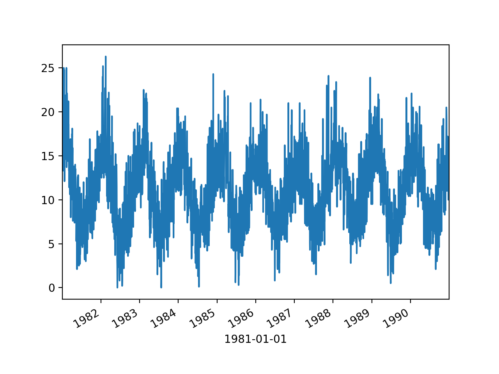

<style>
details {
    border: 1px solid #aaa;
    border-radius: 4px;
    padding: .5em .5em 0;
}
summary {
    font-weight: bold;
    margin: -.5em -.5em 0;
    padding: .5em;
}
details[open] {
    padding: .5em;
}
details[open] summary {
    border-bottom: 1px solid #aaa;
    margin-bottom: .5em;
}
</style>

<details><summary>目录</summary><p>

- [时间序列聚合](#时间序列聚合)
  - [Pandas 重采样](#pandas-重采样)
    - [API](#api)
    - [升采样](#升采样)
    - [降采样](#降采样)
    - [Function application](#function-application)
    - [Indexing 和 iteration](#indexing-和-iteration)
    - [稀疏采用](#稀疏采用)
  - [SciPy 重采样](#scipy-重采样)
    - [API](#api-1)
    - [升采样](#升采样-1)
    - [降采样](#降采样-1)
    - [等间隔采样](#等间隔采样)
    - [不等间隔采样](#不等间隔采样)
- [时间序列缺失处理](#时间序列缺失处理)
  - [时间序列插值](#时间序列插值)
  - [Pandas 插值算法](#pandas-插值算法)
    - [Pandas 中缺失值的处理](#pandas-中缺失值的处理)
    - [缺失值插值算法 API](#缺失值插值算法-api)
      - [pandas.DataFrame.interpolate](#pandasdataframeinterpolate)
  - [Scipy 插值算法](#scipy-插值算法)
    - [1-D interpolation](#1-d-interpolation)
    - [Multivariate data interpolation](#multivariate-data-interpolation)
    - [Spline interpolation](#spline-interpolation)
    - [Using radial basis functions for smoothing/interpolate](#using-radial-basis-functions-for-smoothinginterpolate)
- [时间序列降噪](#时间序列降噪)
  - [移动平均](#移动平均)
  - [傅里叶变换](#傅里叶变换)
  - [小波分析](#小波分析)
- [时间序列可视化](#时间序列可视化)
  - [时间序列图形](#时间序列图形)
  - [时间序列数据](#时间序列数据)
  - [时间序列折线图](#时间序列折线图)
  - [时间序列直方图和密度图](#时间序列直方图和密度图)
  - [时间序列箱型图和晶须图](#时间序列箱型图和晶须图)
  - [时间序列热图](#时间序列热图)
  - [时间序列滞后散点图](#时间序列滞后散点图)
  - [时间序列自相关图](#时间序列自相关图)
  - [可视化大型时间序列](#可视化大型时间序列)
    - [Midimax 压缩算法](#midimax-压缩算法)
    - [算法源码](#算法源码)
</p></details><p></p>


# 时间序列聚合

通常来自不同数据源的时间轴常常无法一一对应, 此时就要用到改变时间频率的方法进行数据处理. 
由于无法改变实际测量数据的频率, 我们能做的是改变数据收集的频率

- 上采样(up sampling): 在某种程度上是凭空获得更高频率数据的方式, 不增加额外的信息
- 下采样(down sampling): 减少数据收集的频率, 也就是从原始数据中抽取子集的方式

重采样(resampling)指的是将时间序列从一个频率转换到另一个频率的处理过程。
是对原样本重新处理的一个方法，是一个对常规时间序列数据重采样和频率转换的便捷的方法

将高频率的数据聚合到低频率称为降采样(downsampling)，
而将低频率数据转换到高频率则称为升采样(upsampling)

## Pandas 重采样

### API

```python
pd.DataFrame.resample(
    rule, 
    how = None, 
    axis = 0, 
    fill_method = None, 
    closed = None, 
    label = None, 
    convention = 'start', 
    kind = None, 
    loffset = None, 
    limit = None, 
    base = 0, 
    on = None, 
    level = None
)
```

主要参数说明:

* `rule`: DateOffset, Timedelta or str
    - 表示重采样频率，例如 ‘M’、‘5min’，Second(15)
* `how`: str
    - 用于产生聚合值的函数名或数组函数，例如'mean'、'ohlc'、'np.max'等，默认是'mean'，
      其他常用的值有：'first'、'last'、'median'、'max'、'min'
* `axis`: {0 or 'index', 1 or 'columns'}, default 0
    - 默认是纵轴，横轴设置 axis=1
* `fill_method`: str, default None
    - 升采样时如何插值，比如 ffill、bfill 等
* `closed`: {'right', 'left'}, default None
    - 在降采样时，各时间段的哪一段是闭合的，'right' 或 'left'，默认 'right'
* `label`: {'right', 'left'}, default None
    - 在降采样时，如何设置聚合值的标签，例如，9:30-9:35 会被标记成 9:30 还是 9:35, 默认9:35
* `convention`: {'start', 'end', 's', 'e'}, default 'start'
    - 当重采样时期时，将低频率转换到高频率所采用的约定（'start'或'end'）。默认'end'
* `kind`: {'timestamp', 'period'}, optional, default None
    - 聚合到时期（'period'）或时间戳（'timestamp'），默认聚合到时间序列的索引类型
* `loffset`: timedelta, default None
    - 面元标签的时间校正值，比如'-1s'或Second(-1)用于将聚合标签调早1秒
* `limit`: int, default None
    - 在向前或向后填充时，允许填充的最大时期数


* `pd.DataFrame.resample()` 和 `pd.Series.resample()`
    - 上采样
        - `.resample().ffill()`
        - `.resample().bfill()`
        - `.resample().pad()`
        - `.resample().nearest()`
        - `.resample().fillna()`
        - `.resample().asfreq()`
        - `.resample().interpolate()`
    - 下采样(计算聚合、统计函数)
        - `.resample().<func>()`
        - `.resample.count()`
        - `.resample.nunique()`
        - `.resample.first()`
        - `.resample.last()`
        - `.resample.ohlc()`
        - `.resample.prod()`
        - `.resample.size()`
        - `.resample.sem()`
        - `.resample.std()`
        - `.resample.var()`
        - `.resample.quantile()`
        - `.resample.mean()`
        - `.resample.median()`
        - `.resample.min()`
        - `.resample.max()`
        - `.resample.sum()`
    - Function application
        - `.resample().apply(custom_resampler)`: 自定义函数
        - `.resample().aggregate()`
        - `.resample().transfrom()`
        - `.resample().pipe()`
    - Indexing, iteration
        - `.__iter__`
        - `.groups`
        - `.indices`
        - `get_group()`
    - 稀疏采样

```python
import pandas as pd

rng = pd.data_range("2000-01-01", periods = 100, freq = "D")
ts = pd.Series(np.random.randn(len(rng)), index = rng)
ts
```

```
2000-01-01   -0.184415
2000-01-02   -0.078049
2000-01-03    1.550158
2000-01-04    0.206498
2000-01-05    0.184059
                ...   
2000-04-05   -0.574207
2000-04-06   -1.719587
2000-04-07    0.140673
2000-04-08   -1.234146
2000-04-09   -0.835341
Freq: D, Length: 100, dtype: float64
```

### 升采样


### 降采样

在用 `resample` 对数据进行降采样时，需要考虑两个参数:

* 各区间哪边是闭合的
* 如何标记各个聚合面元，用区间的开头还是末尾


```python
df = pd.DataFrame({
    'A': [1, 1, 2, 1, 2],
    'B': [np.nan, 2, 3, 4, 5],
    'C': [1, 2, 1, 1, 2]
}, columns = ['A', 'B', 'C'])

df.groupby("A").mean()
df.groupby(["A", "B"]).mean()
df.groupby("A")["B"].mean()
```

### Function application


### Indexing 和 iteration


### 稀疏采用


## SciPy 重采样

### API

```python
import scipy

scipy.signal.resample(
    x, 
    num, 
    t = None, 
    axis = 0, 
    window = None, 
    domain = 'time'
)
```

参数解释:

* `x`: 待重采样的数据
* `num`: 重采样的点数，int 型
* `t`: 如果给定 t，则假定它是与 x 中的信号数据相关联的等距采样位置
* `axis`: 对哪个轴重采样，默认是 0

### 升采样

```python
import numpy as np
import matplotlib.pyplot as plt
from scipy import signal


# 原始数据
t = np.linspace(0, 3, 20, endpoint = False)
y  = np.cos(t ** 2)

# 升采样, 20 个点采 40 个点
re_y = singal.resample(y, 40)
t_new = np.linspace(0, 3, len(re_y), endpoint = False)

# plot
plt.plot(t, y, "b*--", label = "raw")
plt.plot(t_new, re_y, "r.--", lable = "resample data")
plt.legend()
plt.show()
```


### 降采样

```python
import numpy as np
import matplotlib.pyplot as plt
from scipy import signal

# 原始数据
t = np.linspace(0, 3, 40, endpoint = False)
y = np.cos(t ** 2)

# 降采样, 40 个点采 20 个点
re_y = signal_resample(y, 20)
t_new = np.linspace(0, 3, len(re_y), endpoint = False)

# plot
plt.plot(t, y, "b*--", label = "raw data")
plt.plot(t_new, re_y, "r.--", label = "resample data")
plt.legend()
plt.show()
```


### 等间隔采样

```python
import numpy as np
import matplotlib.pyplot as plt
from scipy import signal

# 原始数据
t = np.linspace(0, 3, 40, endpoint = False)
y = np.cos(t ** 2)

# 等间隔降采样，40 个点采 20 个点
re_y, re_t = signal.resample(y, 20, t = t)

# plot
plt.plot(t, y, "b*--", label = "raw data")
plt.plot(re_t, re_y, "g.--", label = "resample data")
plt.legend()
plt.show()
```


### 不等间隔采样

原始数据不等间隔，采样成等间隔的点(点数不变)

```python
import numpy as np
import matplotlib.pyplot as plt
from scipy import signal

# 原始数据
t = np.array([
    0, 2, 3, 3.5, 4.5, 
    5.2, 6, 6.3, 8, 9, 
    10, 11.2, 12.3, 12.9, 14.5,
    16, 17, 18, 19, 20]) / 10
x = np.sin(3 * t)

# 重采样为等间隔
t1 = np.linspace(0, 2, 20, endpoint = True)
re_x, re_t = signal.resample(x, 20, t = t1)

# plot
plt.plot(t, x, 'b*--', label = 'raw data')
plt.plot(re_t, re_x, 'g.--', label = 'resample data')
plt.legend()
plt.show()
```


```python
import numpy as np
import matplotlib.pyplot
from scipy import signal

# 原始数据
t = np.array([
    0, 2, 3, 3.5, 4.5, 
    5.2, 6, 6.3, 8, 9, 
    10, 11.2, 12.3, 12.9, 14.5, 
    16, 17, 18, 19, 20])/10
x = np.sin(3 * t)

# 重采样
t1 = np.linspace(0, 2, 20, endpoint = True)
re_x = signal.resample(x, 20)

plt.plot(t, x, 'b*--', label = 'raw data')
plt.plot(t1, re_x, 'r.--', label = 'resample data')
plt.legend()
plt.show()
```


# 时间序列缺失处理

最常用的处理缺失值的方法包括填补(imputation) 和删除(deletion)两种

常见的数据填补(imputation)方法:

* forward fill 和 backward fill
    - 根据缺失值前/后的最近时间点数据填补当前缺失值
* moving average
* interpolation
    - 插值方法要求数据和邻近点之间满足某种拟合关系, 
      因此插值法是一种先验方法且需要代入一些业务经验

## 时间序列插值

## Pandas 插值算法

### Pandas 中缺失值的处理

1. Python 缺失值类型
   - `None`
   - `numpy.nan`
   - `NaN`
   - `NaT`
2. 缺失值配置选项
   - 将 `inf` 和 `-inf` 当作 `NA`
      - `pandas.options.mod.use_inf_as_na = True`
3. 缺失值检测
   - `pd.isna()`
   - `.isna()`
   - `pd.notna()`
   - `.notna()`
4. 缺失值填充
   - `.fillna()`
      - `.where(pd.notna(df), dict(), axis = "columns")`
      - `.ffill()`
         - `.fillna(method = "ffill", limit = None)`
      - `.bfill()`
         - `.fillna(method = "bfill", limit = None)`
   - `.interpolate(method)`
   - `.replace(, method)`
5. 缺失值删除
   - `.dropna(axis)`

### 缺失值插值算法 API

#### pandas.DataFrame.interpolate

```python

pandas.DataFrame.interpolate(
   method = 'linear', 
   axis = 0, 
   limit = None, 
   inplace = False, 
   limit_direction = 'forward', 
   limit_area = None, 
   downcast = None, 
   **kwargs
)
```

- `method`
   - `linear`: 等间距插值, 支持多多索引
   - `time`: 对索引为不同分辨率时间序列数据插值
   - `index`, `value`: 使用索引的实际数值插值
   - `pad`: 使用其他不为 `NaN` 的值插值
   - `nearest`: 参考 `scipy.iterpolate.interp1d` 中的插值算法
   - `zero`: 参考 `scipy.iterpolate.interp1d` 中的插值算法
   - `slinear`: 参考 `scipy.iterpolate.interp1d` 中的插值算法
   - `quadratic`: 参考 `scipy.iterpolate.interp1d` 中的插值算法
   - `cubic`: 参考 `scipy.iterpolate.interp1d` 中的插值算法
   - `spline`: 参考 `scipy.iterpolate.interp1d` 中的插值算法
   - `barycentric`: 参考 `scipy.iterpolate.interp1d` 中的插值算法
   - `polynomial`: 参考 `scipy.iterpolate.interp1d` 中的插值算法
   - `krogh`:
      - `scipy.interpolate.KroghInterpolator`
   - `piecewise_polynomial`
   - `spline`
      - `scipy.interpolate.CubicSpline`
   - `pchip`
      - `scipy.interpolate.PchipInterpolator`
   - `akima`
      - `scipy.interpolate.Akima1DInterpolator`
   - `from_derivatives`
      - `scipy.interpolate.BPoly.from_derivatives`
- `axis`:
   - 1
   - 0
- `limit`: 要填充的最大连续 `NaN` 数量,  :math:`>0`
- `inplace`: 是否在原处更新数据
- `limit_direction`: 缺失值填充的方向
   - forward
   - backward
   - both
- `limit_area`: 缺失值填充的限制区域
   - None
   - inside
   - outside
- `downcast`: 强制向下转换数据类型
   - infer
   - None
- `**kwargs`
   - 传递给插值函数的参数


```python
s = pd.Series([])
df = pd.DataFrame({})

s.interpolate(args)
df.interpolate(args)
df[""].interpolate(args)
```

## Scipy 插值算法

- scipy.interpolate.Akima1DInterpolator
   - 三次多项式插值
- scipy.interpolate.BPoly.from_derivatives
   - 多项式插值
- scipy.interpolate.interp1d
   - 1-D 函数插值
- scipy.interpolate.KroghInterpolator
   - 多项式插值
- scipy.interpolate.PchipInterpolator
   - PCHIP 1-d 单调三次插值
- scipy.interpolate.CubicSpline
   - 三次样条插值

### 1-D interpolation

```python
class scipy.interpolate.interp1d(x, y, 
                           kind = "linear", 
                           axis = -1, 
                           copy = True, 
                           bounds_error = None, 
                           fill_value = nan, 
                           assume_sorted = False)
```

- `kind`
   - linear
   - nearest
   - 样条插值(spline interpolator):
      - zero
         - zeroth order spline
      - slinear
         - first order spline
      - quadratic
         - second order spline
      - cubic
         - third order spline
   - previous
      - previous value
   - next
      - next value

```python
import numpy
from scipy.interpolate import interp1d

# 原数据
x = np.linspace(0, 10, num = 11, endpoint = True)
y = np.cos(-x ** 2 / 9.0)

# interpolation
f1 = interp1d(x, y, kind = "linear")
f2 = interp1d(x, y, kind = "cubic")
f3 = interp1d(x, y, kind = "nearst")
f4 = interp1d(x, y, kind = "previous")
f5 = interp1d(x, y, kind = "next")

xnew = np.linspace(0, 10, num = 1004, endpoint = True)
ynew1 = f1(xnew)
ynew2 = f2(xnew)
ynew3 = f3(xnew)
ynew4 = f4(xnew)
ynew5 = f5(xnew)
```

### Multivariate data interpolation

### Spline interpolation

### Using radial basis functions for smoothing/interpolate


# 时间序列降噪

## 移动平均

滚动平均值是先前观察窗口的平均值，其中窗口是来自时间序列数据的一系列值。
为每个有序窗口计算平均值。这可以极大地帮助最小化时间序列数据中的噪声

## 傅里叶变换

傅里叶变换可以通过将时间序列数据转换到频域去除噪声，可以过滤掉噪声频率，
然后应用傅里叶变换得到滤波后的时间序列

## 小波分析


# 时间序列可视化

## 时间序列图形

* 时间序列的时间结构 
    - Line Plots
    - Lag Plots or Scatter Plots
    - Autocorrelation Plots
* 时间序列的分布
    - Histograms and Density Plots
* 时间序列间隔上分布
    - Box and Whisker Plots
    - Heat Maps

## 时间序列数据

- [澳大利亚墨尔本市10年(1981-1990年)内的最低每日温度](https://raw.githubusercontent.com/jbrownlee/Datasets/master/daily-min-temperatures.csv)

```python
import pandas as pd 
import matplotlib.pyplot as plt 

series = pd.read_csv(
    "https://raw.githubusercontent.com/jbrownlee/Datasets/master/daily-min-temperatures.csv",
    header = 0,
    index_col = 0,  # or "ts_col"
    parse_dates = True,  # or ["ts_col"]
    date_parser = lambda dates: pd.to_datetime(dates, format = '%Y-%m-%d'),
    squeeze = True,
)
print(series.head())
```

```
Date,Temp
1981-01-01,20.7
1981-01-02,17.9
1981-01-03,18.8
1981-01-04,14.6
1981-01-05,15.8
1981-01-06,15.8
```

## 时间序列折线图

> * `$x$` 轴: timestamp
> * `$y$` 轴: timeseries

```python
series.plot()
plt.show()
```


 

```python
series.plot(style = "k-")
plt.show()
```


 
```python
series.plot(style = "k.")
plt.show()
```


```python
groups = series.groupby(pd.Grouper(freq = "A"))
years = pd.DataFrame()
for name, group in groups:
    years[name.year] = group.values

years.plot(subplots = True, legend = False)
plt.show()
```


## 时间序列直方图和密度图

> * 时间序列值本身的分布, 没有时间顺序的值的图形

```python
series.hist()
# or 
series.plot(kind = "hist")
plt.show()
```


```python
series.plot(kind = "kde")
plt.show()
```


 
## 时间序列箱型图和晶须图

> * 在每个时间序列(例如年、月、天等)中对每个间隔进行比较

```python
groups = series.groupby(pd.Grouper(freq = "A"))
years = pd.DataFrame()
for name, group in groups:
    years[name.year] = group.values

years.boxplot()
plt.plot()
```


```python
one_year = series["1990"]
groups = one_year.groupby(pd.Grouper(freq = "M"))
months = pd.concat(
    [pd.DataFrame(x[1].values) for x in groups], 
    axis = 1
)
months = pd.DataFrame(months)
months.columns = range(1, 13)

months.boxplot()
plt.show()
```


## 时间序列热图

- 用较暖的颜色(黄色和红色)表示较大的值, 用较冷的颜色(蓝色和绿色)表示较小的值

```python
groups = series.groupby(pd.Grouper(freq = "A"))
years = pd.DataFrame()
for name, group in groups:
    years[name.year] = group.values
years = years.T

plt.matshow(years, interpolation = None, aspect = "auto")
plt.show()
```


 
```python
one_year = series["1990"]
groups = one_year.groupby(pd.Grouper(freq = "M"))
months = pd.concat(
    [pd.DataFrame(x[1].values) for x in groups], 
    axis = 1
)
months = pd.DataFrame(months)
months.columns = range(1, 13)

plt.matshow(months, interpolation = None, aspect = "auto")
plt.show()
```


 

## 时间序列滞后散点图

时间序列中的先前观测值称为 lag, 先前时间步长的观测值称为 lag1, 
两个时间步长之前的观测值称为 lag2, 依此类推

Pandas 具有内置散点图功能, 称为延迟图(lag plot). 它在 x 轴上绘制在时间 t 处的观测值, 
在 y 轴上绘制 lag1(t-1) 处的观测值

如果这些点沿从图的左下角到右上角的对角线聚集, 则表明存在正相关关系. 
如果这些点沿从左上角到右下角的对角线聚集, 则表明呈负相关关系. 由于可以对它们进行建模, 
因此任何一种关系都很好. 越靠近对角线的点越多, 则表示关系越牢固, 而从对角线扩展的越多, 
则关系越弱.中间的球比较分散表明关系很弱或没有关系

```python
from pandas.plotting import lag_plot

lag_plot(series)
plt.show()
```


```python
values = pd.DataFrame(series.values)

lags = 7

columns = [values]
for i in range(1, (lags + 1)):
    columns.append(values.shift(i))

dataframe = pd.concat(columns, axis = 1)
columns = ["t+1"]
for i in range(1, (lags + 1)):
    columns.append("t-" + str(i))
dataframe.columns = columns

plt.figure(1)
for i in range(1, (lags + 1)):
    ax = plt.subplot(240 + i)
    ax.set_title(f"t+1 vs t-{str(i)}")
    plt.scatter(
        x = dataframe["t+1"].values, 
        y = dataframe["t-" + str(i)].values
    )
plt.show()
```


 
## 时间序列自相关图

量化观察值与滞后之间关系的强度和类型. 在统计中, 这称为相关, 
并且根据时间序列中的滞后值进行计算时, 称为自相关

```python
from pandas.plotting import autocorrelation_plot

autocorrelation_plot(series)
plt.show()
```


## 可视化大型时间序列

压缩算法“Midimax”，该算法会通过数据大小压缩来提升时间序列图的效果。该算法的设计有如下几点目标：

* 不引入非实际数据。只返回原始数据的子集，所以没有平均、中值插值、回归和统计聚合等
* 快速且计算量小
* 最大化信息增益。这意味着它应该尽可能多地捕捉原始数据中的变化
* 由于取最小和最大点可能会给出夸大方差的错误观点，因此取中值点以保留有关信号稳定性的信息

### Midimax 压缩算法

1. 向算法输入时间序列数据和压缩系数(浮点数)
2. 将时间序列数据拆分为大小相等的非重叠窗口，其中大小计算为：`$window\_size = floor(3 \times zip\_factory)$`。
   3 表示从每个窗口获取的最小、中值和最大点。因此，要实现 2 的压缩因子，窗口大小必须为6。更大的压缩比需要更宽的窗口
3. 按升序对每个窗口中的值进行排序
4. 选取最小点和最大点的第一个和最后一个值。这将确保我们最大限度地利用差异并保留信息
5. 为中间值选取一个中间值，其中中间位置定义为 `$med\_index=floor(window\_size / 2)$`。
   因此，即使窗口大小是均匀的，也不会进行插值
6. 根据原始索引(即时间戳)对选取的点重新排序

Midimax 是一种简单轻量级的算法，可以减少数据的大小，并进行快速的图形绘制：

* Midimax 在绘制大型时序图时可以保留原始时序的趋势；
  可以使用较少的点捕获原始数据中的变化，并在几秒钟内处理大量数据
* Midimax 会丢失部分细节；压缩过大的话可能会有较多信息丢失

### 算法源码

* https://github.com/edwinsutrisno/midimax_compression

