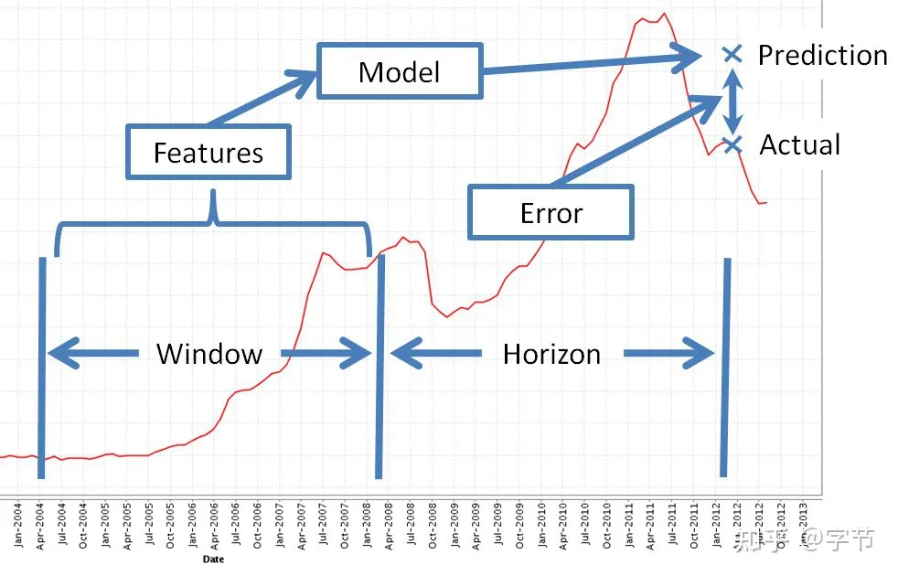

<style>
details {
    border: 1px solid #aaa;
    border-radius: 4px;
    padding: .5em .5em 0;
}
summary {
    font-weight: bold;
    margin: -.5em -.5em 0;
    padding: .5em;
}
details[open] {
    padding: .5em;
}
details[open] summary {
    border-bottom: 1px solid #aaa;
    margin-bottom: .5em;
}
</style>

<details><summary>目录</summary><p>

- [时间序列回归](#时间序列回归)
- [时间序列交叉验证](#时间序列交叉验证)
- [时间序列预测方式](#时间序列预测方式)
  - [单步预测](#单步预测)
  - [多步预测](#多步预测)
  - [多变量预测](#多变量预测)
  - [递归预测 Recursive Forecasting](#递归预测-recursive-forecasting)
  - [直接预测 Direct Forecasting](#直接预测-direct-forecasting)
  - [堆叠预测 Stacking Forecasting](#堆叠预测-stacking-forecasting)
  - [修正预测 Rectified Forecasting](#修正预测-rectified-forecasting)
- [时间序列数据特征工程](#时间序列数据特征工程)
  - [动态特征](#动态特征)
    - [lag 特征](#lag-特征)
    - [日期时间衍生特征](#日期时间衍生特征)
  - [静态特征](#静态特征)
    - [类别特征](#类别特征)
  - [其他衍生特征](#其他衍生特征)
    - [滑窗类时间聚合特征](#滑窗类时间聚合特征)
  - [创建 Date Time 特征](#创建-date-time-特征)
    - [常见特征](#常见特征)
  - [创建 Lagging 特征](#创建-lagging-特征)
    - [滑动窗口特征](#滑动窗口特征)
    - [滑动窗口统计量特征](#滑动窗口统计量特征)
    - [TODO](#todo)
  - [创建 Window 变量](#创建-window-变量)
- [时间序列模型选择](#时间序列模型选择)
  - [模型](#模型)
  - [local 模型和 global 模型](#local-模型和-global-模型)
- [参考文章](#参考文章)
</p></details><p></p>

这里来总结一下传统时序预测方法的一些问题：

1. 对于时序本身有一些性质上的要求，需要结合预处理来做拟合，不是端到端的优化
2. 需要对每条序列做拟合预测，性能开销大，数据利用率和泛化能力堪忧，无法做模型复用
3. 较难引入外部变量，例如影响销量的除了历史销量，还可能有价格，促销，业绩目标，天气等等
4. 通常来说多步预测能力比较差

正因为这些问题，实际项目中一般只会用传统方法来做一些 baseline，
主流的应用还是属于下面要介绍的机器学习方法

# 时间序列回归

时序预测模型与回归预测模型不同，时序预测模型依赖于数值在时间上的先后顺序，是回归模型中的一部分。
简单来说，时间序列的回归分析需要分析历史数据，找到历史数据演化中的模式和特征，
其主要分为线性回归分析和非线性回归分析两种类型

回归分析多采用机器学习方法，我们首先需要明确机器学习(或深度学习)模型构建与验证的主体思路：

1. 分析数据构建数据特征，将数据转化为特征样本集合
2. 明确样本与标签，划分训练集与测试集
3. 比较不同模型在相同的训练集中的效果，或是相同模型的不同参数在同一个训练集中拟合的效果
4. 在验证样本集中验证模型的准确度，通过相关的结果评估公式选择表现最好同时没有过拟合的模型

近年来时间序列预测方法，多采用机器学习方式。机器学习的方法，主要是构建样本数据集，
采用“时间特征”到“样本值”的方式，通过有监督学习，学习特征与标签之前的关联关系，
从而实现时间序列预测。常用的场景有以下几种

# 时间序列交叉验证

在时序问题上，需要特别注意不能做随机 split，而需要在时间维度上做前后的 split，
以保证与实际预测应用时的情况一致


# 时间序列预测方式

机器学习方法处理时间序列问题的基本思路就是吧时间序列切分成一段历史训练窗口和未来的预测窗口，
对于预测窗口中的每一条样本，基于训练窗口的信息来构建特征，转化为一个表格类预测问题来求解


实际场景中，一般需要确定几个参数：

1. 历史窗口的大小
    - 即预测未来时，要参考过去多少时间的信息作为输入。太少可能信息量不充分，
      太多则会引入早期不相关的信息(比如疫情前的信息可能目前就不太适用了)
2. 预测点 gap 的大小
    - 即预测未来时，是从 T+1 开始预测，还是 T+2，T+3，这与现实的业务场景有关，
      例如像补货场景，预测 T+1 的销量，可能已经来不及下单补货了，
      所以需要扩大这个提前量，做 T+3 甚至更多提前时间的预测
3. 预测窗口的大小
    - 即需要连续预测多长的未来值。比如从 T+1 开始一直到 T+14 都需要预测输出。
      这一点也跟实际的业务应用场景有关

也会看到一些额外加入时序预处理步骤的方法，比如先做 STL 分解再做建模预测。
尝试下来这类方法总体来说效果并不明显，但对于整个 pipeline 的复杂度却有较大的增加，
对于 AutoML、模型解释等工作都造成了一定的困扰，所以实际项目中应用的也比较少

## 单步预测

在时间序列预测中的标准做法是使用滞后的观测值 `$x_{t-1}$` 作为输入变量来预测当前的时间的观测值 `$x_{t}$`

## 多步预测

使用过去的观测序列 `$\{\ldots, x_{t-2}, x_{t-1}\}$` 预测未来的观测序列 `$\{x_{t}, x_{t+1}, \ldots\}$`

## 多变量预测

多元时间序列，即每个时间有多个观测值：

`$$\{X_{t} = (x_{t}^{a}, x_{t}^{b}, x_{t}^{c}, \ldots)\}_{t}^{T}$$`

这意味着通过不同的测量手段得到了多种观测值，并且希望预测其中的一个或几个值。
例如，可能有两组时间序列观测值 `$\{x_{t-1}^{a}, x_{t-2}^{a}, \ldots\}$`，
`$\{x_{t-1}^{b}, x_{t-2}^{b}, \ldots\}$`，希望分析这组多元时间序列来预测 `$x_{t}^{a}$` 

基于以上场景，许多监督学习的方法可以应用在时间序列的预测中，
在运用机器学习模型时，可以把时间序列模型当成一个回归问题来解决，
比如 svm/xgboost/逻辑回归/回归树/...

## 递归预测 Recursive Forecasting

## 直接预测 Direct Forecasting

## 堆叠预测 Stacking Forecasting

## 修正预测 Rectified Forecasting


# 时间序列数据特征工程



## 动态特征

Lag 特征、日期时间衍生特征这类属于动态特征。随着时间变化会发生改变。这其中又可以分成两类：

* 一类是在预测时无法提前获取到的信息，例如预测值本身，跟预测值相关的不可知信息，如未来的客流量，点击量等。
对于这类信息，只能严格在历史窗口范围内做各种特征构建的处理，一般以 lag 为主
* 另一类则是可以提前获取到的信息，例如我们有明确的定价计划，
  可以预知在 T+1 时计划售卖的商品价格是多少。
  对于这类特征，则可以直接像静态特征那样直接加入对应时间点的信息进去

### lag 特征

为了便于理解，可以假设预测的 horizon 长度仅为 1 天，而历史的特征 window 长度为 7 天，
那么可以构建的最基础的特征即为过去 7 天的每天的历史值，来预测第 8 天的值。
这个历史 7 天的值，在机器学习类方法中，一般被称为 lag 特征

### 日期时间衍生特征

对于时间本身，可以做各类日期衍生特征：

* 离散类时间特征: 年月日时分数, 周几, 一年中的第几天, 第几周, 一天中的哪个时间段等
* 判断类时间特征: 是否调休, 是否周末, 是否公共假期等

## 静态特征

即随着时间的变化，不会发生变化的信息。除了最细粒度的唯一键，还可以加入其它形式的静态特征。
例如商品属于的大类，中类，小类，门店的地理位置特性，股票所属的行业等等。除了类别型，
静态特征也可能是数值型，例如商品的重量，规格，一般是保持不变的

### 类别特征

另外一类最常见的基础特征，就是区分不同序列的类别特征，
例如不同的门店，商品，或者不同的股票代码等。
通过加入这个类别特征，就可以把不同的时间序列数据放在一张大表中统一训练了。
模型理论上来说可以自动学习到这些类别之间的相似性，提升泛化能力

## 其他衍生特征

以上提到的基本属于直接输入的信息，基于这些信息，我们还可以进一步做各种复杂的衍生特征。
例如在 lag 的基础上，我们可以做各种窗口内的统计特征，比如过去 n 个时间点的平均值，最大值，最小值，标准差等。
进一步，还可以跟之前的各种维度信息结合起来来计算，比如某类商品的历史均值，某类门店的历史均值等。
也可以根据自己的理解，做更复杂计算的衍生，例如过去 7 天中，销量连续上涨的天数，
过去 7 天中最大销量与最低销量之差等等

### 滑窗类时间聚合特征

过去 X 天平均值, 过去 X 天方差, 过去 X 天最大值, 过去 X 小时四分位数, 过去 X 天偏态系数等


## 创建 Date Time 特征

### 常见特征

* 一年中的月分
* 一个月中的日期
* 一天过去了几分钟
* 一天的时间
* 营业时间与否
* 周末与否
* 一年中的季节
* 一年中的业务季度
* 夏时制与否
* 公共假期与否
* 是否是闰年

```python
df = pd.DataFrame()
df["Date"] = [series.index[i] for i in range(len(series))]
df["month"] = [series.index[i].month for i in range(len(series))]
df["day"] = [series.index[i].day for i in range(len(series))]
df["temperature"] = [series[i] for i in range(len(series))]
print(df.head())
```

```
        Date  month  day  temperature
0 1981-01-01      1    1         20.7
1 1981-01-02      1    2         17.9
2 1981-01-03      1    3         18.8
3 1981-01-04      1    4         14.6
4 1981-01-05      1    5         15.8
```

## 创建 Lagging 特征

* pushed forward
* pulled back

```python
import pandas as pd 

def series_to_supervised(data, n_lag = 1, n_fut = 1, selLag = None, selFut = None, dropnan = True):
      """
      Converts a time series to a supervised learning data set by adding time-shifted prior and future period
      data as input or output (i.e., target result) columns for each period
      :param data:  a series of periodic attributes as a list or NumPy array
      :param n_lag: number of PRIOR periods to lag as input (X); generates: Xa(t-1), Xa(t-2); min= 0 --> nothing lagged
      :param n_fut: number of FUTURE periods to add as target output (y); generates Yout(t+1); min= 0 --> no future periods
      :param selLag:  only copy these specific PRIOR period attributes; default= None; EX: ['Xa', 'Xb' ]
      :param selFut:  only copy these specific FUTURE period attributes; default= None; EX: ['rslt', 'xx']
      :param dropnan: True= drop rows with NaN values; default= True
      :return: a Pandas DataFrame of time series data organized for supervised learning
      
      NOTES:
      (1) The current period's data is always included in the output.
      (2) A suffix is added to the original column names to indicate a relative time reference: e.g., (t) is the current
         period; (t-2) is from two periods in the past; (t+1) is from the next period
      (3) This is an extension of Jason Brownlee's series_to_supervised() function, customized for MFI use
      """
      n_vars = 1 if type(data) is list else data.shape[1]
      df = pd.DataFrame(data)
      origNames = df.columns
      cols, names = list(), list()
      # include all current period attributes
      cols.append(df.shift(0))
      names += [("%s" % origNames[j]) for j in range(n_vars)]
      # lag any past period attributes (t-n_lag, ..., t-1)
      n_lag = max(0, n_lag) # force valid number of lag periods
      # input sequence (t-n, ..., t-1)
      for i in range(n_lag, 0, -1):
         suffix = "(t-%d)" % i
         if (None == selLag):
            cols.append(df.shift(i))
            names += [("%s%s" % (origNames[j], suffix)) for j in range(n_vars)]
         else:
            for var in (selLag):
                  cols.append(df[var].shift(i))
                  names += [("%s%s" % (var, suffix))]
      # include future period attributes (t+1, ..., t+n_fut)
      n_fut = max(n_fut, 0)
      # forecast sequence (t, t+1, ..., t+n)
      for i in range(0, n_fut + 1):
         suffix = "(t+%d)" % i
         if (None == selFut):
            cols.append(df.shift(-i))
            names += [("%s%s" % (origNames[j], suffix)) for j in range(n_vars)]
         else:
            for var in (selFut):
                  cols.append(df[var].shift(-i))
                  names += [("%s%s" % (var, suffix))]
      # put it all together
      agg = pd.concat(cols, axis = 1)
      agg.columns = names
      # drop rows with NaN values
      if dropnan:
         agg.dropna(inplace = True)

      return agg
```

### 滑动窗口特征

```python
temps = pd.DataFrame(series.values)
df = pd.concat([
    temps.shift(3), 
    temps.shift(2), 
    temps.shift(1), 
    temps
], axis = 1)
df.columns = ["t-3", "t-2", "t-1", "t+1"]
df.dropna(inplace = True)

print(df.head())
```

``` 
    t-3   t-2   t-1   t+1
3  17.9  18.8  14.6  15.8
4  18.8  14.6  15.8  15.8
5  14.6  15.8  15.8  15.8
6  15.8  15.8  15.8  17.4
7  15.8  15.8  17.4  21.8
```

### 滑动窗口统计量特征

```python
temps = pd.DataFrame(series.values)

shifted = temps.shift(1)
window = shifted.rolling(window = 2)
means = window.mean()

df = pd.concat([mean, temps], axis = 1)
df.columns = ["mean(t-2,t-1)", "t+1"]

print(df.head())
```

```
   mean(t-2,t-1)   t+1
0            NaN  17.9
1            NaN  18.8
2          18.35  14.6
3          16.70  15.8
4          15.20  15.8
```

### TODO

```python
temps = pd.DataFrame(series.values)

width = 3
shifted = temps.shift(width - 1)
window = shifted.rolling(windon = width)

df = pd.concat([
    window.min(), 
    window.mean(), 
    window.max(), 
    temps
], axis = 1)
df.columns = ["min", "mean", "max", "t+1"]

print(df.head())
```

```
    min  mean   max   t+1
0   NaN   NaN   NaN  17.9
1   NaN   NaN   NaN  18.8
2   NaN   NaN   NaN  14.6
3   NaN   NaN   NaN  15.8
4  14.6  17.1  18.8  15.8
```

## 创建 Window 变量

```python
temps = pd.DataFrame(series.values)

window = temps.expanding()

df = pd.concat([
    window.min(), 
    window.mean(), 
    window.max(), 
    temps.shift(-1)
], axis = 1)
df.columns = ["min", "mean", "max", "t+1"]

print(df.head())
```

``` 
    min    mean   max   t+1
0  17.9  17.900  17.9  18.8
1  17.9  18.350  18.8  14.6
2  14.6  17.100  18.8  15.8
3  14.6  16.775  18.8  15.8
4  14.6  16.580  18.8  15.8
```

# 时间序列模型选择


## 模型

模型这块，基本上没有什么花样，大家的主流选择基本都是 GBDT 和 NN。
个人最常使用的选择是 LightGBM 和 fastai，然后选择好时序验证方式，
做自动参数优化就可以了（比如使用 Optuna 或 FLAML）。
lgbm 的训练速度快，而且在某些业务特征比较重要的情况下，往往能达到比神经网络更好更稳定的效果。
而 NN 的主要优势在类别变量的表达学习上，理论上可以达到更好的 embedding 表示。
此外 NN 的 loss 设计上也会比较灵活，相对来说 lgbm 的 loss 或者多目标学习限制条件就比较多了。
总体来说，目前最常见的选择仍然是树模型一族

* lightgbm
* fastai

## local 模型和 global 模型

有一个值得注意的考量点在于 local 模型与 global 模型的取舍。
前面提到的经典时序方法中都属于 local 模型，即每一个序列都要构建一个单独的模型来训练预测；
而提到的把所有数据都放在一起训练则是 global 模型的方式。实际场景中，
可能需要预测的时序天然就会有很不一样的规律表现，比如科技类股票，跟石油能源类股票的走势，
波动都非常不一样，直接放在一起训练反而可能导致整体效果下降。
所以很多时候我们要综合权衡这两种方式，在适当的层级做模型的拆分训练。
深度学习领域有一些工作如 DeepFactor 和 FastPoint 也在自动适配方面做了些尝试

# 参考文章

* [Time Series Forecasting as Supervised Learning](https://machinelearningmastery.com/time-series-forecasting-supervised-learning/)
* [How to Convert a Time Series to a Supervised Learning Problem in Python](https://machinelearningmastery.com/convert-time-series-supervised-learning-problem-python/)
* [Machine Learning Strategies for Time Series Forecasting](https://link.springer.com/chapter/10.1007%2F978-3-642-36318-4_3)
* [slide](http://di.ulb.ac.be/map/gbonte/ftp/time_ser.pdf)
* [Machine Learning for Sequential Data: A Review](http://web.engr.oregonstate.edu/~tgd/publications/mlsd-ssspr.pdf)
* [如何用Python将时间序列转换为监督学习问题](https://cloud.tencent.com/developer/article/1042809)
* [How To Resample and Interpolate Your Time Series Data With Python](https://machinelearningmastery.com/resample-interpolate-time-series-data-python/)
* [时间序列预测](https://mp.weixin.qq.com/s?__biz=Mzg3NDUwNTM3MA==&mid=2247484974&idx=1&sn=d841c644fd9289ad5ec8c52a443463a5&chksm=cecef3dbf9b97acd8a9ededc069851afc00db422cb9be4d155cb2c2a9614b2ee2050dc7ab4d7&scene=21#wechat_redirect)

