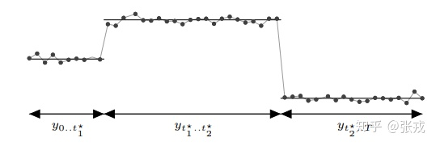

<style>
details {
    border: 1px solid #aaa;
    border-radius: 4px;
    padding: .5em .5em 0;
}
summary {
    font-weight: bold;
    margin: -.5em -.5em 0;
    padding: .5em;
}
details[open] {
    padding: .5em;
}
details[open] summary {
    border-bottom: 1px solid #aaa;
    margin-bottom: .5em;
}
</style>

<details><summary>目录</summary><p>

- [Prophet 简单介绍](#prophet-简单介绍)
- [Prophet 输入输出](#prophet-输入输出)
  - [时间序列数据格式](#时间序列数据格式)
  - [Prophet 时间序列格式](#prophet-时间序列格式)
- [Prophet 算法原理](#prophet-算法原理)
  - [概率视角下的贝叶斯线性回归](#概率视角下的贝叶斯线性回归)
  - [时间序列分解](#时间序列分解)
  - [趋势项模型 g(t)](#趋势项模型-gt)
    - [饱和趋势项](#饱和趋势项)
    - [分段线性函数 Piecewise Linear Function](#分段线性函数-piecewise-linear-function)
    - [变点的选择 Changepoint Selection](#变点的选择-changepoint-selection)
    - [对未来的预估 Trend Forecast Uncertainty](#对未来的预估-trend-forecast-uncertainty)
  - [季节性趋势 s(t)](#季节性趋势-st)
  - [节假日效应 h(t)](#节假日效应-ht)
  - [时序模型拟合](#时序模型拟合)
- [Prophet 使用](#prophet-使用)
  - [Prophet 安装](#prophet-安装)
    - [R 中的安装](#r-中的安装)
    - [Python 中的安装](#python-中的安装)
  - [Prophet 简单使用](#prophet-简单使用)
    - [使用示例](#使用示例)
    - [数据操作](#数据操作)
    - [模型拟合](#模型拟合)
    - [模型预测](#模型预测)
  - [Prophet 的参数设置](#prophet-的参数设置)
    - [增长函数](#增长函数)
    - [变点](#变点)
    - [周期性](#周期性)
    - [节假日](#节假日)
  - [饱和预测(Staturating Forecast)](#饱和预测staturating-forecast)
    - [Forecasting Growth](#forecasting-growth)
    - [Staturating Minimum](#staturating-minimum)
  - [Seasonality, Holiday Effects, And Regressors](#seasonality-holiday-effects-and-regressors)
    - [假期和特殊事件建模](#假期和特殊事件建模)
    - [指定内置的国家/地区假期(Build-in Country Holiday)](#指定内置的国家地区假期build-in-country-holiday)
    - [季节性的傅里叶变换(Fourier Order for Seasonalities)](#季节性的傅里叶变换fourier-order-for-seasonalities)
    - [指定自定义季节性](#指定自定义季节性)
- [参考](#参考)
</p></details><p></p>

# Prophet 简单介绍 

Facebook 开源了一个时间序列预测的算法, 叫做 **fbprophet**, 
官方网址与基本介绍来自于以下几个网站:

1. Github: https://github.com/facebook/prophet
2. 官方网址: https://facebook.github.io/prophet/
3. 论文地址: https://peerj.com/preprints/3190/

从官网的介绍来看, Facebook 所提供的 prophet 算法不仅可以处理时间序列存在一些异常值的情况, 
也可以处理部分缺失值的情形, 还能够几乎全自动地预测时间序列未来的走势.

从论文上的描述来看, 这个 prophet 算法是基于时间序列分解和机器学习的拟合来做的, 
其中在拟合模型的时候使用了 `pyStan` 这个开源工具, 因此能够在较快的时间内得到需要预测的结果

除此之外, 为了方便统计学家, 机器学习从业者等人群的使用, prophet 同时提供了 R 语言和 Python 语言的接口. 

从整体的介绍来看, 如果是一般的商业分析或者数据分析的需求, 
都可以尝试使用这个开源算法来预测未来时间序列的走势. 
对于商业分析等领域的时间序列，Prophet 可以进行很好的拟合和预测，
但是对于一些周期性或者趋势性不是很强的时间序列，
用 Prophet 可能就不合适了(例如：移动平均)。但是，Prophet 提供了一种时序预测的方法，
在用户不是很懂时间序列的前提下都可以使用这个工具得到一个能接受的结果。
具体是否用 Prophet 则需要根据具体的时间序列来确定

# Prophet 输入输出

首先让我们来看一个常见的时间序列场景, 黑色表示原始的时间序列离散点, 深蓝色的线表示使用
时间序列来拟合所得到的取值, 而浅蓝色的线表示时间序列的一个置信区间, 也就是所谓的合理的
上界和下界. prophet 所做的事情就是: 

1. 输入已知的时间序列的时间戳和相应的值
2. 输入需要预测的时间序列的长度
3. 输出未来的时间序列走势
4. 输出结果可以提供必要的统计指标, 包括拟合曲线, 上界和下界等

## 时间序列数据格式

就一般情况而言, 时间序列的离线存储格式为时间戳和值这种格式, 更多的话可以提供时间序列的 ID, 
标签等内容. 因此, 离线存储的时间序列通常都是以下的形式. 

|date                |category |value |label    |
|--------------------|---------|------|---------|
|2017-10-20 22:00:00 |  id1    |10    | "unknow"|
|2017-10-20 22:01:00 |  id1    |9     |      "1"|
|2017-10-20 22:02:00 |  id1    |0     |      "0"|

其中:

* `date` 指的是具体的时间戳
* `category` 指的是某条特定的时间序列 id
* `value` 指的是在 date 下这个 category 时间序列的取值
* `label` 指的是人工标记的标签
    - "0" 表示异常
    - "1" 表示正常
    - "unknown" 表示没有标记或者人工判断不清

## Prophet 时间序列格式

Prophet 所需要的时间序列也是这种格式的, 根据官网的描述, 只要用 `csv` 文件存储两列即可:

* 第一列的名字是 `ds`
    - 表示时间序列的时间戳    
* 第二列的名称是 `y`    
    - 表示时间序列的取值

通过 `prophet` 的计算, 可以计算出如下的数值: 

* `yhat`: 表示时间序列的预测值
* `yhat_lower`: 表示时间序列预测值的下界
* `yhat_upper`: 表示时间序列预测值的上界

两份表格如下面的两幅图表示:

* 输入数据格式

|    | ds                 | y    |
| ---|--------------------|------|
| 0  |2017-10-20 22:00:00 |  9.5 |
| 1  |2017-10-20 22:01:00 |  8.5 |
| 2  |2017-10-20 22:02:00 |  8.1 |
| 3  |2017-10-20 22:02:00 |  8.0 |
| 4  |2017-10-20 22:02:00 |  7.8 |

* 输出数据格式

|      | ds                 |  yhat | yhat_lower |  yhat_upper |
| -----|--------------------|-------|-----------|--------------|
| 3265 | 2017-10-20 22:00:00| 8.19  | 7.48      |       8.96   |
| 3266 | 2017-10-20 22:01:00| 8.52  | 7.79      |       9.26   |
| 3267 | 2017-10-20 22:02:00| 8.31  | 7.55      |       9.04   |
| 3268 | 2017-10-20 22:02:00| 8.14  | 7.42      |       8.86   |
| 3269 | 2017-10-20 22:02:00| 8.15  | 7.39      |       8.88   |

# Prophet 算法原理

## 概率视角下的贝叶斯线性回归

从概率的角度来讲，时间序列是随机过程在时间方向上的一次采样，
所以时间序列模型的建模过程是期望通过这样的采样数据来学习模型。
同理，机器学习模式的有监督学习的训练样本是 `$P(y|x)$` 在空间方向上的采样，
只不过相对于时间不能重复来说，机器学习的采样在空间上可以不断重复

先从一个简单的线性回归开始，线形回归有概率学派的视角和贝叶斯学派的视角。
从频率学派的视角，做的是一个点估计，而贝叶斯学派是一个概率估计，
也就是说目标值 `$y$` 不再是一个被估计的单个值，而是假设从某个分布(比如正态分布)中提取出来的

一元线性回归的假设空间可表示如下：

`$$F = \Bigg\{ P | P(y|\mathbf{x}, \theta) = \frac{1}{\sqrt{2 \pi}\sigma} exp\Bigg(-\frac{ (y - \mathbf{x} \cdot \theta)^{2}}{2 \sigma^{2}}\Bigg), \theta \in R^{m+1} \Bigg\}$$`

简单解释：

`$\mathbf{x}$` 是样本向量，当输入了样本 `$\mathbf{x}$` 进去之后，
就能得到每个 `$y$` 的概率分布是多少。如果是频率学派，学习的是这条线的一个表达式，
但是目前贝叶斯学派，学到的是每个 `$\mathbf{x}$` 在 `$y$` 轴上的分布。
在分析上面表达式的时候，不难想到，如果通过高斯分布去分析的话，
对于 `$y$` 的分布，它们的形状，也就是方差 `$\sigma$` 是一样的，
但是期望值 `$\mu$` 是随着 `$x, \theta$` 进行变化，而且是沿着一条线进行变化

在概率视角下，和频率学派一样，要去学习 `$\theta$`

频率学派的学习方法是通过训练数据和最大似然估计去得到 `$\theta$` 的具体值：

`$p(x|\theta)$` 中的 `$\theta$` 是一个常量，对于 `$N$` 个观测来说观测集的概率为 `$p(\mathbf{x}|\theta)\underset{iid}{=}\prod_{i=1}^{N}p(x_{i}|\theta)$`。为了求 `$\theta$` 的大小，采用最大对数似然 MLE 的方法：

`$$\theta_{MLE}=\underset{\theta}{argmax} \text{ } log \text{ } p(\mathbf{x}|\theta) \underset{iid}{=}\underset{\theta}{argmax}\sum_{i=1}^{N} log \text{ } p(x_{i}|\theta)$$`

贝叶斯学派中 `$\theta$` 是一个随机变量而不是一个固定的值，它们由一个先验分布进行约束，下面是贝叶斯线形回归


## 时间序列分解

Prophet 是将时间序列看成是一个关于 `$t$` 的函数，用拟合函数曲线的方式进行预测。
在时间序列分析中, 常见的分析方法叫做时间序列的分解(Decomposition of Time Series), 
时间序列分解的原理是将时间序列 `$y(t)$` 分为三个部分: 

* 季节性项 `$s(t)$`
    - 在固定的时间段内重复的模式
* 趋势项 `$g(t)$`
    - 指标的基本趋势
* 随机噪声项(剩余项) `$r(t)$`
    - 季节性和趋势项被删除后原始时间序列的残差

根据季节性项 `$s(t)$` 的变化, 分解方法可分为两种: 

* 加法分解
    - `$y(t) = s(t) + g(t) + r(t)$`
* 乘法分解
    - `$y(t) = s(t) \times g(t) \times r(t)$`, 等价于 `$\ln y(t) = \ln s(t) + \ln g(t) + \ln r(t)$`
    - 由于上面的等价关系, 所以, 有的时候在预测模型的时候, 会先取对数, 然后再进行时间序列的分解, 就能得到乘法的形式. 
      在 Prophet 算法中, 作者们基于这种方法进行了必要的改进和优化. 

一般来说, 在实际生活和生产环节中, 除了季节项、趋势项、剩余项之外, 通常还有节假日的效应. 
所以, 在 Prophet 算法里面, 作者同时考虑了以上四项, Prophet 算法就是通过拟合这几项, 
然后最后把它们累加起来就得到了时间序列的预测值. 也就是: 

`$$y(t) = g(t) + s(t) + h(t) + \epsilon_t$$`

其中: 

* `$g(t)$` 表示趋势项, 它表示时间序列在非周期上面的变化趋势
* `$s(t)$` 表示周期项, 或者称为季节项, 一般来说是以周或者年为单位
* `$h(t)$` 表示节假日项，或者更泛指外部变量, 表示在当天是否存在节假日
* `$\epsilon_t$` 表示误差项或者称为剩余项，或者无法解释项

## 趋势项模型 g(t)

在 Prophet 算法里面, 趋势项分为两种：

* 基于逻辑回归函数(logistic function)的饱和趋势项(Nonlinear, Saturating Growth)
    - 有一个上限，比如：人口的增长有一些缓慢，但有一个上界

`$$g(t) = \frac{C}{1+e^{-k(t-m)}}$$`

* 基于分段线性函数(piecewise linear function)的线形趋势项(Linear trend with change points)
    - 一直有一个向上或者向下的趋势

`$$g(t) = kt + m$$`

### 饱和趋势项

首先, 介绍一下基于逻辑回归函数(logistic function)的饱和趋势项(Nonlinear, Saturating Growth)

> 回顾逻辑回归函数，一般都会想起 Sigmoid 函数形式：
> 
> `$$\sigma(x) = \frac{1}{1+e^{-x}}$$`
> 
> 它的导函数是 `$\sigma '(x) = \sigma(x)\cdot (1-\sigma(x))$`，
并且 `$\underset{x \rightarrow +\infty}{lim}\sigma(x) = 1$`，
`$\underset{x \rightarrow -\infty}{lim}\sigma(x) = 0$`。
> 
> 从 Sigmoid 的函数表达式可以看出，它满足以下的微分方程：`$y'=y(1-y)$`。
那么，如果使用分离变量法来求解微分方程 `$y'=y(1-y)$` 就可以得到：
`$$\frac{y'}{y} + \frac{y'}{1-y}=1$$`
`$$ln\frac{y}{1-y}=1$$`
`$$y=\frac{1}{1+ke^{-x}}$$`

如果增加一些参数的话，逻辑回归就可以改写成：

`$$f(x) = \frac{C}{1+e^{-k(x-m)}}$$`

其中：

* `$C$` 代表 carring capacity，即上限容量，也称为曲线的最大渐近值，`$g(t)$` 能达到的上界
    - 当 `$k>0$` 时，随着 `$t$` 的不断增加，`$e^{-k(x-m)} \rightarrow 0$`，所以 `$g(t) \rightarrow C$`
* `$k$` 代表 growths rate，即表示曲线的增长率
    - 当 `$k>0$` 时，表示趋势向上，反之向下
    - `$k$` 越大，表明这种趋势的速度会越快
* `$m$` 代表 offset parameter，表示曲线趋势项斜率发生变化的转折点
    - 当 `$t = m$` 时，斜率增长率达到最大，并且 `$m$` 可以对曲线进行调整，让它左右平移 

当 `$C = 1$`，`$k = 1$`，`$m=0$` 时，恰好就是 Sigmoid 函数的形式。
在现实情况下，函数 `$f(x)$` 的三个参数 `$C, k, m$` 不可能都是常数，
而很有可能是随着时间的迁移而变化的，因此，在 Prophet 里面，作者考虑把这三个参数全部换成了随着时间变化的函数，
即：`$C=C(t)$`，`$k=k(t)$`，`$m=m(t)$`

除此之外，在现实的时间序列中，曲线的走势肯定不会一直保持不变，
在某些特定的时候或者有着某种潜在的周期曲线会发生变化，
这种时候，就有学者会去研究变点检测，也就是所谓 change point detection。
例如下面的这幅图的 `$t^{*}_{1}$`，`$t^{*}_{2}$`  就是时间序列的两个变点



> 在 Prophet 里面，是需要设置变点的位置的，而每一段的趋势和走势也是会根据变点的情况而改变的。
  在程序里面有两种方法，一种是通过人工指定的方式指定变点的位置；另外一种是通过算法来自动选择。
>
> 在默认的函数里面，Prophet 会选择 `n_changepoints = 25` 个变点，然后设置变点的范围是前 `changepoint_range = 80%`，
  也就是在时间序列的前 80% 的区间内会设置变点。通过 `forecaster.py` 里面的 `set_changepoints` 函数可以知道，
  首先要看一些边界条件是否合理，例如时间序列的点数是否少于 `n_changepoints` 等内容；
  其次如果边界条件符合，那变点的位置就是均匀分布的，这一点可以通过 `np.linspace` 这个函数看出来

下面假设已经设置了 `$S$` 个变点了，并且变点的位置是在时间戳 `$s_{j}, 1\leq j \leq S$` 上，
那么在这些时间戳上，就需要给出增长率的变化，也就是在时间戳 `$s_{j}$` 上发生的 change in rate。

假设有这样一个向量：`$\delta = (\delta_{1}, \ldots, \delta_{S}) \in \mathbb{R}^{S}$`，
其中 `$\delta_{j}$` 表示在时间戳 `$s_{j}$` 上的增长率的变化量，如果初始增长率使用 `$k$` 表示，
那么在时间戳 `$t$` 上的增长率就是 `$k+\sum_{j:t>s_{j}}\delta_{j}$`，
通过一个指示函数 `$a_{j}(t)\in \{0, 1\}^{S}$`：

`$$a_{j}(t)=\begin{cases}
1, if \text{ } t \geq s_{j}, \\
0, otherwise \end{cases}$$`

表示在时间戳 `$t$` 上面的增长率就是：

`$$k(t) = k+a^{T}\delta$$`

一旦变化率 `$k(t)$` 确定了，另一个参数 `$m(t)$` 也要随之确定。
在这里需要把线段的边界处理好，因此通过数学计算可以得到：

`$$\gamma_{j}=\Bigg(s_{j} - m - \underset{l<j}{\sum}\gamma_{l}\Bigg) \cdot \Bigg(1 - \frac{k+\underset{l<j}{\sum}\delta_{l}}{k+\underset{l \leq j}{\sum}\delta_{l}}\Bigg)$$`

`$$m(t)=m + a(t)^{T}\gamma$$`

所以，分段的逻辑回归增长模型就是：

`$$\begin{align}
g(t) &= \frac{C(t)}{1+e^{-k(t)(t-m(t))}} \\
&= \frac{C(t)}{1+ e^{-\big(k + a(t)^{T} \delta\big) \cdot \big(t-(m+a(t)^{T}\gamma)\big)}}
\end{align}$$`

其中：

* `$a(t)=(a_{1}(t), \ldots, a_{S}(t))^{T}$`
* `$\delta=(\delta_{1}, \ldots, \delta_{S})^{T}$`
* `$\gamma=(\gamma_{1}, \ldots, \gamma_{S})^{T}$`

在逻辑回归函数里面，有一个参数是需要提前设置的，那就是 Capacity，也就是所谓的  `$C(t)$`，
在使用 Prophet 的 `growth = 'logistic'` 的时候，需要提前设置好 `$C(t)$` 的取值才行

### 分段线性函数 Piecewise Linear Function

下面介绍一下基于分段线性函数的趋势项。
众所周知，线性函数指的是 `$y=kx+b$`，而分段线性函数指的是在每一个子区间上，
函数都是线性函数，但是在整段区间上，函数并不完全是线性的

因此，基于分段线性函数的模型形如：

`$$g(t) = \big(k + a(t)\delta\big) \cdot t + \big(m + a(t)^{T}\gamma\big)$$`

其中：

* `$k$` 表示增长率(growth rate)
* `$\delta$` 表示增长率的变化量
* `$m$` 表示 offset parameter

逻辑回归函数与分段线性函数最大的区别就是 `$\gamma$` 的设置不一样，在分段线性函数中，

`$$\gamma=(\gamma_{1}, \ldots, \gamma_{S}), \gamma_{j} = -s_{j}\delta_{j}$$`

在 Prophet 的源代码中，`forecast.py` 这个函数里面包含了最关键的步骤，
其中 `piecewise_logistic` 函数表示了前面所说的基于逻辑回归的增长函数，
它的输入包含了 `cap` 这个指标，因此需要用户事先指定 capacity。
而在 `piecewise_linear` 这个函数中，是不需要 capacity 这个指标的，
因此 `m = Prophet()` 这个函数默认的使用 `growth = 'linear'` 这个增长函数，
也可以写作 `m = Prophet(growth = 'linear')`；
如果想用 `growth = 'logistic'`，就要这样写

```python
m = Prophet(growth = "logistic")
df["cap"] = 6
m.fit(df)
future = m.make_future_dataframe(periods = prediction_length, freq = "min")
future["cap"] = 6
```

### 变点的选择 Changepoint Selection

在介绍变点之前，先要介绍一下 Laplace 分布

> Laplace 分布的概率密度函数为：
> 
> `$$f(x|\mu, b) = \frac{e^{-\frac{|x-\mu|}{b}}}{2b}$$`
> 
> 其中：
> 
> * `$\mu$` 表示位置参数
> * `$b>0$` 表示尺度参数

在 Prophet 算法中，是需要给出变点的位置、个数，以及增长的变化率的。
因此，有三个比较重要的指标：

* `changepoint_range`
    - `changepoint_range` 指的是百分比，需要在前 `changepoint_range` 那么长的时间序列中设置变点，
      在默认的函数中是 `changepoint_range = 0.8`
* `n_changepoint`
    - `n_changepoint` 表示变点的个数，在默认的函数中是 `n_changepoint = 25`
* `changepoint_prior_scale`
    - `changepoint_prior_scale` 表示变点增长率的分布情况，
      在论文中 `$\delta_{j} \sim Laplace(0, \tau)$`， 这里的 `$\tau$` 就是 `change_point_scale`

在 prophet 的默认的场景下，变点的选择是基于时间序列的前 80% 的历史数据，
然后通过等分的方法找到 25 个变点（change points），
而变点的增长率是满足 Laplace 分布 `$\delta_{j} \sim Laplace(0, 0.05)$` 的。
因此，当 `$\tau$` 趋近于零的时候，`$\delta_{j}$` 也是趋向于零的，
此时的增长函数将变成全段的逻辑回归函数或者线性函数。这一点从 `$g(t)$` 的定义可以轻易地看出

### 对未来的预估 Trend Forecast Uncertainty

从历史上长度为 `$T$` 的数据中，可以选择出 `$S$` 个变点，
它们所对应的增长率的变化量是 `$\sigma_{j} \sim Laplace(0, \tau)$`。
此时需要预测未来，因此也需要设置相应的变点位置

从代码中看，在 `forecaster.py` 的 `sample_predictive_trend()` 函数中，
通过 Poisson 分布等概率分布方法找到新增的 `changepoint_ts_new` 的位置，
即未来时间戳的变点位置是通过 Poission 过程采样得到的，结果依然是未来变点出现的概率和历史相似。
然后与 `changepoint_t` 拼接在一起就得到了整段序列的 `changepoint_ts`

下面第一行代码的 `1` 保证了 `changepoint_ts_new` 里面的元素都大于 `changepoint_ts` 里面的元素。
除了变点的位置之外，也需要考虑 `$\delta$` 的情况。
这里令  `$\lambda=\frac{\sum_{j=1}^{S}|\delta_{j}|}{S}$`，
于是新的增长率的变化量就是按照下面的规则来选择的：对任意的 `$j > T$`：

`$$\begin{cases}
\delta_{j} = 0, with \text{ } probability \text{ } \frac{T-S}{T} \\
\delta_{j} \sim Laplace(0,\lambda), with \text{ } probability \text{ } \frac{S}{T}
\end{cases}$$`

> 详细解释见：https://zhuanlan.zhihu.com/p/181708348
> 
> 假设未来出现变点的频率和历史一样. 历史一共 T 个点, 其中有 S 个是变点, 因此未来也应该是 S/T 的频率出现变点.

```python
changepoint_ts_new = 1 + np.random.rand(n_changes) * (T - 1)
changepoint_ts = np.concatenate((
    self.changepoints_t, 
    changepoint_ts_new
))
```

## 季节性趋势 s(t)

几乎所有的时间序列预测模型都会考虑这个因素，
因为时间序列通常会随着天、周、月、年等季节性的变化而呈现季节性的变化，
也称周期性的变化

对于周期函数而言，能够马上联想到的就是正弦、余弦函数。
而在数学分析中，区间内的周期性函数是可以通过正弦和余弦的函数来表示的：
假设 `$f(x)$` 是以 `$2\pi$` 为周期的函数，那么它的傅立叶级数就是：

`$$a_{0} + \sum_{n=1}^{\infty}\big(a_{n}cos(nx) + b_{n}sin(nx)\big)$$`

在论文中，作者使用傅立叶级数来模拟时间序列的周期性。假设 `$P$` 表示时间序列的周期，
`$P=365.25$` 表示以年为周期，`$P=7$` 表示以周为周期。它的傅立叶级数的形式都是：

`$$s(t) = \sum_{n=1}^{N}\Bigg(a_{n} cos\Big(\frac{2\pi nt}{P}\Big) + b_{n} sin\Big(\frac{2\pi nt}{P}\Big)\Bigg)$$`

就作者的经验而言，对于以年为周期的序列(`$P=365.25$`)而言，`$N=10$`；
对于以周为周期的序列(`$P=7$`)而言，`$N=3$`。这里的参数可以形成列向量：

`$$\beta = (a_{1}, b_{1}, \ldots, a_{N}, b_{N})^{T}$$`

当 `$N=10$` 时：

`$$X_{t} = \Bigg[cos(\frac{2 \pi \times 1 \times t}{365.25}), \ldots, cos(\frac{2 \pi \times 10 \times t}{365.25}), sin(\frac{2 \pi \times 1 \times t}{365.25}), \ldots, sin(\frac{2 \pi \times 10 \times t}{365.25}) \Bigg]$$`

当 `$N = 3$` 时：

`$$X_{t} = \Bigg[cos(\frac{2 \pi \times 1 \times t}{7}), \ldots, cos(\frac{2 \pi \times 3 \times t}{7}), sin(\frac{2 \pi \times 1 \times t}{7}), \ldots, sin(\frac{2 \pi \times 3 \times t}{7})\Bigg]$$`

因此，时间序列的季节项就是：

`$$s(t)=X(t)\beta$$`

其中：

* `$\beta$` 的初始化是 `$\beta \sim N(0, \sigma^{2})$`
    - `$\sigma$` 是通过 `seasonality_prior_scale` 来控制的，也就是说 `$\sigma=seasonality\_prior\_scale$`，
      这个值越大，表示季节的效应越明显；这个值越小，表示季节的效应越不明显
* 在代码里面，`seasonality_mode` 也对应着两种模式，分别是加法和乘法，默认是加法的形式
* 在开源代码中，`$X(t)$` 函数是通过 `fourier_series` 来构建的


## 节假日效应 h(t)

> Holidays and Events

在现实场景中，除了周末，同样有很多节假日，而且不同的国家有着不同的假期。
在 Prophet 里面，通过维基百科里面对各个国家的节假日的描述，
`hdays.py` 收集了各个国家的特殊节假日。除了节假日之外，
用户还可以根据自身的情况来设置必要的假期，例如 The Super Bowl，双十一等

由于每个节假日对时间序列的影响程度不一样，例如春节，国庆节则是七天的假期，
对于劳动节等假期来说则假日较短。因此，不同的节假日可以看成相互独立的模型，
并且可以为不同的节假日设置不同的前后窗口值，表示该节假日会影响前后一段时间的时间序列。
用数学语言来说，对与第 `$i$` 个节假日来说，`$D_{i}$` 表示该节假日的前后一段时间。
为了表示节假日效应，需要一个相应的指示函数(indicator function)，
同时需要一个参数 `$\kappa_{i}$` 来表示节假日的影响范围。假设我们有 `$L$` 个节假日，那么

`$$h(t) = Z(t)\mathcal{\kappa} = \sum_{i=1}^{L}\kappa_{i} \cdot 1_{\{t \in D_{i}\}}$$`

其中：

* `$Z(t)=(1_{\{t \in D_{1}\}}, \ldots, 1_{\{t \in D_{L}\}})$`
* `$\mathcal{\kappa} = (\kappa_{1}, \ldots, \kappa_{L})^{T}$`，
  `$\kappa \sim N(0, \upsilon)$`，
  并且该分布是受到 `$\upsilon = holidays\_prior\_scale$` 这个指标影响的。
  默认值是 10，当值越大时，表示节假日对模型的影响越大；当值越小时，
  表示节假日对模型的额效果越小。用户可以根据自己的情况自行调整

## 时序模型拟合

时间序列已经可以通过趋势项、季节项、节假日项来构建了:

`$$y(t) = g(t) + s(t) + h(t) + \epsilon_t$$`

下一步只需要拟合函数就可以了, 在 Prophet 里面, 
作者使用了 `pyStan` 这个开源工具中的 `L-BFGS` 方法来进行函数的拟合. 
具体可以参考 `forecast.py` 里面的 `stan_init` 函数 

# Prophet 使用

## Prophet 安装

### R 中的安装

```r
# install prophet on CRAN
install.packages("prophet", type = "source")
```

### Python 中的安装

(1) 安装 `pystan`:

- Windows
   - compiler
      - python
      - C++ compiler
      - PyStan
- Linux
   - compilers:
      - gcc(gcc64 on Red Hat)
      - g++(gcc64-c++ on Red Hat)
      - build-essential
   - Python development tools
      - python-dev
      - python3-dev
- Anaconda
   - `conda install gcc`

```bash
# Windows
$ pip install pystan
# or
$ conda install pystan -c conda-forge
```

(2) 安装 `prophet`:

```bash
# install on PyPI
$ pip install fbprophet

# install using conda-forge
$ conda install -c conda-forge fbprophet
```

(3) 安装交互式图形库

```bash
$ pip install plotly
```

## Prophet 简单使用

### 使用示例

* Question:
   - [Wikipedia page for Peyton Manning](https://en.wikipedia.org/wiki/Peyton_Manning)
* [data](https://github.com/facebook/prophet/blob/master/examples/example_wp_log_peyton_manning.csv)

导入工具库: 

```python
import pandas as pd
from fbprophet import Prophet
```

数据读入: 

```python
df = pd.read_csv("./data/example_wp_log_peyton_manning.csv")
df.head()
```

建立模型: 

```python
m = Prophet()
m.fit(df)
```

模型预测: 

```python
future = m.make_future_dataframe(periods = 365)
future.head()
future.tail()
```

```python
forecast = m.predict(future)
forecast[["ds", "yhat", "yhat_lower", "yhat_upper"]].tail()
```

forecast 可视化: 

```python
fig1 = m.plot(forecast)
```

forecast 组件可视化: 

* trend
* yearly seasonlity
* weekly seasonlity
* holidays

```python
fig2 = m.plot_components(forecast)
```

```python
from fbprophet.plot import plot_plotly
import plotly.offline as py
py.init_notebook_mode()

fig = plot_plotly(m, forecast)
py.iplot(fig)
```

### 数据操作

因为 Prophet 所需要的两列名称是 `ds` 和 `y`, 其中, `ds` 表示时间戳, 
`y` 表示时间序列的值, 因此通常来说都需要修改 `pandas.DataFrame` 的列名字

* 如果原来的两列名字是 `timestamp` 和 `value` 的话, 只需要这样写: 

```python
df = df.rename(columns = {
    "timestamp": "ds",
    "value": "y",
})
```

* 如果 `timestamp` 是使用 unixtime 来记录的, 需要修改成 `YYYY-MM-DD hh:mm:ss` 的形式: 

```python
df["ds"] = pd.to_datetime(df["ds"], unit = "s")
```

* 在一般情况下, 时间序列需要进行归一化的操作, 而 `pd.DataFrame` 的归一化操作也十分简单: 

```python
df["y"] = (df["y"] - df["y"].mean()) / (df["y"].std())
```

### 模型拟合

先初始化模型, 然后拟合模型, 并且进行时间序列的预测了

```python
# 初始化模型
model = Prophet()

# 拟合模型
model.fit(X_train)
```

### 模型预测

```python
# 计算预测值: periods 表示需要预测的点数, freq 表示时间序列的频率. 
future = model.make_future_dataframe(periods = 30, freq = "min")
future.tail()
forecast = model.predict(future)

# 画出预测图
model.plot(forecast)

# 画出时间序列的分量
model.plot_components(forecast)

# 绘制更详细的指标
x1 = forecast['ds']
y1 = forecast['yhat']
y2 = forecast['yhat_lower']
y3 = forecast['yhat_upper']
plt.plot(x1, y1)
plt.plot(x1, y2)
plt.plot(x1, y3)
plt.show()

# prophet 预测的结果都放在了变量 forecast 里面
print(forecast[['ds', 'yhat', 'yhat_lower', 'yhat_upper']])
print(forecast[['ds', 'yhat', 'yhat_lower', 'yhat_upper']].tail())
```

## Prophet 的参数设置

在 Prophet 中, 用户一般可以设置以下四种参数: 

* Capacity: 在增量函数是逻辑回归函数的时候, 需要设置的容量值
* Change Points: 可以通过 `n_changepoints` 和 `changepoint_range` 来进行等距的变点设置, 
  也可以通过人工设置的方式来指定时间序列的变点
* 季节性和节假日: 可以根据实际的业务需求来指定相应的节假日
* 光滑参数: 
    - `$\tau$` = `changepoint_prior_scale` 可以用来控制趋势的灵活度
    - `$\sigma$` = `seasonality_prior_scale` 用来控制季节项的灵活度
    - `$\upsilon$` = `holidays_prior_scale` 用来控制节假日的灵活度

如果不想设置的话, 使用 Prophet 默认的参数即可

Prophet 的默认参数配置(源码 `forecaster.py`): 

```python
class Prophet:

    def __init__(
        self,
        # 趋势项增长函数
        growth = 'linear',
        # 变点
        changepoints = None,
        n_changepoints = 25,  # 变点的个数, 通过等分的方法找到 25 个变点
        changepoint_range = 0.8,  # 基于时间序列的前 80% 的历史数据中设置变点
        changepoint_prior_scale = 0.05,  # 变点增长率的分布情况，控制趋势的灵活度
        # 季节性
        seasonality_mode = 'additive',  # 季节性模式
        seasonality_prior_scale = 10.0,  # 季节性效应，控制季节项的灵活度。这个值越大，表示季节的效应越明显；这个值越小，表示季节的效应越不明显
        yearly_seasonality = 'auto',
        weekly_seasonality = 'auto',
        daily_seasonality = 'auto',
        # 节假日
        holidays = None,
        holidays_prior_scale = 10.0,  # 控制节假日的灵活度
        # TODO
        mcmc_samples = 0,
        interval_width = 0.80,
        uncertainty_samples = 1000):
        pass
```

### 增长函数

在 Prophet 里面, 有两个增长函数, 分别是分段线性函数(linear)和逻辑回归函数(logistic). 
而 `m = Prophet()` 默认使用的是分段线性函数(linear), 并且如果要是用逻辑回归函数的时候, 
需要设置 `capacity` 的值, 即 `df[‘cap’] = 100`, 否则会出错 

```python
m = Prophet()
m = Prophet(growth = 'linear')
m = Prophet(growth = 'logistic')
```

### 变点

在 Prophet 里面, 变点默认的选择方法是前 80% 的点中等距选择 25 个点作为变点, 
也可以通过以下方法来自行设置变点, 甚至可以人为设置某些点. 

```python
m = Prophet(n_changepoints = 25)
m = Prophet(changepoint_range = 0.8)
m = Prophet(changepoint_prior_scale = 0.05)
m = Prophet(changepoints = ['2014-01-01'])
```

变点的作图:

```python
from fbprophet.plot import add_changepoints_to_plot

m = Prophet()

future = model.make_future_dataframe(periods = 30, freq = "min")
forecast = model.predict(future)

fig = m.plot(forecast)
a = add_changepoints_to_plot(fig.gca(), m, forecast)
```

### 周期性

可以在 Prophet 中设置周期性, 无论是按月(month)还是周(week)都是可以的

* Monthly

```python
model = Prophet(weekly_seasonality = False)
model.add_seasonality(name = "monthly", period = 30.5, fourier_order = 5)
```

* Weekly

```python
model = Prophet(weekly_seasonality = True)
model.add_seasonality(name = "weekly", period = 7, fourier_order = 3, prior_scale = 0.1)
```

### 节假日

可以设置某些天是节假日, 并且设置它的前后影响范围, 也就是 `lower_window` 和 `upper_window`

```python
# build holidays datasets
playoffs = pd.DataFrame({
    "holiday": "playoff",
    "ds": pd.to_datetime([
        '2008-01-13', '2009-01-03', '2010-01-16',
        '2010-01-24', '2010-02-07', '2011-01-08',
        '2013-01-12', '2014-01-12', '2014-01-19',
        '2014-02-02', '2015-01-11', '2016-01-17',
        '2016-01-24', '2016-02-07'
    ]),
    "lower_window": 0,
    "upper_window": 1,
})

superbowls = pd.DataFrame({
    "holiday": "superbowl",
    "ds": pd.to_datetime(['2010-02-07', '2014-02-02', '2016-02-07']),
    "lower_window": 0,
    "upper_window": 1,
})
holidays = pd.concat([playoffs, superbowl])

# model 
model = Prophet(holidays = holidays, holidays_prior_scale = 10.0)
```

对于商业分析等领域的时间序列, Prophet 可以进行很好的拟合和预测, 但是对于一些周期性或者趋势性不是很强的时间序列, 
用 Prophet 可能就不合适了. 但是, Prophet 提供了一种时序预测的方法, 在用户不是很懂时间序列的前提下都可以使用这
个工具得到一个能接受的结果. 具体是否用 Prophet 则需要根据具体的时间序列来确定. 

## 饱和预测(Staturating Forecast)

### Forecasting Growth

- By default, Prophet uses a **linear model** for its forecast. When
   **forecasting growth**, there is usually some maximum achievable
   point: total market size, total population size, etc. This is called
   the **carrying capacity**, and the forecast should **saturate** at
   this point.

- Prophet allows you to make forecasts using a **logistic growth trend
   model**, with a specified carrying capacity.

```python
import pandas as pd

# ============================================
# data
# ============================================
df = pd.read_csv("./data/example_wp_log_R.csv")
# 设定一个 carrying capacity,根据数据或专家经验说明市场规模
df["cap"] = 8.5

# ============================================
# model 1 - staturating maximum
# ============================================
m = Prophet(growth = "logistic")
m.fit(df)

future_df = m.make_future_dataframe(periods = 1826)
future_df["cap"] = 8.5
forecast = m.predict(future_df)
fig = m.plot(forecast)
```

### Staturating Minimum

- Staturating Capacity
   - staturating maximum
   - staturating minimum(maximum必须设定)

```python
# data
df = pd.read_csv("./data/example_wp_log_R.csv")
df["y"] = 10 - df["y"]
df["cap"] = 6
df["floor"] = 1.5
future["cap"] = 6
future["floor"] = 1.5

# ============================================
# model 1 - staturating maximum and minimum
# ============================================
m = Prophet(growth = "logistic")
m.fit(df)

future_df = m.make_future_dataframe(periods = 1826)
forecast = m.predict(future_df)
fig = m.plot(forecast)
```

## Seasonality, Holiday Effects, And Regressors

### 假期和特殊事件建模

如果一个需要建模的时间序列中存在假期或其他重要的事件, 
则必须为这些特殊事件创建单独的 DataFrame. 
Dataframe 的格式如下: 

* DataFrame
   - holiday
   - ds
   - lower_window
   - upper_window
   - prior_scale

1.创建一个 DataFrame, 其中包括了 Peyton Manning 所有季后赛出场的日期: 

```python
# data
df = pd.read_csv("./data/example_wp_log_peyton_manning.csv")

# 季后赛
playoffs = pd.DataFrame({
   "holiday": "playoff",
   "ds": pd.to_datetime(["2018-01-13", "2019-01-03", "2010-01-16",
                     "2010-01-24", "2010-02-07", "2011-01-08",
                     "2013-01-12", "2014-01-12", "2014-01-19",
                     "2014-02-02", "2015-01-11", "2016-01-17",
                     "2016-01-24", "2016-02-07"]),
   "lower_window": 0,
   "upper_window": 1
})

# 超级碗比赛
superbowls = pd.DataFrame({
   "holiday": "superbowl",
   "ds": pd.to_datetime(["2010-02-07", "2014-02-02", "2016-02-07"]),
   "lower_window": 0,
   "upper_window": 1
})
# 所有的特殊比赛
holiday = pd.concat([playoffs, superbowls])
```

```python
print(holiday)
```


2.通过使用 `holidays` 参数传递节假日影响因素

```python
from fbprophet import Prophet

m = Prophet(holidays = holidays)
m.fit(df)
future = m.make_future_dataframe(periods = 365)
forecast = m.predict(future)
```

```python
forecast[(forecast["playoff"] + forecast["superbowl"]).abs() > 0][["ds", "playoff", "superbowl"]][-10:]
```

时间序列组件可视化: 

```python
prophet_plot_components(m, forecast)
```

```python
plot_forecast_components(m, forecast, "superbowl")
```


### 指定内置的国家/地区假期(Build-in Country Holiday)

- 通过在 `fbprophet.Prophet()` 中的 `holidays` 参数指定任何假期

- 通过使用 `.add_country_holidays()` 方法使用 `fbprophet.Prophet()`
   内置的 `country_name` 参数特定该国家/地方的主要假期

```python
# 模型-指定假期
m = Prophet(holidays = holidays)
m.add_country_holidays(country_name = "US")
m.fit(df)

# 所有指定的假期
m.train_holiday_names

forecast = m.predict(future)
fig = m.plot_components(forecast)
```

### 季节性的傅里叶变换(Fourier Order for Seasonalities)

使用 **偏傅里叶和(Partial Fourier Sum)** 估计季节性, 逼近非定期信号

- The number of terms in the partial sum(the order) is a parameter that determines how quickly the seasonlity can change
- [论文](https://peerj.com/preprints/3190/)
- [Wiki](https://en.wikipedia.org/wiki/Fourier_series#/media/File:Fourier_Series.svg)
- [Wiki图](https://en.wikipedia.org/wiki/Fourier_series#/media/File:Fourier_Series.svg)

```python
from fbprophet.plot import plot_yearly

m = Prophet().fit(df)
a = plot_yearly(m)
```

通常季节性 `yearly_seasonality` 的默认值是比较合适的, 但是当季节性需要适应更高频率的变化时, 可以增加频率. 
但是增加频率后的序列不会太平滑. 即可以在实例化模型时, 可以为每个内置季节性指定傅里叶级别

```python
from fbprophet.plot import plot_yearly

m = Prophet(yearly_seasonality = 20).fit(df)
a = plot_yearly(m)
```

增加傅里叶项的数量可以使季节性适应更快的变化周期, 但也可能导致过拟合: N
傅里叶项对应于用于建模循环的 2N 变量. 

### 指定自定义季节性

如果时间序列长度超过两个周期, Prophet
将默认自适应每周、每年的季节性. 它还适合时间序列的每日季节性, 可以通过
`add_seasonality` 方法添加其他季节性, 比如: 每月、每季度、每小时

```python
m = Prophet(weekly_seasonality = False)
m.add_seasonality(name = "monthly", period = 30.5, fourier_order = 5)
forecast = m.fit(df).predict(future)
fig = m.plot_components(forecast)
```

# 参考

* [R-tutorial](https://otexts.com/fpp2/ts-objects.html)
* [Blog](https://zr9558.com/2018/11/30/timeseriespredictionfbprophet/)
* [Facebook 时间序列预测算法 Prophet 的研究](https://zhuanlan.zhihu.com/p/52330017)
* [时间序列原理篇之Facebook Prophet算法](https://zhuanlan.zhihu.com/p/463183142)

