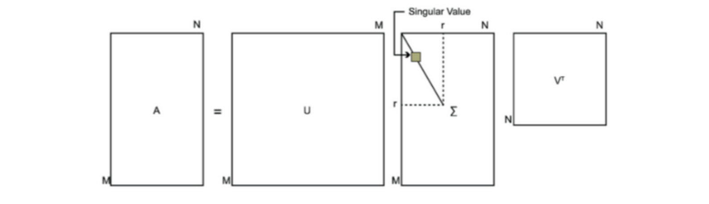
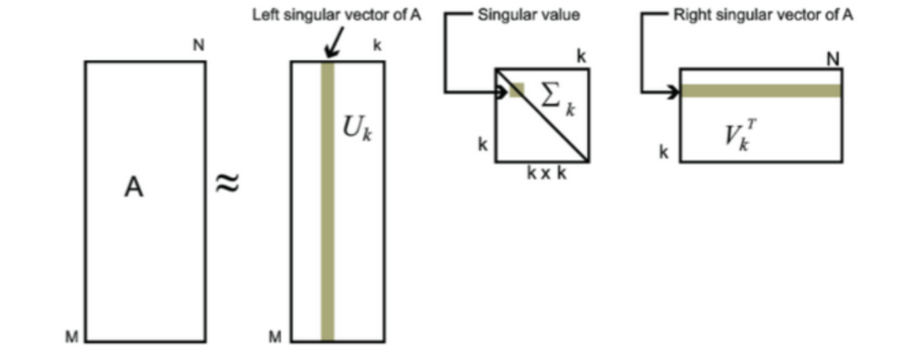

目录

- [特征值和特征向量](#特征值和特征向量)
- [SVD 介绍](#svd-介绍)
  - [SVD 简介](#svd-简介)
  - [SVD 定义](#svd-定义)
  - [SVD 示例](#svd-示例)
- [SVD 性质](#svd-性质)
- [SVD 在 PCA 中的应用](#svd-在-pca-中的应用)
- [SVD 总结](#svd-总结)
- [参考](#参考)

# 特征值和特征向量

特征值和特征向量的定义如下：

`$$A \mathbf{x} = \lambda \mathbf{x}$$`

其中：

* `$A$` 是一个 `$n\times n$` 矩阵
* `$\lambda$` 是矩阵 `$A$` 的一个特征值
* `$\mathbf{x}$` 是矩阵 `$A$` 的特征值 `$\lambda$` 对应的特征向量，`$\mathbf{x}$` 是一个 `$n$` 维向量

求出特征值和特征向量的目的是可以将矩阵 `$A$` 进行特征分解。
如果求出了矩阵 `$A$` 的 `$n$` 个特征值 `$\lambda_{1} \leq \lambda_{2} \leq \ldots, \lambda_{n}$`，
以及这 `$n$` 个特征值对应的特征向量 `$\omega_{1}, \omega_{2}, \ldots, \omega_{n}$`，那么，矩阵 `$A$` 就可以用以下的特征分解形式表示：

`$$A = W \Sigma W^{-1}$$`

其中：

* `$W$` 是 `$n$` 个特征向量所张成的 `$n \times n$` 维矩阵
* `$\Sigma$` 是 `$n$` 个特征值为主对角线的 `$n \times n$` 维矩阵

一般会把这 `$n$` 个特征向量标准化，即满足 `$||\omega_{i}||_{2} = 1$`，或者 `$\omega_{i}^{T}\omega = 1$`，
此时 `$W$` 的 `$n$` 个特征向量为标准正交基，满足 `$W^{T}W=I$`，即 `$W^{T} = W^{-1}$`，也就是说 `$W$` 为酉矩阵。
这样特征分解表达式可以写成：

`$$A = W \Sigma W^{T}$$`

注意到要进行特征分解，矩阵 `$A$` 必须为方阵。如果 `$A$` 不是方阵，即行和列不相同时，还可以对矩阵进行特征分解吗？
答案是可以，此时 SVD 就是针对这种情况的方案

# SVD 介绍

## SVD 简介

奇异值分解(Singular Value Decomposition，以下简称 SVD)是在机器学习领域广泛应用的算法，它不光可以用于降维算法中的特征分解，
还可以用于推荐系统，以及自然语言处理等领域。是很多机器学习算法的基石。本文就对 SVD 的原理做一个总结，
并讨论在在 PCA 降维算法中是如何运用运用 SVD 的

## SVD 定义

SVD 也是对矩阵进行分解，但是和特征分解不同，SVD 并不要求分解的矩阵为方阵。假设矩阵 `$A$` 是一个 `$m \times n$` 的矩阵，
那么定义矩阵 `$A$` 的 SVD 为：

`$$A = U \Sigma V^{T}$$`

其中：

* `$U$` 是一个 `$m \times m$` 的矩阵
* `$\Sigma$` 是一个 `$m \times n$` 的矩阵，除了主对角线上的元素以外，全为 0，主对角线上的每个元素都称为奇异值
* `$V$` 是一个 `$n \times n$` 的矩阵
* `$U$` 和 `$V$` 都是酉矩阵，即满足 `$U^{T}U = I$`，`$V^{T}V = I$`

下图可以很形象得看出上面 SVD 的定义：

如何求出 SVD 分解后的 `$U$`、`$\Sigma$`、`$V$` 这三个矩阵？

1. 如果将 `$A$` 的转置和 `$A$` 做矩阵乘法，那么会得到 `$n\times n$` 的一个方阵 `$A^{T}A$`。
   既然 `$A^{T}A$` 是方阵，那么就可以进行特征分解，得到的特征值和特征向量满足下式：

   `$$(A^{T}A)\upsilon_{i} = \lambda_{i}\upsilon_{i}$$`

    这样就可以得到矩阵 `$A^{T}A$` 的 `$n$` 个特征值和对应的 `$n$` 个特征向量 `$\upsilon$` 了。
    将 `$A^{T}A$` 的所有特征向量张成一个 `$n \times n$` 的矩阵 `$V$`，就是 SVD 公式里面的 `$V$` 矩阵了。
    一般将 `$V$` 中的每个特征向量叫做 `$A$` 的右奇异向量

2. 如果将 `$A$` 和 `$A$` 的转置做矩阵乘法，那么会得到 `$m×m$` 的一个方阵 `$AA^{T}$`。
   既然 `$AA^{T}$` 是方阵，那么就可以进行特征分解，得到的特征值和特征向量满足下式：

   `$$(AA^{T})u_{i}=\lambda_{i}u_{i}$$`

    这样就可以得到矩阵 `$AA^{T}$` 的 `$m$` 个特征值和对应的 `$m$` 个特征向量 `$u$` 了。
    将 `$AA^{T}$` 的所有特征向量张成一个 `$m×m$` 的矩阵 `$U$`，就是 SVD 公式里面的 `$U$` 矩阵了。
    一般将 `$U$` 中的每个特征向量叫做 `$A$` 的左奇异向量

3. 由于 `$\Sigma$` 除了对角线上是奇异值，其他位置都是 0，那么只需要求出每个奇异值 `$\sigma$` 就可以了。
   注意到：

   `$$A = U \Sigma V^{T}$$`
   `$$AV = U \Sigma V^{T}V$$`
   `$$AV = U \Sigma$$` 
   `$$A\upsilon_{i} = u_{i} \sigma_{i}$$`
   `$$\sigma_{i} = \frac{A \upsilon_{i}}{u_{i}} $$`

    这样就可以求出每个奇异值，进而求出奇异值矩阵 `$\Sigma$`

上面还有一个问题没有讲，就是 `$A^{T}A$` 的特征向量组成的就是 SVD 的 `$V$` 矩阵，
而 `$AA^{T}$` 的特征向量组成的就是 SVD 中的 `$U$` 的 `$U$` 矩阵，这个有什么根据吗？
这个其实很容易证明，以 `$V$` 矩阵的证明为例：

`$$A = U \Sigma V^{T}$$`  

`$$A^{T} = V \Sigma U^{T}$$`

`$$A^{T}A = V \Sigma U^{T} U \Sigma V^{T} = V \Sigma^{2} V^{T}$$`

上式证明使用 `$U^{T} U=I$`，`$\Sigma^{T}=\Sigma$`，
可以看出 `$A^{T}A$` 的特征向量组成的的确就是 SVD 中的 `$V$` 矩阵。
类似的方法可以得到 `$AA^{T}$` 的特征向量组成的就是 SVD 中的 `$U$` 矩阵

进一步，可以看出特征值矩阵等于奇异值矩阵的平方，也就是说特征值和奇异值满足如下关系：

`$$\sigma_{i}=\sqrt{\lambda_{i}}$$`

这样也就是说，可以不用 `$\sigma_{i}=\frac{A \upsilon_{i}}{u_{i}}$` 来计算奇异值，
也可以通过求出 `$A^{T}A$` 的特征值取平方跟来求奇异值

## SVD 示例

这里我们用一个简单的例子来说明矩阵是如何进行奇异值分解的。我们的矩阵 `$A$` 定义为：

`$$A = \begin{pmatrix}
0 & 1 \\
1 & 1 \\
1 & 0
\end{pmatrix}$$`

首先求出 `$A^{T}A$` 和 `$AA^{T}$`：

`$$A^{T}A= \begin{pmatrix}
0 & 1 & 1 \\
1 & 1 & 0
\end{pmatrix}
\begin{pmatrix}
0 & 1 \\
1 & 1 \\
1 & 0
\end{pmatrix} = \begin{pmatrix}
2 & 1 \\
1 & 2 
\end{pmatrix}$$`

`$$AA^{T} = \begin{pmatrix}
0 & 1 \\
1 & 1 \\
1 & 0
\end{pmatrix}
\begin{pmatrix}
0 & 1 & 1 \\
1 & 1 & 0
\end{pmatrix}
= \begin{pmatrix}
1 & 1 & 0 \\
1 & 2 & 1 \\
0 & 1 & 1
\end{pmatrix}$$`

进而求出 `$A^{T}A$` 的特征值和特征向量：

`$$\begin{cases}
\lambda_{1}=3 \\
\upsilon_{1} = \begin{pmatrix}
               1/\sqrt{2} \\
               1/\sqrt{2}
               \end{pmatrix}
\end{cases}$$`

`$$\begin{cases}
\lambda_{2}=1 \\
\upsilon_{2} = \begin{pmatrix}
                -1/\sqrt{2} \\
                1/\sqrt{2}
                \end{pmatrix}
\end{cases}$$`

接着求出 `$AA^{T}$` 的特征值和特征向量：

`$$\begin{cases}
\lambda_{1} = 3 \\
u_{1} = \begin{pmatrix}
        1/\sqrt{6} \\
        2/\sqrt{6} \\
        1/\sqrt{6}
        \end{pmatrix}
\end{cases}$$`

`$$\begin{cases}
\lambda_{2} = 1 \\
u_{2} = \begin{pmatrix}
        1/\sqrt{2} \\
        0 \\
        -1/\sqrt{2} \\
        \end{pmatrix}
\end{cases}$$`

`$$\begin{cases}
\lambda_{3} = 0 \\
u_{3} = \begin{pmatrix}
        1/\sqrt{3} \\
        -1/\sqrt{3} \\
        1/\sqrt{3}
        \end{pmatrix}
\end{cases}$$`

利用 `$A\upsilon_{i}=\sigma_{i}u_{i}, i= 1, 2, \ldots$` 求奇异值：

`$$\begin{pmatrix}
0 & 1 \\
1 & 1 \\
1 & 0 
\end{pmatrix}
\begin{pmatrix}
1/\sqrt{2} \\ 
1/\sqrt{2}
\end{pmatrix}
= \sigma_{1}\begin{pmatrix}
1/\sqrt{6} \\
2/\sqrt{6} \\
1/\sqrt{6}
\end{pmatrix} \Rightarrow \sigma_{1} = \sqrt{3}$$`

`$$\begin{pmatrix}
0 & 1 \\
1 & 1 \\
1 & 0 
\end{pmatrix}
\begin{pmatrix}
-1/\sqrt{2} \\ 
1/\sqrt{2}
\end{pmatrix}
= \sigma_{2}\begin{pmatrix}
1/\sqrt{2} \\
0 \\
-1/\sqrt{2}
\end{pmatrix} \Rightarrow \sigma_{2} = \sqrt{1}$$`

也可以用 `$\sigma_{i}=\sqrt{\lambda_{i}}$` 直接求出奇异值为 `$\sqrt{3}$` 和 `$1$`

最终得到 `$A$` 的奇异值分解为：

`$$A = U \Sigma V^{T} = 
\begin{pmatrix}
1/\sqrt{6} & 1/\sqrt{2} & 1/\sqrt{3} \\
2/\sqrt{6} & 0 & -1/\sqrt{3} \\
1/\sqrt{6} & -1/\sqrt{2} & 1/\sqrt{3}
\end{pmatrix}
\begin{pmatrix}
\sqrt{3} & 0 \\
0  & 1 \\
0 & 0 
\end{pmatrix}
\begin{pmatrix}
1/\sqrt{2} & 1/\sqrt{2} \\ 
-1/\sqrt{2} & 1/\sqrt{2} \\ 
\end{pmatrix}$$`

# SVD 性质

对于奇异值，它跟特征分解中的特征值类似，在奇异值矩阵中也是按照从大到小排列，而且奇异值的减少特别的快，
在很多情况下，前 10% 甚至 1% 的奇异值的和就占了全部的奇异值之和的 99% 以上的比例。
也就是说，也可以用最大的 `$k$` 个的奇异值和对应的左右奇异向量来近似描述矩阵，也就是说：

`$$\begin{align}
A_{m \times n} 
&= U_{m \times m} \Sigma_{m \times n} V_{n \times n}^{T} \\
& \approx U_{m \times k} \Sigma_{k \times k} V_{k \times n}^{T} 
\end{align}$$`

其中 `$k$` 要比 `$n$` 小很多，也就是一个大的矩阵 `$A$` 可以用三个小矩阵 `$U_{m \times k}$`、
`$\Sigma_{k \times k}$`、`$V_{k \times n}^{T}$` 来表示。如下图所示，
现在矩阵 `$A$` 只需要灰色的部分的三个小矩阵就可以近似描述了

由于这个重要的性质，SVD 可以用于 PCA 降维，来做数据压缩和去噪。也可以用于推荐算法，将用户和喜好对应的矩阵做特征分解，
进而得到隐含的用户需求来做推荐。同时也可以用于 NLP 中的算法，比如潜在语义索引(LSI)

# SVD 在 PCA 中的应用

PCA降维，需要找到样本协方差矩阵 `$X^{T}X$` 的最大的 `$d$` 个特征向量，
然后用这最大的 `$d$` 个特征向量张成的矩阵来做低维投影降维。可以看出，
在这个过程中需要先求出协方差矩阵 `$X^{T}X$`，当样本数多样本特征数也多的时候，
这个计算量是很大的

注意到 SVD 也可以得到协方差矩阵 `$X^{T}X$` 最大的 `$d$` 个特征向量张成的矩阵，
但是 SVD 有个好处，有一些 SVD 的实现算法可以不求先求出协方差矩阵 `$X^{T}X$`，也能求出右奇异矩阵 V。
也就是说，PCA 算法可以不用做特征分解，而是做 SVD 来完成。这个方法在样本量很大的时候很有效。
实际上，scikit-learn 的 PCA 算法的背后真正的实现就是用的 SVD，而不是认为的暴力特征分解

另一方面，注意到 PCA 仅仅使用了 SVD 的右奇异矩阵，没有使用左奇异矩阵，那么左奇异矩阵有什么用呢？

假设样本是 `$m \times n$` 的矩阵 `$X$`，
如果通过 SVD 找到了矩阵 `$XX^{T}$` 最大的 `$d$` 个特征向量张成的 `$m \times d$` 维矩阵 `$U$`，
则如果进行如下处理：

`$$X_{d \times n}^{'} = U_{d \times m}^{T} X_{m \times n}$$`

可以得到一个 `$d \times n$` 的矩阵 `$X‘$`，这个矩阵和原来的 `$m \times n$` 维样本矩阵 `$X$` 相比，
行数从 `$m$` 减到了 `$k$`，可见对行数进行了压缩：

* 左奇异矩阵可以用于行数的压缩
* 右奇异矩阵可以用于列数即特征维度的压缩，也就是 PCA 降维

# SVD 总结

SVD 作为一个很基本的算法，在很多机器学习算法中都有它的身影，特别是在现在的大数据时代，
由于 SVD 可以实现并行化，因此更是大展身手

SVD 的缺点是分解出的矩阵解释性往往不强，有点黑盒子的味道，不过这不影响它的使用

# 参考

* [奇异值分解(SVD)](https://zhuanlan.zhihu.com/p/29846048)
