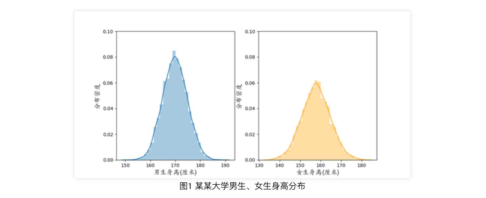
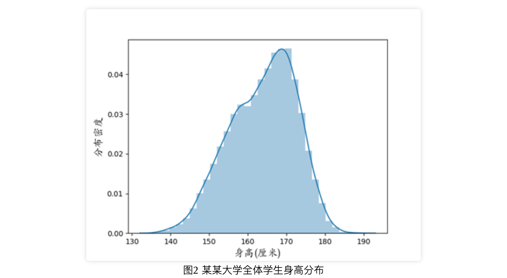
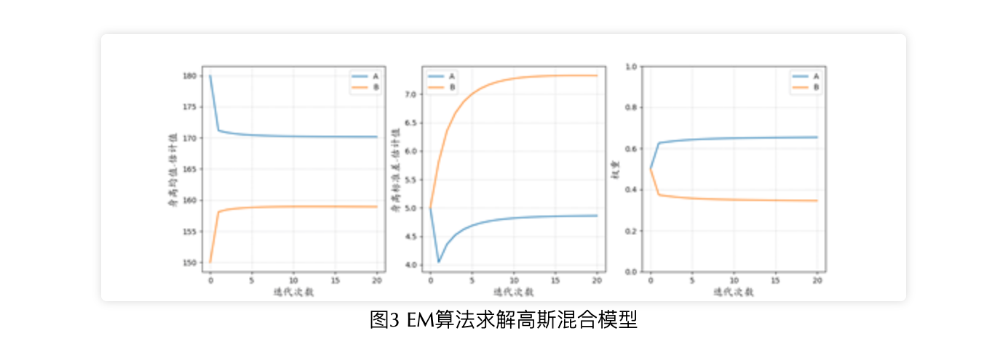
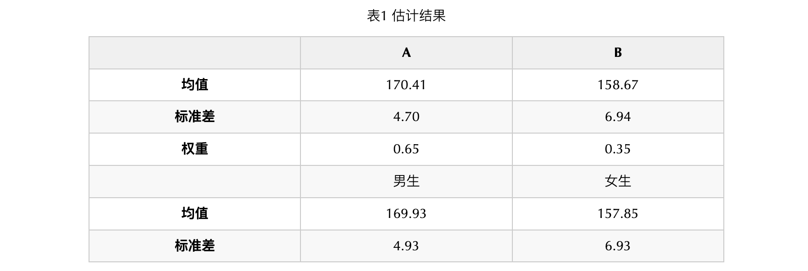
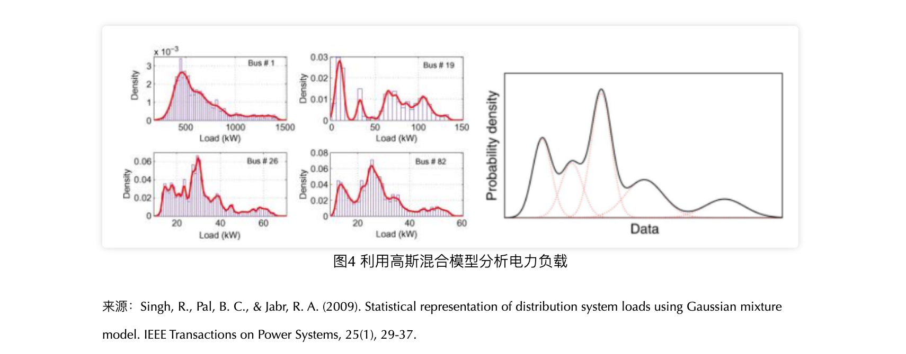
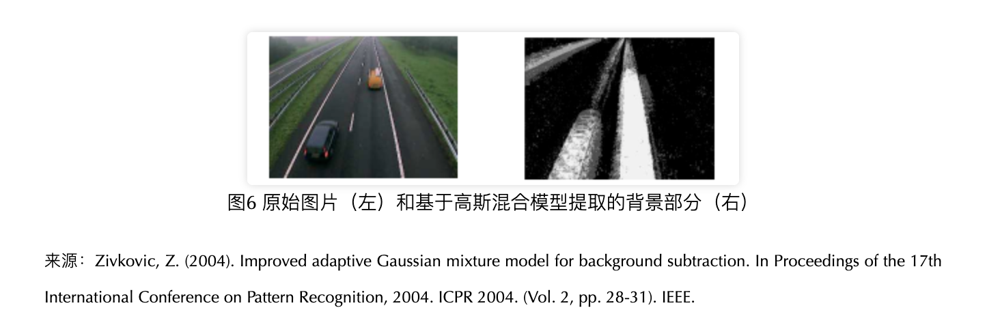
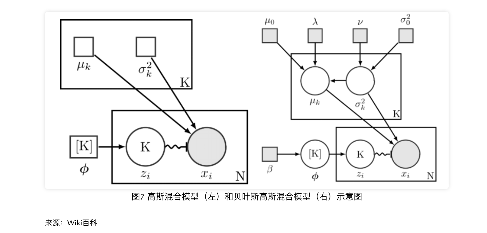
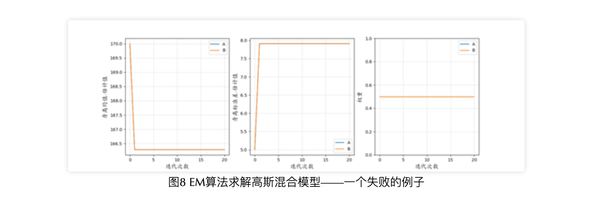

目录

- [高斯分布](#高斯分布)
- [高斯混合模型](#高斯混合模型)
- [高斯混合模型的 EM 求解](#高斯混合模型的-em-求解)
  - [E-setp expectation](#e-setp-expectation)
  - [M-step maximization](#m-step-maximization)
- [高斯混合模型的应用](#高斯混合模型的应用)
- [贝叶斯高斯混合模型](#贝叶斯高斯混合模型)
- [高斯混合模型的调优和拓展](#高斯混合模型的调优和拓展)
- [参考](#参考)

# 高斯分布

1733年，法国数学家棣莫弗在一个赌博问题的探索中首次发现了正态分布的密度公式，而后由德国数学家高斯将正态分布发扬光大。
高斯在拓展最小二乘法的工作中，引入正态分布作为误差分布，解决了对误差影响进行统计度量的问题，
为后世的参数估计、假设检验等一系列统计分析奠定了基础。高斯关于正态分布的工作对数理统计的发展做出了杰出的贡献，
因此正态分布也称为高斯分布 (Gaussian distribution)。值得说明的是，高斯分布并不是由高斯或棣莫弗“发明”的，
而是本身在自然界中大量存在的，它反映了大样本下数据分布的一种一般规律。例如向某某大学的男生、女生统计身高，
身高的分布大概如下图高斯分布所示，这样的分布在形态上有着明显的特征：单峰、对称、中间高两边低

在数据分析的课程学习中，高斯分布恐怕是我们打交道最多的分布了。它的密度函数公式为

`$$f(x|\mu, \sigma^{2}) = \frac{1}{\sqrt{2 \sigma^{2} \pi}}e^{-\frac{(x-\mu)^{2}}{2\sigma^{2}}}$$`

其中涉及两个参数：`$\mu$` 为均值，`$\sigma$` 为标准差。基于高斯分布的公式，如果知道了参数 `$\mu$` 和 `$\sigma$` 的真值，
那么任一个观测值对应的分布密度都可以显式地得到。反过来，当得到了 `$n$` 个观测值 `$x_{1}, x_{2}, \ldots, x_{n}$` 而参数 `$\mu$` 和 `$\sigma$` 未知时，
可以基于高斯分布的公式自然地得到似然函数

`$$L(\mu, \sigma^{2}) = \prod_{i=1}^{n}f(x|\mu, \sigma^{2})=\prod_{i=1}^{n}\frac{1}{\sqrt{2 \sigma^{2} \pi}}e^{\frac{(x_{i} - \mu)^{2}}{2 \sigma^{2}}}$$`

进而可以通过极大似然估计，得到相应的估计值：

`$$\hat{\mu}=\frac{1}{n}\sum_{i=1}^{n}x_{i}$$`
`$$\hat{\sigma}^{2}=\frac{1}{n}\sum_{i=1}^{n}(x_{i} - \hat{\mu})^{2}$$`

例如对上述男生女生身高的例子，可以通过极大似然估计得到男生身高的均值、标准差估计值分别为 169.93、4.93，女生身高的均值、
标准差估计值分别为 157.85、6.93。需要补充说明的是，之所以我们可以通过这样的方式来估计身高的均值、标准差，
一个非常重要的前提是关于男生、女生的身高我们已经确定了分布形式，在这个例子中即为高斯分布。而如果身高分布不是高斯分布，
是未知的其他形式，这样的估计方法则无法适用

让我们考虑一个更有挑战的场景：对某某大学的同学统计到了个身高观测值，
但是统计时没有记录性别，全体学生的身高分布如下图所示，此时如何估计男生、女生身高的均值、标准差？
这个分布看起来显然不够正态，而且我们不知道数据里哪些是男生的，哪些是女生的。虽然这个问题看起来棘手了不少，
但好在我们还有一条线索：这些数据是两类人群的观测混合而成，而每类人群的观测是服从高斯分布的。
接下来将要介绍的高斯混合模型(Gaussian Mixture Model)恰好能够完美解决这样的问题

# 高斯混合模型

高斯混合模型，望文生义，就是 “把高斯分布混合在一起”。它以高斯分布为基础，而在高斯分布上最大的拓展就是“混合”，
通过把多个不同参数的高斯分布混合在一起，从而达到拟合复杂的、一般的分布的效果

具体来说，假设有 `$K$` 个不同的高斯分布，
参数分别为 `$\mu_{1}, \mu_{2}, \ldots, \mu_{K}; \sigma_{1}^{2}, \sigma_{2}^{2}, \ldots, \sigma_{K}^{2}$`，
将这些参数简记为 `$\theta$`，那么可以用 `$K$` 个高斯分布的混合来描述一个新的分布，其密度函数为：

`$$f(x|\theta) = \sum_{k=1}^{K}\phi_{k}f(x|\mu_{k}, \sigma_{k}^{2})=\sum_{k=1}^{K}\phi_{k}\frac{1}{\sqrt{2 \sigma^{2}_{k} \pi}} e^{-\frac{(x - \mu_{k})^{2}}{2 \sigma_{k}^{2}}}$$`

其中 `$\phi_{1}, \phi_{2}, \ldots, \phi_{K}$` 为 `$K$` 个高斯分布对应的权重，满足 `$\sum_{k=1}^{K}\phi_{k} = 1$`。
这就是高斯混合模型

例如在刚才的例子里，若将男生、女生身高分布的均值、标准差参数分别记为 `$\mu_{1},\mu_{0}$`，
`$\sigma_{1}^{2}, \sigma_{0}^{2}$`，那么图 2 里的分布就可以表达为：

`$$f(x|\theta) = \phi_{1}\frac{1}{\sqrt{2 \sigma^{2}_{1} \pi}} e^{-\frac{(x - \mu_{1})^{2}}{2 \sigma_{1}^{2}}} + \phi_{0}\frac{1}{\sqrt{2 \sigma^{2}_{0} \pi}} e^{-\frac{(x - \mu_{0})^{2}}{2 \sigma_{0}^{2}}}$$`

如此一来身高分布又可以显式地表示出来了，那么用极大似然估计就可以估计身高分布的参数了。但仔细观察就会发现，
这个式子里多出来了未知的量：`$\phi_{0}$` 和 `$\phi_{1}$`。它们是男生、女生的身高分布在全体学生身高分布里的权重，
或者更直观地解释，对应于男生、女生在全体学生中占的比例。如果这两个比例不知道，还是没法估计我们关心的参数。
在这个问题里，每个同学的真实性别可视为“隐变量”(latent variable)，
即通过现有数据无法直接观测到的变量(这个变量由于记录的缺失而变得不可观测了)。解决这样含有隐变量的估计问题，
通常可以采用期望极大算法(Expectation Maximization, Dempster et al., 1977 )，即大名鼎鼎的 EM 算法

# 高斯混合模型的 EM 求解

> EM 算法，Expectation Maximization algorithm

EM 算法是 1977 年由 Dempster 等整理提出的一种迭代算法，可以处理含隐变量的极大似然估计问题。
如果把更新参数估计这件事类比为走路（空间位置的更新），EM 算法就好比人用两只脚交替地走路，左脚控制隐变量，
右脚控制参数估计，左脚站稳了迈右脚，右脚站稳了迈左脚，这样左一步右一步，步步为营，就可以到达终点，也就是最终收敛到的参数估计。
反过来，为什么有隐变量的时候一般的极大似然估计法难以适用？这就好比走路的时候，
两条腿绑在一起，可观测的信息和隐变量的信息区分不开，自然走不动

通常，观测数据加上隐变量构成的数据集称为完全数据 (complete data)。EM 算法的主要思想为，
在观测数据的似然函数中加入隐变量，将原本复杂、或难以表示的似然函数改写为关于完全数据的似然函数。
完全数据的似然函数常常能够让问题的描述形式变得更清晰。在高斯混合模型里，我们可以定义隐变量为：
每个观测和高斯成分之间的对应关系。对于第 `$i$` 个观测和第 `$k$` 个高斯成分(`$i=1, 2, \ldots, n, k = 1, 2, \ldots, K$`)，
隐变量记为 `$\gamma_{ik}$`，是一个 0/1 随机变量：若第 `$i$` 个观测服从第 `$k$` 个高斯成分的分布，
则 `$\gamma_{ik} = 1$`，否则 `$\gamma_{ik} = 0$`。例如对男女生身高分布的问题，可以定义隐变量为每个人的真实性别。
对第 `$i$` 个同学，`$i=1, 2, \ldots, n$`，用 `$\gamma_{i0}, \gamma_{i1}$` 表示 ta 的性别，
`$\gamma_{i0} = 1, \gamma_{i1}=0$` 表示男生，`$\gamma_{i0}=0, \gamma_{i1}=1$` 表示女生

将所有隐变量的集合记为 `$\gamma$`。加入隐变量后，高斯混合模型的完全数据似然函数可以写成

`$$L(\theta, \gamma) = \prod_{i=1}^{n}\prod_{k=1}^{K}\big[\phi_{k}f(x|\mu_{k}, \sigma_{k}^{2})\big]^{\gamma_{ik}}$$`

相应的对数似然记为

`$$l(\theta, \gamma) = \sum_{i=1}^{n}\sum_{k=1}^{K}\gamma_{ik}\big[ln \phi_{k} lnf(x|\mu_{k}, \sigma_{k}^{2})\big]$$`

然后，EM 算法将原本极大化似然函数的过程拆分成两个迭代执行的步骤。EM 算法迭代的次数记为 `$T$`，对第 `$t$` 次迭代，`$t=0,1,\ldots, T$`，
记当前参数估计为 `$\theta^{(t)}$`，其中 `$\theta^{(0)}$` 为初始的估计。那么在第 `$t$` 次迭代，
从当前参数估计 `$\theta^{(t)}$` 更新到 `$\theta^{(t+1)}$` 需要依次执行的 E-step 和 M-step 为：

## E-setp expectation

给定 `$\theta^{(t)}$` 时，求完全数据似然函数关于隐变量的期望，记为 `$Q(\theta, \theta^{(t)})$`，

`$$\begin{align}Q(\theta, \theta^{(t)})
&= E_{\gamma}[l(\theta, \gamma|\theta^{(t)})]\\
&= \sum_{i=1}^{n}\sum_{k=1}^{K}E(\gamma_{ik} | x_{i}, \theta^{(t)})[ln \phi_{k} + ln f(x | \mu_{k}, \sigma_{k}^{2})]
\end{align}$$`

和上文的似然函数相比，可以发现这里唯一的区别是将隐变量 `$\gamma_{ik}$` 替换为了 `$\theta^{(t)}$` 下的条件期望。
将的条件期望简记为 `$E(\gamma_{ik}|x_{i}, \theta^{(t)})$`，可通过条件概率计算：

`$$\begin{align}
\hat{\gamma}_{ik}
&= E(\gamma_{ik} | x_{i}, \theta^{(t)}) \\
&= P(\gamma_{ik} = 1 | x_{i}, \theta^{(t)}) \\
&= \frac{P(\gamma_{ik} = 1, x_{i} | \theta^{(t)})}{\sum_{k=1}^{K}P(\gamma_{ik} = 1, x_{i} | \theta^{(t)})} \\
&= \frac{P(x_{i}|\gamma_{ik} = 1, \theta^{(t)})P(\gamma_{ik} = 1 | \theta^{(t)})}{\sum_{k=1}^{K}P(x_{i} | \gamma_{ik} = 1, \theta^{(t)})P(\gamma_{ik}=1|\theta^{(t)})} \\
&= \frac{\phi_{k}^{(t)}f(x_{i}|\mu_{k}^{(t)}, \sigma_{k}^{2(t)})}{\sum_{k=1}^{K}\phi_{k}^{(t)}f(x_{i}| \mu_{k}^{(t)}, \sigma_{k}^{2(t)})}
\end{align}$$`

E-step 通俗可以这样理解：固定住对参数的估计，先更新对 `\gamma$` 的估计（右脚不动，迈左脚）

## M-step maximization

最大化 `$Q(\theta, \theta^{(t)})$`，从而更新参数估计，即 `$\theta^{(t+1)} = arg \underset{\theta}{max}Q(\theta, \theta^{(t)})$`。
为求解这个最大化问题，可令 `$Q(\theta, \theta^{(t)})$` 关于 `$\mu_{k}, \sigma_{k}^{2}, \phi_{k}, k =1, 2, \ldots, K$` 的偏导数为 0 来得到，
并考虑到条件 `$\sum_{k=1}^{K}\phi_{k} = 1$`，通过拉格朗日乘子法将约束条件和 `$Q(\theta, \theta^{(t)})$` 合在一起进行优化。求解得到的结果为

`$$\mu_{k}^{(t+1)} = \frac{\sum_{i=1}^{n}\hat{\gamma}_{ik} x_{i} }{\sum_{i=1}^{n}\hat{\gamma}_{ik}}$$`

`$$\sigma_{k}^{2(t+1)} = \frac{\sum_{i=1}^{n}\hat{\gamma}_{ik}(x_{i} - \mu_{k}^{(t+1)})^{2}}{\sum_{i=1}^{n}\hat{\gamma}_{ik}}$$`

`$$\phi_{k}^{(t+1)} = \frac{\sum_{i=1}^{n}\hat{\gamma}_{ik}}{n}$$`

M-step 通俗来说即是：固定住对 `$\gamma$` 的估计，更新对参数 `$\theta$` 的估计（左脚不动，迈右脚）

这样重复执行 E-step 和 M-step，直至参数估计收敛，即可得到 EM 算法的最终估计值。以男女生身高数据为例，
可尝试用包含两个高斯成分的高斯混合模型来建模全体学生的身高。将这两个高斯成分记为 A、B，并对 A 和 B 的参数给出大概的初始估计：
A 的均值、标准差初始估计为 180、5，权重为 0.5；B 的均值、标准差初始估计为 150、5，权重也为 0.5。
需要补充说明的是，这里应用 EM 算法是在估计高斯混合模型的参数，而不是对每个观测进行分类，判别来自男生还是女生，
因此 A 和 B 并不能直接判断哪个是男生身高的分布、哪个是女生身高的分布。实际上，EM 算法解决高斯混合模型的估计，
和聚类问题更相似，并且实际上高斯混合模型加 EM 算法的组合确实在聚类中应用广泛。图 3 展示了 20 次迭代中，参数估计的变化情况。
可以看到经过 20 次迭代，所有参数已经各自收敛到了稳定的水平。最终收敛的结果如表 1 所示。表 1 中还列出了先前对男生、
女生身高分别采用极大似然估计的结果。通过对比可以得到这样的结论：

1. EM 算法估计得到的 A、B 分别和男生身高、女生身高的分布高度接近，这说明 EM 算法在这个例子里很好地解决了混合模型的估计问题，
   并且 A 分布推测是男生身高分布，而 B 分布应该是女生身高分布
2. 根据估计得到的副产物 `$\hat{\gamma}_{ik}$`，我们可以判断每个同学的身高是更可能来自 A 分布还是更可能来自 B 分布，
   从而可以将所有同学划分成对应 A、B 的两部分，即对全体同学进行聚类
3. 估计得到 A、B 分布的权重为 0.65:0.35，接近 2:1，所以这所大学大概率是一所工科学校

# 高斯混合模型的应用

高斯混合模型在许多领域有着广泛应用。许多复杂的分布都可以用高斯混合模型来拟合

例如 Singh et al. (2009) 应用高斯混合模型来近似电力负载的分布，为电力网络的分析和调度优化提供数据支持。

Wang et al. (2011) 使用高斯混合模型结合多维传递函数来建模三维的体积数据，如图 5 所示，
对 CT 扫描的零件、骨骼等能够很好地区分不同形态特征的区块

在图像处理、计算机视觉中，高斯混合模型可用于区分背景和运动的物体，实现背景提取、
目标检测(Zivkovic, 2004; Singh, 2016; Cho et al., 2019)。
图 6 是一个典型的例子：一个摄像头持续监控一片区域，那么背景部分的像素值应该相对稳定，变化不大，
而运动目标对应的像素值在拍摄的不同帧之间应该变动剧烈。因此可以用高斯混合模型对像素值的分布进行建模，
然后对拍摄到的每一帧，都可以计算所有像素关于各个高斯成分的权重系数。若一个像素的权重系数在不同帧之间出现剧烈变化，
那么这个像素对应的应该是运动目标，反之则对应静态的背景。可以看到在图6中，
基于高斯混合模型的方法能够识别出公路两侧为背景区域，而公路的车道是运动目标出现的位置。
需要补充说明的是，在图像的高斯混合模型中，每个高斯成分都是2维的，和身高数据中一维的场景不同。
在多维的高斯混合模型中，需要估计的高斯分布参数为均值向量和协方差矩阵，可类似一维时的求解，应用 EM 算法来迭代地估计

高斯混合模型一方面实现了对复杂分布的建模，另一方面也对所有的观测样本提供了一种基于高斯成分的向量表达，
这种表达方式可以用于更多一般性的聚类、分类场景中。当 `$K$` 个高斯成分的参数估计完毕时，
每个样本i也可以通过关于 `$K$` 个成分的系数向量来表示 `$(\hat{\gamma}_{i1}, \hat{\gamma}_{i2}, \ldots, \hat{\gamma}_{ik})$`。
基于系数向量，可以应用 K-means 等方法进行聚类，
或者结合其他的标签信息进行分类。更多在此基础上衍生的算法可参考 Melnykov & Maitra (2010)关于基于混合模型的聚类算法作的讨论。
Scrucca et al. (2016) 开发了基于高斯混合模型的聚类算法包 `mclust`，在 R 中即可方便地调用，在此大力推荐

# 贝叶斯高斯混合模型

在上面的高斯混合模型示例中，各个高斯成分的权重、均值等信息都作为固定但未知的参数来进行估计，属于频率学派的视角。
而从贝叶斯学派的角度来看，高斯成分的权重和参数应当视为随机变量，取值并不是固定的。进而，可以对这些参数设置先验分布，
并根据数据观测确定相应的后验分布，得到最大后验估计。图 7 直观显示了非贝叶斯的高斯混合模型和贝叶斯高斯混合模型的架构差异，
图中方块表示固定的参数，圆表示随机变量，空白的元素表示对应的值是未知的，灰色的元素表示值是已知的。
在贝叶斯框架下，每个高斯混合模型参数的值都是在分布上抽样得到，而不是来自一个固定的参数。
例如对高斯成分的均值 `$\mu_{1}, \mu_{2}, \ldots, \mu_{K}$`，可以指定一个高斯分布作为先验分布 `$N(\mu_{0}, \lambda)$`，
从而 `$\mu_{1}, \mu_{2}, \ldots, \mu_{K} \sim N(\mu_{0}, \lambda)$`。
对标准差也可类似地指定一个高斯分布 `$N(\sigma_{0}^{2})$` 作为先验分布。
对权重，则可指定一个参数 `$\beta$` 为的迪利克雷分布作为先验分布。这里指定的先验分布均为共轭分布，
即先验分布和加入似然后的后验分布具有同样的类型（例如先验分布为高斯分布，加入观测到的数据信息后，后验分布也是一个高斯分布），
采用共轭分布能够使后验分布的计算大大简化

对贝叶斯高斯混合模型的估计，在 EM 算法之外，通常可采用 Markov chain Monte Carlo (MCMC) 方法来近似计算后验分布，
主要思路为迭代地抽样数据，产生一个 Markov 链，并且使该 Markov 链的平稳分布和目标后验分布相同，那么通过大量迭代，
就可以近似模拟后验分布的表现。在 MCMC 中具体的每次迭代里，可应用 Gibbs 采样方法或 Metropolis-Hastings 方法，
通过基于当前估计值的条件分布来抽样数据。类似前面提到EM算法的“两步交替前进”，在 MCMC 估计贝叶斯高斯混合模型时，
对隐变量和参数（此时视为随机变量）的抽样也是交替进行，并产生隐变量和参数的两个抽样链条，通过这两个链收敛到的平稳分布，
即可近似计算相应的后验估计。关于贝叶斯高斯混合模型，可以参考 Robert (1996) 在著作《Markov Chain Monte Carlo in Practice》中的综述，
Mengersen et al. (2010) 的著作《Mixtures: Estimation and Applications》。值得注意的是，
通过贝叶斯框架来审视高斯混合模型，能够带来“翻天覆地”的新知。例如，在贝叶斯高斯混合模型中，
我们的关注点已经从“用若干个高斯分布的混合来拟合数据”转变为了“探索拟合数据的后验分布”。
而从先验分布、似然、再到后验分布的方式建模时，限制高斯成分的个数并不是非常必要。
Rasmussen (1999) 在计算机领域顶会 NIPS 上就曾提出基于贝叶斯框架的无限高斯混合模型(infinite Gaussian mixture model)，
去掉了关于高斯成分个数的限制

# 高斯混合模型的调优和拓展

男生女生身高的估计显示了一个成功使用EM算法求解高斯混合模型的例子，但这样的成功可能是非常“脆弱”的。
例如，算法的开始我们对所有参数赋予了初始估计值，即确定了初始状态，实际上初始状态的选择对最后算法收敛到的结果是有影响的。
图 8 即是一个失败的例子：初始状态设置为 A 和 B 的均值估计相同，结果使得算法收敛结果为A和B两组无法区分开（对应的曲线完全重叠），
参数估计陷入失败。这也启发我们，一个良好的初始状态应当使得不同组的初始参数尽可能有差异。
为此，一个常用的方法是先对全体观测到的样本用 K-means 粗略聚成多个簇，以不同簇的簇中心作为初始的参数估计，
从而让 EM 算法从一个比较分散的初始状态开始

初始状态如果选择不当，EM 算法求得的结果很可能陷入局部最优解，尤其是在初始状态和真实参数偏离很远时。
对此，可采用改进的EM算法。例如确定性退火 EM 算法(Ueda & Nakano, 1998)，它在 EM 算法中加入了模拟退火机制，
使得参数估计在每次迭代更新时能够在一定范围内波动，从而有几率跳出局部最优解

此外，高斯成分个数的选择也对结果有很大影响。例如在上面的例子里，我们知道设置 2 个高斯成分，聚成 2 类是最理想的，
能够对应上男生、女生两类群体。如果高斯成分个数设置成更大的数值，结果恐怕就很难解释了。
同时，Chen (1995) 指出，混合模型中成分的个数设置为多少，是估计模型分布的关键。给定 `$n$` 个样本，如果恰好已知最佳的成分个数，
那么估计的收敛速度可达 `$n^{-1/2}$`，而如果最佳成分个数未知，那么最好的收敛速度也只有 `$n^{-1/2}$`。
如何选择合适的成分个数可以归属到模型选择的范畴。可以想象，随着高斯成分个数的不断增长，模型会越来越复杂，
拟合数据的能力越来越强，在似然函数取值上得到更好的表现。但这样会使得模型越来越复杂，出现大量冗余的参数。
对此可利用适当的评价准则来辅助判断。例如可采用 BIC 准则(Schwarz, 1978)选择高斯成分个数 `$K$`。
给定 `$K$`，BIC 取值为 `$BIC(K)=-2ln(L) + pln(n)$`，其中 `$L$` 为采用 `$K$` 为成分个数时，
代入估计结果后的似然函数值，`$p$` 为需要估计的参数个数，与 `$K$` 的大小相关。
BIC 综合考察了似然函数和参数个数，BIC 越小，模型成立的可能性越大，同时参数个数不至于过多，相应的更适合作为高斯成分个数

关于选择合适的高斯成分个数，另一个有效的方式是通过似然比检验（likelihood ratio test）来判断。
对一个包含 `$K$` 个成分的高斯混合模型，可以定义它的阶 `$K_{0}$`，它是满足下述条件的最小的 `$K$`：模型对数据分布拟合较好、
各成分之间没有重复的成分、混合模型里所有成分的权重都不为 0。如果能够找到 `$K_{0}$`，那么 `$K_{0}$` 将可作为合适的高斯成分个数。
对需要检验的 `$K$`，似然比检验的原假设可设置为 `$H_{0}: K = K_{0}$`，
备择假设可设置为 `$H_{1}: K=K_{1}(K_{1} > K_{0})$` 或对 `$K$` 不加限制。然而在高斯混合模型中，
似然比检验通常需要的标准正则条件无法完全满足，因此原假设对应的零分布、检验的 `$p$` 值都无法直接给出(Hartigan, 1985)。
对此，实践中通常采用重采样（例如 Bootstrap）的方法来估计似然比检验需要的零分布，
并计算 `$p$` 值(McLachlan, 1987; Tibshirani et al., 2001)。
Chen et al. (2004) 对原假设为 `$K_{0} =2$` 的情形提出了一种调整后的似然比检验，并给出近似的零分布，简化了 `$p$` 值的计算，
便于实际应用。Aitkin & Rubin (1985) 则基于贝叶斯框架，对成分权重引入先验分布，也能够使零分布的估计变得简化。
上述工作关注于如何选择合适的高斯成分个数，事实上还存在另一种思路：在EM迭代估计的过程中，
动态调整高斯成分的个数。Ueda et al. (2000)提出 split and merge EM (SMEM)，在 EM 算法的迭代更新中，
动态将部分高斯成分合并成一个，或者将一个高斯成分替换成若干个。该方法中高斯成分的总个数时不变的。
Zhang et al. (2004) 在此基础上提出一种 Competitive EM 算法，它在EM算法的迭代中以似然函数为标杆，
也能够分裂或者合并高斯成分，同时对高斯成分的个数不做限制，可以自动选择使当前似然函数值最大化的高斯成分个数

最后，既然高斯分布可以作为混合模型的基本成分，那么其他的分布是否也可以用来构建混合模型呢？答案是肯定的。
Weibull 分布、t 分布、对数高斯分布、Gamma 分布，甚至不限定形式的任意分布函数，都可以用于混合模型。
关于这样更为一般性的混合分布，可参考 McLachlan et al.(2019)对有限混合模型的综述。
虽然多种分布形式都可以用于有限混合模型的建模，但高斯混合模型无疑是混合模型中最常见、最实用的一类。
这得益于高斯分布的优良数学性质。Li & Barron (1999) 指出，若考察所有高斯混合分布函数构成的集合，
以及所有分布函数组成的集合，那么L1度量下，前者在后者中是稠密的。因而，对任意一个未知的分布密度函数，
都可以用一组高斯成分的混合来估计。高斯混合模型的优良性质和计算上的便捷奠定了它在各种数据分析、
数据挖掘任务中难以动摇的地位

# 参考

* [浅谈高斯混合模型](https://mp.weixin.qq.com/s/9qRGoDS9npqyLwAfKRu-zQ)
