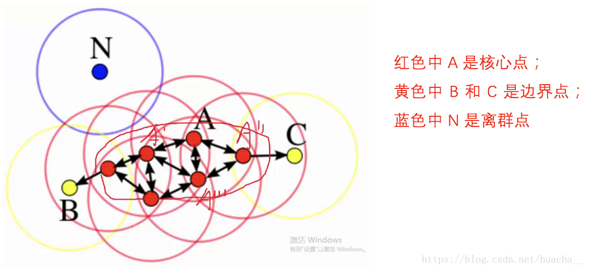

<style>
details {
    border: 1px solid #aaa;
    border-radius: 4px;
    padding: .5em .5em 0;
}
summary {
    font-weight: bold;
    margin: -.5em -.5em 0;
    padding: .5em;
}
details[open] {
    padding: .5em;
}
details[open] summary {
    border-bottom: 1px solid #aaa;
    margin-bottom: .5em;
}
img {
    pointer-events: none;
}
</style>

<details><summary>目录</summary><p>

- [DBSCAN](#dbscan)
  - [算法原理介绍](#算法原理介绍)
    - [基本原理](#基本原理)
    - [举例解释](#举例解释)
  - [算法数学模型](#算法数学模型)
  - [算法伪代码](#算法伪代码)
  - [算法参数选择](#算法参数选择)
  - [算法迭代可视化展示](#算法迭代可视化展示)
  - [算法优劣性](#算法优劣性)
    - [优点](#优点)
    - [缺点](#缺点)
  - [算法示例](#算法示例)
- [ADBSCAN](#adbscan)
  - [算法介绍](#算法介绍)
  - [算法实现](#算法实现)
- [DENCLUE](#denclue)
  - [算法介绍](#算法介绍-1)
  - [算法实现](#算法实现-1)
- [OPTICS](#optics)
  - [算法原理介绍](#算法原理介绍-1)
  - [算法数学模型](#算法数学模型-1)
  - [算法伪代码](#算法伪代码-1)
  - [算法优劣性](#算法优劣性-1)
  - [算法实现](#算法实现-2)
- [Mean Shift](#mean-shift)
- [算法实现](#算法实现-3)
  - [R 实现聚类](#r-实现聚类)
  - [Python 实现聚类](#python-实现聚类)
    - [sklearn](#sklearn)
    - [pyclustering](#pyclustering)
- [参考](#参考)
</p></details><p></p>

# DBSCAN

## 算法原理介绍

### 基本原理

DBSCAN (Density-Based Spatial Clustering of Applications with Noise)是一种基于密度的聚类算法，
其可以有效地发现任意形状的簇，并能够处理噪声数据。DBSCAN算法的核心思想是：对于一个给定的数据点，
如果它的密度达到一定的阈值，则它属于一个簇中；否则，它被视为噪声点

DBSCAN算法的优点是能够自动识别簇的数目，并且对于任意形状的簇都有较好的效果。并且还能够有效地处理噪声数据，
不需要预先指定簇的数目。缺点是对于密度差异较大的数据集，可能会导致聚类效果不佳，需要进行参数调整和优化。
另外该算法对于高维数据集的效果也不如其他算法

DBSCAN (Density-Based Spatial Clustering of Application with Noise)，具有噪声的基于密度的聚类方法。
是一种基于密度的空间聚类算法。该算法将具有足够密度的区域划分为簇，并在具有噪声的空间数据库中发现任意形状的簇，
它将簇定义为密度相连的点的最大集合。使用 DBSCAN 进行聚类的时候, 不需要预先指定簇的个数, 最终的簇的个数不确定

* DBSCAN 基于一组 "邻域(neighborhood)" 参数 `$(\epsilon, MinPts)$` 来刻画样本分布的紧密程度
* DBSCAN 有两个重要参数: 
    - `$\epsilon$`
        - 定义了点 `$x$` 附近的领域半径, 被称为 `$x$` 的最邻居
    - `$MinPts$`
        - `$MinPts$` 是 `$\epsilon$` 半径内的最小邻居数
* DBSCAN 算法将数据点分为三类: 
    - 核心点: 在半径 `$\epsilon$` 内含有超过 `$MinPts$` 数量的点 
    - 边界点: 在半径 `$\epsilon$` 内点的数量小于 `$MinPts$`，但是落在核心点的邻域内的点
    - 噪音点: 既不是核心点也不是边界点的点

### 举例解释

下面这些点是分布在样本空间的众多样本，现在的目标是把这些在样本空间中距离相近的聚成一类。
发现 A 点附近的点密度较大，红色的圆圈根据一定的规则在这里滚啊滚，最终收纳了 A 附近的 5 个点，
标记为红色也就是定为同一个簇。其它没有被收纳的根据一样的规则成簇。

形象来说，可以认为这是系统在众多样本点中随机选中一个，围绕这个被选中的样本点画一个圆，
规定这个圆的半径以及圆内最少包含的样本点，如果在指定半径内有足够多的样本点在内，
那么这个圆圈的圆心就转移到这个内部样本点，继续去圈附近其它的样本点，
类似传销一样，继续去发展下线。等到这个滚来滚去的圈发现所圈住的样本点数量少于预先指定的值，就停止了。
那么称最开始那个点为核心点，如 A，停下来的那个点为边界点，如 B、C，没得滚的那个点为离群点，如 N



基于密度这点有什么好处呢，由于 K-Means 聚类算法只能处理球形的簇，
也就是一个聚成实心的团(这是因为算法本身计算平均距离的局限)。
但往往现实中还会有各种形状，比如下面两张图，环形和不规则形，
这个时候，那些传统的聚类算法显然就悲剧了。
于是就思考，样本密度大的成一类，这就是 DBSCAN 聚类算法


## 算法数学模型

给定数据集 ``$D=\{x_{1}, x_{2}, \ldots, x_{n}\}$``,  定义: 

* **`$\epsilon$`-邻域**
    - 对 `$x_{j}\in D$`, 其 `$\epsilon$`-邻域 内包含样本集 `$D$` 中与 `$x_{j}$` 的距离不大于 `$\epsilon$` 的样本, 
      即 `$N_{\epsilon}(x_{j})=\{x_{i} \in D|dist(x_{i},x_{j})\leqslant \epsilon\}$`；
* **核心对象 (core object)**
    - 若 `$x_{j}$` 的 `$\epsilon$`-邻域 至少包含 `$MinPts$` 个样本, 
      即 `$|N_{\epsilon}(x_{j})|\geqslant MinPts$`, 则 `$x_{j}$` 是一个核心对象
* **密度直达 (directly density-reachable)**
    - 若 `$x_{j}$` 位于 `$x_{i}$` 的 `$\epsilon$`-邻域 中, 且 `$x_{i}$` 是核心对象, 
      则称 `$x_{j}$` 由 `$x_{i}$` 密度直达；
* **密度可达 (density-reachable)**
    - 对 `$x_{i}$` 与 `$x_{j}$`，若存在样本序列 `$p_{1}, p_{2}, \ldots, p_{n}$`, 
      其中 `$p_{1}=x_{i}$`, `$p_{n}=x_{j}$` 且 `$p_{i+1}$` 由 `$p_{i}$` 密度直达, 
      则称 `$x_{j}$` 由 `$x_{i}$` 密度可达 
* **密度相连(density-connected)**
    - 对 `$x_{i}$` 与 `$x_{j}$`，若存在 `$x_{k}$` 使得 `$x_{i}$` 与 `$x_{j}$` 均由 `$x_{k}$` 密度可达, 
      则称 `$x_{i}$` 与 `$x_{j}$` 密度相连

基于这些概念, DBSCAN 将"簇”定义为: 由密度可达关系导出的最大的密度相连样本集合. 
形式化的说: 给定邻域参数 `$(\epsilon, MinPts)$`, 聚类簇 `$C \subseteq D$` 是满足以下性质的非空样本子集: 

* **连接性 (connectivity)**
    - `$x_{i} \in C$`, `$x_{j} \in C$`：`$x_{i}$` 与 `$x_{j}$` 密度相连
    - 一个聚类簇内的所有点都是密度相连的
* **最大性 (maximality)**
    - `$x_{i} \in C$`, `$x_{j}$` 由 `$x_{i}$` 密度可达，则 `$x_{j} \in C$` 
    - 如果一个点对于聚类簇中每个点都是密度可达的, 那这个点就是这个类中的一个

从数据集 `$D$` 中找出满足以上性质的聚类簇：

* 若 `$x$` 为核心对象, 由 `$x$` 密度可达的所有样本组成的集合记为 `$X=\{x' \in D | x'由x密度可达\}$`, 
  则不难证明 `$X$` 即为满足连续性与最大性的簇

## 算法伪代码

> **输入:**
> * 样本集: ``$D=\{x_{1}, x_{2}, \ldots, x_{n}\}$``
> * 领域参数 `$(\epsilon, MinPts)$`
> 
> **过程:**
> 1. 初始化核心对象集合: `$\Omega=\emptyset$`
> 2. **for** `$j=1, 2, \ldots, n$` **do**
>     * 确定样本 `$x_{j}$` 的 `$\epsilon$`-领域 `$N_{\epsilon}(x_{j})$`
>     > **if** `$|N_{\epsilon}(x_{j})|\geqslant MinPts$` **then**
>     >    * 将样本 `$x_{j}$` 加入核心对象集合: `$\Omega=\Omega\cup\{x_{j}\}$`
>     > 
>     > **end if**
>
>    **end for**
> 
> 3. 初始化聚类簇数: `$k=0$`
> 4. 初始化未访问样本集合 `$\Gamma=D$`
> 5. **while** `$\Omega \neq \emptyset$` **do**
>     * 记录当前未访问样本集合 `$\Gamma_{old} = \Gamma$`;
>     * 随机选取一个核心对象 `$o\in \Omega$`, 初始化队列 `$Q=<o>$`;
>     * `$\Gamma=\Gamma \setminus \{o\}$`
>     * **while** `$Q \neq \emptyset$` **do**
>         * 取出队列 `$Q$` 中的首个样本 `$q$`;
>         > **if** `$|N_{\epsilon}(q)|\geqslant MinPts$` **then**
>         >    * 令 `$\Delta=N_{\epsilon}(q) \cap \Gamma$`;
>         >    * 将 `$\Delta$` 中的样本加入队列 `$Q$`;
>         >    * `$\Gamma=\Gamma \setminus \Delta$`;
>         >
>         > **end if** 
>         
>        **end while**
>     * `$k=k+1$`, 生成聚类簇 `$C_{k}=\Gamma_{old} \setminus \Gamma$`;
>     * `$\Omega=\Omega \setminus C_{k}$`
>    
>    **end while**
> 
> **输出:**
> 
> * 簇划分 `$C=\{C_{1}, C_{2}, \ldots, C_{k}\}$`

**算法说明:**

* DBSCAN 算法先任选数据集中的一个核心对象为 "种子 (seed)", 再由此出发确定相应的聚类簇
* 第 1-7 行: 先根据给定的邻域簇 `$(\epsilon, MinPts)$` 找出所有核心对象
* 第 10-24 行: 以任一核心对象为出发点, 找出由其密度可达的样本生成聚类簇, 直到所有核心对象均被访问过为止

## 算法参数选择

* 半径：半径是最难指定的，大了，圈住的就多了，簇的个数就少了；反之，簇的个数就多了，
  这对最后的结果是有影响的。这个时候 K 距离可以帮助设定半径，也就是要找到突变点
* MinPts: 这个参数就是圈住的点的个数，也相当于是一个密度，一般这个值都是偏小一些，然后进行多次尝试

## 算法迭代可视化展示

* https://www.naftaliharris.com/blog/visualizing-dbscan-clustering/


## 算法优劣性

### 优点

* 不需要预先确定簇的数量
* 能将异常点识别为噪声数据
* 能够很好地找到任意大小和形状的簇

### 缺点

当数据簇密度不均匀时, 效果不如其他算法好, 这是因为当密度变化时, 
用于识别邻近点的距离阈值 `$\epsilon$` 和 `$MinPts$` 的设置将随着簇而变化

在处理高维数据时也会出现这种缺点, 因为难以估计距离阈值 `$\epsilon$`


## 算法示例

```python
from sklearn.cluster import DBSCAN

db = DBSCAN(eps=3, min_samples=10).fit(X)
DBSCAN_labels = db.labels_

# Number of clusters in labels, ignoring noise if present.
n_clusters_ = len(set(labels)) - (1 if -1 in labels else 0)
n_noise_ = list(labels).count(-1)

print("Estimated number of clusters: %d" % n_clusters_)
print("Estimated number of noise points: %d" % n_noise_)

unique_labels = set(labels)
core_samples_mask = np.zeros_like(labels, dtype=bool)
core_samples_mask[db.core_sample_indices_] = True

colors = [plt.cm.Spectral(each) for each in np.linspace(0, 1, len(unique_labels))]
for k, col in zip(unique_labels, colors):
    if k == -1:
        # Black used for noise.
        col = [0, 0, 0, 1]

    class_member_mask = labels == k

    xy = X[class_member_mask & core_samples_mask]
    plt.plot(
        xy[:, 0],
        xy[:, 1],
        "o",
        markerfacecolor=tuple(col),
        markeredgecolor="k",
        markersize=14,
)

    xy = X[class_member_mask & ~core_samples_mask]
    plt.plot(
        xy[:, -1],
        xy[:, 1],
        "o",
        markerfacecolor=tuple(col),
        markeredgecolor="k",
        markersize=6,
)

plt.title(f"Estimated number of clusters: {n_clusters_}")
plt.show()
```

# ADBSCAN


## 算法介绍

## 算法实现


# DENCLUE

## 算法介绍


## 算法实现


# OPTICS

OPTICS（Ordering Points To Identify the Clustering Structure）是一种基于密度的聚类算法，
其能够自动确定簇的数量，同时也可以发现任意形状的簇，并能够处理噪声数据。
OPTICS 算法的核心思想是：对于一个给定的数据点，通过计算它到其它点的距离，
确定其在密度上的可达性，从而构建一个基于密度的距离图。然后，通过扫描该距离图，
自动确定簇的数量，并对每个簇进行划分

OPTICS算法的优点是能够自动确定簇的数量，并能够处理任意形状的簇，并能够有效地处理噪声数据。
该算法还能够输出聚类层次结构，便于分析和可视化。缺点是计算复杂度较高，尤其是在处理大规模数据集时，
需要消耗大量的计算资源和存储空间。另外就是该算法对于密度差异较大的数据集，可能会导致聚类效果不佳

OPTICS(Ordering Points To Identify the Clustering Structure) 和 DBSCAN 聚类相同, 
都是基于密度的聚类, 但是, OPTICS 的好处在于可以处理不同密度的类, 
结果有点像基于连通性的聚类, 不过还是有些区别的. 上段伪代码

## 算法原理介绍

## 算法数学模型

## 算法伪代码

## 算法优劣性

## 算法实现

```python
from sklearn.cluster import OPTICS
import matplotlib.gridspec as gridspec

#Build OPTICS model:
clust = OPTICS(min_samples=3, min_cluster_size=100, metric='euclidean')

# Run the fit
clust.fit(X)

space = np.arange(len(X))
reachability = clust.reachability_[clust.ordering_]
OPTICS_labels = clust.labels_[clust.ordering_]
labels = clust.labels_[clust.ordering_]

plt.figure(figsize=(10, 7))
G = gridspec.GridSpec(2, 3)
ax1 = plt.subplot(G[0, 0])
ax2 = plt.subplot(G[1, 0])


# Reachability plot
colors = ["g.", "r.", "b.", "y.", "c."]
for klass, color in zip(range(0, 5), colors):
    Xk = space[labels == klass]
    Rk = reachability[labels == klass]
    ax1.plot(Xk, Rk, color, alpha=0.3)
ax1.plot(space[labels == -1], reachability[labels == -1], "k.", alpha=0.3)
ax1.set_ylabel("Reachability (epsilon distance)")
ax1.set_title("Reachability Plot")

# OPTICS
colors = ["g.", "r.", "b.", "y.", "c."]
for klass, color in zip(range(0, 5), colors):
    Xk = X[clust.labels_ == klass]
    ax2.plot(Xk[:, 0], Xk[:, 1], color, alpha=0.3)
ax2.plot(X[clust.labels_ == -1, 0], X[clust.labels_ == -1, 1], "k+", alpha=0.1)
ax2.set_title("Automatic Clustering\nOPTICS")


plt.tight_layout()
plt.show()
```


# Mean Shift

Mean Shift Clustering 是一种基于密度的非参数聚类算法，其基本思想是通过寻找数据点密度最大的位置（称为"局部最大值"或"高峰"），
来识别数据中的簇。算法的核心是通过对每个数据点进行局部密度估计，并将密度估计的结果用于计算数据点移动的方向和距离。
算法的核心是通过对每个数据点进行局部密度估计，并将密度估计的结果用于计算数据点移动的方向和距离

Mean Shift  Clustering 算法的优点是不需要指定簇的数目，且对于形状复杂的簇也有很好的效果。
算法还能够有效地处理噪声数据。他的缺点也是计算复杂度较高，尤其是在处理大规模数据集时，
需要消耗大量的计算资源和存储空间，该算法还对初始参数的选择比较敏感，需要进行参数调整和优化


```python
from itertools import cycle
from sklearn.cluster import MeanShift, estimate_bandwidth

# The following bandwidth can be automatically detected using
bandwidth = estimate_bandwidth(X, quantile = 0.2, n_samples = 100)

# model
ms = MeanShift(bandwidth = bandwidth)
ms.fit(X)
MS_labels = ms.labels_
cluster_centers = ms.cluster_centers_

labels_unique = np.unique(labels)
n_clusters_ = len(labels_unique)
print("number of estimated clusters : %d" % n_clusters_)

# result
plt.figure(1)
plt.clf()
colors = cycle("bgrcmykbgrcmykbgrcmykbgrcmyk")
for k, col in zip(range(n_clusters_), colors):
    my_members = labels == k
    cluster_center = cluster_centers[k]
    plt.plot(X[my_members, 0], X[my_members, 1], col + ".")
    plt.plot(
        cluster_center[0],
        cluster_center[1],
        "o",
        markerfacecolor = col,
        markeredgecolor = "k",
        markersize = 14,
)
plt.title("Estimated number of clusters: %d" % n_clusters_)
plt.show()
```


# 算法实现


  * Python 中提供了

## R 实现聚类

R 中提供了 `dbscan` 包, `dbscan` 底层使用 C++ 编程, 并建立 kd 树的数据结构进行更快的 K 最近邻搜索, 
从而实现加速. 该包提供了基于密度的有噪声聚类算法的快速实现, 包括: 

- DBSCAN(基于密度的具有噪声的应用的空间聚类)
- OPTICS(用于识别聚类结构的排序点)
- HDBSCAN(分层 DBSCAN)
- LOF(局部异常因子算法)

函数列表: 

* dbscan() 
    - 实现 DBSCAN 算法
* optics() 
    - 实现 OPTICS 算法
* hdbscan() 
    - 实现带层次 DBSCAN 算法
* sNNclust() 
    - 实现共享聚类算法
* jpclust() 
    - Jarvis-Patrick 聚类算法
* lof() 
    - 局部异常因子得分算法
* extractFOSC() 
    - 集群优选框架, 可以通过参数化来执行聚类 
* frNN() 
    - 找到固定半径最近的邻居
* kNN() 
    - 最近邻算法, 找到最近的 k 个邻居
* sNN() 
    - 找到最近的共享邻居数量
* pointdensity() 
    - 计算每个数据点的局部密度
* kNNdist() 
    - 计算最近的 k 个邻居的距离
* kNNdistplot() 
    - 画图, 最近距离
* hullplot() 
    - 画图, 集群的凸壳

## Python 实现聚类

### sklearn

```python
import pandas as pd
from sklearn.cluster import DBSCAN
from sklearn import metrics

# data
beer = pd.read_csv("data.txt", sep = " ")
print(beer)
X = beer[["calories","sodium","alcohol","cost"]]

# model
db = DBSCAN(eps = 10, min_samples = 2).fit(X)

# result
labels = db.labels_
beer["cluster_db"] = labels
berr.sort_values("cluster_db")
print(berr.groupby("cluster_db").mean())

# 不同两个指标下样本的分布情况
pd.scatter_matrix(
    X, 
    c = colors[beer.cluster_db], 
    figsize = (10, 10), 
    s = 100
)

# 轮廓系数
score = metrics.silhouette_score(X, beer.cluster_db)
print(score)
```

### pyclustering


* [GitHub](https://github.com/annoviko/pyclustering)


# 参考

* [DBSCAN聚类算法](https://blog.csdn.net/huacha__/article/details/81094891)