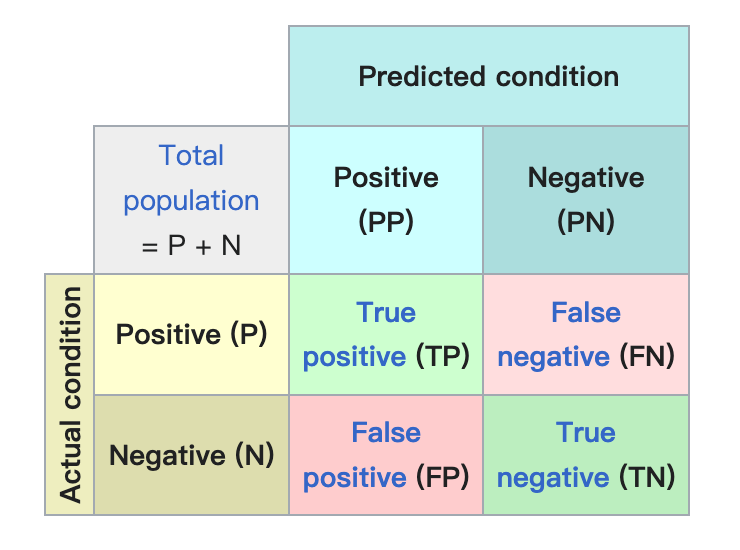
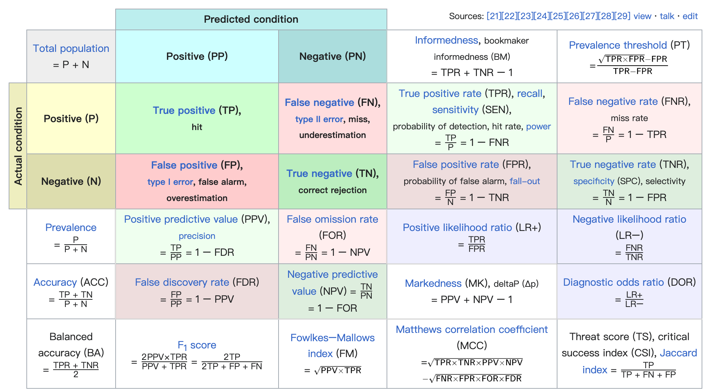

<style>
details {
    border: 1px solid #aaa;
    border-radius: 4px;
    padding: .5em .5em 0;
}
summary {
    font-weight: bold;
    margin: -.5em -.5em 0;
    padding: .5em;
}
details[open] {
    padding: .5em;
}
details[open] summary {
    border-bottom: 1px solid #aaa;
    margin-bottom: .5em;
}
</style>

<details><summary>目录</summary><p>

- [二分类](#二分类)
  - [混淆矩阵](#混淆矩阵)
  - [错误率和准确率](#错误率和准确率)
    - [错误率](#错误率)
    - [准确率](#准确率)
    - [损失函数](#损失函数)
  - [查准率和查全率以及 F1](#查准率和查全率以及-f1)
    - [查准率](#查准率)
    - [查全率](#查全率)
    - [F1](#f1)
    - [举例](#举例)
    - [损失函数](#损失函数-1)
  - [Log Loss](#log-loss)
    - [定义](#定义)
    - [损失函数](#损失函数-2)
  - [混淆矩阵 以及 ROC 和 AUC](#混淆矩阵-以及-roc-和-auc)
    - [ROC](#roc)
    - [AUC](#auc)
    - [损失函数](#损失函数-3)
  - [Normalized Gini Coefficient](#normalized-gini-coefficient)
    - [定义](#定义-1)
    - [损失函数](#损失函数-4)
    - [实现](#实现)
- [多分类](#多分类)
  - [Categorization Accuracy](#categorization-accuracy)
    - [准确率](#准确率-1)
    - [损失函数](#损失函数-5)
  - [Multi Class Log Loss](#multi-class-log-loss)
    - [Log Loss](#log-loss-1)
    - [损失函数](#损失函数-6)
  - [MAP-Mean Average Precision](#map-mean-average-precision)
    - [MAP](#map)
    - [损失函数](#损失函数-7)
  - [Mean F1](#mean-f1)
    - [Mean F1](#mean-f1-1)
    - [损失函数](#损失函数-8)
  - [Average Jaccard Index](#average-jaccard-index)
    - [Jaccard Index](#jaccard-index)
    - [损失函数](#损失函数-9)
- [回归](#回归)
  - [RMSE](#rmse)
  - [MSE](#mse)
    - [定义](#定义-2)
    - [损失函数](#损失函数-10)
  - [MAE](#mae)
  - [RMSLE](#rmsle)
  - [MAPE](#mape)
- [时间序列预测](#时间序列预测)
  - [MAPE](#mape-1)
  - [WMAPE](#wmape)
  - [SMAPE](#smape)
- [排序](#排序)
- [聚类](#聚类)
  - [Rank Index](#rank-index)
  - [Mutual Information based scores](#mutual-information-based-scores)
  - [Homogeneity, completeness and V-measure](#homogeneity-completeness-and-v-measure)
  - [Fowlkes-Mallows scores](#fowlkes-mallows-scores)
  - [Silhouette Coefficient](#silhouette-coefficient)
  - [Calinski-Harabasz Index](#calinski-harabasz-index)
  - [Davies-BouIdin Index](#davies-bouidin-index)
  - [Contingency Matrix](#contingency-matrix)
  - [Pair Confusion Matrix](#pair-confusion-matrix)
- [参考](#参考)
</p></details><p></p>

在机器学习或者深度学习领域，我们在为待解决的问题生成预测模型后，
需要对这个模型对未知数据的泛化性能进行评估，
性能度量方法就是评估模型泛化能力的评价标准

# 二分类

## 混淆矩阵

混淆矩阵：



混淆矩阵及其相关指标：



## 错误率和准确率

错误率和精度是分类任务中最常用的两种性能度量，适用于二分类和多分类

### 错误率

> * Error Rate：错误率
> * 错误率是分类错误的样本数占样本总数的比例

定义：

`$$E(f; D)=\frac{1}{N}\sum_{i=1}^{N}I(f(x_{i}) \neq y_{i})$$`

`$$ErrorRate(\hat{y}_{i}, y_{i})=\frac{1}{N}\sum_{i=1}^{N}I(\hat{y}_{i} \neq y_{i})$$`

其中：

* `$I(\cdot)$` 为示性函数
* `$N$` 为测试样本个数
* `$y_{i} \in \{0, 1\}$` 表示样本 `$i$` 对应的真实标签
* `$\hat{y}_{i}\in \{0, 1\}$` 表示样本 `$i$` 对应的预测结果

### 准确率

> * Accuracy：准确率
> * 精度则为分类正确的样本数占样本总数的比例

定义：

`$$E(f; D)=\frac{1}{N}\sum_{i=1}^{N}I\Big(f(x_{i}) = y_{i}\Big)$$`

`$$Accuracy(\hat{y}_{i}, y_{i}) = \frac{1}{N}\sum_{i=1}^{N}I(\hat{y}_{i} = y_{i})$$`

其中：

* `$I(\cdot)$` 为示性函数
* `$N$` 为测试样本个数
* `$y_{i} \in \{0, 1\}$` 表示样本 `$i$` 对应的真实标签
* `$\hat{y}_{i}\in \{0, 1\}$` 表示样本 `$i$` 对应的预测结果

### 损失函数

针对准确率问题，目前常采用的损失函数为 Binary Log Loss/Binary Cross Entropy，其数学形式如下：

`$$LogLoss = -\frac{1}{N}\sum_{i=1}^{N}\Big(y_{i}log p_{i} + (1 - y_{i})log(1 - p_{i})\Big)$$`

其中：

* `$p_{i}$` 为模型对第 `$i$` 个样本的预测概率

## 查准率和查全率以及 F1

> * Precision：查准率、精度
> * Recall：查全率、召回率
> * F1：F1 Measure / F1 Score

错误率和精度并不能满足所有任务中的需求。如在信息检索中，
经常会关心“检索出的信息中有多少比例是用户感兴趣的”(Precision)、
“用户感兴趣的信息中有多少被检索出来了”(Recall)。
需要查准率(Precision)和查全率(Recall)来进行此类需求的性能度量

二分类问题中，将样例根据真实类别与分类器预测类别的组合，
可以分为真正例(true positive)、假正例(false positive)、
真反例(true negative)和假反例(false negative)四种情形，
即 TP、FP、TN、FN，显然有 TP + FP + TN + FN = 样例总数

### 查准率

根据混淆矩阵，查准率 Precision 的定义为：

`$$Precision = \frac{TP}{TP + FP}$$`

查准率是对于自己模型的预测而言的，它表示在所有预测的正例中预测正确的比例，即真正例的比例。
想提高查准率，可以只对自己有信心预测正确的样本进行预测，假如模型预测出一个正例而且为真正例，
其查准率为 100%，而预测 10 个正例其中有 9 个真正例，其查准率则为 90%。
所以有句话怎么说的来着？多说多错，少说少错，不说不错。当然，这里只是体现一下思想

在信息检索中，查准率也可以看成是检索出来的条目(文档、网页)有多少是准确的(准确的定义为所关心的正好被检索出来)

`$$Precision = \frac{某类被正确分类的关系实例个数}{被判定为某类的关系实例总数}$$`

### 查全率

根据混淆矩阵，查准率 Recall 的定义为：

`$$Recall = \frac{TP}{TP + FN}$$`

查全率是对于真实答案而言的，它表示预测出的真正例覆盖了多少原样本的正例。
体现了“宁可错杀千人，不可放过一个”的思想，就算是找遍全天下所有人，也要把目标找出来。
把目标名单里所有人都找到，就成功了(查全率高)，而不在乎找错了多少人

在信息检索中，查全率也可以看成是所有准确的条目有多少被检索出来了：

`$$Recall = \frac{某类被正确分类的关系实例个数}{测试集中某类的关系实例总数}$$`

### F1

可以看出，查准率和查全率其实是矛盾的。想提高查准率就要谨慎判断每一个抓到的人是不是该杀的目标，
杀错一个就会降低查准率；而想提高查全率就要把每一个抓到的疑似目标都杀掉，
这样虽然可能会误杀很多人但是放过目标的概率会比较低。所以为了平衡查准率和查全率，
提出​ `$F1$` 度量，其是基于查准率与查全率的调和平均定义的

`$$\frac{1}{F1} = \frac{1}{2} \cdot (\frac{1}{Precision} + \frac{1}{Recall})$$`

转换为：

`$$F1 = \frac{2 \times Precision \times Recall}{Precision + Recall} = \frac{2 \times TP}{样例总数 + TP - TN}$$`

在特定的应用场景中，对查准率和查全率的重视程度会有所不同。
如商品推荐系统中，为尽可能少打扰用户，更希望推荐内容是用户感兴趣的，
此时查准率比较重要；而在逃犯信息检索系统中，更希望尽可能少漏点逃犯，
此时查全率更重要。由此我们引入​ `$F1$` 度量的一般形式 `$F_{\alpha}$`​ 

`$$F_{\alpha} = \frac{(\alpha^{2}+1)Precision \times Recall}{(\alpha^{2} \times Precision) + Recall}$$`

其中：

* `$\alpha, \alpha>0$` 度量了查全率(Recall)对查准率(Precision)的相对重要性
* `$\alpha = 1$` 时为标准 `$F1$`
* `$\alpha > 1$` 时查全率(Recall)有更大的影响
* `$0 < \alpha < 1$` 时查准率(Precision)有更大的影响

### 举例

举个例子，某池塘有 1400 条鲤鱼，300 只虾，300 只鳖。
现在以捕鲤鱼为目的，撒一大网，逮着 700 条鲤鱼，200 只虾，100 只鳖，
那么 Precision, recall, F1 分别如下：

`$$Precision = \frac{700}{700 + 200 + 100}=70\%$$`

`$$Recall = \frac{700}{1400} = 50\%$$`

`$$F1 = \frac{2 \times 70\% \times 50\%}{70\% + 50\%} = 58.3\%$$`

不妨看看如果把池子里的所有的鲤鱼、虾和鳖都一网打尽，这些指标又有何变化：

`$$Precision = \frac{1400}{1400 + 300 + 300}=70\%$$`

`$$Recall = \frac{1400}{1400} = 100\%$$`

`$$F1 = \frac{2 \times 70\% \times 100\%}{70\% + 100\%} = 82.35\%$$`

由此可见，查准率(Precision)是评估捕获的成果(被判定为关心的类别样本)中目标成果(关心的类别样本)所占的比例；
召回率(Recall)就是从关注领域(关心的类别样本)中，召回目标类别(被判定为关心的类别中关心的类别)的比例；
F1 值则综合这两者指标的评估指标，用于综合反映整体领域的指标

### 损失函数

和准确率指标优化类似，此处使用 Binary Cross Entropy 进行优化即可，
不同之处在于，在得到最终的预测概率之后，需要通过一些策略寻找最优阈值

还有的时候会对损失函数进行加权优化；例如标签为 1 的样本的权重就设置大一些等

## Log Loss

### 定义

`$$LogLoss = -\frac{1}{N}\sum_{i=1}^{N}\Big(y_{i}log p_{i} + (1 - y_{i})log(1 - p_{i})\Big)$$`

其中：

* `$p_{i}$` 为模型对第 `$i$` 个样本的预测概率

### 损失函数

因为 Logloss 是可以直接进行优化的函数，一般我们会直接基于 LogLoss 函数进行优化

## 混淆矩阵 以及 ROC 和 AUC

二分类问题中，很多分类器​会生成一个预测概率，然后将预测概率与分类阈值(threshold)进行比较，
若大于阈值则分为正类，否则为反类。若分类阈值为 0.5，预测概率结果在 `$[0, 1]$`，
然后将这个值与 0.5 进行比较，若大于 0.5 判为正例，否则判为反例。

### ROC


根据预测结果，可以将样本进行排序，将模型认为最可能是正例的样本(预测概率最高)排在最前面，
模型认为最不可能是正例的样本排在最后，这样一来，分类过程就可以看作某个截断点将样本一分为二，
前一部分为正例，后一部分为反例。排序本身质量的好坏基本体现了模型泛化性能的好坏，
ROC 曲线就是从这个角度出发来研究学习器泛化性能的。

ROC 全称为“受试者工作特征”(Receiver Operating Characteristic)，把排好顺序的样本逐个作为正例进行预测，
每次预测得到两个值：真正例率(True Positive Rate, TPR)、假正例率(False Positive Rate, FPR)，
分别定义如下：

`$$TPR = \frac{TP}{TP + FN}$$`

`$$FPR = \frac{FP}{TN + FP}$$`

然后以​ FPR 为横坐标，​ TPR 为纵坐标，得到当前情况的坐标点，直至最后，
然后将所有的点连线就得到了​ ROC 曲线

> 下面详细描述一下​曲线的画法：现有 20 个样本，正例 10 个，反例 10 个，正例用 `$P$` 表示，反例用 `$​N$` 表示，
> 模型预测出每个样本为正例的概率，然后从高到低进行排序，如下：
> 
> `$P1, P2, P3, N1, P4, N2, P5, P6, P7, N3, N4, N5, P8, N6, P9, N7, N8, N9, P10, N10$`
> 
> 需要从上面 20 个样本得到 22 个坐标点
> 
> * 第一个是 `$(0, 0)$`，即将分类的阈值设为最大，这样所有的样例均预测为反例，TPR 和 FPR 均为 0
> * 然后将分类阈值依次设为每个样例的预测值，即 `$P1$` 为正例，其他为反例，
>   此时​，​，所以第二个坐标为 `$(0, \frac{1}{10})$`
> * 依次向后，得到坐标点 `$(0, \frac{2}{10})$`、`$(0, \frac{3}{10})$`、`$(\frac{1}{10}, \frac{3}{10})$`、
>   `$(\frac{1}{10}, \frac{4}{10})$`...
> * 第 22 个坐标为 `$(1,1)$` ，即所有样本均预测为正例：`$TPR = 1$`，`$FPR = 1$`

理论上来讲，无限个样本可以绘出圆滑的 ROC 曲线，而现实中通常是利用有限个样本来绘制 ROC 曲线，
生成的是有棱角的近似曲线

将之前得到坐标点的方法进行归纳：有​ `$m^{+}$` 个正例和​ `$m^{-}$` 个反例，
按预测为正例的概率大小排好序后，设前一个标记点坐标为 `$(x, y)$`，若当前为真正例，
则坐标为​ `$(x, y + \frac{1}{m^{+}})$`；若当前为假例，则坐标为 `$(x+\frac{1}{m^{-}}, y)$`


直观理解，随机猜测的​ ROC 曲线应该是 `$y = x$` 直线。若 ROC 曲线在此直线上面，
即向上走得比向右走得“快”，真正例率大于假正例率，说明模型比随机猜测好，
大部分正例都排在反例的前面，预测模型较好。若有新的​ ROC 曲线可以完全包括之前的 ROC 曲线，
则新模型的性能要优于原来的模型。如果两个​ ROC 曲线有交叉部分，
我们就需要计算​曲线下的面积大小来判断哪个模型的性能优越了

### AUC

ROC 曲线下的面积被称为​ AUC(Area Under ROC Curve)，
它可以通过相邻两个坐标点与 `$x$`​ 轴形成的矩形或梯形的面积累加得到。
之所以存在梯形，是因为如果有几个预测概率相同的正反样例，
把哪个排前面哪个排后面都不太好，就用其形成的矩形的对角线来表示这几个正反样例的 ROC 曲线

所以可以用如下公式来计算​ AUC，矩形也是一种特殊的梯形，
所以直接用梯形求和公式来计算两个坐标点与 `$x$`轴形成的面积。`$x_{i} - x_{i-1}$` 是梯形的高，
​`$y_{i-1}$` 和 `$y_{i}$` ​分别为梯形的上底和下底

`$$AUC = \sum_{i = 2}^{m}\frac{(x_{i} - x_{i-1})\times (y_{i} + y_{i-1})}{2}$$`

​ 
AUC 值其实是一个概率值，当随机挑选出一个正样本和负样本对，
当前的分类算法根据计算得到的 Score 值将这个正样本排在负样本前面的概率就是 AUC 值， 
AUC 值越大，当前分类算法越有可能将正样本排在负样本前面，从而能够更好地分类。
最理想的情况就是所有的正样本全部在负样本前面，这样就可以以其分界线作为阈值将正负样本完全分开，
这是最好的模型情况，`$AUC = 1$`

有一点需要特别声明，​AUC 只能用来做二分类模型的性能度量，而且当正负样本不均衡时效果不理想。
生成坐标时向上走一步​ `$\frac{1}{m^{+}}$`，向右走一步 `$\frac{1}{m^{-}}$`，
若​ `$m^{+}$` 与​ `$m^{-}$` 相差比较大，比如​ `$m^{+}$` 远大于 `$m^{-}$`，
则​ ROC 曲线向上走得要比向右走得快，更有可能被判断为性能好的模型，
但其实只是因为正负样本不均衡造成的

AUC 的数值都不会大于 1。又由于 ROC 曲线一般都处于 `$y=x$` 这条直线的上方，
所以 AUC 的取值范围在 0.5 和 1 之间。AUC 越接近 1.0，检测方法真实性越高。
等于 0.5 时，一般就无太多应用价值了

### 损失函数

最为常见的还是基于 LogLoss 函数的优化

## Normalized Gini Coefficient

### 定义

`$$Gini = 2 \times AUC - 1$$`

### 损失函数

LogLoss

### 实现

```python
from sklearn.metrics import roc_auc_score
import numpy as np 


def gini(actual, pred, cmpcol = 0, sortcol = 1):
    assert (len(actual) == len(pred))
    all = np.asarray(np.c_[actual, pred, np.arange(len(actual))], dtype=np.float)
    all = all[np.lexsort((all[:, 2], -1 * all[:, 1]))]
    totalLosses = all[:, 0].sum()
    giniSum = all[:, 0].cumsum().sum() / totalLosses

    giniSum -= (len(actual) + 1) / 2.
    return giniSum / len(actual)


def gini_normalized(actual, pred):
    return gini(actual, pred) / gini(actual, actual)

p = np.array([0.9, 0.3, 0.8, 0.75, 0.65, 0.6, 0.78, 0.7, 0.05, 0.4, 0.4, 0.05, 0.5, 0.1, 0.1]) 
y = np.array([1, 1, 1, 1, 1, 1, 0, 0, 0, 0, 0, 0, 0, 0, 0])

2 * roc_auc_score(y_score = p, y_true = y) - 1
gini_normalized(actual = y, pred = p)
```

# 多分类

## Categorization Accuracy

### 准确率

定义：

`$$logloss = -\frac{1}{N}\sum_{i=1}^{N}I(y_{i} = p_{i})$$`

其中：

* `$N$` 为测试样本的个数
* `$y_{i}$` 为第 `$i$` 个样本的类别标签
* `$p_{i}$` 为预测的第 `$i$` 个样本的类别

### 损失函数

`$$Loss = -\frac{1}{N}\sum_{i=1}^{N}\sum_{j=1}^{K} y_{i,k}log(p_{i,k})$$`

其中：

* `$y_{i,k}$` 表示第 `$i$` 个样本标签为 `$k$` 的情况，
  如果标签为 `$k$` 则是 1，反之为 0
* `$p_{i,k}$` 表示模型预测第 `$i$` 个样本属于 `$k$` 的概率

## Multi Class Log Loss

### Log Loss

定义：

`$$logloss = -\frac{1}{N}\sum_{i=1}^{N}\sum_{i=1}^{N}\sum_{i=1}^{M}y_{i,j}log(p_{i,j})$$`

其中：

* `$N$` 为测试样本的个数
* `$M$` 为类标签的个数

### 损失函数

针对准确率问题，目前常采用的损失函数为 Multiclass Log Loss，其数学形式如下：

`$$logloss = -\frac{1}{N}\sum_{i=1}^{N}\sum_{i=1}^{N}\sum_{i=1}^{M}y_{i,j}log(p_{i,j})$$`

其中：

* `$N$` 为测试样本的个数
* `$M$` 为类标签的个数

## MAP-Mean Average Precision

### MAP

定义：

`$$MAP = \frac{1}{|U|}\sum_{u=1}^{|U|}\frac{1}{min(A, m)}\sum_{k=1}^{min(n, A)}P(k)$$`

其中：

* `$|U|$` 为用户的个数
* `$P(k)$` 为在截止点 `$k$` 处的精度(Precision)
* `$n$` 是预测物品的数量
* `$M$` 是给定用户购买物品的数量，如果 `$M=0$`，则精度定义为 0

### 损失函数

使用 Sigmoid Cross Entropy，注意与其它常用的多分类损失函数的区别

## Mean F1

### Mean F1

定义：

`$F1 = \frac{2pr}{p+r}$`

其中：

* `$p = \frac{tp}{tp+fp}$`
* `$r = \frac{tp}{tp+fn}$`

### 损失函数

Mean Square Loss


## Average Jaccard Index

### Jaccard Index

两个区域 A 和 B 的 Jaccard Index 可以表示为：

`$$Jaccard = \frac{TP}{TP + FP + FN} = \frac{A \cap B}{A \cup B} = \frac{|A \cap B|}{|A| + |B| - |A \cap B|}$$`

其中：

* `$TP$` 表示 True Positive 的面积
* `$FP$` 表示 False Positive 的面积
* `$FN$` 表示 False Negative 的面积

### 损失函数

Sigmoid

# 回归

## RMSE

> Root Mean Square Error

RMSE 可以直接优化的函数，一般默认选用平方损失函数进行优化即可，很多工具包里面也称之为 L2 损失

## MSE

> Mean Square Error

### 定义

`$$E(f; D) = \frac{1}{N}\sum_{i=1}^{N}\Big(f(x_{i}) - y_{i}\Big)$$`

`$$MSE(y_{i}, \hat{y}_{i}) = \frac{1}{N}\sum_{i=1}^{N}\Big(\hat{y}_{i} - y_{i}\Big)$$`

### 损失函数

回归问题的性能度量方法与其常用的损失函数一样，都是均方误差。
MSE 是可以直接优化的函数，所以直接默认选用平方损失函数进行优化即可，很多工具包里面也称之为 L2 损失

## MAE

> Mean Absolute Error

MAE 在诸多工具包中也已经有对应的优化函数，直接使用即可，有些包中也会称之为 L1 损失函数

## RMSLE

> Root Mean Squared Logarithmic Error

先对数据做 log1p 转化，然后使用 L2 损失函数直接求解即可

## MAPE

> Mean Absolute Percentage Error

如果采用神经网络对此类问题进行优化，可以直接自己定义 MAPE 的 Loss

# 时间序列预测

在指标方面，作为一个回归问题，可以使用 MAE，MSE 等方式来计算。
但这类 metric 受到具体预测数值区间范围不同，
展现出来的具体误差值区间也会波动很大。比如预测销量可能是几万到百万，
而预测车流量可能是几十到几百的范围，那么这两者预测问题的 MAE 可能就差距很大，
很难做多个任务间的横向比较。所以实际问题中，
经常会使用对数值量纲不敏感的一些 metric，尤其是 SMAPE 和 WMAPE 这两种

这类误差计算方法在各类不同的问题上都会落在 0~1 的区间范围内，
方便来进行跨序列的横向比较，十分方便。在实际项目中还会经常发现，
很多真实世界的时序预测目标，如销量，客流等，
都会形成一个类似 tweedie 或 poisson 分布的情况。
如果用 WMAPE 作为指标，模型优化目标基本可以等价为 MAE(优化目标为中位数)，
则整体的预测就会比平均值小(偏保守)。在很多业务问题中，
预测偏少跟预测偏多造成的影响是不同的，所以实际在做优化时，
可能还会考察整体的预测偏差(总量偏大或偏小)，
进而使用一些非对称 loss 来进行具体的优化

## MAPE


## WMAPE

`$$WMAPE = \frac{\sum_{t=1}^{n}|A_{t} - F_{t}|}{\sum_{t=1}^{n}|A_{t}|}$$`


## SMAPE


# 排序

# 聚类

## Rank Index

## Mutual Information based scores

## Homogeneity, completeness and V-measure

## Fowlkes-Mallows scores

## Silhouette Coefficient

## Calinski-Harabasz Index

## Davies-BouIdin Index

## Contingency Matrix

## Pair Confusion Matrix

# 参考

* [准确率(Precision)、召回率(Recall)、F值(F-Measure)的简要说明](https://blog.csdn.net/huacha__/article/details/80329707?spm=1001.2014.3001.5502)
* [损失函数softmax_cross_entropy、binary_cross_entropy、sigmoid_cross_entropy之间的区别与联系](https://blog.csdn.net/sjyttkl/article/details/103958639)
* https://github.com/nagadomi/kaggle-coupon-purchase-prediction
* https://github.com/viig99/stackexchange-transfer-learning
* https://deepsense.io/deep-learning-for-satellite-imagery-via-image-segmentation/
* https://arxiv.org/pdf/1505.04597.pdf
* https://github.com/toshi-k/kaggle-satellite-imagery-feature-detection
* [多分类相关指标优化​](https://mp.weixin.qq.com/s?__biz=Mzk0NDE5Nzg1Ng==&mid=2247492485&idx=1&sn=440c944d690f4df4dd4279aea07d2cfc&chksm=c32afa0af45d731cf4af9bc6dd848dcd38d724c57cd9bacad16dd8d5db19b925ac7ea3ae4d89&scene=21#wechat_redirect)
* [Intuitive Explanation of the Gini Coefficient](https://theblog.github.io/post/gini-coefficient-intuitive-explanation/)
* [Optimizing probabilities for best MCC](https://www.kaggle.com/cpmpml/optimizing-probabilities-for-best-mcc)
* [Choosing the correct error metric: MAPE vs. sMAPE](https://towardsdatascience.com/choosing-the-correct-error-metric-mape-vs-smape-5328dec53fac)
* [What is the different MAE, MAPE, MSE, and RMSE](https://www.kaggle.com/learn-forum/52081)
* [mape和smape，基于mae的回归评价指标](https://zhuanlan.zhihu.com/p/259662864)
* [Model Fit Metrics](https://www.kaggle.com/residentmario/model-fit-metrics)
* [精确率、召回率、F1 值、ROC、AUC 各自的优缺点是什么](https://www.zhihu.com/question/30643044/answer/224360465)
* [ROC曲线](https://blog.csdn.net/VictoriaW/article/details/77863395)

