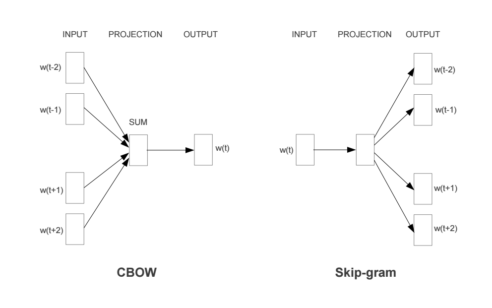

<style>
details {
    border: 1px solid #aaa;
    border-radius: 4px;
    padding: .5em .5em 0;
}
summary {
    font-weight: bold;
    margin: -.5em -.5em 0;
    padding: .5em;
}
details[open] {
    padding: .5em;
}
details[open] summary {
    border-bottom: 1px solid #aaa;
    margin-bottom: .5em;
}
</style>

<details><summary>目录</summary><p>

- [概述](#概述)
  - [词汇表征](#词汇表征)
- [为词向量模型建立词汇表](#为词向量模型建立词汇表)
- [离散表示](#离散表示)
  - [One-Hot Representation](#one-hot-representation)
    - [One-Hot 算法简介](#one-hot-算法简介)
    - [One-hot 的优、缺点](#one-hot-的优缺点)
    - [One-Hot 算法示例](#one-hot-算法示例)
    - [One-Hot 算法 Python 实现](#one-hot-算法-python-实现)
  - [词袋模型(Bag of Word)](#词袋模型bag-of-word)
    - [词袋模型算法](#词袋模型算法)
    - [词袋模型示例](#词袋模型示例)
    - [词袋模型优缺点](#词袋模型优缺点)
    - [词袋模型 Python 实现](#词袋模型-python-实现)
  - [Bi-gram、N-gram](#bi-gramn-gram)
    - [Bi-gram、N-gram 算法简介](#bi-gramn-gram-算法简介)
    - [Bi-gram、N-gram 算法示例](#bi-gramn-gram-算法示例)
    - [Bi-gram、N-gram 算法 Python 实现](#bi-gramn-gram-算法-python-实现)
  - [TF-IDF](#tf-idf)
    - [TF-IDF 算法简介](#tf-idf-算法简介)
    - [TF-IDF 算法优缺点](#tf-idf-算法优缺点)
    - [TF-IDF 算法 Python 实现](#tf-idf-算法-python-实现)
  - [共现矩阵(Co-currence Matrix)](#共现矩阵co-currence-matrix)
    - [共现矩阵算法简介](#共现矩阵算法简介)
    - [共现矩阵算法示例](#共现矩阵算法示例)
    - [共现矩阵算法 Python 实现](#共现矩阵算法-python-实现)
  - [Count Vector](#count-vector)
- [分布式表示](#分布式表示)
  - [Word Embedding 简介](#word-embedding-简介)
    - [词嵌入简介](#词嵌入简介)
    - [词嵌入主要主题内容](#词嵌入主要主题内容)
  - [Word Embedding--word2vec](#word-embedding--word2vec)
    - [word2vec 简介](#word2vec-简介)
    - [NNLM](#nnlm)
    - [CBOW](#cbow)
    - [Skip-gram](#skip-gram)
    - [Google `word2vec` 工具](#google-word2vec-工具)
      - [`word2vec` 工具简介](#word2vec-工具简介)
      - [`word2vec` 核心思想](#word2vec-核心思想)
      - [`word2vec` 模型](#word2vec-模型)
      - [`word2vec` 优点](#word2vec-优点)
      - [训练 `word2vec`](#训练-word2vec)
    - [训练一个 word2vec 词向量](#训练一个-word2vec-词向量)
  - [Word Embedding--para2vec](#word-embedding--para2vec)
  - [Word Embedding--doc2vec](#word-embedding--doc2vec)
  - [Word Embedding--GloVe](#word-embedding--glove)
    - [GloVe 词向量简介](#glove-词向量简介)
    - [Glove vs word2vec](#glove-vs-word2vec)
  - [Word Embedding 模型](#word-embedding-模型)
    - [层级 Softmax](#层级-softmax)
    - [负例采样(Negative Sampling)](#负例采样negative-sampling)
    - [Fasttext](#fasttext)
      - [fasttext 算法简介](#fasttext-算法简介)
        - [fasttext 的 Python 实现](#fasttext-的-python-实现)
- [参考文献](#参考文献)
</p></details><p></p>

# 概述

## 词汇表征

在谈词嵌入和词向量等词汇表征方法之前, 我们先来看一下将 NLP 作为监督机器学习任务时该怎样进行描述。
假设以一句话为例:"I want a glass of orange ____."。我们要通过这句话的其他单词来预测划横线部分的单词。
这是一个典型的 NLP 问题, 将其作为监督机器学习来看的话, 模型的输入是上下文单词, 输出是划横线的目标单词, 
或者说是目标单词的概率, 我们需要一个语言模型来构建关于输入和输出之间的映射关系。应用到深度学习上, 
这个模型就是循环神经网络。

在 NLP 里面, 最细粒度的表示就是词语, 词语可以组成句子, 句子再构成段落、篇章和文档。
但是计算机并不认识这些词语, 所以我们需要对以词汇为代表的自然语言进行数学上的表征。
简单来说, 我们需要将词汇转化为计算机可识别的数值形式, 这种转化和表征方式目前主要有两种, 
一种是传统机器学习中的 one-hot 编码方式, 另一种则是基于神经网络的词嵌入技术。

- 文本向量化:
    - 文本向量化又称为 “词向量模型”、“向量空间模型”, 即将文本表示成计算机可识别的实数向量, 
      根据粒度大小不同, 可将文本特征表示分为字、词、句子、篇章几个层次
    - 文本向量化方法一般称为词嵌入(word embedding)方法, 词嵌入这个说法很形象, 
      就是把文本中的词嵌入到文本空间中, 用一个向量来表示词
- 文本向量化的方法有很多:
    - 离散词向量表示    
        - 基于规则、统计
        - 词集模型(Set of Word)
            - One-Hot encoding
            - 统计各词在句子中是否出现
        - 词袋模型(Bag of Word)
            - 统计各词在句子中出现的次数
        - Bi-gram、N-gram
        - TF-IDF
            - 统计各词在文档中的 TF-IDF 值(词袋模型 + IDF 值)
        - 共现矩阵
    - 分布式词向量表示
        - 基于神经网络的词嵌入
            - `word2vec`
            - `doc2vec`
            - `str2vec`

Tomas Mikolov 2013 年在 ICLR 提出用于获取 word vector 的论文《Efficient estimation of word representations in vector space》, 
文中简单介绍了两种训练模型 CBOW、Skip-gram, 以及两种加速方法 Hierarchical Softmax、Negative Sampling。
除了 word2vec 之外, 还有其他的文本向量化的方法, 因此在这里做个总结.

# 为词向量模型建立词汇表

NLP 相关任务中最常见的第一步是创建一个 **词表库** 并把每个词顺序编号。

# 离散表示

文本向量化离散表示是一种基于规则和统计的向量化方式, 常用的方法包括 **词集模型** 和 **词袋模型**, 
都是基于词之间保持独立性、没有关联为前提, 将所有文本中单词形成一个字典, 然后根据字典来统计单词出现频数, 
不同的是:

- 词集模型:
    - 统计各词在句子中是否出现
    - 例如 One-Hot Representation, 只要单个文本中单词出现在字典中, 就将其置为 1, 不管出现多少次
- 词袋模型:
    - 统计各词在句子中出现的次数
    - 只要单个文本中单词出现在字典中, 就将其向量值加 1, 出现多少次就加多少次

其基本的特点是忽略了文本信息中的语序信息和语境信息, 仅将其反映为若干维度的独立概念, 
这种情况有着因为模型本身原因而无法解决的问题, 比如主语和宾语的顺序问题, 
词袋模型天然无法理解诸如“我为你鼓掌”和“你为我鼓掌”两个语句之间的区别。

## One-Hot Representation

### One-Hot 算法简介

熟悉机器学习中分类变量的处理方法的同学对此一定很熟悉, 无序的分类变量是不能直接硬编码为数字放入模型中的, 
因为模型会自动认为其数值之间存在可比性, 通常对于分类变量我们需要进行 one-hot 编码。
那么如何应用 one-hot 编码进行词汇表征呢？假设我们有一个包括 10000 个单词的词汇表, 
现在需要用 one-hot 方法来对每个单词进行编码。以上面那句 "I want a glass of orange ____." 为例, 
假设 I 在词汇表中排在第 3876 个, 那么 I 这个单词的 one-hot 表示就是一个长度为 10000 的向量, 
这个向量在第 3876 的位置上为 1 , 其余位置为 0, 其余单词同理, 每个单词都是茫茫 0 海中的一个 1。大致如下图所示:


可见 one-hot 词汇表征方法最后形成的结果是一种稀疏编码结果, 在深度学习应用于 NLP 任务之前, 
这种表征方法在传统的 NLP 模型中已经取得了很好的效果。但是这种表征方法有两个缺陷:
一是容易造成维数灾难, 10000 个单词的词汇表不算多, 但对于百万级、千万级的词汇表简直无法忍受。
第二个则在于这种表征方式不能很好的词汇与词汇之间的相似性, 比如上述句子, 
如果我们已经学习到了 "I want a glass of orange juice.", 但如果换成了 "I want a glass of apple ____.", 
模型仍然不会猜出目标词是 juice。因为基于 one-hot的表征方法使得算法并不知道 apple 和 orange 之间的相似性, 
这主要是因为任意两个向量之间的内积都为零, 很难区分两个单词之间的差别和联系。

### One-hot 的优、缺点

- 优点:简单快捷
- 缺点:数据稀疏、耗时耗空间、不能很好地展示词与词之间的相似关系, 
  且还未考虑到词出现的频率, 因而无法区别词的重要性
    - One-hot 的第一个问题是: One-hot 的基本假设是词之间的语义和语法关系是相互独立的, 
      仅仅从两个向量是无法看出两个词汇之间的关系的, 这种独立性不适合词汇语义的运算; 
    - One-hot 的第二个问题是:维度爆炸问题, 随着词典规模的增大, 句子构成的词袋模型的维度变得越来越大, 
      矩阵也变得超稀疏, 这种维度的爆增, 会大大耗费计算资源

### One-Hot 算法示例

1. 文本语料

```python
John likes to watch moives, Mary likes too.
John also likes to watch football games.
```

2. 基于上述两个文档中出现的单词, 构建如下词典(dictionary)

```python
{
    "John": 1, 
    "likes": 2,
    "to": 3,
    "watch": 4,
    "moives": 5,
    "also": 6,
    "football": 7,
    "games": 8,
    "Mary": 9,
    "too": 10,
}
```

3. 文本 One-Hot

```python
# John likes to watch movies, Mary likes too.

John:     [1, 0, 0, 0, 0, 0, 0, 0, 0, 0]
likes:    [0, 1, 0, 0, 0, 0, 0, 0, 0, 0]
to:       [0, 0, 1, 0, 0, 0, 0, 0, 0, 0]
watch:    [0, 0, 0, 1, 0, 0, 0, 0, 0, 0]
movies:   [0, 0, 0, 0, 1, 0, 0, 0, 0, 0]
also:     [0, 0, 0, 0, 0, 0, 0, 0, 0, 0]
football: [0, 0, 0, 0, 0, 0, 0, 0, 0, 0]
games:    [0, 0, 0, 0, 0, 0, 0, 0, 0, 0]
Mary:     [0, 0, 0, 0, 0, 0, 0, 0, 1, 0]
too:      [0, 0, 0, 0, 0, 0, 0, 0, 0, 1]
```

```python
# John also likes to watch football games.

John:     [1, 0, 0, 0, 0, 0, 0, 0, 0, 0]
likes:    [0, 1, 0, 0, 0, 0, 0, 0, 0, 0]
to:       [0, 0, 1, 0, 0, 0, 0, 0, 0, 0]
watch:    [0, 0, 0, 1, 0, 0, 0, 0, 0, 0]
movies:   [0, 0, 0, 0, 0, 0, 0, 0, 0, 0]
also:     [0, 0, 0, 0, 0, 1, 0, 0, 0, 0]
football: [0, 1, 0, 0, 0, 0, 1, 0, 0, 0]
games:    [0, 1, 0, 0, 0, 0, 0, 1, 0, 0]
Mary:     [0, 0, 0, 0, 0, 0, 0, 0, 0, 0]
too:      [0, 0, 0, 0, 0, 0, 0, 0, 0, 0]
```

### One-Hot 算法 Python 实现

```python
import os
import numpy as np
import pandas as pd
import jieba
import config

def doc2onthot_matrix(file_path):
    """
    文本向量化 One-Hot
    1.文本分词
    """
    # (1)读取待编码的文件
    with open(file_path, encoding = "utf-8") as f:
    docs = f.readlines()

    # (2)将文件每行分词, 分词后的词语放入 words 中
    words = []
    for i in range(len(docs)):
    docs[i] = jieba.lcut(docs[i].strip("\n"))
    words += docs[i]
    
    # (3)找出分词后不重复的词语, 作为词袋, 是后续 onehot 编码的维度, 放入 vocab 中
    vocab = sorted(set(words), key = words.index)

    # (4)建立一个 M 行 V 列的全 0 矩阵, M 是文档样本数, 这里是行数, V 为不重复词语数, 即编码维度
    M = len(docs)
    V = len(vocab)
    onehot = np.zeros((M, V))
    for i, doc in enumerate(docs):
    for word in doc:
        if word in vocab:
            pos = vocab.index(word)
            onehot[i][pos] = 1
    onehot = pd.DataFrame(onehot, columns = vocab)
    return onehot


if __name__ == "__main__":
    corpus = os.path.join(config.data_dir, "corpus.txt")
    onehot = doc2onthot_matrix(corpus)
    print(onehot)
```

```python
from sklearn import DictVectorizer
```

## 词袋模型(Bag of Word)

### 词袋模型算法

- 对于句子、篇章, 常用的离散表示方法是词袋模型, 词袋模型以 One-Hot 为基础, 忽略词表中词的顺序和语法关系, 
  通过记录词表中的每一个词在该文本中出现的频次来表示该词在文本中的重要程度, 解决了 One-Hot 未能考虑词频的问题
- 词袋(Bag Of Word) 模型是最早的以词语为基本单元的文本向量化方法。词袋模型, 也称为计数向量表示(Count Vectors).
  文档的向量表示可以直接使用单词的向量进行求和得到

### 词袋模型示例

文本语料

```python
John likes to watch movies, Mary likes too.
John also likes to watch football games.
```

基于上述两个文档中出现的单词, 构建如下词典(dictionary)

```python
{
    "John": 1, 
    "likes": 2,
    "to": 3,
    "watch": 4,
    "movies": 5,
    "also": 6,
    "football": 7,
    "games": 8,
    "Mary": 9,
    "too": 10,
}
```

上面词典中包含 10 个单词, 每个单词有唯一的索引, 那么每个文本可以使用一个 10 维的向量来表示:

```python
John likes to watch movies, Mary likes too.  ->  [1, 2, 1, 1, 1, 0, 0, 0, 1, 1]
John also likes to watch football games.     ->  [1, 1, 1, 1, 0, 1, 1, 1, 0, 0]
```

| 文本        | John | likes | to |  watch  | movies  | also  | football  | games  | Mary | too | 
| ---------------------------------------------| -----|-------|---|------|-------|-----|---------|------|-----|----|
| John likes to watch movies, Mary likes too.  | [1,    | 2,     | 1,  | 1,    | 1,     | 0,    |0,       | 0,     |1,    | 1] | 
| John also likes to watch football games.     | [1,   |  1,    |  1, |  1,   |  0,    |  1,   | 1,      |  1,    | 0,   |  0] |


- 横向来看, 把每条文本表示成了一个向量
- 纵向来看, 不同文档中单词的个数又可以构成某个单词的词向量, 如: "John" 纵向表示成 `[1, 1]`

### 词袋模型优缺点

- 优点:
    - 方法简单, 当语料充足时, 处理简单的问题如文本分类, 其效果比较好
- 缺点:
    - 数据稀疏、维度大
    - 无法保留词序信息
    - 存在语义鸿沟的问题

### 词袋模型 Python 实现

```python
from sklearn import CountVectorizer

count_vect = CountVectorizer(analyzer = "word")

# 假定已经读进来 DataFrame, "text"列为文本列
count_vect.fit(trainDF["text"])

# 每行为一条文本, 此句代码基于所有语料库生成单词的词典
xtrain_count = count_vect.transform(train_x)
```

## Bi-gram、N-gram

### Bi-gram、N-gram 算法简介

与词袋模型原理类似, Bi-gram 将相邻两个词编上索引, N-gram 将相邻 N 个词编上索引

### Bi-gram、N-gram 算法示例

1. 文本语料

```python
John likes to watch movies, Mary likes too.
John also likes to watch football games.
```

2. 基于上述两个文档中出现的单词, 构建如下词典(dictionary)

```python
{
    "John likes": 1,
    "likes to": 2,
    "to watch": 3,
    "watch movies": 4,
    "Mary likes": 5,
    "likes too": 6,
    "John also": 7,
    "also likes": 8,
    "watch football": 9,
    "football games": 10,
}
```

3. 上面词典中包含 10 组单词, 每组单词有唯一的索引, 那么每个文本可以使用一个 10 维的向量来表示:

```python
John likes to watch movies. Mary likes too.  -> [1, 1, 1, 1, 1, 1, 0, 0, 0, 0]
John also likes to watch football games.     -> [0, 1, 1, 0, 0, 0, 1, 1, 1, 1]
```

4. Bi-gram、N-gram 优点
  - 考虑了词的顺序
5. Bi-gram、N-gram 缺点
  - 词向量急剧膨胀

### Bi-gram、N-gram 算法 Python 实现

```python
from . import .
```

## TF-IDF

### TF-IDF 算法简介

TF-IDF(词频-逆文档频率法, Term Frequency-Inverse Document Frequency) 作为一种加权方法, 
TF-IDF 在词袋模型的基础上对次出现的频次赋予 TF-IDF 权值, 对词袋模型进行修正, 进而表示该词在文档集合中的重要程度
      
- 统计各词在文档中的 TF-IDF 值(词袋模型 + IDF 值)
- 词袋模型、Bi-gram、N-gram 都是基于计数得到的, 而 TF-IDF 则是基于频率统计得到的
- 在利用 TF-IDF 进行特征提取时, 若词 α 在某篇文档中出现频率较高且在其他文档中出现频率较低时, 
  则认为α可以代表该文档的特征, 具有较好的分类能力, 那么α作为特征被提取出来
 
TF-IDF 的分数代表了词语在当前文档和整个语料库中的相对重要性。TF-IDF 分数由两部分组成

TF(Term Frequency): 词语频率

`$$TF(t) = \frac{词语在当前文档出现的次数}{当前文档中词语的总数}$$`

- TF 判断的是该字/词语是否是当前文档的重要词语, 但是如果只用词语出现频率来判断其是否重要可能会出现一个问题, 
  就是有些通用词可能也会出现很多次, 如:a、the、at、in 等, 当然一般我们会对文本进行预处理时去掉这些所谓的停用词(stopwords), 
  但是仍然会有很多通用词无法避免地出现在很多文档中, 而其实它们不是那么重要


IDF(Inverse Document Frequency):逆文档频率

`$$IDF(t) = log_{e} \Big(\frac{文档总数}{出现该词语的文档总数} \Big)$$`
   
- IDF 用于判断是否在很多文档中都出现了词词语, 即很多文档或所有文档中都出现的就是通用词。
  出现该词语的文档越多, IDF 越小, 其作用是抑制通用词的重要性

将上述求出的 TF 和 IDF 相乘得到的分数 TF-IDF, 就是词语在当前文档和整个语料库中的相对重要性。
TF-IDF 与一个词在当前文档中出现次数成正比, 与该词在整个语料库中的出现次数成反比

### TF-IDF 算法优缺点

- 优点:
    - 简单快速, 结果比较符合实际情况
- 缺点:
    - 单纯以"词频"衡量一个词的重要性, 不够全面, 有时重要的词可能出现次数并不多
    - 无法体现词的位置信息, 出现位置靠前的词与出现位置靠后的词, 都被视为重要性相同, 这是不正确的

### TF-IDF 算法 Python 实现

```python
from sklearn import TfidfVectorizer
from sklearn import HashingVectorizer

# word level tf-idf
tfidf_vect = TfidfVectorizer(analyzer = "word", token_pattern = r"\w{1,}", max_features = 5000)
tfidf_vect.fit(trianDF["text"])
xtrain_tfidf = tfidf_vect.transform(train_x)

# n-gram level tf-idf
tfidf_vect_ngram = TfidfVectorizer(analyzer = "word", token_pattern = r"\w{1,}", ngram_ragne(2, 3), max_features = 5000)
tfidf_vect_ngram.fit(trainDF["text"])
xtrain_tfidf = tfidf_vect.transform(train_x)
```

## 共现矩阵(Co-currence Matrix)

### 共现矩阵算法简介

- 共现:即共同实现, 比如:一句话中共同出现, 或一篇文章中共同出现
- 共现矩阵构造时需要给出共同出现的距离一个规范-- **窗口**
    - 如果窗口宽度是 2, 那就是在当前词的前后各 2 个词的范围内共同出现, 
      可以想象, 其实是一个总长为 5 的窗口依次扫过所有文本, 同时出现在其中的词就说它们共现
- 当前词与自身不存在共现, 共现矩阵实际上是对角矩阵
    - 实际应用中, 用共现矩阵的一行(列)作为某个词的词向量, 其向量维度还是会随着字典大小呈线性增长, 
      而且存储共现矩阵可能需要消耗巨大的内存
    - 一般配合 PCA 或者 SVD 将其进行降维, 比如:将 `$m \times n` 的矩阵降维为 `$m \times r`, 
      其中 `$r \le n`, 即将词向量的长度进行缩减


### 共现矩阵算法示例

1. 文本语料

```python
John likes to watch movies.
John likes to play basketball.
```

2. 假设上面两句话设置窗口宽度为 1, 则共现矩阵如下

| 共现矩阵      | John  | likes  | to  | watch  | moives  | play  |  basketball|
|--------------|-------|--------|-----|--------|---------|-------|-----------|
| John         | 0     | 2      | 0   | 0      | 0       | 0     | 0 |
| likes        | 2     | 0      | 2   | 0      | 0       | 0     | 0 |
| to           | 0     | 2      | 0   | 1      | 0       | 1     | 0 |
| watch        | 0     | 0      | 1   | 0      | 1       | 0     | 0 |
| moives       | 0     | 0      | 0   | 1      | 0       | 0     | 0 |
| play         | 0     | 0      | 1   | 0      | 0       | 0     | 1 |
| basketball   | 0     | 0      | 0   | 0      | 0       | 1     | 0 |

### 共现矩阵算法 Python 实现

```python
from . import .
```

## Count Vector

- 假设
   - 语料 C, 包含 D 个文档: `$\{d_{1}, d_{2}, \cdots, d_{D}\}$` 
   - 语料 C 中的 N 个不重复词构成字典
   - Count Vector matrix(计算向量矩阵) `$M_{D \times N}$`
   - 计数向量矩阵 M 的第 `$i, i=1, 2, \cdots, D` 行包含了字典中每个词在文档 `$d_{i}$` 中的频率
- 示例
    - 语料 (D = 2):
        - `$d_1` : He is a lazy boy. She is also lazy.
        - `$d_2` : Neeraj is a lazy person.
    - 字典 (N = 6):
        - ["He", "She", "lazy", "boy", "Neeraj", "person"]
    - 计数向量矩阵:

| CountVector  | He  |  She | lazy | boy  | Neeraj | person |
|--------------|-----|------|------|------|--------|--------|
| `$d_1`       | 1   | 1    | 2    | 1    | 0      | 0      |
| `$d_2`       | 0   | 0    | 1    | 0    | 1      | 1      |

# 分布式表示

词汇分布式表示最早由 Hinton 在 1986 年提出, 其基本思想是:通过训练将每个词映射成 K 维实数向量(K 一般为模型中的超参数), 
通过词之间的距离(如, consine 相似度、欧氏距离)来判断它们之间的语义相似度。

离散表示虽然能够进行词语或者文本的向量表示, 进而用模型进行情感分析或者是文本分类之类的任务。
但其不能表示词语间的相似程度或者词语间的类比关系。

- 比如:beautifule 和 pretty 两个词语, 它们表达相近的意思, 所以希望它们在整个文本的表示空间内挨得很近。

一般认为, 词向量、文本向量之间的夹角越小, 两个词相似度越高, 词向量、文本向量之间夹角的关系用下面的余弦夹角进行表示:

`$$\cos \theta = \frac{\overrightarrow{A} \cdot \overrightarrow{B}}{|\overrightarrow{A}| \cdot |\overrightarrow{B}|}$$`

离散表示, 如 One-Hot 表示无法表示上面的余弦关系, 引入分布式表示方法, 其主要思想是 **用周围的词表示该词**.

## Word Embedding 简介

### 词嵌入简介

词嵌入的基本想法就是将词汇表中的每个单词表示为一个普通的向量, 这个向量不像 One-Hot 向量那样都是 0 或者 1, 
也没有 One-Hot 向量那样长, 大概就是很普通的向量, 比如长这样:[-0.91, 2, 1.8, -.82, 0.65, ...]。
这样的一种词汇表示方式就像是将词嵌入到了一种数学空间里面, 所以叫做词嵌入。其中, word2vec 使用的就是这种词嵌入技术的一种。

那么如何进行词嵌入呢？或者说我们如何才能将词汇表征成很普通的向量形式呢？这需要我们通过神经网络进行训练, 
训练得到的网络权重形成的向量就是我们最终需要的东西, 这种向量也叫词向量, word2vec 就是其中的典型技术。

word2vec 作为现代 NLP 的核心思想和技术之一, 有着非常广泛的影响。word2vec 通常有两种语言模型, 
一种是根据中间词来预测上下文的 skip-gram 模型, 另一种是根据上下文来预测中间词的 CBOW (连续词袋模型)。

词汇表征问题解决之后, NLP 的核心便是建立语言模型。从深度学习的角度看, 从深度学习的角度看, 
假设我们将 NLP 的语言模型看作是一个监督学习问题:即给定上下文词 X, 输出中间词 Y, 或者给定中间词 X, 输出上下文词 Y。
基于输入 X 和输出 Y 之间的映射便是语言模型。这样的一个语言模型的目的便是检查 X 和 Y 放在一起是否符合自然语言法则, 
更通俗一点说就是 X 和 Y 搁一起是不是人话。

所以, 基于监督学习的思想, 本文的主角——word2vec 便是一种基于神经网络训练的自然语言模型。
word2vec 是谷歌于 2013 年提出的一种 NLP 工具, 其特点就是将词汇进行向量化, 
这样我们就可以定量的分析和挖掘词汇之间的联系。因而 word2vec 也是我们上一讲讲到的词嵌入表征的一种, 
只不过这种向量化表征需要经过神经网络训练得到。

### 词嵌入主要主题内容

1. 什么是词嵌入
2. 不同类型的词嵌入
  - 基于频率的词嵌入
     - Count Vector
     - TF-IDF
     - Co-Occurrence Matrix
  - 基于预测的词嵌入
     - CBOW
     - Skip-Gram
3. 词嵌入使用示例
4. 使用预训练的词向量
5. 训练自己的词向量

## Word Embedding--word2vec

### word2vec 简介

word2vec 训练神经网络得到一个关于输入 X 和 输出 Y 之间的语言模型, 我们的关注重点并不是说要把这个模型训练的有多好, 
而是要获取训练好的神经网络权重, 这个权重就是我们要拿来对输入词汇 X 的向量化表示。一旦我们拿到了训练语料所有词汇的词向量, 
接下来开展 NLP 研究工作就相对容易一些了。

word2vec 通常有两个版本的语言模型:

- 一种是给定上下文词, 需要我们来预测中间目标词, 这种模型叫做连续词袋模型(Continuous Bag-of-Wods Model, CBOW)
- 另一种是给定一个词语, 我们来根据这个词预测它的上下文, 这种模型叫做 skip-gram 模型。而且每个模型都有两种策略

CBOW 和 Skip-gram 模型的原理示意图:



### NNLM

2003 年提出了神经网络语言模型(Neural Network Language Model, NNLM), 
其用前 `$n-1` 个词预测第 `$n` 个词的概率, 并用神经网络搭建模型。

NNLM 模型的基本结构


NNLM 模型目标函数
  
`$$L(\theta) = \sum_{t} log P(\omega_{t}|\omega_{t-n}, \omega_{t-n+1}, \cdots, \omega_{t-1})$$`

- 使用非对称的前向窗口, 长度为 `$n-1` , 滑动窗口遍历整个语料库求和, 使得目标概率最大化, 其计算量正比于语料库的大小。
  同时, 预测所有词的概率综合应为 1。

`$$\sum_{\omega \in \{vocabulary\}} P(\omega|\omega_{t-n+1}, \cdots, \omega_{t-1})$$`

NNLM 模型解释

- 样本的一组输入是第 `$n` 个词的前 `$n-1` 个词的 One-Hot 表示, 目标是预测第 `$n` 个词, 
  输出层的大小是语料库中所有词的数量, 然后 sotfmax 回归, 使用反向传播不断修正神经网络的权重来最大化第 `$n`  个词的概率。
  当神经网络学得到权重能够很好地预测第 `$n` 个词的时候, 输入层到映射层, 即这层, 其中的权重 Matrix C 被称为投影矩阵, 
  输入层各个词的 Ont-Hot 表示法只在其对应的索引位置为 1, 其他全为 0, 在与 Matrix C 矩阵相乘时相当于在对应列取出列向量投影到映射层。

`$$Matrix C = (w_{1}, w_{2}, \cdots, w_{v}) = 
\begin{bmatrix}
(\omega_{1})_{1} & (\omega_{2})_{1} & \cdots & (\omega_{v})_{1} \\
(\omega_{1})_{2} & (\omega_{2})_{2} & \cdots & (\omega_{v})_{2} \\
\vdots           & \vdots           &        & \vdots           \\
(\omega_{1})_{D} & (\omega_{2})_{D} & \cdots & (\omega_{v})_{D} \\
\end{bmatrix}$$`

此时的向量​就是原词​的分布式表示, 其是稠密向量而非原来 One-Hot 的稀疏向量了。

在后面的隐藏层将这 n-1 个稠密的词向量进行拼接, 如果每个词向量的维度为 D, 则隐藏层的神经元个数为 (n-1)×D, 
然后接一个所有待预测词数量的全连接层, 最后用 softmax 进行预测。

可以看到, 在隐藏层和分类层中间的计算量应该是很大的, word2vec 算法从这个角度出发对模型进行了简化。
word2vec 不是单一的算法, 而是两种算法的结合:连续词袋模型 (CBOW) 和跳字模型 (Skip-gram) 。

### CBOW

CBOW 模型的应用场景是要根据上下文预测中间的词, 所以输入便是上下文词, 当然原始的单词是无法作为输入的, 
这里的输入仍然是每个词汇的 One-Hot 向量, 输出 Y 为给定词汇表中每个词作为目标词的概率。

- CBOW 模型基本结构(Rong Xin)


- CBOW 模型解释
    - 可见 CBOW 模型结构是一种普通的神经网络结构。主要包括输入层、中间隐藏层、最后的输出层。
      以输入、输出样本 `$(Context(w), w)$` 为例对 CBOW 模型的三个网络层进行简单说明, 
      其中假设 `$Context(w)$` 由 `$w` 前后各 `$c` 个词构成。数学细节如下:
        - 输入层: 包含 `$Context(w)$` 中 2c 个词的词向量 `$v(Context(w)_{1}), v(Context(w)_{2}), \cdots, v(Context(w)_{2c}) \in R^{m}$`。这里,  `$m` 的含义同上表示词向量的长度;
        - 投影层: 将输入层的 `$2c` 个向量做求和累加, 即 `$x_{w}=\sum_{i=1}^{2c}v(Context(w)_{i}) \in R^{m}$`
        - 输出层: 输出层对应一颗二叉树, 它是以语料中出现过的词当叶子节点, 
          以各词在语料中出现的次数当权值构造出来的 Huffman 树。在这棵 Huffman 树中, 
          叶子节点共 `$N(=|D|)$` 个, 分别对应词典 `$D` 中的词, 非叶子节点 `$N-1` 个(图中标成黄色的那些节点)。
    - 普通的基于神经网络的语言模型输出层一般就是利用 softmax 函数进行归一化计算, 这种直接 softmax 的做法主要问题在于计算速度, 
      尤其是我们采用了一个较大的词汇表的时候, 对大的词汇表做求和运算, softmax 的分母运算会非常慢, 直接影响到了模型性能。
    - 可以看到, 上面提到的取消隐藏层, 投影层求和平均都可以一定程度上减少计算量, 但输出层的数量在那里, 
      比如语料库有 500W 个词, 那么隐藏层就要对 500W 个神经元进行全连接计算, 这依然需要庞大的计算量。
      word2vec 算法又在这里进行了训练优化.
    - 除了分级 softmax 输出之外, 还有一种叫做负采样的训练 trick
    - CBOW 目标函数
        `$$J = \sum_{\omega \in corpus} P(\omega | context(\omega))$$`
- CBOW 在 NNLM 基础上有以下几点创新
    - 1.取消了隐藏层, 减少了计算量
    - 2.采用上下文划窗而不是前文划窗, 即用上下文的词来预测当前词
    - 3.投影层不再使用各向量拼接的方式, 而是简单的求和平均
- 参考资料:
    - [狗熊会](https://mp.weixin.qq.com/s?__biz=MzI4ODY2NjYzMQ==&mid=2247484776&idx=1&sn=484bfa9299696f6e233227e05d0fb78c&chksm=ec3ba000db4c2916b2f79d98ea8fd5ea3326e638458af2c8d65a182bdebeda11e311649d954d&scene=21#wechat_redirect) 
    - https://www.cnblogs.com/peghoty/p/3857839.html
    - http://www.docin.com/p-2066429827.html

### Skip-gram

Skip-gram 模型的应用场景是要根据中间词预测上下文词, 所以输入 `$x$` 是任意单词, 
输出 `$y$` 为给定词汇表中每个词作为上下文词的概率。

- Skip-gram 模型基本结构


- Skip-gram 模型解释
    - 从上面的结构图可见, Skip-gram 模型与 CBOW 模型翻转, 也是也是一种普通的神经网络结构, 
    同样也包括输入层、中间隐藏层和最后的输出层。继续以输入输出样本 `$(Context(w), w)$` 为例
    对 Skip-gram 模型的三个网络层进行简单说明, 
    其中假设 `$Context(w)$` 由 `$w` 前后各 `$c` 个词构成。数学细节如下:
        - 输入层: 只含当前样本的中心词 `$w` 的词向量 `$v(w) \in R^{m}$` 
        - 投影层: 这是个恒等投影, 把 `$v(w)$` 投影到 `$v(w)$`, 因此, 这个投影层其实是多余的。
        这里之所以保留投影层主要是方便和 CBOW 模型的网络结构做对比
        - 输出层: 和 CBOW 模型一样, 输出层也是一棵 Huffman 树
    - Skip-gram 模型的训练方法也是基于损失函数的梯度计算, 目标函数:
    
`$$L = \sum_{w \in C} log \prod_{u \in Context(w)} \prod_{j=2}^{l^{u}}\{[\sigma(v(w)^{T}\theta_{j-1}^{u})]^{1-d_{j}^{u}} \cdot [1-\sigma(v(w)^{T}\theta_{j-1}^{u})]^{d_{j}^{u}} \} \\
= \sum_{w \in C} \sum_{u \in Context(w)} \sum_{j=2}^{l^{u}} {(1-d_{j}^{u}) \cdot log[\sigma(v(w)^{T}\theta_{j-1}^{u})] + d_{j}^{u} \cdot log[1 - \sigma(v(w)^{T}\theta_{u}^{j-1})]}$$`

关于 CBOW 和 skip-gram 模型的更多数学细节, 比如 Huffman 树、损失函数的推导等问题, 
从监督学习的角度来说, word2vec 本质上是一个基于神经网络的多分类问题, 当输出词语非常多时, 
我们则需要一些像分级 Softmax 和负采样之类的 trick 来加速训练。但从自然语言处理的角度来说, 
word2vec 关注的并不是神经网络模型本身, 而是训练之后得到的词汇的向量化表征。
这种表征使得最后的词向量维度要远远小于词汇表大小, 所以 word2vec 从本质上来说是一种降维操作。
我们把数以万计的词汇从高维空间中降维到低维空间中, 大大方便了后续的 NLP 分析任务。

### Google `word2vec` 工具

#### `word2vec` 工具简介

- `word2vec` 是 Google 在 2013 年发布的一个开源词向量建模工具
- `word2vec` 使用的算法是 Bengio 等人在 2001 年提出的 Neural Network Language Model(NNLM) 算法
- `word2vec` 是一款将词表征为实数值向量的高效工具

#### `word2vec` 核心思想

- `word2vec` 以及其他词向量模型, 都基于同样的假设:
    - (1) 衡量词语之间的相似性, 在于相邻词汇是否相识, 这是基于语言学的“距离象似性”原理。
    - (2) 词汇和它的上下文构成了一个象, 当从语料库当中学习得到相识或者相近的象时, 它们在语义上总是相识的。

#### `word2vec` 模型
      
- CBOW(Continuous Bag-Of-Words, 连续的词袋模型)
- Skip-Gram

#### `word2vec` 优点

- 高效, Mikolov 在论文中指出一个优化的单机版本一天可以训练上千亿个词

#### 训练 `word2vec`

1.word2vec 版本

- Google `word2vec`
    - https://github.com/dav/word2vec
- Gensim Python `word2vec`
    - https://pypi.python.org/pypi/gensim
- C++ 11
    - https://github.com/jdeng/word2vec
- Java 
    - https://github.com/NLPchina/Word2VEC_java

2.Gensim word2vec 示例

使用中文维基百科语料库作为训练库

2.1 数据预处理

- 大概等待 15min 左右, 得到 280819 行文本, 每行对应一个网页

```python
from gensim.corpora import WikiCorpus

space = " "
with open("wiki-zh-article.txt", "w", encoding = "utf8") as f:
        wiki = WikiCorpus("zhwiki-latest-pages-articles.xml.bz2", lemmatize = False, dictionary = {})
        for text in wiki.get_texts():
        f.write(space.join(text) + "\n")
print("Finished Saved.")
```

2.2 繁体字处理

- 目的:            
    - 因为维基语料库里面包含了繁体字和简体字, 为了不影响后续分词, 所以统一转化为简体字        
- 工具            
    - opencc](https://github.com/BYVoid/OpenCC)

```bash
opencc -i corpus.txt -o wiki-corpus.txt -c t2s.json
```

2.3 分词
    - jieba
    - ICTCLAS(中科院)
    - FudanNLP(复旦)

- `word2vec` 一般需要大规模语料库(GB 级别), 这些语料库需要进行一定的预处理, 变为精准的分词, 才能提升训练效果:
- 常用大规模中文语料库:
    - 维基百科中文语料(5.7G xml) https://dumps.wikimedia.org/zhwiki/latest/zhwiki-latest-pages-articles.xml.bz2
        - 标题
        - 分类
        - 正文
    - 搜狗实验室的搜狗 SouGouT(5TB 网页原版) https://www.sogou.com/labs/resource/t.php

### 训练一个 word2vec 词向量

通常而言, 训练一个词向量是一件非常昂贵的事情, 我们一般会使用一些别人训练好的词向量模型来直接使用, 
很少情况下需要自己训练词向量, 但这并不妨碍我们尝试来训练一个 word2vec 词向量模型进行试验。

- 如何训练一个 skip-gram 模型, 总体流程是
    - (1)先下载要训练的文本语料
    - (2)然后根据语料构造词汇表
    - (3)再根据词汇表和 skip-gram 模型特点生成 skip-gram 训练样本
    - (4)训练样本准备好之后即可定义 skip-gram 模型网络结构, 损失函数和优化计算过程
    - (5)最后保存训练好的词向量即可

```python
import collections
import math
```

## Word Embedding--para2vec

- 段落到向量

## Word Embedding--doc2vec

- 文章到向量

## Word Embedding--GloVe

除了 word2vec 之外, 常用的通过训练神经网络的方法得到词向量的方法还包括 
Glove (Global Vectors for Word Representation) 词向量、
fasttext 词向量等等。本节笔者将对 GloVe 词向量进行简单的介绍, 
并在此基础上对基于 GloVe 模型训练好的词向量计算预先相似度和语义近似与类比等分析。

- 通过余弦函数、欧几里得距离来获得相似词的库

### GloVe 词向量简介
   
GloVe 词向量直译为全局的词向量表示, 跟 word2vec 词向量一样本质上是基于词共现矩阵来进行处理的。
GloVe 词向量模型基本步骤如下:

- 1.基于词共现矩阵收集词共现信息
    - 假设 `$X_{ij}$` 表示词汇 `$i` 出现在词汇 `$j` 上下文的概率, 首先对语料库进行扫描, 
    对于每个词汇, 我们定义一个 window_size, 即每个单词向两边能够联系到的距离, 在一句话中如果一个词距离中心词越远, 
    我们给与这个词的权重越低.

- 2.对于每一组词, 都有

    `$$\omega_{i}^{T}\omega_{j} + b_{i} + b_{j} = log(X_{ij})$$`
    
    - 其中,  `$\omega_{i}$` 表示中心词向量, 
    `$\omega_{j}$` 表示上下文词向量, 
    `$b_{i}$` 和 `$b_{j}$` 均表示上下文词的常数偏倚.

- 3.定义 GloVe 模型损失函数

    `$$J = \sum_{i=1}^{V}\sum_{j=1}^{V}f(X_{ij})(\omega_{i}^{T}\omega_{j} + b_{i} + b_{j} - log X_{ij})^{2}$$`

    - 其中, 加权函数 `$f` 可以帮助我们避免只学习到一个常见词的词向量模型,  `$f` 函数的选择原则在于既不给常见词(this/of/and)以过分的权重, 
    也不回给一些不常见词(durion)太小的权重, 参考形式如下:

    `$$\begin{split}
    f(X_{ij})= \left \{
    \begin{array}{rcl}
    (\frac{X_{ij}}{x_{max}})^{\alpha}, & & {如果 X_{ij} < x_{max}} \\
    1,                                 & & {否则}                  \\
    \end{array}
    \right.
    \end{split}$$`

- 4.计算余弦相似度

    - 为了衡量两个单词在语义上的相近性, 我们采用余弦相似度来进行度量。余弦相似度的计算公式如下:

        `$$CosineSimilarity(u, v)=\frac{uv}{||u||_{2} ||v||_{2}}=cos(\theta)$$`

    - 基于余弦相似度的词汇语义相似性度量:

    

- 5.语义类比
    - 有了词汇之间的相似性度量之后, 便可以基于此做进一步分析, 
      比如要解决 `a is to b as c is to _` 这样的语义填空题, 
     可以利用词汇之间的余弦相似性计算空格处到底填什么单词.

### Glove vs word2vec


## Word Embedding 模型

### 层级 Softmax

 - 霍夫曼树

    霍夫曼树是一棵特殊的二叉树, 了解霍夫曼树之前先给出几个定义:

       - 路径长度:在二叉树路径上的分支数目, 其等于路径上结点数-1
       - 结点的权:给树的每个结点赋予一个非负的值
       - 结点的带权路径长度:根结点到该结点之间的路径长度与该节点权的乘积
       - 树的带权路径长度:所有叶子节点的带权路径长度之和

    霍夫曼树的定义为:

       - 在权为 `$\omega_{1}, \omega_{2}, \cdots, \omega_{n}$`  ​的​ `$n` 个叶子结点所构成的所有二叉树中, 
         带权路径长度最小的二叉树称为最优二叉树或霍夫曼树

    可以看出, 结点的权越小, 其离树的根结点越远。

 - 层级 Softmax

    word2vec 算法利用霍夫曼树, 将平铺型 softmax 压缩成层级 softmax, 不再使用全连接。
    具体做法是根据文本的词频统计, 将词频赋给结点的权。

    在霍夫曼树中, 叶子结点是待预测的所有词, 在每个子结点处, 用 sigmoid 激活后得到往左走的概率 p, 
    往右走的概率为 1-p。最终训练的目标是最大化叶子结点处预测词的概率。

    层级 softmax 的实现有点复杂, 暂时先搞清楚大致原理~

### 负例采样(Negative Sampling)

负例采样的想法比较简单, 假如有 `$m` 个待预测的词, 每次预测的一个正样本词, 其他的 `$m-1` 个词均为负样本。
    
- 一方面正负样本数差别太大
- 另一方面, 负样本中可能有很多不常用, 或者词预测时概率基本为0的样本, 我们不想在计算它们的概率上面消耗资源

比如现在待预测的词有 100W 个, 正常情况下, 我们分类的全连接层需要 100W 个神经元, 我们可以根据词语的出现频率进行负例采样, 
一个正样本加上采样出的比如说 999 个负样本, 组成 1000 个新的分类全连接层。

采样尽量保持了跟原来一样的分布, 具体做法是将 `$[0, 1]` 区间均分为 108 份, 然后根据词出现在语料库中的次数赋予每个词不同的份额。

`$$len(\omega) = \frac{counter(\omega)}{\sum_{\mu \in D} counter(\mu)}$$`

然后在 `$[0, 1]` 区间掷筛子, 落在哪个区间就采样哪个样本。实际上, 最终效果证明上式中取 `$counter(\omega)$` 的 `$3/4` 次方效果最好, 
所以在应用汇总也是这么做的。

### Fasttext

#### fasttext 算法简介


fasttext 的模型与 CBOW 类似, 实际上, fasttext 的确是由 CBOW 演变而来的。CBOW 预测上下文的中间词, fasttext 预测文本标签。
与 word2vec 算法的衍生物相同, 稠密词向量也是训练神经网路的过程中得到的。


fasttext 的输入是一段词的序列, 即一篇文章或一句话, 输出是这段词序列属于某个类别的概率, 所以, fasttext 是用来做文本分类任务的。

fasttext 中采用层级 softmax 做分类, 这与 CBOW 相同。fasttext 算法中还考虑了词的顺序问题, 即采用 N-gram, 
与之前介绍的离散表示法相同, 如:

- 今天天气非常不错, Bi-gram 的表示就是:今天、天天、天气、气非、非常、常不、不错

fasttext 做文本分类对文本的存储方式有要求:

```
    __label__1, It is a nice day.
    __label__2, I am fine, thank you.
    __label__3, I like play football.
```

其中:

- `__label__`:为实际类别的前缀, 也可以自己定义

##### fasttext 的 Python 实现

- GitHub:
    - https://github.com/facebookresearch/fastText
- 示例:

```python
classifier = fasttext.supervised(input_file, output, label_prefix = "__label__")
result = classifier.test(test_file)
print(result.precision, result.recall)
```
其中:

- `input_file`:是已经按照上面的格式要求做好的训练集 txt
- `output`:后缀为 `.model`, 是保存的二进制文件
- `label_prefix`:可以自定类别前缀

# 参考文献

1. [Efficient Estimation of Word Representations in Vector Space](https://arxiv.org/pdf/1301.3781.pdf) 
2. [Bag of Tricks for Efficient Text Classification](https://arxiv.org/pdf/1607.01759.pdf) 
3. [BERT: Pre-training of Deep Bidirectional Transformers for Language Understanding](https://arxiv.org/pdf/1810.04805.pdf) 
4. [A Neural Probabilistic Language Model](https://www.jmlr.org/papers/volume3/bengio03a/bengio03a.pdf) 
5. [Attention Is All You Need](https://arxiv.org/pdf/1706.03762.pdf) 

