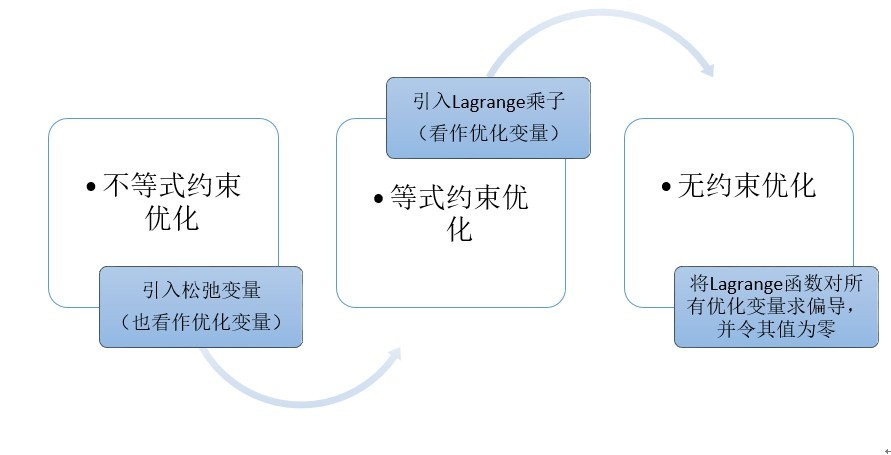

目录

- [拉格朗日乘子法](#拉格朗日乘子法)
    - [无约束优化](#无约束优化)
    - [等式约束优化](#等式约束优化)
    - [不等式约束优化](#不等式约束优化)
    - [拉格朗日对偶](#拉格朗日对偶)
        - [原问题](#原问题)
        - [对偶问题](#对偶问题)
- [KKT 条件](#kkt-条件)
- [等式约束优化问题](#等式约束优化问题)
    - [等式约束优化问题](#等式约束优化问题-1)
    - [Lagrange 函数](#lagrange-函数)
    - [求解 Lagrange 函数的最优解](#求解-lagrange-函数的最优解)
- [不等式约束优化问题](#不等式约束优化问题)
    - [不等式约束优化问题的主要思想](#不等式约束优化问题的主要思想)
    - [一元函数的例子](#一元函数的例子)
        - [目标函数及约束条件](#目标函数及约束条件)
        - [引入松弛变量](#引入松弛变量)
        - [Lagrange 函数](#lagrange-函数-1)
        - [求解 Lagrange 函数的最优解](#求解-lagrange-函数的最优解-1)
    - [多元多次不等式约束问题示例](#多元多次不等式约束问题示例)
- [同时包含等式和不等式约束的一般优化问题](#同时包含等式和不等式约束的一般优化问题)
- [参考](#参考)

# 拉格朗日乘子法

对于**约束优化问题**，可以通过[**内点法**](https://wangzhefeng.com/note/2024/08/26/linear-programming/#%E5%86%85%E7%82%B9%E6%B3%95)转化成**无约束优化问题**，
除了内点法，还有一种方法应用最广，就是**拉格朗日乘子法**。

拉格朗日乘子法通过引入**拉格朗日乘子**将**等式约束**转成**无约束优化问题**。
对于**不等式约束**，通过**KKT 对偶条件**转化**等式约束**后再使用拉格朗日乘子法求解。

拉格朗日乘子法求得的并不一定是最优解，只有在凸优化的情况下，才能保证得到的是最优解。

## 无约束优化

考虑一个不带任何约束的优化问题，`$x\in\mathbb{R}^{N}$` 的函数 `$f(x)$`，求其最小值，即：

`$$\underset{x}{\text{min}}\space f(x)$$`

这个问题只需要对 `$x$` 求导，令导数等于 0 即可，即 `$\nabla_{x} f(x) = 0$`。
在知道梯度信息的情况下，可以使用**梯度下降**或**牛顿法**等迭代算法使 `$x$` 沿着负梯度方向逐步逼近极小值点。

## 等式约束优化

当目标函数加上等式约束后，问题的形式如下：

`$$\underset{x}{\text{min}}\space f(x)$$`
`$$\text{s.t.}\space h_{i}(x) = 0, i = 1, 2, ..., m$$`

约束条件将解空间约束在一个可行域内，此时不一定得到 `$\nabla_{x} f(x) = 0$` 的点。
只需要在可行域内找到 `$f(x)$` 的极小值即可。常用的方法是引入拉格朗日乘子 `$\alpha \in \mathbb{R}^{m}$`，
构建拉格朗日函数如下：

`$$L(x, \alpha) = f(x) + \sum_{i=1}^{m} \alpha_{i} h_{i}(x)$$`

然后对 `$L(x, \alpha)$` 分别对 `$x$` 和 `$\alpha$` 求导，并令导数等于 0，
得到 `$x$` 和 `$\alpha$` 的值，即：

`$$\frac{\partial L(x, \alpha)}{dx} = 0$$`
`$$\frac{\partial L(x, \alpha)}{d\alpha} = 0$$`

将 `$x$` 代入 `$f(x)$` 得到在约束条件 `$h_{i}(x)$` 下的极小值。

> **拉格朗日乘子法取得极值的必要条件**是，目标函数与约束函数相切，这时两者的法向量是平行的，即：
> 
> `$$\nabla f(x) - \alpha \nabla h(x) = 0$$`
> 
> 所以，只需要满足上述等式，且满足之前的约束条件 `$h_{i}(x) = 0$`，即可得到解，联立起来得到的就是拉格朗日乘子法。

## 不等式约束优化

在[**单纯形法**](https://wangzhefeng.com/note/2024/08/26/linear-programming/#%E5%8D%95%E7%BA%AF%E5%BD%A2%E6%B3%95)中，对于不等式约束是通过引入松弛变量的方式将不等式约束转化为等式约束，
在这里是通过 **KKT 条件** 转化成拉格朗日乘子法的。

> 当加上不等式约束后，优化问题的表示如下：
> 
> `$$\underset{x}{\text{min}}\space f(x)$$`
> `$$\text{s.t.}\space g(x) \leq 0$$`
> 
> 构建拉格朗日函数如下：
> 
> `$$L(x, \beta) = f(x) + \beta g(x)$$`
> 
> 可行解要么落在约束边界上，即 `$g(x) = 0$`。要么可行解落在可行域内部，即 `$g(x) < 0$`，此时约束不起作用，
> 令 `$\beta = 0$` 消去约束即可，所以无论哪种情况都可以表示为：
> 
> `$$\beta g(x) = 0$$`
> 
> 对于 `$\beta$` 的取值，在等式约束优化中，约束函数与目标函数的梯度只需要满足平行即可，
> 而在不等式约束中则不然，若 `$\beta \neq 0$`，则说明可行解 `$x$` 在 `$g(x)$` 的边界上。
> 梯度 `$\nabla f(x)$` 方向与梯度 `$\nabla g(x)$` 方向相反且平行，
> 所以，若要使 `$\nabla f(x) = -\beta \nabla g(x)$`，则要求是拉格朗日乘子 `$\beta > 0$`。

可见 **对于不等式约束，只要满足一定的条件，依然可以使用拉格朗日乘子法解决，这里的条件就是 KKT 条件**，
对于如下不等式约束优化问题：

`$$\underset{x}{\text{min}}\space f(x)$$`
`$$\text{s.t.}\space \begin{cases}
h_{i}(x) = 0, i = 1, 2, ..., m \\
g_{j}(x) \leq 0, j = 1, 2, ..., n
\end{cases}$$`

构造拉格朗日函数得到无约束优化问题，即：

`$$L(x, \alpha, \beta) = f(x) + \sum_{i=1}^{m} \alpha_{i} h_{i}(x) + \sum_{j=1}^{n} \beta_{j} g_{j}(x)$$`

经过分析得到可行解 `$x$` 需要满足 的 KKT 条件如下：

`$$\nabla_{x} L(x, \alpha, \beta) = 0 \tag{1}$$`
`$$h_{i}(x) = 0, i = 1, 2, ..., m, \tag{2}$$`
`$$g_{j}(x) \leq 0, j = 1, 2, ..., n\tag{3}$$`
`$$\beta_{j} \geq 0, j = 1, 2, ..., n\tag{4}$$`
`$$\beta_{j} g_{j}(x) = 0, j = 1, 2, ..., n\tag{5}$$`

满足 KKT 条件后，极小化拉格朗日函数即可得到在不等式约束下的可行解。

KKT 条件看起来很多，其实也不难理解：

* (1) 式是拉格朗日函数取得可行解的必要条件；
* (2) 式和 (3) 式是初始约束条件；
* (4) 式是在不等式约束的两种情况下得出 `$\lambda$` 满足的条件；
* (5) 式是不等式约束的两种情况，无论哪一种情况都可满足 `$\lambda_{j} g_{j}(x) = 0$`，成为松弛互补条件。

## 拉格朗日对偶

可以使用图形化的方法来推导 KKT 条件，但在拉格朗日乘子法中，使用拉格朗日对偶是更常用的方法。

对于前面讲到的一个优化问题，即：

`$$\underset{x}{\text{min}}\space f(x)$$`
`$$\text{s.t.}\space \begin{cases}
h_{i}(x) = 0, i = 1, 2, ..., m \\
g_{j}(x) \leq 0, j = 1, 2, ..., n
\end{cases}$$`

构造拉格朗日函数得到无约束优化问题：

`$$L(x, \alpha, \beta) = f(x) + \sum_{i=1}^{m} \alpha_{i} h_{i}(x) + \sum_{j=1}^{n} \beta_{j} g_{j}(x)$$`

把 `$L(x, \alpha, \beta)$` 看作是关于 `$\alpha$` 和 `$\beta$` 的函数，`$x$` 看作是常数，
求 `$L(x, \alpha, \beta)$` 的最大值，即：

`$$\underset{\alpha, \beta, \beta \geq 0}{\text{max}}\space L(x, \alpha, \beta)$$`

经过优化得到 `$\alpha$` 和 `$\beta$` 的值后，此时 `$\alpha$` 和 `$\beta$` 的值是一个定值，
最大值 `$\underset{\alpha, \beta, \beta \geq 0}{\text{max}}\space L(x, \alpha, \beta)$` 是一个关于 `$x$` 的函数，
定义这个函数为：

`$$\begin{align}
\theta_{P}(x) 
&= \underset{\alpha, \beta, \beta \geq 0}{\text{max}}\space L(x, \alpha, \beta) \\
&=\underset{\alpha, \beta, \beta \geq 0}{\text{max}}\space\Big[f(x)+ \sum_{i=1}^{m}\alpha_{i}h_{i}(x) + \sum_{j=1}^{n}\beta_{j}g_{j}(x)\Big]
\end{align}$$`

### 原问题

下面考虑 `$x$` 的约束满足问题，若 `$x$` 不满足 `$h_{i}(x) = 0$` 则令 `$\alpha_{i}=+\infty$`；
若 `$x$` 不满足 `$g_{j}(x) \leq 0$` 则令 `$\beta_{i}=+\infty$`，在满足约束条件下，即：

`$$\theta_{P}(x) = \underset{\alpha, \beta;\beta\geq 0}{max}L(x, \alpha, \beta) = f(x)$$`

在满足约束条件下求 `$\theta_{P}(x)$` 的最小值，称为原问题，记作 `$p^{*}$`，即：

`$$p^{*}=\underset{x}{\text{min}}\theta_{P}(x)=\underset{x}{\text{min}}\underset{\alpha, \beta;\beta\geq 0}{\text{max}}L(x, \alpha, \beta)$$`

### 对偶问题

> 那么原问题的对偶问题是什么呢？

在原问题中我们先把 `$x$` 看成常数求 `$L(x, \alpha, \beta)$` 的最大值，然后在求关于 `$x$` 的最小值时，
可根据**对偶对调**的思路，原问题的对偶问题是，先把 `$\alpha$` 和 `$\beta$` 看作常数，
求关于 `$x$` 的最小值，此时得到的 `$x$` 是定值，然后再求关于 `$\alpha$`  和 `$\beta$` 的最小值。

定义关于 `$\alpha$` 和 `$\beta$` 的函数：

`$$\theta_{D}(\alpha, \beta) = \underset{x}{\text{min}}\space L(x, \alpha, \beta)$$`

在求得 `$x$` 的值后，`$L(x, \alpha, \beta)$` 最小值只与 `$\alpha$` 和 `$\beta$` 有关，
求 `$L(x, \alpha, \beta)$` 的极大值，即：

`$$d^{*} = \underset{\alpha, \beta;\beta \geq 0}{\text{max}}\theta_{D}(\alpha, \beta)=\underset{\alpha, \beta;\beta \geq 0}{\text{max}}\underset{x}{\text{min}}\space L(x, \alpha, \beta)$$`

这便是原问题的对偶问题。根据前面讲到的**弱对偶定理**可得：

`$$d^{*} \leq p^{*}$$`

> 证明如下：
> 
> `$$\begin{align}
> \theta_{D}(\alpha, \beta) 
> &= \underset{x}{\text{min}}L(x, \alpha, \beta) \\
> &\leq L(x, \alpha, \beta) \\
> &\leq \underset{\alpha,\beta;\beta\geq 0}{max} L(x, \alpha, \beta) \\
> &= \theta_{P}(x)
> \end{align}$$`
> 
> `$$\underset{\alpha, \beta;\beta\geq 0}{\text{max}}\space\theta_{D}(\alpha, \beta) \leq \underset{x}{\text{min}}\space\theta_{P}(x)$$`
> 
> 即：
> 
> `$$d^{*} = \underset{\alpha, \beta;\beta \geq 0}{\text{max}}\text{min}\space L(x, \alpha, \beta) \leq \underset{x}{\text{min}}\underset{\alpha,\beta;\beta\geq 0}{max}\space L(x, \alpha, \beta) = p^{*}$$`
> 
> 通过对偶性为原始问题引入一个下界。

当 `$d^{*} = p^{*}$` 时满足强对偶定理，在强对偶成立的情况下，可以通过求解对偶问题得到原始问题的解，
使问题满足强对偶关系的条件称为 **KKT 条件**。

假设 `$x^{*}$`、`$\alpha^{*}$` 和 `$\beta^{*}$` 分别是原问题和对偶问题的最优解，并且满足强对偶性，
则有如下关系：

`$$\begin{align}
f(x^{*}) 
&= d^{*} \\
&= p^{*} \\
&= D(\alpha^{*}, \beta^{*}) \\
&= \underset{x}{\text{min}}f(x) + \sum_{i=1}^{m}\alpha_{i}^{*}h_{i}(x) + \sum_{j=1}^{n}\beta_{j}^{*}g_{j}(x) \\
&\leq f(x^{*}) + \sum_{i=1}^{m}\alpha_{i}^{*}h_{i}(x) + \sum_{j=1}^{n}\beta_{j}^{*}g_{j}(x) \\
&\leq f(x^{*})
\end{align}$$`

第一个不等式成立是因为 `$x^{*}$` 是 `$L(x, \alpha^{*}, \beta^{*})$` 的一个极大值点，
最后一个不等式成立是因为 `$h_{i}(x^{*})=0$`，且 `$g_{j}(x^{*})\leq 0$`，
`$\beta_{j} \geq 0$`，因为这个系列的式子里的不等号全部都可以换成等号。

因为 `$x^{*}$` 是 `$L(x, \alpha^{*}, \beta^{*})$` 的一个极大值点，所以有 `$\nabla_{x}L(x, \alpha^{*},\beta^{*}) = 0$`。

因为 `$g_{j}(x^{*}) \leq 0$`，`$\beta_{j} \geq 0$`，所以 `$\beta_{j}(x^{*}) = 0$`。

将这些条件写到一起，就是前面提到的 KKT 条件：

`$$\nabla_{x} L(x, \alpha, \beta) = 0 \tag{1}$$`
`$$h_{i}(x) = 0, i = 1, 2, ..., m, \tag{2}$$`
`$$g_{j}(x) \leq 0, j = 1, 2, ..., n\tag{3}$$`
`$$\beta_{j} \geq 0, j = 1, 2, ..., n\tag{4}$$`
`$$\beta_{j} g_{j}(x) = 0, j = 1, 2, ..., n\tag{5}$$`

因此，任何满足强对偶性的优化问题，只要其目标函数与约束函数可微，任一对原问题与对偶问题的解都是满足 KKT 条件的。
即满足强对偶性的优化问题中，若 `$x^{*}$` 是原问题的最优解，`$\alpha^{*}$` 和 `$\beta^{*}$` 是对偶问题的最优解，
则 `$x^{*}$`、`$\alpha^{*}$` 和 `$\beta^{*}$` 满足 KKT 条件。

总之，拉格朗日乘子法提供了一条思路，可以将有约束优化问题转化成无约束优化问题，进而可以使用梯度方法或启发式算法求解。

拉格朗日乘子法中提到的对偶思想，是对一个约束优化问题，找到其对偶问题，当弱对偶成立时，可以得到原始问题的一个下界。
如果强对偶成立，则可以直接求解对偶问题来解决原始问题。

# KKT 条件

KKT(Karush-Kuhn-Tucker) 条件是在满足一些有规则的条件下，
一个非线性规划(Nonlinear Programming)问题能有最优化解法的一个必要条件。
这是一个使用广义拉格朗日函数的结果。

KKT 条件将 Lagrange 乘数法(Lagrange Multipliers) 所处理涉及的约束优化问题推广至不等式。
在实际应用上，KKT 条件(方程组)一般不存在代数解，许多优化算法可供数值计算选用。

对于具有等式和不等式约束的一般优化问题:

`$$min f(\textbf{x})$$`

`$$s.t. \begin{cases}
g_{j}(\textbf{x}) \leq 0, j = 1, 2, \ldots, m \\
h_{k}(\textbf{x}) = 0, k = 1, 2, \ldots, l
\end{cases}$$`

KKT 条件给出了判断 `$x^{*}$` 是否为最优解的必要条件，即:

`$$\begin{cases}
\frac{\partial f}{\partial x_{i}} + \sum_{j=1}^{m}\mu_{j}\frac{\partial g_{j}}{\partial x_{i}} + \sum_{k=1}^{l}\lambda_{k} \frac{\partial h_{k}}{\partial x_{i}} = 0, i = 1, 2, \ldots, n\\
h_{k}(\textbf{x}) = 0, k = 1, 2, \ldots, l  \\
\mu_{j}g_{j}(\textbf{x}), j = 1, 2, \ldots, m  \\
\mu_{j} \geq 0
\end{cases} $$`

# 等式约束优化问题

## 等式约束优化问题

`$$min f(x_{1}, x_{2}, \ldots, x_{n})$$`

`$$s.t. h_{k}(x_{1}, x_{2}, \ldots, x_{n}) = 0$$`

## Lagrange 函数

根据 Lagrange 乘数法，令

`$$L(\textbf{x}, \lambda) = f(\textbf{x}) + \sum_{k=1}^{l} \lambda_{k} h_{k}(\textbf{x})$$`

其中:

* 函数 `$L(\textbf{x}, y)$` 称为 Lagrange 函数
* 参数 `$\lambda$` 称为 Lagrange 乘子

## 求解 Lagrange 函数的最优解

对函数 `$L(\textbf{x}, y)$` 关于 `$\textbf{x}$` 和 `$\lambda$` 求偏导数：

`$$\begin{cases}
\frac{\partial L}{\partial x_{i}} = 0, i = 1, 2, \ldots, n \\
\frac{\partial L}{\partial \lambda_{k}} = 0, k = 1, 2, \ldots, l 
\end{cases} $$`

解方程组得到的解可能为极值点，具体是否为极值点需要根据问题本身的具体情况检验。
这个方程组称为 **等式约束的极值必要条件**

上式对 `$n$` 个 `$x_{i}$` 和 `$l$` 个 `$\lambda_{k}$` 分别求偏导，
回想在无约束优化问题 `$f(x_{1}, x_{2}, \ldots, x_{n})$` 中，根据极值的必要条件，
分别令 `$\frac{\partial f}{\partial x_{i}} = 0$`，求出可能的极值。
因此可以联想到：

> 等式约束下的 Lagrange 乘数法引入了 `$l$` 个 Lagrange 乘子，
> 可以把 `$\lambda_{k}$` 也看作优化变量(`$x_{i}$` 就叫做优化变量)。
> 相当于将优化变量个数增加到了 `$(n + l)$` 个，`$x_{i}$` 与 `$\lambda_{k}$` 一视同仁，
> 均为优化变量，均对它们求偏导

# 不等式约束优化问题

## 不等式约束优化问题的主要思想

不等式约束优化问题的主要思想是：

> 转化的思想 —— 将不等式约束条件变成等式约束条件。
> 具体做法是：引入松弛变量。松弛变量也是优化变量，也需要一视同仁求偏导

## 一元函数的例子

### 目标函数及约束条件

`$$min f(x)$$`

`$$s.t. \begin{cases}
g_{1}(x) = a - x \leq 0 \\
g_{2}(x) = x - b \leq 0 \\
\end{cases}$$`

(优化问题中，我们必须求得一个确定的值，因此不妨令所有的不等式均取到等号，即 `$\leq$` 的情况)

### 引入松弛变量

对于约束 `$g_{1}(x)$` 和 `$g_{2}(x)$`，分别引入两个松弛变量 `$a_{1}^{2}$` 和 `$b_{1}^{2}$`，
得到 

`$$\begin{cases}
h_{1}(x, a_{1}) = g_{1}(x) + a_{1}^{2} = a - x + a_{1}^{2} = 0 \\
h_{2}(x, b_{1}) = g_{2}(x) + b_{1}^{2} = x - b + b_{1}^{2} = 0
\end{cases}$$`

注意，这里直接加上平方项 `$a_{1}^{2}$`、`$b_{1}^{2}$` 而非 `$a_{1}$`、`$b_{1}$`，
是因为 `$g_{1}(x)$`、`$g_{2}(x)$` 这两个不等式的左边必须加上一个正数才能使不等式变为等式。
若只加上 `$a_{1}$`、`$b_{1}$`，又会引入新的约束 `$a_{1} \geq 0$` 和 `$b_{1} \geq 0$`，
这不符合原先的意愿

### Lagrange 函数

由此，将不等式约束转化为了等式约束，并得到 Lagrange 函数：

`$$L(x, a_{1}, b_{1}, \mu_{1}, \mu_{2}) \\
= f(x) + \mu_{1} (g_{1}(x) + a_{1}^{2}) + \mu_{2} (g_{2}(x) + b_{1}^{2}) \\
= f(x) + \mu_{1} (a - x + a_{1}^{2}) + \mu_{2} (x - b + b_{1}^{2})$$`

### 求解 Lagrange 函数的最优解

按照等式约束优化问题(极值必要条件)对其求解，联立方程：

`$$\begin{cases}
\frac{\partial L}{\partial x} = \frac{\partial f}{\partial x} + \mu_{1} \frac{d g_{1}(x)}{d x} + \mu_{2} \frac{d g_{2}(x)}{d x} = \frac{\partial f}{\partial x} - \mu_{1} + \mu_{2} = 0 \\
\frac{\partial L}{\partial \mu_{1}} = g_{1}(x) + a_{1}^{2} = 0 \\
\frac{\partial L}{\partial \mu_{2}} = g_{2}(x) + b_{1}^{2} = 0 \\
\frac{\partial L}{\partial a_{1}} = 2 \mu_{1} a_{1} = 0 \\
\frac{\partial L}{\partial b_{1}} = 2 \mu_{2} b_{1} = 0 \\
\mu_{1} \geq 0, \mu_{2} \geq 0
\end{cases}$$`

解方程组：

* 对 `$\mu_{1} a_{1} = 0$` 有两种情况，综合两种情况得到 `$\mu_{1}g_{1}(x)=0$`，
  且在约束起作用时 `$\mu_{1} > 0$`，`$g_{1}(x)$`，约束不起作用时 `$\mu_{1}=0$`，`$g_{1}(x) \neq 0$`：
    - 情形 1：`$\mu_{1} = 0$`，`$a_{1} \neq 0$`。
      由于 `$\mu_{1} = 0$`，因此，`$g_{1}(x)$` 与其相乘为 0，可以理解为约束 `$g_{1}(x)$` 不起作用，
      且有：`$g_{1}(x) = a - x < 0$`
    - 情形 2：`$\mu_{1} \geq 0$`，`$a_{1} = 0$`。
      此时 `$g_{1}(x) = a - x = 0$` 且 `$\mu_{1} > 0$`，
      可以理解为：约束 `$g_{1}(x)$` 起作用，且有 `$g_{1}(x) = 0$`
* 同样，对 `$\mu_{2} b_{1} = 0$`，得到 `$\mu_{2}g_{2}(x)=0$`，
  且在约束起作用时 `$\mu_{2} > 0$`，`$g_{2}(x)$`，约束不起作用时 `$\mu_{2}=0$`，`$g_{2}(x) \neq 0$`

因此，方程组(极值必要条件)转换为：

`$$\begin{cases}
\frac{\partial f}{\partial x} + \mu_{1} \frac{d g_{1}(x)}{d x} + \mu_{2} \frac{d g_{2}(x)}{d x} = \frac{\partial f}{\partial x} - \mu_{1} + \mu_{2} = 0 \\
\mu_{1} g_{1}(x) = 0 \\
\mu_{2} g_{2}(x) = 0 \\
\mu_{1} \geq 0, \mu_{2} \geq 0
\end{cases}$$`

## 多元多次不等式约束问题示例

`$$min f(x)$$`

`$$s.t.
g_{j}(x) \leq 0, j = 1, 2, \ldots, m$$`

通过 Lagrange 乘数法求最优解有：

`$$\begin{cases}
\frac{\partial f(x^{*})}{\partial x_{i}} + \sum_{j = 1}^{m} \mu_{j} \frac{\partial g_{j}(x^{*})}{\partial x_{i}} = 0, i = 1, 2, \ldots, n\\
\mu_{j} g_{j}(x^{*}) = 0, j = 1, 2, \ldots, m \\
\mu_{j} \geq 0, j = 1, 2, \ldots, m
\end{cases}$$`

上式便称为不等式约束优化问题的 KKT 条件. `$\mu_{j}, j = 1, 2, \ldots, m$` 称为 KKT 乘子，
且约束起作用时，`$\mu_{j} \geq 0$`，`$g_{j}(x) = 0$`；约束不起作用时，`$\mu_{j} = 0$`，`$g_{j} < 0$`

# 同时包含等式和不等式约束的一般优化问题

`$$min f(\textbf{x})$$`

`$$s.t. \begin{cases}
g_{j}(\textbf{x}) \leq 0, j = 1, 2, \ldots, m \\
h_{k}(\textbf{x}) = 0, k = 1, 2, \ldots, l
\end{cases}$$`

KKT 条件（`$x^{*}$` 是最优解的必要条件) 为:

`$$\begin{cases}
\frac{\partial f}{\partial x_{i}} + \sum_{j=1}^{m}\mu_{j}\frac{\partial g_{j}}{\partial x_{i}} + \sum_{k=1}^{l}\lambda_{k} \frac{\partial h_{k}}{\partial x_{i}} = 0, i = 1, 2, \ldots, n\\
h_{k}(\textbf{x}) = 0, k = 1, 2, \ldots, l  \\
\mu_{j}g_{j}(\textbf{x}), j = 1, 2, \ldots, m  \\
\mu_{j} \geq 0
\end{cases} $$`

对于等式约束的 Lagrange 乘子，并没有非负的要求！以后求其极值点，不必再引入松弛变量，直接使用 KKT 条件判断

# 参考

* https://zhuanlan.zhihu.com/p/26514613
* https://zhuanlan.zhihu.com/p/38163970

