<style>
details {
    border: 1px solid #aaa;
    border-radius: 4px;
    padding: .5em .5em 0;
}
summary {
    font-weight: bold;
    margin: -.5em -.5em 0;
    padding: .5em;
}
details[open] {
    padding: .5em;
}
details[open] summary {
    border-bottom: 1px solid #aaa;
    margin-bottom: .5em;
}
img {
    pointer-events: none;
}
</style>

<details><summary>目录</summary><p>

- [图的基本概念](#图的基本概念)
    - [顶点和边](#顶点和边)
    - [无向图和有向图](#无向图和有向图)
    - [连通图和非连通图](#连通图和非连通图)
    - [无权图和有权图](#无权图和有权图)
    - [图的其他概念](#图的其他概念)
- [图的表示方法](#图的表示方法)
    - [邻接矩阵](#邻接矩阵)
    - [邻接列表](#邻接列表)
- [图的常见应用](#图的常见应用)
- [图的基础操作](#图的基础操作)
    - [基于邻接矩阵的实现](#基于邻接矩阵的实现)
    - [基于邻接列表的实现](#基于邻接列表的实现)
    - [效率对比](#效率对比)
- [图的遍历](#图的遍历)
    - [广度优先遍历](#广度优先遍历)
        - [算法介绍](#算法介绍)
        - [算法实现](#算法实现)
        - [复杂度分析](#复杂度分析)
    - [深度优先遍历](#深度优先遍历)
        - [算法介绍](#算法介绍-1)
        - [算法实现](#算法实现-1)
        - [复杂度分析](#复杂度分析-1)
- [图问题](#图问题)
    - [最小生成树](#最小生成树)
        - [最小生成树简介](#最小生成树简介)
        - [最小生成树算法](#最小生成树算法)
    - [最短路径问题](#最短路径问题)
    - [网络最大流问题](#网络最大流问题)
    - [路径规划](#路径规划)
    - [车辆路径问题](#车辆路径问题)
- [参考](#参考)
</p></details><p></p>

图与网络在生活中很常见，然而，图与网络的建模问题的求解方法确不太一样，
多使用启发式算法，尽管在某些情形下也能转换成数学规划建模形式，
但面对大规模问题往往效率会比较低。

# 图的基本概念

图(Graph)是图论的研究对象，图论是欧拉在研究哥尼斯堡七桥问题过程中，创造出来的新数学分支。

## 顶点和边

图/网络(Graph / Network)视为一个系统。图是一种非线性数据结构，
由顶点(vertex)和边(edge)组成。可以将图以 `$G(V, E)$` 表示，
表示一组顶点 `$V$` 和一组边 `$E$`的集合。

* **顶点/节点(Vertex/Node)**，以 `$V$` 表示，表示顶点的集合
* **边/链接(Edge/Link)**，以 `$E$` 表示，表示边的集合 

以下展示了一个包含 5 个顶点和 7 条边的图：

`$$V = \{1, 2, 3, 4, 5\}$$`
`$$E = \{(1,2), (1,3), (1,5), (2,3), (2,4), (2,5), (4,5)\}$$`
`$$G = \{V, E\}$$`

> 如果将顶点看作节点，将边看作连接各个节点的引用（指针），就可以将图看作一种从链表拓展而来的数据结构。
> 相较于线性关系（链表）和分治关系（树），网络关系（图）的自由度更高，因而更为复杂。
> 
> 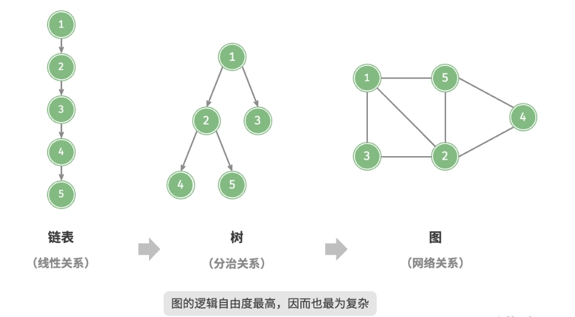

顶点和边具有**属性(Attribute)**，边可能有**方向**(有向图 Directed Graph)。
比如：社交网络中，人是顶点，人和人之间的关系是边，人(顶点)的属性比如年龄、性别、职业、
爱好等构成了一个向量，类似的，边也可用向量来表示。

## 无向图和有向图

根据边是否具有方向，可分为无向图(undirected graph)和有向图(directed graph)，如下图所示。

* 在无向图中，边表示两顶点之间的“双向”连接关系，例如微信或 QQ 中的“好友关系”。
* 在有向图中，边具有方向性，即 `$A \rightarrow B$` 和 `$A \leftarrow B$` 两个方向的边是相互独立的，
  例如微博或抖音上的 “关注” 与 “被关注” 关系。

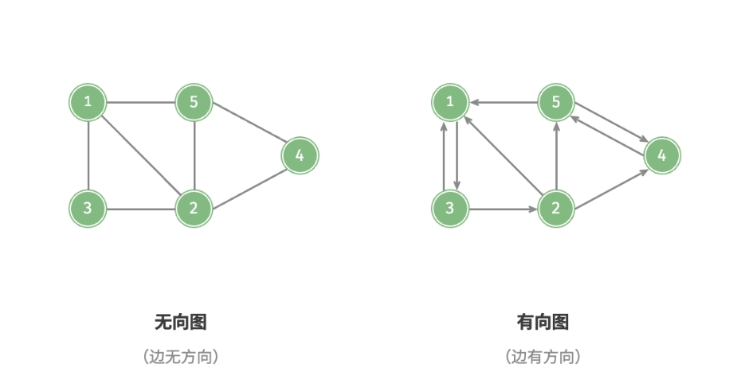

<!-- ](images/graph.png) -->

## 连通图和非连通图

根据所有顶点是否连通，可分为连通图(connected graph)和非连通图(disconnected graph)，如下图所示。

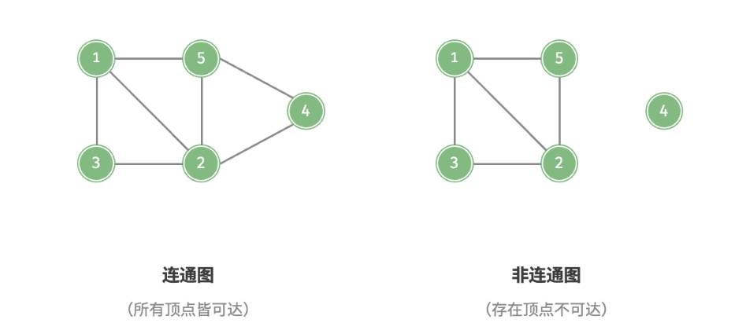

* **连通图**：若图中任意两个顶点之间至少有一条路径连接起来，即从某个顶点出发，可以到达其余任意顶点。
* **非连通图**：从某个顶点出发，至少有一个顶点无法到达。
* **连通分量**：在无向图中极大连通子图称为连通分量，注意连通分量的概念：
    - 首先，它是子图；
    - 其次，子图是连通的，连通子图具有极大顶点数；
    - 最后，具有极大顶点数的连通子图包含依附于这些顶点的所有边。
* **强连通分量**：在有向图中，如果对于每一对 `$v_{i}$` 和 `$v_{j}$`，`$v_{i} \neq v_{j}$`，
  无论从 `$v_{i}$` 到 `$v_{j}$` 还是从 `$v_{j}$` 到 `$v_{i}$` 都存在路径，则称为强连通图。
  有向图中的极大强连通子图称为有向图的强连通分量。

## 无权图和有权图

还可以为边添加“权重”变量，从而得到如下图所示的有权图（weighted graph）。
例如在《王者荣耀》等手游中，系统会根据共同游戏时间来计算玩家之间的“亲密度”，
这种亲密度网络就可以用有权图来表示。

- 对于有向图通常称有方向的边为弧(arc)，用尖括号表示弧的方向，
  如 `<A, B>` 表示弧的方向是 `$A \rightarrow B$`；
- 有向图的边或弧具有与它相关数字，这种与图的边或弧相关的数字叫作**权重**，
  在实际问题中，权通常是两个城市之间的距离、两个地点之间的运输费用等。

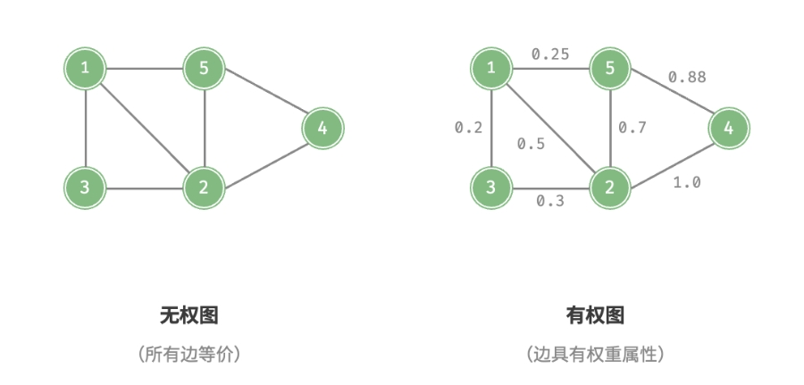

## 图的其他概念

图数据结构包含以下常用术语：

* **邻接（adjacency）**：当两顶点之间存在边相连时，称这两顶点“邻接”。
  在上图中，顶点 1 的邻接顶点为顶点 2、3、5。
* **路径（path）**：从顶点 A 到顶点 B 经过的边构成的序列被称为从 A 到 B 的“路径”。
  在上图中，边序列 1-5-2-4 是顶点 1 到顶点 4 的一条路径。
* **度（degree）**：一个顶点拥有的边数。对于有向图，
  入度（in-degree）表示有多少条边指向该顶点，
  出度（out-degree）表示有多少条边从该顶点指出。

# 图的表示方法

图本身也具有表达其自身的全局属性，来描述整个图。

## 邻接矩阵

对于图的存储和表示，最常见的方法是邻接矩阵(Adjacency Matrix)。

邻接矩阵是一个二维矩阵，其中矩阵的行和列表示顶点编号，值表示顶点之间的边信息。
设图 G 有 `$n$` 个顶点，则邻接矩阵是一个 `$n\times n$` 的方阵，
用 `$\text{arch}$` 表示，方阵的元素 `$\text{arch}[i, j]$` 定义为：

`$$\text{arch}[i,j]=\begin{cases}
1, \text{if} \space (v_{i}, v_{j}) \in E \\
0, \text{otherwise} 
\end{cases}$$`

注意：对于有向图，`$\text{arch}[i, j] \neq \text{arch}[j, i]$`，
而无向图则是 `$\text{arch}[i, j] = \text{arch}[j, i]$`。在有向图中，
通常用 `$1$` 表示 `$<v_{i}, v_{j}>$` 连通，用 `$0$` 表示 `$<v_{i}, v_{j}>$` 不连通。
在实际问题中，还可以用 `$\text{arch}[i, j]$` 表示城市之间的距离，运输的费用等。

下图中 A 和 B、C、E 相连，故第一行和第一列对应的位置为 1，其余位置为 0

<!--  -->

> **旅行商问题(Traveling Saleman Problem, TSP)：**
> 
> 以 TSP 问题讲解邻接矩阵在图分析中的应用。TSP 问题假设有一个旅行商人要拜访 `$n$` 个城市，
> 他必须选择所要走的路径，路径的限制是每个城市只能拜访一次，而且最后要回到原来出发的城市。
> 
> 问题：设有 20 个城市，要使任意两个城市之间能够直接通达，需要规划一条路线，使每个城市都能访问一次，
>
> 显然，这是一个无向图问题，设邻接矩阵 `$\text{cost}[i,j]$` 表示城市 `$i$` 和 城市 `$j$` 之间的距离，
> 基于整数规划的思想，用 0-1 变量 `$X[i,j]$` 表示从城市 `$i$` 出发访问城市 `$j$`。
> 所以，在 TSP 问题中有两个邻接矩阵；`$\text{cost}[i,j]$` 表示距离；`$X[i,j]$` 表示路径。
> TSP 问题可以建模成一个 0-1 整数规划问题，其具体如下：
> `$$\text{min}\space \sum_{i=1}^{I}\sum_{j=1}^{J}\text{cost}[i,j]\times X[i,j]$$`
> `$$\text{s.t.}\space\begin{cases}
> \sum_{i=1}^{I}X[i,j]=1, j=1,2,\cdots, J \\
> \sum_{j=1}^{J}X[i,j]=1, i=1,2,\cdots, I
> \end{cases}$$`

## 邻接列表

也可以选用边来表示图，即邻接列表(Adjacency List)，这可以大幅减少对空间的消耗，
因为实际的边比所有可能的边(邻接矩阵)数量往往小很多。

<!--  -->

# 图的常见应用

许多现实系统可以用图来建模，相应的问题也可以约化为图计算问题。

|         | 顶点 | 边                  | 图计算问题  |
|---------|------|--------------------|-------------|
| 社交网络 | 用户 | 好友关系            | 潜在好友推荐 |
| 地铁线路 | 站点 | 站点间的连通性       | 最短路线推荐 |
| 太阳系   | 星体 | 星体间的万有引力作用 | 行星轨道计算 |

# 图的基础操作

图的基本操作可分为对 “边” 的操作和对 “顶点” 的操作。
在 “邻接矩阵” 和 “邻接表” 两种表示方法下，实现方式有所不同。

## 基于邻接矩阵的实现

给定一个顶点数量为 `$n$` 的无向图，则各种操作的实现方式如下图所示。

* **添加或删除边**：直接在邻接矩阵中修改指定的边即可，使用 `$O(1)$` 时间。
  而由于是无向图，因此需要同时更新两个方向的边。
* **添加顶点**：在邻接矩阵的尾部添加一行一列，并全部填 `$0$` 即可，使用 `$O(n)$` 时间。
* **删除顶点**：在邻接矩阵中删除一行一列。当删除首行首列时达到最差情况，
  需要将 `$(n-1)^{2}$` 个元素“向左上移动”，从而使用 `$O(n^{2})$` 时间。
* **初始化**：传入 `$n$` 个顶点，初始化长度为 `$n$` 的顶点列表 vertices ，
  使用 `$O(n)$` 时间；初始化 `$n \times n$` 大小的邻接矩阵 adjMat ，
  使用 `$O(n^{2})$` 时间。


以下是基于邻接矩阵表示图的实现代码：

```python
# graph_adjacency_matrix.py

class GraphAdjMat:
    """
    基于邻接矩阵实现的无向图类
    """

    def __init__(self, vertices: list[int], edges: list[list[int]]):
        """
        构造方法
        """
        # 顶点列表，元素代表“顶点值”，索引代表“顶点索引”
        self.vertices: list[int] = []
        # 邻接矩阵，行列索引对应“顶点索引”
        self.adj_mat: list[list[int]] = []
        # 添加顶点
        for val in vertices:
            self.add_vertex(val)
        # 添加边
        # 请注意，edges 元素代表顶点索引，即对应 vertices 元素索引
        for e in edges:
            self.add_edge(e[0], e[1])

    def size(self) -> int:
        """
        获取顶点数量
        """
        return len(self.vertices)

    def add_vertex(self, val: int):
        """
        添加顶点
        """
        n = self.size()
        # 向顶点列表中添加新顶点的值
        self.vertices.append(val)
        # 在邻接矩阵中添加一行
        new_row = [0] * n
        self.adj_mat.append(new_row)
        # 在邻接矩阵中添加一列
        for row in self.adj_mat:
            row.append(0)

    def remove_vertex(self, index: int):
        """
        删除顶点
        """
        if index >= self.size():
            raise IndexError()
        # 在顶点列表中移除索引 index 的顶点
        self.vertices.pop(index)
        # 在邻接矩阵中删除索引 index 的行
        self.adj_mat.pop(index)
        # 在邻接矩阵中删除索引 index 的列
        for row in self.adj_mat:
            row.pop(index)

    def add_edge(self, i: int, j: int):
        """
        添加边
        """
        # 参数 i, j 对应 vertices 元素索引
        # 索引越界与相等处理
        if i < 0 or j < 0 or i >= self.size() or j >= self.size() or i == j:
            raise IndexError()
        # 在无向图中，邻接矩阵关于主对角线对称，即满足 (i, j) == (j, i)
        self.adj_mat[i][j] = 1
        self.adj_mat[j][i] = 1

    def remove_edge(self, i: int, j: int):
        """
        删除边
        """
        # 参数 i, j 对应 vertices 元素索引
        # 索引越界与相等处理
        if i < 0 or j < 0 or i >= self.size() or j >= self.size() or i == j:
            raise IndexError()
        self.adj_mat[i][j] = 0
        self.adj_mat[j][i] = 0

    def print(self):
        """
        打印邻接矩阵
        """
        print("顶点列表 =", self.vertices)
        print("邻接矩阵 =")
        print_matrix(self.adj_mat)
```

## 基于邻接列表的实现

设无向图的顶点总数为 `$n$`、边总数为 `$m$` ，则可根据下图所示的方法实现各种操作。

* 添加边：在顶点对应链表的末尾添加边即可，使用 `$O(1)$` 时间。
  因为是无向图，所以需要同时添加两个方向的边。
* 删除边：在顶点对应链表中查找并删除指定边，使用 `$O(m)$` 时间。
  在无向图中，需要同时删除两个方向的边。
* 添加顶点：在邻接表中添加一个链表，并将新增顶点作为链表头节点，使用 `$O(1)$` 时间。
* 删除顶点：需遍历整个邻接表，删除包含指定顶点的所有边，使用 `$O(n+m)$` 时间。
* 初始化：在邻接表中创建 `$n$` 个顶点和 `$2m$` 条边，使用 `$O(n+m)$` 时间。


以下是邻接表的代码实现。对比上图，实际代码有以下不同。

* 为了方便添加与删除顶点，以及简化代码，我们使用列表（动态数组）来代替链表。
* 使用哈希表来存储邻接表，`key` 为顶点实例，`value` 为该顶点的邻接顶点列表（链表）。

另外，我们在邻接表中使用 Vertex 类来表示顶点，这样做的原因是：
如果与邻接矩阵一样，用列表索引来区分不同顶点，那么假设要删除索引为 `$i$` 的顶点，
则需遍历整个邻接表，将所有大于 `$i$` 的索引全部减 `$1$`，效率很低。
而如果每个顶点都是唯一的 Vertex 实例，删除某一顶点之后就无须改动其他顶点了。

```python
# graph_adjacency_list.py

class GraphAdjList:
    """
    基于邻接表实现的无向图类
    """

    def __init__(self, edges: list[list[Vertex]]):
        """
        构造方法
        """
        # 邻接表，key：顶点，value：该顶点的所有邻接顶点
        self.adj_list = dict[Vertex, list[Vertex]]()
        # 添加所有顶点和边
        for edge in edges:
            self.add_vertex(edge[0])
            self.add_vertex(edge[1])
            self.add_edge(edge[0], edge[1])

    def size(self) -> int:
        """
        获取顶点数量
        """
        return len(self.adj_list)

    def add_edge(self, vet1: Vertex, vet2: Vertex):
        """
        添加边
        """
        if vet1 not in self.adj_list or vet2 not in self.adj_list or vet1 == vet2:
            raise ValueError()
        # 添加边 vet1 - vet2
        self.adj_list[vet1].append(vet2)
        self.adj_list[vet2].append(vet1)

    def remove_edge(self, vet1: Vertex, vet2: Vertex):
        """
        删除边
        """
        if vet1 not in self.adj_list or vet2 not in self.adj_list or vet1 == vet2:
            raise ValueError()
        # 删除边 vet1 - vet2
        self.adj_list[vet1].remove(vet2)
        self.adj_list[vet2].remove(vet1)

    def add_vertex(self, vet: Vertex):
        """
        添加顶点
        """
        if vet in self.adj_list:
            return
        # 在邻接表中添加一个新链表
        self.adj_list[vet] = []

    def remove_vertex(self, vet: Vertex):
        """
        删除顶点
        """
        if vet not in self.adj_list:
            raise ValueError()
        # 在邻接表中删除顶点 vet 对应的链表
        self.adj_list.pop(vet)
        # 遍历其他顶点的链表，删除所有包含 vet 的边
        for vertex in self.adj_list:
            if vet in self.adj_list[vertex]:
                self.adj_list[vertex].remove(vet)

    def print(self):
        """
        打印邻接表
        """
        print("邻接表 =")
        for vertex in self.adj_list:
            tmp = [v.val for v in self.adj_list[vertex]]
            print(f"{vertex.val}: {tmp},")
```

## 效率对比

设图中共有 `$n$` 个顶点和 `$m$` 条边，下表对比了邻接矩阵和邻接表的时间效率和空间效率。

|             | 邻接矩阵     | 邻接表(链表) | 邻接表(哈希表) |
|-------------|--------------|-------------|--------------|
| 判断是否邻接 | `$O(1)$`     | `$O(m)$`    | `$O(1)$`     |
| 添加边       | `$O(1)$`     | `$O(1)$`   | `$O(1)$` |
| 删除边       | `$O(1)$`     | `$O(m)$`   | `$O(1)$` |
| 添加顶点     | `$O(n)$`     | `$O(1)$`   | `$O(1)$` |
| 删除顶点     | `$O(n^{2})$` | `$O(n+m)$` | `$O(n)$` |
| 内存空间占用 | `$O(n^{2})$` | `$O(n+m)$`  | `$O(n+m)$` |

观察上表，似乎邻接表（哈希表）的时间效率与空间效率最优。
但实际上，在邻接矩阵中操作边的效率更高，只需一次数组访问或赋值操作即可。
综合来看，邻接矩阵体现了“以空间换时间”的原则，而邻接表体现了“以时间换空间”的原则。

# 图的遍历

树代表的是 “一对多” 的关系，而图则具有更高的自由度，可以表示任意的 “多对多” 关系。
因此，可以把树看作图的一种特例。显然，树的遍历操作也是图的遍历操作的一种特例。

图和树都需要应用搜索算法来实现遍历操作。图的遍历方式也可分为两种：
广度优先遍历和深度优先遍历。

## 广度优先遍历

> BFS

### 算法介绍

广度优先遍历是一种由近及远的遍历方式，从某个节点出发，
始终优先访问距离最近的顶点，并一层层向外扩张。
如下图所示，

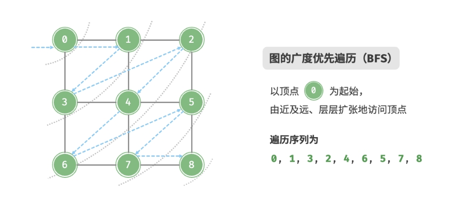

1. 从左上角顶点出发，首先遍历该顶点的所有邻接顶点；
2. 然后遍历下一个顶点的所有邻接顶点；
3. 以此类推，直至所有顶点访问完毕。

### 算法实现

BFS 通常借助队列来实现，代码如下所示。队列具有“先入先出”的性质，
这与 BFS 的“由近及远”的思想异曲同工。

1. 将遍历起始顶点 `startVet` 加入队列，并开启循环。
2. 在循环的每轮迭代中，弹出队首顶点并记录访问，然后将该顶点的所有邻接顶点加入到队列尾部。
3. 循环步骤 `2.` ，直到所有顶点被访问完毕后结束。

为了防止重复遍历顶点，我们需要借助一个哈希集合 visited 来记录哪些节点已被访问。

> 哈希集合可以看作一个只存储 key 而不存储 value 的哈希表，
> 它可以在 `$O(1)$` 时间复杂度下进行 key 的增删查改操作。
> 根据 key 的唯一性，哈希集合通常用于数据去重等场景。

```python
# graph_bfs.py

def graph_bfs(graph: GraphAdjList, start_vet: Vertex) -> list[Vertex]:
    """
    广度优先遍历
    """
    # 使用邻接表来表示图，以便获取指定顶点的所有邻接顶点
    # 顶点遍历序列
    res = []
    # 哈希集合，用于记录已被访问过的顶点
    visited = set[Vertex]([start_vet])
    # 队列用于实现 BFS
    que = deque[Vertex]([start_vet])
    # 以顶点 vet 为起点，循环直至访问完所有顶点
    while len(que) > 0:
        vet = que.popleft()  # 队首顶点出队
        res.append(vet)  # 记录访问顶点
        # 遍历该顶点的所有邻接顶点
        for adj_vet in graph.adj_list[vet]:
            if adj_vet in visited:
                continue  # 跳过已被访问的顶点
            que.append(adj_vet)  # 只入队未访问的顶点
            visited.add(adj_vet)  # 标记该顶点已被访问
    # 返回顶点遍历序列
    return res
```

### 复杂度分析

* 时间复杂度：
    - 所有顶点都会入队并出队一次，使用 `$O(|V|)$` 时间；
    - 在遍历邻接顶点的过程中，由于是无向图，因此所有边都会被访问 2 次，使用 `$O(2|E|)$` 时间；
    - 总体使用 `$O(|V|+|E|)$` 时间。
* 空间复杂度：列表 `res`，哈希集合 `visited`，队列 `que` 中的顶点数量最多为 `$|V|$`，
  使用 `$O(|V|)$` 空间。


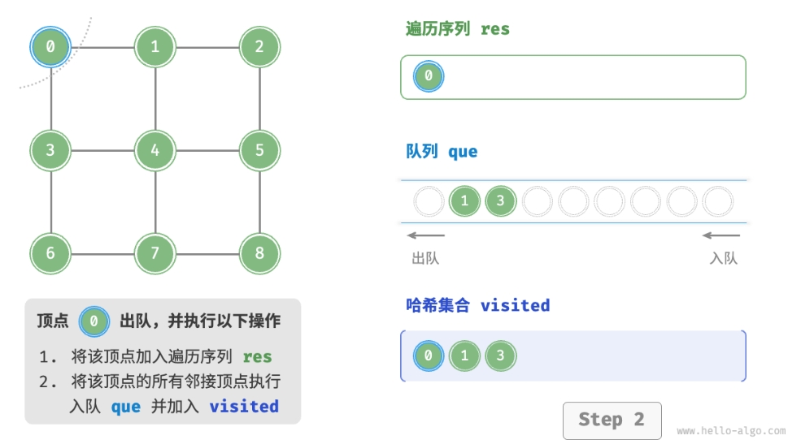
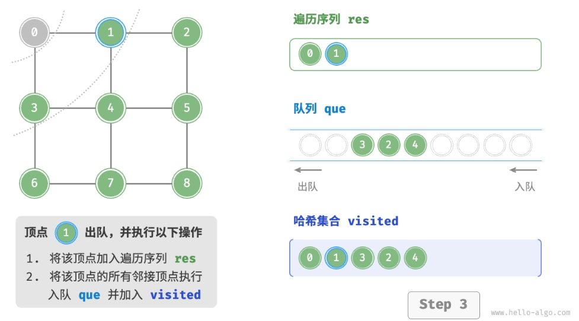

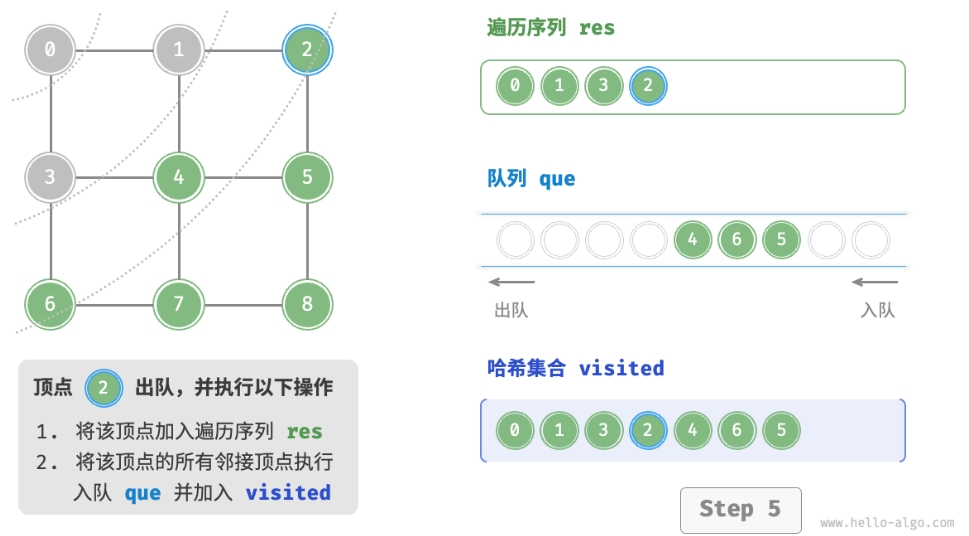

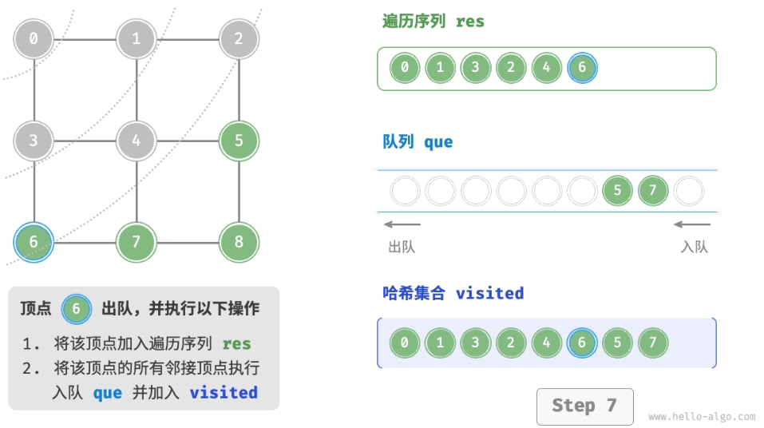
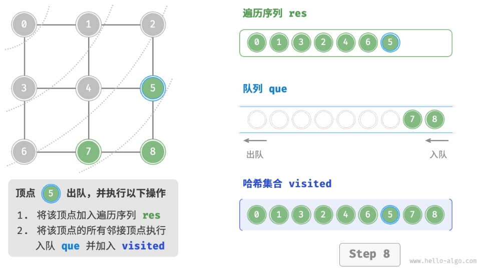

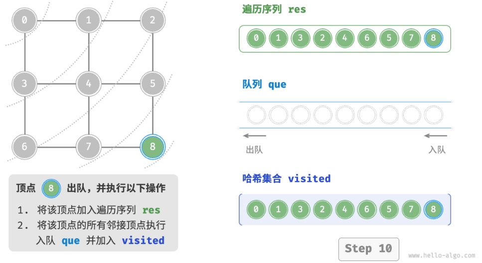
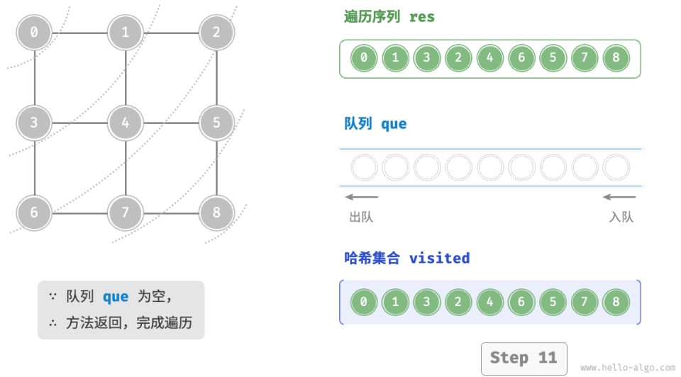

> 广度优先遍历的序列是否唯一？
> 
> 不唯一。广度优先遍历只要求按“由近及远”的顺序遍历，
> 而多个相同距离的顶点的遍历顺序允许被任意打乱。
> 以上图为例，顶点 1、3 的访问顺序可以交换，
> 顶点 2、4、6 的访问顺序也可以任意交换。

## 深度优先遍历

> DFS

### 算法介绍

深度优先遍历是一种优先走到底、无路可走再回头的遍历方式。如下图所示：

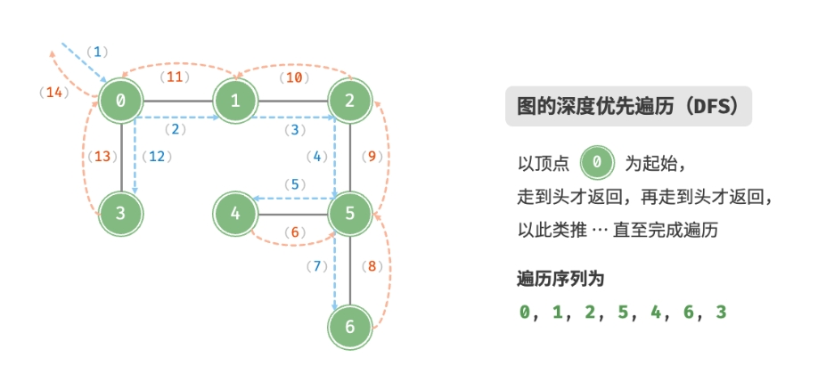

1. 从左上角顶点出发，访问当前顶点的某个邻接顶点，直到走到尽头时返回；
2. 再继续走到尽头并返回；
3. 以此类推，直至所有顶点遍历完成。

### 算法实现

这种“走到尽头再返回”的算法范式通常基于递归来实现。与广度优先遍历类似，
在深度优先遍历中，也需要借助一个哈希集合 visited 来记录已被访问的顶点，
以避免重复访问顶点。

```python
# graph_dfs.py

def dfs(graph: GraphAdjList, visited: set[Vertex], res: list[Vertex], vet: Vertex):
    """
    深度优先遍历辅助函数
    """
    res.append(vet)  # 记录访问顶点
    visited.add(vet)  # 标记该顶点已被访问
    # 遍历该顶点的所有邻接顶点
    for adjVet in graph.adj_list[vet]:
        if adjVet in visited:
            continue  # 跳过已被访问的顶点
        # 递归访问邻接顶点
        dfs(graph, visited, res, adjVet)

def graph_dfs(graph: GraphAdjList, start_vet: Vertex) -> list[Vertex]:
    """
    深度优先遍历
    """
    # 使用邻接表来表示图，以便获取指定顶点的所有邻接顶点
    # 顶点遍历序列
    res = []
    # 哈希集合，用于记录已被访问过的顶点
    visited = set[Vertex]()
    dfs(graph, visited, res, start_vet)
    return res
```

深度优先遍历的算法流程如下图所示。

* 直虚线代表向下递推，表示开启了一个新的递归方法来访问新顶点。
* 曲虚线代表向上回溯，表示此递归方法已经返回，回溯到了开启此方法的位置。

为了加深理解，建议将下图与代码结合起来，在脑中模拟（或者用笔画下来）整个 DFS 过程，
包括每个递归方法何时开启、何时返回。

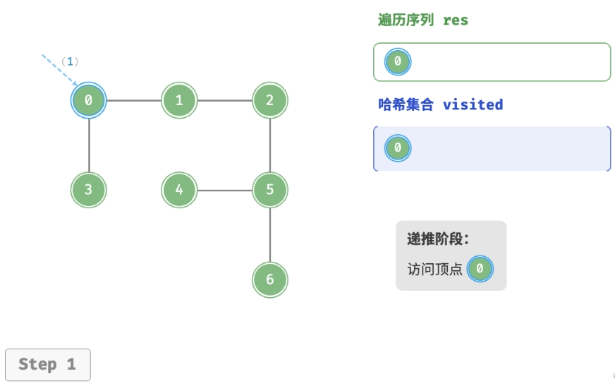
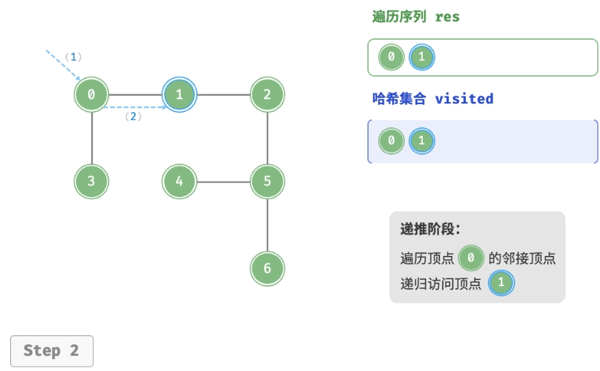
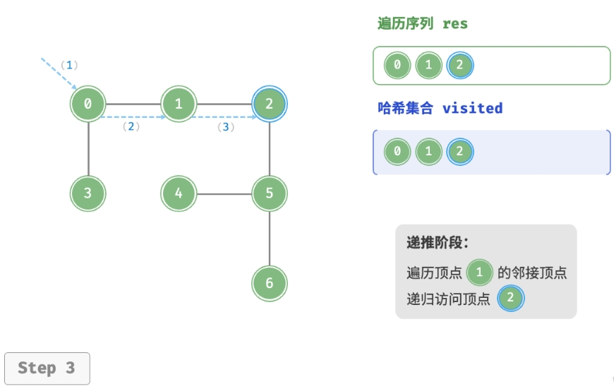
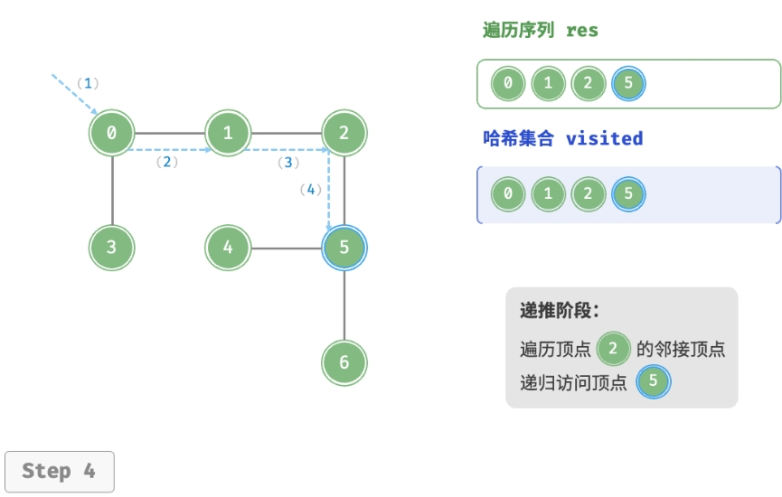

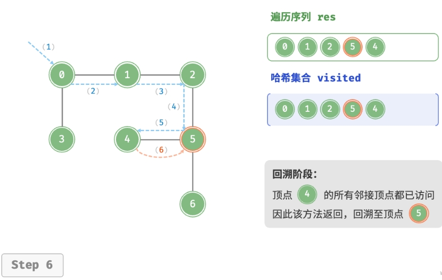
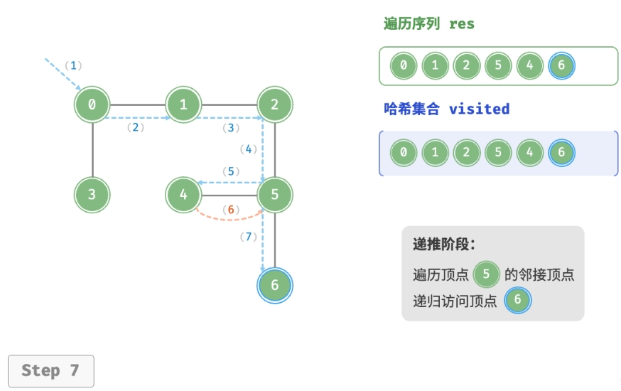


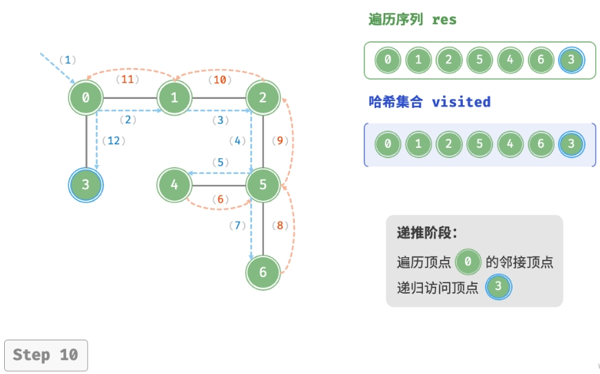


> 深度优先遍历的序列是否唯一？
> 
> 与广度优先遍历类似，深度优先遍历序列的顺序也不是唯一的。
> 给定某顶点，先往哪个方向探索都可以，即邻接顶点的顺序可以任意打乱，
> 都是深度优先遍历。
> 
> 以树的遍历为例，“根 `$\rightarrow$` 左 `$\rightarrow$`右” “左 `$\rightarrow$` 根 `$\rightarrow$` 右” “左 
> `$\rightarrow$` 右 `$\rightarrow$` 根”分别对应前序、中序、后序遍历，
>  它们展示了三种遍历优先级，然而这三者都属于深度优先遍历。

### 复杂度分析

* 时间复杂度：
    - 所有顶点都会被访问 1 次，使用 `$O(|V|)$` 时间；
    - 所有边都会被访问 2 次，使用 `$O(2|E|)$` 时间；
    - 总体使用 `$O(|V| + |E|)$` 时间。
* 空间复杂度：列表 `res`，哈希集合 `visited` 顶点数量最多为 `$|V|$`，
  递归深度最大为 `$|V|$` ，因此使用 `$O(|V|)$` 空间。

# 图问题

## 最小生成树

### 最小生成树简介

在计算机中，树是一个很重要的数据结构。生活中的很多组织关系就是以树的形式体现的，如家族图谱、
省市县三级行政划分、企业组织架构、图书分类，基于树的数据结构有极高的计算效率，
因此很多图问题会转变成树的形式来求解。

在图网络中，一个**无圈**且**连通**的**无向图**称为树。
需要注意的是，树先是无圈的，其次是连通的。最小生成树也称最小部分树，
对于一个无向图，不同的切割方法可以得到不同的树，树边的权值总和也不相同。
权值总和是衡量切割优劣的一个指标，在大部分问题中，
图经过切割后生成的树，其边权值总和最小的数称为最小生成树。

在数学建模中，如果用图的数据结构求解比较麻烦，而用树的数据结构求解比较简单时，
就会用到最小生成树，将图转换成树来建模。在实际问题中，
一个经典的案例就是村庄架设电话线问题(类似于旅行商问题，不同的是，
旅行商最短路径问题中每个节点只能访问一次，而在村庄电话线问题中，有些节点是可以被访问多次的)。

### 最小生成树算法

求解最小生成树的算法有很多，其中的一个经典算法是 **Kruskal(克鲁斯卡尔)算法**，
其原理非常直观朴素：将连通图的边按权值从小到大排序，每一步从未选择的边中选择一条权值最小的边，
逐条链接，直到获得最小生成树，在此过程中需要注意的是，判断添加边的过程是否形成环路。

为了使用 Kruskal 算法，下面介绍存储图的另一种数据结构：**边集数组**。
边集数组是一个 `$E$` 行 3 列的矩阵，`$E$` 是图的边集合数，存储的格式是：第一列是边的起点编号，
第二列是边的终点编号，第三列是边的权值，如下图。

| 起点      | 终点       | 值           |
|-----------|-----------|--------------|
| `$v_{1}$` | `$v_{2}$` | 1            |
| `$v_{1}$` | `$v_{3}$` | 3            |
| `$v_{2}$` | `$v_{4}$` | 8            |
| `$\cdots$` | `$\cdots$` | `$\cdots$` |

有了边集数组，Kruskal 算法的实现过程就很简单了。另外，还需要注意的是，
**在取新的边时，判断是否会形成环路的方法是，将之前选择过的顶点放到一个集合中，
如果下次选择新的边时，其顶点在集合中，则说明形成回路**。

最小生成树 Kruskal 算法的实现如下：

```python
import numpy as np

# 邻接矩阵
M = 99999
graph = np.array([
    [0, 1, 3, M, M, M],
    [1, 0, 2, 8, M, M],
    [3, 2, 0, 7, 3, M],
    [M, 8, 7, 0, 5, 6],
    [M, M, 3, 5, 0, 6],
    [M, M, M, 6, 6, 0],
])

# 邻接矩阵转边集数组
edge_list = []
for i in range(graph.shape[0]):
    for j in range(graph.shape[0]):
        if graph[i][j] < M:
            edge_list.append([i, j, graph[i][j]])
edge_list.sort(key = lambda a: a[2])

# 最小生成树
group = [[i] for i in range(graph.shape[0])]
res = []
for edge in edge_list:
    for i in range(len(group)):
        if edge[0] in group[i]:
            m = i
        if edge[l] in group[i]:
            n = i
    if m != n:
        res.append(edge)
        group[m] = group[m] + group[n]
        group[n] = []
print(f"最小生成树时：{res}")
```

## 最短路径问题

最短路径问题在动态规划中通过贝尔曼最优原理及其递推方程求解，这是一种反向搜索方法。

而在阶段不明确的情况下，可以用函数迭代法逐步正向搜索，直到指标函数衰减稳定得到最优解。
这些算法都是基于这个原理建立的，即在图网络分析中，
若 `$\{v_{1}, v_{2}, \cdots, v_{n}\}$` 是从 `$v_{1}$` 到 `$v_{n}$` 的最短路径，
则 `$\{v_{1}, v_{2}, \cdots, v_{i}\}$` 也必然是 `$v_{1}$` 到 `$v_{i}$` 的最短路径(`$1 \leq i \leq n$`)。


## 网络最大流问题

## 路径规划

## 车辆路径问题

> Vehicle Routing Problem, VRP, 车辆路径问题


# 参考

* [Hello 算法-图](https://www.hello-algo.com/chapter_graph/)
