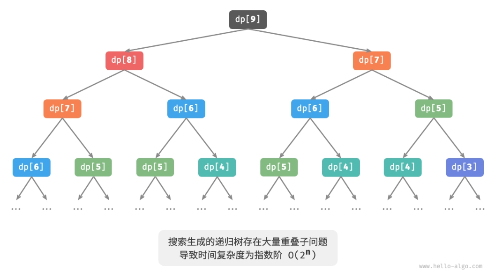
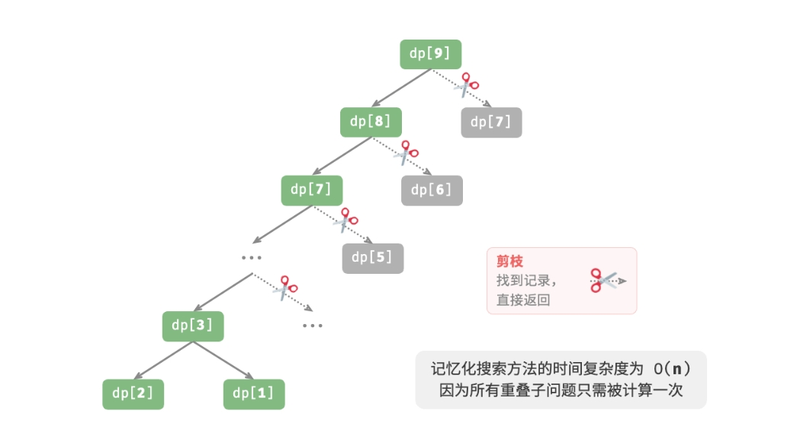
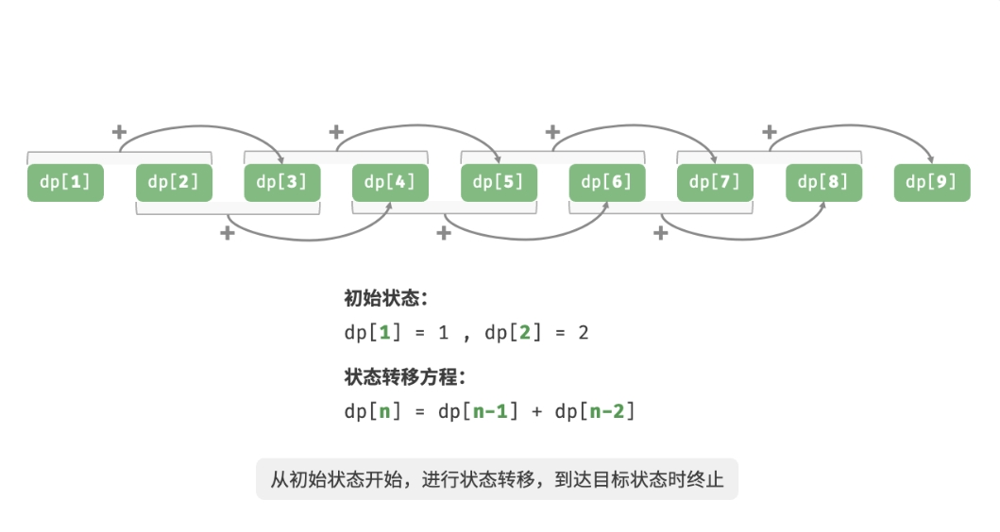
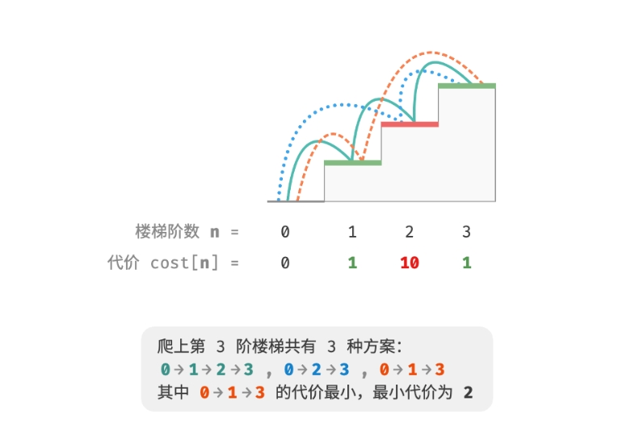
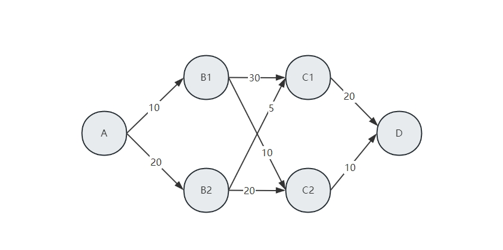

<style>
details {
    border: 1px solid #aaa;
    border-radius: 4px;
    padding: .5em .5em 0;
}
summary {
    font-weight: bold;
    margin: -.5em -.5em 0;
    padding: .5em;
}
details[open] {
    padding: .5em;
}
details[open] summary {
    border-bottom: 1px solid #aaa;
    margin-bottom: .5em;
}
img {
    pointer-events: none;
}
</style>
<details><summary>目录</summary><p>

- [动态规划简介](#动态规划简介)
    - [动态规划的定义](#动态规划的定义)
    - [多阶段决策问题](#多阶段决策问题)
    - [动态规划的基本概念](#动态规划的基本概念)
    - [动态规划的最优化原理](#动态规划的最优化原理)
- [动态规划初探](#动态规划初探)
    - [回溯算法](#回溯算法)
    - [暴力搜索](#暴力搜索)
    - [记忆化搜索](#记忆化搜索)
    - [动态规划](#动态规划)
    - [空间优化的动态规划](#空间优化的动态规划)
- [动态规划问题特性](#动态规划问题特性)
    - [最优子结构](#最优子结构)
    - [无后效性](#无后效性)
- [动态规划解题思路](#动态规划解题思路)
    - [问题判断](#问题判断)
    - [问题求解步骤](#问题求解步骤)
        - [暴力搜索](#暴力搜索-1)
        - [记忆化搜索](#记忆化搜索-1)
        - [动态规划](#动态规划-1)
        - [空间优化](#空间优化)
- [背包问题](#背包问题)
    - [0-1 背包问题](#0-1-背包问题)
    - [完全背包问题](#完全背包问题)
- [最短路径问题](#最短路径问题)
    - [动态规划](#动态规划-2)
    - [整数规划](#整数规划)
- [编辑距离问题](#编辑距离问题)
- [参考](#参考)
</p></details><p></p>

# 动态规划简介

## 动态规划的定义

维基百科的定义：

> dynamic programming is a method for solving a complex problem 
> by breaking it down into a collection of simpler subproblems.

<!-- 动态规划的本质是对问题状态的定义和状态转移方程的定义。
动态规划是通过拆分问题，定义问题状态和状态之间的关系，
使得问题能够以递推(或者说是分治)的方式去解决。
如何拆分问题是动态规划的核心，而拆分问题靠的就是状态的定义和状态转移方程的定义。 -->

计算机算法定义：

> 动态规划（Dynamic Programming）是一个重要的算法范式，它将一个问题分解为一系列更小的子问题，
> 并通过存储子问题的解来避免重复计算，从而大幅提升时间效率。

运筹学定义：

> 动态规划（Dynamic Programming, DP）是运筹学的一个分支，是解决多阶段决策过程最优化的一种方法。
> 它把多变量复杂决策的问题进行分阶段决策，可高效求解多个单变量的决策问题。动态规划在现代企业管理、
> 工农业生产中有着广泛的应用，许多问题用动态规划处理，比用线性规划或非线性规划处理更加有效，如最短路径、
> 设备维修换新、多阶段库存等问题。

## 多阶段决策问题

有这样一类问题，它可以从时间或空间上将决策的过程分解为若干个相互联系的阶段，每个阶段都需要做出决策，
当前阶段的决策往往会影响到下一个阶段的决策，将各阶段的决策构成一个决策序列，称为策略。
每个阶段都有若干个决策可供选择，因此就有许多决策可以选择。如果在这些策略中选择一个最优策略，

## 动态规划的基本概念

## 动态规划的最优化原理


# 动态规划初探

> 爬楼梯方案数量问题
> 
> 问题：给定一个共有 `$n$` 阶的楼梯，每步可以上 1 阶或者 2 阶，请问有多少种方案可以爬到楼顶？


## 回溯算法

本题的目标是求解方案数量，可以考虑通过回溯来穷举所有可能性。具体来说，将爬楼梯想象为一个多轮选择的过程：
从地面出发，每轮选择上 1 阶或 2 阶，每当到达楼梯顶部时就将方案数量加 1，当越过楼梯顶部时就将其剪枝。

```python
# climbing_stairs_backtrack.py
# 深度优先搜索
from typing import List

def backtrack(choices: List[int], state: int, n: int, res: List[int]) -> int:
    """
    回溯

    Args:
        choices (List[int]): 每一步的选择，可以选择每步向上爬的阶数
        state (int): 当前状态，在第几阶
        n (int): 爬到第几层
        res (List[int]): 使用 res[0] 记录方案数量
    """
    # 当爬到第 n 阶时，方案数量加 1
    if state == n:
        res[0] += 1
    # 遍历所有选择
    for choice in choices:
        # 剪枝：不允许越过第 n 阶
        if state + choice > n:
            continue
        # 尝试：做出选择，更新状态
        backtrack(choices, state + choice, n, res)
        # 回退


def climbing_stairs_backtrack(n: int) -> int:
    """
    爬楼梯：回溯

    Args:
        n (int): 爬到第几层

    Returns:
        int: 爬楼梯到第 n 阶的方案数量
    """
    choices = [1, 2]  # 可以选择向上爬 1 阶或 2 阶
    state = 0  # 从第 0 阶开始爬
    res = [0]  # 使用 res[0] 记录方案数量
    backtrack(choices, state, n, res)

    return res[0]


# 测试代码 main 函数
def main():
    res = climbing_stairs_backtrack(3)
    print(res)
    
if __name__ == "__main__":
    main()
```

```
3
```

## 暴力搜索

回溯算法通常并不显式地对问题进行拆解，而是将求解问题看作一些列决策步骤，
通过试探和剪枝，搜索所有可能的解。

现在尝试从问题分解的角度分析这道题，设爬到第 `$i$` 阶共有 `$dp[i]$` 种方案，
那么 `$dp[i]$` 就是原问题，其子问题包括：

`$$dp[i-1], dp[i-2], \cdots, dp[2], dp[1]$$`

由于每轮只能上 1 阶或 2阶，因此当站在第 `$i$` 阶楼梯上时，上一轮只可能站在第 `$i-1$` 阶或第 `$i-2$` 阶上。
换句话说，只能从第 `$i-1$` 阶或第 `$i-2$` 阶迈向第 `$i$` 阶。
由此便可得出一个重要推论：爬到第 `$i-1$` 阶的方案树加上爬到第 `$i-2$` 阶的方案数就等于爬到第 `$i$` 阶的方案数。
公式如下：

`$$dp[i] = dp[i-1] +dp[i-2]$$`

这意味着在爬楼梯问题中，各个子问题之间存在递推关系，原问题的解可以由子问题的解构建得来。下图展示了该递推关系：


可以根据递推公式得到暴力搜索解法。以 `$dp[n]$` 为起始点，递归地将一个较大问题拆解为两个较小问题的和，
直至到达最小子问题 `$dp[1]$` 和 `$dp[2]$` 时返回。其中，最小子问题的解是已知的，即 `$dp[1]=1$`、`$dp[2]=2$`，
表示爬到第 1、2 阶分别有 1、2种方案。

```python
# climbing_stairs_dfs.py
# 深度优先搜索
def dfs(i: int) -> int:
    """
    搜索

    Args:
        i (int): 目标楼梯阶数

    Returns:
        int: 爬楼梯方案数
    """
    # 已知 dp[1] 和 dp[2]，返回
    if i == 1 or i == 2:
        return i
    # dp[i] = dp[i-1] + dp[i-2]
    count = dfs(i - 1) + dfs(i - 2)

    return count


def climbing_stairs_dfs(n: int) -> int:
    """
    爬楼梯：搜索

    Args:
        n (int): 目标楼梯阶数

    Returns:
        int: 爬楼梯方案数
    """
    return dfs(n)


# 测试代码 main 函数
def main():
    res = climbing_stairs_dfs(3)
    print(res)

if __name__ == "__main__":
    main()
```

```
3
```

下图展示了暴力搜索形成的递归树。对于问题 `$dp[n]$`，其递归树的深度为 `$n$`，时间复杂度为 `$O(2^{n})$`。
指数阶属于爆炸式增长，如果我们输入一个比较大的 `$n$`，则会陷入漫长的等待之中。



**指数阶的时间复杂度是 “重叠子问题” 导致的**。例如 `$dp[9]$` 被分解为 `$dp[8]$` 和 `$dp[7]$`，
`$dp[8]$` 被分解为 `$dp[7]$` 和 `$dp[6]$`，两者都包含子问题 `$dp[7]$`。
以此类推，子问题中包含更小的重叠子问题，子子孙孙无穷尽也。绝大部分计算资源浪费在这些重叠的子问题上。

## 记忆化搜索

为了提升算法效率，希望所有的重叠子问题都只被计算一次。为此，声明一个数组来记录每个子问题的解，
并在搜索过程中将重叠子问题剪枝。

1. 当首次计算 `$dp[i]$` 时，我们将其记录至 `$mem[i]$`，以便之后使用。
2. 当再次需要计算 `$dp[i]$` 时，我们便可直接从 `$mem[i]$` 中获取结果，从而避免重复计算该子问题。

```python
# climbing_stairs_dfs_mem.py
from typing import List

def dfs(i: int, mem: List[int]) -> int:
    """
    记忆化搜索

    Args:
        i (int): 目标楼梯阶数
        mem (List[int]): 记录每个子问题的解

    Returns:
        int: 爬楼梯方案数
    """
    # 已知 dp[1] 和 dp[2]，返回
    if i == 1 or i == 2:
        return i
    # 若存在记录 dp[i]，则直接返回
    if mem[i] != -1:
        return mem[i]
    # dp[i] = dp[i-1] + dp[i-2]
    count = dfs(i - 1, mem) + dfs(i - 2, mem)
    # 记录 dp[i]
    mem[i] = count
    
    return count


def climbing_stairs_dfs_mem(n: int) -> int:
    """
    爬楼梯：记忆化搜索

    Args:
        n (int): 目标楼梯阶数

    Returns:
        int: 爬楼梯方案数
    """
    mem = [-1] * (n + 1)

    return dfs(n, mem)


# 测试代码 main 函数
def main():
    res = climbing_stairs_dfs_mem(3)
    print(res)

if __name__ == "__main__":
    main()
```

经过记忆化处理后，所有重叠子问题都只需计算一次，时间复杂度优化至 `$O(n)$`，这是一个巨大的飞跃。



## 动态规划

记忆化搜索是一种 “从顶至底” 的方法：从原问题（根节点）开始，递归地将较大子问题分解为较小子问题，
直至解已知的最小子问题（叶节点）。之后，通过回溯逐层收集子问题的解，构建出原问题的解。

与之相反，动态规划是一种“从底至顶”的方法：从最小子问题的解开始，迭代地构建更大子问题的解，
直至得到原问题的解。

由于动态规划不包含回溯过程，因此只需要使用循环迭代实现，无须使用递归。

```python
# climbing_stairs_dp.py
def climbing_stairs_dp(n: int) -> int:
    """
    爬楼梯：动态规划

    Args:
        n (int): 目标楼梯阶数

    Returns:
        int: 爬楼梯方案数
    """
    if n == 1 or n == 2:
        return n
    # 初始化 dp 表，用于存储子问题的解
    dp = [0] * (n + 1)
    # 初始状态：预设最小子问题的解
    dp[1], dp[2] = 1, 2
    # 状态转移：从较小子问题逐步求解较大子问题
    for i in range(3, n + 1):
        dp[i] = dp[i-1] + dp[i-2]
    
    return dp[n]


# 测试代码 main 函数
def main():
    res = climbing_stairs_dp(3)
    print(res)

if __name__ == "__main__":
    main()
```

下图模拟了以上代码的执行过程：



与回溯算法一样，动态规划也使用“状态”概念来表示问题求解的特定阶段，每个状态都对应一个问题以及相应的局部最优解。
例如，爬楼梯问题的状态定义为当前所在楼梯阶数 `$i$`。

根据以上内容，可以总结出动态规划的常用术语：

* 将数组 `dp` 称为 **dp 表**，`$dp[i]$` 表示状态 `$i$` 对应子问题的解。
* 将最小子问题对应的状态（第 1 阶和第 2 阶楼梯）称为**初始状态**。
* 将递推公式 `$dp[i] = dp[i-1] + dp[i-2]$` 称为**状态转移方程**。

## 空间优化的动态规划

由于 `$dp[i]$` 只与 `$dp[i-1]$` 和 `$dp[i-2]$` 有关，因此无须使用一个数组 `dp` 来存储所有子问题的解，
而只需两个变量滚动前进即可。

```python
def climbing_stairs_dp_comp(n: int) -> int:
    """
    爬楼梯：空间优化后的动态规划

    Args:
        n (int): _description_

    Returns:
        int: _description_
    """
    if n == 1 or n == 2:
        return n
    a, b = 1, 2
    for _ in range(3, n + 1):
        a, b = b, a + b
    
    return b
```

观察以上代码，由于省去了数组 dp 占用的空间，因此空间复杂度从 `$O(n)$` 降至 `$O(1)$`。

在动态规划问题中，当前状态往往仅与前面有限个状态有关，这时我们可以只保留必要的状态，
通过“降维”来节省内存空间。这种空间优化技巧被称为“滚动变量”或“滚动数组”。

# 动态规划问题特性

在上一节中，介绍了动态规划是如何通过子问题分解来求解原问题的。实际上，
子问题分解是一种通用的算法思路，在分治、动态规划、回溯中的侧重点不同。

* **分治算法**递归地将原问题划分为多个相互独立的子问题，直至最小问题，并在回溯中合并子问题的解，
  最终得到原问题的解。
* **动态规划**也对问题进行递归分解，但与分治算法的主要区别是，动态规划中的子问题是相互依赖的，
  在分解过程中会出现许多重叠子问题。
* **回溯算法**在尝试和回退中穷举所有可能的解，并通过剪枝避免不必要的搜索分支。
  原问题的解由一系列决策步骤构成，可以将每个决策步骤之前的子序列看作一个子问题。

实际上，动态规划常用来求解最优化问题，他们不仅包含重叠子问题，还具有另外两大特性：最优子结构、
无后效性。

## 最优子结构

对爬楼梯问题稍作改动，使之更加适合展示最优子结构概念。

> 给定一个楼梯，每一步可以上 1 阶或者 2 阶，每一阶楼梯上都贴有一个非负整数，
> 表示你在该台阶所需要付出的代价。给定一个非负整数数组 `cost`，
> 其中 `cost[i]` 表示在第 `$i$` 个台阶需要付出的代价，`cost[0]` 为地面（起始点）。
> 请计算最少需要付出多少代价才能到达顶部？

如下图所示，若 1、2、3 阶的代价分别为 1、10、1，则从地面爬到第 3 阶的最小代价为 2。



设 `$dp[i]$` 为爬到第 `$i$` 阶累计付出的代价，由于第 `$i$` 阶只可能从 `$i-1$` 阶或 `$i-2$` 阶走来，
因此 `$dp[i]$` 只可能等于 `$dp[i-1]+cost[i]$` 或 `$dp[i-2]+cost[i]$`。
为了尽可能减少代价，应该选择两者中较小的那一个：

`$$dp[i] = min(dp[i-1], dp[i-2]) + cost[i]$$`

这便可以引出最优子结构的含义：**原问题的最优解是从子问题的最优解构建得来的**。
本题显然具有最优子结构：从两个子问题最优解 `$dp[i-1]$` 和 `$dp[i-2]$` 中挑选出较优的那一个，
并用它构建出原问题 `$dp[i]$` 的最优解。

那么，上一节的爬楼梯题目有没有最优子结构呢？它的目标是求解方案数量，看似是一个计数问题，但如果换一种问法：
“求解最大方案数量”。我们意外地发现，虽然题目修改前后是等价的，但最优子结构浮现出来：
第 `$n$` 阶最大方案数量等于第 `$n-1$` 阶和第 `$n-2$` 阶最大方案数量之和。所以说，
最优子结构的解释方式比较灵活，在不同问题中会有不同的含义。

根据状态转移方程，以及初始状态 `$dp[1]=cost[1]$` 和 `$dp[2]=cost[2]$`，就可以得到动态规划代码：

```python
# min_cost_climbing_stairs_dp.py
from typing import List

def min_cost_climbing_stairs_dp(cost, List[int]) -> int:
    """
    爬楼梯最小代价：动态规划
    """
    n = len(cost) - 1
    if n == 1 or n == 2:
        return cost[n]
    # 初始化 dp 表，用于存储子问题的解
    dp = [0] * (n + 1)
    # 初始状态：预设最小子问题的解
    dp[1], dp[2] = cost[1], cost[2]
    # 状态转移：从较小子问题逐步求解较大子问题
    for i in range(3, n + 1):
        dp[i] = min(dp[i - 1], dp[i - 2]) + cost[i]
    
    return dp[n]
```

下图展示了以上代码的动态规划过程：


本题也可以进行空间优化，将一维压缩至零维，使得空间复杂度从 `$O(n)$` 降至 `$O(1)$`：

```python
# min_cost_climbing_stairs_dp.py
from typing import List

def min_cost_climbing_stairs_dp(cost, List[int]) -> int:
    """
    爬楼梯最小代价：动态规划
    """
    n = len(cost) - 1
    if n == 1 or n == 2:
        return cost[n]
    # 初始状态：预设最小子问题的解
    a, b = cost[1], cost[2]
    # 状态转移：从较小子问题逐步求解较大子问题
    for i in range(3, n + 1):
        a, b = b, min(a, b) + cost[i]
    
    return b
```

## 无后效性

无后效性是动态规划能够有效解决问题的重要特性之一，其定义为：**给定一个确定的状态，
它的未来发展只与当前状态有关，而与过去经历的所有状态无关**。

以爬楼梯问题为例，给定状态 `$i$`，它会发展出状态 `$i+1$` 和状态 `$i+2$`，分别对应跳 1 步和跳 2 步。
在做出这两种选择时，无须考虑状态 `$i$` 之前的状态，它们对状态 `$i$` 的未来没有影响。

然而，如果我们给爬楼梯问题添加一个约束，情况就不一样了。

> 带约束爬楼梯
>
> 给定一个共有 `$n$` 阶的楼梯，每步可以上 1 阶或者 2 阶，但不能连续两轮跳 1 阶，
> 请问有多少种方案可以爬到楼顶？

如下图所示，爬上第 3 阶仅剩 2 种可行方案，其中连续三次跳 1 阶的方案不满足约束条件，因此被舍弃。


在该问题中，如果上一轮是跳 1 阶上来的，那么下一轮就必须跳 2 阶。
这意味着，下一步选择不能由当前状态（当前所在楼梯阶数）独立决定，
还和前一个状态（上一轮所在楼梯阶数）有关。


# 动态规划解题思路

对于一个问题：

1. 如何判断一个问题是不是动态规划问题？
2. 求解动态规划问题该从何处入手，完整步骤是什么？

## 问题判断

总的来说，如果一个问题包含重叠子问题、最优子结构，并满足无后效性，那么它通常适合用动态规划求解。
然而，我们很难从问题描述中直接提取出这些特性。因此我们通常会放宽条件，先观察问题是否适合使用回溯（穷举）解决。

适合用回溯解决的问题通常满足“决策树模型”，这种问题可以使用树形结构来描述，
其中每一个节点代表一个决策，每一条路径代表一个决策序列。

换句话说，如果问题包含明确的决策概念，并且解是通过一系列决策产生的，
那么它就满足决策树模型，通常可以使用回溯来解决。

在此基础上，动态规划问题还有一些判断的“加分项”。

* 问题包含最大（小）或最多（少）等最优化描述。
* 问题的状态能够使用一个列表、多维矩阵或树来表示，并且一个状态与其周围的状态存在递推关系。


相应地，也存在一些“减分项”。

* 问题的目标是找出所有可能的解决方案，而不是找出最优解。
* 问题描述中有明显的排列组合的特征，需要返回具体的多个方案。

如果一个问题满足决策树模型，并具有较为明显的“加分项”，我们就可以假设它是一个动态规划问题，
并在求解过程中验证它。

## 问题求解步骤

动态规划的解题流程会因问题的性质和难度而有所不同，但通常遵循以下步骤：

1. 描述决策
2. 定义状态
3. 建立 `$dp$` 表
4. 推导状态转移方程
5. 确定边界条件等

为了更形象地展示解题步骤，我们使用一个经典问题“最小路径和”来举例。

给定一个 `$n\times m$` 的二维网格 `grid`，网格中的每个单元格包含一个非负整数，
表示该单元格的代价。机器人以左上角单元格为起始点，每次只能向下或者向右移动一步，
直至到达右下角单元格。请返回从左上角到右下角的最小路径和。


### 暴力搜索

### 记忆化搜索

### 动态规划

### 空间优化


# 背包问题

动态规划的一个常见例子是背包问题，一个背包最多能放 `$n$`kg 的物品，每个物品的重量和价值都已经知道，
那要选择哪些物品才能使背包内的物品总价值最大。背包问题可以看成是一个多阶段规划问题，如果选择物品 A，
占用的空间将使得其他可供选择的物品减少。虽然简单背包问题可以用整数规划方法求解，但是用动态规划方法求解更为高效。

## 0-1 背包问题

## 完全背包问题


# 最短路径问题

一个较常见的多阶段决策问题是网络最短路径问题，如下图。给定一个网络，
需要从 A 出发到达 D，如何选择路径才能使总路程最短，显然这是一个 4 阶段决策问题。



## 动态规划

```python

```

## 整数规划

使用动态规划求解从起点到终点的最短路径，其实也可以看成是一个整数规划问题。

用 `$edge=(i, j, l)$` 表示从 `$i$` 点出发到达 `$j$` 节点距离为 `$l$` 的边，
对于非起点和终点，如 `$B_{1}$` 节点。

* 如果 `$B_{1}$` 节点被选中，则进来的边数等于出去的边数；
* 如果 `$B_{1}$` 节点没有被选中，则出去的边数和进来的边数都是 0。
* 对于起点，只有出去的边，没有进来的边；对于终点，则只有进来的边没有出去的边

将该问题可以建模成一个简单的 0-1 整数规划问题，即：

`$$min \sum l_{ij} x_{ij}$$`

`$$s.t. \begin{cases}
\sum_{j} x_{ji} - \sum_{j}x_{ij} = 0, i \notin \{A, D\} \\
\sum_{j} x_{ji} - \sum_{j}x_{ij} = 1, i \notin \{A\} \\
\sum_{j} x_{ji} - \sum_{j}x_{ij} = -1, i \notin \{D\} \\
x_{ij} = \{0, 1\}
\end{cases}$$`

用整数规划 MIP 解最短路径示例代码如下：

```python
import gurobipy as grb

# 定义边
edge = {
    ("V1", "A"): 0,
    ("A", "B1"): 10,
    ("A", "B2"): 20,
    ("B1", "C1"): 30,
    ("B1", "C2"): 10,
    ("B2", "C1"): 5,
    ("B2", "C2"): 20,
    ("C1", "D"): 20,
    ("C2", "D"): 10,
    ("D", "V2"): 0,
}

# 创建边和边长度的 Gurobi 常量
links, length = grb.multidict(edge)

# 创建模型
m = grb.Model()
x = m.addVars(links, obj = length, name = "flow")

# 添加约束
for i in ["A", "B1", "B2", "C1", "C2", "D"]:
    if i == "A":
        delta = 1
    elif i == "D":
        delta = -1
    else:
        delta = 0
    
    name = f"C_{i}"
    m.addConstrs(
        sum(x[i, j] for i, j in links.select(i, "*")) - sum(x[j, i] for j, i in links.select("*", i)) == delta, 
        name = name
    )
    # m.addConstrs(
    #     x.sum(i, "*") - x.sum("*", i) == delta, 
    #     name = name
    # )

# 求解并打印结果
m.optimize()

for i, j in links:
    if (x[i, j].x > 0):
        print(f"{i}->{j}: {edge[(i, j)]}")


# 测试代码 main 函数
def main():
    pass

if __name__ == "__main__":
    main()
```


```
Restricted license - for non-production use only - expires 2024-10-28
Gurobi Optimizer version 10.0.2 build v10.0.2rc0 (win64)

CPU model: 13th Gen Intel(R) Core(TM) i7-13700K, instruction set [SSE2|AVX|AVX2]
Thread count: 16 physical cores, 24 logical processors, using up to 24 threads

Optimize a model with 6 rows, 10 columns and 18 nonzeros
Model fingerprint: 0x2edb9c0e
Coefficient statistics:
  Matrix range     [1e+00, 1e+00]
  Objective range  [5e+00, 3e+01]
  Bounds range     [0e+00, 0e+00]
  RHS range        [1e+00, 1e+00]
Presolve removed 4 rows and 6 columns
Presolve time: 0.00s
Presolved: 2 rows, 4 columns, 8 nonzeros

Iteration    Objective       Primal Inf.    Dual Inf.      Time
       0    0.0000000e+00   2.000000e+00   0.000000e+00      0s
       1    3.0000000e+01   0.000000e+00   0.000000e+00      0s

Solved in 1 iterations and 0.00 seconds (0.00 work units)
Optimal objective  3.000000000e+01
A->B1: 10
B1->C2: 10
C2->D: 10
```

# 编辑距离问题


# 参考

* [什么是动态规划](https://www.zhihu.com/question/23995189/answer/35324479)
* [Hello 算法-动态规划](https://www.hello-algo.com/chapter_dynamic_programming/)
