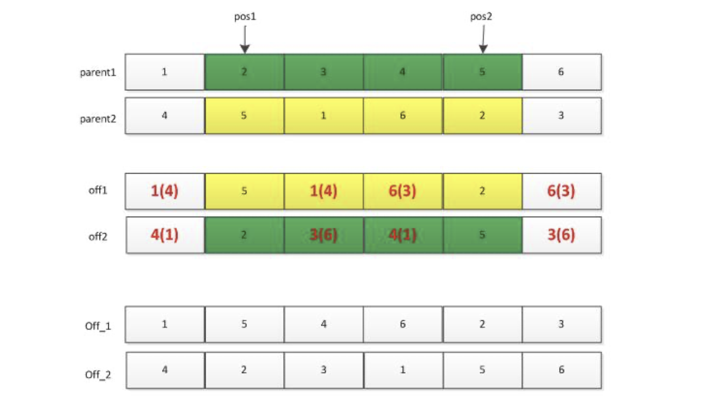

<style>
details {
    border: 1px solid #aaa;
    border-radius: 4px;
    padding: .5em .5em 0;
}
summary {
    font-weight: bold;
    margin: -.5em -.5em 0;
    padding: .5em;
}
details[open] {
    padding: .5em;
}
details[open] summary {
    border-bottom: 1px solid #aaa;
    margin-bottom: .5em;
}
img {
    pointer-events: none;
}
</style>

<details><summary>目录</summary><p>

- [遗传算法](#遗传算法)
    - [算法简介](#算法简介)
    - [核心概念](#核心概念)
    - [主要步骤](#主要步骤)
        - [种群初始化](#种群初始化)
        - [种群评价](#种群评价)
        - [选择操作](#选择操作)
        - [交叉操作](#交叉操作)
        - [变异操作](#变异操作)
- [Python 实现](#python-实现)
- [参考](#参考)
</p></details><p></p>

# 遗传算法

> 遗传算法通过组合群体中不同成员的解演化出更好的启发式优化解。
> 
> 达尔文名言：能够生存下来的往往不是数量大的物种，也不是最聪明的物种，而是最能适应环境的物种。

## 算法简介

遗传算法(Genetic Alogrithm，GA)是最早由美国 Holland 教授提出的一种基于自然界的“适者生存，
优胜劣汰”基本法则的智能搜索算法，该法则很好地诠释了生物进化的自然选择过程。
该算法模拟达尔文生物进化论的自然选择和遗传学机理的生物进化过程的计算模型，
是一种通过模拟自然进化过程搜索最优解的方法。

遗传算法也是借鉴该基本法则，**通过基于种群的思想，将问题的解通过编码的方式转化为种群中的个体，
并让这些个体不断地通过选择、交叉和变异算子模拟生物的进化过程，
然后利用“优胜劣汰”法则选择种群中适应性较强的个体构成子种群，然后让子种群重复类似的进化过程，
直到找到问题的最优解或者到达一定的进化（运算）时间**。

其主要特点是：

* 直接对结构对象进行操作，不存在求导和函数连续性的限定
* 具有内在的隐并行性和更好的全局寻优能力
* 采用概率化的寻优方法，不需要确定的规则就能自动获取和指导优化的搜索空间，自适应地调整搜索方向

遗传算法以一种群体中的所有个体为对象，并利用**随机化技术**指导对一个被编码的参数空间进行高效搜索。
其中，**选择**、**交叉**和**变异**构成了遗传算法的遗传操作；
**参数编码**、**初始群体的设定**、**适应度函数设计**、**遗传操作设计**、
**控制参数设定**五个要素组成了遗传算法的核心内容。

## 核心概念

* **个体（染色体）**
    - 自然界中一个个体（染色体）代表一个生物，在 GA 算法中，
      个体（染色体）代表了**具体问题的一个解**。
* **基因**
    - 在 GA 算法中，基因代表了具体问题解的一个**决策变量**。
* **种群**
    - 多个个体即组成一个种群。在 GA 算法中，**一个问题的多组解**即构成了问题的解的种群。

## 主要步骤

**遗传算法是从代表问题可能潜在的解集的一个种群(population)开始的，
即 <span style='border-bottom:1.5px dashed red;'>种群初始化</span>。
而一个种群则由经过基因(gene)编码的一定数目的个体(individual)组成。
每个个体实际上是染色体(chromosome)带有特征的实体。**
染色体作为遗传物质的主要载体，即多个基因的集合，其内部表现(即基因型)是某种基因组合，
它决定了个体的形状的外部表现，如黑头发的特征是由染色体中控制这一特征的某种基因组合决定的。
因此，在一开始需要实现从表现型到基因型的映射即 <span style='border-bottom:1.5px dashed red;'>编码</span> 工作。
由于仿照基因编码的工作很复杂，往往进行简化，如二进制编码。

初代种群产生之后，按照适者生存和优胜劣汰的原理，逐代(generation)演化产生出越来越好的近似解。
在每一代，根据问题域中个体的 <span style='border-bottom:1.5px dashed red;'>适应度(fitness)</span> 大小 <span style='border-bottom:1.5px dashed red;'>选择(selection)</span> 个体，
并借助于自然遗传学的遗传算子(genetic operators)进行组合 <span style='border-bottom:1.5px dashed red;'>交叉(crossover，形象点就是种群个体之间进行交配)</span> 和 <span style='border-bottom:1.5px dashed red;'>变异(mutation，基因变异)</span>，产生出代表新的解集的种群。

这个过程将导致种群像自然进化一样，后生代种群比前代更加适应于环境，
末代种群中的最优个体经过 <span style='border-bottom:1.5px dashed red;'>解码(decoding)</span>，
可以作为问题近似最优解。

主要操作步骤如下：


详细操作步骤如下：


### 种群初始化

选择一种编码方案，然后在解空间内通过随机生成的方式初始化一定数量的个体构成 GA 的种群。

种群的初始化和具体问题相关，一般来说可以采取某种分布（如高斯分布）在一定求解范围内随机获取。

### 种群评价

种群的评价即计算种群中个体的适应度值。

假设种群有 popsize 个个体，依次计算每个个体的适应度值及评价种群，
或者利用启发式算法对种群中的个体（矩形件的排入顺序）生成排样图并依此计算个体的适应函数值（利用率），
然后保存**当前种群中的最优个体**作为搜索到的最优解。

### 选择操作

常见的选择操作有**轮盘赌**的方式，即根据个体的适应度计算被选中的概率，公式如下：

`$$P(x_j)=\frac{\text{fit}(x_j)}{\sum_{i=1}^n \text{fit}(x_i)}, j\in{1,2,\cdots,n}$$`

### 交叉操作

一般以概率阀值 `$Pc$` 控制是否进行**单点交叉**、**多点交叉**或者**其他交叉方式**生成新的交叉个体。
交叉操作也有许多种：单点交叉、两点交叉、多点交叉等。此处仅讲解一下两点交叉。

1. 首先利用选择操作从种群中选择两个父辈个体 `parent1` 和 `parent2`；
2. 然后随机产生两个位置 `pos1` 和 `pos2`，将这两个位置中间的基因位信息进行交换，
   便得到下图所示的 `off1` 和 `off2` 两个个体，
   但是这两个个体中一般会存在基因位信息冲突的现象(整数编码时)，
   此时需要对 `off1` 和 `off2` 个体进行调整：
    - `off1` 中的冲突基因根据 `parent1` 中的基因调整为 `parent2` 中的相同位置处的基因。
      如 `off1` 中的 `"1"` 出现了两次，
      则第二处的 `"1"` 需要调整为 `parent1` 中 `"1"` 对应的 `parent2` 中的 `"4"`；
    - 依次类推处理 `off2` 中的相冲突的基因。需要注意的是，调整 `off2`，则需要参考 `parent2`。



### 变异操作

一般以概率阀值 `$Pm$` 控制是否对个体的部分基因执行**单点变异**或**多点变异**。

变异操作的话，根据不同的编码方式有不同的变异操作：

* 如果是**浮点数编码**，则变异可以就染色体中间的某一个基因位的信息进行变异(重新生成或者其他调整方案)。
* 如果是采用**整数编码**，则一般有多种变异方法：位置变异(调换同一个体的多个基因)和符号变异(正数变负数)。

# Python 实现

问题：

`$$\text{max} \space f(x,y)=21.5+x\times\sin(4\times\pi\times x) + y \times\sin(20\times\pi\times y)$$`

```python
# -*- coding:utf-8 -*- 
import numpy as np
from scipy.optimize import fsolve, basinhopping
import random
import timeit


# 根据解的精度确定染色体(chromosome)的长度
# 需要根据决策变量的上下边界来确定
def getEncodedLength(delta=0.0001, boundarylist=[]):
    # 每个变量的编码长度
    lengths = []
    for i in boundarylist:
        lower = i[0]
        upper = i[1]
        # lamnda 代表匿名函数f(x)=0,50代表搜索的初始解
        res = fsolve(lambda x: ((upper - lower) * 1 / delta) - 2 ** x - 1, 50)
        length = int(np.floor(res[0]))
        lengths.append(length)
    return lengths


# 随机生成初始编码种群
def getIntialPopulation(encodelength, populationSize):
    # 随机化初始种群为0
    chromosomes = np.zeros((populationSize, sum(encodelength)), dtype=np.uint8)
    for i in range(populationSize):
        chromosomes[i, :] = np.random.randint(0, 2, sum(encodelength))
    # print('chromosomes shape:', chromosomes.shape)
    return chromosomes


# 染色体解码得到表现型的解
def decodedChromosome(encodelength, chromosomes, boundarylist, delta=0.0001):
    populations = chromosomes.shape[0]
    variables = len(encodelength)
    decodedvalues = np.zeros((populations, variables))
    for k, chromosome in enumerate(chromosomes):
        chromosome = chromosome.tolist()
        start = 0
        for index, length in enumerate(encodelength):
            # 将一个染色体进行拆分，得到染色体片段
            power = length - 1
            # 解码得到的10进制数字
            demical = 0
            for i in range(start, length + start):
                demical += chromosome[i] * (2 ** power)
                power -= 1
            lower = boundarylist[index][0]
            upper = boundarylist[index][1]
            decodedvalue = lower + demical * (upper - lower) / (2 ** length - 1)
            decodedvalues[k, index] = decodedvalue
            # 开始去下一段染色体的编码
            start = length
    return decodedvalues


# 得到个体的适应度值及每个个体被选择的累积概率
def getFitnessValue(func, chromosomesdecoded):
    # 得到种群规模和决策变量的个数
    population, nums = chromosomesdecoded.shape
    # 初始化种群的适应度值为0
    fitnessvalues = np.zeros((population, 1))
    # 计算适应度值
    for i in range(population):
        fitnessvalues[i, 0] = func(chromosomesdecoded[i, :])
    # 计算每个染色体被选择的概率
    probability = fitnessvalues / np.sum(fitnessvalues)
    # 得到每个染色体被选中的累积概率
    cum_probability = np.cumsum(probability)
    return fitnessvalues, cum_probability


# 新种群选择
def selectNewPopulation(chromosomes, cum_probability):
    m, n = chromosomes.shape
    newpopulation = np.zeros((m, n), dtype=np.uint8)
    # 随机产生M个概率值
    randoms = np.random.rand(m)
    for i, randoma in enumerate(randoms):
        logical = cum_probability >= randoma
        index = np.where(logical == 1)
        # index是tuple,tuple中元素是ndarray
        newpopulation[i, :] = chromosomes[index[0][0], :]
    return newpopulation


# 新种群交叉
def crossover(population, Pc=0.8):
    """
    :param population: 新种群
    :param Pc: 交叉概率默认是0.8
    :return: 交叉后得到的新种群
    """
    # 根据交叉概率计算需要进行交叉的个体个数
    m, n = population.shape
    numbers = np.uint8(m * Pc)
    # 确保进行交叉的染色体个数是偶数个
    if numbers % 2 != 0:
        numbers += 1
    # 交叉后得到的新种群
    updatepopulation = np.zeros((m, n), dtype=np.uint8)
    # 产生随机索引
    index = random.sample(range(m), numbers)
    # 不进行交叉的染色体进行复制
    for i in range(m):
        if not index.__contains__(i):
            updatepopulation[i, :] = population[i, :]
    # crossover
    while len(index) > 0:
        a = index.pop()
        b = index.pop()
        # 随机产生一个交叉点
        crossoverPoint = random.sample(range(1, n), 1)
        crossoverPoint = crossoverPoint[0]
        # one-single-point crossover
        updatepopulation[a, 0:crossoverPoint] = population[a, 0:crossoverPoint]
        updatepopulation[a, crossoverPoint:] = population[b, crossoverPoint:]
        updatepopulation[b, 0:crossoverPoint] = population[b, 0:crossoverPoint]
        updatepopulation[b, crossoverPoint:] = population[a, crossoverPoint:]
    return updatepopulation


# 染色体变异
def mutation(population, Pm=0.01):
    """
    :param population: 经交叉后得到的种群
    :param Pm: 变异概率默认是0.01
    :return: 经变异操作后的新种群
    """
    updatepopulation = np.copy(population)
    m, n = population.shape
    # 计算需要变异的基因个数
    gene_num = np.uint8(m * n * Pm)
    # 将所有的基因按照序号进行10进制编码，则共有m*n个基因
    # 随机抽取gene_num个基因进行基本位变异
    mutationGeneIndex = random.sample(range(0, m * n), gene_num)
    # 确定每个将要变异的基因在整个染色体中的基因座(即基因的具体位置)
    for gene in mutationGeneIndex:
        # 确定变异基因位于第几个染色体
        chromosomeIndex = gene // n
        # 确定变异基因位于当前染色体的第几个基因位
        geneIndex = gene % n
        # mutation
        if updatepopulation[chromosomeIndex, geneIndex] == 0:
            updatepopulation[chromosomeIndex, geneIndex] = 1
        else:
            updatepopulation[chromosomeIndex, geneIndex] = 0
    return updatepopulation


# 定义适应度函数
def fitnessFunction():
    return lambda x: 21.5 + x[0] * np.sin(4 * np.pi * x[0]) + x[1] * np.sin(20 * np.pi * x[1])


def main(max_iter=500):
    # 每次迭代得到的最优解
    optimalSolutions = []
    optimalValues = []
    # 决策变量的取值范围
    decisionVariables = [[-3.0, 12.1], [4.1, 5.8]]
    # 得到染色体编码长度
    lengthEncode = getEncodedLength(boundarylist=decisionVariables)

    # 得到初始种群编码
    chromosomesEncoded = getIntialPopulation(lengthEncode, 10)

    for iteration in range(max_iter):
        # 种群解码
        decoded = decodedChromosome(lengthEncode, chromosomesEncoded, decisionVariables)
        # 得到个体适应度值和个体的累积概率
        evalvalues, cum_proba = getFitnessValue(fitnessFunction(), decoded)
        # 选择新的种群
        newpopulations = selectNewPopulation(chromosomesEncoded, cum_proba)
        # 进行交叉操作
        crossoverpopulation = crossover(newpopulations)
        # mutation
        mutationpopulation = mutation(crossoverpopulation)
        # 将变异后的种群解码，得到每轮迭代最终的种群
        final_decoded = decodedChromosome(lengthEncode, mutationpopulation, decisionVariables)
        # 适应度评价
        fitnessvalues, cum_individual_proba = getFitnessValue(fitnessFunction(), final_decoded)
        # 搜索每次迭代的最优解，以及最优解对应的目标函数的取值
        optimalValues.append(np.max(list(fitnessvalues)))
        index = np.where(fitnessvalues == max(list(fitnessvalues)))
        optimalSolutions.append(final_decoded[index[0][0], :])
        chromosomesEncoded = mutationpopulation

    # 搜索最优解
    optimalValue = np.max(optimalValues)
    optimalIndex = np.where(optimalValues == optimalValue)
    optimalSolution = optimalSolutions[optimalIndex[0][0]]
    return optimalSolution, optimalValue


solution, value = main()
print('最优解: x1, x2')
print(solution[0], solution[1])
print('最优目标函数值:', value)
# 测量运行时间
elapsedtime = timeit.timeit(stmt=main, number=1)
print('Searching Time Elapsed:(S)', elapsedtime)
```

# 参考

* [遗传算法GA](https://imonce.github.io/2019/11/07/%E5%90%AF%E5%8F%91%E5%BC%8F%E7%AE%97%E6%B3%95%E5%AD%A6%E4%B9%A0%EF%BC%88%E4%B8%89%EF%BC%89%EF%BC%9A%E9%81%97%E4%BC%A0%E7%AE%97%E6%B3%95/)
