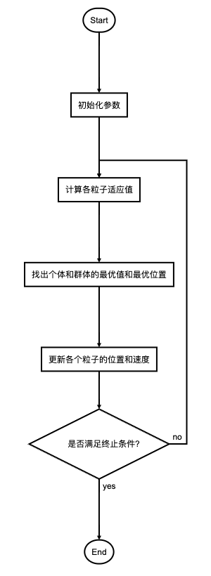

<style>
details {
    border: 1px solid #aaa;
    border-radius: 4px;
    padding: .5em .5em 0;
}
summary {
    font-weight: bold;
    margin: -.5em -.5em 0;
    padding: .5em;
}
details[open] {
    padding: .5em;
}
details[open] summary {
    border-bottom: 1px solid #aaa;
    margin-bottom: .5em;
}
img {
    pointer-events: none;
}
</style>

<details><summary>目录</summary><p>

- [粒子群算法原理](#粒子群算法原理)
    - [算法简介](#算法简介)
    - [核心概念](#核心概念)
    - [算法过程](#算法过程)
        - [核心公式](#核心公式)
        - [算法解释](#算法解释)
- [Python 实现](#python-实现)
- [求解无约束优化问题](#求解无约束优化问题)
- [求解约束优化问题](#求解约束优化问题)
- [求解旅行商问题](#求解旅行商问题)
- [参考](#参考)
</p></details><p></p>

# 粒子群算法原理

## 算法简介

粒子群算法(Particle Swarm Optimization，PSO)是模拟群体智能所建立起来的一种优化算法，
主要用于解决最优化问题（optimization problems）。1995 年由 Eberhart 和 Kennedy 提出，
是基于对鸟群觅食行为的研究和模拟而来的。

假设一群鸟在觅食，在觅食范围内，只在一个地方有食物，所有鸟儿都看不到食物（即不知道食物的具体位置。
当然不知道了，知道了就不用觅食了），但是能闻到食物的味道（即能知道食物距离自己是远是近。
鸟的嗅觉是很灵敏的）。假设鸟与鸟之间能共享信息（即互相知道每个鸟离食物多远。这个是人工假定，
实际上鸟们肯定不会也不愿意），那么最好的策略就是结合 <span style='border-bottom:1.5px dashed red;'>自己离食物最近的位置</span> 和 <span style='border-bottom:1.5px dashed red;'>鸟群中其他鸟距离食物最近的位置</span> 这两个因素综合考虑找到最好的搜索位置。

粒子群算法与遗传算法等进化算法有很多相似之处。也需要初始化种群，计算适应度值，通过进化进行迭代等。
但是与遗传算法不同，它没有交叉，变异等进化操作。

与遗传算法比较，粒子群算法的优势在于很容易编码，需要调整的参数也很少。

## 核心概念

粒子群算法有几个核心概念：

* **粒子(particle)**：一只鸟。类似于遗传算法中的个体。
* **种群(population)**：一群鸟。类似于遗传算法中的种群。
* **位置(position)**：一个粒子（鸟）当前所在的位置。
* **经验(best)**：一个粒子（鸟）自身曾经离食物最近的位置。
* **速度(velocity)**：一个粒子（鸟）飞行的速度。
* **适应度(fitness)**：一个粒子（鸟）距离食物的远近。与遗传算法中的适应度类似。

## 算法过程



### 核心公式

**加速度更新公式：**

`$$v[i] = w * v[i] + c1 * rand() *(pbest[i] - present[i]) + c2 * rand() * (gbest - present[i])$$`

**位置更新公式：**

`$$present[i] = present[i] + v[i]$$`

其中：

* `$v[i]$` 代表第 `$i$` 个粒子的速度
* `$w$` 代表惯性权值
* `$c1$` 和 `$c2$` 表示学习参数
* `rand()` 表示在 `0-1` 之间的随机数
* `$pbest[i]$` 代表第 `$i$` 个粒子搜索到的最优值
* `gbest` 代表整个集群搜索到的最优值
* `$present[i]$` 代表第 `$i$` 个粒子的当前位置

### 算法解释

1. 粒子数
    - 粒子数的选取一般在 20 个到 40 个之间，但是需要具体问题具体对待，如果对于复杂问题，
      则需要设置更多的粒子，粒子数量越多，其搜索范围就越大。
2. 惯性因子 `$w$`
    - 用来控制继承多少粒子当前的速度的，越大则对于当前速度的继承程度越小，
      越小则对于当前速度的继承程度越大。有些同学可能会产生疑问，是不是说反了。
      其实不是，从公式中可以明确看出，其值越大，则速度的改变幅度就越大，则对于粒子的当前速度继承越小；
      反之，速度的改变幅度越小，则对于粒子当前速度继承越大。
        - 因此如果的值越大，则解的搜索范围越大，可以提高算法的全局搜索能力，但也损失了局部搜索能力，
          有可能错失最优解；反之如果的值越小，则解的搜索范围也就越小，算法的全局搜索能力也就越小，
          容易陷入局部最优。
        - 如果是变量，则其值应该随着迭代次数的增加而减小（类似于梯度下降当中的学习率）。
        - 如果为定值，则建议在 0.6 到 0.75 之间进行选取。
3. 加速常数 `$c_{2}, c_{2}$`
    - 通过公式一可以看出，加速常数控制着飞翔速度的计算是更加看重 **自身经验** 还是 **群体经验**。
      加速常数 `$c1$` 可以看做是用来调整自身经验在计算粒子飞翔速度上的权重。
      同理 `$c2$` 是用来控制群体经验在计算粒子飞翔速度过程中的权重的。
    - 如果 `$c1$` 为 0，则自身经验对于速度的计算不起作用，如果 `$c2$` 为 0，
      则群体经验对于粒子飞翔速度的计算不起作用。
    - `$c1, c2$` 的取值在学术界分歧很大，主要有如下几种情况：

| 学者 | 参数取值 |
|-----|---------|
| Clerc | `$c1=c2=2.05$` |
| Carlisle | `$c1=2.8, c2=1.3$` |
| Trelea | `$w=0.6, c1=c2=1.7$` |
| Eberhart | `$w=0.729, c1=c2=1.494$` |

# Python 实现

```python
# -*- coding: utf-8 -*-
"""
f(x1,x2) = x1**2 + x2**2, x1,x2 belongs to [-10,10],求Min f
"""

import matplotlib.pyplot as plt
import numpy as np
 
 
class PSO:
    
    def __init__(self, population_size, max_steps):
        self.w = 0.6  # 惯性权重
        self.c1 = self.c2 = 2
        self.population_size = population_size  # 粒子群数量
        self.dim = 2  # 搜索空间的维度
        self.max_steps = max_steps  # 迭代次数
        self.x_bound = [-10, 10]  # 解空间范围
        self.x = np.random.uniform(self.x_bound[0], self.x_bound[1],
                                   (self.population_size, self.dim))  # 初始化粒子群位置
        self.v = np.random.rand(self.population_size, self.dim)  # 初始化粒子群速度
        fitness = self.calculate_fitness(self.x)
        self.p = self.x  # 个体的最佳位置
        self.pg = self.x[np.argmin(fitness)]  # 全局最佳位置
        self.individual_best_fitness = fitness  # 个体的最优适应度
        self.global_best_fitness = np.max(fitness)  # 全局最佳适应度
 
    def calculate_fitness(self, x):
        return np.sum(np.square(x), axis=1)
 
    def evolve(self):
        fig = plt.figure()
        for step in range(self.max_steps):
            r1 = np.random.rand(self.population_size, self.dim)
            r2 = np.random.rand(self.population_size, self.dim)
            # 更新速度和权重
            self.v = self.w*self.v+self.c1*r1*(self.p-self.x)+self.c2*r2*(self.pg-self.x)
            self.x = self.v + self.x
            plt.clf()
            plt.scatter(self.x[:, 0], self.x[:, 1], s=30, color='k')
            plt.xlim(self.x_bound[0], self.x_bound[1])
            plt.ylim(self.x_bound[0], self.x_bound[1])
            plt.pause(0.01)
            # plt.ion()
            # plt.show()
           
            fitness = self.calculate_fitness(self.x)
            # 需要更新的个体
            update_id = np.greater(self.individual_best_fitness, fitness)
            self.p[update_id] = self.x[update_id]
            self.individual_best_fitness[update_id] = fitness[update_id]
            # 新一代出现了更小的fitness，所以更新全局最优fitness和位置
            if np.min(fitness) < self.global_best_fitness:
                self.pg = self.x[np.argmin(fitness)]
                self.global_best_fitness = np.min(fitness)
            print('best fitness: %.5f, mean fitness: %.5f' % (self.global_best_fitness, np.mean(fitness)))

pso = PSO(10, 100)
pso.evolve()
```

# 求解无约束优化问题

用粒子群算法求解 Rastrigin 函数的极小值，Rastrigin 是一个典型的非线性多峰函数，
在搜索区域内存在许多极大值和极小值，导致寻找全局最小值比较困难，常用来测试寻优算法的性能。

Rastrigin 函数的表达式如下：

`$$Z = 2a + x^{2} - a cos 2 \pi x + y^{2} - a cos 2 \pi y$$`

这是一个典型非凸优化问题，通过 Python 绘制函数图形如下：

```python
import numpy as np
import matplotlib.pyplot as plt
from matplotlib import cm
from mpl_toolkits.mplot3d import Axes3D

# 生成 X 和 Y 的数据
X = np.arange(-5, 5, 0.1)
Y = np.arange(-5, 5, 0.1)
X, Y = np.meshgrid(X, Y)

```

# 求解约束优化问题

# 求解旅行商问题


# 参考

* [粒子群算法PSO](https://imonce.github.io/2019/11/06/%E5%90%AF%E5%8F%91%E5%BC%8F%E7%AE%97%E6%B3%95%E5%AD%A6%E4%B9%A0%EF%BC%88%E4%B8%80%EF%BC%89%EF%BC%9A%E7%B2%92%E5%AD%90%E7%BE%A4%E7%AE%97%E6%B3%95/)
