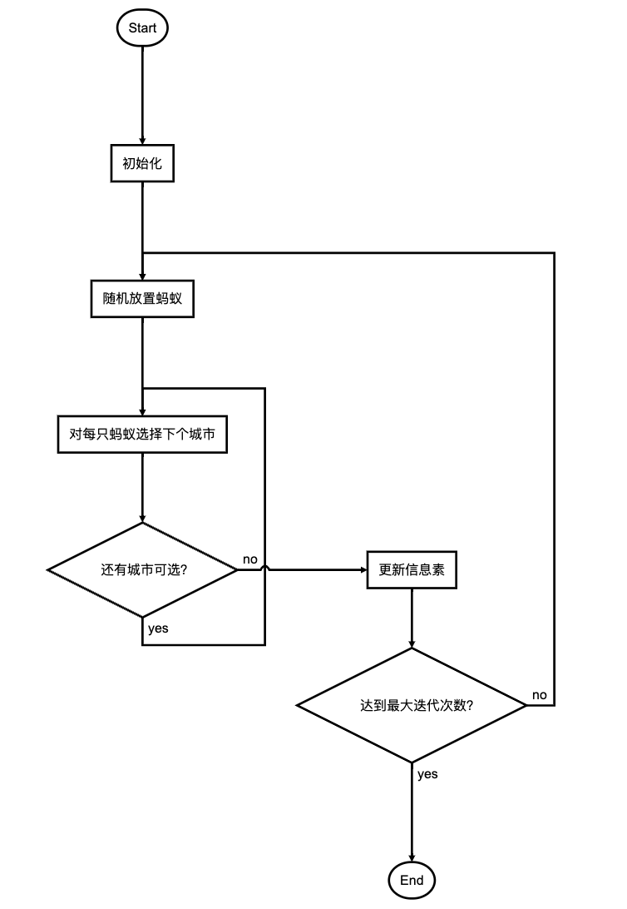

<style>
details {
    border: 1px solid #aaa;
    border-radius: 4px;
    padding: .5em .5em 0;
}
summary {
    font-weight: bold;
    margin: -.5em -.5em 0;
    padding: .5em;
}
details[open] {
    padding: .5em;
}
details[open] summary {
    border-bottom: 1px solid #aaa;
    margin-bottom: .5em;
}
img {
    pointer-events: none;
}
</style>

<details><summary>目录</summary><p>

- [算法简介](#算法简介)
- [基本原理](#基本原理)
- [算法流程](#算法流程)
- [数学模型](#数学模型)
- [Python 实现](#python-实现)
- [参考](#参考)
</p></details><p></p>

# 算法简介

蚁群算法（Ant Colony Algorithm, AG, or Ant Colony Optimization, ACO），又称蚂蚁算法，
是一种用来**在图中寻找优化路径的机率型算法**。它由 Marco Dorigo 于 1992 年在他的[博士论文]()中提出，
其灵感来源于蚂蚁在寻找食物过程中发现路径的行为。

蚁群算法是一种模拟进化算法，初步的研究表明该算法具有许多优良的性质。针对 PID 控制器参数优化设计问题，
将蚁群算法设计的结果与遗传算法设计的结果进行了比较，数值仿真结果表明，
蚁群算法具有一种新的模拟进化优化方法的有效性和应用价值。

# 基本原理

蚂蚁会在其经过的路径上释放一种可以称之为“信息素”的物质，蚁群内的蚂蚁对“信息素”具有感知能力，
它们会沿着“信息素”浓度较高路径行走，而每只路过的蚂蚁都会在路上留下“信息素”，这就形成一种类似正反馈的机制，
这样经过一段时间后，整个蚁群就会沿着最短路径到达食物源了。可以分解为以下几步：

1. 蚂蚁在路径上释放信息素。
2. 碰到还没走过的路口，就随机挑选一条路走。同时，释放与路径长度有关的信息素。
3. 信息素浓度与路径长度成反比。后来的蚂蚁再次碰到该路口时，就选择信息素浓度较高路径。
4. 最优路径上的信息素浓度越来越大。
5. 最终蚁群找到最优寻食路径。

# 算法流程

蚁群算法解决旅行商问题的流程：



# 数学模型

利用 TSP(旅行商问题) 问题来说明这个数学模型，对于 TSP 问题，设蚂蚁群体中蚂蚁的数量为 `$m$`，
城市的数量为 `$n$`，城市 `$i$` 与城市 `$j$` 之间的距离为 `$d_{ij}$`，
`$t$` 时刻城市 `$i$` 与城市 `$j$` 连接路径上的信息素浓度为 `$c_{ij}(t)$`。
初始时刻，蚂蚁被放置在不同的城市里，且各城市间连接路径上的信息素浓度相同。
然后蚂蚁将按一定概率选择线路，
不妨设 `$p_{ij}^{k}(t)$` 为 `$t$` 时刻蚂蚁 `$k$` 从城市 `$i$` 转移到城市 `$j$` 的概率。
“蚂蚁 TSP” 策略受到两方面的影响，首先是访问某城市的期望，另外便是其他蚂蚁释放的信息素浓度。所以定义：

`$$p_{ij}^{k}(t)=\left\lbrace\begin{array}{cll}
\frac{[c_{ij}(t)]^{a} * [n_{ij}(t)]^{b}}{\sum [c_{ij}(t)]^{a} * [n_{ij}(t)]^{b}} & , & j \in allowk \\
0 & , & j \notin allowk
\end{array}\right.$$`

其中：

* `$n_{ij}(t)$` 为启发函数，表示蚂蚁从城市 `$i$` 转移到城市 `$j$` 的期望
* `$\text{allowk}$` 为蚂蚁待访问城市集合，开始时，`$\text{allowk}$` 中有 `$n-1$` 个元素，
  即包括除了蚂蚁 `$k$` 出发城市的其他多个城市，随着时间的推移，`$\text{allowk}$` 中的元素越来越少，
  直至为空
* `$a$` 为信息素重要程度因子
* `$b$` 为启发函数因子

在蚂蚁遍历各城市的过程中，与实际情况相似的是，在蚂蚁释放信息素的同时，
各个城市之间连接路径上的信息素的强度也在通过挥发等方式逐渐消失。
为了描述这个特征，设 `$\rho$` 表示信息素挥发程度。
这样所有蚂蚁完成走完一遍所有城市之后，各个城市键连接路径上的信息素浓度为：

`$$c_{ij}(t+1) = (1-\rho)*c_{ij}(t) + \Delta c_{ij}$$`

`$$\Delta c_{ij} = \sum \Delta c^k_{ij}$$`

其中：

* `$\Delta c^k_{ij}$` 为第 `$k$` 只蚂蚁在城市 `$i$` 与城市 `$j$` 连接路径上释放信息素而增加的信息素浓度；
  一般情况下 `$\Delta c^k_{ij}=\frac{Q}{L_k}$`，若蚂蚁 `$k$` 从城市 `$i$` 访问了城市 `$j$`，
  其中 `$Q$` 为信息素常数，`$L_{k}$` 为第 `$k$` 只蚂蚁经过路径总长度；
* `$\Delta c_{ij}$` 为所有蚂蚁在城市 `$i$` 与城市 `$j$` 连接路径上释放信息素而增加的信息素浓度。

# Python 实现

```python
# -*- coding: utf-8 -*-
import random
import copy
import time
import sys
import math
import tkinter #//GUI模块
import threading
from functools import reduce
 
 
# 参数
'''
ALPHA:信息启发因子，值越大，则蚂蚁选择之前走过的路径可能性就越大
      ，值越小，则蚁群搜索范围就会减少，容易陷入局部最优
BETA:Beta值越大，蚁群越就容易选择局部较短路径，这时算法收敛速度会
     加快，但是随机性不高，容易得到局部的相对最优
'''
(ALPHA, BETA, RHO, Q) = (1.0,2.0,0.5,100.0)
# 城市数，蚁群
(city_num, ant_num) = (50,50)
distance_x = [
    178,272,176,171,650,499,267,703,408,437,491,74,532,
    416,626,42,271,359,163,508,229,576,147,560,35,714,
    757,517,64,314,675,690,391,628,87,240,705,699,258,
    428,614,36,360,482,666,597,209,201,492,294]
distance_y = [
    170,395,198,151,242,556,57,401,305,421,267,105,525,
    381,244,330,395,169,141,380,153,442,528,329,232,48,
    498,265,343,120,165,50,433,63,491,275,348,222,288,
    490,213,524,244,114,104,552,70,425,227,331]
#城市距离和信息素
distance_graph = [ [0.0 for col in range(city_num)] for raw in range(city_num)]
pheromone_graph = [ [1.0 for col in range(city_num)] for raw in range(city_num)]


#----------- 蚂蚁 -----------
class Ant(object):
 
    # 初始化
    def __init__(self,ID):
        
        self.ID = ID                 # ID
        self.__clean_data()          # 随机初始化出生点
 
    # 初始数据
    def __clean_data(self):
    
        self.path = []               # 当前蚂蚁的路径           
        self.total_distance = 0.0    # 当前路径的总距离
        self.move_count = 0          # 移动次数
        self.current_city = -1       # 当前停留的城市
        self.open_table_city = [True for i in range(city_num)] # 探索城市的状态
        
        city_index = random.randint(0,city_num-1) # 随机初始出生点
        self.current_city = city_index
        self.path.append(city_index)
        self.open_table_city[city_index] = False
        self.move_count = 1
    
    # 选择下一个城市
    def __choice_next_city(self):
        
        next_city = -1
        select_citys_prob = [0.0 for i in range(city_num)]  #存储去下个城市的概率
        total_prob = 0.0
 
        # 获取去下一个城市的概率
        for i in range(city_num):
            if self.open_table_city[i]:
                try :
                    # 计算概率：与信息素浓度成正比，与距离成反比
                    select_citys_prob[i] = pow(pheromone_graph[self.current_city][i], ALPHA) * pow((1.0/distance_graph[self.current_city][i]), BETA)
                    total_prob += select_citys_prob[i]
                except ZeroDivisionError as e:
                    print ('Ant ID: {ID}, current city: {current}, target city: {target}'.format(ID = self.ID, current = self.current_city, target = i))
                    sys.exit(1)
        
        # 轮盘选择城市
        if total_prob > 0.0:
            # 产生一个随机概率,0.0-total_prob
            temp_prob = random.uniform(0.0, total_prob)
            for i in range(city_num):
                if self.open_table_city[i]:
                    # 轮次相减
                    temp_prob -= select_citys_prob[i]
                    if temp_prob < 0.0:
                        next_city = i
                        break
 
        # 未从概率产生，顺序选择一个未访问城市
        # if next_city == -1:
        #     for i in range(city_num):
        #         if self.open_table_city[i]:
        #             next_city = i
        #             break
 
        if (next_city == -1):
            next_city = random.randint(0, city_num - 1)
            while ((self.open_table_city[next_city]) == False):  # if==False,说明已经遍历过了
                next_city = random.randint(0, city_num - 1)
 
        # 返回下一个城市序号
        return next_city
    
    # 计算路径总距离
    def __cal_total_distance(self):
        
        temp_distance = 0.0
 
        for i in range(1, city_num):
            start, end = self.path[i], self.path[i-1]
            temp_distance += distance_graph[start][end]
 
        # 回路
        end = self.path[0]
        temp_distance += distance_graph[start][end]
        self.total_distance = temp_distance
        
    
    # 移动操作
    def __move(self, next_city):
        
        self.path.append(next_city)
        self.open_table_city[next_city] = False
        self.total_distance += distance_graph[self.current_city][next_city]
        self.current_city = next_city
        self.move_count += 1
        
    # 搜索路径
    def search_path(self):
 
        # 初始化数据
        self.__clean_data()
 
        # 搜素路径，遍历完所有城市为止
        while self.move_count < city_num:
            # 移动到下一个城市
            next_city =  self.__choice_next_city()
            self.__move(next_city)
 
        # 计算路径总长度
        self.__cal_total_distance()
 

#----------- TSP问题 -----------
class TSP(object):
 
    def __init__(self, root, width = 800, height = 600, n = city_num):
 
        # 创建画布
        self.root = root                               
        self.width = width      
        self.height = height
        # 城市数目初始化为city_num
        self.n = n
        # tkinter.Canvas
        self.canvas = tkinter.Canvas(
                root,
                width = self.width,
                height = self.height,
                bg = "#EBEBEB",             # 背景白色 
                xscrollincrement = 1,
                yscrollincrement = 1
            )
        self.canvas.pack(expand = tkinter.YES, fill = tkinter.BOTH)
        self.title("TSP蚁群算法(n:初始化 e:开始搜索 s:停止搜索 q:退出程序)")
        self.__r = 5
        self.__lock = threading.RLock()     # 线程锁
 
        self.__bindEvents()
        self.new()
 
        # 计算城市之间的距离
        for i in range(city_num):
            for j in range(city_num):
                temp_distance = pow((distance_x[i] - distance_x[j]), 2) + pow((distance_y[i] - distance_y[j]), 2)
                temp_distance = pow(temp_distance, 0.5)
                distance_graph[i][j] =float(int(temp_distance + 0.5))
 
    # 按键响应程序
    def __bindEvents(self):
 
        self.root.bind("q", self.quite)        # 退出程序
        self.root.bind("n", self.new)          # 初始化
        self.root.bind("e", self.search_path)  # 开始搜索
        self.root.bind("s", self.stop)         # 停止搜索
 
    # 更改标题
    def title(self, s):
 
        self.root.title(s)
 
    # 初始化
    def new(self, evt = None):
 
        # 停止线程
        self.__lock.acquire()
        self.__running = False
        self.__lock.release()
 
        self.clear()     # 清除信息 
        self.nodes = []  # 节点坐标
        self.nodes2 = [] # 节点对象
 
        # 初始化城市节点
        for i in range(len(distance_x)):
            # 在画布上随机初始坐标
            x = distance_x[i]
            y = distance_y[i]
            self.nodes.append((x, y))
            # 生成节点椭圆，半径为self.__r
            node = self.canvas.create_oval(x - self.__r,
                    y - self.__r, x + self.__r, y + self.__r,
                    fill = "#ff0000",      # 填充红色
                    outline = "#000000",   # 轮廓白色
                    tags = "node",
                )
            self.nodes2.append(node)
            # 显示坐标
            self.canvas.create_text(x,y-10,              # 使用create_text方法在坐标（302，77）处绘制文字
                    text = '('+str(x)+','+str(y)+')',    # 所绘制文字的内容
                    fill = 'black'                       # 所绘制文字的颜色为灰色
                )
            
        # 顺序连接城市
        #self.line(range(city_num))
        
        # 初始城市之间的距离和信息素
        for i in range(city_num):
            for j in range(city_num):
                pheromone_graph[i][j] = 1.0
                
        self.ants = [Ant(ID) for ID in range(ant_num)]  # 初始蚁群
        self.best_ant = Ant(-1)                          # 初始最优解
        self.best_ant.total_distance = 1 << 31           # 初始最大距离
        self.iter = 1                                    # 初始化迭代次数 
            
    # 将节点按order顺序连线
    def line(self, order):
        # 删除原线
        self.canvas.delete("line")
        def line2(i1, i2):
            p1, p2 = self.nodes[i1], self.nodes[i2]
            self.canvas.create_line(p1, p2, fill = "#000000", tags = "line")
            return i2
        
        # order[-1]为初始值
        reduce(line2, order, order[-1])
 
    # 清除画布
    def clear(self):
        for item in self.canvas.find_all():
            self.canvas.delete(item)
 
    # 退出程序
    def quite(self, evt):
        self.__lock.acquire()
        self.__running = False
        self.__lock.release()
        self.root.destroy()
        print (u"\n程序已退出...")
        sys.exit()
 
    # 停止搜索
    def stop(self, evt):
        self.__lock.acquire()
        self.__running = False
        self.__lock.release()
        
    # 开始搜索
    def search_path(self, evt = None):
 
        # 开启线程
        self.__lock.acquire()
        self.__running = True
        self.__lock.release()
        
        while self.__running:
            # 遍历每一只蚂蚁
            for ant in self.ants:
                # 搜索一条路径
                ant.search_path()
                # 与当前最优蚂蚁比较
                if ant.total_distance < self.best_ant.total_distance:
                    # 更新最优解
                    self.best_ant = copy.deepcopy(ant)
            # 更新信息素
            self.__update_pheromone_gragh()
            print (u"迭代次数：",self.iter,u"最佳路径总距离：",int(self.best_ant.total_distance))
            # 连线
            self.line(self.best_ant.path)
            # 设置标题
            self.title("TSP蚁群算法(n:随机初始 e:开始搜索 s:停止搜索 q:退出程序) 迭代次数: %d" % self.iter)
            # 更新画布
            self.canvas.update()
            self.iter += 1
 
    # 更新信息素
    def __update_pheromone_gragh(self):
 
        # 获取每只蚂蚁在其路径上留下的信息素
        temp_pheromone = [[0.0 for col in range(city_num)] for raw in range(city_num)]
        for ant in self.ants:
            for i in range(1,city_num):
                start, end = ant.path[i-1], ant.path[i]
                # 在路径上的每两个相邻城市间留下信息素，与路径总距离反比
                temp_pheromone[start][end] += Q / ant.total_distance
                temp_pheromone[end][start] = temp_pheromone[start][end]
 
        # 更新所有城市之间的信息素，旧信息素衰减加上新迭代信息素
        for i in range(city_num):
            for j in range(city_num):
                pheromone_graph[i][j] = pheromone_graph[i][j] * RHO + temp_pheromone[i][j]
 
    # 主循环
    def mainloop(self):
        self.root.mainloop()


#----------- 程序的入口处 -----------
if __name__ == '__main__':
    TSP(tkinter.Tk()).mainloop()
```

# 参考

* [蚁群算法ACO](https://imonce.github.io/2019/11/08/%E5%90%AF%E5%8F%91%E5%BC%8F%E7%AE%97%E6%B3%95%E5%AD%A6%E4%B9%A0%EF%BC%88%E5%9B%9B%EF%BC%89%EF%BC%9A%E8%9A%81%E7%BE%A4%E7%AE%97%E6%B3%95/)
* [Ant system: optimization by a colony of cooperating agents]()
