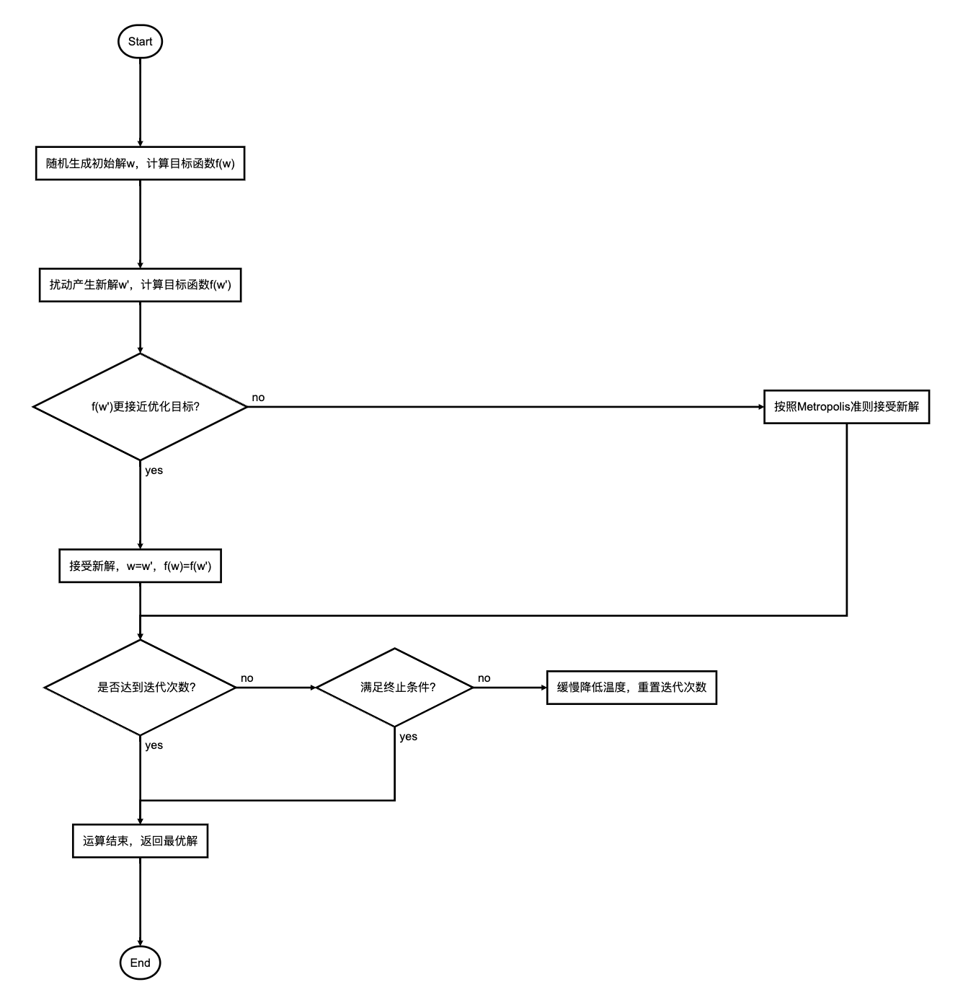

<style>
details {
    border: 1px solid #aaa;
    border-radius: 4px;
    padding: .5em .5em 0;
}
summary {
    font-weight: bold;
    margin: -.5em -.5em 0;
    padding: .5em;
}
details[open] {
    padding: .5em;
}
details[open] summary {
    border-bottom: 1px solid #aaa;
    margin-bottom: .5em;
}
img {
    pointer-events: none;
}
</style>

<details><summary>目录</summary><p>

- [算法简介](#算法简介)
- [算法过程](#算法过程)
    - [状态空间与邻域函数](#状态空间与邻域函数)
    - [状态概率分布](#状态概率分布)
    - [冷却进度表](#冷却进度表)
    - [初始温度](#初始温度)
    - [循环终止准则](#循环终止准则)
- [Python 实现](#python-实现)
- [参考](#参考)
</p></details><p></p>


# 算法简介

模拟退火算法（Simulated Annealing Algorithm，SAA）的思想借鉴于固体的退火原理，当固体的温度很高的时候，
内能比较大，固体的内部粒子处于快速无序运动，当温度慢慢降低的过程中，固体的内能减小，粒子的慢慢趋于有序，
最终，当固体处于常温时，内能达到最小，此时，粒子最为稳定。模拟退火算法便是基于这样的原理设计而成。

模拟退火算法从某一高温出发，在高温状态下计算初始解，然后以预设的邻域函数产生一个扰动量，从而得到新的状态，
即模拟粒子的无序运动，比较新旧状态下的能量，即目标函数的解。如果新状态的能量小于旧状态，则状态发生转化；
如果新状态的能量大于旧状态，则以一定的概率准则发生转化。当状态稳定后，便可以看作达到了当前状态的最优解，
便可以开始降温，在下一个温度继续迭代，最终达到低温的稳定状态，便得到了模拟退火算法产生的结果。

# 算法过程



## 状态空间与邻域函数

**状态空间**也称为搜索空间，它由经过编码的 <span style='border-bottom:1.5px dashed red;'>可行解</span> 的集合所组成。

**邻域函数**应尽可能满足产生的 <span style='border-bottom:1.5px dashed red;'>候选解</span> 遍布全部状态空间。
其通常由产生候选解的方式和候选解产生的概率分布组成。候选解一般按照某一概率密度函数对解空间进行随机采样获得，
而概率分布可以为均匀分布、正态分布、指数分布等。

## 状态概率分布

> Metropolis 准则

状态转移概率是指从一个状态转换成另一个状态的概率，模拟退火算法中一般采用Metropolis准则，具体如下：

`$$f(x)=\left\lbrace\begin{array}{cll}
1 & , & E(x_{new}) < E(x_{old}) \\
exp\Big(-\frac{E(x_{new})-E(x_{old})}{T}\Big) & , & E(x_{new}) \ge E(x_{old})
\end{array}\right.$$`

其与当前温度参数 `$T$` 有关，随温度的下降而减小。

## 冷却进度表

冷却进度表是指从某一高温状态 `$T$` 向低温状态冷却时的降温函数，设 `$t$` 时刻的温度为 `$T(t)$`，
则经典模拟退火算法的降温方式为：

`$$T(t)=\frac{T_{0}}{lg(1+t)}$$`

而快速模拟退火算法的降温方式为：

`$$T(t)=\frac{T_{0}}{1+t}$$`

其他方法不再赘述。

## 初始温度

一般来说，初始温度越大，获得高质量解的几率越大，但是花费的时间也会随之增加，
因此，初温的确定应该同时考虑计算效率与优化质量，常用的方法包括：

1. 均匀抽样一组状态，以各状态目标值的方差为初温。
2. 随机产生一组状态，确定两两状态间的最大目标值差，然后根据差值，利用一定的函数确定初温，
   如： `$T_{0}=-\frac{\Delta_{max}}{Pr}$`，其中 `$Pr$` 为初始接受概率。
3. 根据经验公式给出。

## 循环终止准则

内循环（求解循环）终止准则：

1. 检验目标函数的均值是否稳定
2. 连续若干步的目标值变化较小
3. 按一定的步数进行抽样

外循环（降温循环）终止准则：

1. 设置终止温度
2. 设置外循环迭代次数
3. 算法搜索到的最优值连续若干步保持不变
4. 检验系统熵是否稳定

# Python 实现

问题：

`$$f(x) = (x^{2} - 5x)\text{sin}(x^{2})$$`

```python
import numpy as np
import matplotlib.pyplot as plt
import random

class SA(object):

    def __init__(self, interval, tab='min', T_max=10000, T_min=1, iterMax=1000, rate=0.95):
        self.interval = interval # 给定状态空间 - 即待求解空间
        self.T_max = T_max # 初始退火温度 - 温度上限
        self.T_min = T_min # 截止退火温度 - 温度下限
        self.iterMax = iterMax # 定温内部迭代次数
        self.rate = rate # 退火降温速度
        
        self.x_seed = random.uniform(interval[0], interval[1]) # 解空间内的种子
        self.tab = tab.strip() # 求解最大值还是最小值的标签: 'min' - 最小值；'max' - 最大值

        self.solve() # 完成主体的求解过程
        self.display() # 数据可视化展示
        
    def solve(self):
        temp = 'deal_' + self.tab # 采用反射方法提取对应的函数
        if hasattr(self, temp):
            deal = getattr(self, temp)
        else:
            exit('>>>tab标签传参有误："min"|"max"<<<')  
        x1 = self.x_seed
        T = self.T_max
        while T >= self.T_min:
            for i in range(self.iterMax):
                f1 = self.func(x1)
                delta_x = random.random() * 2 - 1 # [-1,1)之间的随机值
                if x1 + delta_x >= self.interval[0] and x1 + delta_x <= self.interval[1]:   # 将随机解束缚在给定状态空间内
                    x2 = x1 + delta_x
                else:
                    x2 = x1 - delta_x
                f2 = self.func(x2)
                delta_f = f2 - f1
                x1 = deal(x1, x2, delta_f, T)
            T *= self.rate
        self.x_solu = x1 # 提取最终退火解       
        
    def func(self, x): # 状态产生函数 - 即待求解函数
        value = np.sin(x**2) * (x**2 - 5*x)
        return value
        
    def p_min(self, delta, T): # 计算最小值时，容忍解的状态迁移概率
        probability = np.exp(-delta/T)
        return probability
        
    def p_max(self, delta, T):
        probability = np.exp(delta/T) # 计算最大值时，容忍解的状态迁移概率
        return probability
        
    def deal_min(self, x1, x2, delta, T):
        if delta < 0: # 更优解
            return x2
        else: # 容忍解
            P = self.p_min(delta, T)
            if P > random.random(): return x2
            else: return x1
            
    def deal_max(self, x1, x2, delta, T):
        if delta > 0: # 更优解
            return x2
        else: # 容忍解
            P = self.p_max(delta, T)
            if P > random.random(): return x2
            else: return x1
        
    def display(self):
        print('seed: {}\nsolution: {}'.format(self.x_seed, self.x_solu))
        plt.figure(figsize=(6, 4))
        x = np.linspace(self.interval[0], self.interval[1], 300)
        y = self.func(x)
        plt.plot(x, y, 'g-', label='function')
        plt.plot(self.x_seed, self.func(self.x_seed), 'bo', label='seed')
        plt.plot(self.x_solu, self.func(self.x_solu), 'r*', label='solution')
        plt.title('solution = {}'.format(self.x_solu))
        plt.xlabel('x')
        plt.ylabel('y')
        plt.legend()
        plt.savefig('SA.png', dpi=500)
        plt.show()
        plt.close()

        
if __name__ == '__main__':
    SA([-5, 5], 'max')
```

# 参考

* [模拟退火算法SAA](https://imonce.github.io/2019/11/06/%E5%90%AF%E5%8F%91%E5%BC%8F%E7%AE%97%E6%B3%95%E5%AD%A6%E4%B9%A0%EF%BC%88%E4%BA%8C%EF%BC%89%EF%BC%9A%E6%A8%A1%E6%8B%9F%E9%80%80%E7%81%AB%E7%AE%97%E6%B3%95/)
