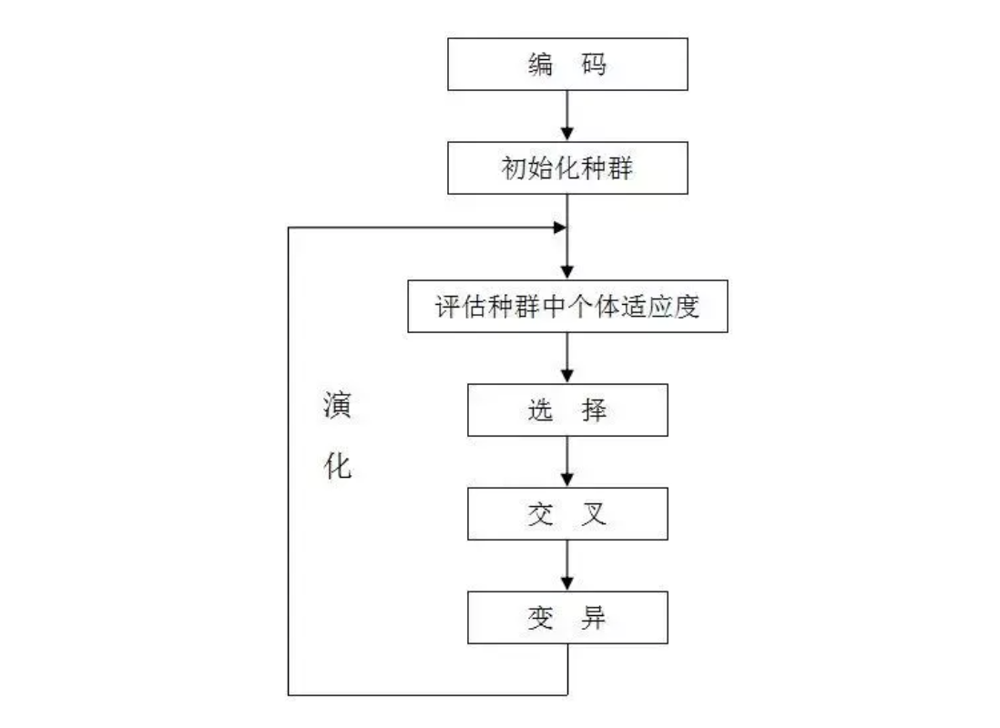
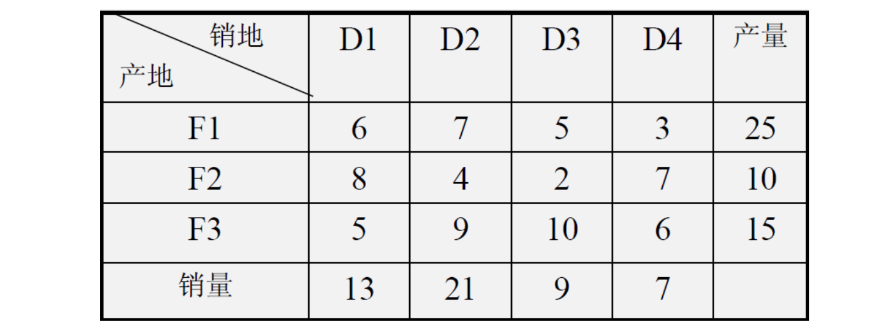

<style>
details {
    border: 1px solid #aaa;
    border-radius: 4px;
    padding: .5em .5em 0;
}
summary {
    font-weight: bold;
    margin: -.5em -.5em 0;
    padding: .5em;
}
details[open] {
    padding: .5em;
}
details[open] summary {
    border-bottom: 1px solid #aaa;
    margin-bottom: .5em;
}
</style>

<details><summary>目录</summary><p>

- [数学模型](#数学模型)
  - [优化及运筹学方法的步骤](#优化及运筹学方法的步骤)
    - [运筹学处理问题的一般步骤](#运筹学处理问题的一般步骤)
    - [决策、约束与目标](#决策约束与目标)
  - [系统边界、敏感性分析、易处理性及有效性](#系统边界敏感性分析易处理性及有效性)
  - [数值搜索、精确解与启发解](#数值搜索精确解与启发解)
  - [确定模型与随机模型](#确定模型与随机模型)
  - [确定性优化模型](#确定性优化模型)
  - [搜索算法](#搜索算法)
- [运筹优化](#运筹优化)
- [Python 库](#python-库)
  - [Python Scipy](#python-scipy)
  - [Python CPLEX](#python-cplex)
  - [Python Pyomo](#python-pyomo)
    - [安装 pyomo 和 GLPK](#安装-pyomo-和-glpk)
    - [参考](#参考)
  - [Python Gurobi](#python-gurobi)
  - [Python PuLP](#python-pulp)
  - [Python Geatpy](#python-geatpy)
    - [Population 类是一个表示种群的类](#population-类是一个表示种群的类)
    - [Algorithm 类是进化算法的核心类](#algorithm-类是进化算法的核心类)
- [算法](#算法)
  - [遗传算法](#遗传算法)
- [问题](#问题)
  - [运输问题](#运输问题)
    - [产销平滑的运输问题](#产销平滑的运输问题)
  - [啤酒混合策略](#啤酒混合策略)
  - [寒冷天气混合燃料策略](#寒冷天气混合燃料策略)
  - [饮食营养策略](#饮食营养策略)
- [参考](#参考-1)
</p></details><p></p>

# 数学模型

> 数学模型(mathematical model)是一个包含变量及问题相关特征之间关系的集合体

## 优化及运筹学方法的步骤

### 运筹学处理问题的一般步骤

一般步骤开始于建模，即我们首先要定义相关变量，以及量化用于描述问题相关行为的一些关系

之后是分析。我们需要应用数学方法与技术去找到模型建议的结论，注意这些结论源自于模型而非最初的实际问题。

最后我们需要做出推论，以表明这些源自于模型的结论对于解决实际问题的合理性。
当然，推论也可能证明这些源自于模型的结论对于解决问题不是充分的或者难以执行的，
这时我们需要修正模型并重新进行上述步骤

### 决策、约束与目标

通常在建模前，需要从三个维度：决策、约束与目标去关注问题

三个建模的基本关注点为：

1. 决策者需要做出决策(decision)
2. 限制决策选择的约束(constraint)
3. 人们偏好的决策所产生的目标(objective)


## 系统边界、敏感性分析、易处理性及有效性


## 数值搜索、精确解与启发解


## 确定模型与随机模型


## 确定性优化模型


## 搜索算法


# 运筹优化

运筹学(OR)和优化模型包括线性规划(LP)、混合整数线性规划(MILP)和二次规划(QP)：

* 线性规划(Linear Programming, LP)
* 混合整数线性规划(MILP)
* 二次规划(QP)

一般我们使用 LP/MILP 包来单独建模一个实际的优化问题，例如 

* GAMS
* AMPL
* OPL
* ...

优化求解器

* CPLEX
* Gurobi
* PuLP
* Mosek
* Xpress
* ...

# Python 库

## Python Scipy

```python
scipy.optimize.minimize(
    fun, 
    x0, 
    args = (), 
    method = 'SLSQP', 
    jac = None, 
    bounds = None, 
    constraints = (), 
    tol = None, 
    callback = None, 
    options = {
        'func': None, 
        'maxiter': 100, 
        'ftol': 1e-06, 
        'iprint': 1, 
        'disp': False, 
        'eps': 1.4901161193847656e-08
    }
)
```

## Python CPLEX 

> docplex，用于 Python 的 IBM Decision Optimization CPLEX 建模包

* [docplex Doc](http://ibmdecisionoptimization.github.io/docplex-doc/)
* [docplex Examples](https://github.com/IBMDecisionOptimization/docplex-examples)

## Python Pyomo

Pyomo 是一个基于 Python 的开源软件包，它支持多种优化功能，用于制定和分析优化模型。
Pyomo 可用于定义符号问题、创建具体的问题实例，并使用标准解决程序解决这些实例。Pyomo 支持多种问题类型，包括:

* 线性规划
* 二次规划
* 非线性规划
* 整数线性规划
* 混合整数二次规划
* 混合整数非线性规划
* 整数随机规划
* 广义分隔编程
* 微分代数方程
* 具有平衡约束的数学规划

Pyomo 支持全功能编程语言中的分析和脚本编制。此外，Pyomo 还证明了开发高级优化和分析工具的有效框架。
例如，PySP 包提供了随机规划的通用求解程序。PySP 利用了 Pyomo 的建模对象嵌入在功能全面的高级编程语言中的事实，
这种语言允许使用 Python 并行通信库透明地并行化子问题

### 安装 pyomo 和 GLPK

pyomo：

```bash
$ pip install -q pyomo
```

GLPK 是一个开源的 GNU 线性编程工具包，可在 GNU 通用公共许可证 3 下使用。GLPK 是一个单线程单形解算器，
通常适用于中小型线性整数规划问题。它是用 C 语言编写的，依赖性很小，因此在计算机和操作系统之间具有很高的可移植性。
对于许多示例来说，GLPK 通常“足够好”。对于较大的问题，用户应该考虑高性能的解决方案，如 COIN-OR CBC，它们可以利用多线程处理器

```bash
$ apt-get install -y -qq glpk-utils
```

### 参考

* [Pyomo Tutorial](https://www.osti.gov/servlets/purl/1376827)

## Python Gurobi

> gurobipy，Gurobi 的 Python API

## Python PuLP

> pulp，用 Python 编写的 LP/MILP 建模

## Python Geatpy

Geatpy2 整体上看由工具箱内核函数（内核层）和面向对象进化算法框架（框架层）两部分组成。
其中面向对象进化算法框架主要有四个大类：

* Problem 问题类
* Algorithm 算法模板类
* Population 种群类
* PsyPopulation 多染色体种群类


### Population 类是一个表示种群的类

一个种群包含很多个个体，而每个个体都有一条染色体(若要用多染色体，则使用多个种群、并把每个种群对应个体关联起来即可)。
除了染色体外，每个个体都有一个译码矩阵 Field(或俗称区域描述器)来标识染色体应该如何解码得到表现型，
同时也有其对应的目标函数值以及适应度。种群类就是一个把所有个体的这些数据统一存储起来的一个类。比如：

* Chrom 是一个存储种群所有个体染色体的矩阵，它的每一行对应一个个体的染色体
* ObjV 是一个目标函数值矩阵，每一行对应一个个体的所有目标函数值，每一列对应一个目标

PsyPopulation 类是继承了 Population 的支持多染色体混合编码的种群类。一个种群包含很多个个体，而每个个体都有多条染色体

* Chroms 列表存储所有的染色体矩阵(Chrom)
* Encodings 列表存储各染色体对应的编码方式(Encoding)
* Fields 列表存储各染色体对应的译码矩阵(Field)

### Algorithm 类是进化算法的核心类

Algorithm 类既存储着跟进化算法相关的一些参数，同时也在其继承类中实现具体的进化算法。
比如 Geatpy 中的 `moea_NSGA3_templet.py` 是实现了多目标优化 NSGA-III 算法的进化算法模板类，
它是继承了 Algorithm 类的具体算法的模板类

关于 Algorithm 类中各属性的含义可以查看 `Algorithm.py` 源码。这些算法模板通过调用 Geatpy 工具箱提供的进化算法库函数实现对种群的进化操作，
同时记录进化过程中的相关信息，其基本层次结构如下图：


# 算法

## 遗传算法

1. 编码
2. 计算适应度
3. 选择淘汰
4. 基因交叉
5. 基因突变
6. 不断进化

遗传算法是从代表问题可能潜在的解集的一个种群(population)开始的，
而一个种群则由经过基因(gene)编码(encoding)的一定数目的个体(individual)组成。
每个个体实际上是染色体(chromosome)带有特征的实体

染色体作为遗传物质的主要载体，即多个基因的集合，其内部表现(即基因型)是某种基因组合，它决定了个体的形状的外部表现，
如黑头发的特征是由染色体中控制这一特征的某种基因组合决定的。因此，在一开始需要实现从表现型到基因型的映射即编码工作。
由于仿照基因编码的工作很复杂，我们往往进行简化，如二进制编码

初代种群产生之后，按照适者生存和优胜劣汰的原理，逐代(generation)演化产生出越来越好的近似解，
在每一代，根据问题域中个体的适应度(fitness)大小选择(selection)个体，
并借助于自然遗传学的遗传算子(genetic operators)进行组合交叉(crossover，形象点就是种群个体之间进行交配)和变异(mutation，基因变异)，
产生出代表新的解集的种群

这个过程将导致种群像自然进化一样的后生代种群比前代更加适应于环境，
末代种群中的最优个体经过解码(decoding)，可以作为问题近似最优解




# 问题

## 运输问题

运输问题是一类特殊的线性规划问题，一般的运输问题就是要解决：把某种产品从若干个产地调运到若干个销地，
在已知每个产地的供应量、每个销地的需求量、各地之间的运输单价的前提下，如何确定一个使得总的运输费用最小的方案

### 产销平滑的运输问题

有三个工厂 F1、F2、F3 生产同种产品，它们的产量分别为 25、15、10 单位。
该公司把这些产品分别运往四个销售点 D1、D2、D3、D4，各销售点销量分别为 13、21、9 和 7。
从各工厂到各销售点的单位产品的运价为下表所示。问该公司应如何调运产品，在满足各销售点需求量的前提下，使总运费为最少



假设 `$i$` 产地(`$i \in F_{1}, F_{2}, F_{3}$`)运输到 `$j$` 销售地的数量为 `$x_{ij}$`，则数学模型如下

目标函数：

`$$\begin{align}
min z &= 6x_{11} + 7x_{12} + 5x_{13} \\ 
&+ 8x_{21} + 4x_{22} + 2x_{23} + 7x_{24} \\
&+ 5x_{31} + 9x_{32} + 10x_{33} + 6x_{34} 
\end{align}$$`

约束条件：

`$$s.t.\begin{cases}
x_{11} + x_{12} + x_{13} + x_{14} = 25 \\
x_{21} + x_{22} + x_{23} + x_{24} = 10 \\
x_{31} + x_{32} + x_{33} + x_{34} = 15 \\
x_{11} + x_{21} + x_{31} = 13 \\
x_{12} + x_{22} + x_{33} = 21 \\
x_{13} + x_{23} + x_{33} = 9 \\
x_{14} + x_{24} + x_{34} = 7 \\
x_{ij} \geq 0, i=1,2,3; j=1,2,3,4
\end{cases}$$`

一般的数学模型如下，假设从 `$A_{i}$` 产地到 `$B_{j}$` 销售点的物资运量为 `$x_{ij}$`

目标函数：

`$$min z = \sum_{i=1}^{m}\sum_{j=1}^{n}c_{ij}x_{ij}$$`

约束条件：`$A_{i}$` 产地的产品全部供应出去，`$B_{j}$` 销售点的需求全部得到满足，且产量等于销量

`$$\begin{cases}
\sum_{i=1}^{m} x_{ij}= a_{i}, i = 1, 2, \ldots, m \\
\sum_{j=1}^{n} x_{ij}= b_{j}, j = 1, 2, \ldots, n \\
\sum_{i=1}^{m} a_{i} = \sum_{j=1}^{n} b_{j} \\
x_{ij} \geq 0, i=1,2,\ldots,m; j=1,2,\ldots,n
\end{cases}$$`


## 啤酒混合策略


## 寒冷天气混合燃料策略


## 饮食营养策略


# 参考

* [中国大学 MOOC-运筹学](https://www.icourse163.org/learn/JXUFE-1002345001?tid=1450298456#/learn/content)
* [python运筹优化实践](https://www.zhihu.com/column/c_1060904037507006464)
