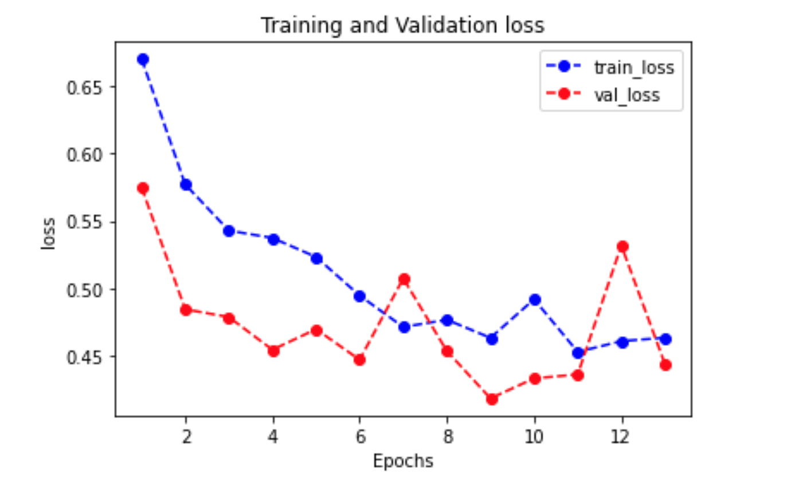

<style>
details {
    border: 1px solid #aaa;
    border-radius: 4px;
    padding: .5em .5em 0;
}
summary {
    font-weight: bold;
    margin: -.5em -.5em 0;
    padding: .5em;
}
details[open] {
    padding: .5em;
}
details[open] summary {
    border-bottom: 1px solid #aaa;
    margin-bottom: .5em;
}
</style>

<details><summary>目录</summary><p>

- [导入 Python 依赖](#导入-python-依赖)
- [数据读取和查看](#数据读取和查看)
- [数据预处理](#数据预处理)
- [封装成可以迭代的数据管道](#封装成可以迭代的数据管道)
- [定义模型](#定义模型)
- [训练模型](#训练模型)
- [评估模型](#评估模型)
- [使用模型](#使用模型)
- [保存模型](#保存模型)
  - [保存模型参数](#保存模型参数)
  - [保存完整模型](#保存完整模型)
</p></details><p></p>

# 导入 Python 依赖

```python
import os
# mac 系统上 PyTorch 和 Matplotlib 在 Jupyter 中同时跑需要更改环境变量
os.environ["KMP_DUPLICATE_LIB_OK"] = "TRUE"

import numpy as np
import pandas as pd
import matplotlib.pyplot as plt
%matplotlib inline
%config InlineBackend.figure_format = "png"

import torch
from torch import nn
from torch.utils.data import Dataset, DataLoader, TensorDataset
print(f"torch.__version__={torch.__version__}")

from torchkeras.utils_log import printbar
from torchkeras.metrics import Accuracy
```

```
torch.__version__=1.10.0
```

# 数据读取和查看

```python
df_train_raw = pd.read_csv("./data/titanic/train.csv")
df_test_raw = pd.read_csv("./data/titanic/test.csv")
print(df_train_raw.head(10))
print(df_train_raw.info())
```

```
   PassengerId  Survived  Pclass  \
0          493         0       1   
1           53         1       1   
2          388         1       2   
3          192         0       2   
4          687         0       3   
5           16         1       2   
6          228         0       3   
7          884         0       2   
8          168         0       3   
9          752         1       3   

                                              Name     Sex   Age  SibSp  \
0                       Molson, Mr. Harry Markland    male  55.0      0   
1         Harper, Mrs. Henry Sleeper (Myna Haxtun)  female  49.0      1   
2                                 Buss, Miss. Kate  female  36.0      0   
3                            Carbines, Mr. William    male  19.0      0   
4                         Panula, Mr. Jaako Arnold    male  14.0      4   
5                 Hewlett, Mrs. (Mary D Kingcome)   female  55.0      0   
6                  Lovell, Mr. John Hall ("Henry")    male  20.5      0   
7                    Banfield, Mr. Frederick James    male  28.0      0   
8  Skoog, Mrs. William (Anna Bernhardina Karlsson)  female  45.0      1   
9                              Moor, Master. Meier    male   6.0      0   

   Parch            Ticket     Fare Cabin Embarked  
0      0            113787  30.5000   C30        S  
1      0          PC 17572  76.7292   D33        C  
2      0             27849  13.0000   NaN        S  
3      0             28424  13.0000   NaN        S  
4      1           3101295  39.6875   NaN        S  
5      0            248706  16.0000   NaN        S  
6      0         A/5 21173   7.2500   NaN        S  
7      0  C.A./SOTON 34068  10.5000   NaN        S  
8      4            347088  27.9000   NaN        S  
9      1            392096  12.4750  E121        S  
<class 'pandas.core.frame.DataFrame'>
RangeIndex: 712 entries, 0 to 711
Data columns (total 12 columns):
 #   Column       Non-Null Count  Dtype  
---  ------       --------------  -----  
 0   PassengerId  712 non-null    int64  
 1   Survived     712 non-null    int64  
 2   Pclass       712 non-null    int64  
 3   Name         712 non-null    object 
 4   Sex          712 non-null    object 
 5   Age          566 non-null    float64
 6   SibSp        712 non-null    int64  
 7   Parch        712 non-null    int64  
 8   Ticket       712 non-null    object 
 9   Fare         712 non-null    float64
 10  Cabin        168 non-null    object 
 11  Embarked     710 non-null    object 
dtypes: float64(2), int64(5), object(5)
memory usage: 66.9+ KB
None
```

# 数据预处理

```python
def preprocessing(data):
    data_result = pd.DataFrame()

    # Pclass one-hot 编码
    Pclass = pd.get_dummies(data["Pclass"])
    Pclass.columns = ["Pclass_" + str(x) for x in Pclass.columns]
    data_result = pd.concat([data_result, Pclass], axis = 1)

    # Sex  bool 编码
    Sex = pd.get_dummies(data["Sex"])
    data_result = pd.concat([data_result, Sex], axis = 1)
    
    # Age 添加是否缺失作为辅助特征
    data_result["Age"] = data["Age"].fillna(0)
    data_result["Age_null"] = pd.isna(data["Age"]).astype("int32")
    
    # SibSp, Parch, Fare
    data_result["SibSp"] = data["SibSp"]
    data_result["Parch"] = data["Parch"]
    data_result["Fare"] = data["Fare"]
    
    # Cabin 添加所在船舱是否缺失作为辅助特征
    data_result["Cabin"] = pd.isna(data["Cabin"]).astype("int32")
    
    # Embarked one-hot 编码，四维度 S,C,Q,nan
    Embarked = pd.get_dummies(data["Embarked"], dummy_na = True)
    Embarked.columns = ["Embarked_" + str(x) for x in Embarked.columns]
    data_result = pd.concat([data_result, Embarked], axis = 1)
    
    return data_result

x_train = preprocessing(df_train_raw).values
y_train = df_train_raw[["Survived"]].values

x_test = preprocessing(df_test_raw).values
y_test = df_test_raw[["Survived"]].values

print(f"x_train.shape={x_train.shape}")
print(f"x_test.shape={x_test.shape}")

print(f"y_train.shape={y_train.shape}")
print(f"y_test.shape={y_test.shape}")
```

# 封装成可以迭代的数据管道

```python
dl_train = DataLoader(
    TensorDataset(
        torch.tensor(x_train).float(),
        torch.tensor(y_train).float(),
    ),
    shuffle = True,
    batch_size = 8,
)
dl_validate = DataLoader(
    TensorDataset(
        torch.tensor(x_test).float(),
        torch.tensor(y_test).float(),
    ),
    shuffle = False,
    batch_size = 8,
)

# 数据管道测试
for features, labels in dl_train:
    print(features, labels)
    break
```

```
tensor([[ 0.0000,  1.0000,  0.0000,  1.0000,  0.0000, 30.0000,  0.0000,  0.0000,
          0.0000, 12.3500,  1.0000,  0.0000,  1.0000,  0.0000,  0.0000],
        [ 0.0000,  0.0000,  1.0000,  0.0000,  1.0000, 18.0000,  0.0000,  0.0000,
          0.0000,  7.7750,  1.0000,  0.0000,  0.0000,  1.0000,  0.0000],
        [ 0.0000,  0.0000,  1.0000,  0.0000,  1.0000,  0.0000,  1.0000,  1.0000,
          0.0000, 15.5000,  1.0000,  0.0000,  1.0000,  0.0000,  0.0000],
        [ 0.0000,  0.0000,  1.0000,  1.0000,  0.0000,  0.0000,  1.0000,  0.0000,
          2.0000, 15.2458,  1.0000,  1.0000,  0.0000,  0.0000,  0.0000],
        [ 1.0000,  0.0000,  0.0000,  0.0000,  1.0000,  0.0000,  1.0000,  0.0000,
          0.0000, 26.5500,  0.0000,  0.0000,  0.0000,  1.0000,  0.0000],
        [ 0.0000,  0.0000,  1.0000,  1.0000,  0.0000, 28.0000,  0.0000,  1.0000,
          1.0000, 14.4000,  1.0000,  0.0000,  0.0000,  1.0000,  0.0000],
        [ 1.0000,  0.0000,  0.0000,  1.0000,  0.0000, 52.0000,  0.0000,  1.0000,
          1.0000, 93.5000,  0.0000,  0.0000,  0.0000,  1.0000,  0.0000],
        [ 1.0000,  0.0000,  0.0000,  1.0000,  0.0000, 35.0000,  0.0000,  1.0000,
          0.0000, 83.4750,  0.0000,  0.0000,  0.0000,  1.0000,  0.0000]]) tensor([[1.],
        [0.],
        [0.],
        [0.],
        [0.],
        [0.],
        [1.],
        [1.]])
```

# 定义模型

```python
def create_net():
    net = nn.Sequential()
    net.add_module("linear1", nn.Linear(15, 20))
    net.add_module("relu1", nn.ReLU())
    net.add_module("linear2", nn.Linear(20, 15))
    net.add_module("relu2", nn.ReLU())
    net.add_module("linear3", nn.Linear(15, 1))
    return net

net = create_net()
print(net)
```

```
Sequential(
  (linear1): Linear(in_features=15, out_features=20, bias=True)
  (relu1): ReLU()
  (linear2): Linear(in_features=20, out_features=15, bias=True)
  (relu2): ReLU()
  (linear3): Linear(in_features=15, out_features=1, bias=True)
)
```

# 训练模型

```python
import sys
from tqdm import tqdm
from copy import deepcopy

# model train config
loss_fn = nn.BCEWithLogitsLoss()
optimizer = torch.optim.Adam(net.parameters(), lr = 0.01)
metrics_dict = {
    "acc": Accuracy(),
}

epochs = 20
ckpt_path = "checkpoint_titanic.pt"

# early stopping config
monitor = "val_acc"
patience = 5
mode = "max"

# result history
history = {}
for epoch in range(1, epochs + 1):
    printbar(f"Epoch {epoch} / {epochs}")
    # -----------------------------------
    # train
    # -----------------------------------
    net.train()
    
    total_loss = 0
    step = 0
    loop = tqdm(enumerate(dl_train), total = len(dl_train))
    train_metrics_dict = deepcopy(metrics_dict)
    
    for i, batch in loop:
        features, labels = batch
        # forward
        preds = net(features)
        loss = loss_fn(preds, labels)
        # backward
        loss.backward()
        optimizer.step()
        optimizer.zero_grad()
        # metrics
        step_metrics = {"train_" + name: metric_fn(preds, labels).item() for name, metric_fn in train_metrics_dict.items()}
        step_log = dict({"train_loss": loss.item()}, **step_metrics)
        total_loss += loss.item()
        step += 1
        if i != len(dl_train) -1:
            loop.set_postfix(**step_log)
        else:
            epoch_loss = total_loss / step
            epoch_metrics = {"train_" + name: metric_fn.compute().item() for name, metric_fn in train_metrics_dict.items()}
            epoch_log = dict({"train_loss": epoch_loss}, **epoch_metrics)
            loop.set_postfix(**epoch_log)
            for name, metric_fn in train_metrics_dict.items():
                metric_fn.reset()
    
    for name, metric in epoch_log.items():
        history[name] = history.get(name, []) + [metric]
    # -----------------------------------
    # validate
    # -----------------------------------
    net.eval()
    
    total_loss = 0
    step = 0
    loop = tqdm(enumerate(dl_validate), total = len(dl_validate))
    validate_metrics_dict = deepcopy(metrics_dict)
    
    with torch.no_grad():
        for i, batch in loop:
            features, labels = batch
            # forward
            preds = net(features)
            loss = loss_fn(preds, labels)
            # metrics
            step_metrics = {"val_" + name: metric_fn(preds, labels).item() for name, metric_fn in validate_metrics_dict.items()}
            step_log = dict({"val_loss": loss.item()}, **step_metrics)
            total_loss += loss.item()
            step += 1
            if i != len(dl_validate) - 1:
                loop.set_postfix(**step_log)
            else:
                epoch_loss = (total_loss / step)
                epoch_metrics = {"val_" + name: metric_fn.compute().item() for name, metric_fn in validate_metrics_dict.items()}
                epoch_log = dict({"val_loss": epoch_loss}, **epoch_metrics)
                loop.set_postfix(**epoch_log)
                for name, metric_fn in validate_metrics_dict.items():
                    metric_fn.reset()
    
    epoch_log["epoch"] = epoch
    for name, metric in epoch_log.items():
        history[name] = history.get(name, []) + [metric]
    # -----------------------------------
    # early stopping
    # -----------------------------------
    arr_scores = history[monitor]
    best_score_idx = np.argmax(arr_scores) if mode == "max" else np.argmin(arr_scores)
    if best_score_idx == len(arr_scores) - 1:
        torch.save(net.state_dict(), ckpt_path)
        print(f"<<<<<< reach best {monitor} : {arr_scores[best_score_idx]} >>>>>>", file = sys.stderr)
    if len(arr_scores) - best_score_idx > patience:
        print(f"<<<<<< {monitor} without improvement in {patience} epoch, early stopping >>>>>>")
        break
    net.load_state_dict(torch.load(ckpt_path))

history_df = pd.DataFrame(history)
```

```
================================================================================2022-08-28 01:39:22
Epoch 1 / 20

100%|██████████| 23/23 [00:00<00:00, 662.67it/s, val_acc=0.782, val_loss=0.422]
<<<<<< reach best val_acc : 0.7821229100227356 >>>>>>
100%|██████████| 89/89 [00:00<00:00, 489.80it/s, train_acc=0.802, train_loss=0.459]
  0%|          | 0/23 [00:00<?, ?it/s, val_acc=0.875, val_loss=0.371]

================================================================================2022-08-28 01:39:22
Epoch 2 / 20

100%|██████████| 23/23 [00:00<00:00, 725.12it/s, val_acc=0.804, val_loss=0.423]
<<<<<< reach best val_acc : 0.8044692873954773 >>>>>>
100%|██████████| 89/89 [00:00<00:00, 601.71it/s, train_acc=0.799, train_loss=0.438]
100%|██████████| 23/23 [00:00<00:00, 677.77it/s, val_acc=0.799, val_loss=0.412]
  0%|          | 0/89 [00:00<?, ?it/s, train_acc=0.875, train_loss=0.432]

================================================================================2022-08-28 01:39:23
Epoch 3 / 20


================================================================================2022-08-28 01:39:23
Epoch 4 / 20

100%|██████████| 89/89 [00:00<00:00, 540.58it/s, train_acc=0.794, train_loss=0.458]
100%|██████████| 23/23 [00:00<00:00, 738.48it/s, val_acc=0.777, val_loss=0.421]
100%|██████████| 89/89 [00:00<00:00, 515.94it/s, train_acc=0.806, train_loss=0.43] 
  0%|          | 0/23 [00:00<?, ?it/s, val_acc=0.875, val_loss=0.286]

================================================================================2022-08-28 01:39:23
Epoch 5 / 20

100%|██████████| 23/23 [00:00<00:00, 717.29it/s, val_acc=0.793, val_loss=0.4]
100%|██████████| 89/89 [00:00<00:00, 568.84it/s, train_acc=0.81, train_loss=0.434] 
100%|██████████| 23/23 [00:00<00:00, 697.18it/s, val_acc=0.81, val_loss=0.424]
<<<<<< reach best val_acc : 0.8100558519363403 >>>>>>
  0%|          | 0/89 [00:00<?, ?it/s, train_acc=0.875, train_loss=0.356]

================================================================================2022-08-28 01:39:23
Epoch 6 / 20


================================================================================2022-08-28 01:39:23
Epoch 7 / 20

100%|██████████| 89/89 [00:00<00:00, 551.59it/s, train_acc=0.808, train_loss=0.43] 
100%|██████████| 23/23 [00:00<00:00, 679.77it/s, val_acc=0.81, val_loss=0.441]
100%|██████████| 89/89 [00:00<00:00, 557.50it/s, train_acc=0.809, train_loss=0.445]
100%|██████████| 23/23 [00:00<00:00, 702.90it/s, val_acc=0.821, val_loss=0.433]
<<<<<< reach best val_acc : 0.8212290406227112 >>>>>>
  0%|          | 0/89 [00:00<?, ?it/s, train_acc=0.75, train_loss=0.631]

================================================================================2022-08-28 01:39:24
Epoch 8 / 20


================================================================================2022-08-28 01:39:24
Epoch 9 / 20

100%|██████████| 89/89 [00:00<00:00, 514.13it/s, train_acc=0.798, train_loss=0.447]
100%|██████████| 23/23 [00:00<00:00, 777.89it/s, val_acc=0.782, val_loss=0.414]
100%|██████████| 89/89 [00:00<00:00, 533.34it/s, train_acc=0.802, train_loss=0.437]
  0%|          | 0/23 [00:00<?, ?it/s, val_acc=0.75, val_loss=0.446] 

================================================================================2022-08-28 01:39:24
Epoch 10 / 20

100%|██████████| 23/23 [00:00<00:00, 699.39it/s, val_acc=0.793, val_loss=0.428]
100%|██████████| 89/89 [00:00<00:00, 541.52it/s, train_acc=0.813, train_loss=0.429]
100%|██████████| 23/23 [00:00<00:00, 716.96it/s, val_acc=0.804, val_loss=0.408]

================================================================================2022-08-28 01:39:24
Epoch 11 / 20

100%|██████████| 89/89 [00:00<00:00, 543.31it/s, train_acc=0.805, train_loss=0.435]
100%|██████████| 23/23 [00:00<00:00, 693.44it/s, val_acc=0.799, val_loss=0.421]

================================================================================2022-08-28 01:39:24
Epoch 12 / 20


100%|██████████| 89/89 [00:00<00:00, 579.57it/s, train_acc=0.803, train_loss=0.428]
100%|██████████| 23/23 [00:00<00:00, 732.06it/s, val_acc=0.81, val_loss=0.452]

================================================================================2022-08-28 01:39:25
Epoch 13 / 20

<<<<<< val_acc without improvement in 5 epoch, early stopping >>>>>>
```

# 评估模型

```python
history_df
```

```
train_loss	train_acc	val_loss	val_acc	epoch
0	0.451109	0.813202	0.421824	0.782123	1
1	0.458514	0.801966	0.422907	0.804469	2
2	0.437722	0.799157	0.412334	0.798883	3
3	0.457950	0.793539	0.420956	0.776536	4
4	0.430490	0.806180	0.400371	0.793296	5
5	0.434340	0.810393	0.423631	0.810056	6
6	0.429873	0.807584	0.441304	0.810056	7
7	0.445177	0.808989	0.432609	0.821229	8
8	0.446957	0.797753	0.413733	0.782123	9
9	0.437412	0.801966	0.428468	0.793296	10
10	0.429276	0.813202	0.408061	0.804469	11
11	0.435312	0.804775	0.420877	0.798883	12
12	0.427855	0.803371	0.451868	0.810056	13
```

```python
%config InlineBackend.figure_format = "svg"

def plot_metric(history_df, metric):
    train_metrics = history_df["train_" + metric]
    val_metrics = history_df["val_" + metric]
    epochs = range(1, len(train_metrics) + 1)
    
    plt.plot(epochs, train_metrics, "bo--")
    plt.plot(epochs, val_metrics, "ro--")
    plt.title("Training and Validation " + metric)
    plt.xlabel("Epochs")
    plt.ylabel(metric)
    plt.legend(["train_" + metric, "val_" + metric])
    plt.show()
```

```python
plot_metric(history_df, "loss")
```




```python
plot_metric(history_df, "acc")
```


# 使用模型

```python
# 预测概率
y_pred_probs = torch.sigmoid(net(torch.tensor(x_test[0:10]).float())).data
y_pred_probs
```

```
tensor([[0.0553],
        [0.4582],
        [0.3279],
        [0.5034],
        [0.4451],
        [0.8196],
        [0.1571],
        [0.9196],
        [0.4895],
        [0.1054]])
```

```python
# 预测类别
y_pred = torch.where(
    y_pred_probs > 0.5, 
    torch.ones_like(y_pred_probs),
    torch.zeros_like(y_pred_probs),
)
y_pred
```

# 保存模型

```python
print(net.state_dict().keys())
```

```
odict_keys(['linear1.weight', 'linear1.bias', 'linear2.weight', 'linear2.bias', 'linear3.weight', 'linear3.bias'])
```

## 保存模型参数

```python
torch.save(net.state_dict(), "./torchmodels/net_parameter_titanic.pt")
net_clone = create_net()
net_clone.load_state_dict(torch.load("./torchmodels/net_parameter_titanic.pt"))
torch.sigmoid(net_clone.forward(torch.tensor(x_test[0:10]).float())).data
```

```
tensor([[0.0553],
        [0.4582],
        [0.3279],
        [0.5034],
        [0.4451],
        [0.8196],
        [0.1571],
        [0.9196],
        [0.4895],
        [0.1054]])
```

## 保存完整模型

```python
torch.save(net, "./torchmodels/net_model_titanic.pt")
net_loaded = torch.load("./torchmodels/net_model_titanic.pt")
torch.sigmoid(net_loaded(torch.tensor(x_test[0:10]).float())).data
```

```
tensor([[0.0553],
        [0.4582],
        [0.3279],
        [0.5034],
        [0.4451],
        [0.8196],
        [0.1571],
        [0.9196],
        [0.4895],
        [0.1054]])
```