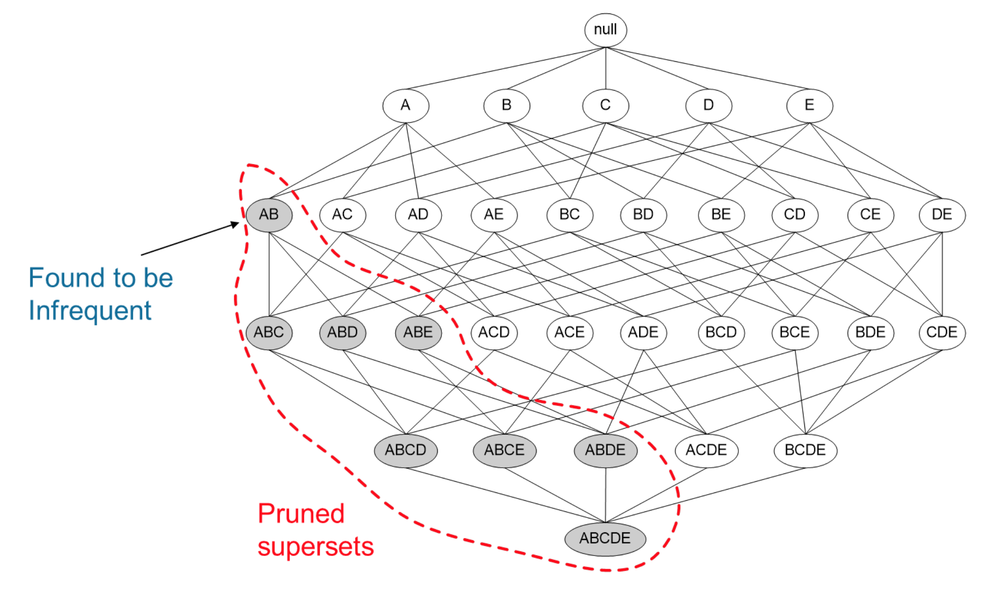

<style>
details {
    border: 1px solid #aaa;
    border-radius: 4px;
    padding: .5em .5em 0;
}
summary {
    font-weight: bold;
    margin: -.5em -.5em 0;
    padding: .5em;
}
details[open] {
    padding: .5em;
}
details[open] summary {
    border-bottom: 1px solid #aaa;
    margin-bottom: .5em;
}
</style>

<details><summary>目录</summary><p>

- [Apriori 关联分析概述](#apriori-关联分析概述)
- [Apriori 关联分析概念](#apriori-关联分析概念)
  - [支持度 Support](#支持度-support)
    - [计算方式是](#计算方式是)
    - [举例说明](#举例说明)
  - [置信度 Confidence](#置信度-confidence)
    - [计算方式](#计算方式)
    - [举例说明](#举例说明-1)
  - [提深度 Lift](#提深度-lift)
    - [计算方式](#计算方式-1)
    - [举例说明](#举例说明-2)
- [Apriori 关联分析算法](#apriori-关联分析算法)
  - [算法思想](#算法思想)
  - [算法实现](#算法实现)
    - [Apriori 关联分析参数](#apriori-关联分析参数)
    - [Apriori 关联分析实现](#apriori-关联分析实现)
- [Apriori 关联规则算法](#apriori-关联规则算法)
  - [算法思想](#算法思想-1)
  - [算法实现](#算法实现-1)
    - [Apriori 关联规则参数](#apriori-关联规则参数)
    - [Apriori 关联规则实现](#apriori-关联规则实现)
- [参考](#参考)
</p></details><p></p>

# Apriori 关联分析概述

选择物品间的关联规则也就是要寻找物品之间的潜在关系。要寻找这种关系，有两步：

1. 找出频繁一起出现的物品集的集合，称之为频繁项集。比如：

```
{
    {啤酒, 尿布},
    {鸡蛋, 牛奶},
    {香蕉, 苹果},
}
```

2. 在频繁项集的基础上，使用关联规则算法找出其中物品的关联结果

为什么要先找频繁项集呢？还是以超市为例，找物品关联规则的目的是为了提高物品的销售额。
如果一个物品本身购买的人就不多，那么再怎么提升，也不会高到哪去。
所以从效率和价值的角度来说，肯定是优先找出那些人们频繁购买的物品的关联物品

既然要找出物品的关联规则有两步，先介绍如何用 Apriori 找出物品的频繁项集，
然后在 Apriori 处理后的频繁项集的基础上，进行物品的关联分析

# Apriori 关联分析概念

示例数据：超市部分商品购买记录

| item | 购买商品                         |
|------|---------------------------------|
| 0    | 牛奶, 洋葱, 肉豆蔻, 芸豆, 鸡蛋, 酸奶 |
| 1    | 莳萝, 洋葱, 肉豆蔻, 芸豆, 鸡蛋, 酸奶 |
| 2    | 牛奶, 苹果, 芸豆, 鸡蛋             |
| 3    | 牛奶, 独角兽, 玉米, 芸豆, 酸奶      |
| 4    | 玉米, 洋葱, 洋葱, 芸豆, 冰淇淋, 鸡蛋 |

## 支持度 Support

支持度可以理解为物品当前的流行程度

### 计算方式是

`$$Support(A) = \frac{包含 A 的记录数量}{总的记录数量}$$`

### 举例说明 

用上面的超市记录举例，一共有五个交易：

* 牛奶出现在三个交易中，故而 `{牛奶}` 的支持度为 `$\frac{3}{5}$`
* 鸡蛋出现在四个交易中，故而 `{鸡蛋}` 的支持度是 `$\frac{4}{5}$`
* 牛奶和鸡蛋同时出现的次数是 2，故而 `{牛奶，鸡蛋}` 的支持度为 `$\frac{2}{5}$`

## 置信度 Confidence

置信度是指如果购买物品 A，有较大可能购买物品 B

### 计算方式

`$$Confidence(A \rightarrow B) = \frac{包含物品 A 和 B 的记录数量}{包含 A 的记录数量}$$`

### 举例说明

`{牛奶，鸡蛋}` 一起购买的次数是 2 次，鸡蛋的购买次数是 4 次。
那么 `$Confidence(鸡蛋 \rightarrow 牛奶)$` 的计算方式是：

`$$Confidence(鸡蛋 \rightarrow 牛奶)= \frac{2}{4}$$`

## 提深度 Lift

提升度指当销售一个物品时，另一个物品销售率会增加多少

* 提升度大于 1 时，说明物品 A 卖得越多，B 也会卖得越多
* 提升度等于 1 则意味着产品 A 和 B 之间没有关联
* 提升度小于 1 则意味着购买 A 反而会减少 B 的销量

### 计算方式

`$$Lift(A \rightarrow B) = \frac{Confidence(A \rightarrow B)}{Support(A)}$$`

### 举例说明

上面计算了 

* `{牛奶，鸡蛋}` 的置信度 `$Confidence(鸡蛋 \rightarrow 牛奶)=\frac{2}{4}$`
* `{牛奶}` 的支持度 `$Support(牛奶)=\frac{3}{5}$`

那么就能计算 `{牛奶，鸡蛋}` 的提升度：

`$$Lift(鸡蛋 \rightarrow 牛奶)=\frac{\frac{2}{4}}{\frac{4}{5}} = 0.625$$`

# Apriori 关联分析算法

## 算法思想

Apriori 的作用是根据物品间的支持度找出物品中的频繁项集。
通过上面知道，支持度越高，说明物品越受欢迎。
那么支持度怎么决定呢？这个是主观决定的，会给 Apriori 提供一个最小支持度参数，
然后 Apriori 会返回比这个最小支持度高的那些频繁项集

可以通过遍历所有组合就能找出所有频繁项集。但问题是遍历所有组合花的时间太多，效率太低。
假设有 N 个物品，那么一共需要计算 `$2^{N-1}$` 次。每增加一个物品，数量级是成指数增长。
而 Apriori 就是一种找出频繁项集的高效算法。它的核心就是下面这句话

> 某个项集是频繁项集的，那么它的所有自己也是频繁项集

这句话看起来是没什么用，但是反过来就很有用了：

> 如果一个项集是非频繁项集，那么它的所有超集也是非频繁项集

如下图所示，发现 `{A,B}` 这个项集是非频繁的，
那么 `{A,B}` 这个项集的超集 `{A,B,C}`，`{A,B,D}` 等等也都是非频繁的，
这些就都可以忽略不去计算。运用 Apriori 算法的思想，就能去掉很多非频繁的项集，
大大简化计算量



要使用 Apriori 算法，需要提供两个参数，数据集和最小支持度。
从前面已经知道了 Apriori 会遍历所有的物品组合，怎么遍历呢？答案就是递归。
先遍历 1 个物品组合的情况，剔除掉支持度低于最小支持度的数据项，然后用剩下的物品进行组合。
遍历 2 个物品组合的情况，再剔除不满足条件的组合。不断递归下去，直到不再有物品可以组合

## 算法实现

计算频繁集

### Apriori 关联分析参数

```python
def apriori(df, min_support = 0.5, use_colnames = False, max_len = None):
    """
    df：数据集
    min_support：给定的最小支持度
    use_colnames：默认 False，则返回的物品组合用编号显示，True 直接显示物品名称
    max_len：最大物品组合数，默认是 None，不做限制。如果只需要计算两个物品组合的话，便将这个值设置为 2
    """
    pass
```

### Apriori 关联分析实现

```python
import pandas as pd
from mlxtend.preprocessing import TransactionEncoder
from mlxtend.frequent_patterns import apriori

# data 
data = [
    ['牛奶','洋葱','肉豆蔻','芸豆','鸡蛋','酸奶'],
    ['莳萝','洋葱','肉豆蔻','芸豆','鸡蛋','酸奶'],
    ['牛奶','苹果','芸豆','鸡蛋'],
    ['牛奶','独角兽','玉米','芸豆','酸奶'],
    ['玉米','洋葱','洋葱','芸豆','冰淇淋','鸡蛋']
]
```

```python
# data preprocessing
te = TransactionEncoder()  # one-hot encode
te_array = te.fit(data).transform(data)
df = pd.DataFrame(te_array, columns = te.columns_)
print(df)
```

```
   冰淇淋  洋葱   牛奶    独角兽  玉米    肉豆蔻  芸豆   苹果   莳萝    酸奶    鸡蛋
0  False   True   True  False  False   True  True  False  False   True   True
1  False   True  False  False  False   True  True  False   True   True   True
2  False  False   True  False  False  False  True   True  False  False   True
3  False  False   True   True   True  False  True  False  False   True  False
4   True   True  False  False   True  False  True  False  False  False   True
```

```python
# apriori analysis
freq = apriori(df, min_support = 0.05, use_columns = True)
with pd.set_optim
print(freq.head())
print(freq.tail())
```

```
   support  itemsets
0      0.2    (冰淇淋)
1      0.6     (洋葱)
2      0.6     (牛奶)
3      0.2    (独角兽)
4      0.4     (玉米)
```

```
     support                   itemsets
144      0.2      (独角兽, 芸豆, 玉米, 酸奶, 牛奶)
145      0.2      (芸豆, 酸奶, 鸡蛋, 肉豆蔻, 牛奶)
146      0.2      (芸豆, 酸奶, 鸡蛋, 肉豆蔻, 莳萝)
147      0.2  (芸豆, 酸奶, 鸡蛋, 肉豆蔻, 洋葱, 牛奶)
148      0.2  (芸豆, 酸奶, 鸡蛋, 肉豆蔻, 洋葱, 莳萝)
```

# Apriori 关联规则算法

## 算法思想

上面已经用 Apriori 得到频繁项集了，那么就可以在频繁项集的基础上，找到这里面的关联规则。
而计算关联规则所用到的，就是上面所说的置信度和提升度

这里有一点要注意：

> 当发现 `置信度(A->B)` 很高的时候，反过来的值 `置信度(B->A)` 不一定很高

一个物品的关联结果是非常多的，Apriori 思想运用在置信度上也是合适的：

> 如果一个关联结果的置信度低，那么它的所有超集的置信度也低

这样一来，就能节省很多的计算量

## 算法实现


### Apriori 关联规则参数

```python
def association_rules(df, metric = "confidence", min_threshold = 0.8, support_only = False):
    """
    df：Apriori 计算后的频繁项集
    metric：可选值 ['support', 'confidence', 'lift', 'leverage', 'conviction']
        比较常用的就是置信度和支持度。这个参数和下面的 min_threshold 参数配合使用
    min_threshold：参数类型是浮点型，根据 metric 不同可选值有不同的范围：
        metric = 'support'  => 取值范围 [0, 1]
        metric = 'confidence'  => 取值范围 [0, 1]
        metric = 'lift'  => 取值范围 [0, inf]
    support_only：默认是 False。仅计算有支持度的项集，若缺失支持度则用 NaNs 填充
    """
    pass
```

### Apriori 关联规则实现


```python
from mlxtend.frequent_patterns import association_rules

# association rules
result = association_rules(
    freq, 
    metric = "confidence", 
    min_threshold = 0.6
)
print(result.head())
print(result.tail())
```

```
    antecedents   consequents   antecedent support  consequent support  support  \
0       (冰淇淋)        (洋葱)                 0.2                 0.6      0.2   
1       (冰淇淋)        (玉米)                 0.2                 0.4      0.2   
2       (冰淇淋)        (芸豆)                 0.2                 1.0      0.2   
3       (冰淇淋)        (鸡蛋)                 0.2                 0.8      0.2   
4       (肉豆蔻)        (洋葱)                 0.4                 0.6      0.4   

    confidence      lift  leverage  conviction  
0         1.0  1.666667      0.08         inf  
1         1.0  2.500000      0.12         inf  
2         1.0  1.000000      0.00         inf  
3         1.0  1.250000      0.04         inf  
4         1.0  1.666667      0.16         inf  
```

```
      antecedents       consequents              antecedent support  \
689    (莳萝, 酸奶)      (肉豆蔻, 鸡蛋, 芸豆, 洋葱)                 0.2   
690    (鸡蛋, 莳萝)      (肉豆蔻, 芸豆, 酸奶, 洋葱)                 0.2   
691   (莳萝, 肉豆蔻)       (鸡蛋, 芸豆, 酸奶, 洋葱)                 0.2   
692    (莳萝, 洋葱)      (肉豆蔻, 鸡蛋, 芸豆, 酸奶)                 0.2   
693        (莳萝)  (芸豆, 酸奶, 鸡蛋, 肉豆蔻, 洋葱)                 0.2   

     consequent support  support   confidence  lift  leverage  conviction  
689                 0.4      0.2         1.0   2.5      0.12         inf  
690                 0.4      0.2         1.0   2.5      0.12         inf  
691                 0.4      0.2         1.0   2.5      0.12         inf  
692                 0.4      0.2         1.0   2.5      0.12         inf  
693                 0.4      0.2         1.0   2.5      0.12         inf 
```

```python
result.sort_values(by = "confidence", accending = False)
```

```
antecedents consequents  antecedent support  consequent support  support  \
0       (冰淇淋)        (洋葱)                 0.2                 0.6      0.2   
1       (冰淇淋)        (玉米)                 0.2                 0.4      0.2   
2       (冰淇淋)        (芸豆)                 0.2                 1.0      0.2   
3       (冰淇淋)        (鸡蛋)                 0.2                 0.8      0.2   
4        (洋葱)       (肉豆蔻)                 0.6                 0.4      0.4   

   confidence      lift  leverage  conviction  
0    1.000000  1.666667      0.08         inf  
1    1.000000  2.500000      0.12         inf  
2    1.000000  1.000000      0.00         inf  
3    1.000000  1.250000      0.04         inf  
4    0.666667  1.666667      0.16         1.8  
```

```
    antecedents            consequents  antecedent support  \
689    (芸豆, 莳萝)      (洋葱, 酸奶, 鸡蛋, 肉豆蔻)                 0.2   
690    (酸奶, 莳萝)      (洋葱, 鸡蛋, 芸豆, 肉豆蔻)                 0.2   
691   (莳萝, 肉豆蔻)       (洋葱, 酸奶, 鸡蛋, 芸豆)                 0.2   
692    (莳萝, 鸡蛋)      (洋葱, 酸奶, 芸豆, 肉豆蔻)                 0.2   
693        (莳萝)  (洋葱, 芸豆, 酸奶, 肉豆蔻, 鸡蛋)                 0.2   

     consequent support  support  confidence  lift  leverage  conviction  
689                 0.4      0.2         1.0   2.5      0.12         inf  
690                 0.4      0.2         1.0   2.5      0.12         inf  
691                 0.4      0.2         1.0   2.5      0.12         inf  
692                 0.4      0.2         1.0   2.5      0.12         inf  
693                 0.4      0.2         1.0   2.5      0.12         inf  
```

`{洋葱 -> 鸡蛋,芸豆}` 的置信度是 1.00，而它们的提升度是 1.25。
这说明买了洋葱的人很可能会再购买 1.25 份的 `{鸡蛋,芸豆}`。
所以可以让它们放到一起出售


# 参考

* [深入浅出Apriori关联分析算法(一)](https://www.cnblogs.com/listenfwind/p/10280392.html)
* [深入浅出Apriori关联分析算法(二)](https://www.cnblogs.com/listenfwind/p/11395703.html)
* [Apriori 算法原理总结](https://www.cnblogs.com/pinard/p/6293298.html)
* [apyori](https://github.com/ymoch/apyori)
* [mlxtend](https://github.com/rasbt/mlxtend)

