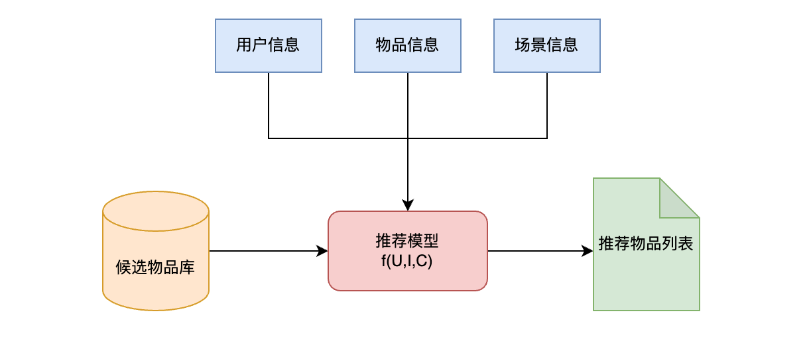
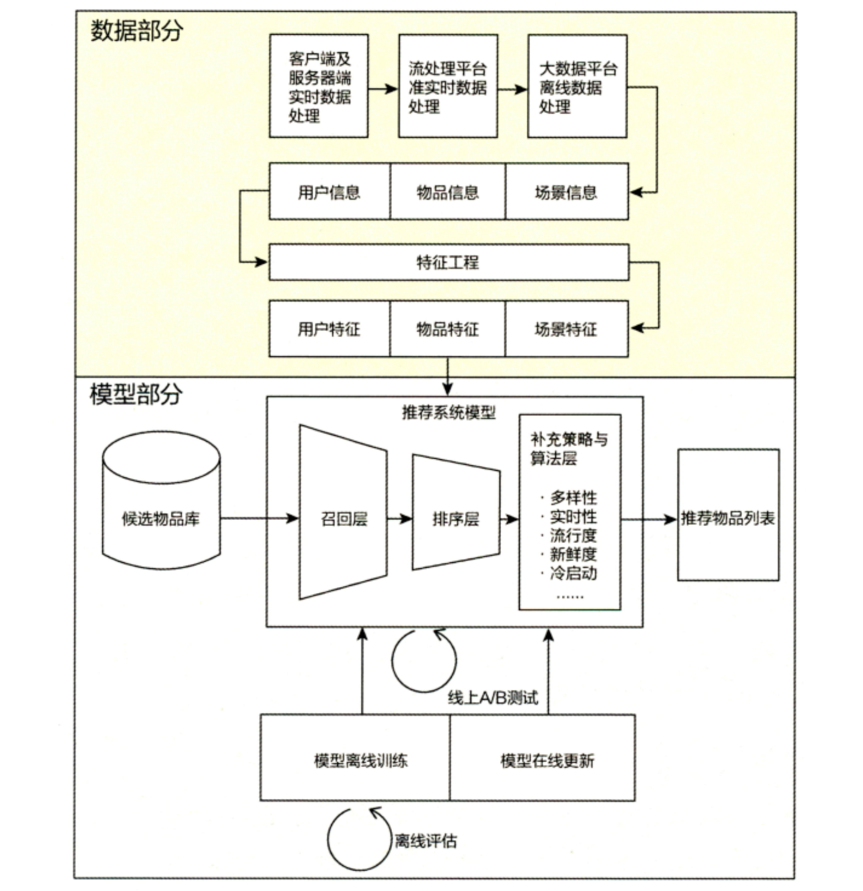
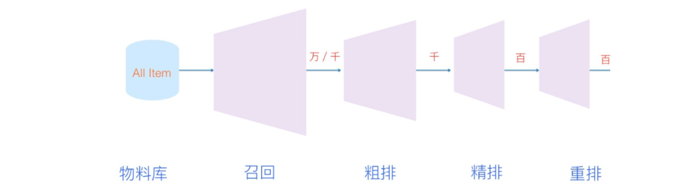
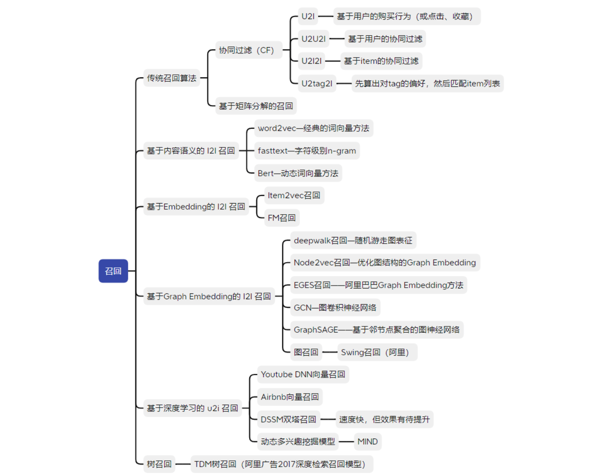
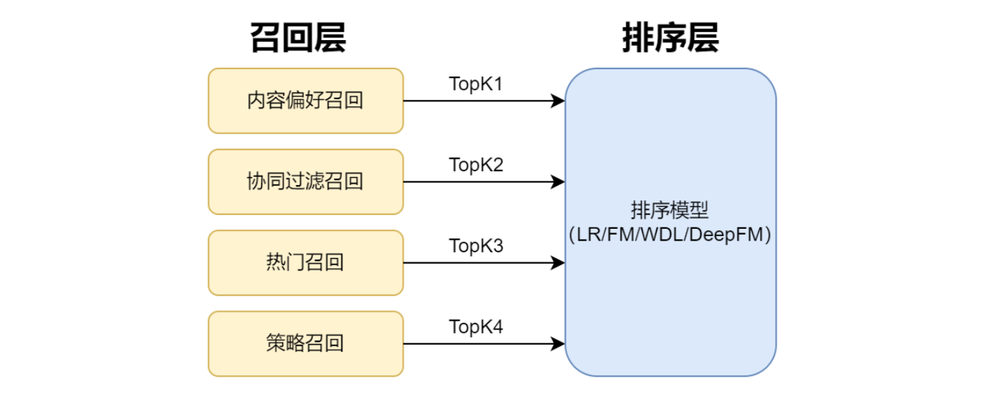
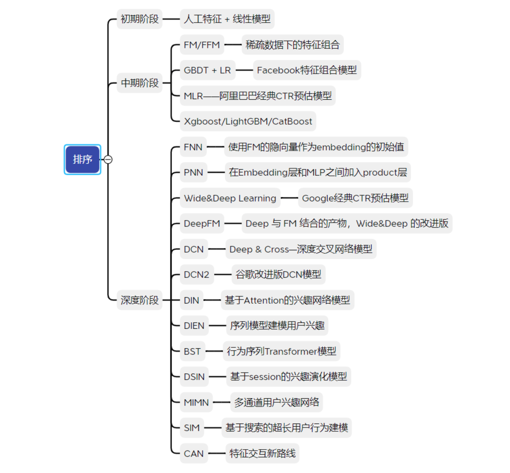

目录

- [搜索和推荐](#搜索和推荐)
- [推荐系统的价值与局限性](#推荐系统的价值与局限性)
  - [价值](#价值)
  - [局限性](#局限性)
- [推荐系统的逻辑框架](#推荐系统的逻辑框架)
- [推荐系统的技术架构](#推荐系统的技术架构)
  - [推荐系统的数据部分](#推荐系统的数据部分)
  - [推荐系统的模型部分](#推荐系统的模型部分)
  - [AB Test](#ab-test)
    - [AB Test 流程](#ab-test-流程)
    - [AB Test 的意义](#ab-test-的意义)
- [推荐系统架构](#推荐系统架构)
  - [索引池](#索引池)
  - [特征服务](#特征服务)
  - [排序模块](#排序模块)
    - [召回粗排精排](#召回粗排精排)
      - [召回](#召回)
      - [粗排](#粗排)
      - [精排](#精排)
    - [打压保送重排](#打压保送重排)
  - [展示逻辑](#展示逻辑)
  - [日志系统](#日志系统)
  - [分析系统](#分析系统)
- [推荐系统常用模型](#推荐系统常用模型)
  - [推荐系统的不同阶段](#推荐系统的不同阶段)
    - [推荐系统的五个阶段](#推荐系统的五个阶段)
    - [召回阶段和排序阶段的特点](#召回阶段和排序阶段的特点)
  - [召回阶段模型](#召回阶段模型)
    - [召回模型的演化关系](#召回模型的演化关系)
    - [多路召回的必要性](#多路召回的必要性)
  - [排序阶段模型](#排序阶段模型)
- [参考](#参考)

# 搜索和推荐

搜索是人找物，而推荐是物找人。推荐一般用来满足用户比较明确的需求，
而推荐则可以用来满足用户相对模糊的需求

搜索有一定的使用门槛，用户需要输入关键词，至少要会打字，并相对准确的描述自己的兴趣。
但推荐几乎没有使用门槛，用户只要会刷新就可以了，每次刷新都会出来新的东西。
完成一个简单的推荐系统的方法就是每次请求都能保证出新的东西，也就是随机不重复推荐。
但搜索不能这么简单，搜索出来的东西一定是和输入相关的东西，不然就不叫搜索了。
一个较理想的推荐系统可以做到千人千面，根据用户偏好个性化地进行推荐

| 熟悉的推荐系统 | 熟悉的搜索系统 |
|--------------|-------------|
| 短视频推荐 | 浏览器搜索引擎 |
| 新闻推荐 | 电商商品搜索栏 |
| 视屏推荐 | 问题搜索栏 |
| 音乐推荐 | 人事搜索栏 |
| 商品推荐 | |

# 推荐系统的价值与局限性

## 价值

推荐系统是连接生产者和消费者的中间媒介。它对于生产者、消费者、以及平台都有各自的价值

* 对消费者：帮助消费者便捷地获取信息
* 对生产者：帮助生产者获取流量曝光和用户增长
* 对平台：平台可以通过卖广告赚取收益

一般来说，用户使用时长越长，平台就可以插入更多的广告。
所以，推荐系统常常以 **用户使用时长** 为核心优化指标

对于生产者，推荐系统非常重要的一点特性就是要具备 **长尾效应**，
即少部分头部的作者能获得主要的曝光，但大多数中小创作者也必须要能够获得一定的流量。
否则大部分的作者创作积极性被打压掉之后，平台就会慢慢死掉。
一般发展比较好的推荐系统的，他们的长尾都做的非常好

## 局限性

尽管各个推荐系统平台都把自己的模型和算法吹得天花乱坠，
但实际上模型和算法对于推荐系统的成功的贡献是有限的，
并且具有它的局限性，主要体现在以下几点:

1. 优质内容是根本
   - 没有足够多用户喜爱的优质内容，推荐系统的模型算法再厉害也是无用武之地的。
     如果内容足够优质，非常简单的推荐算法就能够起到很好的效果
2. 存在用户信息茧房
   - 推荐系统存在着过分迎合用户偏好的倾向，
     让用户沉浸在一些短期的感觉刺激中浪费许多时间，
     这对用户的长期价值可能是负的
3. 模型自己学自己
   - 推荐系统的模型学习的数据是有偏的，
     都是曾经被模型选中的样本才有可能受到用户点赞喜欢获得正反馈成为正样本。
     虽然大部分推荐系统对新内容都有一些随机流量，
     但绝大部分样本都没有足够多的流量来进行评估。
     可能相同的内容换个 id 重新再发一遍就能获得多得多的流量，
     这里面存在着很大的随机性

# 推荐系统的逻辑框架

* 用户的角度
    - 推荐系统解决的是在信息过载的情况下，用户如何获得感兴趣信息（或者说是对自己有用的信息）的问题，
      特别是在互联网这种拥有海量信息的场景下，推荐系统会更多地利用用户的各类历史信息猜测其可能喜欢的内容
* 公司的角度
    - 推荐系统解决产品能够最大限度地吸引用户、留存用户、增加用户黏性、提高用户转化率的问题，
      从而达到公司商业目标连续增长的目的。当然，不同的业务模式的公司的优化目标是不同的：
      如视频类公司更注重用户观看时长，电商类公司更注重用户的购买转化率，新闻类公司更注重用户的点击率

从上面可以看出，推荐系统要处理的核心问题就是如何更好地利用商品和人的信息来实现公司与用户的双赢

就信息来讲，可以根据所属大体划分为三部分，分别是物品信息、用户信息、场景信息：

* 物品信息只是一个统称，在不同的场景中也会有不同的叫法，比如在商品推荐中可以称为 `商品信息`，
  在视频推荐中可以称为 `视频信息`，在新闻推荐中可以称为 `新闻信息` 等等
* 用户信息通常包含和用户更加相关的信息，如人口属性、历史行为、关系网络等等，这些信息往往可以推测出 `人` 的兴趣点
* 场景信息一般指的是时间、地点等一些环境信息，常常也被称为 `上下文信息` 

在我们获得 `用户信息`、`物品信息`、`场景信息` 后，就可以将推荐系统解决的问题定义为以下形式：

> 对于用户 `$U$`(user)，在特定场景下 `$C$`(context)下，针对海量的物品 `$I$`(item)，构建一个函数 `$f(U, I, C)$`，
> 预测用户对特定候选物品 `$I$`(item) 的喜好程度，再根据喜好程度对所有候选物品进行排序，生成推荐列表的问题

这样就可以大致得到如下图所示的推荐系统逻辑框架：

# 推荐系统的技术架构

不论是数据处理，还是模型训练，都需要各种各样的计算，常常我们看一些文章的时候，
总是会谈到离线计算、近线计算、在线计算等，因此想要了解推荐系统的技术架构，
就需要对这几种不同的计算方式有一定的了解，直接来上张图

从上图中可以看到，从上至下依次为离线（offline）、近线（nearline）、在线（online）三部分：

* 离线（offline）
    - 存储离线数据，利用大数据查询工具进行数据查询和处理，离线模型训练。离线部分对于数据数量和算法复杂度的限制较少，
      以批量方式完成数据处理，但是数据处理的实时性非常差，无法做到数据和模型的及时更新
* 近线（near line）
    - 基于数据消息队列，利用一些流计算平台进行数据的准实时处理。它居于离线和在线之间，
      既可以以分钟级别甚至秒级的延时来准实时地处理数据，也有一定的数据批量处理能力
* 在线（online）
    - online 部分的主要任务是进行用户请求的实时处理，模型的在线服务。在线部分需要更快地响应最近的事件和用户交互，
      因此对于延迟的要求比较苛刻，一般都要求在 100ms 以内完成所有处理，这会限制所用算法的复杂性和可处理的数据量

常用的技术栈：HDFS(离线)+Spark(离线)+Flink(在线+近线)+Redis(在线+近线)，
从离线到在线，数据的实时性从上到下依次增强，而数据规模和处理能力从上到下依次减弱

推荐系统的技术架构图如下：

## 推荐系统的数据部分

在推荐系统的技术架构中，数据部分主要负责收集和处理用户信息、物品信息、场景信息。
而海量信息是需要大数据平台来处理的。根据实时性的强弱排序：
依次为：客户端及服务器端实时数据处理、流处理平台准实时数据处理、大数据平台离线数据处理。
而在实时性由强到弱递减的同时，三种平台的海量数据处理能力则由弱到强。
当然，一个成熟的推荐系统的数据流系统会将三者取长补短，配合使用

## 推荐系统的模型部分

推荐系统的模型部分是推荐系统的核心，也是主体，模型结构一般由召回层、排序层和补充策略与算法层（重排序）组成

* 召回层
    - 一般利用高效的召回规则、算法或简单的模型，快速从海量的候选集中召回用户可能感兴趣的物品
* 排序层
    - 利用排序模型对初筛的候选集进行精排序
* 补充策略与算法层
    - 也被称为重排序层，可以在将推荐列表返回用户之前，为兼顾结果的多样性、流行度、新鲜度等指标，
      结合一些补充的策略和算法对推荐列表进行一定的调整，最终形成用户可见的推荐列表

模型训练根据训练环境的不同，分为离线训练和在线更新两部分，其中，离线训练的特点是可以利用全量样本和特征，
使模型逼近全局最优点，而在线更新则可以准实时地消化新的数据样本，更快地反映新的数据变化趋势，满足模型实时性的需求

* 在数据采集上，可以采用 Flink
* 在离线批量计上，可以采用历久弥新的 Spark
* 在底层数据存储上，可以采用 HDFS
* 在存储 `$f(U,I,C)$` 的近线在线特征时，可以采用 Redis
* 常用算法框架：
    - TensorFlow/Keras
    - Spark MLlib
* 模型性能预估：
    - 离线指标 AUC/Recall/RMSE
    - 在线评估则是 AB Test。它是用于衡量某值算法上线后带来的真实收益情况（这里的收益可以是 CTR/CVR/ecpm 等），
      从而让我们知道某个算法是否和离线预估表现的一致，是否值得上线替代老版本的算法

将上面推荐系统的技术架构进一步细化的话，可得到如下图所示的技术架构：

## AB Test

### AB Test 流程

假设要上线 A 算法通过了离线预估，准备上线来与线上正在跑的 B 算法 battle 一下，通常的 AB Test 流程是：

在线上的流量池中，切出一部分流量来给 A 算法（该流量为实验组），同时为了方便对比，
切出等量的流量来给 B 算法（该流量为对照组），让这两个算法分别在各自的流量中运行一段时间，
看看最终在线 CTR/CVR 等商业指标的表现情况如何

其中的流量则指的是用户，同时在实验期间：实验组有且仅能看到 A 算法效果；控制组有且仅能看到 B 算法效果，
因此 AB Test 环节的精髓便在于，怎么”公平“的切分流量。即让两个流量组的用户分布均匀，
不会存在实验组用户和控制组用户区分性太大，因为区分性太大流量就有偏了，做出来的实验效果自然不可信。
比如实验组美国的用户占比为 80%，而控制组的用户美国的用户的 10% 就是一个分流非常差的结果

### AB Test 的意义

离线评估无法完全消除模型过拟合的影响，因此，得出的离线评估结果无法完全替代线上评估结果

一般来讲，离线评估往往不会考虑线上环境的延迟、数据丢失、标签数据缺失等情况。
因此，离线评估的结果是理想工程环境下的结果，线上系统的某些商业指标在离线评估中无法计算

离线评估一般是针对模型本身进行评估，而与模型相关的其他指标，
特别是商业指标，往往无法直接获得。比如，上线了新的推荐算法，
离线评估往往关注的是 ROC 曲线、P-R 曲线等的改进。
而线上评估可以全面了解该推荐算法带来的用户点击率、留存时长、PV 访问量等的变化。
这些都要由 AB Test 来进行全面的评估

# 推荐系统架构

> 如何搭建一个推荐系统？

## 索引池

第一步，需要知道有哪些东西可以推荐。这就需要一个索引池，
里面存储了可能被推荐的全量内容的 id 以及它们的一些特征

对于有些有时效性的内容，比如新闻，在其时间过期之后，要从索引池中拿掉。
同时，通过审核与控制索引池中的内容，可以确保不犯致命错误，不推荐涉黄涉非的内容给用户

## 特征服务

第二步，当用户通过登录 APP 或者刷新操作触发了一个获取推荐信息的请求的时候，
需要知道这个用户当前有什么喜好

这就需要一个特征服务，用来获取用户的年龄、性别、地域等属性特征，
以及根据用户之前的浏览点赞等记录计算的行为特征

由于用户的喜好可能变化较快且需求较高，需要搭建服务以保证高性能

## 排序模块

第三步，需要确定把索引池中哪个内容或者哪些内容推荐给用户

这就需要一个排序模块，其目的是将索引池中所有内容按照用户可能的喜好程度进行排序。
如果索引池非常大，排序模块通常会进一步分成召回和排序两个阶段，
有些推荐系统还会在它们中间加上一个粗排阶段

此外，排序模块中通常还会使用一些打压、保送、重排的策略来对模型预测结果进行一些人为干预

### 召回粗排精排

推荐系统架构中的排序模块，一般会分成召回、粗排、精排三个阶段。
这几个阶段，可以比喻成索引库全部 item 争夺最终展示机会的初赛、复赛、决赛

召回、粗排、精排实际上是计算压力从大到小，模型复杂度从小到大的一个过程

#### 召回

> 召回(recall)就好像是初赛，比较简单，效率优先

一开始的索引库中可能有数万数十万的 item，这些 item 都是有资格被展示的，
如果直接上复杂模型对这么多 item 进行排序，性能是很差的

所以可以先设计方法简单性能高效的模型或规则策略，例如双塔模型、LR、FM以及各种规则策略。
用这些召回模块来挖掘出原则上任何用户有可能感兴趣的东西，
召回的输出一般在几千这样的量级

为什么这个环节叫做召回呢，因为这个环节不在乎你把多少错误的东西放进来，
但是非常在乎你没有把对的东西放进来(漏召回)

实践中，召回一般都会做多路召回策略:

* 第一种召回，是非个性化的
    - 比如对于新用户，要确保用最高质量的视频把他们留住，
      那么可以划一个"精品池"出来，作为一路召回
* 第二种召回，是 i2i，即 item-to-item，根据用户的历史 item，来找相似的 item
    - 比如说把用户过去点过赞的视频拿出来，去找画面上，BGM 上，
      或者用户行为结构上相似的视频
* 第三种召回，是 u2i，即纯粹从 user 和 item 的关系出发
    - 双塔就是一个典型的 u2i
    - 在用户请求过来的时候，计算出 user 的 embedding，
      然后去一个事先存好的 item embedding 的空间，寻找最相似的一批拿出来。
      由于要实时计算 user 特征，它的负担要大于前面两者，
      但这种召回个性化程度最高，一般会作为主路召回

#### 粗排

> 粗排(pre-rank)就好像是复赛，中等难度，平衡精效

召回的输出有数千，直接上精排的话可能还是比较慢，
可以使用一些中等复杂的模型(例如 MLP, DeepFM)对召回输出的几千个 item 进行初步的排序，
输出几百个到最终的精排环节。起到在召回和精排之间进行精度和效率的平衡

粗排环节不是必须的，如果索引库中的候选的 item 数量很少，甚至召回环节也可不要

#### 精排

> 精排(rank)就好像是决赛，疯狂难度，精度优先

精排是最纯粹的排序，也是最纯粹的机器学习模块。它的目标只有一个，
就是根据手头所有的信息输出最准的预测

精排的输入只有几百个，模型就可以非常复杂，
例如 DCN, 以及各种序列模型: DIEN、Transformer, MMOE 等。
是一个纯粹的追求模型精度的环节。
这个环节也是学术界各种相关的论文 paper 研究得最多的部分

### 打压保送重排

在模型之外，在推荐的整个过程中还穿插着许多策略(规则)环节来辅助。
这些策略有些是为了推荐的结果更好，有些则是为了某种长期规划或者营利诉求

推荐系统中常用到的一些策略包括以下三种:

1. 打压
    - 有政策风险或者与平台风格不符合的内容需要打压
2. 保送
    - 常见的是营收原因(金主爸爸掏钱了)需要保送
    - 此外，对于新内容，常常有一定的保送流量，以确保长尾效应，维持平台活力
3. 重排
    - 一是确保最终推荐内容的多样性
    - 二是防止重复推荐用户最近浏览过的内容

## 展示逻辑

第四步，现在已经确定把哪些内容推荐给用户了 

这就需要一个展示逻辑，许多时候最终呈现给用户的是图文的混排，
或者内容和广告的混排，这个时候需要设计适当的展示逻辑给到前端

经过物料索引、特征服务、排序模块、展示逻辑这样四步，
终于成功地把东西推给用户了，但是还不能收工，还有无穷无尽的监控和迭代

## 日志系统

第五步，为了监控的推荐是否有效，需要搭建日志系统，记录推送前后一切信息

这些信息包括推送前获取的特征、模型的排序结果以及推送后用户的行为反馈。
通过对比排序结果和用户反馈可以计算点击率以及浏览时长评估指标，
并且形成新的训练数据来让排序模块继续训练

## 分析系统

第六步，为了进一步迭代优化的推荐系统，需要做 AB 测试实验，并分析实验结果

这就需要一个分析系统，分析系统基于日志系统的数据。
AB 测试一般把用户随机进行划分为对照组(A 组,不添加改进点)和实验组(B 组,添加改进点)，
通过对比 AB 之间的差异，来展示所加的改进点是否有效。

推荐系统的迭代一般是这么个流程:

* 设计改进 idea -> 做线下实验 -> 上 AB 试试 -> 有效就推广到全量

# 推荐系统常用模型

## 推荐系统的不同阶段

推荐系统的模型部分由召回层，排序层和重排层组成。而在进入召回阶段之前，通常需要构建索引和特征，
且排序阶段还可以划分成粗排和精排，以便更精准，更有效地给用户推荐到合适的商品

### 推荐系统的五个阶段

从构建特征到得到最终的推荐列表，我们可以得到如下几个阶段

* 物料库(索引和特征)
    - 会根据内容特性提前建立若干种类型的索引
* 召回阶段
    - 用户请求时会从各种索引种取出千/万 条 item
* 粗排阶段
    - 针对这上千/万条 item，进行第一遍打分，再筛选出几百条或者千条。
      这个阶段的排序模型一般都比较简单，能够过滤掉一些与用户兴趣明显不相关的
* 精排阶段
    - 得到几百条 item 后，精排阶段会建立相对精细的模型，根据用户的画像、
      偏好、上下文、结合业务目标进行排序。一般精排后返回 50-100 条给到 engine 侧
* 重排阶段
    - engine 侧拿到精排的 50-100 条 item，还会做很多的人工干预和产品逻辑，比如 item 之间的多样性；
      产品策略逻辑，比如热门、置顶，多种内容之间的位置混合等等。最终会返回 5-10 条左右的 item，曝光给客户端
    - 根据业务特性，在线流程还有许多比较细的模块，比如去重服务，避免给用户推荐重复的内容
    - 特征预处理，特征抽取等模块

### 召回阶段和排序阶段的特点

* 召回阶段：候选集规模较大、模型和特征相对简单，速度快
* 排序阶段：候选集规模不大，目标是保证排序的精准，一般会使用复杂的模型和特征

## 召回阶段模型

### 召回模型的演化关系

召回模型从传统的召回算法，如基于用户的协同过滤、基于商品的协同过滤、基于矩阵分解的召回算法等。
演变到 Embedding 相关的模型，如 Item2Vec 召回、FM 召回，以及基于 Graph Embedding 的召回模型，如 DeepWalk、Node2Vec 等模型，
对于一些 Item 还有包含 Word2Vec、FastText、Bert 等基于内容语义的召回算法，当然还有如 Youtube DNN、DSSM 等基于深度学习的召回算法。

将比较常用的召回算法整体成如下图所示的思维导图，方便有一个比较系统的认识：

### 多路召回的必要性

在召回阶段，通常要考虑召回率和计算速度。以新闻推荐为例，为了保证用户尽可能地感兴趣，
同时还要兼顾热点和时效性数据，常常会使用多路召回

下图显示了多路召回的方法：

## 排序阶段模型

排序算法大体经过了初期阶段（2010年前）、中期阶段（2010年-2015年）和深度阶段（2016年-至今）。
其中，初期阶段主要是人工特征 + 线性模型；中期阶段主要是自动特征交叉 + 线性模型或树模型；
深度阶段主要是基于神经网络的各种模型

* 初期阶段
    - 主要是进行各种特征工程，模型主要使用 LR 模型
* 中期阶段
    - 进行二阶、 高阶特征交叉，使用 FM/FFM、 GBDT+LR、 XGBoost 等树模型
* 深度阶段
    - 开始将特征映射至多维空间中，然后再通过多层网络去学习特征之间的相关性
        - FNN
        - PNN
        - Wide & Deep
        - NFM
        - AFM
        - DeepFM
        - xDeepFM

按照不同的阶段，将常用的排序模型整理成如下图所示的思维导图：

# 参考

* [推荐系统老司机的十条经验](https://zhuanlan.zhihu.com/p/23847246)
* [推荐系统开源软件列表](http://www.360doc.com/content/14/0315/11/14268060_360747574.shtml)
* [当推荐系统遇见知识图谱](https://mp.weixin.qq.com/s/mjkJY9yH2rizJi-huxan1g)
* [万字入门推荐系统](https://mp.weixin.qq.com/s/YbwQAPIEkihO7XzVvrlDCg)
* [从零单排推荐系统文章汇总目录](https://zhuanlan.zhihu.com/p/407871839)
* [旧文档](https://rpubs.com/Wangzf/Recommendation_algorithm)
* [Kaggle Topk商品推荐方案总结](https://mp.weixin.qq.com/s/YiyQ7xEdmUiUTl34kfBsJg)
* [推荐系统常用模型总结](https://mp.weixin.qq.com/s/QoDH8gTpeEQe0kHeWS48Pg)
* [推荐系统整体架构总结](https://mp.weixin.qq.com/s?__biz=MzI4MTQ2NjU5NA==&mid=2247519716&idx=1&sn=6fee88c0bf901293d75128a5bf8e9252&chksm=ebaa0e69dcdd877fbcb54d17c2debd5cad853af6a9c7c0b285f3bb1a1a2ef3a1d845e3de6018&cur_album_id=2670090714638352386&scene=189#wechat_redirect)

