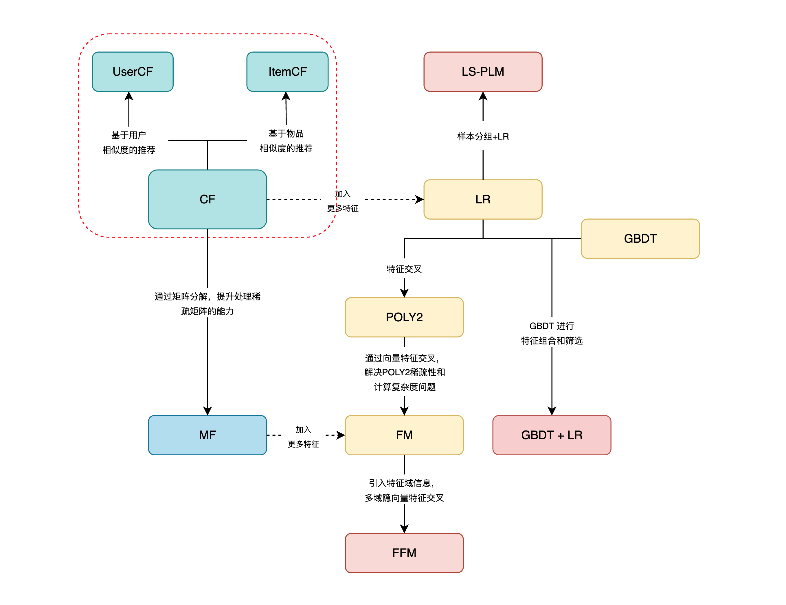
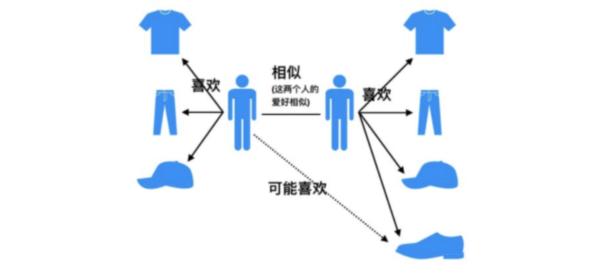
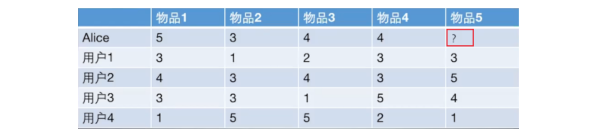
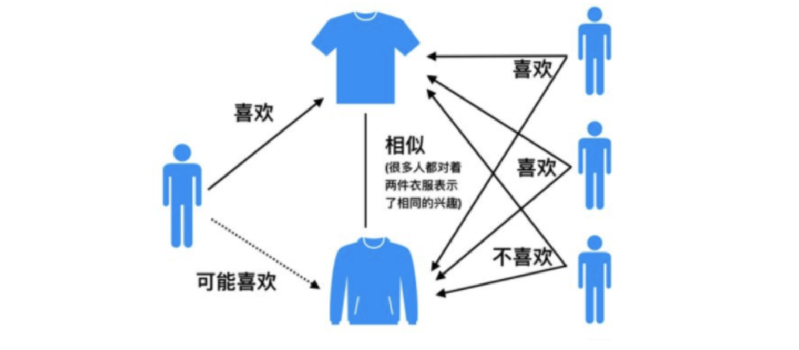
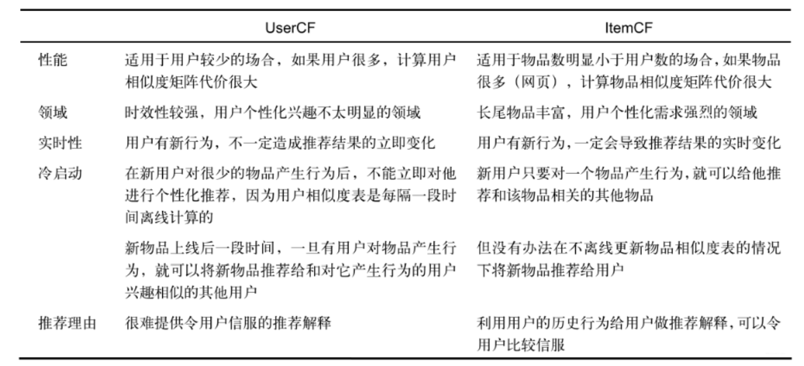
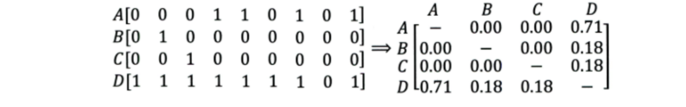

<style>
details {
    border: 1px solid #aaa;
    border-radius: 4px;
    padding: .5em .5em 0;
}
summary {
    font-weight: bold;
    margin: -.5em -.5em 0;
    padding: .5em;
}
details[open] {
    padding: .5em;
}
details[open] summary {
    border-bottom: 1px solid #aaa;
    margin-bottom: .5em;
}
img {
    pointer-events: none;
}
</style>

<details><summary>目录</summary><p>

- [推荐系统传统模型架构](#推荐系统传统模型架构)
- [协同过滤算法简介](#协同过滤算法简介)
- [基于用户的协同过滤](#基于用户的协同过滤)
  - [思路](#思路)
  - [相似度计算](#相似度计算)
    - [杰卡德相似系数](#杰卡德相似系数)
    - [余弦相似度](#余弦相似度)
    - [皮尔逊相关系数](#皮尔逊相关系数)
  - [结果预测](#结果预测)
  - [示例](#示例)
    - [计算被推荐用户与其他用户的相似度](#计算被推荐用户与其他用户的相似度)
    - [根据相似度计算被推荐用户对待推荐物品的最终得分](#根据相似度计算被推荐用户对待推荐物品的最终得分)
    - [根据被推荐用户评分对用户进行推荐](#根据被推荐用户评分对用户进行推荐)
  - [实现](#实现)
  - [优缺点](#优缺点)
- [基于物品的协同过滤](#基于物品的协同过滤)
  - [思路](#思路-1)
  - [示例](#示例-1)
  - [实现](#实现-1)
  - [优缺点](#优缺点-1)
- [应用场景和存在的问题分析](#应用场景和存在的问题分析)
  - [应用场景](#应用场景)
  - [问题分析](#问题分析)
    - [较差的稀疏向量处理能力](#较差的稀疏向量处理能力)
    - [无法利用更多的信息](#无法利用更多的信息)
- [总结](#总结)
- [参考](#参考)
</p></details><p></p>

# 推荐系统传统模型架构



# 协同过滤算法简介

协同过滤算法开始，虽然这个离我们比较久远，但它是对业界影响力最大，应用最广泛的一种经典模型，
从 1992 年一直延续至今，尽管现在协同过滤差不多都已经融入到了深度学习，但模型的基本原理依然还是基于经典协同过滤的思路，
或者是在协同过滤的基础上进行演化，所以这个算法模型依然有种“宝刀未老”的感觉，掌握和学习非常有必要

所谓协同过滤(Collaborative Filtering)算法，
基本思想是根据用户之前的喜好以及其他兴趣相近的用户的选择来给用户推荐物品(基于对用户历史行为数据的挖掘发现用户的喜好偏向，
并预测用户可能喜好的产品进行推荐)，一般是仅仅基于用户(User)的行为数据（评价、购买、下载等），
而不依赖于项(Item)的任何附加信息（物品自身特征）或者用户(User)的任何附加信息（年龄，性别等）。
目前应用比较广泛的协同过滤算法是基于邻域的方法，而这种方法主要有下面两种算法：

* 基于用户的协同过滤算法(UserCF)：给用户推荐和他兴趣相似的其他用户喜欢的产品
* 基于物品的协同过滤算法(ItemCF)：给用户推荐和他之前喜欢的物品相似的物品

# 基于用户的协同过滤

## 思路

基于用户的协同过滤(UserCF)可以追溯到 1993 年，可以说是非常早的一种算法了，这种算法的思想其实比较简单，
当一个用户 A 需要个性化推荐的时候，我们可以先找到和他有相似兴趣的其他用户，然后把那些用户喜欢的，
而用户 A 没有听说过的物品推荐给 A



所以基于用户的协同过滤算法主要包括两个步骤：

* 找到和目标用户兴趣相似的用户和物品集合
* 找到这个集合中的用户喜欢的，且目标用户没有听说过的物品推荐给用户

如果这样说比较抽象的话，我们可以看一个例子，了解一下给用户推荐物荐到底是怎么推荐的，看下面这个表格：



其实，给用户推荐物品的过程可以形象化为一个猜测用户对商品进行打分的任务，上面表格里面是 5 个用户对于 5 件物品的一个打分情况，
就可以理解为用户对物品的喜欢程度(这里多说一句，这种表格在实际情况中就是根据用户的行为进行统计出来的，
比如用户购买了某个物品，那直接量化为 `5` 分，用户收藏了某个物品，量化为 `4` 分，用户看某个物品很久量化为 `3` 分等，
通过这样的量化就相当于把每个用户对物品的行为刻画成了向量的形式，我们就可以计算相似程度了），
我们的任务是判断到底该不该把物品 `5` 推荐给用户 `Alice` 呢？

如果是基于用户的协同过滤算法，根据上面的算法步骤，其实它会这么做：

1. 首先根据前面的这些打分情况(或者说已有的用户向量）计算一下 `Alice` 和用户 `1`、`2`、`3`、`4` 的相似程度，
   找出与 `Alice` 最相似的 `$n$` 个用户
2. 根据这 `$n$` 个用户对物品 `5` 的评分情况和与 `Alice` 的相似程度会猜测出 `Alice` 对物品 `5` 的评分，
   如果评分比较高的话，就把物品 `5` 推荐给用户 `Alice`，否则不推荐

所以这个过程相信很容易理解了吧，下面我们就尝试解决这个问题，但是在解决之前，还得先补充两个知识点：

* 第一个就是用户之间的相似性怎么衡量？ 
* 第二个就是选出了 topN 个与 `Alice` 最相似的用户来之后，
  如何根据他们的相似程度和对物品 `5` 的分数计算 `Alice` 对物品 `5` 的分数？

## 相似度计算

计算相似度需要根据特点的不同选择不同的相似度计算方法，比较常用的有下面几种

常用的就是这几种，其余方法，例如欧式距离、曼哈顿距离、马氏距离等，
在协同过滤里衡量相似性往往喜欢用余弦相似度或者皮尔逊相关系数。第一个问题解决

> 谈到距离，这里再补充一个问题为什么在一些场景中要使用余弦相似度而不是欧式距离呢？
> 
> 有些时候，我们其实并不关心两个向量的绝对大小，而是关注向量之间的夹角大小，此时就要用余弦相似度。
> 比如，当一对文本相似度的长度差距很大，但是内容相似时，如果是使用词频或者词向量作为特征，
> 它们在特征空间中的欧式距离非常大，而使用余弦相似度的时候，可能很小，相似度高，这正是我们想要的。
> 此外，在文本、图像、视频领域、研究对象的特征维度往往很高，余弦相似度在高维情况仍然保持 “相同时为 1，正交时为 0，
> 相反时 -1” 的性质，而欧式距离的数值则受维度的影响，范围不固定，并且含义也比较模糊。
> 不过，向量的模长归一化了之后，就成了皮尔逊相关系数了，这时候欧式距离与余弦相似度就有着单调关系了
> 
> 总体的来说，欧式距离体现数值上的绝对差异，而余弦距离体现方向上的相对差异。具体使用中，看需求决定：
> 
> * 如果要统计两部剧的用户观看行为，用户 A 的观看向量 `$(0,1)$`，用户 B 为 `$(1,0)$`, 
>   此时二者的余弦距离很大，而欧式距离很小。我们分析两个用户对于不同视频的偏好，更关注相对差异，显然应当用余弦距离
> * 而当我们分析用户活跃度，以登录次数和平均观看时长作为特征时，余弦距离会认为 `$(1,10)$` 和 `$(10,100)$` 两个用户距离很近，
>   但显然这两个用户活跃度是有着极大差异的。此时我们关注的是数值绝对差异，应当使用欧式距离

### 杰卡德相似系数

> Jaccard

这个是衡量两个集合的相似度一种指标。两个集合 A 和 B 的交集元素在 A，B 的并集中所占的比例，
称为两个集合的杰卡德相似系数，用符号 `$J(A,B)$` 表示

`$$J(A, B)=\frac{|A \cap B|}{|A \cup B|}$$`

```python
import numpy as np
from sklearn.metrics import jaccard_score

y_true = np.array(
    [[0, 1, 1],
     [1, 1, 0]]
)
y_pred = np.array(
    [[1, 1, 1], 
     [1, 0, 0]]
)
jaccard_score(y_true[0], y_pred[0])
jaccard_score(y_true, y_pred, average = "micro")
```

### 余弦相似度

余弦相似度衡量了用户向量 `$i$` 和 `$j$` 之间的向量夹角的大小，夹角越小说明相似度越大，两个用户越相似。
公式如下：

`$$similarity(i, j) = cos(i, j) = \frac{i \cdot j}{||i|| \cdot ||j||}$$`

这里 `$i$`、`$j$` 是向量表示的。如果不太明白的话，可以换成具体的数值表示，假设两个用户的向量是 `$n$` 维的，
分别是 `$i(x_{11}, x_{12}, \ldots, x_{1n})$`、`$j(x_{21}, x_{22}, \ldots, x_{2n})$`，那么余弦相似度为：

`$$cos(\theta) = \frac{\sum_{k=1}^{n}x_{1k}x_{2k}}{\sqrt{\sum_{k=1}^{n}x_{1k}^{2}}\sqrt{\sum_{k=1}^{n}x_{2k}^{2}}}$$`

余弦相似度还是比较常用的，一般效果也不会太差，但是对于评分数据不规范的时候，也就是说，存在有的用户喜欢打高分，
有的用户喜欢打低分情况的时候，有的用户喜欢乱打分的情况，这时候余弦相似度算出来的结果可能就不是那么准确了，
比如下面这种情况：

|  | x | y | z |
|----|----|----|----|
| d | 4 | 4 | 5 |
| e | 1 | 1 | 2 |
| f | 4 | 1 | 5 |

这时候，如果用余弦相似度进行计算，会发现用户 d 和用户 f 比较相似，而实际上，如果看这个商品喜好的一个趋势的话，
其实 d 和 e 比较相近，只不过 e 比较喜欢打低分，d 比较喜欢打高分。所以对于这种用户评分偏置的情况，
余弦相似度就不是那么好了，可以考虑使用下面的皮尔逊相关系数。

```python
from sklearn.metrics.pairwise import cosine_similarity

i = [1, 0, 0, 0]
j = [1, 0.5, 0.5, 0]
sim = cosine_similarity([i, j])
```

### 皮尔逊相关系数

这个也是非常常用的一种计算相似度的一种方式，相比余弦相似度，皮尔逊相关系数通过使用用户平均分对个独立评分进行修正，
减少了用户评分偏置的影响。简单的说，其实 Pearson 做的就是把两个向量都减去他们的均值，然后再计算 consine 值。
用 Pearson 来计算用户相似进行推荐的话，效果还是好于 consine 的。公式如下：

`$$corr(i, j) = \frac{\sum_{p \in P}(R_{i,p} - \bar{R}_{i})(R_{j,p} - \bar{R}_{j})}{\sqrt{\sum_{p \in P}(R_{i,p} - \bar{R}_{i})^{2}}\sqrt{\sum_{p \in P}(R_{j,p} - \bar{R}_{j})^{2}}}$$`

这个式子里面其实就是每个向量先减去了它的平均值，然后再计算余弦相似度，其中：

* `$R_{i,p}$` 代表用户 `$i$` 对物品 `$p$` 的评分
* `$\bar{R}_{i}$` 代表用户 `$i$` 对所有物品的平均评分
* `$P$` 代表所有物品的集合
* `$p$` 表示某个物品

```python
from scipy.stats import pearsonr

i = [1, 0, 0, 0]
j = [1, 0.5, 0.5, 0]
pearsonr(i, j)
```

## 结果预测

根据上面的几种方法，我们可以计算出向量之间的相似程度，也就是可以计算出 `Alice` 和其他用户的相近程度，
这时候我们就可以选出与 `Alice` 最相近的前 `$n$` 个用户，基于他们对物品 `5` 的评价猜测出 `Alice` 的打分值，
那么是怎么计算的呢？

这里常用的方式之一是：利用用户相似度和相似用户的评价加权平均获得用户的评价预测，用下面式子表示：

`$$R_{u, p}=\frac{\sum_{s \in S}w_{u, s} \cdot R_{s, p}}{\sum_{s \in S}w_{u,s}}$$`

其中：

* `$u$` 为被推荐用户
* `$p$` 为待推荐物品
* `$s$` 为与用户 `$u$` 相似的某一用户
* `$S$` 为与用户 `$u$` 相似的用户集合
* `$w_{u, s}$` 是用户 `$u$` 和用户 `$s$` 的相似程度
* `$R_{s, p}$` 是用户 `$s$` 对物品 `$p$` 的评分
* `$R_{u,p}$` 为被推荐用户 `$u$` 对被推荐物品 `$p$` 的预测评分

还有一种方式如下，这种方式考虑的更加全面，依然是用户相似度作为权值，但后面不单纯的是其他用户对物品的评分，
而是该物品的评分与此用户的所有评分均值的差值进行加权平均，这时候考虑到了有的用户内心的评分标准不一的情况，
即有的用户喜欢打高分，有的用户喜欢打低分的情况，所以这一种计算方式更为推荐，具体计算如下：

`$$P_{u,p} = \bar{R}_{u} + \frac{\sum_{k=1}^{n}w_{u,k}(R_{k,p} - \bar{R}_{k})}{\sum_{k=1}^{n}w_{u,k}}$$`

其中：

* `$u$` 为被推荐用户
* `$p$` 为待推荐物品
* `$\bar{R}_{u}$` 为用户 `$u$` 对所有物品的评分均值
* `$R_{k,p}$` 为用户 `$k$` 对物品 `$p$` 的评分
* `$\bar{R}_{k}$` 为用户 `$k$` 对所有物品的评分均值
* `$w_{u,k}$` 是用户 `$u$` 和用户 `$k$` 的相似度

在获得用户 `$u$` 对不同物品的评价预测后，最终的推荐列表根据预测评分进行排序得到。
至此，基于用户的协同过滤算法的推荐过程完成

## 示例

### 计算被推荐用户与其他用户的相似度

这里我们使用皮尔逊相关系数：

```python
import numpy as np
from sklearn.metrics.pairwise import cosine_similarity

users = np.array(
    [[5, 3, 4, 4],
     [3, 1, 2, 3],
     [4, 3, 4, 3],
     [3, 3, 1, 5],
     [1, 5, 5, 2]])
# 余弦相似度
cosine_sim = cosine_similarity(users)
# Pearson 相关系数
pearson_sim = np.corrcoef(users)
```

从这里看出，`Alice` 用户 1、和用户 2、用户 3、用户 4 的相似度是 0.85、0.7、0、-0.79。
所以如果 `$n=2$`，找到与 `Alice` 最相近的两个用户是用户 1 和用户 2

### 根据相似度计算被推荐用户对待推荐物品的最终得分

用户 1 对物品 `5` 的评分是 `3`，用户 2 对物品 `5` 的打分是 `5`，那么根据上面的计算公式，
可以计算出 `Alice` 对物品 `5` 的最终得分是：

`$$P_{Alice, 物品5}=4 + \frac{0.85 \times (3 - 2.4) + 0.7 \times (5-3.8)}{0.85+0.7} = 4.87$$`

### 根据被推荐用户评分对用户进行推荐

这时候，我们就得到了 `Alice` 对物品 `5` 的得分是 4.87，根据 `Alice` 的打分对物品排个序从大到小：

`$$物品 1 > 物品 5 > 物品 3 = 物品 4 > 物品 2 $$`

这时候，如果要向 Alice 推荐两款产品的话，我们就可以推荐物品 `1` 和物品 `5` 给 Alice

## 实现

## 优缺点

User-based CF 算法存在两个重大问题：

1. 数据稀疏性
    - 一个大型的电子商务推荐系统一般有非常多的物品，用户可能买的其中不到 1% 的物品，
      不同用户之间买的物品重叠性较低，导致算法无法找到一个用户的邻居，即偏好相似的用户。
      这导致 UserCF 不适用于那些正反馈获取较困难的应用场景(如酒店预订，大件商品购买等低频应用)
2. 算法扩展性
    - 基于用户的协同过滤需要维护用户相似度矩阵以便快速的找出 topN 相似用户，该矩阵的存储开销非常大，
      存储空间随着用户数量的增加而增加，不适合用户数据量大的情况使用

由于 UserCF 技术上的两点缺陷，导致很多电商平台并没有采用这种算法，而是采用了 ItemCF 算法实现最初的推荐系统

# 基于物品的协同过滤

## 思路

基于物品的协同过滤(ItemCF)的基本思想是预先根据所有用户的历史偏好数据计算物品之间的相似性，
然后把与用户喜欢的物品相类似的物品推荐给用户。比如物品 a 和 c 非常相似，因为喜欢 a 的用户同时也喜欢 c，
而用户 A 喜欢 a，所以把 c 推荐给用户 A。ItemCF 算法并不利用物品的内容属性计算物品之间的相似度，
主要通过分析用户的行为记录计算物品之间的相似度，该算法认为，
物品 a 和物品 c 具有很大的相似度是因为喜欢物品 a 的用户大都喜欢物品 c



基于物品的协同过滤算法主要分为两步：

* 计算物品之间的相似度
* 根据物品的相似度和用户的历史行为给用户生成推荐列表（购买了该商品的用户也经常购买的其他商品）

基于物品的协同过滤算法和基于用户的协同过滤算法很像，所以我们这里直接还是拿上面 `Alice` 的那个例子来看


如果想知道 `Alice` 对物品 `5` 打多少分，基于物品的协同过滤算法会这么做：

1. 首先计算一下物品 `5` 和物品 `1`、`2`、`3`、`4` 之间的相似性(它们也是向量的形式，每一列的值就是它们的向量表示，
   因为 ItemCF 认为物品 a 和物品 c 具有很大的相似度是因为喜欢物品 a 的用户大都喜欢物品 c，
   所以就可以基于每个用户对该物品的打分或者说喜欢程度来向量化物品)
2. 找出与物品 5 最相近的 `$n$` 个物品
3. 根据 `Alice` 对最相近的 `$n$` 个物品的打分去计算对物品 `5` 的打分情况

## 示例

1. 计算物品相似度

```python
items = np.array(
    [[3, 4, 3, 1], 
     [1, 3, 3, 5],
     [2, 4, 1, 5],
     [3, 3, 5, 2],
     [4, 5, 4, 1]]
)

cols = ["item" + str(i) for i in range(1, 6)]
pd.DataFrame(np.corrcoef(items), columns = cols, index = cols)
pd.DateFrame(cosine_similarity(items), columns = cols, index = cols)
```

2. 根据皮尔逊相关系数，可以找到与物品 `5` 最相似的两个物品是 item1 和 item4(n=2)，
   下面基于上面的公式计算最终得分：

`$$P_{Alice, 物品 5}=\frac{13}{4} + \frac{0.97 \times (5 - 3.2) + 0.58 \times (4- 3.4)}{0.97+0.58}=4.6$$`

3. 这时候依然可以向 `Alice` 推荐物品 `5`

## 实现


## 优缺点

上面说道 UserCF 存在两个问题，数据稀疏性和算法扩展性问题，而 ItemCF 算法因为物品直接的相似性相对比较固定，
所以可以预先在线下计算好不同物品之间的相似度，把结果存在表中，当推荐时进行查表，计算用户可能的打分值，
可以同时解决上面两个问题。在 Item-to-Item 论文中，作者得出结论：

1. Item-based 算法的预测结果比 User-based 算法的质量要高一点
2. 由于 Item-based 算法可以预先计算好物品的相似度，所以在线的预测性能要比 User-based 算法的高
3. 用物品的一个小部分子集也可以得到高质量的预测结果

至于存在的问题，应该是CF存在的共性问题了，放在下面一起讨论


# 应用场景和存在的问题分析


## 应用场景

这里首先介绍 UserCF 和 ItemCF 的应用场景，因为其原理不同，应用上也会有所区别

1. UserCF
    - 由于是基于用户相似度进行推荐，所以具备更强的社交特性，这样的特点非常适于用户少，物品多，时效性较强的场合，
      比如新闻推荐场景，因为新闻本身兴趣点分散，相比用户对不同新闻的兴趣偏好，新闻的及时性，热点性往往更加重要，
      所以正好适用于发现热点，跟踪热点的趋势。另外还具有推荐新信息的能力，更有可能发现惊喜, 因为看的是人与人的相似性, 
      推出来的结果可能更有惊喜，可以发现用户潜在但自己尚未察觉的兴趣爱好
    - 对于用户较少，要求时效性较强的场合，就可以考虑 UserCF
2. ItemCF
    - 这个更适用于兴趣变化较为稳定的应用，更接近于个性化的推荐，适合物品少，用户多，用户兴趣固定持久，
      物品更新速度不是太快的场合，比如推荐艺术品、音乐、电影

下面是 UserCF 和 ItemCF 的优缺点对比：



## 问题分析

这里分析一下协同过滤算法存在的共性问题，协同过滤的特点就是完全没有利用到物品本身或者是用户自身的属性，
仅仅利用了用户与物品的交互信息就可以实现推荐，是一个可解释性很强，非常直观的模型，但是也存在一些问题

### 较差的稀疏向量处理能力

第一个问题就是泛化能力弱，即协同过滤无法将两个物品相似的信息推广到其他物品的相似性上。
导致的问题是热门物品具有很强的头部效应，容易跟大量物品产生相似，而尾部物品由于特征向量稀疏，
导致很少被推荐。比如下面这个例子：



A, B, C, D 是物品，看右边的物品共现矩阵，可以发现物品 D 与 A、B、C 的相似度比较大，所以很有可能将 D 推荐给用过 A、B、C 的用户。
但是物品 D 与其他物品相似的原因是因为 D 是一件热门商品，系统无法找出 A、B、C 之间相似性的原因是其特征太稀疏，
缺乏相似性计算的直接数据。所以这就是协同过滤的天然缺陷：推荐系统头部效应明显，处理稀疏向量的能力弱

为了解决这个问题，同时增加模型的泛化能力，2006 年，矩阵分解技术(Matrix Factorization, MF)被提出，
该方法在协同过滤共现矩阵的基础上，使用更稠密的隐向量表示用户和物品，挖掘用户和物品的隐含兴趣和隐含特征，
在一定程度上弥补协同过滤模型处理稀疏矩阵能力不足的问题。具体细节等后面整理，这里先铺垫一下

### 无法利用更多的信息

协同过滤的特点就是完全没有利用到物品本身或者是用户自身的属性，仅仅利用了用户与物品的交互信息就可以实现推荐，
比较简单高效，但这也是它的一个短板所在，由于无法有效的引入用户年龄，性别，商品描述，商品分类，当前时间，
地点等一系列用户特征、物品特征和上下文特征，这就造成了有效信息的遗漏，不能充分利用其它特征数据

为了解决这个问题，在推荐模型中引用更多的特征，推荐系统慢慢的从以协同过滤为核心到了以逻辑回归模型为核心，
提出了能够综合不同类型特征的机器学习模型

演化图左边的时间线梳理完毕：


# 总结

这篇文章的主要内容就是围绕着推荐系统比较经典的协同过滤算法进行的展开，这个算法虽然比较古老了，
但是思想和原理还是值得我们研究研究的，毕竟这个算法不依赖于任何物品本身或者用户自身的属性，
而仅仅靠用户和物品的交互信息就可以完成推荐任务，所以还是非常 powerful 的，
并且后面的很多算法都是基于该算法存在的问题进行的改进，比如矩阵分解算法，解决了其泛化能力和稀疏能力弱的问题，
LR 或者 GBDT+LR 那些机器学习模型解决了无法利用其它用户属性，物品属性和上下文属性的问题，
即使近几年的深度学习模型，也都是在前面的那些模型上进行改进过来的。如果把推荐系统模型的发展看成一棵树，
协同过滤算法可是当之无愧的根。

协同过滤算法比较常用的是基于邻域的方法，主要包括UserCF和ItemCF，这篇文章首先介绍了它们的原理，UserCF的基本思想是如果用户A喜欢物品a，用户B喜欢物品a、b、c，用户C喜欢a和c，那么认为用户A与用户B和C相似，因为他们都喜欢a，而喜欢a的用户同时也喜欢c，所以把c推荐给用户A。该算法用最近邻居（nearest-neighbor）算法找出一个用户的邻居集合，该集合的用户和该用户有相似的喜好，算法根据邻居的偏好对该用户进行预测。而ItemCF的基本思想是如果用户A，用户B喜欢物品a, 物品c，用户C喜欢物品a，那么就认为物品a和物品c相似，因为用户C喜欢物品a，所以也可以把物品c推荐给C。

然后从一个例子出发进行解释这两种算法，又通过了编程进行实现。然后分析了它们各自的优缺点和应用场景，UserCF比较适用于实时性强的任务，偏向于社会化推荐，容易推进出新事物，而ItemCF比较适合推荐兴趣比较固定的产品，偏向于个性化推荐，推荐的大都类似产品。

# 参考

* [协同过滤](https://zhongqiang.blog.csdn.net/article/details/107891787)
* [机器学习中的相似性度量](https://www.cnblogs.com/heaad/archive/2011/03/08/1977733.html)