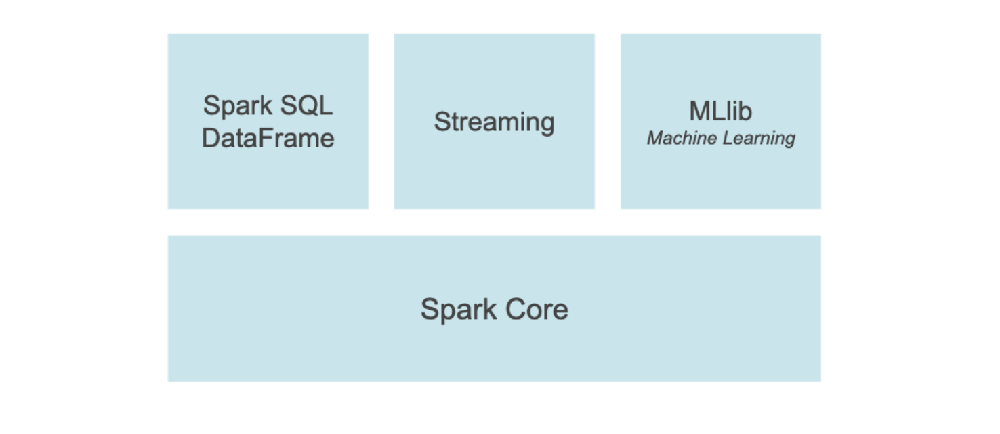

# Spark SQL and DataFrame

* structured data processing
* programming abstraction--DataFrame
* distributed SQL query engine

# pandas API on Spark

* pandas
* spark

# Streaming

* on top Spark
* interactive and analytical applications across both streaming and historical data

# MLlib

* scalable machine learning library

# Spark Core

* underlying general execution engine
* RDD(Resilient Distributed Dataset)
* in-memory computing capabilities