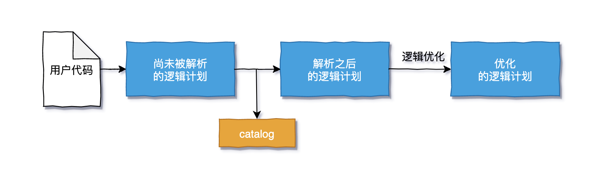
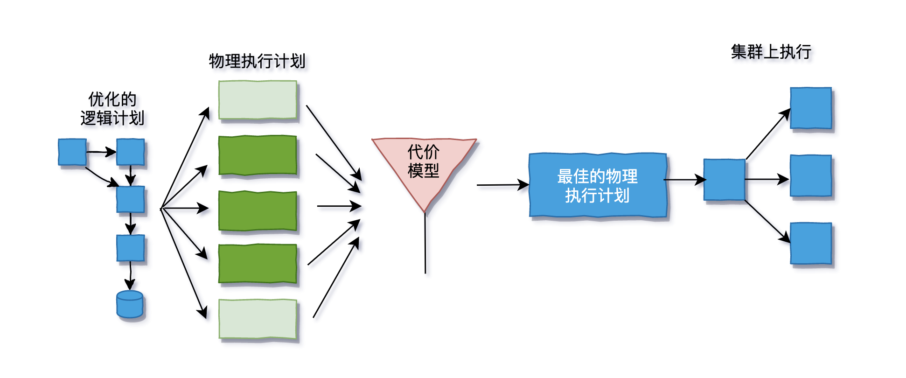

<style>
details {
    border: 1px solid #aaa;
    border-radius: 4px;
    padding: .5em .5em 0;
}
summary {
    font-weight: bold;
    margin: -.5em -.5em 0;
    padding: .5em;
}
details[open] {
    padding: .5em;
}
details[open] summary {
    border-bottom: 1px solid #aaa;
    margin-bottom: .5em;
}
</style>

<details><summary>目录</summary><p>

- [Spark Structured API](#spark-structured-api)
  - [Dataset 和 DataFrame](#dataset-和-dataframe)
  - [Schema](#schema)
  - [Structured Spark Types](#structured-spark-types)
    - [DataFrame 与 Dataset 的比较](#dataframe-与-dataset-的比较)
    - [列](#列)
    - [行](#行)
    - [Spark 类型](#spark-类型)
  - [Structured API Execution](#structured-api-execution)
    - [Logical Planning](#logical-planning)
    - [Physical Planning](#physical-planning)
    - [Execution](#execution)
- [DataFrame](#dataframe)
  - [Schemas](#schemas)
  - [Columns 和 Expressions](#columns-和-expressions)
    - [Columns](#columns)
    - [Expressions](#expressions)
  - [Records 和 Rows](#records-和-rows)
    - [创建 Rows](#创建-rows)
  - [DataFrame transformations](#dataframe-transformations)
    - [Create DataFrame](#create-dataframe)
    - [select \& selectExpr](#select--selectexpr)
      - [方法 .select()](#方法-select)
      - [方法 .selectExpr()](#方法-selectexpr)
    - [Spark Literals](#spark-literals)
    - [Add \& Rename Columns](#add--rename-columns)
    - [转义字符和关键字](#转义字符和关键字)
    - [Spark 默认大小写不敏感](#spark-默认大小写不敏感)
    - [Drop Columns](#drop-columns)
    - [Change Columns type](#change-columns-type)
    - [Filter Columns](#filter-columns)
    - [Distinct Rows](#distinct-rows)
    - [Random Sample Rows](#random-sample-rows)
    - [随机分割](#随机分割)
    - [拼接(Concatenating)和追加(Appending)行](#拼接concatenating和追加appending行)
    - [行排序](#行排序)
    - [Limit](#limit)
    - [Repartiton(重新分区) and Coalesce(分区聚合)](#repartiton重新分区-and-coalesce分区聚合)
    - [Collecting Rows to the Driver](#collecting-rows-to-the-driver)
    - [Converting Spark Types](#converting-spark-types)
    - [Boolean](#boolean)
    - [Number](#number)
    - [String](#string)
    - [Date and Timestamp](#date-and-timestamp)
    - [Null Data](#null-data)
      - [Coalesce](#coalesce)
      - [ifnull, nullif, nvl, nvl2](#ifnull-nullif-nvl-nvl2)
      - [drop](#drop)
      - [fill](#fill)
      - [replace](#replace)
    - [Ordering](#ordering)
    - [复杂类型 Complex Types](#复杂类型-complex-types)
      - [Struct](#struct)
      - [Array](#array)
      - [Maps](#maps)
    - [Json](#json)
    - [用户自定义函数 User-Defined Functions(UDF)](#用户自定义函数-user-defined-functionsudf)
    - [Aggregations](#aggregations)
      - [Aggregation Functions](#aggregation-functions)
      - [Grouping](#grouping)
      - [Window Functions](#window-functions)
      - [Grouping Set](#grouping-set)
        - [Rollups](#rollups)
        - [Cube](#cube)
        - [Grouping Metadata](#grouping-metadata)
        - [Pivot](#pivot)
      - [UDF Aggregation Functions](#udf-aggregation-functions)
    - [Joins](#joins)
      - [Inner join](#inner-join)
      - [Outer join](#outer-join)
      - [Left Outer join](#left-outer-join)
      - [Right Outer join](#right-outer-join)
      - [Left Semi join](#left-semi-join)
      - [Left Anti join](#left-anti-join)
      - [Natural join](#natural-join)
      - [Cross join](#cross-join)
</p></details><p></p>

Spark 结构化 API 是处理各种数据类型的工具, 可处理非结构化的日志文件、半结构化的 CSV 文件, 
以及高度结构化的 Parquet 文件。

Spark 结构化 API 指以下三种核心分布式集合类型的 API:

- Dataset
- DataFrame
- SQL Table 和 View

大多数结构化 API 均适用于批处理和流处理, 这意味着使用结构化 API 编写代码时, 
几乎不费吹灰之力就可以从批处理程序转换为流处理程序, 反之亦然.

# Spark Structured API

- Spark is a **distributed programming model** in which the user specifies `transformations`.
    - Multiple `transformations` build up a **directed acyclic graph** of instructions.
    - An `action` begins the process of executing that graph of instructions, as a single **job**, 
     by breaking it down into **stages** and **tasks** to execute across the **cluster**.
- The logical structures that we manipulate with `transformations` and `actions` are `DataFrame` and `Datasets`.
    - To create a new DataFrame and Dataset, you call a `transformation`.
    - To start computation(cluster computation) or convert to native language types(spark types), you call an `action`.

## Dataset 和 DataFrame

Spark 支持两种结构化集合类型: Dataset 和 DataFrame.

DataFrames and Datasets are distributed table-like with well-defined rows and columns.

- Each column must have the same number of rows as all the other columns(可以用 `null` 来指定缺失值);
- Each column has type information that must be consistent for every row in the collection;

DataFrame and Datasets represent **immutable**, **lazily evaluated plans** that specify what operations 
to apply to data residing at a location to generate some output. When we perform an action on a DataFrame, 
we instruct Spark to perform the actual transformations and return the result.

## Schema

 - A schema defines the column names and types of a DataFrame, define schemas:
    - manually      
    - read a schema from a data source(schema on read)

## Structured Spark Types

- Spark is effectively a **programming language** of its own.
- Spark uses an engine called **Catalyst** that maintains its own
  type information through the planning and processing of work. This
  open up a wide variety of execution optimizations that make
  significant differences.
- Even if we use Spark's Structured APIs from Python or R, the
  majority of our manipulations will operate strictly on **Spark types**, not Python or R types.

### DataFrame 与 Dataset 的比较

Spark 结构化 API 包含两类 API, 即非类型化的 DataFrame 和非类型化的 Dataset

- DataFrame 是无类型的是因为它们其实是有类型的, 只是 Spark 完全负责维护它们的类型, 
  仅在运行时检查这些类型是否与 schema 中指定的类型一致.
- Dataset 在编译时就会检查类型是否符合规范, 
  Dataset 仅适用于基于 Java 虚拟机(JVM) 的语言(比如 Scala 和 Java), 
  并通过 case 类或 Java beans 指定类型.

在 Scala 版本中的 Spark 中, DataFrame 就是一些 Row 类型的 Dataset 的集合。
Row 类型是 Spark 用于支持内存计算而优化的数据格式。这种格式有利于高效计算。
因为它避免使用会带来昂贵垃圾回收开销和对象实例化开销的 JVM 类型, 
而是基于自己的内部格式运行, 所以不会产生这种开销.

Python 版本和 R 语言版本的 Spark 并不支持 Dataset, 
所有东西都是 DataFrame, 这样就可以使用这种优化的数据格式进行计算处理.

### 列

Spark 的列表示一个简单类型, 或者一个复杂类型, 或者空值 `null`. 
Spark 记录所有这些类型的信息并提供多种转换方法.

简单来说, 可以将 Spark 列想象为一个数据表的列即可.

### 行

Spark 的一行对应一个数据记录. DataFrame 中的每条记录都必须是 `Row` 类型, 
可以通过 SQL 手动创建、从 RDD 提取、从数据源手动创建一个行.

```scala
// in Scala
spark.range(2).toDF().collect()
```

```python
# in Python
spark.range(2).collect()
```

### Spark 类型

**实例化或声明一个特定类型的列:**

- Scala version:

```scala
// in Scala
import org.apache.spark.sql.types._
val a = ByteType
```

**实例化或声明一个特定类型的列:**

- Java version:

```java

// in Java
import org.apache.spark.sql.types.DataTypes;
ByteType a = DataTypes.ByteType;
```

**实例化或声明一个特定类型的列:**

- Python version:

```python
# in Python
from pyspark.sql.types import *
a = ByteType()
```

**Spark Internal Types:**

- Python 类型参考表:

**Spark Internal Types:**

- Scala 类型参考表:

| Spark数据类型          | Scala数据类型           | 创建数据类型实例的API    |
|-----------------------|-----------------------|-----------------------|
| ByteType              | Byte                  | ByteType              |
| ShortType             | Short                 | ShortType             |
| IntegerType           | Int                   | IntegerType           |
| LongType              | Long                  | LongType              |
| FloatType             | Float                 | FloatType             |
| DoubleType            | Double                | DoubleType            |
| DecimalType           | java.math.BitgDecimal | DecimalType           |
| StringType            | String                | StringType            |
| BinaryType            | Array[Byte]           | BinaryType            |
| BooleanType           | Boolean               | BooleanType           |
| TimestampType         | java.sql.Timestamp    | TimestampType         |
| DateType              | java.sql.Date         | DateType              |
| ArrayType             | scala.collection.Seq  | ArrayType(elementType, [containsNull = true]) |
| MapType               | scala.collection.Map  | MapType(keyType,      |
|                       |                       | valueType,            |
|                       |                       | [valueContainsNull =  |
|                       |                       | true])                |
| StructType            | org.apache.spark.sql.Row | StructType(field)     |
| StructField           | Int for a StructField | StructField(name,     |
|                       | with the data type    | dataType, [nullable = |
|                       | IntegerType,...       | true])                |


## Structured API Execution

How code is actually executed across a cluster ?

- 1.Write DataFrame/Dataset/SQL Code;
- 2.If vaild code, Spark converts Code to a **Logistic Plan**;
- 3.Spark transforms this **Logistic Plan** to **Physical Plan**, checking for optimizations along the way;
- 4.Spark then executes this **Physical Plan** (RDD manipulations) on the cluster;

To execute code, must write code. This code is then submitted to Spark
either through the `console` or via a `submitted job`. This code the passes
through the **Catalyst Optimizer**, which decides how the code should be
executed and lays out a plan for doing so before, finally, the code is
run and the result is returned to the user.


### Logical Planning

Spark 结构化 API 执行的第一阶段是获取用户代码, 并将其转换为逻辑计划.

- 转换后的逻辑计划仅代表一组抽象转换, 并不涉及驱动器和执行器, 它只是将用户的表达式集合转换为最优的版本。
    它通过将用户代码转换为未解析的逻辑计划来实现这一点.
- 从用户代码转换来的逻辑计划并没有被解析, 因为虽然用户的代码可能是有效的, 
    但它引用的表可能不存在. Spark 使用 `catalog` (所有表和 DataFrame 信息的存储库) 在分析器中解析列和表格. 
    如果目录中不存在所需的表格或列名称, 分析器可能会拒绝该未解析的逻辑计划.
- 如果分析器可以解析它, 结果将通过 `Catalyst 优化器` 尝试通过下推谓词或选择操作来优化逻辑计划. 
    用户也可以扩展 Catalyst 优化器来支持自己的特定领域优化策略.



### Physical Planning

在成功创建 `优化的逻辑计划` 后, Spark 开始 `执行物理计划流程`。
物理计划（通常称为 Spark 计划）通过生成不同的物理执行策略, 
并通过 `代价模型` 进行比较分析, 从而指定如何在集群上执行逻辑计划. 
  
- 例如:执行一个连接操作就会涉及代价比较, 它通过分析数据表的物理属性(表的大小或分区的大小), 
   对不同的物理执行策略进行代价比较, 选择合适的物理执行计划.
- 物理执行计划产生一系列的 RDD 和转换操作, 这就是 Spark 被称为编译器的原因, 
   因为它将对 DataFrame、Dataset 和 SQL 中的查询操作为用户编译一系列 RDD 的转换操作.



### Execution

在选择一个物理计划时, Spark 将所有代码运行在 Spark 的底层编程接口 RDD 上. Spark 在运行时进一步优化, 
生成可以在执行期间优化任务或阶段的本地 Java 字节码, 最终将结果返回给用户.

# DataFrame

A DataFrame consists of a series of **records** (like row in a table), that are of type `Row`, 
and a number of **columns** (like columns in a spreadsheet) that represent a computation expression 
that can be preformed on each individual record in the Dataset.

- Schema 定义了 DataFrame 中每一列数据的名字和数据类型.
- DataFrame Partitioning 定义了 DataFrame 和 Dataset 在集群上的物理分布结构.
- Partitioning schema 定义了 partition 的分配方式, 可以自定义分区, 也可以采取随机分配方式.
- DataFrame operations:
    - 聚合(aggregation)
    - 窗口函数(window function)
    - 连接(join)

**示例:**

```scala
// in Scala
val df = spark
   .read
   .format("josn")
   .load("/data/flight-data/json/2015-summary.json")

// 查看DataFrame的schema
df.printSchema()
```

```python

# in Python
df = spark \ 
   .read \
   .format("json") \
   .load("/data/flight-data/json/2015-summary.json")

# 查看DataFrame的schema
df.printSchema()
```


## Schemas

- Schema 定义了 DataFrame 中每一列数据的 `名字` 和 `类型`
- 为 DataFrame 设置 Schema 有两种方式:
    - 使用数据源已有的 Schema (schema-on-read, 读时模式)
    - 使用 `StructType`, `StructField` 自定义 DataFrame 的 Schema
- 一个 Schema 是由许多字段(field)构成的 `StructType`, 这些字段即为 `StructField`, 
    具有名称、类型、布尔标志(该标志指定该列是否可以包含缺失值或空值), 
    并且用户可指定与该列关联的元数据(metadata). 
    元数据存储着有关此列的信息(Spark 在 MLlib 库中使用此功能).
    - 如果程序在运行时, DataFrame 中 column 的 type 没有与预先设定的 Schema 相匹配, Spark 就会抛出错误

(1)使用数据源已有的 Schema (schema-on-read)

```scala
// in Scala
spark.read.format("json")
    .load("/data/flight-data/json/2015-summary.json")
    .schema
```

```python

# in Python
spark.read.format("json") \
    .load("/data/flight-data/json/2015-summary.json")
    .schema
```

(2)使用 `StructType`, `StructField` 自定义 DataFrame 的 Schema

```scala
// in Scala
import org.apache.spark.sql.types.{StructField, StructType, StringType, LongType}
import org.apache.spark.sql.types.Metadata

val myManualSchema = StructType(Array(
    StructField("DEST_COUNTRY_NAME", StringType, true),
    StructField("ORIGIN_COUNTRY_NAME", StringType, true),
    StructField("COUNT", LongType, false, Metadata.fromJson("{\"hello\": \"world\"}"))
))

val df = spark.read.format("json")
    .schema(myManualSchema)
    .load("/data/flight-data/json/2015-summary.json")
```

```python
# in Python
from pyspark.sql.types import StructType, StructField, StringType, LongType

myManualSchema = StructType([
    StructField("DEST_COUNTRY_NAME", StringType(), True),
    StructField("ORIGIN_COUNTRY_NAME", StringType(), True),
    StructField("COUNT", LongType(), False, metadata = {"hello":"world"})
])

df = spark.read.format("json") \
    .schema(myManualSchema) \
    .load("/data/flight-data/json/2015-summary.json")
```

## Columns 和 Expressions

- Spark 中的 `columns` 就像 spreadsheet, R dataframe, Pandas DataFrame 中的列一样, 
  可以对 Spark 中的 `columns` 进行 **选择, 操作, 删除** 等操作, 这些操作表现为 `expression` 的形式
- 在 Spark 中来操作 `column` 中的内容必须通过 Spark DataFrame 的 transformation 进行

### Columns

- 有很多种方法来创建和引用 DataFrame 中的 column:
    - 函数(function):
        - `col()`
        - `column()`
    - 符号(Scala独有的功能, 无性能优化):
        - `$"myColumn"`
        - `'myColumn`
    - DataFrame 的方法(explicit column references):
        - `df.col("myColumn")`

```scala
// in Scala
import org.apache.spark.sql.function.{col, column}

col("someColumnName")
column("someColumnName")
$"someColumnName"
'someColumnName
df.col("someColumnName")
```

```python
# in Python
from pyspark.sql.function import col, column

col("someColumnName")
column("someColumnName")
df.col("someColumnName")
```

### Expressions 

- Columns are expressions；
- An expression is a set of transformations on one or more values in a records in a DataFrame；
- 通过函数创建的 expression: `expr()` , 仅仅是对 DataFrame 的 columns 的 reference
    - `expr("someCol")` 等价于 `col("someCol")`
    - `col()` 对 columns 进行 transformation 操作时, 必须作用在 columns 的引用上
    - `expr()` 会将一个 string 解析为 transformations 和 columns references, 并且能够继续传递给 transformations
- Columns are just expressions;
- Columns and transformations of those columns compile to the same logical plan as parsed expression;

**Column as Expression:**

```scala
// 下面的3个表达式是等价的 transformation
// Spark 会将上面的三个 transformation 解析为相同的逻辑树(logical tree)来表达操作的顺序；

import org.apache.spark.sql.functions.expr

expr("someCol - 5")
col("someCol") - 5
expr("someCol") - 5
```

```scala
// in Scala
import org.apache.spark.sql.functions.expr

expr("(((someCol + 5) * 200) - 6) < otherCol")
```

```python
from pyspark.sql.functions import expr

expr("(((someCol + 5) * 200) - 6) < otherCol")
```

**查看 DataFrame 的 Columns:**

```scala
spark.read.format("json")
   .load("/data/flight-data/json/2015-summary.json")
   .columns
```

## Records 和 Rows

- 在 Spark 中, DataFrame 中的每一个 row 都是一个 record； 
  Spark 使用一个 `Row` 类型的对象表示一个 record; 
  Spark 使用 column expression 来操作类型为 `Row` 的对象
- `Row` 类型的对象在 Spark内部表现为\ **字节数组(array of bytes)**

查看 DataFrame 的第一行:

```scala
df.first()
```

### 创建 Rows

- 通过实例化一个 Row 对象创建；
- 通过实例化手动创建的 Row 必须与 DataFrame 的 Schema 中定义的列的内容的顺序一致, 
  因为只有 DataFrame 有 Schema, 而 Row 是没有 Schema的；

```scala
// in Scala
import org.apache.spark.sql.Row
val myRow = Row("Hello", null, 1, false)

// 在 Scala 中通过索引获得 Row 中的值, 但必须通过其他的帮助函数强制转换 Row 中的数据的类型才能得到正确的值的类型
myRow(0)                      // type Any
myRow(0).asInstanceOf[String] // String
myRow.getString(0)            // String
myRow.getInt(2)               // Int
```

```python
# in Python
from pyspark.sql import Row
myRow = Row("Hello", null, 1, False)

# 在 Python 中通过索引获得 Row 中的值, 但不需要强制转换
myRow[0]
myRow[1]
myRow[2]
```

## DataFrame transformations

DataFrame 上可以通过 `transformation` 进行的操作:

- 增:add rows or columns
- 删:remove rows or columns
- 行转列:transform rows into column(or vice versa)
- 排序:change the order of rows based on the values in columns

DataFrame transformation 方法和函数:

- `select` method
    - working with "columns or expressions"
- `selectExpr` method
    - working with "expressions in string"
- Package: `org.apache.spark.sql.functions`

### Create DataFrame

- 从原始数据源创建 DataFrame；
    - 将创建的 DataFrame 转换为一个临时视图, 使得可以在临时视图上进行SQL转换操作；
- 手动创建一个行的集合并, 将这个集合转换为 DataFrame；

**1.从原始数据源创建 DataFrame:**

```scala
// in Scala
val df = spark
    .read
    .format("json")
    .load("/data/flight-data/json/2015-summary.json")

df.createOrReplaceTempView("dfTable")
```

```python
# in Python
df = spark \
    .read \
    .format("json") \
    .load("/data/flight-data/json/2015-summary.json")

df.createOrReplaceTempView("dfTable")
```

**2.通过 Row 的集合创建 DataFrame:**

```scala
// in Scala
import org.apache.spark.sql.Row
import org.apache.spark.sql.types.{StructType, StructField, StringType, LongType}

// Schema
val myManualSchema = new StructType(Array(
    new StructField("DEST_COUNTRY_NAME", StringType, true),
    new StructField("ORIGIN_COUNTRY_NAME", StringType, true),
    new StructField("COUNT", LongType, false)
))

// Row
val myRows = Seq(Row("Hello", null, 1L))
// RDD
val myRDD = spark.sparkContext.parallelize(myRows)
// DataFrame
val myDf = spark.createDataFrame(myRDD, myManualSchema)

myDF.show()
```

```python
# in Python
from pyspark.sql import Row
from pyspark.sql.types import StructType, StructField, StringType, LongType

# Schema
myManualSchema = StructType([
    StructField("DEST_COUNTRY_NAME", StringType(), True),
    StructField("ORIGIN_COUNTRY_NAME", StringType(), True),
    StructField("COUNT", LongType(), False)
])

# Row
myRows = Row("Hello", None, 1)
# DataFrame
myDf = spark.createDataFrame([myRows], myManualSchema)

myDf.show()
```


### select & selectExpr

- `.select()` 和 `.selectExpr()` 支持在 DataFrame 上执行类似数据表的 SQL 查询同样的操作
    - `.select()`:处理列或表达式
    - `.selectExpr()`:处理字符串表达式
    - `org.apache.spark.sql.function` 提供了一组函数方法来处理不是针对列的操作

#### 方法 .select()

- `expr` 是最灵活的列引用方式, 它能够引用一列, 也可以引用对列进行草丛的字符串表达式.

```scala
// in Scala
import org.apache.spark.sql.functions.{expr, col, column}

df.select("DEST_COUNTRY_NAME")
   .show(2)

df.select("DEST_COUNTRY_NAME", "ORIGIN_COUNTRY_NAME")
   .show(2)


// different ways to refer to columns
df.select(
   df.col("DEST_COUNTRY_NAME"),
   col("DEST_COUNTRY_NAME"),
   column("DEST_COUNTRY_NAME"),
   'DEST_COUNTRY_NAME,
   $"DEST_COUNTRY_NAME",
   expr("DEST_COUNTRY_NAME"))
.show(2)

// Rename column
df.select(expr("DEST_COUNTRY_NAME AS destination"))
   .show(2)

df.select(expr("DEST_COUNTRY_NAME AS destination").alias("DEST_COUNTRY_NAME"))
   .show(2)
```

```python
# in Python
from pyspark.sql.functions import epxr, col, column

df.select("DEST_COUNTRY_NAME") \
   .show(2)

df.select("DEST_COUNTRY_NAME", "ORIGIN_COUNTRY_NAME") \
   .show(2)

# different ways to refer to columns
df.select(
   expr("DEST_COUNTRY_NAME"),
   col("DEST_COUNTRY_NAME"),
   column("DEST_COUNTRY_NAME")) \
   .show()

# Rename column
df.select(expr("DEST_COUNTRY_NAME AS destination")) \
   .show(2)

df.select(expr("DEST_COUNTRY_NAME AS destination").alias("DEST_COUNTRY_NAME")) \
      .show(2)
```

```sql
-- in SQL
SELECT 
   DEST_COUNTRY_NAME
FROM dfTable
LIMIT 2

SELECT 
   DEST_COUNTRY_NAME,
   ORIGIN_COUNTRY_NAME
FROM dfTable
LIMIT 2


-- Rename column 
SELECT 
   DEST_COUNTRY_NAME AS destination
FROM dfTable
LIMIT 2
```


#### 方法 .selectExpr()

- 因为 `select` 后跟着一系列的 `expr` 是非常常见的写法, 
  所以 Spark 有一个有效的描述此操作序列的接口: `selectExpr`, 
  他可能是引用列最常用的接口.
    - 可以利用 `selectExpr` 构建复杂表达式来创建 DataFrame, 实际上, 可以添加任何不包含聚合操作的有效 SQL 语句, 并且只要列可以解析, 它就是有效的.


```scala
// in Scala
df.selectExpr(
  "DEST_COUNTRY_NAME AS newColumnName", 
  "DEST_COUNTRY_NAME")
  .show()

df.selectExpr(
   "*",
   "(DEST_COUNTRY_NAME = ORIGIN_COUNTRY_NAME) AS withinCountry")
 .show(2)

df.selectExpr(
   "avg(count)", 
   "count(distinct(DEST_COUNTRY_NAME))")
 .show()
```

```python
# in Python
df.selectExpr(
  "DEST_COUNTRY_NAME AS newColumnName", 
  "DEST_COUNTRY_NAME") \
 .show()

df.selectExpr(
   "*",
   "(DEST_COUNTRY_NAME = ORIGIN_COUNTRY_NAME) AS withinCountry") \
 .show(2)

df.selectExpr(
  "avg(count)", 
  "count(distinct(DEST_COUNTRY_NAME))") \
 .show(2)
```

```sql
-- in SQL
SELECT 
   DEST_COUNTRY_NAME AS newColumnName,
   DEST_COUNTRY_NAME
FROM dfTable
LIMIT 2

SELECT 
   *,
   (DEST_COUNTRY_NAME = ORIGIN_COUNTRY_NAME) AS withinCountry
FROM dfTable
LIMIT 2

SELECT 
   AVG(count),
   COUNT(DISTINCT(DEST_COUNTRY_NAME))
FROM dfTable
```

### Spark Literals

- 有时候需要给 Spark 传递显式的值, 它们只是一个值而非新列, 这可能是一个常量值, 
  或用来需要比较的值. 通过字面量(literal)传递, 
  简单的来说就是将给定的编程于春燕的字面上的值转换操作为 Spark 可以理解的值.
    - 字面量就是表达式, 可以用操作表达式的方式来使用它们.

```scala
// in Scala
import org.apache.spark.sql.functions.{expr, lit}

df.select(
  expr("*"), 
  lit(1).as(One))
  .show(2)
```

```python
# in Python
from pyspark.sql.functions import expr, lit

df.select(
  expr("*"), 
  lit(1).alias("One")) \
  .show(2)
```

```sql
-- in SQL
SELECT 
   *, 
   1 AS One
FROM dfTable
LIMIT 2
```


### Add & Rename Columns

- `.withColumn(colunm_alias_name, 为给定行赋值的表达式)`
- `.withColumnRenamed(column, column_alias_name)`

```scala
// in Scala
import org.apache.spark.sql.functions.expr

df.withColumn("numberOne", lit(1)).show(2)

df.withColumn("withinCountry", expr("DEST_COUNTRY_NAME = ORIGIN_COUNTRY_NAME"))
 show(2)

// rename column
df.withColumn("destination", expr("DEST_COUNTRY_NAME"))
 .show(2)

df.withColumnRenamed("DEST_COUNTRY_NAME", "dest")
 .show(2)
```

```python
# in Python
from pyspark.sql.functions import expr

df.withColumn("numberOne", lit(1)) \
 .show(2)

df.withColumn("withinCountry", expr("DEST_COUNTRY_NAME = ORIGIN_COUNTRY_NAME")) \
 .show(2)

# rename column
df.withColumn("destination", expr("DEST_COUNTRY_NAME")) \
 .show(2)

df.withColumnRenamed("DEST_COUNTRY_NAME", "dest") \
 .show(2)
```

```sql
-- in SQL
SELECT 
  1 as numberOne
FROM dfTable
LIMIT 2

SELECT 
  (DEST_COUNTRY_NAME = ORIGIN_COUNTRY_NAME) as withinCountry
FROM dfTable
LIMIT 2

SELECT
  DEST_COUNTRY_NAME as destination
FROM dfTable
LIMIT 2

SELECT
  DEST_COUNTRY_NAME as dest
FROM dfTable
LIMIT 2
```

### 转义字符和关键字

- 在列名中可能遇到包含空格或者连字符等保留字符, 要处理这些保留字符一位置要适当地对列名进行转义.
- 在 Spark 中, 通过使用 `反引号(`)` 字符来实现转义.

```scala
// in Scala
import org.apache.spark.sql.functions.expr

// rename column "ORIGIN_COUNTRY_NAME"
val dfWithLongColName = df.withColumn("This Long Column-Name", expr("ORIGIN_COUNTRY_NAME"))


dfWithLongColName.selectExpr(
   "`This Long Column-Name`",
   "`This Long Column-Name` as `new col`")
   .show()

dfWithLongColName.select(expr("`This Long Column-Name`"))
   .columns

dfWithLongColName.select(col("This Long Column-Name"))
   .columns
```


```python
# in Python
from pyspark.sql.functions import expr

# rename column "ORIGIN_COUNTRY_NAME"
dfWithLongColName = df.withColumn(
   "This Long Column-Name",
   expr("ORIGIN_COUNTRY_NAME"))

dfWithLongColName.selectExpr(
   "`This Long Column-Name`",
   "`This Long Column-Name` as `new col`") \
   .show(2)

dfWithLongColName.select(expr("`This Long Column-Name`")) \
   .columns

dfWithLongColName.select(col("This Long Column-Name")) \
   .columns
```

```sql
SELECT 
   `This Long Column-Name`,
   `This Long Column-Name` AS `new col`
FROM dfTableLong
LIMIT 2
```

### Spark 默认大小写不敏感

Spark 默认是大小写不敏感的, 即不区分大小写, 可以通过下面的配置使 Spark 区分大小写:

```sql
-- in SQL
set spark.sql.caseSensitive true
```


### Drop Columns

- `.select()`；
- `.drop()`；

```scala
// in Scala
df.drop("ORIGIN_COUNTRY_NAME")
  .columns

dfWithLongColName.drop("ORIGIN_COUNTRY_NAME", "DEST_COUNTRY_NAME")
```

```python
# in Python
df.drop("ORIGIN_COUNTRY_NAME") \
 .columns

dfWithLongColName.drop("ORIGIN_COUNTRY_NAME", "DEST_COUNTRY_NAME")
```

### Change Columns type

- `.cast()`: 强制类型转换

```scala
// in Scala
df.withColumn("count2", col("count").cast("long"))
```

```python
# in Python
df.withColumn("count2", col("count").cast("long"))
```

```sql
-- in SQL
SELECT 
   *,
   CAST(count as long) AS count2
FROM dfTable
```

### Filter Columns

- 为了过滤行, 只要创建一个表达式来判断该表达式是 true 还是 false, 然后过滤使表达式为 false 的行.
    - 我们可能本能地想把多个过滤条件放到一个表达式中, 尽管这种方法可行, 但是并不是总是有效的, 
      因为 Spark 会同时执行所有的过滤操作, 不管过滤条件的先后顺序, 因此当你想指定多个 `AND` 过滤操作时, 
      只要按照先后顺序以链式的方式把这些过滤条件串联起来, 然后让 Spark 执行剩下的工作即可.
    - Spark 的过滤行操作有两个：
        - `where`
        - `filter`

```scala
// in Scala
df.filter(col("count") < 2)
   .show(2)

df.where("count" < 2)
   .show(2)

df.filter(col("count") < 2)
   .filter(col("ORIGIN_COUNTRY_NAME") =!= "Croatia")
   .show(2)
```

```python
# in Python
df.filter(col("count") < 2) \
 .show(2)

df.where("count" < 2) \
 .show(2)

df.filter(col("count") < 2) \
 .filter(col("ORIGIN_COUNTRY_NAME") =!= "Croatia") \
 .show(2)
```

```sql
-- in SQL
SELECT 
   *
FROM dfTable
WHERE count < 2
LIMIT 2

SELECT 
   *
FROM dfTable
WHERE count < 2 AND ORIGIN_COUNTRY_NAME != 'Croatia'
LIMIT 2
```

### Distinct Rows

```scala
// in Scala
df.select("ORIGIN_COUNTRY_NAME", "DEST_COUNTRY_NAME")
   .distinct()
   .count()
```

```python
# in Python
df.select("ORIGIN_COUNTRY_NAME", "DEST_COUNTRY_NAME") \
 .distinct() \
 .count()
```

```sql
-- in SQL
SELECT
   COUNT(DISTINCT(ORIGIN_COUNTRY_NAME, DEST_COUNTRY_NAME))
FROM dfTable
```

### Random Sample Rows

```scala
// in Scala
val seed = 5
val withReplacement = false
val fraction = 0.5
df.sample(withReplacement, fraction, seed)
 .count()
```

```python
# in Python
seed = 5
withReplacement = false
fraction = 0.5
df.sample(withReplacement, fraction, seed) \
   .count()
```

### 随机分割

```scala
val seed = 5
val dataFrames = df.randomSplit(Array(0.25, 0.75), seed)
dataFrames(0).count() > dataFrames(1).count()
```

```python
# in Python
seed = 5
dataFrames = df.randomSplit([0.25, 0.75], seed)
dataFrames[0].count() > dataFrames[1].count()
```

### 拼接(Concatenating)和追加(Appending)行

- 由于 DataFrame 是不可变的(immutable), 因此不能将数据 append 到
  DataFrame 的后面, append 会改变 DataFrame；
    - 对于两个需要 Union 的 DataFrame, 需要具有相同的 Schema 和相同数量的 Column, 否则就会失败；

```scala
// in Scala
import org.apache.spark.sql.Row

val schema = df.schema
val newRows = Seq(
   Row("New Country", "Other Country", 5L),
   Row("New Country 2", "Other Country 3", 1L)
)
val parallelizedRows = spark.sparkContext.parallelize(newRows)
val newDF = spark.createDataFrame(parallelizedRows, schema)

df.union(newDF)
   .where("count = 1")
   .where($"ORIGIN_COUNTRY_NAME" =!= "United States")
   .show()
```

```python
# in Python
from pyspark.sql import Row

schema = df.schema
newRow = [
   Row("New Country", "Other Country", 5L),
   Row("New Country 2", "Other Country 3", 1L)
]
parallelizedRow = spark.sparkContext.parallelize(newRows)
newDF = spark.createDataFrame(parallelizedRows, schema)

df.union(newDF) \
 .where("count = 1") \
 .where(col("ORIGIN_COUNTRY_NAME") != "United States") \
 .show()
```

### 行排序

```scala
// in Scala
import org.apache.spark.sql.functions.{col, desc, asc}

df.sort("count").show(5)
df.orderBy("count", "DEST_COUNTRY_NAME").show(5)
df.orderBy(col("count"), col("DEST_COUNTRY_NAME")).show(5)
df.orderBy(expr("count desc"), expr("DESC_COUNTRY_NAME asc")).show(2)
df.orderBy(desc("count"), asc("DESC_COUNTRY_NAME")).show(2)
df.orderBy(
   asc_nulls_first("count"), 
   desc_nulls_first("count"),
   asc_nulls_last("count"),
   desc_nulls_last("count")
)
```

```python
# in Python
from pyspark.sql.functions import col, desc, asc
df.sort("count").show(5)
df.orderBy("count", "DEST_COUNTRY_NAME").show(5)
df.orderBy(col("count"), col("DEST_COUNTRY_NAME")).show(5)
df.orderBy(expr("count desc")).show(2)
df.orderBy(col("count").desc(), col("DESC_COUNTRY_NAME").asc()).show(2)
```

```sql
SELECT *
FROM dfTable
ORDER BY count DESC, DEST_COUNTRY_NAME ASC 
LIMIT 2
```

为了优化的目的, 建议对每个分区的数据在进行 transformations 之前进行排序:

```scala
// in Scala
spark.read.format("json")
   .load("/data/flight-data/json"*-summary.json)
   .sortWithPartitions("count")
```

```python
# in Python
spark.read.format("json")
   .load("/data/flight-data/json"*-summary.json)
   .sortWithPartitions("count")
```


### Limit

```scala
// in Scala
df.limit(5).show()
```

```python
# in Python
df.limit(5).show()
```

```sql
-- in SQL
SELECT *
FROM dfTable
LIMIT 6
```


### Repartiton(重新分区) and Coalesce(分区聚合)

- 为了优化的目的, 可以根据一些常用来进行筛选(filter)操作的 column 进行进行分区；
- Repartition 会对数据进行全部洗牌, 来对数据进行重新分区(未来的分区数 >= 当前分区数)；
- Coalesce 不会对数据进行全部洗牌操作, 会对数据分区进行聚合；

```scala
// in Scala
import org.apache.spark.sql.functions.col
df.rdd.getNumPartitions

df.repartition(5)
df.repartition(col("DEST_COUNTRY_NAME"))
df.repartition(5, col("DEST_COUNTRY_NAME"))

df.repartition(5, col(DEST_COUNTRY_NAME)).coalesce(2)
```

```python
# in Python
from pyspark.sql.functions import col
df.rdd.getNumPartitions()

df.repartition(5)
df.repartition(col("DEST_COUNTRY_NAME"))
df.repartition(5, col("DEST_COUNTRY_NAME"))

df.repartition(5, col(DEST_COUNTRY_NAME)).coalesce(2)
```

### Collecting Rows to the Driver

- Spark 在驱动程序(driver)上维持集群的状态；
- 方法:
    - `.collect()`
        - get all data from the entire DataFrame
    - `.take(N)`
        - select the first N rows
    - `.show(N, true)`
        - print out a number of rows nicely
    - `.toLocalIterator()`
        - collect partitions to the dirver as an iterator

```scala
// in Scala
val collectDF = df.limit(10)

collectDF.take(5) // take works with on Integer count

collectDF.show()  // print out nicely
collectDf.show(5, false)

collectDF.collect()
```

```python
# in Python
collectDF = df.limit(10)

collectDF.take(5) // take works with on Integer count

collectDF.show()  // print out nicely
collectDf.show(5, false)

collectDF.collect()
```

### Converting Spark Types

- Convert native types to Spark types；

- `org.apache.spark.sql.functions.lit`

**读取数据, 创建 DataFrame:**

```scala
// in Scala
val df = spark.read.format("csv")
   .option("header", "true")
   .option("inferSchema", "ture")
   .load("/data/retail-data/by-day/2010-12-01.csv")
df.printSchema()
df.createOrReplaceTempView("dfTable")
```

```python
# in Python
df = spark.read.format("csv") \
   .option("header", "true") \
   .option("inferSchema", "ture") \
   .load("/data/retail-data/by-day/2010-12-01.csv")
df.printSchema()
df.createOrReplaceTempView("dfTable")
```

**转换为 Spark 类型数据:**

```scala
// in Scala
import org.apache.spark.sql.functions.lit
df.select(lit(5), lit("five"), lit(5.0))
```

```python
# in Python
from pyspark.sql.functions import lit
df.select(lit(5), lit("five"), lit(5.0))
```

```sql
SELECT 5, "five", 5.0
```

### Boolean 

- Spark Boolean 语句:
    - `and`
    - `or`
    - `true`
    - `false`
- Spark 中的相等与不等:
    - `===`
        - `.equalTo()`
    - `=!=`
        - `not()`

**等于, 不等于:**

```scala
// in Scala
import org.apache.spark.sql.functions.col

// equalTo(), ===
df.where(col("InvoiceNo").equalTo(536365))
 .select("InvoiceNo", "Description")
 .show(5, false)

df.where(col("InvoiceNo") === 536365)
 .select("InvoiceNo", "Description")
 .show(5, false)


// not(), =!=
df.where(col("InvoiceNo").not(536365))
 .select("InvoiceNo", "Description")
 .show(5, false)

df.where(col("InvoiceNo") =!= 536365)
 .select("InvoiceNo", "Description")
 .show(5, false)


// specify the predicate as an expression in a string, =/<>
df.where("InvoiceNo = 536365")
 .show(5, false)

df.where("InvoiceNo <> 536365")
 .show(5, false)
```

```python
# in Python
from pyspark.sql.functions import col

# Spark: equalTo(), ===
df.where(col("InvoiceNo").equalTo(536365)) \
 .select("InvoiceNo", "Description") \
 .show(5, false)

df.where(col("InvoiceNo") === 536365) \
 .select("InvoiceNo", "Description") \
 .show(5, false)


# Spark: not(), =!=
df.where(col("InvoiceNo").not(536365)) \
 .select("InvoiceNo", "Description") \
 .show(5, false)

df.where(col("InvoiceNo") =!= 536365) \
 .select("InvoiceNo", "Description") \
 .show(5, false)

# python
df.where(col("InvoiceNo") != 536365) \
 .select("InvoiceNo", "Description") \
 .show(5, false)

# specify the predicate as an expression in a string, =/<>
df.where("InvoiceNo = 536365")
 .show(5, false)

df.where("InvoiceNo <> 536365")
 .show(5, false)
```

**and, or:**

```scala
// in Scala
val priceFilter = col("UnitPrice") > 600
val descripFilter = col("Description").contains("POSTAGE")
df.where(col("StockCode").isin("DOT"))
 .where(priceFilter.or(descripFilter))
 .show()
```

```python
# in Python

from pyspark.sql.functions import inst

priceFilter = col("UnitPrice") > 600
descripFilter = instr(df.Description, "POSTAGE") >= 1
df.where(df.StockCode.isin("DOT")) \
 .where(priceFilter | descripFilter) \
 .show()
```

```sql
-- in SQL
SELECT *
FROM 
   dfTable
WHERE 
   StockCode IN ("DOT") AND
   (UnitPrice > 600 OR instr(Description, "POSTAGE") >= 1)
```

**使用 Boolean column 筛选 DataFrame:**

```scala
// in Scala
val DOTCodeFilter = col("StockCode") == "DOT"
val priceFilter = col("UnitPrice") > 600
val descripFilter = col("Description").contains("POSTAGE")
df.withColumn("isExpensive", DOTCodeFilter.and(priceFilter.or(descripFilter)))
 .where("isExpensive")
 .select("unitPrice", "isExpensive")
 .show(5)
```

```python
# in Python
from pyspark.sql.functions import instr

DOTCodeFilter = col("StockCode") == "DOT"
priceFilter = col("UnitPrice") > 600
descripFilter = instr(col("Description"), "POSTAGE") >= 1
df.withColumn("isExpensive", DOTCodeFilter & (priceFilter | descripFilter)) \
 .where("isExpensive") \
 .select("unitPrice", "isExpensive") \
 .show(5)
```

```sql
-- in SQL
SELECT 
   UnitPrice
   ,(
       StockCode = "DOT" AND 
       (UnitPrice > 600 OR instr(Description, "POSTAGE") >= 1)
   ) AS isExpensive
FROM 
   dfTable
WHERE 
   (
       StockCode = "DOT" AND 
       (UnitPrice > 600 OR instr(Description, "POSTAGE") >= 1)
   )
```

**其他:**

```scala
// in Scala
import org.apache.spark.sql.functions.{expr, not, col}

df.withColumn("isExpensive", not(col("UnitPrice").len(250)))
 .filter("isExpensive")
 .select("Description", "UnitPrice")
 .show()

df.withColumn("isExpensive", expr("NOT UnitPrice <= 250"))
 .filter("isExpensive")
 .select("Description", "UnitPrice")
 .show()
```

```python
# in Python
from pyspark.sql.functions import expr

df.withColumn("isExpensive", expr("NOT UnitPrice <= 250")) \
 .where("isExpensive") \
 .select("Description", "UnitPrice") \
 .show()
```

### Number

- functions:
    - select(pow())
    - selectExpr("POWER()")

**Function: `pow`:**

```scala
// in Scala
import org.apache.spark.sql.functions.{expr, pow}

val fabricateQuantity = pow(col("Quantity") * col("UnitPrice"), 2) + 5
df.select(expr("CustomerId"), fabricateQuantity.alias("realQuantity"))
 .show(2)

df.selectExpr(
   "CustomerId",
   "(POWER((Quantity * UnitPrice), 2.0) + 5) as realQuantity"
)
 .show()
```

```python
# in Python
from pyspark.sql.functions import expr, pow

fabricateQuantity = pow(col("Quantity") * col("UnitPrice"), 2) + 5
df.select(expr("CustomerId"), fabricateQuantity.alias("realQuantity")) \
 .show()

df.selectExpr(
   "CustomerId",
   "POWER((Quantity * UnitPrice), 2.0) + 5 as realQuantity") \
 .show()
```

```sql
-- SQL
SELECT 
   customerId,
   (POWER((Quantity * UnitPrice), 2.0) + 5) as realQuantity
FROM 
   dfTable
```

### String

- 字符串函数
    - `initcap`
    - `lower`
    - `upper`
    - `ltrim`
    - `rtrim`
    - `trim`
    - `lpad`
    - `rpad`
- 正则表达式(Regular Expressions)

```scala
// in Scala
import org.apache.spark.sql.functions.{initcap, lower, upper, lit, col, ltrim, rtrim, trim, lpad, rpad}
df.select(initcap(col("Description")))
  .show(2, false)

df.select(col("Description"), lower(col("Description")), upper(lower(col("Description"))))
  .show(2)

df.select(
  ltrim(lit("    HELLO    ")).as("ltrim"),
  rtrim(lit("    HELLO    ")).as("rtrim"),
  trim(lit("    HELLO    ")).as("trim"),
  lpad(lit("HELLO"), 3, " ").as("lp"),
  rpad(lit("HELLO"), 3, " ").as("rp"))
.show(2)
```

```python
# in Python
from pyspark.sql.functions import initcap, lower, upper, lit, col, ltrim, rtrim, trim, lpad, rpad
df.select(initcap(col("Description"))) \
  .show(2, False)

df.select(col("Description"), lower(col("Description")), upper(lower(col("Description")))) \
  .show(2)

df.select(
  ltrim(lit("    HELLO    ")).alias("ltrim"),
  rtrim(lit("    HELLO    ")).alias("rtrim"),
  trim(lit("    HELLO    ")).alias("trim"),
  lpad(lit("HELLO"), 3, " ").alias("lp"),
  rpad(lit("HELLO"), 3, " ").alias("rp")) \
.show(2)
```

```sql
-- in SQL
SELECT initcap(Description)
FROM dfTable
LIMIT 2


SELECT 
  Description,
  lower(Description),
  upper(lower(Description))
FROM dfTable
LIMIT 2


SELECT 
   ltrim('    HELLLOOO  '),
   rtrim('    HELLLOOO  '),
   trim('    HELLLOOO  '),
   lpad('HELLLOOO  ', 3, ' '),
   rpad('HELLLOOO  ', 10, ' ')
FROM dfTable
```

### Date and Timestamp

### Null Data

#### Coalesce

```scala
df.na.replace("Description", Map("" -> "UNKNOWN"))
```

```python
df.na.replace([""], ["UNKNOWN"], "Description")
```

#### ifnull, nullif, nvl, nvl2

#### drop

#### fill

#### replace

### Ordering

- asc\ *null*\ first()
- asc\ *null*\ last()
- desc\ *null*\ first()
- desc\ *null*\ last()

### 复杂类型 Complex Types

- Struct(s)
- Array(s)
- split
- Array Length
- array_contains
- explode
- Maps

#### Struct

- Struct: DataFrames in DataFrame

```scala
// in Scala

df.selectExpr("(Description, InvoiceNo) as complex", "*")
df.selectExpr("struct(Description, InvoiceNo) as complex", "*")

val complexDF = df.select(struct("Description", "InvoiceNo").alias("complex"))
complexDF.createOrReplaceTempView("complexDF")

complexDF.select("complex.Description")
complexDF.select(col("complex").getField("Description"))
complexDF.select("complex.*")
```

```python
# in Python

df.selectExpr("(Description, InvoiceNo) as complex", "*")
df.selectExpr("struct(Description, InvoiceNo) as complex", "*")

from pyspark.sql.functions import struct
complexDF = df.select(struct("Description", "InvoiceNo").alias("complex"))
complexDF.createOrReplaceTempView("complexDF")

complexDF.select("complex.Description")
complexDF.select(col("complex").getField("Description"))
complexDF.select("complex.*")
```

```sql
SELECT 
   complex.*
FROM
   complexDF
```

#### Array

- split
- Array Length
- array_contains
- explode

**split():**

```scala
// in Scala
import org.apache.spark.sql.functions.split
df.select(split(col("Description"), " "))
 .alias("array_col")
 .selectExpr("array_col[0]")
 .show()
```

```python
# in Python
from pyspark.sql.functions import split
df.select(split(col("Description"), " ")) \
 .alias("array_col") \
 .selectExpr("array_col[0]") \
 .show()
```

```sql
-- sql
SELECT 
   split(Description, ' ')[0]
FROM 
   dfTable
```

**Array Length: size()**

```scala
import org.apache.spark.sql.functions.size
df.select(size(split(col("Description"), " ")))
 .show()
```

```python
from pyspark.sql.functions import size
df.select(size(split(col("Description"), " "))) \
 .show()
```

**array_contains():**

```scala
// in Scala
import org.apache.spark.sql.functions.array_contains
df.select(array_contains(split(col("Description"), " "), "WHITE"))
 .show()
```

```python
# in Python
from pyspark.sql.functions import array_contains
df.select(array_contains(split(col("Description"), " "), "WHITE"))
```

```sql
-- in SQL
SELECT 
   array_contains(split(Description, ' '), "WHITE")
FROM 
   dfTable
```

**explode():**

```scala
// in Scala
import org.apache.spark.sql.functions.{split, explode}

df.withColumn("splitted", split(col("Description"), " ")) 
 .withColumn("exploded", explode(col(splitted)))
 .select("Description", "InvoiceNo", "exploded")
 .show()
```

```python
# in Python
from pyspark.sql.functions import split, explode

df.withColumn("splitted", split(col("Description"), " ")) \
 .withColumn("exploded", explode(col(splitted))) \
 .select("Description", "InvoiceNo", "exploded") \
 .show()
```

```sql
-- in SQL
SELECT 
   Description,
   InvoiceNO,
   exploded
FROM 
   (
       SELECT 
           *,
           split(Description, " ") AS splitted 
       FROM dfTable
   )
LATERAL VIEW explode(splitted) AS exploded
```

#### Maps

```scala
// in Scala
import org.apache.spark.sql.functions.map

df.select(map(col("Description"), col("InvoiceNo")).alias("complex_map"))
 .selectExpr("complex_map['WHITE_METAL_LANTERN']")
 .show()

df.select(map(col("Description"), col("InvoiceNo")).alias("complex_map"))
 .selectExpr("explode(complex_map)")
 .show()
```

```python
# in Python
from pyspark.sql.functions import map
df.select(map(col("Description"), col("InvoiceNo")).alias("complex_map")) \
 .selectExpr("complex_map['WHITE_METAL_LANTERN']") \
 .show()

df.select(map(col("Description"), col("InvoiceNo")).alias("complex_map")) \
 .selectExpr("explode(complex_map)") \
 .show()
```

```sql
SELECT 
   map(Description, InvoiceNo) AS complex_map
FROM dfTable
WHERE Description IS NOT NULL
```

### Json

- Spark 有一些对 JSON 数据的独特的操作
   - 可以直接操作 JSON 字符串
   - 可以从 JSON 对象中解析或提取数据为 DataFrame
   - 把 StructType 转换为 JSON 字符串

**可以直接操作 JSON 字符串:**

```scala
// in Scala

val jsonDF = spark.range(1).selectExpr("""
   '{
       "myJSONKey": {
           "myJSONValue": {
               1, 2, 3
           }
       }
   }' as jsonString
""")
```

```python
# in Python

jsonDF = spark.range(1).selectExpr("""
   '{
       "myJSONKey": {
           "myJSONValue": {
               1, 2, 3
           }
       }
   }' as jsonString
""")
```

**可以从 JSON 对象中解析或提取数据为 DataFrame:**

```scala
// in Scala

import org.apache.spark.sql.functions.{get_json_object, json_tuple}

jsonDF.select(
   get_json_object(col("jsonString"), "$.myJSONKey.myJSONValue[1]") as "column",
   json_tuple(col("jsonString"), "myJSONKey"))
   .show()
```

```python
# in Python

from pyspark.sql.functions import get_json_object, json_tuple

jsonDF.select(
   get_json_object(col("jsonString"), "$.myJSONKey.myJSONValue[1]") as "column",
   json_tuple(col("jsonString"), "myJSONKey")) \
   .show()
```

**把 StructType 转换为 JSON 字符串:**

```scala
// in Scala

import org.apache.spark.sql.functions.to_json
df.selectExpr("(InvoiceNo, Description) as myStruct")
 .select(to_json(col("myStruct")))
```

```python
# in Python

from pyspark.sql.functions import to_json
df.selectExpr("(InvoiceNo, Description) as myStruct") \
 .select(to_json(col("myStruct")))
```

```scala
// in Scala

import org.apache.spark.sql.functions.from_json
import org.apache.spark.sql.types._

val parseSchema = new SturctType(Array(
   new StructField("InvoiceNo", StringType, true),
   new StructField("Description", StringType, true)
   )
)

df.selectExpr("(InvoiceNo, Description) as myStruct")
 .select(to_json(col("myStruct")).alias("newJSON"))
 .select(from_json(col("newJSON"), parseShcema), col("newJSON"))
 .show()
```

```python
from pyspark.sql.functions import from_json
from pyspark.sql.types import *

parseSchema = SturctType((
   StructField("InvoiceNo", StringType, True),
   StructField("Description", StringType, True)
)

df.selectExpr("(InvoiceNo, Description) as myStruct")
 .select(to_json(col("myStruct")).alias("newJSON"))
 .select(from_json(col("newJSON"), parseShcema), col("newJSON"))
 .show()
```

### 用户自定义函数 User-Defined Functions(UDF)

User-Defined Functions (UDF) make it possible for you to write
your own custom transformations using Python or Scala and even use
external libraries.

示例:

```scala
// in Scala

// DataFrame
val udfExampleDF = spark.range(5).toDF("num")

// UDF power of 3
def power3(number: Double): Double = {
   number * number * number
}

power3(2.0)

// Register the UDF to make it available as a DataFrame Function
import org.apache.spark.sql.functions.udf
val power3udf = udf(power3(_:Double):Double)

// Use UDF as DataFrame function
udfExampleDF.select(power3udf(col("num"))).show()

// Register UDF as a Spark SQL function
spark.udf.register("power3", power3(_:Double):Double)
udfExampleDF.selectExpr("power3(num)").show()
```

```python
# in Python

# DataFrame
udfExampleDF = spark.range(5).toDF("num")

# UDF power of 3
def power3(double_value):
   return double_value ** 3

power3(2.0)

# Register the UDF to make it available as a DataFrame Function
from pyspark.sql.functions import udf
power3udf = udf(power3)

# Use UDF as DataFrame function
udfExampleDf.select(power3udf(col("num"))).show()

# Regiser UDf as a Spark SQL function
spark.udf.regiser("power3", power3)
udfExampleDF.selectExpr("power3(num)").show()
```

Hive UDFs:

- You can user UDF/UDAF creation via a Hive syntax.
    - First, must enable Hive support when they create their SparkSession.
    - Then you register UDFs in SQL.
- `SparkSession.builder().enableHiveSupport()`

```sql
-- in SQL
CREATE TEMPORARY FUNCTION myFunc AS 'com.organization.hive.udf.FunctionName'

CREATE FUNCTION myFunc AS 'com.organization.hive.udf.FunctionName'
```


### Aggregations

- In an aggregation, you will specify a `key` or `grouping` and
  an `aggregation function` that specifies how you should transform one or more columns.
    - `aggregation function` must produce one result for each group, given multiple input values；
- Spark can aggregate any kind of value into an `array`, `list`, `map`；

- Spark 聚合方式:
    - select 语句
    - group by
       - one or more keys
       - one or more aggregation function
    - window
       - one or more keys
       - one or more aggregation function
    - group set
       - aggregate at multiple different levels;
    - rollup
       - one or more keys
       - one or more aggregation function
       - summarized hierarchically
    - cube
       - one or more keys
       - one or more aggregation function
       - summarized across all combinations of columns
- 每个 grouping 返回一个 `RelationalGroupedDataset` 用来表示聚合(aggregation)；

**读入数据:**

```scala
// in Scala
val df = spark.read.format("csv")
   .option("header", "true")
   .option("inferSchema", "true")
   .load("/data/retail-data/all/*.csv")
   .coalesce(5)
df.cache()
df.createOrReplaceTempView("dfTable")

// 最简单的聚合
df.count()
```

```python
# in Python
df = spark.read.format("csv") \
   .option("header", "true") \
   .option("inferSchema", "true") \
   .load("/data/retail-data/all/*.csv") \
   .coalesce(5)
df.cache()
df.createOrReplaceTempView("dfTable")

# 最简单的聚合
df.count()
```

#### Aggregation Functions

- `org.apache.spark.sql.functions` or `pyspark.sql.functions`
   - count / countDistinct / approx\ *count*\ distinct
   - first / last
   - min / max
   - sum/sumDistinct
   - avg
   - Variance / Standard Deviation
   - skewness / kurtosis
   - Covariance/Correlation
   - Complex Types

**Transformation: count:**

- `count(*)` 会对 null 计数；
- `count("OneColumn")` 不会对 null 计数；

```scala
// in Scala
import org.apache.spark.sql.functions.count
df.select(count("StockCode")).show()
df.select(count(*)).show()
df.select(count(1)).show()
```

```python
# in Python
from pyspark.sql.functions import count
df.select(count("StockCode")).show()
df.select(count(*)).show()
df.select(count(1)).show()
```

```sql
-- in SQL
SELECT COUNT(StockCode)
FROM dfTable

SELECT COUTN(*)
FROM dfTable

SELECT COUNT(1)
FROM dfTable
```

**countDistinct:**

```scala
// in Scala
import org.apache.spark.sql.functions.countDistinct
df.select(countDistinct("StockCode"))
 .show()
```

```python
# in Python
from pyspark.sql.functions import first, last
df.select(countDistinct("StockCode")) \
 .show()
```

```sql
-- in SQL
SELECT 
   COUNT(DISTINCT *)
FROM dfTable
```

**approx\ count\ distinct:**

```scala
// in Scala
import org.apache.spark.sql.functions.approx_count_distinct
df.select(approx_count_distinct("StockCode", 0.1))
 .show()
```

```python
# in Python
from pyspark.sql.functions import approx_count_distinct
df.select(approx_count_distinct("StockCode", 0.1)) \
 .show()
```

```sql
-- in SQL
SELECT 
   approx_count_distinct(StockCode, 0.1)
FROM dfTable
```

**first and last:**

```scala
// in Scala
import org.apache.spark.sql.functions.{first, last}
df.select(first("StockCode"), last("StockCode"))
 .show()
```

```python
# in Python
from pyspark.sql.functions import first, last
df.select(first("StockCode"), last("StockCode")) \
 .show()
```

```sql
-- in SQL
SELECT 
   first(StockCode),
   last(StockCode)
FROM dfTable
```

**min and max:**

```scala
// in Scala
import org.apache.spark.sql.functions.{min, max}
df.select(min("StockCode"), max("StockCode"))
 .show()
```

```python
# in Python
from pyspark.sql.functions import min, max
df.select(min("StockCode"), max("StockCode")) \
 .show()
```

```sql
-- in SQL
SELECT 
   min(StockCode),
   max(StockCode)
FROM dfTable
```

**sum:**

```scala
// in Scala
import org.apache.spark.sql.functions.sum
df.select(sum("Quantity"))
 .show()
```

```python
# in Python
from pyspark.sql.functions import sum
df.select(sum("Quantity")) \
 .show()
```

```sql
-- in SQL
SELECT 
   sum(Quantity)
FROM dfTable
```

**sumDistinct**

```scala
// in Scala
import org.apache.spark.sql.functions.sumDistinct
df.select(sumDistinct("Quantity"))
 .show()
```

```python
# in Python
from pyspark.sql.functions import sumDistinct
df.select(sumDistinct("Quantity")) \
 .show()
```

```sql
-- in SQL
SELECT 
   sumDistinct(Quantity)
FROM dfTable
```

**avg:**

```scala
// in Scala
import org.apache.spark.sql.functions.{sum, count, avg, mean}
df.select(
   count("Quantity").alias("total_transactions"),
   sum("Quantity").alias("total_pruchases"),
   avg("Quantity").alias("avg_purchases"),
   expr("mean(Quantity)").alias("mean_purchases")
   )
 .selectExpr(
   "total_pruchases" / "total_transactions", 
   "avg_purchases",
   "mean_purchases")
 .show()

// Distinct version
df.select(
   countDistinct("Quantity").alias("total_transactions"),
   sumDistinct("Quantity").alias("total_pruchases"),
   avg("Quantity").alias("avg_purchases"),
   expr("mean(Quantity)").alias("mean_purchases")
   )
 .selectExpr(
   "total_pruchases" / "total_transactions", 
   "avg_purchases",
   "mean_purchases")
 .show()
```

```python
# in Python
from pyspark.sql.functions import sum, count, avg, mean
df.select(
   count("Quantity").alias("total_transactions"),
   sum("Quantity").alias("total_pruchases"),
   avg("Quantity").alias("avg_purchases"),
   expr("mean(Quantity)").alias("mean_purchases")
   ) \
 .selectExpr(
   "total_pruchases" / "total_transactions", 
   "avg_purchases",
   "mean_purchases") \
 .show()
```

**Variance and Standard Deviation:**

- 样本方差, 样本标准差
    - `var_samp`
    - `stddev_samp`
- 总体方差, 总体标准差
    - `var_pop`
    - `stddev_pop`

```scala
// in Scala
import org.apache.spark.sql.functions.{var_pop, stddev_pop, var_samp, stddev_samp}
df.select(
   var_pop("Quantity"), 
   var_samp("Quantity"),
   stddev_pop("Quantity"),
   stddev_samp("Quantity"))
 .show()
```

```python
# in Python
from pyspark.sql.functions import var_pop, stddev_pop, var_samp, stddev_samp
df.select(
   var_pop("Quantity"), 
   var_samp("Quantity"),
   stddev_pop("Quantity"),
   stddev_samp("Quantity")
   ) \
 .show()
```

```sql
-- in SQL
SELECT 
   var_pop("Quantity"),
   var_samp("Quantity"),
   stddev_pop("Quantity"),
   stddev_samp("Quantity")
FROM dfTable
```

**skewness and kurtosis:**

```scala
// in Scala
import org.apache.spark.sql.functions.{skewness, kurtosis}
df.select(
   skewness("Quantity"),
   kurtosis("Quantity"))
 .show()
```

```python
# in Python
from pyspark.sql.functions import skewness, kurtosis
df.select(
   skewness("Quantity"),
   kurtosis("Quantity")) \
 .show()
```

```sql
-- in SQL
SELECT 
   skewness(Quantity),
   kurtosis(Quantity)
FROM dfTable
```

**Covariance and Correlation:**

```scala
// in Scala
import org.apache.spark.sql.functions.{corr, covar_pop, covar_samp}
df.select(
   corr("InvoiceNo", "Quantity"),
   covar_samp("InvoiceNo", "Quantity"),
   covar_pop("InvoiceNo", "Quantity")) 
 .show()
```

```python
# in Python
from pyspark.sql.functions import corr, covar_pop, covar_samp
df.select(
   corr("InvoiceNo", "Quantity"),
   covar_samp("InvoiceNo", "Quantity"),
   covar_pop("InvoiceNo", "Quantity")) \
 .show()
```

```sql
-- in SQL
SELECT 
   corr("InvoiceNo", "Quantity"),
   covar_samp("InvoiceNo", "Quantity"),
   covar_pop("InvoiceNo", "Quantity")
FROM dfTable
```

**Aggregation to Complex Types:**

```scala
// in Scala
import org.apache.spark.sql.functions.{collect_set, collect_list}
df.agg(
   collect_set("Country"), 
   collect_list("Country")
   )
 .show()
```

```python
# in Python
from pyspark.sql.functions import collect_set, collect_list
df.agg(
   collect_set("Country"), 
   collect_list("Country")
   ) \
 .show()
```

```sql
-- in SQL
SELECT 
   collect_set(Country),
   collect_list(Country)
FROM dfTable
```


#### Grouping

- First, specify the columns on which would like to group;
    - return `RelationalGroupedDataset`
- Then, specify the aggregation functions;
    - return `DataFrame`

```scala
// in Scala
df.groupBy("Invoice", "CustomerId")
 .count()
 .show()
```

```python
# in Python
df.groupBy("Invoice", "CustomerId") \
 .count()
 .show()
```

```sql
-- in SQL
SELECT 
   COUNT(*)
FROM dfTable
GROUP BY 
   Invoice,
   CustomId
```

Grouping with Expression

```scala
import org.apache.spark.sql.functions.count

df.groupBy("InvoiceNo")
 .agg(
   count("Quantity").alias("quan"),
   expr("count(Quantity)"))
 .show()
```

```python
# in Python
from pyspark.sql.functions import count
df.groupBy("InvoiceNo") \
 .agg(
   count("Quantity").alias("quan"),
   expr("count(Quantity)")) \
 show()
```

Group with Maps
           
```scala
// in Scala
df.groupBy("InvoiceNo")
 .agg(
   "Quantity" -> "avg", 
   "Quantity" -> "stddev_pop")
 .show()
```

```python
df.groupBy("InvoiceNo") \
 .agg(
   expr("avg(Quantity)"), 
   expr("stddev_pop(Quantity)")) \
 .show()
```

```sql
-- in SQL
SELECT 
   avg(Quantity),
   stddev_pop(Quantity)
FROM dfTable
GROUP BY 
   InvoiceNo
```

#### Window Functions

- ranking functions
- analytic functions
- aggregate functions

```scala
// in Scala
import org.apache.spark.sql.functions.{col, to_date}

val dfWithDate = df.withColumn("date", to_date(col("InvoiceDate"), "MM/d/yyyy H:mm"))
dfWithDate.createOrReplaceTempView("dfWithDate")
```

```python
# in Python
from pyspark.sql.functions import col, to_date
dfWithDate = df.withColumn("date", to_date(col("InvoiceDate"), "MM/d/yyyy H:mm"))
dfWithDate.createOrReplaceTempView("dfWithDate")
```

示例:

```scala
// in Scala
import org.apache.spark.sql.expressions.Window
import org.apache.spark.sql.functions.{col, max, dense_rank, rank}

val windowSpec = Window
   .partitionBy("CustomerId", "date")
   .orderBy(col("Quantity").desc)
   .rowsBetween(Window.unboundedPreceding, Window.currentRow))

val maxPurchaseQuantity = max(col("Quantity")).over(windowSpec)
val purchaseDenseRank = dense_rank().over(windowSpec)
val purchaseRank = rank().over(windowSpec)

dfWithDate
   .where("CustomerId IS NOT NULL")
   .orderBy("CustomerId")
   .select(
       col("CustomerId"),
       col("date"),
       col("Quantity"),
       purchaseRank.alias("quantityRank"),
       purchaseDenseRank.alias("quantityDenseRank"),
       maxPurchaseQuantity.alias("maxPurchaseQuantity"))
   .show()
```

```python
# in Python
from pyspark.sql.expressions import Window
from pyspark.sql.functions import col, max, dense_rank, rank

windowSpec = Window \
   .partitionBy("CustomerId", "date") \
   .orderBy(desc("Quantity")) \
   .rowsBetween(Window.unboundedPreceding, Window.currentRow)

maxPurchaseQuantity = max(col("Quantity")) \
   .over(windowSpec)

purchaseDenseRank = dense_rank().over(windowSpec)
purchaseRank rank().over(windowSpec)

dfWithDate
   .where("CustomerId IS NOT NULL") \
   .orderBy("CustomerId") \
   .select(
       col("CustomerId"),
       col("date"),
       col("Quantity"),
       purchaseRank.alias("quantityRank"),
       purchaseDenseRank.alias("quantityDenseRank"),
       maxPurchaseQuantity.alias("maxPurchaseQuantity")) \
   .show()
```

```sql
-- in SQL
SELECT 
   CustomerId,
   date,
   Quantity,
   rank(Quantity) over(partition by CustomerId, date
                       order by Quantity desc null last
                       rows between 
                           unbounded preceding and 
                           current row) as rank,
   dense_rank(Quantity) over(partition by CustomerId, date
                             order by Quantity desc null last
                             rows between 
                                 unbounded preceding and 
                                 urrent row) as drank,
   max(Quantity) over(partition by CustomerId, date
                      order by Quantity desc null last
                      rows between 
                          unbounded preceding and
                          current row) as maxPurchase
FROM dfTable 
WHERE CustomerId IS NOT NULL 
ORDER BY CustomerId
```

#### Grouping Set

- rollups
- cube
- Grouping Medadata
- Pivot

```scala
// in Scala
val dfNotNull = dfWithDate.drop()
dfNotNull.createOrReplaceTempView("dfNotNull")
```

```python
# in Python
dfNotNull = dfWithDate.drop()
dfNotNull.createOrReplaceTempView("dfNotNull")
```

示例:

```sql
-- in SQL
SELECT 
   CustomerId,
   stockCode,
   sum(Quantity) 
FROM dfNotNull
GROUP BY 
   CustomerId,
   stockCode,
ORDER BY 
   CustomerId DESC,
   stockCode DESC
```

```sql
-- in SQL
SELECT 
   CustomerId,
   stockCode,
   sum(Quantity) 
FROM dfNotNull
GROUP BY 
   CustomerId,
   stockCode
GROUPING SETS((CustomerId, stockCode))
ORDER BY 
   CustomerId DESC, 
   stockCode DESC
```

```sql
-- in SQL
SELECT 
   CustomerId,
   stockCode,
   sum(Quantity)
FROM dfNotNull
GROUP BY 
   CustomerId, 
   stockCode
GROUPING SETS((CustomerId, stockCode), ())
ORDER BY 
   CustomerId DESC, 
   stockCode DESC
```

##### Rollups
                  
```scala
// in Scala
val rolledUpDF = dfNotNull.rollup("Date", "Country")
   .agg(sum("Quantity"))
   .selectExpr("Date", "Country", "`sum(Quantity)` as total_quantity")
   .orderBy("Date")
rolledUpDF.show()
rolledUpDF.where("Country IS NULL").show()
rolledUpDF.where("Date IS NULL").show()
```

```python
# in Python
rolledUpDF = dfNotNull.rollup("Date", "Country") \
   .agg(sum("Quantity")) \
   .selectExpr("Date", "Country", "`sum(Quantity)` as total_quantity") \
   .orderBy("Date")
rolledUpDF.show()
rolledUpDF.where("Country IS NULL").show()
rolledUpDF.where("Date IS NULL").show()
```

##### Cube

```scala
// in Scala
val rolledUpDF = dfNotNull.rollup("Date", "Country")
   .agg(sum("Quantity"))
   .selectExpr("Date", "Country", "`sum(Quantity)` as total_quantity")
   .orderBy("Date")
rolledUpDF.show()
rolledUpDF.where("Country IS NULL").show()
rolledUpDF.where("Date IS NULL").show()
```

```python
# in Python
rolledUpDF = dfNotNull.rollup("Date", "Country") \
   .agg(sum("Quantity")) \
   .selectExpr("Date", "Country", "`sum(Quantity)` as total_quantity") \
   .orderBy("Date")
rolledUpDF.show()
rolledUpDF.where("Country IS NULL").show()
rolledUpDF.where("Date IS NULL").show()
```

##### Grouping Metadata
                            
##### Pivot

#### UDF Aggregation Functions

### Joins

- Join Expression
- Join Types
    - Inner Join
    - Outer Join
    - Left outer join
    - Right outer join
    - Left semi join
    - Left anti join
    - Nature join
    - Cross join(Cartesian)

**数据:**

```scala
// in Scala
val person = Set(
   (0, "Bill Chambers", 0, Seq(100)),
   (1, "Matei Zaharia", 1, Seq(500, 250, 100)),
   (2, "Michael Armbrust", 1, Seq(250, 100))
   )
   .toDF("id", "name", "graduate_program", "spark_status")

val graduateProgram = Seq(
   (0, "Master", "School of Information", "UC Berkeley"),
   (2, "Master", "EECS", "UC Berkeley"),
   (1, "Ph.D", "EECS", "UC Berkeley")
   )
   .toDF("id", "degree", "department", "school")

val sparkStatus = Seq(
   (500, "Vice President"),
   (250, "PMC Member"),
   (100, "Contributor")
   )
   .toDF("id", "status")

person.createOrReplaceTempView("person")
graduateProgram.createOrReplaceTempView("graduateProgram")
sparkStatus.createOrReplaceTempView("sparkStatus")
```

```python
# in Pyton
person = spark.createDataFrame([
   (0, "Bill Chambers", 0, [100]),
   (1, "Matei Zaharia", 1, [500, 250, 100]),
   (2, "Michael Armbrust", 1, [250, 100])
   ]) \
   .toDF("id", "name", "graduate_program", "spark_status")

graduateProgram = spark.createDataFrame([
   (0, "Master", "School of Information", "UC Berkeley"),
   (2, "Master", "EECS", "UC Berkeley"),
   (1, "Ph.D", "EECS", "UC Berkeley")
   ]) \
   .toDF("id", "degree", "department", "school")

val sparkStatus = spark.createDataFrame([
   (500, "Vice President"),
   (250, "PMC Member"),
   (100, "Contributor")
   ]) \
   .toDF("id", "status")

person.createOrReplaceTempView("person")
graduateProgram.createOrReplaceTempView("graduateProgram")
sparkStatus.createOrReplaceTempView("sparkStatus")
```

#### Inner join 

```scala
// in Scala
val joinExpression = person.col("graduate_program") == graduateProgram.col("id")
person
   .join(graduateProgram, joinExpression)
   .show()

val joinType = "inner"
person
   .join(graduateProgram, joinExpression, joinType)
   .show()
```

```python
# in Python
joinExpression = person["graduate_program"] == graduateProgram["id"]
person \
   .join(graduateProgram, joinExpression) \
   .show()

joinType = "inner"
person \
   .join(graduateProgram, joinExpression, joinType) \
   .show()
```

```sql
-- in SQL
SELECT
   *
FROM person
JOIN graduateProgram
   ON person.graduate_program = graduateProgram.id

SELECT
   *
FROM person
INNER JOIN graduateProgram
   ON person.graduate_program = graduateProgram.id
```

#### Outer join

```scala
// in Scala
val joinExpression = person.col("graduate_program") == graduateProgram.col("id")
val joinType = "outer"
person
   .join(graduateProgram, joinExpression, joinType)
   .show()
```

```python
# in Python
joinExpression = person["graduate_program"] == graduateProgram["id"]
joinType = "outer"
person \
   .join(graduateProgram, joinExpression, joinType) \
   .show()
```

```sql
-- in SQL
SELECT
   *
FROM person
OUTER JOIN graduateProgram
   ON person.graduate_program = graduateProgram.id
```


#### Left Outer join

```scala
// in Scala
val joinExpression = person.col("graduate_program") == graduateProgram.col("id")
val joinType = "left_outer"
person
   .join(graduateProgram, joinExpression, joinType)
   .show()
```

```python
# in Python
joinExpression = person["graduate_program"] == graduateProgram["id"]
joinType = "left_outer"
person \
   .join(graduateProgram, joinExpression, joinType) \
   .show()
```

```sql
-- in SQL
SELECT
   *
FROM person
LEFT JOIN graduateProgram
   ON person.graduate_program = graduateProgram.id
```

#### Right Outer join

```scala
// in Scala
val joinExpression = person.col("graduate_program") == graduateProgram.col("id")
val joinType = "right_outer"
person
   .join(graduateProgram, joinExpression, joinType)
   .show()
```

```python
# in Python
joinExpression = person["graduate_program"] == graduateProgram["id"]
joinType = "right_outer"
person \
   .join(graduateProgram, joinExpression, joinType) \
   .show()
```

```sql
-- in SQL
SELECT
   *
FROM person
RIGHT JOIN graduateProgram
   ON person.graduate_program = graduateProgram.id
```

#### Left Semi join

```scala
// in Scala
val joinExpression = person.col("graduate_program") == graduateProgram.col("id")
val joinType = "left_semi"
person
   .join(graduateProgram, joinExpression, joinType)
   .show()

val gradProgram2 = graduateProgram
   .union(
       Seq((0, "Master", "Duplicated Row", "Duplicated School"))
   )
   .toDF()
val gradProgram2.createOrReplaceTempView("gradProgram2")
gradProgram2
   .join(person, joinExpression, joinType)
   .show()
```

```python
# in Python
joinExpression = person["graduate_program"] == graduateProgram["id"]
joinType = "left_semi"
person \
   .join(graduateProgram, joinExpression, joinType) \
   .show()

gradProgram2 = graduateProgram
   .union(
       spark.crateDataFrame([(0, "Master", "Duplicated Row", "Duplicated School")])
   )
   .toDF()
val gradProgram2.createOrReplaceTempView("gradProgram2")
gradProgram2
   .join(person, joinExpression, joinType)
   .show()
```

```sql
-- in SQL
SELECT
   *
FROM person
JOIN graduateProgram
   ON person.graduate_program = graduateProgram.id


SELECT *
FROM gradProgram2
LEFT SEMI JOIN person
   ON gradProgram2.id = person.graduate_program
```


#### Left Anti join

```scala
// in Scala
val joinExpression = person.col("graduate_program") == graduateProgram.col("id")
val joinType = "left_anti"
person
   .join(graduateProgram, joinExpression, joinType)
   .show()
```

```python
# in Python
joinExpression = person["graduate_program"] == graduateProgram["id"]
joinType = "left_anti"
person \
   .join(graduateProgram, joinExpression, joinType) \
   .show()
```

```sql
-- in SQL
SELECT
   *
FROM person
LEFT ANTI JOIN graduateProgram
   ON person.graduate_program = graduateProgram.id
```

#### Natural join

```sql
-- in SQL
SELECT
   *
FROM person
NATURAL JOIN graduateProgram
```


#### Cross join

```scala
// in Scala
val joinExpression = person.col("graduate_program") == graduateProgram.col("id")
val joinType = "cross"
person
   .join(graduateProgram, joinExpression, joinType)
   .show()

person
   .crossJoin(graduateProgram)
   .show()
```

```python
# in Python
joinExpression = person["graduate_program"] == graduateProgram["id"]
joinType = "cross"
person \
   .join(graduateProgram, joinExpression, joinType) \
   .show()

person \
   .crossJoin(graduateProgram) \
   .show()
```

```sql
-- in SQL
SELECT
   *
FROM person
CROSS JOIN graduateProgram
   ON person.graduate_program = graduateProgram.id

SELECT 
   *
FROM graduateProgram 
CROSS JOIN person
```
