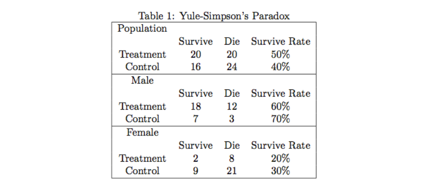

目录

- [Yule-Simpson's Paradox](#yule-simpsons-paradox)
  - [因果推断的教材](#因果推断的教材)
  - [Yule-Simpson's Paradox](#yule-simpsons-paradox-1)
  - [吸烟是否导致肺癌和健康工人效应](#吸烟是否导致肺癌和健康工人效应)
  - [结语](#结语)
- [Rubin Causal Model 和随机化试验](#rubin-causal-model-和随机化试验)
- [R.A.Fisher 和 J.Neyman 的分歧](#rafisher-和-jneyman-的分歧)
  - [Fisher randomization test](#fisher-randomization-test)
  - [Neyman repeated sampling procedure](#neyman-repeated-sampling-procedure)
- [观察性研究，可忽略性和倾向得分](#观察性研究可忽略性和倾向得分)
  - [观察性研究](#观察性研究)
- [Causal Diagram](#causal-diagram)
  - [有向无环图和 do 算子](#有向无环图和-do-算子)
  - 
- [参考](#参考)

统计之都的《因果推断简介》系列文章是 2019 年的一些旧文章，作者是伯克利统计系的老师，研究方向是因果推断，不经意间看到了这个系列，也被统计之都最近一段时间推的关于因果推断的文章标题洗脑，恰巧工作中遇到了一些数据分析的问题，感觉可以用因果推断尝试去解决一下。

# Yule-Simpson's Paradox

> 统计还能研究因果？

## 因果推断的教材

目前市面上能够买到的因果推断(causal inference)相关教科书：

* 2011 年图灵奖得主 Judea Pearl 的《Causality: Models, Reasoning, and Inference》，中文名《因果论：模型、推理、推断》
* 《因果推断与机器学习》
* 《统计因果推断入门》，

目前还没写完的：

* Harvard 的统计学家 Donald Rubin 和 计量经济学家 Guido Imbens 合著的教科书历时多年仍尚未完成
    - Donald Rubin 对 Judea Pearl 提出的因果图模型（causal diagram）非常反对，他的教科书中杜绝使用因果图模型
* Harvard 的流行病学家 James Robins 和他的同事也在写一本因果推断的教科书，本书目前只完成了第一部分，还未出版
* 统计之都系列文章的作者丁鹏的新书：[A First Course in Causal Inference](https://arxiv.org/abs/2305.18793)
    - 目前中文版还未翻译、出版，名字大概叫《因果推断基础教程》

## Yule-Simpson's Paradox

在高维列联表分析中， 有一个很有名的例子，叫做 Yule-Simpson’s Paradox。
有文献称，Karl Pearson 很早就发现了这个悖论——也许这正是他反对统计因果推断的原因。
此悖论表明，存在如下的可能性：`$X$` 和 `$Y$` 在边缘上正相关；但是给定另外一个变量 `$Z$` 后，
在 `$Z$` 的每一个水平上，`$X$` 和 `$Y$` 都负相关。Table 1 是一个数值的例子，取自 Pearl(2000)。

Table 1 中，第一个表是整个人群的数据：接受处理和对照的人都是 40 人，处理有较高的存活率，因此处理对整个人群有 “正作用”。
第二个表和第三个表是将整个人群用性别分层得到的，因为第一个表的四个格子数，分别是下面两个表对应格子数的和：

`$$20 = 18 + 2$$`
`$$20 = 12 + 8$$`
`$$16 = 7 + 9$$`
`$$24 = 3 + 21$$`

奇怪的是，处理对男性有 “负作用”，对女性也有 “负作用”。一个处理对男性和女性都有 “负作用”，但是他对整个人群却有 “正作用”：悖论产生了！

> 个人理解：
> * **Treatment** 和 **Control** 这两种对人群的处理方式是变量 `$X$`
> * **Survive Rate**(存活率)就是指变量 `$Y$`
> * 性别指的就是是变量 `$Z$`，**Male** 和  **Female** 是变量 `$Z$` 的两个水平

有人可能会认为这种现象是由于随机性或者小样本的误差导致的。但是这个现象与样本量无关，与统计的误差也无关。
比如，将上面的每个格子数乘以一个巨大的正数，上面的悖论依然存在。

纯数学的角度，上面的悖论可以写成初等数学；

`$$\frac{a}{b} < \frac{c}{d}，\frac{a'}{b'}<\frac{c'}{d'}，\frac{a+a'}{b+b'}>\frac{c+c'}{d+d'}$$`

这并无新奇之处。但是在统计上，这具有重要的意义——变量之间的相关关系可以完全的被第三个变量 “扭曲”。
更严重的问题是，我们的收集的数据可能存在局限性，忽略潜在的“第三个变量” 可能改变已有的结论，而我们常常却一无所知。
鉴于 Yule-Simpson 悖论的潜在可能，不少人认为，统计不可能用来研究因果关系。

上面的例子是人工构造的，在现实中，也存在不少的实例正是 Yule-Simpson’s Paradox：

* UC Berkeley 的著名统计学家 Peter Bickel 教授 1975 年在 Science 上发表文章，
  报告了 Berkeley 研究生院男女录取率的差异。他发现，总体上，男性的录取率高于女性，
  然而按照专业分层后，女性的录取率却高于男性 (Bickel 等 1975)
* 在流行病学的教科书 (如 Rothman 等 2008) 中，都会讲到 “混杂偏倚”（confounding bias），
  其实就是 Yule-Simpson’s Paradox，书中列举了很多流行病学的实际例子

## 吸烟是否导致肺癌和健康工人效应

由于有 Yule-Simpson’s Paradox 的存在，观察性研究中很难得到有关因果的结论，除非加上很强的假定。

一个很经典的问题：吸烟是否导致肺癌？由于我们不可能对人群是否吸烟做随机化试验，
我们得到的数据都是观察性的数据：即吸烟和肺癌之间的相关性 （正如 Table 1 的合并表）。
此时，即使我们得到了吸烟与肺癌正相关，也不能断言 “吸烟导致肺癌”。这是因为可能存在一些未观测的因素，
他既影响个体是否吸烟，同时影响个体是否得癌症。比如，某些基因可能使得人更容易吸烟，同时容易得肺癌；
存在这样基因的人不吸烟，也同样得肺癌。此时，吸烟和肺癌之间相关，却没有因果作用。

相反的，我们知道放射性物质对人体的健康有很大的伤害，但是铀矿的工人平均寿命却不比常人短；
这是流行病学中有名的 “健康工人效应”（healthy worker effect）。这样一来，似乎是说铀矿工作对健康没有影响。
但是，事实上，铀矿的工人通常都是身强力壮的人，不在铀矿工作寿命会更长。此时，在铀矿工作与否与寿命不相关，
但是放射性物质对人的健康是有因果作用的。

## 结语

这里举了一个悖论，但没有深入的阐释原因。阐释清楚这个问题的根本原因，其实就讲清楚了什么是因果推断。

# Rubin Causal Model 和随机化试验 

> Rubin Causal Model，RCM

因果推断用的最多的模型是 **Rubin Causal Model** (RCM; Rubin 1978) 和 **Causal Diagram** (Pearl 1995)。
Pearl(2000) 中介绍了这两个模型的等价性，但是就应用来看，RCM 更加精确，而 Causal Diagram 更加直观，
后者深受计算机专家们的推崇。这里主要讲了 RCM。

设 `$Z_{i}$` 表示个体 `$i$` 接受处理与否，处理取 `$1$`，对照取 `$0$`(这部分的处理变量都讨论二值的，多值的可以做相应的推广)；
`$Y_{i}$` 表示个体 `$i$` 的结果变量。另外记 `$\{Y_{i}(1), Y_{i}(0)\}$` 表示个体 `$i$` 接受处理或者对照的 **潜在结果(potential outcome)**，
那么 `$Y_{i}(1) - Y_{i}(0)$` 表示个体 `$i$` 接受治疗的 **个体因果作用**。
不幸的是，每个个体要么接受处理，要么接受对照，
`$\{Y_{i}(1), Y_{i}(0)\}$` 中必然缺失一半，个体的作用是不可识别的。
观测的结果是 `$Y_{i} = Z_{i}Y_{i}(1)+(1-Z_{i})Y_{i}(0)$`。
但是，在 `$Z$` 做随机化的前提下，我们可以识别 **总体的平均因果作用(Average Causal Effect, ACE)**：

`$$ACE(Z \rightarrow Y)=E[Y_{i}(1) - Y_{i}(0)]$$`

这是因为：

`$$\begin{align}
ACE(Z \rightarrow Y) &= E[Y_{i}(1)] - E[Y_{i}(0)] \\
&= E[Y_{i}(1) | Z_{i} = 1] - E[Y_{i}(0) | Z_{i} = 0] \\
&= E[Y_{i} | Z_{i}=1]
\end{align}$$`

最后一个等式表明 ACE 可以由观测的数据估计出来。其中第一个等式用到了期望算子的线性性（非线性的算子导出的因果度量很难被识别）；
第二个式子用到了随机化，即：`$Z \perp \{Y(1), Y(0)\}$`

> 当 `$Y$` 是二值的时候，平均因果作用是是流行病学中常用的“风险差”(risk difference, RD)：
> 
> `$$\begin{align}
> CRD(Z \rightarrow Y) &= P(Y(1) = 1) - P(Y(0) = 1) \\
> &= P(Y = 1|Z=1) - P(Y=1|Z=0)
> \end{align}$$`
> 
> 当然，流行病学还常用“风险比”(risk ratio, RR)：
> 
> `$$\begin{align}
> CRR(Z \rightarrow Y) &= \frac{P(Y(1) = 1)}{P(Y(0) = 1)} \\
> &= \frac{P(Y=1 | Z = 1)}{P(Y=1|Z=0)}
> \end{align}$$`
> 
> 和“优势比”(odds ratio, OR)：
> 
> `$$\begin{align}
> COR(Z \rightarrow Y) &= \frac{P(Y(1) = 1)P(Y(0) = 0)}{P(Y(0) = 1)P(Y(1) = 0)} \\
> &= \frac{P(Y = 1 | Z = 1)P(Y=0|Z=0)}{P(Y=1|Z=0)P(Y=0|Z=1)}
> \end{align}$$`
> 
> 上面的记号都带着“C”，是为了强调 “causal”。细心的读者会发现，
> 定义 CRR 和 COR 的出发点和 ACE 不太一样。ACE 是通过对个体因果作用求期望得到的，
> 但是 CRR 和 COR 是直接在总体上定义的。这点微妙的区别还引起了不少人的研究兴趣。
> 比如，经济学中的某些问题，受到经济理论的启示，处理的作用可能是非常数的，
> 仅仅研究平均因果作用不能满足实际问题的需要。这时候，
> 计量经济学家提出了“分位数处理作用”(quantile treatment effect，QTE)：
> 
> `$$QTE(\tau) = F_{Y(1)}^{-1}(\tau) - F_{Y(0)}^{-1}(\tau)$$`
> 
> 在随机化下，这个量也是可以识别的。但是，
> 其实这个量并不能回答处理作用异质性(heterogenous treatment effects)的问题，
> 因为处理作用非常数，最好用如下的量刻画：
> 
> `$$\Delta(\delta)=P(Y(1) - Y(0) \leq \delta)$$`
> 
> 这个量刻画的是处理作用的分布。不幸的是，估计 `$\Delta(\delta)$` 需要非常强的假定，
> 通常不具有可行性。

# R.A.Fisher 和 J.Neyman 的分歧 

> 完全随机化试验下的 Fisher randomization test 和 Neyman repeated sampling procedure。
> 简单地说，前者是随机化检验，或者如很多教科书讲的 Fisher 精确检验（Fisher exact test）；
> 后者是 Neyman 提出的置信区间 （confidence interval）理论。
> 
> 不过在 Guido Imbens 和 Donald Rubin 所写的因果推断教科书（还未出版）中，这两点内容放在了全书的开端，
> 作为因果推断的引子。在其他的教科书中，是看不到这样的讲法的。

## Fisher randomization test

Fisher 的随机化检验，针对的是如下的零假设，又被称为 sharp null：

`$$H_{0}: Y_{i}(1) = Y_{i}(0), \forall i=1, 2, \cdots, n.$$`

坦白地说，这个零假设是我见过的最奇怪的零假设，没有之一。现行的统计教科书中，讲到假设检验，
零假设都是针对某些参数的，而 Fisher 的 sharp null 看起来却像是针对随机变量的。

这里需要讲明白的是，当我们关心有限样本(finite sample)的因果作用时，每个个体的潜在结果 `$\{Y_{i}(1), Y_{i}(0)\}$` 都是固定的，
观测变量 `$Y_{i}=Z_{i}Y_{i}(1) + (1-Z_{i})Y_{i}(0)$` 的随机性仅仅由于“随机化”本身导致的。理解清楚这点，才能理解 Fisher randomization test 和后面的 Neyman repeated sampling procedure。

> 如果读者对于这种有限样本的思考方式不习惯，可以先阅读一下经典的抽样调查教科书，
> 那里几乎全是有限样本的理论，所有的随机性都来自于随机采样的过程。

如果认为潜在结果是固定的数，那么 Fisher sharp null 就和现行的假设检验理论不相悖。
这个 null 之所以“sharp”的原因是，在这个零假设下，所有个体的潜在结果都固定了，
个体的因果作用为零，唯一的随机性来自于随机化的“物理”特性。定义处理分配机制的向量为：

`$$\overrightarrow{Z}=(Z_{1}, \cdots, Z_{n})$$`

结果向量为：

`$$\overrightarrow{Y}=(Y_{1}, \cdots, Y_{n})$$`

此时，有限样本下的随机化分配机制如下定义：

`$$P(\overrightarrow{Z}|\overrightarrow{Y}) = 
\left(
\begin{array}{l}
n \\
m 
\end{array}\right)^{-1}, \forall\overrightarrow{Y}$$`

其中：`$m=\sum_{i=1}^{n}Z_{i}$` 为处理组中的总数。这里的“条件期望”并不是说 `$\overrightarrow{Y}$` 是随机变量，而是强调处理的分配机制不依赖于潜在结果。比如，我们选择统计量：

`$$T=T(\overrightarrow{Z}, \overrightarrow{Y})=\frac{1}{m}\sum_{i=1}^{n}Z_{i}Y_{i}-\frac{1}{n-m}\sum_{i=1}^{n}(1-Z_{i}Y_{i})$$`

来检验零假设，问题在于这个统计量的分布不易求出。但是，我们又知道，
这个统计量的分布完全来自随机化。因此，我们可以用如下的“随机化”方法（Monte Carlo 方法模拟统计量的分布）：将处理分配机制的向量进行随机置换得到 `$\overrightarrow{Z}^{1}=(Z_{1}^{1}, Z_{2}^{1}), \cdots, Z_{n}^{1}$`，计算此时的检验统计量 `$T^{1}=T(\overrightarrow{Z}^{1}, \overrightarrow{Y})$`；如此重复多次，`$n$` 不大时，可以穷尽所有的置换，便可以模拟出统计量在零假设下的分布，计算出 `$p$` 值。

有人说，Fisher randomization test 已经蕴含了 bootstrap 的思想，似乎也有一定的道理。
不过，这里随机化的方法是针对一个特例提出来的。

## Neyman repeated sampling procedure

下面要介绍的 Neyman 的方法，其实早于 Fisher 的方法。这种方法在 Neyman 1923 年的博士论文中，正式提出了。这种方法假定 `$n$` 个个体中有 `$m$` 个随机的接受处理，
目的是估计（有限）总体的平均因果作用：

`$$\tau =\frac{1}{n}\sum_{i=1}^{n}\{Y_{i}(1) - Y_{i}(0)\}$$`

一个显然的无偏估计量是：

`$$\hat{\tau}=\bar{y}_{1} - \bar{y}_{0} = \frac{1}{m}\sum_{i=1}^{n}Z_{i}Y_{i}-\frac{1}{n-m}\sum_{i=1}^{n}(1-Z_{i})Y_{i}$$`

但是，通常的方差估计量

`$$\hat{Var}(\hat{\tau})=\underset{Z_{i}=1}{\sum}\frac{(Y_{i}-\bar{y}_{1})^{2}}{(m-1)m} + \underset{Z_{i}=0}{\sum}\frac{(Y_{i}-\bar{y}_{0})^{2}}{(n-m-1)(n-m)}$$`

高估了方差，构造出来的置信区间在 Neyman-Pearson 意义下太“保守”。可以证明，在个体处理作用是常数的假定下，上面的方差估计是无偏的。

通常的教科书讲假设检验，都是从正态均值的检验开始。Neyman 的方法给出了 `$\tau$` 的点估计和区间估计，也可以用来检验如下的零假设：

`$$H_{0}: \tau=0$$`

实际中，到底是 Fisher 和零假设合理还是 Neyman 的零假设合理，取决于具体的问题。
比如，我们想研究某项政策对于中国三十多个省的影响，这是一个有限样本的问题，因为我们很难想象中国的省是来自某个“超总体”。
但是社会科学中的很多问题，我们不光需要回答处理或者政策对于观测到的有限样本的作用，我们更关心这种处理或者政策对于一个更大总体的影响。
前者，Fisher 的零假设更合适，后者 Neyman 的零假设更合适。

关于这两种角度的争论，可以上述到 Fisher 和 Neyman 两人。1935 年，
Neyman 向英国皇家统计学会提交了一篇论文 “Statistical problems in agricultural experimentation”，
Fisher 和 Neyman 在讨论文章时发生了激烈的争执。不过，从今天的统计教育来看，Neyman 似乎占了上风。

# 观察性研究，可忽略性和倾向得分 

和之前的假设一样，`$Z$` 表示处理变量（1 是处理，0 是对照），`$Y$` 表示结果，
`$X$` 表示处理前的协变量。在完全随机化的试验中，可忽略性 `$Z \perp \{Y(1), Y(0)\}$` 成立，
这保证了平均因果作用 `$ACE(Z \rightarrow Y) = E[Y(1) - Y(0)] = E[Y|Z=1] - E[Y|Z=0]$` 可以表示成观测数据的函数，
因此可以识别。在某些试验中，我们“先验的”知道某些变量与结果强相关，因此要在试验中控制他们，以减少试验的方差。
在一般的有区组(blocking)的随机化试验中，更一般的可忽略性 `$Z\perp \{Y(1), Y(0)\} | X$` 成立，
因为只有在给定协变量 `$X$` 后，处理的分配机制才是完全随机化的。比如，男性和女性中，接受处理的比例不同，
但是这个比例是事先给定的。

在传统的农业和工业试验中，由于随机化，可忽略性一般是能够得到保证的；
因此在这些领域谈论因果推断是没有太大问题的。Jerzy Neyman 最早的博士论文，就研究的是农业试验。
但是，这篇写于 1923 年的重要统计学文章，迟迟没有得到统计学界的重视，
也没有人将相关方法用到社会科学的研究中。1970 年代，Donald Rubin 访问 UC Berkeley 统计系，
已退休的 Jerzy Neyman 曾问起：为什么没有人将潜在结果的记号用到试验设计之外？
正如 Jerzy Neyman 本人所说 “without randomization an experiment has little value irrespective of the subsequent treatment（没有随机化的试验价值很小）”，
人们对于观察性研究中的因果推断总是抱着强烈的怀疑态度。我们经常听到这样的声音：统计就不是用来研究因果关系的！

> 在讲 Yule-Simpson 悖论的评论中，有人提到了哲学(史)上的休谟问题（我的转述）：人类是否能从有限的经验中得到因果律？这的确是一个问题，
> 这个问题最后促使德国哲学家康德为调和英国经验派(休谟)和大陆理性派(莱布尼兹-沃尔夫)而写了巨著《纯粹理性批判》。
> 其实，如果一个人是绝对的怀疑论者(如休谟)，他可能怀疑一切，甚至包括因果律，所以，康德的理论也不能完全“解决”休谟问题。
> 怀疑论者是无法反驳的，他们的问题也是无法回答的。他们存在的价值是为现行一切理论起到警示作用。
> 一般来说，统计学家不会从过度哲学的角度谈论问题。从前面的说明中可以看出，统计中所谓的“因果”是“某种”意义的“因果”，
> 即统计学只讨论“原因的结果”，而不讨论“结果的原因”。前者是可以用数据证明或者证伪的；后者是属于科学研究所探索的。
> 用科学哲学家卡尔·波普的话来说，科学知识的积累是“猜想与反驳”的过程：“猜想”结果的原因，再“证伪”原因的结果；
> 如此循环即科学。

## 观察性研究

下面谈到的是，在什么样的条件下，观察性研究也可以推断因果。这是一切社会科学所关心的问题。
答案是：可忽略性，即 `$Z\perp \{Y(1), Y(0)\} | X$`。在可忽略性下，`$ACE$` 可以识别，
因为

`$$\begin{align}
ACE = E[] 
\end{align}$$`

# Causal Diagram

> Causal Diagram，因果图

## 有向无环图和 do 算子

## 

# 参考

* [统计之都-因果推断系列文章](https://mp.weixin.qq.com/mp/appmsgalbum?__biz=MjM5NDQ3NTkwMA==&action=getalbum&album_id=2515660787328253953&scene=173&from_msgid=2650147649&from_itemidx=1&count=3&nolastread=1#wechat_redirect)
* [因果推断的统计方法](https://cosx.org/2022/10/causality-statistical-method/)
